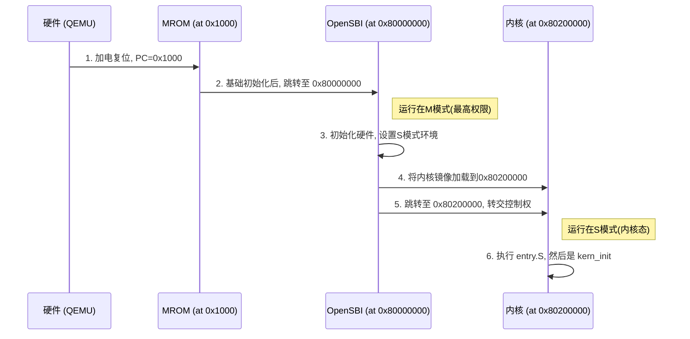
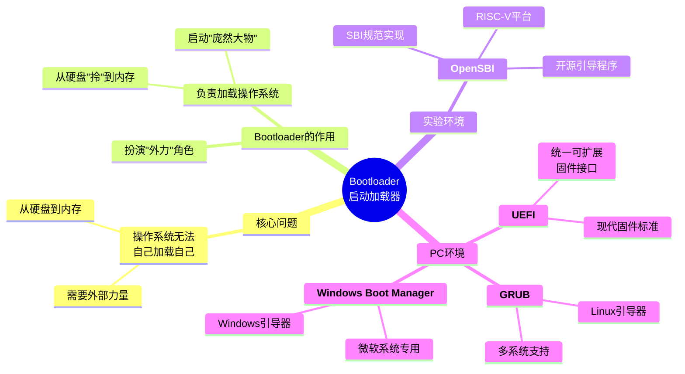
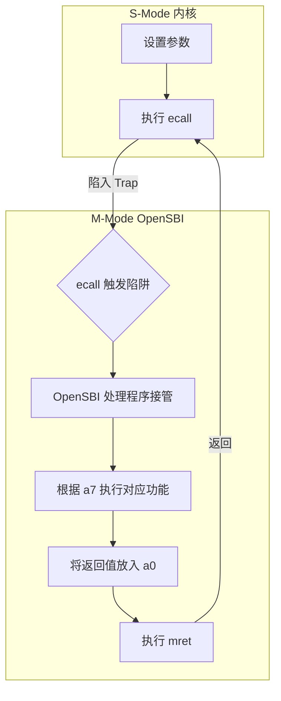

好的，我们继续。你已经成功搭建了实验环境，现在我们将进入Lab1，构建一个最小的、能“说话”的操作系统内核。我将继续以顶级教学专家的身份，为你庖丁解牛，带你完成这个实验。

这篇指南将完全覆盖你提供的实验手册，不仅解答其中的练习题，更会深入剖析背后的核心原理，确保你知其然，更知其所以然。

### Slide Coverage Matrix (章节覆盖矩阵)

我已将你的实验手册内容解构为逻辑上的“幻灯片”单元，以确保完全、无遗漏地覆盖所有知识点。

| 单元 (Slide) # | 原始主题/章节             | 关键术语/概念                                                                                  | 主文本锚点 (章节/知识卡/图表)                            | 覆盖状态      |
| :----------- | :------------------ | :--------------------------------------------------------------------------------------- | :------------------------------------------- | :-------- |
| `S01`        | 实验引言 & 目的           | “麻雀骨架”比喻, 最小内核, QEMU启动流程, 内存布局, OpenSBI                                                  | 1. 学习路线图, 3.1. Lab1核心目标                      | ✅ Covered |
| `S02`        | 学习目标 & 练习           | 链接脚本, 交叉编译, OpenSBI加载, 格式化输出, 练习1 & 2                                                    | 2. 核心知识地图, 5. 动手实践：攻克练习                      | ✅ Covered |
| `S03`        | 实验报告要求 & 拓展         | Markdown报告, 知识点总结, 现代笔记本启动流程 (UEFI/GRUB)                                                 | 5.3. 实验报告指导, 知识卡：Bootloader                  | ✅ Covered |
| `S04`        | Lab1项目组成            | `Makefile`, `kern`, `libs`, `tools`, `entry.S`, `init.c`, `kernel.ld`                    | 3.2. 项目代码导览                                  | ✅ Covered |
| `S05`        | 内核执行流               | 加电(0x1000) -> OpenSBI(0x80000000) -> 内核(0x80200000)                                      | 3.3. 内核启动全流程解析, [Fig·S05-1]                  | ✅ Covered |
| `S06`        | Bootloader概念        | Bootloader作用, 为何需要独立程序加载OS, ROM/NOR Flash                                                | 知识卡：Bootloader                               | ✅ Covered |
| `S07`        | OpenSBI & RISC-V特权级 | 固件(Firmware), M/S/U模式, 复位地址(0x1000), 0x80000000的由来                                       | 知识卡：RISC-V特权级与SBI, [Fig·S07-1]               | ✅ Covered |
| `S08`        | 内核加载地址 & 地址相关性      | 0x80200000, 地址相关代码 vs 地址无关代码                                                             | 知识卡：地址相关性                                    | ✅ Covered |
| `S09`        | ELF vs. BIN 文件格式    | ELF(Executable and Linkable Format), BIN(Binary), .bss段的区别                               | 知识卡：文件格式 (ELF vs. BIN)                       | ✅ Covered |
| `S10`        | 内存布局 & 链接脚本         | `.text`, `.rodata`, `.data`, `.bss`, 链接器`ld`, `kernel.ld`                                | 知识卡：内存布局与链接脚本, [Fig·S10-1]                   | ✅ Covered |
| `S11`        | 链接脚本详解              | `OUTPUT_ARCH`, `ENTRY`, `BASE_ADDRESS`, `SECTIONS`, `.`, `ALIGN`, `PROVIDE`              | 知识卡：内存布局与链接脚本                                | ✅ Covered |
| `S12`        | 入口点代码 (`entry.S`)   | `kern_entry`, `la sp, bootstacktop`, `tail kern_init`, `.section`, `.globl`, `bootstack` | 5.1. 练习1：剖析内核入口 `entry.S`, [Fig·S12-1]       | ✅ Covered |
| `S13`        | C语言入口 (`init.c`)    | `kern_init`, `__attribute__((noreturn))`, 清理.bss段, `edata`, `end`, `cprintf`             | 4.2. C语言的起点：`kern_init`                      | ✅ Covered |
| `S14`        | 从SBI到stdio (I/O栈)   | `ecall`, SBI调用约定, 内联汇编, `sbi_call`, 逐层封装                                                 | 知识卡：RISC-V特权级与SBI, 4.3. I/O栈的构建, [Fig·S14-1] | ✅ Covered |
| `S15`        | 辅助代码文件              | `defs.h`, `riscv.h`, `read_csr`, `write_csr`                                             | 4.3. I/O栈的构建                                 | ✅ Covered |
| `S16`        | 编译与运行 (Makefile)    | `make`, `Makefile`基本规则, `make qemu`, `objcopy`                                           | 4.4. 编译、链接与运行                                | ✅ Covered |
| `S17`        | GDB调试准备             | 远程调试, `tmux`, `make debug`, `make gdb`                                                   | 知识卡：GDB远程调试, 5.2. 练习2：GDB调试入门                | ✅ Covered |
| `S18`        | GDB核心命令             | `b`, `c`, `i r`, `si`, `bt`, `x`, 调试流程                                                   | 5.2. 练习2：GDB调试入门                             | ✅ Covered |

---

### 1. 学习路线图 (Learning Roadmap)

本次实验我们将化身“外科医生”，解剖这只名为“操作系统”的麻雀，只保留其骨架，并让它“开口说话”。

1.  **理论先行 (约30分钟阅读):**
    *   **理解启动流程:** 搞清楚从按下电源（虚拟的）到我们的内核代码第一行，CPU究竟经历了怎样的“接力赛”。
    *   **掌握内存蓝图:** 学习链接脚本如何像建筑师一样，规划我们的内核在内存中的精确布局。
    *   **洞悉特权之别:** 明白RISC-V的特权级，以及为何内核需要通过`ecall`向更高权限的OpenSBI“请求服务”。

2.  **代码巡礼 (约20分钟阅读):**
    *   我们将一起检视构成“麻雀骨架”的几个关键文件：`entry.S` (汇编入口)，`init.c` (C代码入口)，`kernel.ld` (链接脚本)，以及构建`cprintf`的层层封装代码。

3.  **编译运行 (约5分钟操作):**
    *   体验`Makefile`的魔力，用一条`make qemu`命令完成编译、链接、生成镜像并启动模拟器的全过程。

4.  **动手实践 (约45分钟操作与思考):**
    *   **练习1:** 深入分析入口汇编代码，理解内核栈是如何建立的。
    *   **练习2:** 首次体验GDB，像侦探一样跟踪从硬件复位到内核启动的每一步，揭开系统启动的神秘面纱。

**总计时间:** 约 1 小时 40 分钟。

---

### 2. 核心知识地图 (Core Knowledge Map)

```
I. Lab1: 最小内核 ("麻雀骨架")
   ├── A. 理论基石
   │   ├── 1. 启动接力赛 (Boot Flow) [S05]
   │   │    └── QEMU Reset(0x1000) -> OpenSBI(0x80000000) -> Kernel(0x80200000)
   │   ├── 2. 内存建筑学 (Linking & Layout) [S10]
   │   │    ├── 内存分段 (.text, .data, .bss)
   │   │    └── 链接脚本 (kernel.ld): 指挥链接器进行内存布局
   │   └── 3. 跨越权限的对话 (Privilege & SBI) [S07, S14]
   │        ├── RISC-V特权级 (M/S/U)
   │        └── ecall: S模式内核调用M模式固件服务的唯一途径
   │
   ├── B. 代码剖析
   │   ├── 1. 第一步：汇编入口 (entry.S) [S12]
   │   │    └── 核心任务：建立内核栈
   │   ├── 2. 第二步：C语言入口 (init.c) [S13]
   │   │    └── 核心任务：清理.bss段, 打印启动信息
   │   └── 3. “说话”的能力：I/O栈构建 [S14]
   │        └── cprintf -> ... -> sbi_call -> ecall
   │
   └── C. 实践与调试
       ├── 1. 一键构建 (Makefile) [S16]
       │    └── make qemu: 编译 -> 链接 -> 生成镜像 -> 运行
       └── 2. 神探工具 (GDB) [S17, S18]
            ├── 远程调试原理
            ├── 核心命令: b, c, si, i r, x
            └── 解决练习2
```

---

### 3. Lab1深度解析

#### 3.1. Lab1核心目标：打造“麻雀骨架” `[S01]`

现代操作系统如Linux有数百万行代码，过于庞大。我们的策略是**化整为零**。Lab1的目标是构建一个最简单的内核，它只做两件事：
1.  成功被Bootloader加载并获得CPU控制权。
2.  在屏幕上打印一条信息，证明它“活了”。
3.  进入死循环，保持运行状态。

这个“麻雀骨架”虽然简单，但它包含了操作系统启动所必需的所有核心要素：**启动流程对接、内存布局规划、底层I/O交互**。后续实验将在这个骨架上逐步添加血肉（内存管理、进程、文件系统等）。

#### 3.2. 项目代码导览 `[S04]`

我们只关注Lab1最核心的几个文件：

| 文件路径 | 作用 | 核心看点 |
| :--- | :--- | :--- |
| **`tools/kernel.ld`** | **链接脚本 (内存蓝图)** | 指定内核加载地址`0x80200000`，定义代码段、数据段的顺序。 |
| **`kern/init/entry.S`** | **汇编入口 (第一条指令)** | `kern_entry`标签，建立内核栈，跳转到C函数。 |
| **`kern/init/init.c`** | **C语言入口 (主函数)** | `kern_init`函数，执行内核的初始化C代码，打印信息。 |
| **`libs/sbi.c`** | **SBI调用封装** | 实现`sbi_call`，使用内联汇编执行`ecall`指令。 |
| **`Makefile`** | **自动化构建脚本** | `make qemu`命令背后的总指挥，协调编译、链接、运行。 |

其他如`driver`, `mm`, `trap`等目录下的文件，在Lab1中大多是占位符或基础实现，我们将在后续实验中深入。

#### 3.3. 内核启动全流程解析 `[S05]`

这是一场从硬件到软件的“三级跳”接力赛，每个地址都至关重要：

`[Fig·S05-1]`

**图 `[Fig·S05-1]` 解读:** 该图清晰展示了QEMU中RISC-V系统的启动顺序。从硬件复位地址`0x1000`开始，控制权依次传递给MROM、OpenSBI固件，最后由OpenSBI将内核加载到指定地址`0x80200000`并跳转执行，完成启动。

---

### 4. 核心知识卡片

现在，我们来深入学习那些对初学者来说最关键、也最容易混淆的概念。

#### 知识卡 5: Bootloader (引导加载程序)

*   **它解决了什么问题 (直观解释)** `[S06]`
    > 操作系统本身是个庞大的软件，存储在硬盘上。但CPU一上电，它既不知道硬盘是什么，也不知道如何读取。它就像一个刚睡醒的人，大脑一片空白。Bootloader就是那个“闹钟”加“备忘录”，它是一段预先存在于特殊芯片(ROM)上的小程序。CPU一上电就强制运行它。它的唯一任务就是：教会CPU如何读取硬盘，找到操作系统内核，把它加载到内存，然后喊一声“该你上了！”，就把控制权交给操作系统。

*   **前置知识**
    *   知道程序需要从硬盘加载到内存才能运行。
    *   CPU只能直接执行内存中的指令。

*   **类比 / 直觉** `[S03]`
    > **你不能自己把自己从地上拎起来。** 操作系统不能自己加载自己。Bootloader就是那个外力，负责把操作系统这个“庞然大物”从硬盘“拎”到内存中。在我们的实验中，**OpenSBI** 就扮演了这个角色。在你的PC上，这个角色由 **UEFI + GRUB/Windows Boot Manager** 共同扮演。



*   **官方/正式声明 (严谨)** `[S06]`
    > Bootloader是在操作系统内核运行之前执行的一段代码。它的主要职责是初始化足够多的硬件（如内存控制器、存储设备驱动），以便将操作系统内核从非易失性存储（如硬盘、Flash）加载到主内存（RAM）中，并随后将CPU的执行控制权转移给内核。

*   **一句话总结**
    > Bootloader是操作系统的“接生婆”，负责在系统启动时将其安全地带入内存并唤醒。

*   **自我检查 (3个问题)**
    1.  **判断题:** 操作系统内核是计算机加电后运行的第一段软件。(错误，Bootloader/固件先运行)
    2.  **选择题:** 在我们的实验中，哪个软件充当了Bootloader的角色？ (B)
        A. QEMU
        B. OpenSBI
        C. GDB
    3.  **开放题:** 为什么Bootloader通常存放在ROM或Flash芯片中，而不是硬盘的普通区域？
```
- **CPU上电后只能从固定的复位向量地址取指令**，这个地址通常映射到ROM/Flash，而不是硬盘。
    
- **ROM/Flash可直接被CPU访问**，不需要驱动；但硬盘/SSD 访问必须依赖控制器和驱动，而驱动本身还没加载。
    
- 因此，Bootloader必须放在ROM/Flash中，让CPU能立即执行第一段启动代码，然后再初始化硬盘，去加载操作系统。
```
---

#### 知识卡 6: RISC-V特权级与SBI

*   **它解决了什么问题 (直观解释)** `[S07]`
    > 想象一个国家有三个阶层：**平民 (User mode)**、**政府官员 (Supervisor mode)** 和 **皇帝 (Machine mode)**。平民不能直接动用国库，官员不能调动皇家卫队。层层设防是为了安全。RISC-V的特权级也是如此，它通过硬件强制隔离，防止应用程序（平民）破坏操作系统内核（官员），也防止内核破坏最底层的固件（皇帝）。

*   **官方/正式声明 (严谨)** `[S07]`
    > RISC-V定义了多个特权级别以提供硬件级别的保护。
    *   **M-mode (Machine):** 最高权限，直接访问所有硬件。固件(Firmware)如OpenSBI运行于此。
    *   **S-mode (Supervisor):** 次高权限，用于运行操作系统内核。可以管理内存、处理中断。
    *   **U-mode (User):** 最低权限，用于运行应用程序。访问硬件和关键内存区域受限。

*   **关键结果: `ecall` (环境调用)** `[S14]`
    > 当低权限代码需要高权限代码提供服务时（例如，内核想在屏幕上输出字符，而I/O控制权在M模式的OpenSBI手中），它不能直接调用函数。它必须执行一条特殊指令：`ecall`。
    > `ecall` 像一个“上访”指令。当S模式的内核执行`ecall`，CPU会暂停内核，切换到M模式，然后执行OpenSBI预设好的服务程序。服务完成后，再通过`mret`指令返回S模式，继续执行内核。这个过程被称为**陷阱(Trap)**。

*   **内联图示** `[Fig·S07-1]`

    
**图 `[Fig·S07-1]` 解读:** 该图展示了内核(S-mode)通过`ecall`调用OpenSBI(M-mode)服务的完整流程。这是一个受控的、安全的权限提升过程，是操作系统与底层固件交互的基础。

*   **一句话总结**
    > RISC-V用M/S/U三种硬件特权级构建保护壁垒，`ecall`是低权限代码向高权限代码请求服务的官方“窗口”。

*   **自我检查 (3个问题)**
    1.  **判断题:** 我们的ucore内核代码运行在M模式。(错误，运行在S模式)
    2.  **选择题:** 内核调用`sbi_console_putchar`函数最终依赖哪条指令来完成字符输出？ (C)
        A. `call`
        B. `jalr`
        C. `ecall`
    3.  **开放题:** 为什么不让操作系统内核直接运行在最高权限的M模式？
```
操作系统内核不直接运行在 **M 模式**，而是运行在 **S 模式**，原因是：

1. **M 模式用于底层固件**（初始化、安全控制），权限过高不适合内核长期运行；
    
2. **S 模式足够管理内存和进程**，还能保持对应用（U 模式）的隔离；
    
3. 这样分层能提高 **安全性、可移植性和扩展性**。
    

所以 M 模式更像“硬件固件层”，而 S 模式才是操作系统的理想运行环境。
```
---

#### 知识卡 7: 内存布局与链接脚本 `[S10, S11]`

*   **它解决了什么问题 (直观解释)**
    > 编译完C代码后，我们得到一堆`.o`文件，每个文件都像一个乐高零件（函数、全局变量等）。链接器`ld`的任务是把这些零件拼成一个完整的模型（可执行文件）。但是，怎么拼？哪个零件放哪里？**链接脚本 (`kernel.ld`) 就是那张最终模型的“拼装图纸”**。它精确地告诉链接器：把所有代码(`.text`)放在最前面，地址从`0x80200000`开始；接着放只读数据(`.rodata`)；再放已初始化的全局变量(`.data`)……

*   **官方/正式声明 (严谨)** `[S10]`
    > 链接脚本是一个控制链接器(`ld`)行为的文本文件。它定义了输入的目标文件(`*.o`)中的节(sections)如何被映射到输出文件(ELF)的节中，并规定了输出文件中各个节的内存地址（虚拟地址和加载地址）。对于操作系统内核这种需要精确控制内存布局的裸机程序，链接脚本是必不可少的。

*   **关键结果: 解读 `kernel.ld`** `[S11]`
    *   `ENTRY(kern_entry)`: 告诉链接器，程序的入口点是`kern_entry`这个符号（函数）。
    *   `BASE_ADDRESS = 0x80200000;`: 定义内核的起始加载地址。
    *   `SECTIONS { ... }`: 定义内存布局的核心部分。
    *   `. = BASE_ADDRESS;`: `.`是“当前地址”计数器，这句话把计数器设置到起始地址。
    *   `.text : { *(.text.kern_entry) *(.text) }`: 定义一个名为`.text`的输出段。花括号里的`*(.text)`是一个通配符，表示把所有输入文件中的`.text`段都合并到这里。我们特意把`kern_entry`所在段放在最前面，确保它是内核的第一条指令。
    *   `PROVIDE(end = .);`: 创建一个名为`end`的符号，它的值等于当前地址，即所有代码和数据之后的位置。C代码可以引用这个符号。

*   **内联图示** `[Fig·S10-1]`
    ```
    输入文件 (多个 .o)        链接脚本 (kernel.ld)        输出文件 (kernel ELF)
    +-----------+
    | init.o    |             . = 0x80200000;
    | .text     |                                      --->  +-----------------+ 0x80200000
    | .data     |             .text: { *(.text) }            | .text section   |
    +-----------+                                            | (所有代码)      |
                                                             +-----------------+
    +-----------+             .rodata: { *(.rodata) }  --->  | .rodata section |
    | stdio.o   |                                            +-----------------+
    | .text     |            .data: { *(.data) }       --->  | .data section   |
    | .rodata   |                                            +-----------------+
    +-----------+             .bss: { *(.bss) }        --->  | .bss section    |
       ...                                                   +-----------------+
    ```
    **图 `[Fig·S10-1]` 解读:** 链接器根据`kernel.ld`脚本的指示，像归类整理一样，将所有输入`.o`文件中的同名段（如`.text`）收集起来，合并成一个大的输出段，并将其放置在指定的内存地址上。

*   **一句话总结**
    > 链接脚本是指导链接器如何组织代码和数据的“建筑蓝图”，确保程序在内存中有一个可预测的、正确的布局。

*   **自我检查 (3个问题)**
    1.  **判断题:** 如果没有链接脚本，链接器就无法工作。(错误，它会使用一个不适合内核的默认脚本)
    2.  **选择题:** 内核的第一条指令地址是由哪个文件决定的？ (A)
        A. `tools/kernel.ld`
        B. `kern/init/init.c`
        C. `Makefile`
    3.  **开放题:** `kern_init`函数中清理`.bss`段时，`edata`和`end`这两个地址从何而来？

---

#### 知识卡 8: GDB远程调试

*   **它解决了什么问题 (直观解释)** `[S17]`
    > 调试一个正在运行的操作系统内核，就像给一架正在飞行的飞机更换引擎，你不能直接停下它。远程调试就是解决方案：我们让飞机(QEMU)在驾驶舱里开一个“维修接口”(网络端口1234)，并让它在起飞后立刻“悬停”(`-S`参数)。然后，我们在地面控制站(另一个终端)启动GDB，通过一根“虚拟电缆”(网络连接)连上飞机的维修接口。从此，地面站就可以完全控制飞机，检查它的仪表(寄存器)，单步推进它的引擎(执行指令)，甚至修改它的零件(内存)。

*   **官方/正式声明 (严谨)** `[S17]`
    > GDB远程调试是一种客户端-服务器调试模型。QEMU作为GDB服务器（或称为stub），它运行目标程序（内核），并监听一个TCP端口。GDB作为客户端，通过该端口连接到服务器。连接建立后，GDB可以通过远程串行协议(RSP)向QEMU发送命令（如设置断点、读取寄存器），QEMU执行这些命令并返回结果。这种方式将调试器与目标程序解耦，是嵌入式系统和操作系统内核调试的标准方法。

*   **关键结果: `make debug` & `make gdb`** `[S18]`
    *   `make debug` -> 启动QEMU作为**服务器**。
        *   `-S`: 启动后CPU立刻**冻结**，等待GDB的`continue`命令。
        *   `-s`: 是 `-gdb tcp::1234` 的简写，在1234端口**监听**GDB连接。
    *   `make gdb` -> 启动GDB作为**客户端**。
        *   `file bin/kernel`: 加载内核的ELF文件以获取**符号信息**(函数名、变量名)。
        *   `target remote localhost:1234`: **连接**到本机1234端口上等待的QEMU。

*   **一句话总结**
    > GDB远程调试通过网络将调试器(GDB)和被调试程序(在QEMU中运行的内核)分离，实现对无法直接运行调试器的目标系统进行完全控制。

*   **自我检查 (3个问题)**
    1.  **判断题:** `make debug`命令会直接开始运行内核代码。(错误，`-S`使其暂停)
    2.  **选择题:** 在GDB中，`target remote localhost:1234`命令的作用是？ (C)
        A. 加载内核符号
        B. 设置断点
        C. 连接到正在运行的QEMU实例
    3.  **开放题:** 为什么调试内核需要加载`bin/kernel`这个ELF文件，而不是直接调试最终的`bin/ucore.img`？
```
- **内核源码 ↔ 二进制指令** 的映射关系只保存在 ELF (`bin/kernel`) 里。
    
- **镜像文件**只是运行载体，丢掉了符号和行号信息，不适合源码级调试。
```
---

### 5. 动手实践：攻克练习

现在，我们将运用所学知识，解决实验手册中的两个核心练习。

#### 5.1. 练习1：剖析内核入口 `entry.S` `[S12]`

**问题1: `la sp, bootstacktop` 完成了什么操作，目的是什么？**

*   **回答:**
    *   **操作:** `la sp, bootstacktop` 是一条伪指令，它的全称是 "Load Address"。这条指令的作用是将 `bootstacktop` 这个符号的**地址**加载到 `sp` (Stack Pointer) 寄存器中。
    *   **目的:** 这条指令的目的是**初始化内核栈**。在C语言函数运行之前，必须有一个合法的栈空间。`sp`寄存器必须指向一块可用的内存区域，用于存储函数调用的返回地址、局部变量等。`bootstacktop`被定义为我们预留的内核栈空间的**顶部（高地址）**，因为栈在RISC-V中是向下（向低地址）生长的。通过将`sp`指向这里，我们就为即将调用的第一个C函数 `kern_init` 准备好了运行所需的栈。

*   **深度剖析:**
    在`entry.S`的`.data`段中，我们定义了栈空间：
    ```assembly
    .global bootstack
    bootstack:
        .space KSTACKSIZE  # 预留 KSTACKSIZE 字节的空间
    .global bootstacktop
    bootstacktop:         # bootstacktop 标签就在这块空间的末尾
    ```
    内存布局如下 `[Fig·S12-1]`：
    ```
        低地址  ^
                |
    bootstack ->+-----------------+  <-- 栈
                |                 |
                |   KSTACKSIZE    |
                |     字节        |
                |                 |
    bootstacktop->+-----------------+  <-- 栈顶, sp初始指向这里
                |
        高地址  v
    ```
    **图 `[Fig·S12-1]` 解读:** 内核栈是一块预留的静态内存。`bootstack`是其起始（低）地址，`bootstacktop`是其末尾（高）地址。`la sp, bootstacktop`将栈指针`sp`初始化到这块区域的最高地址，为后续的`push`操作或函数调用栈帧分配做好了准备。

**问题2: `tail kern_init` 完成了什么操作，目的是什么？**

*   **回答:**
    *   **操作:** `tail kern_init` 是一条伪指令，它会被汇编器翻译成一条无条件的**跳转**指令 (`jal` 或 `jr`)，直接跳转到 `kern_init` 函数的地址开始执行。
    *   **目的:** 它的核心目的是**将CPU的控制权从汇编代码 (`entry.S`) 转移到C代码 (`init.c`)**。
    *   **与`call`的区别:** `tail`是一种**尾调用优化**。普通的函数调用`call`会把返回地址压入栈中，以便函数返回时能回到调用者的下一条指令。但在这里，`kern_entry`的任务已经完成，它**永远不期望`kern_init`返回**。使用`tail`（跳转）而不是`call`，就不会在栈上保留`kern_entry`的返回信息，相当于直接用`kern_init`的栈帧**替换**了`kern_entry`的栈帧（实际上`kern_entry`几乎没有栈帧），既节省了栈空间，也使得函数调用栈更清晰，因为`kern_init`成为了调用栈的第一个函数，这是符合逻辑的。

#### 5.2. 练习2：GDB调试入门 `[S17, S18]`

**问题: RISC-V 硬件加电后最初执行的几条指令位于什么地址？它们主要完成了哪些功能？**

*   **调试过程记录:**
    1.  **环境准备:** 打开终端，使用`tmux`创建一个会话，并用`Ctrl+B %`分割成左右两个窗格。
    2.  **启动QEMU (服务器):** 在**左侧**窗格输入 `make debug`。QEMU会启动并暂停，等待GDB连接。（使用`Ctrl+B 方向键`进行切换窗口）
        ```bash
        # 左侧窗格
        make debug
        ... (QEMU启动信息，但不会有内核输出)
        ```
    3.  **启动GDB (客户端):** 在**右侧**窗格输入 `make gdb`。GDB会启动并自动连接到QEMU。
        ```bash
        # 右侧窗格
        make gdb
        ... (GDB启动信息)
        Remote debugging using localhost:1234
        0x0000000000001000 in ?? ()
        (gdb) 
        ```
        
![[Pasted image 20251003152555.png]]如果遇到如图报错，不用慌张，重新来一遍即可。成功启动啦：![[Pasted image 20251003153811.png]]
    4.  **观察初始位置:** GDB明确告诉我们，程序暂停在地址 **`0x1000`**。这就是RISC-V硬件加电后执行的第一条指令的地址。
    5.  **探索初始代码:** 在`0x1000`处，我们无法看到源码，因为这是QEMU内置的MROM代码。我们可以使用`si`（Step Instruction）单步执行几条汇编指令，或者使用`x/10i 0x1000`反汇编该地址处的代码，观察其行为。
		 - x 是 examine（查看内存）。
		 - /10 是要显示的条数。
		 - i 是以“指令”的格式显示（反汇编）。
（预计看到）
```gdb
(gdb) x/5i 0x1000
   0x1000:	auipc	t0,0x0
   0x1004:	addi	t0,t0,32 # 0x1020
   0x1008:	csrw	mtvec,t0
   0x100c:	li	t0,770
   0x1010:	csrw	mstatus,t0

```
实际看到：
![[Pasted image 20251003154319.png]]
- 这段代码（详细解释请点击此处）把当前 PC 作为基址（auipc），计算出某个数据/参数地址放到 a1（addi），把 hart id 放到 a0（csrr），然后从 PC 相对的某个位置加载一个函数/入口地址（ld），最后跳转到该入口（jr）。换句话说，这是一个典型的 boot/跳转 trampoline：准备好参数（a0、a1），读取要跳去的入口指针，然后跳转执行该入口，通常用于固件/引导代码把控制权交给下一级启动代码或操作系统入口。
    6.  **跳转到内核:** 为了验证启动流程，我们直接在内核入口`0x80200000`设置断点，然后继续执行。下面是预计情况


        ```gdb
        (gdb) b *0x80200000
        Breakpoint 1 at 0x80200000: file kern/init/entry.S, line 7.
        (gdb) c
        Continuing.

        Breakpoint 1, kern_entry () at kern/init/entry.S:7
        7           la sp, bootstacktop
        (gdb) 
        ```
        实际情况：![[Pasted image 20251003155314.png]]
        程序成功停在了我们的内核入口，地址也完全正确。这验证了从`0x1000`开始的固件最终成功跳转到了`0x80200000`。

*   **观察结果与答案:**
    *   **初始地址:** RISC-V硬件（由QEMU模拟）加电后，PC被强制设为复位地址 **`0x1000`**，从这里开始执行第一条指令。
    *   **主要功能:** 位于 0x1000 的代码是 QEMU 内置的一小段 MROM（Machine ROM）trampoline。它的功能非常简洁：将当前 hart id 读入 a0，把一个 PC 相对的参数地址写入 a1，从 PC 相对的数据区加载要跳转的入口地址，然后间接跳转到该入口。实现细节包括用 auipc/addi 产生基址与参数（保证位置无关）、用 csrr a0,mhartid 读取 hart id、用 ld 从基址偏移处取出目标入口地址并用 jr 跳转。注意：这几条指令并不直接写入 mtvec/mstatus 等 CSR；如果看到对 mtvec/mstatus 的配置，那是出现在其他初始化代码中的操作。
        **跳转到下一阶段的Bootloader:** MROM代码的最终任务是跳转到一个更强大的Bootloader，在我们的实验中，就是跳转到被加载在**`0x80000000`**的**OpenSBI固件**。之后，由OpenSBI完成更复杂的硬件初始化，并最终加载和跳转到我们的内核。

#### 5.3. 实验报告指导 `[S03]`

撰写实验报告时，除了回答上述练习题，请遵循以下结构：

1.  **实验目的:** 简述Lab1的目标，即构建和理解一个最小的可执行内核的启动过程。
2.  **练习解答:**
    *   将练习1和练习2的分析和答案详细写入。
    *   对于练习2，请附上你的GDB调试截图或关键步骤的命令与输出记录。
3.  **重要知识点总结:**
    *   **示例:**
        *   **实验知识点:** 链接脚本 (`kernel.ld`)
        *   **OS原理对应:** 程序的内存映像/布局 (Process Memory Image)
        *   **理解与关联:** OS原理课上讲了进程在内存中分为代码段、数据段、BSS段、栈等，这是一个逻辑概念。实验中的链接脚本则是将这个逻辑概念物理实现的工具，它精确地控制编译器产出的各个部分如何组织成一个符合操作系统内核启动要求的、连续的内存映像。差异在于，原理是“是什么”，实验是“怎么做”。
        *   **实验知识点:** `ecall` 与 SBI
        *   **OS原理对应:** 系统调用 (System Call) 和陷阱 (Trap) 机制
        *   **理解与关联:** 原理课上讲用户程序通过系统调用陷入内核态获取服务。实验中我们看到了一个更底层的类似机制：内核(S模式)通过`ecall`陷入机器模式(M模式)获取固件服务。它们本质相同，都是通过受控的异常/陷阱机制，实现从低权限到高权限的受控跨越，以请求服务。实验让我们看到了系统调用在硬件指令层面的一个具体实现。
4.  **原理与实验的映射思考:**
    *   **OS原理重要，但实验未体现:** 例如，“进程”和“线程”是OS原理的核心，但在Lab1这个最小内核中完全没有体现。Lab1是一个单线程、无进程的裸机程序。
    *   **实验重要，但原理未详述:** 例如，`Makefile`的使用、GDB的调试技巧、内联汇编的具体语法，这些是实现OS所需的重要工程技能，但通常不属于OS理论范畴。

---

### 9. 单页备忘录 (One-Page Cheat Sheet)

#### **Lab1 核心流程与地址**

| 阶段 | 执行实体 | 起始地址 | 运行模式 | 核心任务 |
| :--- | :--- | :--- | :--- | :--- |
| 1. 复位 | QEMU MROM | `0x1000` | M-Mode | 最小化硬件设置，跳转到OpenSBI。 |
| 2. 固件 | OpenSBI | `0x80000000` | M-Mode | 初始化硬件，加载内核，设置S模式环境。 |
| 3. 内核 | ucore (我们写的) | `0x80200000` | S-Mode | `entry.S`设栈 -> `kern_init`初始化 -> `cprintf` -> 死循环。 |

#### **关键文件与命令**

*   **内存蓝图:** `tools/kernel.ld` (规定了`0x80200000`和各段布局)
*   **汇编入口:** `kern/init/entry.S` (设置`sp`寄存器)
*   **C语言入口:** `kern/init/init.c` (`kern_init`函数)
*   **编译与运行:** `make qemu`
*   **启动调试服务器:** `make debug` (QEMU带`-S -s`参数启动并等待)
*   **启动调试客户端:** `make gdb` (GDB自动连接到QEMU)

#### **GDB 核心调试命令**

| 命令 (缩写) | 功能 | 示例 |
| :--- | :--- | :--- |
| `break` (`b`) | 设置断点 | `b kern_init`, `b *0x80200000` |
| `continue` (`c`) | 继续执行直到下一个断点 | `c` |
| `stepi` (`si`) | 单步执行**一条汇编指令** | `si` |
| `info registers` (`i r`) | 显示所有寄存器的值 | `i r sp pc` (显示特定寄存器) |
| `x` | 检查内存 (`examine`) | `x/10i 0x1000` (反汇编10条指令)<br>`x/10wx $sp` (以16进制字格式显示栈顶10个字) |
| `backtrace` (`bt`) | 显示函数调用栈 | `bt` |

#### **核心概念速记**

*   **Bootloader (OpenSBI):** 在内核运行前，负责加载内核的“先锋队”。
*   **特权级 (M/S/U):** 硬件提供的保护机制，M > S > U。
*   **`ecall`:** 从低特权级到高特权级的“服务请求”指令。
*   **链接脚本:** 精确控制程序内存布局的“图纸”。
*   **远程调试:** GDB(客户端)通过网络控制QEMU(服务器)中的内核执行。