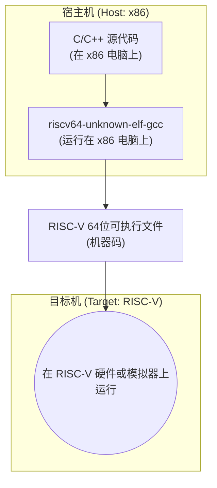

###  Slide Coverage Matrix (章节覆盖矩阵)

由于没有提供PPT Slides，我将原始文本材料结构化为逻辑上的“幻灯片”单元，以确保完全覆盖。

| 单元 (Slide) # | 原始主题/章节   | 关键术语/概念                                                                                                            | 主文本锚点 (章节/知识卡/图表)                         | 覆盖状态      |
| :----------- | :-------- | :----------------------------------------------------------------------------------------------------------------- | :---------------------------------------- | :-------- |
| `S01`        | 开篇 & 准备工作 | `Make your hands dirty`, 创建工作目录                                                                                    | 4. 动手实践：分步指南                              | ✅ Covered |
| `S02`        | 编译器的概念    | 交叉编译 (Cross-compilation), x86 vs riscv64, 目标语言                                                                     | 知识卡：交叉编译 (Cross-Compilation), [Fig·S02-1] | ✅ Covered |
| `S03`        | 获取编译器     | `riscv-gcc`, 源码编译 vs 预编译 (pre-built) 工具链, SiFive Freedom Tools                                                     | 知识卡：RISC-V GNU 工具链, 4.1. 安装交叉编译器          | ✅ Covered |
| `S04`        | 配置环境变量    | `gedit`, `nano`, `~/.bashrc`, `export RISCV`, `export PATH`, `source` 命令, `riscv64-unknown-elf-gcc -v`             | 知识卡：环境变量, 4.1. 安装交叉编译器 (步骤3-5)            | ✅ Covered |
| `S05`        | 环境变量详解    | `PATH`, `HOME`, `USER`, 环境变量的作用                                                                                    | 知识卡：环境变量, [Fig·S05-1]                     | ✅ Covered |
| `S06`        | 模拟器的概念    | 模拟器 (Emulator) vs 真实硬件 (开发板), 开发效率                                                                                 | 知识卡：模拟器 (Emulator), 6. 陷阱与对比              | ✅ Covered |
| `S07`        | 模拟器工作原理   | CPU/内存/外设模拟, 动态翻译, 镜像文件, 串口映射                                                                                      | 知识卡：模拟器 (Emulator), [Fig·S07-1]           | ✅ Covered |
| `S08`        | 安装模拟器QEMU | `QEMU`, `wget`, `./configure`, `make`, `brew`, 版本检查                                                                | 4.2. 安装QEMU模拟器                            | ✅ Covered |
| `S09`        | 首次运行QEMU  | `OpenSBI` (固件), `qemu-system-riscv64`, `--machine virt`, `--nographic`, `--bios default`, 退出命令 (`Ctrl+a` then `x`) | 知识卡：OpenSBI, 4.3. 首次测试运行                  | ✅ Covered |
| `S10`        | 故障排除      | QEMU退出方法, `vm.overcommit_memory`                                                                                   | 4.3. 首次测试运行, 6. 陷阱与对比                     | ✅ Covered |

---

### 1. 学习路线图 (Learning Roadmap)

本指南将带你从零开始，搭建一个完整的RISC-V操作系统开发环境。请遵循以下步骤，这会让你事半功倍。

1.  **理解核心概念 (约15分钟阅读):** 首先，花点时间理解两个关键概念——“交叉编译”和“模拟器”。明白我们“为什么”需要这些工具，比直接上手操作更重要。
2.  **安装与配置编译器 (约20分钟操作):** 这是第一个动手环节。我们将下载预编译好的RISC-V GCC工具链，并配置好系统的环境变量，让你的电脑具备将C代码转换为RISC-V机器码的能力。
3.  **安装与测试模拟器 (约30分钟操作，编译可能耗时较长):** 接着，我们会安装QEMU，一个强大的模拟器。它将扮演我们的“虚拟RISC-V计算机”。我们将学习如何启动它，并看到固件(OpenSBI)成功运行的迹象。
4.  **验证与回顾 (约10分钟):** 最后，通过几个简单的命令，确保所有工具都已就位且工作正常。

**总计时间:** 约 1 小时 15 分钟。

---

### 2. 核心知识地图 (Core Knowledge Map)

```
I. 实验环境搭建
   ├── A. 核心理论
   │   ├── 1. 交叉编译 [S02]
   │   │    └── 为何需要：主机架构(x86) vs 目标架构(riscv64)
   │   └── 2. 模拟器 [S06, S07]
   │        ├── 为何需要：替代物理硬件，提升开发效率
   │        └── 工作原理：CPU、内存、外设的软件模拟
   │
   ├── B. 关键工具 I：交叉编译器 (RISC-V GCC)
   │   ├── 1. 获取方式：预编译包 (推荐) vs 源码编译 [S03]
   │   ├── 2. 配置：环境变量 [S04, S05]
   │   │    ├── `RISCV`：工具链根目录
   │   │    └── `PATH`：让系统找到可执行文件
   │   └── 3. 验证：`riscv64-unknown-elf-gcc -v` [S04]
   │
   └── C. 关键工具 II：模拟器 (QEMU)
       ├── 1. 安装：分平台指令 (Linux/macOS) [S08]
       ├── 2. 验证：`qemu-system-riscv64 --version` [S08]
       └── 3. 首次运行与交互 [S09, S10]
           ├── 启动固件 OpenSBI
           └── 退出模拟器
```

---

### 3. 逐点深入讲解 (Point-by-Point Explanation)

我们将通过一系列“知识卡”来拆解每一个核心概念。

#### 知识卡 1: 交叉编译 (Cross-Compilation)

*   **它解决了什么问题 (直观解释)** `[S02]`
    > 想象一下，你是一位只懂中文的作家（你的电脑，x86架构），但需要写一本给只懂法语的读者（RISC-V芯片）看的书。你不能直接用中文写，因为他们看不懂。你需要一个特殊的翻译工具（交叉编译器），这个工具在你身边（在x86电脑上运行），但它能把你的中文手稿（C语言代码）直接翻译成地道的法语（RISC-V机器码）。这个过程就叫交叉编译。

*   **前置知识**
    *   了解计算机程序需要被编译成机器码才能运行。
    *   知道世界上存在不同类型的CPU架构（如x86, ARM, RISC-V）。

*   **类比 / 直觉**
    > 你的电脑是x86架构，就像一个“英语母语者”。你想开发的操作系统是给RISC-V架构的设备用的，它是一个“RISC-V语母语者”。交叉编译器 `riscv-gcc` 就是一个运行在“英语环境”下的翻译软件，它能把通用的“C语言”翻译成“RISC-V语”。

*   **官方/正式声明 (严谨)** `[S02]`
    > 交叉编译是指在一个平台（称为**宿主机**，Host）上，生成为另一个平台（称为**目标机**，Target）执行的代码的过程。当宿主机和目标机的CPU架构不同时（例如，在x86 PC上为RISC-V开发板编译程序），交叉编译是必需的。

*   **关键结果**
    *   输入：C/C++ 源代码文件。
    *   工具：运行在宿主机（如x86 Linux）上的交叉编译器（如`riscv64-unknown-elf-gcc`）。
    *   输出：可在目标机（RISC-V 64位平台）上运行的可执行文件。

*   **内联图示** `[Fig·S02-1]`


    
**图 `[Fig·S02-1]` 解读:** 该图展示了交叉编译流程。我们在x86宿主机上编写代码，并使用同样在x86上运行的`riscv-gcc`编译器，产出只能在RISC-V目标机上运行的程序。

*   **常见陷阱与反例**
    *   **陷阱:** 试图直接使用系统自带的`gcc`来编译。系统自带的`gcc`通常是为宿主机架构（如x86）生成代码的，它无法生成RISC-V代码。
    *   **反例:** 在x86电脑上用`gcc my_program.c -o my_program`，生成的`my_program`无法在RISC-V开发板上运行。

*   **对比相似概念**

| 特性           | **本地编译 (Native Compilation)** | **交叉编译 (Cross-Compilation)**      |
| :----------- | :---------------------------- | :-------------------------------- |
| **场景**       | 在设备上为设备自身编译                   | 在A设备上为B设备编译                       |
| **例子**       | 在你的x86电脑上用`gcc`编译一个x86程序      | 在你的x86电脑上用`riscv-gcc`编译一个RISC-V程序 |
| **宿主机=目标机?** | 是                             | 否                                 |

*   **一句话总结**
    > 在一台机器上，为另一台不同架构的机器编译程序。

*   **自我检查 (3个问题)**
    1.  **判断题:** 在RISC-V开发板上为该开发板编译程序，属于交叉编译。(错误)
    2.  **选择题:** 我们本次实验为什么需要交叉编译器？ (B)
        A. 因为C语言太复杂了
        B. 因为我们的开发电脑(x86)和目标运行平台(RISC-V)架构不同
        C. 因为标准GCC不支持RISC-V
    3.  **开放题:** 请用一句话解释什么是宿主机和目标机。

---

#### 知识卡 2: 环境变量 (Environment Variables)

*   **它解决了什么问题 (直观解释)** `[S05]`
    > 想象一下，你的电脑是一个大办公室，有很多工具放在不同的抽屉里。当你需要用“剪刀”时，你不想每次都告诉你的助手：“请去三楼A区5号柜第二个抽屉里拿剪刀”。你希望助手能“记住”所有常用工具的位置。环境变量`PATH`就是这样一张“常用工具位置清单”。你把`riscv-gcc`所在的“抽屉”（目录路径）写在这张清单上，以后在任何地方喊一声`riscv-gcc`，系统（你的助手）就能自动根据清单找到它。

*   **前置知识**
    *   了解文件和目录（文件夹）的基本概念。
    *   知道在终端（命令行）中执行程序。

*   **官方/正式声明 (严谨)** `[S05]`
    > 环境变量是操作系统维护的一组动态命名的值，它影响着正在运行的进程的行为。例如，`PATH`是一个特殊的环境变量，它包含一个由冒号分隔的目录列表，当用户输入一个命令时，shell会自动在这些目录中搜索对应的可执行文件。

*   **关键结果** `[S04]`
    *   `export RISCV=PATH_TO_INSTALL`: 创建一个名为 `RISCV` 的自定义变量，存储工具链的根目录。这是一种方便的快捷方式。
    *   `export PATH=$RISCV/bin:$PATH`: 将工具链的可执行文件目录 (`$RISCV/bin`) **添加**到 `PATH` 变量的最前面。这使得我们可以在任何目录下直接调用 `riscv64-unknown-elf-gcc` 等命令。

*   **内联图示** `[Fig·S05-1]`

    ```
    当你在终端输入: riscv64-unknown-elf-gcc -v

    Shell (操作系统) 的查找过程:
    1. 查看 PATH 环境变量的值。
       PATH = /opt/riscv/bin:/usr/local/bin:/usr/bin:/bin
               \--------------/ \---------------------------/
                 你新加的路径      系统原有的路径

    2. 依次在每个路径下寻找 "riscv64-unknown-elf-gcc" 这个文件。
       - 检查 /opt/riscv/bin/...  -> 找到了！执行它。
       - (如果没找到) 检查 /usr/local/bin/... -> 没找到。
       - (继续检查) ...
       - (如果都找不到) 报告 "command not found"。
    ```
    **图 `[Fig·S05-1]` 解读:** 该图模拟了shell如何利用`PATH`环境变量来定位命令。它会从左到右依次搜索`PATH`中的每一个目录，一旦找到匹配的可执行文件便立即执行。

*   **常见陷阱与反例**
    *   **陷阱1:** 修改了 `.bashrc` 文件后，忘记执行 `source ~/.bashrc`，导致配置在当前终端会话中未生效。
    *   **陷阱2:** `PATH` 变量赋值时写成了 `export PATH=$RISCV/bin`，这会**覆盖**掉原有的系统路径，导致 `ls`, `cd` 等基本命令都无法使用。正确的写法是 `export PATH=$RISCV/bin:$PATH`（追加在前面）或 `export PATH=$PATH:$RISCV/bin`（追加在后面）。
    *   **陷阱3:** `RISCV` 变量的路径设置错误，比如少了一层目录或者有拼写错误。

*   **一句话总结**
    > 环境变量是给操作系统提供配置信息的“全局便签”，其中`PATH`是命令搜索路径的“地址簿”。

*   **自我检查 (3个问题)**
    1.  **判断题:** 执行 `export PATH=/my/new/path` 是一个安全的操作。(错误)
    2.  **选择题:** 修改 `.bashrc` 后，为了让配置立即生效，应该执行哪个命令？(C)
        A. `run ~/.bashrc`
        B. `restart`
        C. `source ~/.bashrc`
    3.  **开放题:** 为什么我们推荐创建一个`RISCV`变量，而不是直接把完整路径写到`PATH`里？

---

#### 知识卡 3: 模拟器 (Emulator)

*   **它解决了什么问题 (直观解释)** `[S06]`
    > 我们用交叉编译器造出了“RISC-V程序”这个“只能在RISC-V电视上播放的碟片”，但我们手上只有一台“x86电脑”这个“DVD播放机”。怎么办？买一台昂贵且不方便的RISC-V电视吗？不必。我们可以下载一个叫QEMU的“万能播放器软件”，它能在你的电脑上**模拟**出一台虚拟的RISC-V电视，完美播放我们的碟片。这个软件就是模拟器。

*   **前置知识**
    *   理解CPU、内存、硬盘、串口等是计算机的基本组成部分。
    *   知道交叉编译的产物是目标平台的机器码。

*   **官方/正式声明 (严谨)** `[S07]`
    > 模拟器是一种软件，它能使一个计算机系统（宿主机）模仿另一个计算机系统（客户机）的行为。它通过软件实现对客户机硬件的虚拟化，包括CPU指令集的解释或动态二进制翻译、内存管理单元(MMU)的模拟、以及I/O设备的虚拟化，从而允许为客户机编写的软件在宿主机上未经修改地运行。

*   **关键结果：QEMU如何“假装”成一台RISC-V电脑** `[S07]`
    *   **CPU模拟**: QEMU读取一条RISC-V指令，理解它的含义（比如“把寄存器A和B相加”），然后在x86 CPU上执行一系列等效操作来完成这个任务。
    *   **内存模拟**: QEMU在你的电脑内存中申请一大块空间，比如128MB，然后把它“标定”为虚拟RISC-V电脑的“物理内存”。当RISC-V程序访问地址`0x80200000`时，QEMU会将其转换为对这128MB空间中某个特定位置的访问。
    *   **外设模拟**:
        *   **虚拟硬盘** -> 对应宿主机上的一个**文件**（镜像文件）。
        *   **虚拟串口** -> 对应宿主机的**终端窗口**（你在屏幕上看到的输出）。
        *   **虚拟时钟** -> 使用宿主机的**系统时钟**。

*   **内联图示** `[Fig·S07-1]`
    ```
    +-------------------------------------------------+
    |              宿主机 (Host: x86 Linux/macOS)       |
    |                                                 |
    |   +-----------------------------------------+   |
    |   |                QEMU 进程                |   |
    |   |                                         |   |
    |   |  +-------------+     +---------------+  |   |
    |   |  |  虚拟RISC-V |<--->| 指令翻译引擎  |  |   |
    |   |  |     CPU     |     +---------------+  |   |
    |   |  +-------------+           |             |   |
    |   |                            | 执行等效操作  |   |
    |   |  +-------------+     +---------------+  |   |   +------------+
    |   |  | 虚拟RISC-V |<--->| 内存地址映射  |<-+----->|  Host RAM  |
    |   |  |     内存    |     +---------------+  |   |   +------------+
    |   |  +-------------+                        |   |
    |   |                                         |   |   +------------+
    |   |  +-------------+     +---------------+  |   |   | Host       |
    |   |  | 虚拟RISC-V |<--->|  I/O 转发   |<----+----->| Terminal、 |
    |   |  |   串口/磁盘 |     +---------------+  |   |   | 文件系统    |
    |   |  +-------------+                        |   |   +------------+
    |   +-----------------------------------------+   |
    |                                                 |
    +-------------------------------------------------+
    ```
    **图 `[Fig·S07-1]` 解读:** 此图展示了QEMU作为中间层的核心作用。它拦截RISC-V客户机的所有硬件操作（指令、内存访问、I/O），并将它们翻译、映射为在x86宿主机上的实际操作。

*   **一句话总结**
    > 模拟器是用软件在你的电脑里创造的一台功能完整的“假”电脑，专门用来运行另一个架构的程序。

*   **自我检查 (3个问题)**
    1.  **判断题:** 模拟器运行RISC-V代码的效率和在真实RISC-V硬件上一样高。(错误)
    2.  **选择题:** 在QEMU中，虚拟的硬盘通常对应宿主机上的什么？(A)
        A. 一个文件
        B. 一个真实的硬盘分区
        C. 一块内存区域
    3.  **开放题:** 相比于使用真实的开发板，使用模拟器进行操作系统开发有哪些好处？

---

#### 知识卡 4: OpenSBI

*   **它解决了什么问题 (直观解释)** `[S09]`
    > 当你按下真实电脑的电源键时，在操作系统（如Windows）启动之前，会有一个小程序先运行，它检查硬件、初始化设备，这个程序就是BIOS或UEFI。OpenSBI在我们的QEMU虚拟电脑里扮演了类似的角色。它是一个**固件**（Firmware），是操作系统启动前的“引路人”和“管家”。

*   **前置知识**
    *   大致了解电脑开机时，BIOS/UEFI会先于操作系统运行。

*   **官方/正式声明 (严谨)** `[S09]`
    > OpenSBI (RISC-V Supervisor Binary Interface) 是一个开源项目，为运行在RISC-V Supervisor (S) 模式下的软件（如操作系统内核）提供了一套标准的底层接口实现。它负责处理硬件相关的底层细节，如多核启动、定时器和中断管理，从而让操作系统可以更平台无关地进行开发。在新版QEMU中，它作为默认的引导固件。

*   **关键结果**
    *   当我们运行`qemu-system-riscv64 ... --bios default`时，QEMU会自动加载并执行内置的OpenSBI。
    *   你看到的那个带有字符画Logo的输出，就是OpenSBI成功运行并打印的启动信息。
    *   OpenSBI完成初始化后，会等待并加载一个操作系统内核（我们后续实验会提供）。

*   **一句话总结**
    > OpenSBI是RISC-V虚拟机的“BIOS”，负责在我们的操作系统内核启动前完成硬件初始化。

*   **自我检查 (3个问题)**
    1.  **判断题:** OpenSBI就是RISC-V操作系统本身。(错误)
    2.  **选择题:** 在QEMU中运行`--bios default`参数的作用是？(B)
        A. 关闭BIOS功能
        B. 使用QEMU内置的默认固件 (OpenSBI)
        C. 从硬盘加载BIOS
    3.  **开放题:** 观察OpenSBI的启动信息，它打印了哪些关于虚拟硬件平台的信息？

---

### 4. 动手实践：分步指南 (Hands-On Section)

这是将理论付诸实践的部分。请严格按照步骤操作。

#### 4.1. 安装交叉编译器 `[S01, S03, S04]`

1.  **[准备] 创建安装目录** `[S01]`
    打开你的终端，创建一个专门用于存放RISC-V相关工具的目录。这有助于保持系统整洁。
    ```bash
    # 我们推荐在 /opt 目录下创建，但这需要管理员权限
    # 如果没有权限或不想用sudo，也可以在你的主目录下创建，例如 ~/riscv
    sudo mkdir -p /opt/riscv
    sudo chown $USER:$USER /opt/riscv # 将目录所有权赋予当前用户
    cd /opt/riscv
    ```

2.  **[下载] 获取预编译工具链** `[S03]`
    我们不去从源码编译（耗时且易错），而是直接下载SiFive公司编译好的工具链。
    *   访问 [SiFive Freedom Tools Releases](https://github.com/sifive/freedom-tools/releases)。
    *   找到一个较新的版本，根据你的操作系统下载对应的包。
        *   **Linux (Ubuntu/WSL):** 寻找名字里包含 `x86_64-...-ubuntu` 的 `.tar.gz` 文件。
        *   **macOS:** 寻找名字里包含 `x86_64-...-apple-darwin` 的 `.tar.gz` 文件。
    *   假设我们下载了 `riscv64-unknown-elf-gcc-8.3.0-2019.08.0-x86_64-linux-ubuntu14.tar.gz`。使用`wget`下载并解压：
    ```bash
    # 注意替换成你选择的实际文件名
    wget https://static.dev.sifive.com/dev-tools/freedom-tools/v2020.12/riscv64-unknown-elf-toolchain-10.2.0-2020.12.8-x86_64-linux-ubuntu14.tar.gz
    # -xf表示从指定文件解压内容
    tar -xf riscv64-unknown-elf-toolchain-10.2.0-2020.12.8-x86_64-linux-ubuntu14.tar.gz
    ```
    解压后，你应该会得到一个类似 `riscv64-unknown-elf-gcc-....` 的目录。为了方便，我们可以给它创建一个符号链接或重命名。
    ```bash
    # 将长名字链接到一个简短的名字 riscv-toolchain
    ln -s riscv64-unknown-elf-toolchain-10.2.0-2020.12.8-x86_64-linux-ubuntu14 riscv-toolchain
    ```
    现在，你的编译器可执行文件位于 `/opt/riscv/riscv-toolchain/bin`。

3.  **[配置] 设置环境变量** `[S04]`
    我们需要将上述路径告诉操作系统。这通过修改shell的配置文件 `~/.bashrc` 来实现（如果你使用zsh，则是 `~/.zshrc`）。

| 操作系统/环境         | 编辑器命令                      |
| :-------------- | :------------------------- |
| Ubuntu (图形界面)   | `gedit ~/.bashrc`          |
| WSL / 服务器 (无图形) | `nano ~/.bashrc`           |
| VSCode (Remote) | 直接在文件浏览器中找到并打开 `~/.bashrc` |

在打开的 `.bashrc` 文件**末尾**，添加以下两行（因为`.bashrc` 是 **bash shell 启动时自动执行的配置文件**）。**请务必将 `PATH_TO_INSTALL` 替换为你自己的实际路径！**

注意：这里我们发现，其实有多个.bashrc文件：
```bash
root@DESKTOP-GH7S2O7:~# ls -a
.   .bash_history  .cache   .motd_shown  .vscode-server
..  .bashrc        .dotnet  .profile
root@DESKTOP-GH7S2O7:~# cd /home
root@DESKTOP-GH7S2O7:/home# cd albus_os/
root@DESKTOP-GH7S2O7:/home/albus_os# ls -a
.  ..  .bash_logout  .bashrc  .profile
```
我们使用下面命令确认我们是root用户：
```bash
root@DESKTOP-GH7S2O7:/home/albus_os# whoami
root
```
因此，我们修改root目录下的配置文件即可。

```bash
# --- RISC-V Toolchain Configuration ---
# 使用我们刚刚创建的符号链接路径
export RISCV=/opt/riscv/riscv-toolchain
export PATH=$RISCV/bin:$PATH
```
*   **在 `nano` 中:** 使用箭头键移动到文件末尾，输入内容。按 `Ctrl + O` 保存，按 `Enter` 确认，再按 `Ctrl + X` 退出。
*   **在 `gedit` 中:** 直接在末尾添加，然后点击保存按钮并关闭窗口。

4.  **[激活] 使配置生效** `[S04]`
    新配置不会自动加载。运行以下命令立即应用更改：
    ```bash
    source ~/.bashrc
    ```
    这个命令会重新加载配置文件，让你的 `PATH` 更新。

5.  **[验证] 检查编译器版本** `[S04]`
    现在，在终端的任何位置输入以下命令：
    ```bash
riscv64-unknown-elf-gcc -v
    ```
    如果配置成功，你会看到一大段输出，最后几行应该类似这样：
    ```
    ... (很多配置信息)
    gcc version 10.2.0 (SiFive GCC 10.2.0-2020.12.8) 
    ```
    **如果看到 "command not found"，请回头检查第3步中的路径是否正确，以及是否执行了第4步。**

#### 4.2. 安装QEMU模拟器 `[S08]`

安装QEMU的方式因操作系统而异。

*   **对于 Linux (Ubuntu):**
    > **注意：** 原文指出 `apt` 安装的QEMU版本可能过低。因此，推荐从源码编译安装。这会需要一些编译工具，如果缺失，请先运行 `sudo apt-get install build-essential libglib2.0-dev libpixman-1-dev`。

    ```bash
    # 切换到一个用于下载和编译的临时目录，例如 ~/build
    mkdir -p ~/build && cd ~/build
    
    # 下载QEMU 4.1.1 源码 (这是一个稳定的旧版本，你可以尝试更新的版本)
    wget https://download.qemu.org/qemu-4.1.1.tar.xz
    tar xvJf qemu-4.1.1.tar.xz
    cd qemu-4.1.1

	# 安装本地编译工具集
	# 编译软件所需的核心工具（如gcc, g++, make等）被打包在一个叫做 build-essential 的软件包里。你只需要安装它即可
	sudo apt-get update
	sudo apt-get install build-essential
	# 安装仓库管理员
	sudo apt-get install pkg-config
	# 安装关键的开发库 
	sudo apt-get install libglib2.0-dev libpixman-1-dev

    # 配置，只编译我们需要的riscv目标
    ./configure --target-list=riscv32-softmmu,riscv64-softmmu

    # 编译，-j 后面跟你的CPU核心数，可以加快速度
    make -j$(nproc)

    # 安装到系统
    sudo make install
    ```

*   **对于 macOS:**
    使用 Homebrew 包管理器是最简单的方式。
    ```bash
    brew install qemu
    ```

*   **[验证] 检查QEMU版本** `[S08]`
    安装完成后，验证版本是否符合要求（>= 4.1.0）：
    ```bash
    qemu-system-riscv64 --version
    ```
    预期输出：
    ```
    QEMU emulator version 4.1.1
    Copyright (c) 2003-2019 Fabrice Bellard and the QEMU Project developers
    ```

#### 4.3. 首次测试运行 `[S09, S10]`

现在，编译器和模拟器都已就绪。让我们启动虚拟的RISC-V计算机，看看内置的固件(OpenSBI)是否能正常工作。

1.  **[运行] 启动QEMU**
    在终端中执行以下命令：
    ```bash
    qemu-system-riscv64 \
      --machine virt \
      --nographic \
      --bios default
    ```
    *   `--machine virt`: 指定模拟一个通用的、虚拟的RISC-V机器平台。
    *   `--nographic`: 不打开图形窗口，所有输出都重定向到当前终端。
    *   `--bios default`: 使用QEMU内置的默认固件，即OpenSBI。

2.  **[观察] 检查输出**
    如果一切顺利，你的终端会立刻显示OpenSBI的启动横幅，和原文中的示例一模一样：
    ```
    OpenSBI v0.4 (Jul  2 2019 11:53:53)
       ____                    _____ ____ _____
      / __ \                  / ____|  _ \_   _|
     | |  | |_ __   ___ _ __ | (___ | |_) || |
     | |  | | '_ \ / _ \ '_ \ \___ \|  _ < | |
     | |__| | |_) |  __/ | | |____) | |_) || |_
      \____/| .__/ \___|_| |_|_____/|____/_____|
            | |
            |_|
    ... (更多平台信息)
    ```
    **恭喜你，你的虚拟RISC-V计算机已经成功开机了！** 它现在正停在固件阶段，等待加载操作系统。

3.  **[退出] 关闭QEMU** `[S10]`
    QEMU会接管你的终端。要退出它，请按组合键：
    *   **先按住 `Ctrl` 键不放，再按一下 `a` 键。**
    *   **然后松开所有键。**
    *   **最后单独按一下 `x` 键。**

4.  **[排错] 如果无法运行** `[S10]`
    如果在启动QEMU时遇到错误，特别是与内存相关的，可以尝试原文提到的命令，它会调整系统的内存分配策略：
    ```bash
    sudo sysctl vm.overcommit_memory=1
    ```

---

### 6. 陷阱与对比 (Pitfalls & Comparisons)

*   **常见误区与陷阱**
    1.  **`PATH` 配置错误**: 这是最常见的问题。要么是路径写错，要么是覆盖了原有`PATH` (`PATH=...` 而不是 `PATH=...:$PATH`)，要么是忘了`source`。
    2.  **工具链与系统不匹配**: 在Linux上下载了macOS版本的工具链，或者在64位系统上用了32位工具链（虽然现在很少见）。
    3.  **QEMU版本过低**: 在Ubuntu上直接`sudo apt install qemu-system-misc`，安装的版本可能不支持实验所需的某些特性，导致后续实验失败。务必从源码编译或使用更新的PPA。
    4.  **QEMU退出键按法错误**: `Ctrl+a, x` 不是同时按。是先`Ctrl+a`，再单独按`x`。
    5.  **源码编译依赖缺失**: 编译QEMU时遇到错误，通常是因为缺少`gcc`, `make`, `glib`, `pixman`等开发库。仔细阅读`./configure`的输出，它会提示缺少什么。

*   **对比：源码编译 vs. 使用预编译包**

| 对比项 | **从源码编译工具链** `[S03]` | **使用预编译工具链** `[S03]` |
| :--- | :--- | :--- |
| **优点** | - 可定制化程度高<br>- 可获取最新版本 | - **简单、快速、不易出错 (推荐)**<br>- 无需处理编译依赖问题 |
| **缺点** | - **过程复杂，耗时长**<br>- 容易遇到依赖问题和编译错误<br>- 占用大量磁盘空间 | - 版本可能不是最新的<br>- 依赖于提供方（如SiFive）的更新 |
| **适用场景** | 需要特定配置或最新特性的高级用户/开发者 | **初学者、课程实验、快速搭建环境** |

---

### 7. 快速复习卡 (Quick Review Cards)

#### 3行核心回顾

1.  下载SiFive预编译的RISC-V GCC工具链，解压并将其`bin`目录添加到`.bashrc`的`PATH`中。
2.  在Ubuntu上从源码编译安装QEMU (>=4.1.0)，在macOS上使用`brew`安装。
3.  运行 `qemu-system-riscv64 --machine virt --nographic --bios default` 验证QEMU和OpenSBI能启动。

#### 10行紧凑回顾

1.  **目标**: 在x86电脑上搭建RISC-V开发环境。
2.  **核心工具**: `riscv-gcc` (交叉编译器) 和 `QEMU` (模拟器)。
3.  **交叉编译**: 在x86上将C代码编译成RISC-V机器码。
4.  **获取编译器**: 从SiFive官网下载预编译好的工具链包。
5.  **配置编译器**: 在`.bashrc`中设置`RISCV`和`PATH`环境变量。
6.  **生效配置**: `source ~/.bashrc`。
7.  **验证编译器**: `riscv64-unknown-elf-gcc -v`。
8.  **模拟器**: QEMU用软件模拟一台RISC-V电脑，用于运行我们的程序。
9.  **安装模拟器**: Linux推荐源码编译，macOS用`brew`。
10. **验证模拟器**: 运行`qemu-system-riscv64`命令，看到OpenSBI启动界面即成功。

---

### 8. 延伸阅读与术语表 (Further Reading & Glossary)

*   **Glossary (术语表)**
    *   **交叉编译 (Cross-Compilation)**: 在一个架构平台（宿主机）上，为另一个不同架构的平台（目标机）生成可执行代码。
    *   **工具链 (Toolchain)**: 用于软件开发的一系列工具集合，通常包括编译器、链接器、调试器等。
    *   **预编译 (Pre-built)**: 已被编译成可执行文件的软件包，用户可以直接下载使用，无需自行编译。
    *   **环境变量 (Environment Variable)**: 操作系统中用于存储配置信息的全局变量，如`PATH`。
    *   **QEMU**: 一款开源、强大的通用机器模拟器和虚拟器。
    *   **OpenSBI**: RISC-V平台的开源Supervisor Binary Interface实现，充当固件或引导加载程序。
    *   **固件 (Firmware)**: 固化在硬件中的软件，负责硬件的底层初始化和控制。
    *   **镜像文件 (Image file)**: 一个文件，其内容是存储设备（如硬盘）的逐字节精确副本。

*   **Further Reading (延伸阅读)**
    1.  [RISC-V GNU Compiler Toolchain 官方仓库](https://github.com/riscv/riscv-gcc)
    2.  [QEMU 官方网站](https://www.qemu.org/)
    3.  [OpenSBI 项目文档](https://github.com/riscv-software-src/opensbi/blob/master/docs/index.md)

---

### 9. 单页备忘录 (One-Page Cheat Sheet)

#### **RISC-V 环境搭建核心指令**

| 任务 | 命令 / 代码片段 | 检查点 / 注释 |
| :--- | :--- | :--- |
| **1. 准备目录** | `sudo mkdir -p /opt/riscv && sudo chown $USER:$USER /opt/riscv` | 推荐使用`/opt`，或`~/riscv`。 |
| **2. 下载工具链** | `wget [URL_to_SiFive_Toolchain.tar.gz]`<br>`tar -xf [file.tar.gz]` | 从 [SiFive GitHub Releases](https://github.com/sifive/freedom-tools/releases) 获取。 |
| **3. 配置`.bashrc`** | `nano ~/.bashrc` (或 `gedit`)<br>```bash`</br>export RISCV=/path/to/your/toolchain</br>export PATH=$RISCV/bin:$PATH</br>``` | **路径必须正确！**使用绝对路径。 |
| **4. 激活配置** | `source ~/.bashrc` | 每次修改`.bashrc`后必须执行。 |
| **5. 验证编译器** | `riscv64-unknown-elf-gcc -v` | 看到`gcc version`字样。 |
| **6. 安装QEMU (Ubuntu)** | `./configure --target-list=riscv64-softmmu`<br>`make -j$(nproc)`<br>`sudo make install` | 确保编译依赖已安装。 |
| **7. 安装QEMU (macOS)** | `brew install qemu` | - |
| **8. 验证QEMU** | `qemu-system-riscv64 --version` | 版本号应 >= 4.1.0。 |
| **9. 运行首次测试** | `qemu-system-riscv64 --machine virt --nographic --bios default` | 看到OpenSBI启动横幅。 |
| **10. 退出QEMU** | 1. 按 `Ctrl + a`<br>2. 松开<br>3. 按 `x` | 这是一个序列，不是组合键。 |

---
#### **核心概念 & 陷阱**

*   **交叉编译**: 在x86上为RISC-V编译。使用`riscv64-unknown-elf-gcc`，**不是**`gcc`。
*   **模拟器 (QEMU)**: 软件实现的虚拟RISC-V电脑，用于运行和调试。
*   **PATH环境变量**: 指明了命令的搜索路径。`export PATH=$NEW:$PATH` 是**追加**，`export PATH=$NEW` 是**覆盖(危险!)**。
*   **常见问题**: `command not found` -> 99%是`PATH`问题。检查路径拼写、是否`source`。
*   **QEMU (Ubuntu)**: **不要**用`apt`直接安装，版本太旧。**务必**从源码编译。