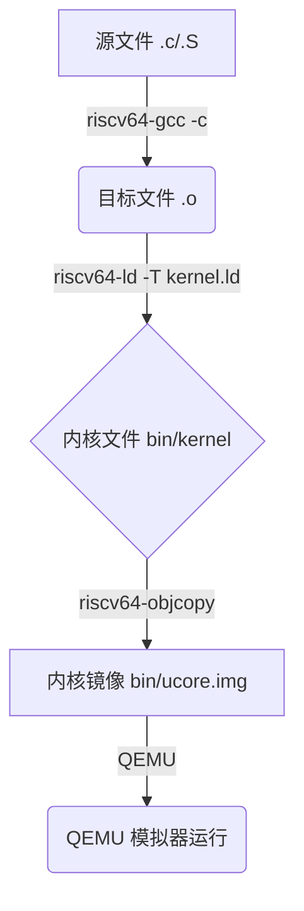
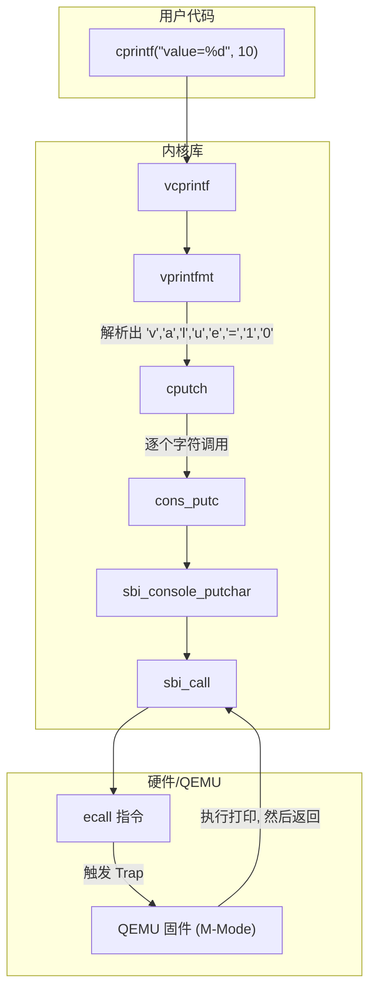

你好！我是 GitHub Copilot。非常乐意帮助你深入理解这个项目。这个项目是一个小型的 RISC-V 操作系统内核的起点，对于理解操作系统是如何从零开始构建的，这是一个绝佳的学习材料。

别担心，我们会像搭积木一样，一块一块地分析，让你清晰地看到全貌。我会用最通俗易懂的方式来讲解，同时保证内容的严谨性。让我们开始这段有趣的探索之旅吧！

### 学习路线图 `[C00]`

为了系统地理解这个项目，我为你规划了以下学习路径。整个过程预计花费 30-45 分钟。

1.  **鸟瞰全局 (5分钟)**：首先了解项目的目标（构建一个简单的内核）和它的构建方式（Makefile 和链接器脚本）。
2.  **启动流程 (15分钟)**：深入代码，跟踪从第一行汇编指令 (entry.S) 到 C 语言主函数 (init.c) 的完整启动过程。
3.  **核心服务 (15分钟)**：分析内核提供的基础功能，如屏幕打印 (`printf`) 和 SBI 调用，理解它们是如何实现的。
4.  **融会贯通 (5分钟)**：回顾所有部分，形成一个完整的知识网络，并用速查表巩固记忆。

---

### 核心知识地图 `[C00]`

这是一个简化的项目结构图，帮助你快速建立心智模型：

```
项目根目录 /
├── Makefile           (构建总指挥)
├── bin/               (最终产物)
│   └── ucore.img      (可执行内核镜像)
├── kern/              (内核代码)
│   ├── init/
│   │   ├── entry.S    (程序入口)
│   │   └── init.c     (内核初始化)
│   └── libs/
│       └── stdio.c    (内核态打印函数)
├── libs/              (通用库代码)
│   ├── sbi.c          (SBI 调用接口)
│   ├── printfmt.c   (格式化输出实现)
│   └── string.c     (字符串操作)
└── tools/             (构建工具)
    ├── kernel.ld      (链接器脚本)
    └── function.mk    (Makefile 函数)
```

---

### 逐点知识精讲

我们将按照从构建到运行的顺序，逐一解析关键文件和概念。

#### **知识卡片 1：构建系统 - Makefile 与 kernel.ld** `[C01]`

-   **它解决了什么问题？**
    自动化地将我们编写的 `.c` 和 `.S` 源代码文件，编译、链接成一个可以在 QEMU 模拟器上运行的操作系统内核镜像 (ucore.img)。

-   **前置知识**
    -   基本的 C 语言编译流程 (预处理 -> 编译 -> 汇编 -> 链接)。
    -   `make` 工具的基本用法。

-   **直观类比**
    Makefile 就像一个项目的**总工程师**，它知道：
    1.  **原料**在哪里 (源代码 `kern/`, `libs/`)。
    2.  用什么**工具**处理原料 (`riscv64-unknown-elf-gcc`, `ld`)。
    3.  遵循怎样的**工艺流程** (先编译每个 `.c` 文件为 `.o` 目标文件，再将所有 `.o` 文件链接成一个 kernel 可执行文件)。
    4.  最终**产品**是什么 (ucore.img)。

    kernel.ld 则是这位工程师手中的一张**精密图纸**。它告诉链接器 (ld) 如何精确地组织所有 `.o` 文件中的代码和数据，将它们放置在内存的指定位置。

-   **官方解析 (严谨)**
    1.  **Makefile**:
        -   **变量定义**: `GCCPREFIX` 定义了交叉编译工具链的前缀 (`riscv64-unknown-elf-`)，`QEMU` 定义了模拟器命令。
        -   **规则定义**:
            -   `qemu`: 最终目标之一，用于启动 QEMU 加载内核。它依赖于 ucore.img。
            -   `$(UCOREIMG): $(kernel)`: ucore.img 是通过 `objcopy` 从 kernel 文件中剥离调试信息并转换为二进制格式得到的。
            -   `$(kernel): $(KOBJS)`: kernel 文件是通过链接器 `ld` 将所有内核目标文件 (`$(KOBJS)`) 按照 kernel.ld 脚本的指示链接而成的。
	            - **`$(KOBJS)`**：  
				一堆“内核目标文件”的集合，比如 `obj/boot.o obj/mm.o obj/trap.o ...`。  
				这些 `.o` 都是由每个源文件编译得到的，稍后说它们怎么自动生成。
            -   `add_files_cc`: 这是一个自定义函数 (在 function.mk 中)，用于为每个源文件自动生成编译规则，将其编译成 `.o` 文件并放入 `obj/` 目录。

	```
	.c/.S 源码  --(gcc/ld -> 生成 ELF 可执行的 kernel)-->  kernel
	kernel  --(objcopy 去掉调试段并转成纯二进制)-->  ucore.img
	ucore.img  --(qemu -kernel / -drive ...)-->  QEMU 启动运行
	
	```
    2.  **kernel.ld (链接器脚本)**:
        -   `OUTPUT_ARCH(riscv)`: 指定输出文件是 RISC-V 架构。
        -   `ENTRY(kern_entry)`: 指定程序的入口点是 `kern_entry` 标签，这是内核的第一行指令。
        -   `BASE_ADDRESS = 0x80200000;`: 定义了内核被加载到物理内存的起始地址。
        -   `SECTIONS { ... }`: 这是核心部分，定义了最终生成的可执行文件中各个段 (section) 的布局。
            -   `. = BASE_ADDRESS;`: 将当前地址设置为基地址。
            -   `.text : { *(.text*) }`: 将所有输入文件 (`.o` 文件) 中的代码段 (`.text`) 合并，并放在这里。
            -   `.rodata`, `.data`, `.bss`: 同样地，依次放置只读数据、已初始化数据和未初始化数据段。
            -   `PROVIDE(end = .);`: 定义一个名为 `end` 的符号，其值是当前地址，即内核在内存中的末尾地址。这个符号可以在 C 代码中通过 `extern` 引用。

	
-   **图示：构建流程** `[Fig·C01-1]`


**图解**: Makefile 自动化了从 A 到 D 的整个流程，kernel.ld 在 B 到 C 的链接阶段提供关键的布局指导。

-   **常见陷阱**
    -   **交叉编译**: 我们不能用本机的 GCC 来编译内核，因为我们的电脑是 x86 架构，而目标 QEMU 模拟的是 RISC-V 架构。必须使用 `riscv64-unknown-elf-gcc` 这样的交叉编译器。
    -   **裸机程序 (Bare-metal)**: 内核编译时使用了 `-nostdlib` 和 `-fno-builtin` 等参数，意味着它不能使用操作系统提供的标准库。所有需要的功能，比如 `printf`，都必须自己实现。

-   **一句话总结**
    Makefile 和 kernel.ld 协同工作，将分散的源代码精确地组装成一个能在特定内存地址上运行的、独立的内核程序。

-   **自我检查**
    1.  (判断题) kernel.ld 文件决定了 C 语言代码如何被编译成汇编代码。 (×，  `riscv64-unknown-elf-gcc`)
    2.  (选择题) ucore.img 是如何生成的？
        A. 直接由 GCC 编译 C 代码得到。
        B. 由链接器 `ld` 将所有 `.o` 文件链接得到。
        C. 由 `objcopy` 工具处理链接后的 kernel 文件得到。
        D. 由 Makefile 直接创建的空文件。 (C)
    3.  (开放题) 为什么我们需要一个链接器脚本 (`.ld` 文件)？如果不用会怎么样？
        > 答：我们需要链接器脚本来精确控制代码和数据在内存中的布局，并定义程序的入口点。如果没有它，链接器会使用默认布局，这对于需要在特定地址（如 0x80200000）启动的操作系统内核来说是行不通的。

---

#### **知识卡片 2：程序入口与初始化 - entry.S 和 init.c** `[C02]`

-   **它解决了什么问题？**
    定义了计算机加电后（在我们的例子中是 QEMU 加载内核后）执行的第一条指令，并完成进入 C 语言世界前的所有准备工作。

-   **前置知识**
    -   [^1]RISC-V 汇编基础 (如 `la`, `mv`, `tail` 指令)。

    -   栈 (Stack) 的概念和 `sp` (Stack Pointer) 寄存器的作用。

-   **直观类比**
    entry.S 就像是火箭发射前的**点火程序**。它的任务非常纯粹和关键：
    1.  **设定方向**：设置好栈顶指针 `sp`，为即将运行的 C 函数提供一片可以使用的内存空间（栈空间）。
    2.  **点火**：跳转到 C 语言的 `kern_init` 函数，将控制权交给 C 代码。

    init.c 则是火箭升空后的**第一阶段引擎**，它接管控制权，开始执行更复杂的初始化任务。

-   **官方解析 (严谨)**
    1.  **entry.S**:
        -   `.section .text`: 声明以下内容属于代码段。
        -   `.globl kern_entry`: 将 `kern_entry` 声明为全局符号，这样链接器才能找到它。kernel.ld 中 `ENTRY(kern_entry)` 正是引用了它。
        -   `kern_entry:`: 程序的入口点。
        -   `la sp, bootstacktop`: `la` (Load Address) 是一条伪指令，它将 `bootstacktop` 这个地址加载到 `sp` 寄存器中。`bootstacktop` 在 entry.S 的末尾定义，指向一块预留的内存区域 (`bootstack`) 的顶部。**这一步至关重要，它初始化了内核的栈。**
        -   `tail kern_init`: `tail` 是一条伪指令，它会生成一个 `j` (jump) 指令，直接跳转到 `kern_init` 函数。这是一种优化，因为它不会在栈上创建新的帧。
        -   `.section .data`: 声明以下内容属于数据段。
        -   `bootstack: .space KSTACKSIZE`: 预留一块大小为 `KSTACKSIZE` 的内存作为内核的初始栈。
        -   `bootstacktop:`: 定义一个标签，指向这块内存的末尾（高地址处），因为栈是向下增长的。

    2.  **init.c**:
        -   `int kern_init(void) __attribute__((noreturn));`: 函数声明。`__attribute__((noreturn))` 告诉编译器这个函数永远不会返回，有助于编译器进行优化。对于一个操作系统内核的主函数来说，这是合理的，因为它会一直运行下去。
        -   `extern char edata[], end[];`: 引用链接器脚本中定义的两个符号。`edata` 是 `.data` 段的结束位置，`end` 是 [^2]`.bss` 段的结束位置。`edata` 和 `end` 之间的区域就是 `.bss` 段。
        -   `memset(edata, 0, end - edata);`: `.bss` 段存放的是未初始化的全局变量和静态变量。C 语言标准要求它们在程序开始时被清零。这行代码就完成了这个工作。
        -   `cprintf(...)`: 调用我们自己实现的打印函数，在屏幕上输出一条信息，表明内核正在加载。
        -   `while (1);`: 一个死循环。在完成所有初始化任务后，内核进入空闲状态。在更复杂的内核中，这里会是调度器循环。

-   **图示：启动序列** `[Fig·C02-1]`

    ```mermaid
    sequenceDiagram
        participant QEMU
        participant entry.S
        participant init.c
        QEMU->>entry.S: 跳转到 0x80200000 (kern_entry)
        entry.S->>entry.S: 设置栈指针 sp = bootstacktop
        entry.S->>init.c: 跳转到 kern_init()
        init.c->>init.c: 清空 .bss 段 (memset)
        init.c->>init.c: 调用 cprintf() 打印信息
        init.c->>init.c: 进入死循环 while(1)
    ```
    **图解**: 控制流从 QEMU 开始，经过 entry.S 的简单汇编设置，最终传递给 init.c 中的 C 函数。

-   **一句话总结**
    内核通过 entry.S 设置好最基本的运行环境（栈），然后跳转到 init.c 开始执行 C 代码，进行更高层次的初始化。

-   **自我检查**
    1.  (判断题) 内核的第一个 C 函数 `kern_init` 是由 `main` 函数调用的。 (×， 内核是一个“裸机”程序，它本身就是最底层的软件，**不存在一个更高层的 `main` 函数来调用它**)
    2.  (选择题) entry.S 中设置 `sp` 寄存器的目的是什么？
        A. 为了能正确调用 `printf`。
        B. 为 C 函数的运行准备栈空间。
        C. 设置程序的基地址。
        D. 清零 `.bss` 段。 (B)
    3.  (开放题) init.c 中 `memset(edata, 0, end - edata);` 这行代码为什么是必需的？`edata` 和 `end` 这两个“变量”是在哪里定义的？
        > 答：这行代码是必需的，因为它遵循 C 语言规范，将所有未初始化的全局和静态变量（位于 `.bss` 段）清零。`edata` 和 `end` 并不是 C 语言中定义的变量，它们是链接器脚本 kernel.ld 中定义的符号，代表了特定的内存地址，通过 `extern` 关键字引入到 C 代码中使用。

---

#### **知识卡片 3：核心服务 - `printf` 和 SBI** `[C03]`

-   **它解决了什么问题？**
    在没有操作系统标准库支持的“裸机”环境下，实现最基本也是最重要的两个功能：**向屏幕输出信息** (`cprintf`) 和**与底层硬件/虚拟机监控器交互** (SBI)。

-   **前置知识**
    -   C 语言的可变参数函数 (`va_list`, `va_start`, `va_arg`)。
    -   函数指针的概念。

-   **直观类比**
    -   **`cprintf` 家族**：就像一个**信息发布系统**。
        -   `cprintf` 是面向用户的**高级接口**，你告诉它你想发布什么内容（格式化字符串和参数）。
        -   `vprintfmt` 是**格式化引擎**，负责解析格式化字符串 (`%d`, `%s` 等)，并将内容转换成一个个独立的字符。
        -   `cputch` 是**最终执行者**，它接收单个字符。
        -   `cons_putc` 是**物理发射器**，它调用最底层的 SBI 服务，真正把字符打到屏幕上。
    -   **SBI (Supervisor Binary Interface)**：就像是内核与 QEMU (模拟的硬件) 之间的**专用电话线**。当内核想让硬件做事时（比如在屏幕上显示一个字符），它不能直接操作硬件，而是通过这条电话线，使用约定的协议（函数号和参数）来“请求”QEMU 完成任务。

-   **官方解析 (严谨)**
    1.  **`cprintf` 的实现链条** (stdio.c, printfmt.c, console.c, sbi.c)
        -   **`cprintf(const char *fmt, ...)`**: 这是我们最常调用的函数。它内部使用 `va_list` 机制捕获所有可变参数，然后原封不动地传递给 `vcprintf`。
        -   **`vcprintf(const char *fmt, va_list ap)`**: 它定义了一个辅助函数 `cputch`，然后调用 `vprintfmt`。这里的关键是，它把“如何输出一个字符”这个动作（即 `cputch` 函数）作为参数传给了 `vprintfmt`。
        -   **`vprintfmt(void (*putch)(int, void*), ..., va_list ap)`**: 这是格式化输出的核心。它遍历格式字符串 `fmt`，遇到普通字符就直接调用 `putch` 输出；遇到 `%` 就解析后面的格式说明符，从 `ap` 中取出相应类型的参数，格式化成字符串，然后一个字符一个字符地调用 `putch` 输出。它完全不知道字符最终会去哪里，只知道调用 `putch` 就行了。这种设计具有很好的**解耦性**。
        -   **`cons_putc(int c)`**: console.c 中的函数，它封装了底层的输出方法。在这里，它直接调用 `sbi_console_putchar`。
        -   **`sbi_console_putchar(unsigned char ch)`**: sbi.c 中的函数，它调用 `sbi_call`。
        -   **`sbi_call(...)`**: 这是与 SBI 交互的底层实现。它将 SBI 功能号（`SBI_CONSOLE_PUTCHAR`，值为 1）和参数（要打印的字符 `ch`）分别放入约定的寄存器 `x17` 和 `x10` 中，然后执行 `ecall` 指令。

    2.  **`ecall` 指令与 SBI**
        -   `ecall` (Environment Call) 指令会触发一次**陷阱 (trap)**，使 CPU 的控制权从当前模式（S-mode，内核态）转移到更高权限的模式（M-mode，机器模式，在 QEMU 中由其固件实现）。
        -   QEMU 的 M-mode 固件会检查 `ecall` 的原因（查看 `x17` 等寄存器的值），发现内核是想调用 SBI 服务。
        -   它根据 `x17` 的功能号 `1`，执行对应的操作——在模拟的控制台上显示 `x10` 寄存器中的字符。
        -   完成后，控制权返回到 `ecall` 的下一条指令。

-   **图示：`cprintf("value=%d", 10)` 调用栈** `[Fig·C03-1]`


**图解**: 一个简单的 `cprintf` 调用，背后是层层函数封装，最终通过 `ecall` 指令请求 QEMU 完成物理输出。

-   **一句话总结**
    内核通过函数指针和分层设计实现了与具体输出方式解耦的 `cprintf`，并利用 SBI 的 `ecall` 机制与底层硬件环境通信，完成了在裸机上的 I/O 操作。

-   **自我检查**
    1.  (判断题) `ecall` 是一条普通的函数调用指令，和 `jalr` 类似。 (×)
    2.  (选择题) 在 `vprintfmt` 函数的设计中，传递一个 `putch` 函数指针有什么好处？
        A. 让代码更难理解。
        B. 只是为了好玩，没有实际作用。
        C. 实现了格式化逻辑与输出逻辑的解耦，`vprintfmt` 可以向文件、网络或屏幕等任何地方输出。
        D. 为了减少编译时间。 (C)
    3.  (开放题) 什么是 SBI？为什么内核需要通过 SBI 而不是直接操作硬件来打印字符？
        > 答：SBI (Supervisor Binary Interface) 是运行在 S-Mode 的内核与运行在 M-Mode 的固件之间的一套标准接口规范。内核需要通过 SBI 是因为在 RISC-V 权限模型中，S-Mode 的内核通常无权直接访问所有硬件设备。它必须向更高权限的 M-Mode 发出请求（通过 `ecall`），由 M-Mode 的代码来代为操作硬件。这是一种权限隔离和硬件抽象的机制。

---

### 快速回顾卡

#### **三行版**

-   Makefile 和 kernel.ld 负责将 C/汇编代码编译链接成一个能在 `0x80200000` 地址运行的内核镜像。
-   entry.S 设置好初始栈后，跳转到 C 函数 `kern_init`，后者完成 `.bss` 段清零并打印启动信息。
-   `cprintf` 通过层层函数调用，最终使用 `ecall` 指令触发 SBI 服务，实现在 QEMU 控制台上的字符输出。

#### **十行版**

1.  **项目目标**: 构建一个能在 RISC-V QEMU 上运行的微型操作系统内核。
2.  **构建系统**: Makefile 是总控，调用交叉编译器 `riscv64-unknown-elf-gcc`。
3.  **链接脚本**: kernel.ld 精确定义了内核的内存布局，指定入口为 `kern_entry`，基地址为 `0x80200000`。
4.  **程序入口**: entry.S 中的 `kern_entry` 是第一行代码。
5.  **栈初始化**: entry.S 的核心任务是设置栈指针 `sp`，为 C 函数执行做准备。
6.  **C 入口**: entry.S 跳转到 init.c 中的 `kern_init` 函数。
7.  **内核初始化**: `kern_init` 首先清零 `.bss` 段，然后调用 `cprintf` 打印信息。
8.  **裸机 `printf`**: `cprintf` 的实现是分层的，`vprintfmt` 负责格式化，与具体输出方式解耦。
9.  **SBI 接口**: 内核通过 `sbi_call` 函数封装 `ecall` 指令，向 Supervisor (QEMU) 请求服务。
10. **控制台输出**: 打印一个字符的最终动作为：调用 `sbi_console_putchar`，触发 `ecall`，由 QEMU 的 M-mode 固件完成显示。

---

### 一页纸速查表

| 主题 | 关键文件/概念 | 核心作用与解释 |
| :--- | :--- | :--- |
| **构建 (Build)** | Makefile | **自动化构建流程**。定义编译、链接命令，管理文件依赖。 |
| | function.mk | Makefile 的辅助函数库，简化规则编写。 |
| | kernel.ld | **链接器脚本**。指定内存基地址 (`0x80200000`)、入口点 (`kern_entry`) 和段布局。 |
| **启动 (Boot)** | entry.S | **程序入口**。包含 `kern_entry`，其唯一任务是设置栈指针 `sp`，然后跳转到 `kern_init`。 |
| | `bootstack` / `bootstacktop` | 在 entry.S 中定义的**初始内核栈**。 |
| | init.c | **C 代码入口**。`kern_init` 函数负责清零 `.bss` 段，并执行后续初始化。 |
| | `edata`, `end` | 链接器脚本定义的符号，分别标记 `.data` 段的结束和 `.bss` 段的结束，用于清零 `.bss`。 |
| **I/O** | `cprintf` | **格式化输出函数**。用户接口，支持 `%d`, `%s` 等。 |
| | `vprintfmt` | **格式化引擎**。接收 `va_list`，将格式化后的字符通过函数指针 `putch` 输出。 |
| | `cons_putc` | **控制台字符输出**。封装了向控制台设备输出一个字符的动作。 |
| | sbi.h, sbi.c | **SBI 接口实现**。定义了 SBI 功能号，并提供了 `sbi_call` 函数。 |
| | `ecall` | **核心指令**。从 S-Mode（内核态）陷入 M-Mode（机器态），用于请求底层服务。 |

---

### 章节与文件交叉引用

| 章节 | 核心概念 | 涉及文件 |
| :--- | :--- | :--- |
| `[C01]` | 构建系统 | Makefile, function.mk, kernel.ld |
| `[C02]` | 启动与初始化 | entry.S, init.c, string.c (memset) |
| `[C03]` | 核心服务 (I/O) | stdio.c, printfmt.c, console.c, sbi.c, sbi.h |

希望这份详尽的分析能帮助你建立起对这个项目的清晰认识！如果你对某个细节还有疑问，随时可以提出来，我们可以继续深入探讨。学习操作系统原理是一个循序渐进的过程，你已经迈出了非常坚实的一步！

[^1]: ### 1️⃣ `la rd, symbol`
	
	**含义：** _Load Address_（加载地址）
	
	- 把符号（变量、函数、标签）的地址加载到寄存器 `rd`。
	    
	- 实际上是伪指令，会被展开成两条机器指令：
	    
	    ```asm
	    auipc rd, %pcrel_hi(symbol)
	    addi  rd, rd, %pcrel_lo(symbol)
	    ```
	    
	- **例：**
	    
	    ```asm
	    la a0, msg   # 把 msg 的地址放入 a0
	    ```
	    
	
	---
	
	### 2️⃣ `mv rd, rs`
	
	**含义：** _Move register_（寄存器赋值）
	
	- 把寄存器 `rs` 的值复制到寄存器 `rd`。
	    
	- 也是伪指令，本质是：
	    
	    ```asm
	    addi rd, rs, 0
	    ```
	    
	- **例：**
	    
	    ```asm
	    mv a1, a0    # a1 = a0
	    ```
	    
	
	---
	
	### 3️⃣ `tail label`
	
	**含义：** _Tail call_（尾调用跳转）
	
	- 跳到目标 `label`，但**不保存返回地址**。
	    
	- 等价于：
	    
	    ```asm
	    j label
	    ```
	    
	    或者说是 `jal zero, label`。
	    
	- 用于函数尾部直接跳转到另一个函数，提高效率、节省栈空间。
	    
	

[^2]: ### 🌱 `.bss` 段是什么？
	
	`.bss`（Block Started by Symbol）是**存放 未初始化的全局变量和静态变量** 的内存区域。  
	它的特点是：
	
	|项目|说明|
	|---|---|
	|存的是什么|值未显式初始化（或初始化为 0）的全局 / 静态变量|
	|初始内容|全部清零（由启动代码负责）|
	|在 ELF 文件中|不占用磁盘空间，只记录“需要多大”|
	|在内存中|运行时由系统或启动代码分配出一块物理空间并清零|
	
	---
	
	### 🧩 举个例子
	
	```c
	int global_var;     // 放在 .bss
	int global_var2=5;  // 放在 .data
	```
	
	在链接器布局里，大概这样：
	
	```
	.text   → 代码段（函数等）
	.data   → 初始化的全局/静态变量
	.bss    → 未初始化的全局/静态变量
	```
	
	---
	
	### 📘 提到的那两符号
	
	- `edata`：`.data` 段的结束位置
	    
	- `end`：`.bss` 段的结束位置
	    
	- 它们之间：`.bss` 段本体
	    
	
	在启动阶段，常见做法是：
	
	```c
	// 清零 .bss
	memset(edata, 0, end - edata);
	```
	
	这一步保证所有未初始化的变量都被设为 0（符合 C 标准）。
	
	---
	
	### 🧠 一句话记忆
	
	> `.data` 存“有初始值”的全局变量，  
	> `.bss` 存“没初始值”的全局变量，  
	> `.text` 存代码。
	
	这是一个典型内核或裸机程序在内存中的**段布局示意图**（从低地址到高地址）：
	
	```
	┌──────────────────────────────┐  ← 低地址
	│          .text 段            │  ← 存放代码(函数、指令)
	│  (例如 main, printf, etc.)   │
	├──────────────────────────────┤
	│          .rodata 段          │  ← 只读数据(常量字符串等)
	│  (例如 "Hello", const int)   │
	├──────────────────────────────┤
	│          .data 段            │  ← 已初始化的全局/静态变量
	│  (例如 int x=5;)             │
	│  ↑                           │
	│  │ edata: .data 段结束位置   │
	├──────────────────────────────┤
	│          .bss 段             │  ← 未初始化或=0的全局/静态变量
	│  (例如 int y; static int z;) │
	│  ↑                           │
	│  │ end:   .bss 段结束位置    │
	├──────────────────────────────┤
	│          堆 (Heap)           │  ← 动态分配 (malloc 等)
	├──────────────────────────────┤
	│          栈 (Stack)          │  ← 局部变量/函数调用栈
	└──────────────────────────────┘  ← 高地址
	```
	
	---
	
	💡 **小结口诀：**
	
	> `.text` 是代码，`.rodata` 是常量，  
	> `.data` 有初值，`.bss` 全为零。
	
