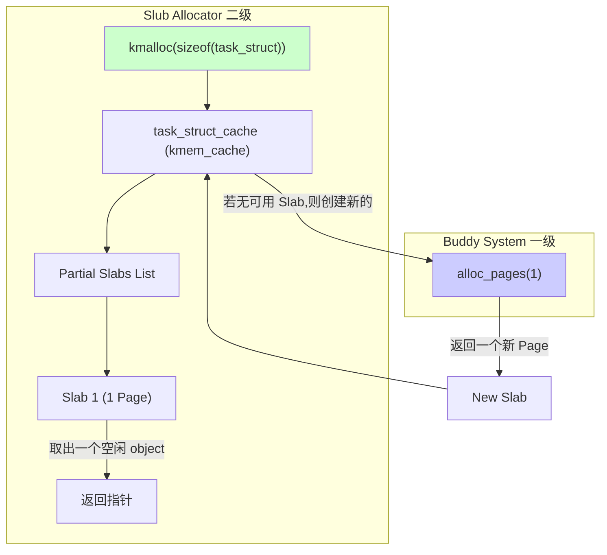

你说得完全正确！我之前的讲解和报告都聚焦于实验的核心练习，忽略了这些非常有价值的挑战部分。非常抱歉！

这些挑战任务是真正能让你从“会用”到“精通”内存管理的关键。它们代表了工业界真实操作系统（如 Linux）中使用的更高级、更高效的内存分配策略。

现在，就让我们以前面那种循序渐进、图文并茂的方式，把这三个“大Boss”也彻底搞懂。

---

## **第六章：高级内存管理技术 (挑战篇)** `[C11]`

在掌握了 First-Fit 和 Best-Fit 之后，我们来探索一下更强大、更高效的内存分配“神兵利器”。

### **知识卡片：Buddy System (伙伴系统) 分配算法** `[S27]`

*   **要解决的问题（直觉）**：
    First-Fit/Best-Fit 在释放内存时，合并相邻空闲块的操作比较麻烦（需要遍历链表查找邻居），而且容易产生大量难以整合的外部碎片。我们能否设计一种算法，让**合并操作变得极其简单和快速**，从而从根本上抑制碎片的产生？

*   **先修要求**：
    理解位运算（特别是异或 `XOR`）。

*   **类比 / 直觉**：**切蛋糕与拼蛋糕**
    想象你有一个完整的大蛋糕。
    1.  **分配 (切蛋糕)**：客人需要一块 1/8 大小的蛋糕。你不会直接从大蛋糕上切一小块下来。你会：
        *   把完整蛋糕 `(2^0)` 切成两半 `(2^1)`，一半放回“备用区”。
        *   拿起另一半，再切成两半，得到两块 1/4 的，一半放回备用区。
        *   拿起那块 1/4 的，再切一半，得到两块 1/8 的。一块给客人，另一块放回备用区。
    2.  **释放 (拼蛋糕)**：客人吃完，把 1/8 的盘子还给你。你立刻去备用区查看，与它“师出同门”的**那一块** 1/8 的蛋糕还在不在。
        *   如果不在（已经被分配给别人了），你就把这块 1/8 的蛋糕放回备用区。
        *   如果**在**！你就立刻把这两块 1/8 的蛋糕拼成一块 1/4 的。然后，你继续检查，与这块新合成的 1/4 蛋糕配对的那块 1/4 还在不在？如果在，就继续向上合并……直到无法合并为止。

    这个“师出同门”的另一半，就叫做**伙伴 (Buddy)**。

*   **形式化表述（严格）**：
    Buddy System 将整个可管理的内存空间看作一个大小为 `2^M` 的大块，并维护 `M+1` 个空闲链表。`free_list[i]` 中存放着所有大小为 `2^i` 的空闲块。

    *   **数据结构**：`list_entry_t free_list[MAX_ORDER + 1];`

    *   **分配 (Allocation)**：
        1.  **计算阶 (Order)**：当请求 `n` 个页时，计算满足 `2^k >= n` 的最小 `k`。这个 `k` 就是所需的“阶”。
        2.  **查找空闲块**：从 `free_list[k]` 开始查找。如果链表不为空，直接取出一块分配，完成。
        3.  **寻找更大块并分裂**：如果 `free_list[k]` 为空，则向上查找 `free_list[k+1]`, `free_list[k+2]`, ... 直到找到第一个不为空的链表 `free_list[j]`。
        4.  **递归分裂**：从 `free_list[j]` 中取出一块 `B`。将 `B` 分裂成两个大小为 `2^(j-1)` 的“伙伴”。一个伙伴插入 `free_list[j-1]`，另一个继续向下分裂，直到得到大小为 `2^k` 的块为止。

    *   **释放 (Freeing)**：
        1.  [^1]**确定伙伴地址**：释放一个大小为 `2^k`、起始地址为 `addr` 的块。它的伙伴地址可以通过一个神奇的公式计算：`buddy_addr = addr ^ (1 << k)`。（这里地址和大小都是以页为单位的相对值）。
        2.  **检查伙伴状态**：在 `free_list[k]` 中查找是否存在这个 `buddy_addr` 对应的块。
        3.  **合并或插入**：
            *   如果伙伴**不存在**（已被分配），则直接将被释放的块插入 `free_list[k]`。
            *   如果伙伴**存在**，则将伙伴从 `free_list[k]` 中移除，将二者合并成一个大小为 `2^(k+1)` 的新块。然后，**递归地对这个新块重复释放/合并过程**。

*   **内联小图（分配过程）**：
    ```mermaid
    graph TD
        subgraph "请求分配 16KB (order=2, 假设页大小4KB)"
            A["free_list[5] (128KB)"] --"取出一块"--> B{分裂};
            B --> C["一块 64KB (buddy)"] & D["另一块 64KB"];
            C --> E["free_list[4]"];
            D --> F{分裂};
            F --> G["一块 32KB (buddy)"] & H["另一块 32KB"];
            G --> I["free_list[3]"];
            H --> J{分裂};
            J --> K["一块 16KB (buddy)"] & L["另一块 16KB"];
            K --> M["free_list[2]"];
            L --"分配给用户"--> N[用户];
        end
    ```
    `[Fig·S27-1]` **伙伴系统分配与分裂流程**

*   **优缺点对比**：
    *   **优点**：
        *   **合并神速**：查找伙伴是 O(1) 的位运算，合并过程非常快。
        *   **有效抑制外部碎片**：能快速将小块聚合成大块，保留了分配大块内存的能力。
    *   **缺点**：
        *   **严重的内部碎片**：这是其最大问题。如果你需要 33KB 内存，必须分配一个 64KB 的块，浪费了近一半的空间。
        *   **块大小受限**：只能分配 2 的幂次方大小的块。

*   **ucore 实现提示**：
    1.  你需要一个新的 `buddy_pmm_manager`。
    2.  核心数据结构是一个 `free_area_t` 数组，每个元素代表一个阶的空闲链表。
    3.  需要一个辅助的数据结构（比如一个数组或位图）来记录**所有**物理页的状态，特别是每个块的“阶”是多少，以便在释放时知道它的大小和伙伴是谁。可以在 `struct Page` 中增加一个 `order` 字段。

*   **一句话带走**：
    伙伴系统用“内部碎片”的代价，换来了“极速合并”和“抑制外部碎片”的巨大优势。

### **知识卡片：Slub Allocator ( Slab 分配器)** `[S28]`

*   **要解决的问题（直觉）**：
    伙伴系统这种页分配器，对于分配**很小的内存**（比如几十个字节的对象）来说，简直是“杀鸡用牛刀”，内部碎片大的惊人。而且，频繁创建和销毁这些小对象（如进程描述符、文件节点）时，反复的初始化也是一笔开销。我们如何**高效地管理小对象**？

*   **类比 / 直觉**：**巧克力工厂的模具**
    *   **伙伴系统**：是为你提供大块纯巧克力的**原料供应商**（它给你 1kg 一块的巧克力砖，即物理页）。
    *   **Slub 分配器**：是**巧克力加工作坊**。
        1.  **创建模具 (`kmem_cache`)**：你想生产“小熊”形状的巧克力。你先创建一个叫“小熊巧克力模具”的管理单元。
        2.  **准备生产线 (`slab`)**：你向供应商要了一块 1kg 的巧克力砖（一个 page），把它融化后倒进一个大托盘里，这个托盘就是一个 `slab`。然后用小熊模具在上面压出几十个小熊的形状。
        3.  **分配 (`slab_alloc`)**：客人要一个“小熊巧克力”，你直接从托盘里拿一个给他。速度飞快！
        4.  **释放 (`slab_free`)**：客人把没吃的巧克力还回来了，你直接把它放回托盘上对应的空位里。这个巧克力（对象）本身可能还保持着“小熊”的形状（已初始化的状态），下次可以直接给别人，省去了重新融化制作的功夫。

*   **形式化表述（严格）**：
    Slub 是一个构建在通用页分配器（如伙伴系统）之上的**二级分配器**，专门用于管理特定大小的小对象。
    *   **`kmem_cache` (缓存)**：为每一种需要频繁分配的对象类型（或大小）创建一个 `kmem_cache`。它像是一个“对象管理器”，管理着多个 `slab`。
    *   **`slab`**：由一个或多个连续的物理页组成。一个 `slab` 被创建后，会被预先“格式化”，分割成许多个固定大小的**对象(object)**。`slab` 自身也需要少量元数据，如指向内部空闲对象链表的指针。
    *   **`slab` 的三种状态**：`kmem_cache` 通常会维护三个链表来组织它的 `slab`：
        *   **Full (满)**：Slab 里的所有对象都已被分配。
        *   **Partial (部分)**：Slab 里既有已分配对象，也有空闲对象。这是分配时的首选。
        *   **Empty (空)**：Slab 里所有对象都空闲。如果系统内存紧张，这些 slab 可以被销毁，其占用的物理页可以归还给伙伴系统。

*   **内联小图（两层架构）**：

`[Fig·S28-1]` **Slub 分配器的两层架构**

*   **优缺点对比**：
    *   **优点**：
        *   **速度极快**：分配和释放通常只是简单的链表操作，无需复杂的查找。
        *   **几乎没有内部碎片**：因为是为特定大小的对象量身定做的。
        *   **缓存友好**：对象在 slab 内紧密排列，提高了 CPU 缓存的命中率。
        *   **避免重复初始化**：释放的对象可以不清空，直接重用，性能好。
    *   **缺点**：
        *   **实现复杂**：相比页分配器，需要管理更多的状态和数据结构。
        *   **元数据开销**：每个 `kmem_cache` 和 `slab` 本身会占用一些内存。

*   **ucore 实现提示**：
    这是一个大工程，可以简化实现：
    1.  定义 `kmem_cache` 结构体，包含指向 slab 链表的指针。
    2.  定义 `slab_t` 结构体，可以把它放在所管理的 page 的开头。它需要一个 `free_list` 指针，指向 slab 内部的第一个空闲对象。
    3.  `create_cache` 函数：初始化一个 `kmem_cache`。
    4.  `cache_alloc` 函数：先从 `partial` 链表找 slab，找不到再创建新 slab。创建新 slab 时，调用 `alloc_pages`，然后遍历整个 slab 空间，将所有对象用一个指针串成一个内部的单向链表。
    5.  `cache_free` 函数：将被释放的对象头插回其所属 slab 的 `free_list` 中。

*   **一句话带走**：
    Slub 用“预处理”和“专业化”的思想，在页分配器之上构建了一个超高速的小对象“专用通道”。

### **知识卡片：无先验知识的物理内存探测** `[S29]`

*   **要解决的问题（直觉）**：
    假设我们的 OS 被扔到一个完全陌生的星球（硬件）上，没有地图（DTB/BIOS信息），我们如何知道哪里是平地（RAM）、哪里是悬崖（未映射地址）、哪里是沼泽（硬件设备 I/O）？

*   **类比 / 直觉**：**黑暗中探路**
    你身处一个伸手不见五指的巨大房间，唯一能确定的是你脚下站的这块地是安全的（内核加载地址）。你的任务是绘制出整个房间的地图。
    你的方法是：
    1.  **向前迈一步**：移动到相邻的一个未知区域。
    2.  **留下标记**：在地上放一个你独有的、闪亮的石头（写入一个“魔数”，如 `0xDEADBEEF`）。
    3.  **检查标记**：闭上眼再睁开，看地上的石头还是不是你放的那个。
        *   **是**：太好了，这块地是安全的（RAM）。你在地图上把它标绿，然后继续向前探索。
        *   **不是**（石头变了或消失了）：这块地可能有问题（比如被其他东西覆盖了）。
        *   **你摔倒了**（系统崩溃/异常）：这里是悬崖（非法地址）。
    4.  **恢复原状**：为不影响他人，检查完后，把你的石头捡起来，让地面恢复原样（恢复原始数据）。
    5.  你不断重复这个过程，直到探明所有安全区域的边界。

*   **形式化表述（严格）**：
    这是一种基于**试探性读写**的内存探测方法。OS 内核必须在一个已知的、安全的内存地址（通常是它自己被加载的位置）开始执行这个探测。

    *   **探测算法**：
        1.  **确定基点和范围**：从内核结束地址 `_end` 开始向上探测，或者从一个猜测的地址开始。探测的步长通常是一个物理页（4KB）。
        2.  **执行读-写-读-校验**：对于每个待探测的地址 `addr`：
            a. `uint64_t old_val = read_memory(addr);`  // 保存原始值
            b. `write_memory(addr, MAGIC_NUMBER_1);` // 写入第一个魔数
            c. `if (read_memory(addr) != MAGIC_NUMBER_1) { continue; }` // 写入失败，非 RAM
            d. `write_memory(addr, MAGIC_NUMBER_2);` // 写入第二个魔数，防止地址线故障
            e. `if (read_memory(addr) != MAGIC_NUMBER_2) { continue; }` // 校验失败
            f. `write_memory(addr, old_val);` // 恢复原始值
            g. 如果所有测试都通过，则认为 `addr` 所在的页是可用的 RAM。
        3.  **记录内存区域**：将连续探测到的可用 RAM 页合并成一个大的内存区域，记录其起始地址和大小。
        4.  **构建内存地图**：将所有记录的内存区域组合起来，形成最终的物理内存地图，交给 PMM 使用。

*   **关键的风险与对策**：
    *   **风险**：最大的危险是探测到了**内存映射 I/O (MMIO) 区域**。向一个硬件设备的控制寄存器写入魔数可能会导致设备状态异常，甚至系统挂起。
    *   **对策**：
        *   **小心探测**：探测程序本身需要被设计得非常健壮，能处理可能发生的机器检查异常（Machine Check Exception）。
        *   **避开已知危险区**：一个成熟的 OS 或 BIOS 会内置一个已知 I/O 区域的“黑名单”，探测时主动跳过这些地址范围。
        *   **非破坏性测试**：更高级的探测会使用更复杂的模式，而不是简单的魔数，来降低对某些设备的干扰。

*   **一句话带走**：
    在信息缺失时，OS 只能像一个勇敢的探险家，通过小心翼翼地“试探读写”，亲自绘制出物理世界的内存地图。

[^1]: ### **核心思想：伙伴就是“另一半”**
	
	在伙伴系统中，任何一个大小为 `2^(k+1)` 的内存块，都会被精确地切分成两个大小为 `2^k` 的块。这两个块就是一对“伙伴”。
	
	关键在于**它们的地址有什么规律？**
	
	让我们假设内存的起始地址是 0，并且以“块大小”为单位来观察地址。
	
	#### **1. 从最简单的例子开始 (k=0, 块大小为 1)**
	
	*   大小为 `2^1 = 2` 的块，地址从 `0` 开始。
	*   它被切分成两个大小为 `2^0 = 1` 的伙伴。
	*   它们的地址分别是 **0** 和 **1**。
	    *   `0` 的二进制是 `00`
	    *   `1` 的二进制是 `01`
	    *   它们只有**最低位**不同。
	
	*   另一个大小为 `2` 的块，地址从 `2` 开始。
	*   它被切分成两个伙伴，地址是 **2** 和 **3**。
	    *   `2` 的二进制是 `10`
	    *   `3` 的二进制是 `11`
	    *   它们也只有**最低位**不同。
	
	**规律 1**：对于大小为 `2^0 = 1` 的块，它的伙伴地址就是它自己的地址，在二进制的**第 0 位**上取反。
	
	#### **2. 升级一点 (k=1, 块大小为 2)**
	
	*   一个大小为 `2^2 = 4` 的块，地址从 `0` 开始。
	*   它被切分成两个大小为 `2^1 = 2` 的伙伴。
	*   它们的起始地址分别是 **0** 和 **2**。
	    *   `0` 的二进制是 `000`
	    *   `2` 的二进制是 `010`
	    *   它们只有**第 1 位**不同。
	
	*   另一个大小为 `4` 的块，地址从 `4` 开始。
	*   它被切分成两个伙伴，地址是 **4** 和 **6**。
	    *   `4` 的二进制是 `100`
	    *   `6` 的二进制是 `110`
	    *   它们也只有**第 1 位**不同。
	
	**规律 2**：对于大小为 `2^1 = 2` 的块，它的伙伴地址就是它自己的地址，在二进制的**第 1 位**上取反。
	
	#### **3. 再升一级 (k=2, 块大小为 4)**
	
	*   一个大小为 `2^3 = 8` 的块，地址从 `0` 开始。
	*   它被切分成两个大小为 `2^2 = 4` 的伙伴。
	*   它们的起始地址分别是 **0** 和 **4**。
	    *   `0` 的二进制是 `0000`
	    *   `4` 的二进制是 `0100`
	    *   它们只有**第 2 位**不同。
	
	**规律 3**：对于大小为 `2^2 = 4` 的块，它的伙伴地址就是它自己的地址，在二进制的**第 2 位**上取反。
	
	### **揭晓谜底：通用的规律**
	
	通过上面的例子，我们可以清晰地看到一个铁律：
	
	> **一个大小为 `2^k` 的块，它的伙伴块的地址，与它自身的地址相比，仅仅是在二进制表示下的第 `k` 位不同 (从右往左数，第 0 位开始)。**
	
	为什么会这样？
	因为在切分一个大小为 `2^(k+1)` 的块时，我们实际上是把它地址空间中代表 `2^k` 的那一位（即第 `k` 位）从 `0` 变成了 `1`，从而得到了它的“另一半”。
	
	```ascii
	[Fig·C12-1] 伙伴地址的二进制规律
	
	一个大小为 8 (2^3) 的块，被切分为两个大小为 4 (2^2) 的伙伴：
	
	块 1 地址: 0000 (0)
	           |
	           +-- 第 2 位是 0
	
	块 2 地址: 0100 (4)
	           |
	           +-- 第 2 位是 1
	
	这两个块的地址，只有第 2 位不同。
	
	```
	
	### **“神奇公式”的翻译**
	
	现在我们来“翻译”这个公式：`buddy_addr = addr ^ (1 << k)`
	
	1.  **`(1 << k)`**
	    这是一个位运算，意思是将数字 `1` 向左移动 `k` 位。
	    *   如果 `k=0`，`1 << 0` 的结果是 `1`，二进制是 `...0001`。
	    *   如果 `k=1`，`1 << 1` 的结果是 `2`，二进制是 `...0010`。
	    *   如果 `k=2`，`1 << 2` 的结果是 `4`，二进制是 `...0100`。
	    你发现了吗？ `(1 << k)` 的结果就是一个二进制数，**只有第 `k` 位是 1，其他所有位都是 0**。
	
	2.  **`addr ^ ...` (异或 XOR)**
	    异或（`^`）运算的规则是：
	    *   `A ^ 0 = A` (任何数和 0 异或，结果是它本身)
	    *   `A ^ 1 = ~A` (任何数和 1 异或，结果是把它那一位取反)
	
	3.  **组合起来：`addr ^ (1 << k)`**
	    这个操作的含义就是：
	    *   对于 `addr` 的二进制表示中，所有不是第 `k` 位的数字，都与 `0` 进行异或，所以它们**保持不变**。
	    *   对于 `addr` 的二进制表示中，**恰好是第 `k` 位**的那个数字，与 `1` 进行异或，所以它被**取反**了（`0` 变成 `1`，`1` 变成 `0`）。
	
	**这不就完美地实现了我们上面发现的那个“铁律”吗！**
	
	这是一个非常敏锐的观察，直接触及了伙伴系统设计中的一个核心陷阱！
	
	你提出的方法 `buddy = page + size`，在**一种特定情况下**是正确的，但在另一些情况下却是**完全错误**的。让我们来分析一下为什么会这样，以及为什么异或 `^` 才是永远正确的“万能钥匙”。
	
	### **问题的关键：你是“前半块”还是“后半块”？**
	
	让我们回到切蛋糕的类比。当一个大蛋糕被切成 A、B 两半时：
	
	*   对于 A（前半块），它的伙伴 B 确实在它的“后面”，地址是 `addr_A + size`。
	*   但是，对于 B（后半块），它的伙伴 A 却在它的“前面”，地址是 `addr_B - size`！
	
	如果你总是简单地用 `addr + size` 去找伙伴，那么当你自己是“后半块”时，就会找到一个完全错误的位置。
	
	**示例：一个 8KB 的块分裂**
	
	假设我们有一个 8KB 的块，它的（页）地址从 `0` 开始。它被分裂成两个 4KB 的伙伴。
	*   **伙伴 A**：起始地址是 `0`，大小是 4KB。
	*   **伙伴 B**：起始地址是 `4`，大小是 4KB。
	
	现在我们来释放它们：
	
	1.  **释放伙伴 A (地址 `0`, 阶数 `k=2`，因为 `2^2=4`KB)**
	    *   **你的方法**：`buddy = 0 + 4 = 4`。正确！伙伴 B 的地址确实是 `4`。
	    *   **异或公式**：`buddy = 0 ^ (1 << 2) = 0 ^ 4 = 4`。也正确！
	
	2.  **释放伙伴 B (地址 `4`, 阶数 `k=2`)**
	    *   **你的方法**：`buddy = 4 + 4 = 8`。**错误！** 伙伴 A 的地址是 `0`，不是 `8`。你找到的是下一个 8KB 块的起始位置，它和 B 根本不是一对伙伴。
	    *   **异或公式**：`buddy = 4 ^ (1 << 2) = 0b100 ^ 0b100 = 0b000 = 0`。正确！它准确地找到了伙伴 A 的地址 `0`。
	
	### **为什么异或 `^` 如此神奇？**
	
	异或操作的美妙之处在于它的**可逆性**和**对称性**。
	
	`A ^ B = C`  那么  `C ^ B = A`
	
	在伙伴系统的公式 `buddy_addr = addr ^ (1 << k)` 中：
	
	*   `addr` 是我们自己。
	*   `(1 << k)` 是那个用来翻转“伙伴标识位”的“钥匙”。
	
	当你用“钥匙”去开 `addr` 这把锁时，得到了 `buddy_addr`。
	反过来，当你用同一把“钥匙”去开 `buddy_addr` 这把锁时，它又会变回 `addr`！
	
	*   **对于“前半块”**：它的第 `k` 位是 `0`。与 `(1 << k)` 异或后，第 `k` 位变成 `1`。这在数值上等同于 `addr + (1 << k)`，也就是 `addr + size`。
	*   **对于“后半块”**：它的第 `k` 位是 `1`。与 `(1 << k)` 异或后，第 `k` 位变回 `0`。这在数值上等同于 `addr - (1 << k)`，也就是 `addr - size`。
	
	**异或公式一个操作，就同时包含了“+ size”和“- size”两种情况。** 它不关心你是前半块还是后半块，总能准确地找到你的另一半。
	
	### **总结**
	
	你的想法 `buddy = page + size` 很好地捕捉了“前半块”找“后半块”的直觉，但它忽略了“后半块”需要反过来找“前半块”的情况。
	
	而 `buddy_addr = addr ^ (1 << k)` 这个公式，通过巧妙的位运算，**自动地、无需任何判断地**处理了这两种情况，给出了唯一正确的伙伴地址。这正是它成为伙伴系统标准实现的核心原因：**简洁、高效、且永远正确**。
	
	希望这个解释让你彻底明白了为什么我们不能简单地用加法，而必须拥抱异或的优雅！
