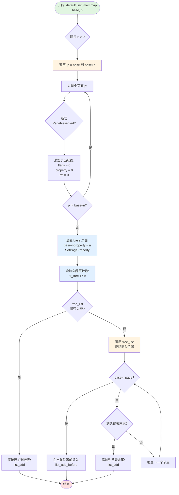
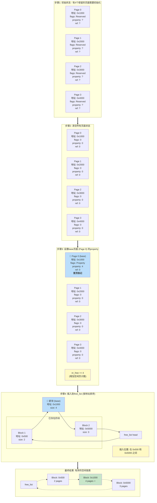
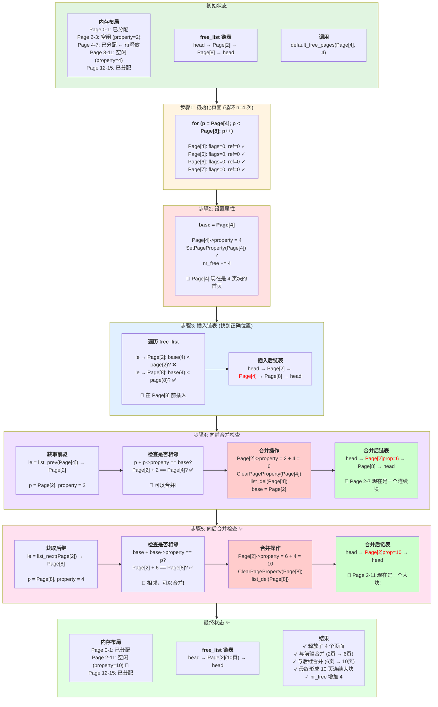

```mermaid
graph TD
    subgraph "输入参数"
        INPUT["n = 2 (请求分配2个页面)"]
    end
    
    subgraph "初始状态 - Step 0"
        S0_VAR["变量: nr_free = 7<br/>page = NULL<br/>le = &free_list"]
        S0_LIST["空闲链表:<br/>free_list → Page0(prop=1) → Page1(prop=4) → Page2(prop=2) → free_list"]
    end
    
    subgraph "遍历查找 - Step 1"
        S1_VAR["le = list_next(le)<br/>p = Page0<br/>检查: p->property(1) >= n(2)? ❌"]
        S1_LIST["继续遍历...<br/>👉 Page0(prop=1) → Page1(prop=4) → Page2(prop=2)"]
    end
    
    subgraph "遍历查找 - Step 2"
        S2_VAR["le = list_next(le)<br/>p = Page1<br/>检查: p->property(4) >= n(2)? ✅<br/>✨ 找到! page = Page1"]
        S2_LIST["👉 Page0(prop=1) → <mark>Page1(prop=4)</mark> ← Page2(prop=2)"]
    end
    
    subgraph "删除节点 - Step 3"
        S3_VAR["prev = Page0的指针<br/>执行: list_del(&page->page_link)"]
        S3_LIST["Page0(prop=1) ⚡ ❌ Page1 移除 ❌ ⚡ Page2(prop=2)"]
    end
    
    subgraph "分割处理 - Step 4"
        S4_VAR["page->property(4) > n(2)? ✅<br/>创建新空闲块:<br/>p = page + 2 = Page1+2<br/>p->property = 4 - 2 = 2<br/>SetPageProperty(p)"]
        S4_CALC["分割说明:<br/>原块: Page1, 大小=4<br/>分配: Page1~Page2, 大小=2<br/>剩余: Page3~Page4, 大小=2"]
    end
    
    subgraph "重新插入 - Step 5"
        S5_VAR["list_add(prev, &p->page_link)<br/>在Page0后插入新空闲块"]
        S5_LIST["Page0(prop=1) → 🆕Page3(prop=2) → Page2(prop=2)"]
    end
    
    subgraph "更新状态 - Step 6"
        S6_VAR["nr_free -= 2<br/>nr_free = 7 - 2 = 5<br/>ClearPageProperty(page)<br/>标记Page1为已分配"]
        S6_RESULT["✅ 返回 page = Page1<br/>已分配: Page1~Page2"]
    end
    
    subgraph "最终状态 - Step 7"
        S7_VAR["变量: nr_free = 5"]
        S7_LIST["空闲链表:<br/>free_list → Page0(prop=1) → Page3(prop=2) → Page2(prop=2) → free_list"]
        S7_ALLOC["已分配: Page1~Page2 (2个页面)"]
    end
    
    INPUT --> S0_VAR
    S0_VAR --> S0_LIST
    S0_LIST --> S1_VAR
    S1_VAR --> S1_LIST
    S1_LIST --> S2_VAR
    S2_VAR --> S2_LIST
    S2_LIST --> S3_VAR
    S3_VAR --> S3_LIST
    S3_LIST --> S4_VAR
    S4_VAR --> S4_CALC
    S4_CALC --> S5_VAR
    S5_VAR --> S5_LIST
    S5_LIST --> S6_VAR
    S6_VAR --> S6_RESULT
    S6_RESULT --> S7_VAR
    S7_VAR --> S7_LIST
    S7_LIST --> S7_ALLOC
    
    style S2_LIST fill:#fff3cd,stroke:#ffc107
    style S4_VAR fill:#d1ecf1,stroke:#0dcaf0
    style S5_LIST fill:#d4edda,stroke:#28a745
    style S7_ALLOC fill:#f8d7da,stroke:#dc3545
```

# default_init_memmap

## 概述
将一块新的空闲内存加入 `free_list`
## 流程图

## 示例图

# default_alloc_pages

## 概述 
在空闲页链表中查找一块连续的 `n` 页空闲物理内存，如果找到则分配出去并更新空闲链表和计数。
## 示例图

## 流程图

```mermaid
flowchart TD
    Start([开始: default_alloc_pages])
    Input[/输入: n 请求分配页数/]
    Assert{断言: n > 0}
    CheckFree{n > nr_free?}
    ReturnNull1[返回 NULL]
    
    InitVar["初始化变量:<br/>page = NULL<br/>le = free_list 头节点"]
    
    LoopStart{le = list_next<br/>le != free_list?}
    GetPage["p = le2page(le, page_link)<br/>获取当前页"]
    
    CheckProp{p->property >= n?}
    SetPage["找到合适页面:<br/>page = p"]
    Break[跳出循环]
    
    CheckFound{page != NULL?}
    ReturnNull2[返回 NULL]
    
    GetPrev["prev = list_prev<br/>保存前驱节点"]
    DelPage["list_del(page_link)<br/>从链表删除此页"]
    
    CheckSplit{page->property > n?<br/>需要分割?}
    
    CalcNewPage["计算新空闲块:<br/>p = page + n<br/>p->property = page->property - n"]
    SetProp["SetPageProperty(p)<br/>标记为空闲页"]
    AddBack["list_add(prev, p_link)<br/>插入剩余块到链表"]
    
    UpdateFree["nr_free -= n<br/>更新空闲页计数"]
    ClearProp["ClearPageProperty(page)<br/>标记页面为已分配"]
    
    Return[/返回 page 指针/]
    End([结束])
    
    Start --> Input
    Input --> Assert
    Assert -->|Yes| CheckFree
    Assert -->|No| ReturnNull1
    CheckFree -->|Yes 空闲不足| ReturnNull1
    CheckFree -->|No 空闲充足| InitVar
    
    InitVar --> LoopStart
    LoopStart -->|Yes 继续遍历| GetPage
    LoopStart -->|No 遍历结束| CheckFound
    
    GetPage --> CheckProp
    CheckProp -->|No 太小| LoopStart
    CheckProp -->|Yes 足够大| SetPage
    SetPage --> Break
    Break --> CheckFound
    
    CheckFound -->|No 未找到| ReturnNull2
    CheckFound -->|Yes 找到了| GetPrev
    
    GetPrev --> DelPage
    DelPage --> CheckSplit
    
    CheckSplit -->|Yes| CalcNewPage
    CheckSplit -->|No 正好匹配| UpdateFree
    
    CalcNewPage --> SetProp
    SetProp --> AddBack
    AddBack --> UpdateFree
    
    UpdateFree --> ClearProp
    ClearProp --> Return
    
    Return --> End
    ReturnNull1 --> End
    ReturnNull2 --> End
    
    style Start fill:#e3f2fd
    style End fill:#e3f2fd
    style CheckFree fill:#fff3e0
    style CheckProp fill:#fff3e0
    style CheckSplit fill:#fff3e0
    style CheckFound fill:#fff3e0
    style ReturnNull1 fill:#ffebee
    style ReturnNull2 fill:#ffebee
    style SetPage fill:#e8f5e9
    style CalcNewPage fill:#f3e5f5
    style AddBack fill:#f3e5f5
    style Return fill:#e8f5e9
```

# default_free_pages
## 概述
将一块连续的 `n` 页物理内存释放回空闲链表，并尝试与相邻的空闲块合并成更大的连续空闲区。

## 流程图

```mermaid
flowchart TD
    Start([开始: default_free_pages<br/>base, n]) --> Assert1{assert n > 0<br/>检查释放页面数是否合法}
    Assert1 -->|通过| Init[p = base<br/>初始化遍历指针指向第一个页面]
    
    Init --> Loop1{p != base + n?<br/>是否遍历完所有要释放的页面}
    Loop1 -->|是| Assert2{assert: !PageReserved && !PageProperty<br/>检查页面未被保留且未标记为空闲块首}
    Assert2 -->|通过| Clear[p->flags = 0; set_page_ref = 0<br/>清除页面标志位和引用计数]
    Clear --> IncP[p++<br/>移动到下一个页面]
    IncP --> Loop1
    
    Loop1 -->|否| SetProp[base->property = n<br/>SetPageProperty<br/>nr_free += n<br/>设置连续空闲页数并标记首页<br/>更新全局空闲页总数]
    
    SetProp --> CheckEmpty{list_empty?<br/>检查空闲链表是否为空}
    
    CheckEmpty -->|是| AddDirect[list_add<br/>链表为空,直接将base插入链表头]
    AddDirect --> MergePrev
    
    CheckEmpty -->|否| InitLE[le = &free_list<br/>初始化链表遍历指针]
    InitLE --> TraverseLoop{le = list_next<br/>遍历链表找插入位置}
    
    TraverseLoop -->|遍历完成| MergePrev
    TraverseLoop -->|未完成| GetPage[page = le2page<br/>获取当前节点对应的Page结构]
    
    GetPage --> Compare{base < page?<br/>比较地址,判断是否找到插入位置}
    Compare -->|是| InsertBefore[list_add_before<br/>在当前节点前插入base<br/>保持链表按地址升序]
    InsertBefore --> MergePrev
    
    Compare -->|否| CheckEnd{list_next == &free_list?<br/>是否到达链表末尾}
    CheckEnd -->|是| InsertAfter[list_add<br/>base地址最大,插入链表尾部]
    InsertAfter --> MergePrev
    CheckEnd -->|否| TraverseLoop
    
    MergePrev[阶段3: 尝试向前合并] --> GetPrev[le = list_prev<br/>获取base的前驱节点]
    GetPrev --> CheckPrev{le != &free_list?<br/>前驱是否存在}
    
    CheckPrev -->|是| GetPrevPage[p = le2page<br/>获取前驱的Page结构]
    GetPrevPage --> CheckMerge1{p + p->property == base?<br/>检查前驱块的结束地址<br/>是否等于base起始地址}
    
    CheckMerge1 -->|是| Merge1[p->property += base->property<br/>ClearPageProperty<br/>list_del; base = p<br/>合并: 前驱块扩展,删除base节点<br/>更新base指针为合并后的块]
    Merge1 --> MergeNext
    
    CheckMerge1 -->|否| MergeNext
    CheckPrev -->|否| MergeNext
    
    MergeNext[阶段4: 尝试向后合并] --> GetNext[le = list_next<br/>获取base的后继节点]
    GetNext --> CheckNext{le != &free_list?<br/>后继是否存在}
    
    CheckNext -->|是| GetNextPage[p = le2page<br/>获取后继的Page结构]
    GetNextPage --> CheckMerge2{base + base->property == p?<br/>检查base块的结束地址<br/>是否等于后继起始地址}
    
    CheckMerge2 -->|是| Merge2[base->property += p->property<br/>ClearPageProperty<br/>list_del<br/>合并: base块扩展,删除后继节点]
    Merge2 --> End
    
    CheckMerge2 -->|否| End
    CheckNext -->|否| End
    
    End([函数结束<br/>空闲页已释放并合并])
    
    style Start fill:#e1f5e1
    style End fill:#ffe1e1
    style Loop1 fill:#fff4e1
    style TraverseLoop fill:#fff4e1
    style CheckEmpty fill:#e1f0ff
    style Compare fill:#e1f0ff
    style CheckMerge1 fill:#f0e1ff
    style CheckMerge2 fill:#f0e1ff
```

## 运行示例图

