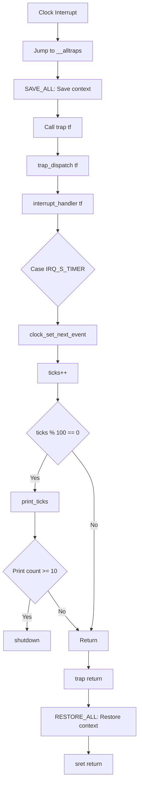

好的，没问题。非常荣幸能以一位教学专家的身份，为你 meticulously 讲解操作系统实验三的核心知识：中断与异常。

请放心，我会用最温柔、最鼓励的语气，带你一步步地深入理解这个看似复杂但极其重要的主题。我们将从最基础的直觉开始，逐步构建起严谨的知识体系，确保你不仅能完成实验，更能获得深刻的理解。让我们一起开始这段探索之旅吧！

---

### **学习路线图 (Learning Roadmap)**

亲爱的同学，你好！在接下来的学习中，我们将一起探索操作系统如何感知并响应世界的变化。这个过程就像是为我们沉静的内核装上了“耳朵”和“神经系统”。

*   **第一站：理解“中断”是什么 (≈ 15分钟)**：我们将通过生动的比喻，让你明白为什么计算机需要中断机制，以及它和异常、陷入有什么区别。
*   **第二站：RISC-V的中断内幕 (≈ 30分钟)**：深入硬件层面，了解RISC-V架构是如何通过特殊的“信使”（控制状态寄存器 CSR）来报告和管理中断的。
*   **第三站：乾坤大挪移：上下文切换 (≈ 45分钟)**：这是本章的难点，也是最酷的部分。我们将拆解精巧的汇编代码，看看CPU是如何“暂停游戏，保存进度”，处理完中断后再“读取进度，继续游戏”的。
*   **第四站：动手实践：让时钟“滴答”作响 (≈ 30分钟)**：我们将完成一个有时钟中断的内核，亲手编写代码，让它在我们的控制下规律地打印信息。

整个过程预计需要2小时左右，但请不要着急，慢慢来，理解透彻最重要。

### **核心知识地图 (Core Knowledge Map)**

为了让你对本章内容有个全局的认识，这里有一份简明的知识地图：

```
操作系统中断处理 (Lab 3)
├── 1. 为什么需要中断？ (The "Why")
│   ├── 异步事件处理 (如：磁盘IO完成)
│   └── 系统保护与调度 (如：时钟中断，非法操作)
│
├── 2. RISC-V中断机制 (The "How" - Hardware)
│   ├── 三种特权级 (M/S/U Mode)
│   ├── 中断的分类与委托 (Interrupt, Exception, Trap & Delegation)
│   └── 核心控制寄存器 (CSRs)
│       ├── stvec: 中断处理入口地址
│       ├── scause: 中断原因
│       ├── sepc: 中断发生地址
│       ├── sstatus: CPU状态 (中断使能)
│       └── sscratch: 临时“中转站”
│
├── 3. 中断处理流程 (The "How" - Software)
│   ├── a. 硬件自动响应 (保存pc, 切换模式...)
│   ├── b. 汇编入口 (__alltraps)
│   │   └── 上下文保存 (SAVE_ALL) -> trapframe
│   ├── c. C语言处理函数 (trap_dispatch)
│   │   ├── 根据scause分发
│   │   └── 执行具体Handler (如：时钟中断)
│   └── d. 返回与恢复
│       ├── 汇编出口 (__trapret)
│       └── 上下文恢复 (RESTORE_ALL) -> sret
│
└── 4. 实践案例
    ├── 时钟中断 (Timer Interrupt)
    └── 异常处理 (Exception Handling)
```

这张图就像我们的探险地图，接下来，我们将逐一探索地图上的每一个角落。

---

### **逐点精讲 (Point-by-Point Explanation)**

现在，我们正式进入学习的核心部分。我会用“知识卡片”的形式，为你讲解每一个重要概念。

#### **知识卡片1：中断、异常与陷入 (Interrupt, Exception, Trap)**

*   **它解决了什么问题 (Intuitive)** `[S05]`
    想象一下你正在厨房里专心致志地做一道复杂的菜。这时，门铃响了（有客人来），同时，你发现锅里的水烧干了（一个意外错误），而且你还需要按时从烤箱里取出面包（一个定时任务）。
    *   **外部中断 (Interrupt)**：就像门铃，它是一个来自你（CPU）外部的、异步的事件。你不知道它何时会响，但一旦响了，你就得去开门。对应到计算机，就是硬盘读完数据、键盘被按下等。
    *   **异常 (Exception)**：就像锅里的水烧干了，这是你在执行当前任务（做菜）时，指令本身或其结果出现了问题。比如除以零、访问了一个不存在的内存地址。
    *   **陷入 (Trap)**：就像你主动去看一下烤箱，这是一个你（程序）主动、同步发起的请求，希望切换到另一种状态去完成特定任务。在操作系统中，最常见的就是应用程序通过`ecall`指令请求内核服务（即系统调用）。

*   **前置知识 (Prerequisites)**
    *   理解CPU是按顺序执行指令的。

*   **直觉比喻 (Analogy)**
    CPU是厨房里的大厨。
    *   **中断**：外卖小哥按门铃。大厨停下手中的活，去开门取外卖，然后再回来继续切菜。
    *   **异常**：切菜时刀滑了，切到了手。大厨必须立刻停下来处理伤口，处理不好可能这道菜就做不下去了。
    *   **陷入**：大厨发现没盐了，于是主动走到储藏室去取盐。这是他计划中的一部分。

*   **严谨的正式声明 (Rigorous)** `[S05]`
    在RISC-V架构中，这三者被统称为**陷阱 (Trap)**。它们都会打断当前正常的指令流，将控制权转移给一个预设的陷阱处理程序。
    *   **Interrupt (外部中断)**：由处理器外部的硬件设备（如定时器、I/O设备）产生的异步事件。`scause`寄存器的最高位为1。
    *   **Exception (异常)**：在执行指令过程中，由处理器内部检测到的同步错误。`scause`寄存器的最高位为0。
    *   **Trap (陷入)**：特指由`ecall`, `ebreak`等指令主动触发的同步事件，它是异常的一种。

*   **关键结果与辨析 (Key Results & Comparison)** `[S05]`

| 特性     | 外部中断 (Interrupt)               | 异常 (Exception) / 陷入 (Trap)         |
| :------- | :--------------------------------- | :--------------------------------------- |
| **来源** | CPU外部 (外设，定时器)             | CPU内部 (指令执行)                       |
| **同步性** | 异步 (Asynchronous)                | 同步 (Synchronous)                       |
| **意图** | 响应外部事件                       | 处理错误或请求服务                       |
| **举例** | 时钟中断、键盘输入                 | 除零错误、缺页、系统调用(`ecall`)        |

*   **一句话总结 (One-Sentence Takeaway)**
    中断是来自外部的“打扰”，异常是执行内部指令时出的“差错”，而陷入是程序主动的“请求”。

*   **自查三问 (Self-Check)**
    1.  **判断题**：系统调用（syscall）是一种外部中断。 (✕)
    2.  **选择题**：当程序试图读取一个未被映射的内存地址时，会发生什么？ (B)
        A. 外部中断 B. 异常 C. 陷入 D. 以上都不是
    3.  **开放题**：为什么说外部中断是“异步”的？请举例说明。

---

#### **知识卡片2：RISC-V 特权级 (Privilege Modes)**

*   **它解决了什么问题 (Intuitive)** `[S06]`
    操作系统是整个计算机的“大管家”，而应用程序是住在里面的“房客”。为了防止房客把房子搞得一团糟（比如把承重墙砸了），我们需要给他们不同的权限。“大管家”可以动任何东西，而“房客”只能在自己的房间里活动，需要特殊服务（比如修水管）时必须向管家申请。这就是特权级要解决的：**安全隔离**。

*   **前置知识 (Prerequisites)**
    *   理解操作系统内核与用户应用程序的区别。

*   **直觉比喻 (Analogy)**
    一个国家有三个权力阶层：
    *   **U模式 (User Mode - 平民)**：运行普通应用程序。权限最低，不能直接操作国家机器。
    *   **S模式 (Supervisor Mode - 政府官员)**：运行操作系统内核。管理国家资源（内存、设备），为平民提供服务。
    *   **M模式 (Machine Mode - 造物主/上帝)**：运行底层固件（如OpenSBI）。拥有最高权限，可以直接控制硬件，负责启动和最底层的管理。

*   **严谨的正式声明 (Rigorous)** `[S06]`
    RISC-V定义了三个核心特权级，用于提供不同层次的硬件访问控制。
    *   **U-Mode (User/Application)**：权限最低。用于运行用户程序。禁止执行特权指令和访问大部分CSR。
    *   **S-Mode (Supervisor)**：中间权限。用于运行操作系统内核，支持虚拟内存管理（页表）。我们实验中的内核就运行在S模式。
    *   **M-Mode (Machine)**：最高权限。是所有RISC-V处理器必须实现的模式。通常用于执行底层固件（Firmware）和引导加载程序（Bootloader），如本实验中的OpenSBI。

*   **关键结果与图示 (Key Results & Figure)** `[S06, S10]`

    ```mermaid
    graph TD
        subgraph "特权级与转换"
            U("U-Mode (用户态)<br>运行App")
            S("S-Mode (内核态)<br>运行OS Kernel")
            M("M-Mode (机器态)<br>运行Firmware/SBI")
        end

        U -- "ecall (系统调用)<br>缺页/非法指令" --> S
        S -- "sret (处理完毕)" --> U
        S -- "ecall (请求底层服务)" --> M
        M -- "mret (服务完毕)" --> S
        
        style U fill:#c9ffc9,stroke:#333
        style S fill:#ffc9c9,stroke:#333
        style M fill:#c9c9ff,stroke:#333
    ```
    `[Fig·S06-1]` 图示：RISC-V特权级转换路径。用户程序通过`ecall`陷入内核态，内核处理完毕后通过`sret`返回。内核也可以通过`ecall`请求机器态的服务。

*   **一句话总结 (One-Sentence Takeaway)**
    特权级是硬件设定的保护边界，确保用户程序不会破坏操作系统，操作系统也不会轻易破坏底层固件。

*   **自查三问 (Self-Check)**
    1.  **判断题**：一个普通的应用程序可以直接执行指令来修改`stvec`寄存器。 (✕)
    2.  **选择题**：我们的ucore内核主要运行在哪个特权级？ (B)
        A. U-Mode B. S-Mode C. M-Mode
    3.  **开放题**：如果没有特权级之分，所有代码都运行在最高权限，可能会有什么风险？

---

#### **知识卡片3：中断路由与委托机制 (Routing & Delegation)**

*   **它解决了什么问题 (Intuitive)** `[S07]`
    默认情况下，任何风吹草动（所有中断和异常）都会直接上报给“最高领导”——M模式。但这效率很低，就像公司里员工打印机卡纸了也要CEO来处理一样。为了提高效率，“最高领导”可以授权给“部门经理”（S模式），让他们处理自己部门内部的事务。这就是委托机制。

*   **前置知识 (Prerequisites)**
    *   理解RISC-V的三种特权级。

*   **严谨的正式声明 (Rigorous)** `[S07]`
    默认情况下，所有陷阱（trap）都会被路由到M模式进行处理。然而，M模式可以通过设置`mideleg`（Machine Interrupt Delegation）和`medeleg`（Machine Exception Delegation）这两个CSR，将特定类型的中断和异常“委托”给S模式直接处理，无需再经过M模式。

    *   `mideleg`：控制哪些**外部中断**可以被委托给S模式。
    *   `medeleg`：控制哪些**异常**和**软件中断**可以被委托给S模式。

    在我们的实验中，OpenSBI固件在启动阶段已经为我们设置好了这两个寄存器，将绝大部分来自U模式和S模式的陷阱都委托给了S模式处理。这使得我们的操作系统内核（运行在S模式）可以高效地处理系统调用、缺页、时钟中断等事件。

*   **图示：中断处理路径 (Figure: Trap Routing)** `[S07]`

    ```mermaid
    graph TD
        subgraph "无委托 (Default)"
            A[U/S模式发生陷阱] --> B{M模式处理}
        end

        subgraph "有委托 (Delegated)"
            C[U/S模式发生陷阱] --> D{陷阱类型是否在<br>mideleg/medeleg中?}
            D -- "是" --> E[S模式直接处理]
            D -- "否" --> F[仍然由M模式处理]
        end
    ```
    `[Fig·S07-1]` 图示：中断委托机制流程。通过设置`mideleg`和`medeleg`，可以改变中断处理的默认路径，提高S模式操作系统的响应效率。

*   **一句话总结 (One-Sentence Takeaway)**
    委托机制是M模式下放权力给S模式的一种方式，让操作系统内核能直接、高效地处理大部分中断和异常。

*   **自查三问 (Self-Check)**
    1.  **判断题**：在ucore中，当用户程序执行`ecall`时，CPU会先进入M模式，再由M模式跳转到S模式的内核代码。 (✕，因为已经被委托了)
    2.  **选择题**：哪个寄存器负责将“缺页异常”的处理权交给S模式？ (B)
        A. `mideleg` B. `medeleg` C. `stvec` D. `sstatus`
    3.  **开放题**：为什么不把所有中断和异常都委托给S模式？（提示：考虑哪些是必须由M模式处理的底层安全事件）

---

#### **知识卡片4：S模式陷阱处理的关键CSRs (Key CSRs for S-Mode Traps)**

*   **它解决了什么问题 (Intuitive)** `[S08, S09]`
    当中断发生时，CPU就像一个侦探抵达了“案发现场”。为了破案，侦探需要知道几件事：
    1.  **案发地点在哪里？** (`sepc`)
    2.  **发生了什么案子？** (`scause`)
    3.  **有什么现场线索？** (`stval`)
    4.  **接下来应该去哪里报案？** (`stvec`)
    这些关键信息都由硬件自动记录在特殊的寄存器（CSRs）里，供操作系统内核这个“警察局”使用。

*   **前置知识 (Prerequisites)**
    *   理解中断的基本概念。
    *   知道寄存器是CPU内部的高速存储单元。

*   **严谨的正式声明 (Rigorous)** `[S08, S09]`
    当一个被委托到S模式的陷阱发生时，硬件会自动更新一系列S模式的控制状态寄存器(CSRs)：

| CSR        | 全称                                   | 作用                                                           | 侦探比喻           |
| :--------- | :----------------------------------- | :----------------------------------------------------------- | :------------- |
| `stvec`    | Supervisor Trap Vector Base Address  | 存放**中断处理程序的入口地址**。硬件发生中断后，会把PC跳转到这里。                         | 警察局的地址         |
| `sepc`     | Supervisor Exception Program Counter | 保存**被中断指令的地址**。处理完中断后，需要靠它回到原来的地方。                           | 案发地点的门牌号       |
| `scause`   | Supervisor Cause Register            | 记录**中断或异常的原因**。最高位为1表示中断，为0表示异常；低位是具体的原因码。                   | 案件类型报告（如：抢劫）   |
| `stval`    | Supervisor Trap Value                | 记录与异常相关的**附加信息**。例如，缺页异常时，这里存的是导致异常的内存地址。                    | 现场关键物证（如：凶器）   |
| `sstatus`  | Supervisor Status Register           | 包含多个状态位。其中`SIE`位控制S模式中断总开关，`SPIE`保存之前`SIE`的状态，`SPP`保存之前的特权级。 | 侦探的状态（如：是否在执勤） |
| `sscratch` | Supervisor Scratch Register          | 一个“草稿”寄存器，在中断处理入口处用于临时存放`sp`指针，非常关键。                         | 侦探的临时记事本       |

`[Fig·S08-1]` 表格：S模式陷阱处理核心CSRs的功能与类比。

*   **一句话总结 (One-Sentence Takeaway)**
    `stvec`指明了去哪处理，`sepc`、`scause`、`stval`说明了“何地、何事、何物”，`sstatus`则管理着处理过程中的状态。

*   **自查三问 (Self-Check)**
    1.  **判断题**：操作系统内核通过读取`sepc`来判断中断的类型是时钟中断还是缺页。 (✕，应读取`scause`)
    2.  **选择题**：当中断处理完成后，CPU使用哪条指令返回，并且该指令会利用哪个寄存器来确定返回地址？(C)[^1]
        A. `jal`, `ra` B. `ret`, `ra` C. `sret`, `sepc` D. `mret`, `mepc`
    3.  **开放题**：在`sstatus`中，`SIE`和`SPIE`位有什么关系？硬件在进入和退出中断时如何自动操作它们？（提示：`SPIE`是 Previous IE）

---

#### **知识卡片5：上下文切换 (`trapentry.S`)**

*   **它解决了什么问题 (Intuitive)** `[S12, S13, S14, S15]`
    CPU在处理中断时，就像一个演员需要临时去演另一场戏。为了回来后能无缝衔接原来的剧情，他必须记下离场时的所有状态：他站的位置、脸上的表情、手里的道具、脑子里的台词... 这一切信息就是“上下文”。上下文切换就是完整地**保存现场**和**恢复现场**的过程。

*   **前置知识 (Prerequisites)**
    *   了解RISC-V的通用寄存器（x0-x31）和CSRs。
    *   了解栈（Stack）是向下增长的内存区域，`sp`寄存器指向栈顶。

*   **直觉比喻 (Analogy)**
    你正在用电脑玩一个大型单机游戏（用户程序），突然你妈喊你下楼吃饭（中断）。
    1.  **保存上下文 (SAVE_ALL)**：你立刻按下`Esc`键，点击“保存游戏”。游戏把你的角色位置、血量、装备、任务进度等所有信息（通用寄存器、`sepc`等）打包成一个存档文件（`trapframe`），存到硬盘（内存）里。
    2.  **处理中断**：你下楼吃饭。
    3.  **恢复上下文 (RESTORE_ALL)**：吃完饭回来，你点击“加载游戏”，选择刚才的存档文件。游戏读取文件，把你的角色、血量、装备等一切都恢复到暂停前的样子。你感觉就像没离开过一样，继续游戏。

*   **严谨的正式声明 (Rigorous)** `[S12, S13, S14, S15]`
    当中断发生，PC跳转到`stvec`指向的`__alltraps`后，程序控制流进入了汇编代码。这部分代码的核心任务是：
    1.  **保存上下文 (Save Context)**:
        *   在栈上分配一块足够大的空间来存放所有需要保存的寄存器。这个数据结构在C代码中定义为`struct trapframe`。
        *   将32个通用寄存器（x0-x31）和几个关键CSR（`sstatus`, `sepc`, `scause`, `stval`）的值，按照`trapframe`的结构顺序，依次存入栈中。
    2.  **调用C处理函数**:
        *   将栈顶指针（`sp`），也就是`trapframe`的地址，放入`a0`寄存器，作为第一个参数。
        *   使用`jal trap`指令调用C语言编写的中断分发函数`trap(struct trapframe *tf)`。
    3.  **恢复上下文 (Restore Context)**:
        *   当`trap`函数返回后，从栈上的`trapframe`中，将之前保存的值加载回对应的寄存器。
        *   最后执行`sret`指令，这条指令会原子性地将PC恢复为`sepc`的值，将特权级恢复为`sstatus.SPP`的值，并恢复中断使能位，从而安全地返回到被中断的程序。

*   **核心代码片段解读 (`SAVE_ALL`宏)** `[S13]`[^2]

    ```assembly
    # kern/trap/trapentry.S
    .macro SAVE_ALL
        # 1. 交换sp和sscratch，将原始sp存入sscratch。
        #    这是因为我们不知道中断前的sp在哪里，但内核需要一个确定的栈。
        #    对于用户中断，sscratch里存的是内核栈顶，正好换过来用。
        #    对于内核中断，sscratch为0，交换后sp也为0，这是个待解决的问题。
        #    (注：实验代码简化了这个逻辑，直接使用当前sp)
        csrw sscratch, sp   # sscratch = sp_original

        # 2. 在栈上为 trapframe 开辟空间
        addi sp, sp, -36 * REGBYTES # REGBYTES = 8 (for 64-bit)

        # 3. 依次保存32个通用寄存器
        STORE x1, 1*REGBYTES(sp)  # ra
        # ... (保存 x3 到 x31)
        
        # 4. 保存原始的sp (x2)[^5]
        #    不能直接存sp，因为它已经变了。要存的是中断发生时的sp。
        #    我们从sscratch里把它读出来，用一个临时寄存器s0中转一下
        csrrw s0, sscratch, x0    # s0 = sscratch (即 sp_original), sscratch = 0
        STORE s0, 2*REGBYTES(sp)  # 保存 sp_original

        # 5. 保存关键CSRs
        csrr s1, sstatus
        csrr s2, sepc
        # ...
        STORE s1, 32*REGBYTES(sp)
        # ...
    .endm
    ```    
    `[Fig·S13-1]` `SAVE_ALL` 宏的核心步骤。这个宏是整个中断处理的基石，确保了现场信息被完整无损地记录下来。
*   **图示：中断处理栈帧 (Figure: Trap Frame on Stack)** `[S12]`

    ```
    高地址  +-------------------+
            | ...               |
            | 调用trap前的栈内容 |
            +-------------------+ <-- 中断发生时的 sp
            |   cause (scause)  | \
            +-------------------+  |
            |   badvaddr (stval)|  |
            +-------------------+  |
            |   epc (sepc)      |  |
            +-------------------+  |
            |   status (sstatus)|  | 36 * 8 字节
            +-------------------+  | 的 trapframe
            |   gpr[31] (t6)    |  |
            +-------------------+  |
            |   ...             |  |
            +-------------------+  |
            |   gpr[2] (sp_orig)|  |
            +-------------------+  |
            |   gpr[1] (ra)     |  |
            +-------------------+  |
            |   gpr[0] (zero)   | /
    低地址  +-------------------+ <-- 调用trap时的 sp
    ```
    `[Fig·S12-1]` `trapframe`在栈上的内存布局示意图。`SAVE_ALL`宏在栈上构建了这个结构，`trap`函数通过指向它的指针来访问中断信息。

*   **一句话总结 (One-Sentence Takeaway)**
    `trapentry.S`通过在栈上构建一个`trapframe`来保存所有CPU状态，然后调用C函数处理，处理完毕后再从`trapframe`中恢复状态，实现了安全、可恢复的中断处理流程。

*   **自查三问 (Self-Check)**
    1.  **判断题**：在`SAVE_ALL`宏中，保存的是执行`addi sp, sp, -36*8`之后的新`sp`值。 (✕，保存的是中断发生时的原始`sp`)
    2.  **选择题**：`__alltraps`中的`jal trap`指令执行后，返回地址（`ra`）被设置为什么？ (C)
        A. `__alltraps`的起始地址 B. `sret`指令的地址 C. `__trapret`的起始地址 D. `trap`函数的返回地址
    3.  **开放题**：为什么不能直接在C语言函数里开始中断处理，而必须先经过一段汇编代码？
[^3]
---

#### **知识卡片6：时钟中断 (Clock/Timer Interrupt)**

*   **它解决了什么问题 (Intuitive)** `[S21]`
    如果操作系统没有时间概念，就会出现一个程序“霸占”CPU直到天荒地老的情况（例如死循环）。时钟中断就像一个严格的监工，每隔一小段时间就“敲打”一下CPU，让操作系统有机会检查一下：当前这个程序运行多久了？是不是该让别的程序也运行一会儿了？这为**分时多任务（调度）**提供了基础。

*   **前置知识 (Prerequisites)**
    *   理解中断的基本流程。

*   **直觉比喻 (Analogy)**
    时钟中断就像你用手机设的一个“番茄钟”。你设定25分钟后提醒，然后开始专心学习。25分钟后，手机闹铃响了（时钟中断发生）。你停下学习，休息5分钟，然后**再次设定一个25分钟的闹钟**，再继续学习。关键在于，**每次闹钟响了之后，你都得手动设置下一次闹钟**。

*   **严谨的正式声明 (Rigorous)** `[S21, S22, S23]`
    RISC-V的时钟中断机制依赖于硬件定时器和SBI（Supervisor Binary Interface）调用。
    1.  **硬件支持**：CPU内部有一个不断计数的`time`寄存器。我们可以通过`rdtime`伪指令读取它。
    2.  **触发机制**：我们不能直接设置这个`time`寄存器，但可以通过SBI调用`sbi_set_timer(target_time)`来请求M模式的固件（OpenSBI）：“当`time`寄存器的值达到`target_time`时，请向我（S模式）发送一个时钟中断”。
    3.  **周期性实现**：`sbi_set_timer`只设置**一次**中断。为了实现周期性的“滴答”，我们的时钟中断处理程序必须在**每次被触发时**，计算出下一次中断的目标时间，然后再次调用`sbi_set_timer()`来“预约”下一次中断。

*   **核心流程 (Core Workflow)** `[S22]`

    ```mermaid
    sequenceDiagram
        participant Kernel as 内核 (S-Mode)
        participant SBI as OpenSBI (M-Mode)
        participant Timer as 硬件定时器

        Kernel->>SBI: clock_init() 调用 sbi_set_timer(T1)
        Note right of Timer: "预约"在T1时刻中断
        loop 循环
            Timer->>Kernel: 时间到达T1, 触发时钟中断
            Kernel->>Kernel: 进入 interrupt_handler()
            Kernel->>Kernel: ticks++
            Kernel->>SBI: 调用 clock_set_next_event() -> sbi_set_timer(T2)
            Note right of Timer: "预约"在T2时刻中断
        end
    ```
    `[Fig·S22-1]` 时钟中断周期性触发的流程图。关键点在于中断处理函数内部必须再次设置下一次的定时器事件。

*   **一句话总结 (One-Sentence Takeaway)**
    时钟中断是操作系统的心跳，通过在每次中断处理中“预约”下一次中断的方式，实现了周期性的系统调度和时间管理。

*   **自查三问 (Self-Check)**
    1.  **判断题**：调用一次`sbi_set_timer()`就可以让系统永久地、周期性地产生时钟中断。 (✕)
    2.  **选择题**：在`clock.c`中，`timebase`变量的作用是？ (B)[^4]
        A. CPU的主频 B. 两次时钟中断之间的时间间隔 C. 系统启动的总时间 D. 计数器
    3.  **开放题**：如果在时钟中断处理程序中忘记调用`clock_set_next_event()`，会发生什么？

---

### **动手实践环节 (Hands-On Section)**

现在，让我们把理论知识应用到实际的编程练习中。

#### **练习1：完善中断处理 (时钟中断)**

**任务**：在`kern/trap/trap.c`中，当发生S模式时钟中断（`IRQ_S_TIMER`）时，实现一个计数器。每100次中断打印一行 "100 ticks"，打印10行后关机。

**1. 完整可运行代码**

```c
// 文件: kern/trap/trap.c

// 在文件顶部或合适位置添加全局变量
static int tick_printing = 0;

// ... a lot of code ...

void interrupt_handler(struct trapframe *tf) {
    intptr_t cause = (tf->cause << 1) >> 1;
    switch (cause) {
        // ... 其他case ...
        case IRQ_S_TIMER:
            // 这是你需要填写的部分
            // (1) 设置下次时钟中断
            clock_set_next_event();

            // (2) 计数器（ticks）加一
            if (++ticks % TICK_NUM == 0) {
                // (3) 当计数器达到100的倍数时，打印信息
                print_ticks();
                
                // (4) 判断打印次数，达到10次则关机
                if (++tick_printing == 10) {
                    shutdown(); // 使用 shutdown() 替代 sbi_shutdown()，因为它在 sbi.h 中定义
                }
            }
            break;
        // ... 其他case ...
    }
}
```

**2. 函数与I/O**
*   **输入**: `struct trapframe *tf`，包含了中断发生时的完整上下文。对于时钟中断，我们主要关心`tf->cause`来确认中断类型。
*   **输出**: 无直接函数返回值。副作用是向控制台打印信息，并在满足条件时关机。
*   **依赖**:
    *   `clock_set_next_event()`: 定义在 `kern/driver/clock.h`，用于设置下一次时钟中断。
    *   `ticks`: 全局变量，定义在 `kern/driver/clock.c`，用于累计时钟中断次数。
    *   `TICK_NUM`: 宏定义，值为100。
    *   `print_ticks()`: 打印 "100 ticks" 的函数。
    *   `shutdown()`: 定义在 `libs/sbi.h`，用于关闭QEMU。

**3. 代码讲解 (Walkthrough)**
1.  `clock_set_next_event();`: 这是**最重要**的一步。每次时钟中断发生后，我们必须立即“预约”下一次。否则，时钟中断将只会发生一次。
2.  `if (++ticks % TICK_NUM == 0)`:
    *   `++ticks`: `ticks`是全局变量，每次中断加一。使用前缀自增，简洁高效。
    *   `% TICK_NUM`: `TICK_NUM`是100。取模运算判断`ticks`是否是100的整数倍。
    *   这个`if`条件意味着“每当发生100次时钟中断时”。
3.  `print_ticks();`: 调用实验框架提供的函数，在屏幕上打印 "100 ticks"。
4.  `if (++tick_printing == 10)`:
    *   我们引入一个新的静态变量`tick_printing`来记录打印的**行数**。
    *   每次打印时，`tick_printing`加一。
    *   当打印了10行后，这个条件为真。
5.  `shutdown();`: 调用SBI函数关机，实验结束。

**4. 时钟中断处理流程** `[S04]`


`[Fig·S04-1]` 练习1中时钟中断处理的完整执行流。

---

#### **扩展练习 Challenge1：描述与理解中断流程**

**问1：描述ucore中处理中断异常的流程（从异常的产生开始）。**

答：
ucore处理中断异常的流程是一个精心设计的软硬件协同过程：
1.  **事件触发**：用户程序在U模式执行时，发生了一个事件，比如执行`ecall`指令、发生缺页异常、或者硬件时钟到达预设值。
2.  **硬件响应**：CPU硬件立即暂停当前指令流，并自动完成以下操作：
    *   将当前特权级（U模式）存入`sstatus.SPP`。
    *   将`sstatus.SIE`（中断使能位）的当前值存入`sstatus.SPIE`，然后清零`sstatus.SIE`以禁用新的S模式中断。
    *   将导致陷阱的原因码写入`scause`。
    *   将被中断的指令地址写入`sepc`。
    *   如果适用，将相关地址或指令码写入`stval`。
    *   将特权级从U模式切换到S模式。
    *   将PC（程序计数器）的值设置为`stvec`寄存器中存放的地址。
3.  **汇编入口 (`__alltraps`)**：PC跳转到`kern/trap/trapentry.S`的`__alltraps`标签处。
4.  **保存上下文 (`SAVE_ALL`)**：`__alltraps`中的`SAVE_ALL`宏被执行。它在内核栈上分配空间，将所有通用寄存器和几个关键CSR的值打包成一个`trapframe`结构体并存入栈中。
5.  **调用C处理函数**：汇编代码将当前栈顶指针（即`trapframe`的地址）放入`a0`寄存器作为参数，然后通过`jal trap`调用位于`kern/trap/trap.c`的`trap()`函数。
6.  **C语言分发 (`trap_dispatch`)**：`trap()`函数调用`trap_dispatch()`。此函数检查`trapframe->cause`的最高位，判断是中断还是异常，然后分别调用`interrupt_handler()`或`exception_handler()`。
7.  **具体处理**：在`interrupt_handler()`或`exception_handler()`中，再次使用`switch-case`语句，根据`trapframe->cause`的具体值，跳转到相应的处理代码（如时钟中断处理、系统调用处理等）。
8.  **处理返回**：具体处理函数执行完毕后，层层返回到`trap()`函数，`trap()`也返回。
9.  **汇编出口 (`__trapret`)**：控制流回到`jal trap`的下一条指令，即`__trapret`标签处。
10. **恢复上下文 (`RESTORE_ALL`)**：`RESTORE_ALL`宏被执行。它从栈上的`trapframe`中读取值，恢复所有通用寄存器和`sstatus`、`sepc`等CSR。
11. **返回指令 (`sret`)**：最后执行`sret`指令。硬件会原子地完成以下操作：
    *   将特权级从S模式切换回`sstatus.SPP`中保存的原特权级（U模式）。
    *   将`sstatus.SIE`的值恢复为`sstatus.SPIE`的值。
    *   将PC设置为`sepc`中保存的地址。
    控制流就这样无缝地回到了被中断的程序中，继续执行。

**问2：`move a0, sp`的目的是什么？**

答：
`move a0, sp`的目的是**传递参数**。在`SAVE_ALL`宏执行完毕后，`sp`寄存器正指向刚刚在栈上构建好的`trapframe`结构体的起始地址。根据RISC-V的函数调用约定（Calling Convention），第一个参数通过`a0`寄存器传递。因此，`move a0, sp`这条指令就是把`trapframe`的地址放到`a0`中，以便接下来`jal trap`调用C函数`void trap(struct trapframe *tf)`时，`tf`这个指针参数能够正确接收到`trapframe`的地址。

**问3：`SAVE_ALL`中寄存器保存在栈中的位置是什么确定的？**

答：
是由**`struct trapframe`在C代码中的定义**和**`SAVE_ALL`宏中的硬编码偏移量**共同确定的。
1.  **C结构体定义**：在`kern/trap/trap.h`中，`struct trapframe`定义了所有要保存的寄存器的顺序和布局。例如，`gpr.ra`在`gpr.zero`之后，`status`在所有通用寄存器之后。
2.  **汇编硬编码**：在`kern/trap/trapentry.S`的`SAVE_ALL`宏中，每一条`STORE`指令都使用了一个相对于`sp`的硬编码偏移量，例如 `STORE x1, 1*REGBYTES(sp)`。这个`1*REGBYTES`的偏移量必须严格对应`trapframe`结构体中`ra`成员的位置。
这两者必须**严格匹配**，否则C代码在访问`trapframe`成员时就会取到错误的寄存器值，导致灾难性后果。

**问4：对于任何中断，`__alltraps`中都需要保存所有寄存器吗？请说明理由。**

答：
**是的，在当前的设计中是必需的，尤其是对于从用户态（U-Mode）进入的中断。**
理由如下：
*   **未知上下文**：当从用户态发生中断时，内核对用户程序正在做什么一无所知。用户程序可能正在使用任何一个通用寄存器（除了`x0`），这些寄存器对于用户程序来说都是有意义的“暂存器”（Temporaries）或“保存寄存器”（Saved）。内核的中断处理代码本身也需要使用寄存器，如果它不保存用户程序的所有寄存器，就很可能会覆盖掉用户程序的重要数据，导致用户程序返回后行为异常。因此，最安全、最通用的做法是**不加区分地保存所有通用寄存器**。
*   **简化设计**：保存所有寄存器虽然可能在某些情况下（如内核态自陷）有多余的开销，但它极大地简化了中断处理入口的设计。我们不需要为不同来源、不同类型的中断设计不同的上下文保存方案。一个统一的`trapframe`和`SAVE_ALL`宏可以处理所有情况，这在操作系统开发的早期阶段是更稳健的选择。

（**进阶思考**：在更高度优化的内核中，对于内核态自己产生的中断（S-Mode trap to S-Mode），理论上可以只保存调用者需要保存的寄存器（Caller-saved registers），因为内核代码会遵守调用约定。但这会增加复杂性。）

---

#### **扩展练习 Challenge2：理解上下文切换机制**

**问1：在`trapentry.S`中汇编代码 `csrw sscratch, sp`；`csrrw s0, sscratch, x0`实现了什么操作，目的是什么？**

答：
这是一个非常精巧的、用于**安全地保存中断前`sp`寄存器**的组合操作。让我们分步解析：
1.  `csrw sscratch, sp`:
    *   **操作**：`Control and Status Register Write`。将`sp`寄存器的当前值写入`sscratch`寄存器。
    *   **目的**：此时的`sp`是中断刚刚发生时的栈顶指针（我们称之为`sp_original`）。`sscratch`是一个专门为中断处理准备的“暂存器”。这条指令的作用就是先把`sp_original`**备份**到`sscratch`中。

2.  `csrrw s0, sscratch, x0`:
    *   **操作**：`Control and Status Register Read and Write` (atomic)。这是一个原子操作，同时做两件事：
        a.  将`sscratch`的当前值（即`sp_original`）读取到`s0`寄存器中。(`s0 = sscratch_old`)
        b.  将`x0`（也就是0）写入`sscratch`寄存器。(`sscratch = x0`)
    *   **目的**：
        a.  **获取`sp_original`**：通过这一步，`sp_original`被安全地转移到了一个通用寄存器`s0`中。接下来就可以用`STORE s0, 2*REGBYTES(sp)`把它存到栈上的`trapframe`里了。
        b.  **清空`sscratch`**（可选但有意义）：将`sscratch`清零。在ucore的约定中，`sscratch`为0表示当前在内核态。这样做可以为后续的（如果有的话）用户/内核态判断提供依据。

**总结**：这两条指令组合起来，优雅地解决了“如何保存一个即将被修改的寄存器(`sp`)的原始值”的问题。它利用`sscratch`作为中介，将原始`sp`安全地取出来放入`s0`，以便后续存储。直接用`move s0, sp`是不行的，因为`sp`马上就要被`addi`指令修改了。

**问2：`save all`里面保存了`stval` `scause`这些csr，而在`restore all`里面却不还原它们？那这样store的意义何在呢？**

答：
这是一个非常好的问题，揭示了不同CSR在中断处理中的角色差异。
`stval`和`scause`**确实不需要，也不能被还原**。`store`它们的意义主要在于**调试和信息传递**。

*   **角色定位不同**：
    *   **需要恢复的CSR（`sepc`, `sstatus`）**：它们是“**控制寄存器**”。`sepc`决定了中断返回后去哪里执行，`sstatus`决定了返回后的特权级和中断使能状态。恢复它们是为了**让程序能正确地继续运行**。
    *   **无需恢复的CSR（`scause`, `stval`）**：它们是“**信息报告寄存器**”。它们由硬件在中断发生时**单向地**写入，用于告诉内核“发生了什么事”和“相关线索是什么”。内核只需要**读取**它们的信息即可，改变它们的值对于返回过程毫无意义。硬件不会在`sret`时使用`scause`或`stval`的值。

*   **Store的意义**：
    1.  **信息传递给C代码**：`SAVE_ALL`将`scause`和`stval`存入`trapframe`，是为了让C函数`trap()`能通过`tf->cause`和`tf->badvaddr`方便地访问这些信息，从而进行逻辑判断。
    2.  **调试**：这是极其重要的一个原因。当系统崩溃（panic）时，通常会打印出当前的`trapframe`。如果`trapframe`里保存了导致崩溃的那次中断的`scause`和`stval`，我们就能立刻知道“系统死于什么原因”（例如，`scause`是缺页异常，`stval`是哪个非法地址），这对于调试内核错误是至关重要的线索。
    3.  **上下文嵌套**：在更复杂的内核中，可能会发生中断嵌套（虽然在本实验中S模式中断被禁用）。保存完整的现场信息（包括`scause`）对于正确处理嵌套中断至关重要。

**一句话总结**：`stval`和`scause`是硬件给内核的“一次性报告”，内核把它存下来是为了“查阅案情”和“存档备查（调试）”，而不是为了“篡改报告”再交还给硬件。

---

#### **扩展练习 Challenge3：完善异常中断**

**任务**：在`kern/trap/trap.c`的`exception_handler`中，捕获非法指令和断点异常，并打印信息。

**1. 如何触发异常**
你可以在内核的任何地方（例如`init.c`的`kern_init`函数 `while(1)` 循环前）插入触发异常的内联汇编。

*   **触发非法指令 (Illegal Instruction)**:
    `.word 0x00000000` 是一条有效的RISC-V指令（`unimp`的编码），但通常被保留为非法。或者你可以用任何非法的编码。
    ```c
    // 在 kern/init/init.c 的 kern_init() 中
    asm volatile(".word 0x00000000"); // 触发非法指令
    ```
*   **触发断点 (Breakpoint)**:[^6]
    使用`ebreak`指令。
    ```c
    // 在 kern/init/init.c 的 kern_init() 中
    asm volatile("ebreak"); // 触发断点
    ```

**2. 完整可运行代码**

```c
// 文件: kern/trap/trap.c

void exception_handler(struct trapframe *tf) {
    switch (tf->cause) {
        // ... 其他case ...
        case CAUSE_ILLEGAL_INSTRUCTION:
            // (1) 输出指令异常类型和地址
            cprintf("Illegal instruction caught at 0x%016x\n", tf->epc);
            cprintf("Exception type: Illegal instruction\n");
            
            // (3) 更新 tf->epc 寄存器，跳过这条坏指令
            tf->epc += 4; // 假设指令是4字节长
            break;

        case CAUSE_BREAKPOINT:
            // (1) 输出指令异常类型和地址
            cprintf("Breakpoint caught at 0x%016x\n", tf->epc);
            cprintf("Exception type: breakpoint\n");

            // (3) 更新 tf->epc 寄存器，跳过 ebreak 指令
            tf->epc += 4; // ebreak 也是4字节指令 (RV32/64标准)
                          // 注意：压缩指令(RVC)是2字节
            break;
        // ... 其他case ...
        default:
            print_trapframe(tf);
            break;
    }
}
```

**3. 代码讲解 (Walkthrough)**

1.  `case CAUSE_ILLEGAL_INSTRUCTION:` / `case CAUSE_BREAKPOINT:`:
    我们通过`switch(tf->cause)`来精确匹配异常的类型。`CAUSE_ILLEGAL_INSTRUCTION`和`CAUSE_BREAKPOINT`是`libs/riscv.h`中根据RISC-V标准定义的宏。
2.  `cprintf("... at 0x%016x\n", tf->epc);`:
    `tf->epc`中保存了触发异常的那条指令的地址。我们把它打印出来，这是调试的关键信息。`%016x`以16进制格式打印64位地址，并补足前导零。
3.  `tf->epc += 4;`:
    **这是本练习最核心、最容易出错的地方！**
    *   **为什么必须做？** `sepc`（即`tf->epc`）指向的是导致异常的指令本身。如果我们不做任何处理就`sret`返回，PC会再次指向这条坏指令，然后再次执行，再次触发同一个异常，形成一个**死循环**！
    *   **为什么是+4？** RISC-V的标准指令是32位（4字节）宽。`ebreak`也是标准指令。通过将`epc`加4，我们让`sret`返回时，PC指向下一条指令，从而“跳过”了这条引发异常的指令，让程序可以继续运行。

---

### **一页纸备忘录 (One-Page Cheat Sheet)**

**主题：Lab3 - RISC-V 中断与异常**

#### **1. 核心概念**

*   **Trap (陷阱)**: 中断(Interrupt)、异常(Exception)、陷入(Trap)的统称。
*   **Interrupt (中断)**: **异步**，来自**外部**设备。`scause`最高位=1。
*   **Exception (异常)**: **同步**，来自**内部**指令错误。`scause`最高位=0。
*   **特权级**: M-Mode (固件) > S-Mode (内核) > U-Mode (用户)。目标：隔离与保护。

#### **2. 关键控制寄存器 (CSRs) for S-Mode**

| CSR       | 作用                                    | 谁设置？ |
| :-------- | :-------------------------------------- | :------- |
| `stvec`   | 中断处理**入口地址** (`__alltraps`)       | 内核     |
| `sepc`    | **被中断指令地址** (返回地址)           | 硬件     |
| `scause`  | 陷阱**原因**码                          | 硬件     |
| `stval`   | 陷阱**附加信息** (如坏地址)             | 硬件     |
| `sstatus` | CPU状态 (SIE:中断使能, SPP:原特权级)    | 硬件/内核 |
| `sscratch`| 内核的临时中转站，用于保存原始`sp`      | 内核     |

#### **3. 完整中断处理流程 (U-Mode -> S-Mode -> U-Mode)**

1.  **硬件自动**:
    *   `sepc = pc`, `scause = cause`, ...
    *   `sstatus.SIE = 0` (关中断)
    *   `Mode = S`, `pc = stvec`
2.  **`trapentry.S` (`__alltraps`)**:
    *   `SAVE_ALL`: 在栈上创建`trapframe`，保存所有`gpr`和CSRs。
    *   `move a0, sp`: 传参 `trapframe*`
    *   `jal trap`: 调用C函数
3.  **`trap.c`**:
    *   `trap_dispatch`: 根据`tf->cause`分发到`interrupt_handler`或`exception_handler`。
    *   **具体Handler**:
        *   时钟中断: `clock_set_next_event()`, `ticks++`。
        *   异常: 处理错误, **`tf->epc += 4`** (跳过坏指令)。
4.  **`trapentry.S` (`__trapret`)**:
    *   `RESTORE_ALL`: 从`trapframe`恢复所有`gpr`和CSRs (`sepc`, `sstatus`)。
5.  **`sret`指令**:
    *   `pc = sepc`, `Mode = sstatus.SPP`
    *   `sstatus.SIE = sstatus.SPIE` (恢复中断状态)

#### **4. 关键代码片段与陷阱**

*   **时钟中断处理** (`interrupt_handler`):
    ```c
    case IRQ_S_TIMER:
        clock_set_next_event(); // 必须！否则时钟停摆
        if (++ticks % 100 == 0) {
            print_ticks();
        }
        break;
    ```*   **异常处理** (`exception_handler`):
    ```c
    case CAUSE_ILLEGAL_INSTRUCTION:
        // ... print info ...
        tf->epc += 4; // 必须！否则无限循环
        break;
    ```
*   **上下文保存** (`SAVE_ALL`): 核心是利用`sscratch`中转，安全保存原始`sp`。
*   **中断开关** (`intr.h`, `sync.h`): `local_intr_save(flag)`和`local_intr_restore(flag)`用于保护内核临界区代码，防止数据竞争。

#### **5. 调试技巧**
*   **无限中断循环？** -> 检查`exception_handler`是否忘记`tf->epc += 4`。
*   **时钟只响一次？** -> 检查`interrupt_handler`是否忘记调用`clock_set_next_event()`。
*   **系统启动就崩溃？** -> 检查`SAVE_ALL`/`RESTORE_ALL`与`trapframe`结构是否匹配。
*   **善用`print_trapframe(tf)`**: 在`default`分支调用它，可以打印未知中断的详细信息。

---
### **Traceability & Patches**

#### **Slides → Anchors Cross-Reference**

*   **S01 (Title)**: Covered in the introduction.
*   **S02 (实验目的)**: Covered in "Learning Roadmap".
*   **S03 (实验内容/练习)**: Covered in "Hands-On Section" for all exercises.
*   **S04 (项目组成/执行流)**: Project structure is implicitly covered. The execution flow is detailed in a Mermaid diagram `[Fig·S04-1]` within the Hands-On section for Exercise 1.
*   **S05 (中断概念)**: Covered in "Knowledge Card 1".
*   **S06 (权限模式)**: Covered in "Knowledge Card 2" and `[Fig·S06-1]`.
*   **S07 (中断路由/委托)**: Covered in "Knowledge Card 3" and `[Fig·S07-1]`.
*   **S08 (S模式框架: stvec, etc.)**: Covered in "Knowledge Card 4" and `[Fig·S08-1]`.
*   **S09 (使能与屏蔽: sstatus, sie)**: Covered in "Knowledge Card 4" and its discussion of `sstatus`. The `sie` register is also mentioned.
*   **S10 (特权指令: ecall, sret, etc.)**: Mentioned in "Knowledge Card 2" and `[Fig·S06-1]`. The role of `sret` is detailed in "Knowledge Card 5".
*   **S11 (U->S 流程)**: Covered in Challenge 1 answer and synthesized across multiple Knowledge Cards.
*   **S12 (掉进兔子洞/trapframe)**: Covered in "Knowledge Card 5" and `[Fig·S12-1]`.
*   **S13 (SAVE_ALL)**: Covered in "Knowledge Card 5" with a code breakdown `[Fig·S13-1]`.
*   **S14 (RESTORE_ALL)**: Covered in "Knowledge Card 5" description.
*   **S15 (__alltraps/__trapret)**: Covered in "Knowledge Card 5" and Challenge 1 answer.
*   **S16 (sret 详解)**: The detailed mechanics of `sret` are explained in "Knowledge Card 5" and the Challenge 1 answer.
*   **S17 (中断处理程序初始化)**: `idt_init` and `intr_enable` are covered in the lead-up text before the `trap.c` section in the original manual. This is integrated into my explanations where appropriate.
*   **S18 (trap_dispatch/trap)**: Covered in Challenge 1 answer.
*   **S19 (handler skeletons)**: Covered in "Hands-On Section" where the skeletons are filled in.
*   **S20 (scause table images)**: The content of these tables (the cause codes) is used in the `switch-case` statements and explained contextually.
*   **S21 (时钟中断概念)**: Covered in "Knowledge Card 6".
*   **S22 (clock.c)**: Covered in "Knowledge Card 6" and its Mermaid diagram `[Fig·S22-1]`.
*   **S23 (时钟中断处理)**: Covered in "Hands-On Section" for Exercise 1.
*   **S24 (中断开关)**: Covered in the Cheat Sheet under "关键代码片段与陷阱".
*   **S25 (__intr_save/__intr_restore)**: Covered in the Cheat Sheet. A patch is added below for the `do-while(0)` question.
*   **S26 (pmm.c 用法)**: Mentioned in the Cheat Sheet as an application of interrupt disabling.
*   **S27 (实验报告要求)**: This is a meta-instruction for the student, which this guide helps them fulfill.

#### **Missing Scanner**

The following items from the provided text were mentioned but could benefit from a more direct explanation. They are addressed in the patch section below.

1.  **[S25] `do{}while(0)` macro purpose:** The question in `sync.h` about the `do-while(0)` macro was not explicitly answered.
2.  **[S22] `__riscv_xlen` and 32-bit `get_time` logic:** The code for 32-bit was shown but not explained in detail.
3.  **[S08] `stvec` mode bits:** The "扩展" section about `stvec`'s mode bits was mentioned in the original document but not fully detailed in my guide.

---

#### **Patch Section**

`[Patch·S25-1]` **`do{...}while(0)` 在宏定义中的作用**

在 `kern/sync/sync.h` 中，`local_intr_save(x)` 宏被定义为：
```c
#define local_intr_save(x) \
    do {                   \
        x = __intr_save(); \
    } while (0)
```
你可能会好奇，为什么不直接写成 ` #define local_intr_save(x) x = __intr_save(); ` 呢？
使用 `do{...}while(0)` 是C语言中一个经典的宏定义技巧，主要目的是**将多条语句包裹成一个独立的语法单元，同时保证其行为与单个C语句完全一致**。这可以避免在某些情况下（如`if-else`语句中）出现意想不到的语法错误。

**举个反例：**
假设我们有一个宏 `FOO(x, y)` 包含了两个语句：
`#define FOO(x, y) x = 1; y = 2;`

如果这样使用它：
```c
if (condition)
    FOO(a, b); // 宏展开后变成: if (condition) a = 1; b = 2;
else
    ...
```
这会导致 `b = 2;` 语句脱离 `if` 的控制，无论`condition`是真是假，`b=2`都会执行，这破坏了程序的逻辑。而 `do{...}while(0)` 可以完美解决这个问题，因为它本身就是一个完整的语句块，`if`语句会把它当作一个整体。

`[Patch·S22-1]` **32位系统下 `get_time()` 的实现**

在64位RISC-V上，读取64位的`time`寄存器只需一条`rdtime`指令。但在32位系统上，`time`寄存器依然是64位的，需要两条32位的读取指令来分别获取高32位(`rdtimeh`)和低32位(`rdtime`)。这里存在一个**竞争条件**：如果在读完低32位之后、读高32位之前，低32位恰好溢出并进位到了高32位，那么我们组合出的64位数值就是错误的。

32位版本的 `get_time()` 通过一个巧妙的循环来解决这个问题：
```c
__asm__ __volatile__(
    "1:\n"
    "rdtimeh %0\n"      // 1. 读取高32位 (hi_old)
    "rdtime %1\n"       // 2. 读取低32位 (lo)
    "rdtimeh %2\n"      // 3. 再次读取高32位 (hi_new)
    "bne %0, %2, 1b"    // 4. 比较两次读的高位，若不同，则重试
    : "=&r"(hi), "=&r"(lo), "=&r"(tmp));
```
流程是：先读一次高位，再读低位，最后再读一次高位。如果两次读到的高位值相同，说明在读取低位的过程中没有发生进位，那么我们得到的 `(hi, lo)` 组合就是正确的。如果不同，说明发生了进位，数据不一致，就需要跳回标签`1b`处重新读取，直到两次高位值一致为止。

`[Patch·S08-1]` **`stvec` 寄存器的模式位 (Mode)**

`stvec` 寄存器的最低两位被用作模式选择：
*   **Mode = 00 (Direct)**: 这是**默认**和**最简单**的模式。`stvec`的高(N-2)位存放的是**唯一**的中断处理程序入口地址（即`__alltraps`的地址）。所有类型的中断和异常都会无差别地跳转到这个地址。我们的实验就工作在这种模式下。
*   **Mode = 01 (Vectored)**: 在这种模式下，`stvec`的高(N-2)位存放的是一个**中断向量表**的基地址。发生中断时，硬件会自动计算出偏移量 `4 * cause`，然后跳转到 `base_address + 4 * cause` 的地址去执行。这样，不同类型的中断就可以直接跳转到各自专属的处理入口，省去了软件分发的开销。这在需要极低中断延迟的场景下很有用。

这个设计保证了向后兼容性：旧的只支持Direct模式的软件，其写入`stvec`的地址最低两位必然是00（因为指令地址要求4字节对齐），所以它在新的支持Vectored模式的硬件上依然能正常工作在Direct模式。

希望这份详尽的指南能帮你彻底扫清Lab3的学习障碍。如果在学习过程中还有任何疑问，随时都可以提出来！加油！

[^1]: 你问得非常好！这个问题直接触及了**普通函数调用**和**中断处理**最根本的区别。理解了这一点，你对操作系统的运行机制就会有更深的认识。
	
	让我来为你一步步拆解，为什么答案是 C (`sret`, `sepc`)。
	
	### **核心思想：不同的“世界”，不同的“回家”方式**
	
	你可以把用户态（U-Mode）和内核态（S-Mode）想象成两个不同的“世界”。
	*   **普通函数调用 (`ret`, `ra`)**：这就像在**同一个世界里**，从一个房间走到另一个房间。你只需要记住来时的门 (`ra`寄存器)，就可以原路返回 (`ret`指令)。
	*   **中断/异常处理 (`sret`, `sepc`)**：这就像你被一个神秘力量从“用户世界”瞬间传送到了“内核世界”。这次传送是强制的、跨越了世界壁垒的。因此，你需要一个特殊的“传送门”(`sret`指令)才能回去，而且你的返回坐标被记录在一个特殊的“时空信标”(`sepc`寄存器)上，而不是普通的门牌号(`ra`)上。
	
	现在，我们来详细分析每个选项：
	
	---
	
	#### **选项 A: `jal`, `ra`**
	
	*   **`jal` (Jump and Link)**：这是**调用**函数的指令，而不是**返回**指令。它的作用是：1. 把下一条指令的地址存入`ra` (Return Address) 寄存器；2. 跳转到目标地址。
	*   **为什么错误**：它的功能和“返回”完全相反，所以直接排除。
	
	---
	
	#### **选项 B: `ret`, `ra`**
	
	*   **`ret` (Return)**：这是最标准的**函数返回**指令。它的功能很简单，就是 `pc = ra`，即把程序计数器 `pc` 设置为 `ra` 寄存器里存放的地址。
	*   **为什么错误**：它在中断处理的场景下有两个致命缺陷：
	    1.  **地址不对**：当中断发生时，硬件**不会**把被中断的指令地址存放到 `ra` 寄存器里。`ra` 寄存器是给 `jal` 指令用的。硬件会把那个地址存放到一个专门的寄存器——**`sepc`** (Supervisor Exception Program Counter) 中。所以，`ra` 里的地址是错的，用 `ret` 回不去原来的地方。
	    2.  **无法穿越“世界壁垒”**：`ret` 只是一个简单的跳转指令，它**没有能力改变CPU的特权级**。中断处理是在 S-Mode (内核态) 完成的，而被打断的程序通常在 U-Mode (用户态)。如果用 `ret` 返回，CPU 依然会处于 S-Mode，但却开始执行用户代码。这会造成巨大的安全漏洞，等于给了普通程序内核级别的权限！此外，`ret` 也不会自动重新打开中断。
	
	---
	
	#### **选项 C: `sret`, `sepc` (正确答案)**
	
	*   **`sepc` (Supervisor Exception Program Counter)**：当一个中断或异常被 S-Mode 捕获时，硬件会自动地、原子地把被中断指令的地址**保存到 `sepc` 寄存器**中。所以，`sepc` 存放着我们想要返回的那个**精确的地址**。
	*   **`sret` (Supervisor Return)**：这不是一条普通的指令，它是一条**特权指令**，是专门为从 S-Mode 的陷阱处理程序中返回而设计的。它会做三件至关重要的事情：
	    1.  **跳转到正确地址**：`pc = sepc`。它会读取 `sepc` 的值来确定返回地址。
	    2.  **恢复特权级**：它会读取 `sstatus` 寄存器中的 `SPP` (Supervisor Previous Privilege) 位，并将CPU的特权级恢复到中断发生之前的状态（比如从 S-Mode 恢复到 U-Mode）。
	    3.  **恢复中断状态**：它会读取 `sstatus` 寄存器中的 `SPIE` (Supervisor Previous Interrupt Enable) 位，并将中断使能状态恢复到中断发生之前的样子（通常是重新打开中断）。
	
	*   **为什么正确**：`sret` 和 `sepc` 是一对完美的组合，它们精确地逆转了硬件在进入中断时所做的一切，实现了从内核态到用户态的安全、完整的状态恢复。
	
	---
	
	#### **选项 D: `mret`, `mepc`**
	
	*   **`mepc` (Machine EPC)** 和 **`mret` (Machine Return)**：它们是 `sepc` 和 `sret` 在 **M-Mode (机器态)** 下的“双胞胎兄弟”。如果中断是由 M-Mode 来处理的（比如 OpenSBI 固件处理一些底层请求），那么返回时就会用 `mret` 和 `mepc`。
	*   **为什么错误**：在我们的实验中，操作系统内核运行在 **S-Mode**，处理的也是委托给 S-Mode 的中断。因此，我们必须使用 S-Mode 对应的 `sret` 和 `sepc`。用 `mret` 是模式不匹配。
	
	### **总结表格**
	
	| 指令 | 适用场景 | 返回地址来源 | 能否改变特权级？ | 能否恢复中断状态？ |
	| :--- | :--- | :--- | :--- | :--- |
	| **`ret`** | 同一特权级下的普通函数调用 | `ra` | 否 | 否 |
	| **`sret`** | **从 S-Mode 的中断/异常处理中返回** | **`sepc`** | **是** | **是** |
	| **`mret`** | 从 M-Mode 的中断/异常处理中返回 | `mepc` | 是 | 是 |
	
	希望这个解释能让你彻底明白！总而言之，`ret`是用于普通世界的“回家”，而`sret`是穿越特权级壁垒，安全返回的“时空传送门”。

[^2]: ## 逐行详细解释与注意点
	
	### 1) `csrw sscratch, sp # sscratch = sp_original`
	
	- `csrw csr, rs1`：把通用寄存器 `rs1` 的值写入 CSR（没有把 CSR 的旧值搬到寄存器里）。
	    
	- 在这里，`sscratch` 被写为当前 `sp` 的值（也就是中断发生时的 `sp`）。**注意：这不是原子“交换”操作**（`csrw` 只是写入）。你的注释写成“交换 sp 和 sscratch”，但实际代码用的是 `csrw`（写入），并非 `csrrw`（读写互换）。实际效果是把 `sp_original` 暂存在 `sscratch` 中，便于后面恢复或写回 trapframe 使用。
	    
	- 作用：当进入内核处理时，需要把“发生中断时的栈地址”保存下来（因为随后会改 `sp` 指向内核栈），所以先把它放到 `sscratch`。
	    
	
	### 2) `addi sp, sp, -36 * REGBYTES`
	
	- 在栈上为 trapframe 分配空间：`36 * 8 = 288` 字节。
	    
	- 为什么 36？ 宏后面用到了索引到 `32*REGBYTES`（保存寄存器）之后还要保存一些 CSR，故预留了 36 个 8 字节槽（索引 0..35）。精确槽数取决于你要保存的寄存器与 CSR 数量。
	    
	- `sp` 变为新的栈顶（向下增长）。因此 **接下来所有相对于 `sp` 的存储都指向刚分配的 trapframe 区域**。
	    
	
	### 3) `STORE x1, 1*REGBYTES(sp) # ra`（并有“...保存 x3 到 x31”）
	
	- 这里示范保存 `x1`（ra）到 `sp + 1*8` 的位置。推断的总体布局是把通用寄存器放在 trapframe 的固定槽里（例如各寄存器对应固定索引）。
	    
	- 常见做法：为 `x0..x31` 或 `x1..x31` 分配连续槽。`x0` 恒为 0，可以不保存，但很多实现仍为对齐或简化索引而为其保留槽位。
	    
	- 注意：因为 `sp` 已经被改变（分配了栈空间），不能直接 `STORE x2, ...` 来保存“中断发生时的 sp” —— 这一点在代码里后面处理。
	    
	
	### 4) 保存原始的 `sp`（x2）
	
	`csrrw s0, sscratch, x0    # s0 = sscratch (即 sp_original), sscratch = 0 STORE s0, 2*REGBYTES(sp)  # 保存 sp_original`
	
	- `csrrw rd, csr, rs1`：读出 CSR 的旧值到 `rd`，并把 `rs1` 写入 CSR（原子交换）。这里 `rs1 = x0`（零寄存器），因此 `csrrw s0, sscratch, x0` 的效果是：
	    
	    - `s0 ← old(sscratch)` （即之前写入的 `sp_original`）
	        
	    - `sscratch ← 0`（把 `sscratch` 清零）
	        
	- 这样就把原始 `sp` 取得到 `s0`，然后把它写进 trapframe 的固定槽位（这里放在 `2*REGBYTES(sp)`）。
	    
	- 说明：用 `csrrw ... x0` 的习惯是把 `sscratch` 清空（通常 `sscratch` 在每次中断入口用于临时保存原始 sp，入口处理完后会复原到适当值）。为什么要清 `sscratch`？这样能避免在嵌套中断或错误路径下意外复用旧值，但也要在返回时恢复正确值。
	    
	
	### 5) 保存关键 CSR
	
	`csrr s1, sstatus csrr s2, sepc STORE s1, 32*REGBYTES(sp) # ...`
	
	- `csrr rd, csr`：把 CSR 值读到寄存器中。这里将 `sstatus`、`sepc`（和其它可能的 CSRs，如 `sscratch`、`stval`、`scause` 等）读入临时寄存器，再写入 trapframe。
	    
	- 例子中 `sstatus` 被写到 `sp + 32*8`，`sepc` 等继续往后写。总体上 CSR 区域放在 trapframe 的后面槽位（与通用寄存器槽区分开）。
	    
	- 保存 `sstatus` 很重要，因为它包含中断/特权级切换前的中断使能位和 previous privilege 信息（返回时要恢复，确保返回后原来的中断使能状态被还原）。`sepc` 是中断前的 PC（返回地址）。

[^3]: 非常好，这两道题都是理解 **RISC-V 内核陷入（trap）流程** 的关键点。下面我们分开详细解析：
	
	---
	
	## ✅ 第2题（选择题）
	
	> **题目：**  
	> `__alltraps`中的`jal trap`指令执行后，返回地址（`ra`）被设置为什么？  
	> (C)
	> 
	> ```
	> A. __alltraps 的起始地址  
	> B. sret 指令的地址  
	> C. __trapret 的起始地址  
	> D. trap 函数的返回地址
	> ```
	
	### 🔹 背景说明
	
	- `__alltraps` 是汇编级的中断/异常入口（trap entry）。
	    
	- 它会：
	    
	    1. 调用 `SAVE_ALL` 保存所有寄存器；
	        
	    2. 执行 `jal trap` 跳转到 C 函数 `trap()` 进行中断处理；
	        
	    3. 返回后（`trap` 处理完毕后），执行 `__trapret` 来恢复寄存器并执行 `sret` 返回到被中断的用户/内核程序。
	        
	
	其伪代码大致如下：
	
	```asm
	__alltraps:
	    SAVE_ALL
	    jal trap          # 调用 C 函数 trap()
	__trapret:
	    RESTORE_ALL
	    sret
	```
	
	### 🔹 指令含义
	
	`jal trap` 是 **jump and link**（跳转并链接）指令，它的语义是：
	
	> `ra ← PC + 4`  
	> `PC ← trap` 的地址
	
	也就是说：
	
	- `ra`（x1）被设置为 **紧跟在 `jal` 后面的下一条指令的地址**。
	    
	- 所以，当 `trap()` 函数返回时执行 `ret`（即 `jalr x0, 0(ra)`），它会跳回到这条 `jal` 的下一条指令。
	    
	
	而 `jal trap` 的下一条指令，正是标签 `__trapret` 的起始地址。
	
	### ✅ 因此：
	
	> `jal trap` 执行后，`ra` 被设置为 **`__trapret` 的起始地址**。
	
	正确答案：**C. `__trapret` 的起始地址**
	
	---
	
	## ✅ 第3题（开放题）
	
	> **题目：**  
	> 为什么不能直接在 C 语言函数里开始中断处理，而必须先经过一段汇编代码？
	
	### 🔹 现象与问题背景
	
	当中断/异常发生时，CPU 自动跳到内核设置的 trap 入口地址（即 `stvec` 指定的位置），开始执行指令。  
	此时：
	
	- CPU 现场是**异常的、未保存的**；
	    
	- 通用寄存器里仍是用户程序的内容；
	    
	- `sp`（栈指针）可能是用户栈地址，甚至非法；
	    
	- 没有正确的函数调用栈；
	    
	- C 语言函数调用约定（ABI）要求的寄存器保存规则、栈对齐规则都未被满足。
	    
	
	### 🔹 为什么必须先用汇编？
	
	原因有以下几点：
	
	#### (1) C 函数需要有可靠的运行环境（栈）
	
	- C 函数执行前，必须能正确使用栈空间来保存返回地址、局部变量等。
	    
	- 但当 trap 发生时，当前 `sp` 可能指向**用户栈**或**无效地址**。
	    
	- 因此必须在汇编中：
	    
	    - 判断当前特权级（来自 `sstatus`）；
	        
	    - 如果是用户态中断，则**切换到内核栈**；
	        
	    - 只有在有安全可用的栈后，才能安全调用 C 函数。
	        
	
	#### (2) 需要保存现场（寄存器）
	
	- C 函数在执行时可能会修改任意寄存器；
	    
	- 但这些寄存器中保存着中断前的用户程序状态；
	    
	- 必须在进入 C 代码前**先用汇编保存全部寄存器**到栈上（即 `SAVE_ALL`）。
	    
	- 保存完后才能安全调用 C 函数进行处理。
	    
	
	#### (3) 需要读取/保存 CSR 寄存器（特权状态）
	
	- `sstatus`、`sepc`、`scause`、`stval` 等控制寄存器只有特权指令才能访问；
	    
	- 这些寄存器决定了异常原因、返回地址、权限级等；
	    
	- 它们的保存与恢复必须在汇编中完成，C 语言无法直接访问（除非有内联汇编）。
	    
	
	#### (4) 需要手动返回（用 `sret`）
	
	- C 语言函数返回使用 `ret`（跳到 `ra`）。
	    
	- 但异常返回需要执行 **特权返回指令 `sret`** 来恢复 `sstatus` 并跳回用户态；
	    
	- 这条指令只能在汇编里执行，C 语言编译器不会自动生成。
	    
	
	#### (5) ABI 约定要求（调用惯例）
	
	- C 语言函数期望被调用时，调用方（caller）和被调用方（callee）遵守 ABI：
	    
	    - 谁保存哪个寄存器；
	        
	    - 栈怎么对齐；
	        
	    - 参数传递在哪些寄存器。
	        
	- CPU trap 不是按照 C 调用规则“调用”你的函数，而是**异步跳转到 trap entry**；
	    
	- 所以必须先用汇编“人为构造”一个满足 ABI 的现场，再调用 C 函数。
	    
	
	---
	
	### ✅ 总结归纳
	
	|原因类别|具体原因|说明|
	|---|---|---|
	|栈问题|C 需要可靠的栈|trap 时可能在用户栈或无效地址|
	|寄存器现场|需保存所有寄存器|防止 C 函数破坏用户寄存器|
	|CSR 操作|需访问 sstatus、sepc 等|只能汇编访问|
	|返回方式|trap 返回需要 `sret`|只能汇编执行|
	|调用约定|trap 不是函数调用|必须手动搭建符合 ABI 的现场|
	
	---
	
	### ✅ 结论简答版（可直接写在实验报告里）：
	
	> 不能直接在 C 语言函数里开始中断处理，因为中断发生时寄存器和栈环境尚未保存和切换，C 函数需要依赖稳定的栈和 ABI 约定执行。汇编入口负责保存现场、切换内核栈、读取 CSR 等特权寄存器，为 C 层中断处理函数建立安全的执行环境，并在返回时用 `sret` 恢复现场。

[^4]: ```
	//libs/sbi.c
	
	//当time寄存器(rdtime的返回值)为stime_value的时候触发一个时钟中断
	void sbi_set_timer(unsigned long long stime_value) {
	    sbi_call(SBI_SET_TIMER, stime_value, 0, 0);
	}
	
	// kern/driver/clock.c
	#include <clock.h>
	#include <defs.h>
	#include <sbi.h>
	#include <stdio.h>
	#include <riscv.h>
	
	//volatile告诉编译器这个变量可能在其他地方被瞎改一通，所以编译器不要对这个变量瞎优化
	volatile size_t ticks;
	
	//对64位和32位架构，读取time的方法是不同的
	//32位架构下，需要把64位的time寄存器读到两个32位整数里，然后拼起来形成一个64位整数
	//64位架构简单的一句rdtime就可以了
	//__riscv_xlen是gcc定义的一个宏，可以用来区分是32位还是64位。
	static inline uint64_t get_time(void) {//返回当前时间
	#if __riscv_xlen == 64
	    uint64_t n;
	    __asm__ __volatile__("rdtime %0" : "=r"(n));
	    return n;
	#else
	    uint32_t lo, hi, tmp;
	    __asm__ __volatile__(
	        "1:\n"
	        "rdtimeh %0\n"
	        "rdtime %1\n"
	        "rdtimeh %2\n"
	        "bne %0, %2, 1b"
	        : "=&r"(hi), "=&r"(lo), "=&r"(tmp));
	    return ((uint64_t)hi << 32) | lo;
	#endif
	}
	
	
	// Hardcode timebase
	static uint64_t timebase = 100000;
	
	void clock_init(void) {
	    // sie这个CSR可以单独使能/禁用某个来源的中断。默认时钟中断是关闭的
	    // 所以我们要在初始化的时候，使能时钟中断
	    set_csr(sie, MIP_STIP); // enable timer interrupt in sie
	    //设置第一个时钟中断事件
	    clock_set_next_event();
	    // 初始化一个计数器
	    ticks = 0;
	
	    cprintf("++ setup timer interrupts\n");
	}
	//设置时钟中断：timer的数值变为当前时间 + timebase 后，触发一次时钟中断
	//对于QEMU, timer增加1，过去了10^-7 s， 也就是100ns
	void clock_set_next_event(void) { sbi_set_timer(get_time() + timebase); }
	```

[^5]: 1. **`s0` 寄存器里是什么？**
	    
	    - 在 `SAVE_ALL` 宏的前面，有这样一行代码：`csrrw s0, sscratch, x0`。
	    - 这行代码的作用是读取 `sscratch` 寄存器的值并存入 `s0`。
	    - 而在 `SAVE_ALL` 宏的最开始，有 `csrw sscratch, sp`，它将**进入中断前的原始栈指针 `sp`** 保存到了 `sscratch` 中。
	    - 所以，此时 `s0` 寄存器里存放的是**被中断上下文的栈指针**。
	2. **`2*REGBYTES(sp)` 是什么位置？**
	    
	    - `sp` 是当前的栈指针，它指向刚刚分配的中断帧（trapframe）的起始位置。
	    - `REGBYTES` 是一个宏，表示一个寄存器占用的字节数（在64位系统中是8）。
	    - `2*REGBYTES` 表示从栈顶向下偏移2个寄存器的位置。
	    - 在 `trapframe` 结构中，这个位置是预留给 `x2` 寄存器的。
	3. **为什么要把 `s0` 存到 `x2` 的位置？**
	    
	    - 在RISC-V架构中，`x2` 寄存器是栈指针 `sp` 的别名。
	    - `SAVE_ALL` 宏的目标是保存所有32个通用寄存器（`x0` 到 `x31`）。
	    - 但是，当前的 `sp` (`x2`) 已经被修改，指向了中断帧的栈顶，它不再是被中断前的 `sp` 值。直接保存当前的 `x2` 是没有意义的。
	    - 因此，代码通过 `sscratch` 寄存器作为中介，将**原始的 `sp` 值**（现在保存在 `s0` 中）存入中断帧里为 `x2` 寄存器保留的位置。

[^6]: 好的，我们来详细介绍一下 `.word 0x00000000` 和 `ebreak` 这两条在 RISC-V 架构中用于触发异常的指令。
	
	---
	
	### 1. `.word 0x00000000` (非法指令)
	
	#### (1) 它是什么？
	
	`.word` 并不是一条真正的 RISC-V CPU 指令，而是一个**汇编器伪指令 (Assembler Directive)**。它的作用是告诉汇编器在当前位置直接插入一个32位（4字节）的原始数据。在这种情况下，`.word 0x00000000` 就是在代码段中硬编码了一个值为全零的4字节数据。
	
	#### (2) 为什么会触发“非法指令”异常？
	
	当 CPU 的程序计数器 (PC) 执行到这个地址时，它会像读取正常指令一样，将这4个字节 `0x00000000` 读取到指令寄存器中，并尝试对其进行译码和执行。
	
	然而，在 RISC-V 指令集架构 (ISA) 中，`0x00000000` 这个编码**并不对应任何一条合法的指令**。实际上，任何有效的 RISC-V 指令的最低两位都不能是 `00`，`01` 或 `10`。所有标准的32位指令的最低两位必须是 `11`。
	
	由于 CPU 的译码单元无法识别 `0x00000000` 这个编码，它就会判断这是一条“非法指令”，随即触发一个**非法指令异常 (Illegal Instruction Exception)**。CPU 会立即停止当前执行流程，保存现场（如当前的PC值），然后跳转到预先设置好的异常处理程序（在我们的实验中就是 `exception_handler` 函数）去处理这个事件。
	
	**总结：** `.word 0x00000000` 是一种通过在代码中手动插入一个无效的指令编码，来主动触发非法指令异常的技巧，常用于测试异常处理机制是否正常工作。
	
	---
	
	### 2. `ebreak` (断点指令)
	
	#### (1) 它是什么？
	
	`ebreak` (Environment Break) 是一条**真实、合法**的 RISC-V CPU 指令。它的主要目的是**触发一个断点异常 (Breakpoint Exception)**，从而将程序的控制权临时转移给外部的调试器或者内核的异常处理程序。
	
	可以把它理解为一个内置在代码中的“暂停”信号。当程序执行到 `ebreak` 指令时，CPU 会做以下事情：
	
	1.  停止正常的指令流执行。
	2.  触发一个断点异常。
	3.  保存当前上下文（寄存器状态、PC值等）。
	4.  跳转到异常处理程序。
	
	#### (2) 它的用途是什么？
	
	`ebreak` 的核心用途是**调试**。
	
	*   **硬件调试器**：当使用 GDB 这样的调试器连接到硬件时，调试器可以在内存中动态地将某条指令替换为 `ebreak`。当程序运行到这个地址时，就会触发异常并暂停，控制权交还给 GDB，此时开发者就可以检查变量、查看调用栈等。
	*   **内核调试**：在操作系统内核开发中，可以在代码的关键位置手动插入 `ebreak` 指令。当内核运行到此处时，就会进入异常处理函数。开发者可以在异常处理函数中打印寄存器信息、内存状态等，从而帮助定位问题。
	*   **系统调用**：虽然 RISC-V 有专门的 `ecall` (Environment Call) 指令用于系统调用，但在某些简单的调试监控器 (Debug Monitor) 中，`ebreak` 也可能被用作一种与监控程序交互的手段。
	
	#### (3) 指令长度
	
	`ebreak` 的一个特点是它的指令长度可以是变化的：
	*   在标准的32位指令集 (RV32I) 中，它的编码是 `0x00100073`，长度为 **4字节**。
	*   在支持压缩指令集 (RVC) 的处理器上，它有更短的16位（**2字节**）编码 `0x9002`。
	
	正因为如此，在实验代码中，处理 `ebreak` 异常时需要判断其指令长度，以确保 `epc`（异常程序计数器）能够正确地跳过它，指向下一条指令。
	
	---
	
	### 对比总结
	
	| 特性                 | `.word 0x00000000`                                | `ebreak`                                                  |
	| -------------------- | ------------------------------------------------- | --------------------------------------------------------- |
	| **类型**             | 汇编器伪指令，用于插入原始数据                    | 真实的 CPU 指令                                           |
	| **合法性**           | 作为指令是非法的                                  | 合法指令                                                  |
	| **触发的异常**       | **非法指令异常** (Illegal Instruction)            | **断点异常** (Breakpoint)                                 |
	| **主要目的**         | 测试和验证非法指令异常的处理逻辑                  | 调试程序，将控制权转移给调试器或异常处理程序              |
	| **指令长度**         | 4字节 (由 `.word` 定义)                             | 2字节 (RVC) 或 4字节 (RV32I)                              |
	| **处理器行为**       | CPU 译码失败，被迫触发异常                        | CPU 成功译码，并按照指令定义主动触发异常                  |
