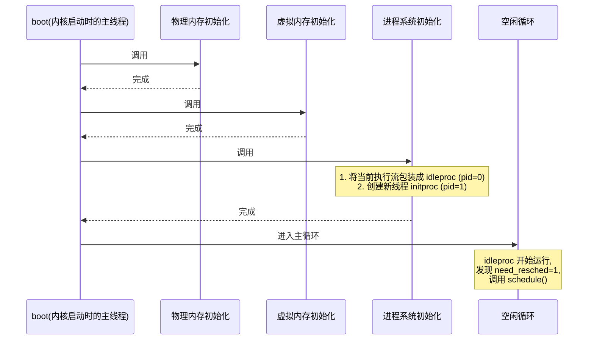
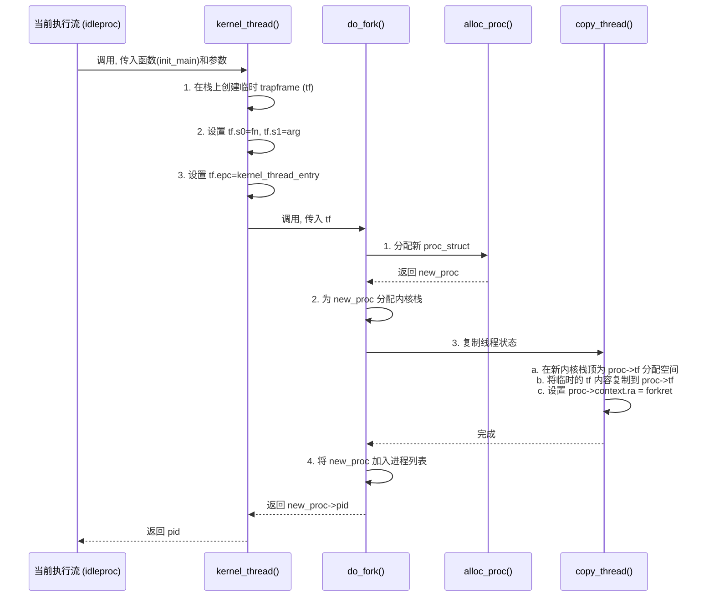

1118
### **幻灯片覆盖矩阵 (Slide Coverage Matrix)**

我将原始材料的核心内容梳理成了 24 张逻辑上的“幻灯片”，以便我们系统地学习。

| Slide # | 原始标题/主题                           | 关键术语/主张                                                  | 主文本锚点 (章节/知识卡/[图示])                                                   | 覆盖状态  |
| :------ | :-------------------------------- | :------------------------------------------------------- | :-------------------------------------------------------------------- | :---- |
| S01     | 实验目的                              | 虚拟内存管理、内核线程创建/执行/切换/调度                                   | [学习路线图](#learning-roadmap)                                            | ✅ 已覆盖 |
| S02     | 实验内容概览                            | 预映射方式、多执行流、地址空间结构                                        | [核心知识地图](#core-knowledge-map), [1. 完善虚拟内存管理](#1-完善虚拟内存管理)             | ✅ 已覆盖 |
| S03     | 内核线程 vs 用户进程                      | 内核态/用户态、地址空间共享/独立                                        | [知识卡：内核线程](#knowledge-card-kernel-thread), `[Fig·S03-1]`              | ✅ 已覆盖 |
| S04     | 练习概览                              | `alloc_proc`, `do_fork`, `proc_run`                      | [3. 动手实践：内核线程的诞生与切换](#3-动手实践内核线程的诞生与切换)                               | ✅ 已覆盖 |
| S05     | 扩展练习概览                            | `local_intr_save`, `get_pte` 设计                          | [扩展练习解析](#extended-exercises)                                         | ✅ 已覆盖 |
| S06     | 项目组成变更                            | 新增 `proc`, `sched`, `vmm` 等模块                            | [背景知识](#background-knowledge)                                         | ✅ 已覆盖 |
| S07     | 实验执行流程概述                          | `pmm_init` → `vmm_init` → `proc_init` → `cpu_idle`       | [2.3. 内核线程的创建与调度](#23-内核线程的创建与调度), `[Fig·S07-1]`                      | ✅ 已覆盖 |
| S08     | 虚拟内存基本原理                          | 地址虚拟化、内存保护、按需分页、页换入换出                                    | [知识卡：虚拟内存](#knowledge-card-virtual-memory)                            | ✅ 已覆盖 |
| S09     | 页表项设计 (Sv39)                      | `PDX1`, `PDX0`, `PTX`, `PTE_V/R/W/X/U` 宏                 | [知识卡：页表项 (PTE)](#knowledge-card-pte), `[Fig·S09-1]`                   | ✅ 已覆盖 |
| S10     | 多级页表实现                            | `page_insert()`, `page_remove()` 接口                      | [知识卡：多级页表与页面映射操作](#knowledge-card-page-mapping)                       | ✅ 已覆盖 |
| S11     | `check_pgdir` 函数分析                | 验证页面插入、移除和引用计数                                           | [知识卡：多级页表与页面映射操作](#knowledge-card-page-mapping)                       | ✅ 已覆盖 |
| S12     | `get_pte` 函数详解                    | 查找或创建页表项，`create` 参数                                     | [知识卡：多级页表与页面映射操作](#knowledge-card-page-mapping), `[Fig·S12-1]`        | ✅ 已覆盖 |
| S13     | 内核段重映射                            | `.text`, `.rodata`, `.data`, `.bss` 段的权限设置               | [知识卡：虚拟内存区域 (VMA) 与内存布局](#knowledge-card-vma)                         | ✅ 已覆盖 |
| S14     | 进程与线程概念                           | 程序 vs. 进程，进程 vs. 线程                                      | [2. 内核线程管理](#2-内核线程管理)                                                | ✅ 已覆盖 |
| S15     | 为何需要进程                            | 任务调度、多核利用、分时系统                                           | [2. 内核线程管理](#2-内核线程管理)                                                | ✅ 已覆盖 |
| S16     | 进程管理概述                            | 进程控制块 (PCB)、调度器 (Scheduler)                              | [2. 内核线程管理](#2-内核线程管理)                                                | ✅ 已覆盖 |
| S17     | 关键数据结构: `proc_struct`             | `state`, `pid`, `kstack`, `mm`, `context`, `tf`, `pgdir` | [知识卡：进程控制块 (proc_struct)](#knowledge-card-proc-struct), `[Fig·S17-1]` | ✅ 已覆盖 |
| S18     | 关键数据结构: `context`                 | 上下文切换、`ra`, `sp`, `s0-s11` 寄存器                           | [知识卡：进程上下文 (Context)](#knowledge-card-context)                        | ✅ 已覆盖 |
| S19     | 创建第0个内核线程: `idleproc`             | `proc_init` 函数，继承内核执行流                                   | [2.3.1. 创建第0个内核线程：idleproc](#231-创建第0个内核线程idleproc)                   | ✅ 已覆盖 |
| S20     | 创建第1个内核线程: `initproc`             | `kernel_thread` → `do_fork`                              | [2.3.2. 创建第1个内核线程：initproc](#232-创建第1个内核线程initproc), `[Fig·S20-1]`    | ✅ 已覆盖 |
| S21     | `copy_thread` 与 `forkret`         | 设置新线程的 `trapframe` 和 `context`                           | [知识卡：进程创建 (`do_fork`)](#knowledge-card-do-fork), `[Fig·S21-1]`        | ✅ 已覆盖 |
| S22     | 调度与执行                             | `cpu_idle`, `schedule`, `proc_run`                       | [知识卡：调度器 (Scheduler) 与进程切换](#knowledge-card-scheduler), `[Fig·S22-1]` | ✅ 已覆盖 |
| S23     | `switch_to` 汇编函数                  | 保存和恢复 `context`                                          | [知识卡：上下文切换 (`switch_to`)](#knowledge-card-switch-to), `[Fig·S23-1]`   | ✅ 已覆盖 |
| S24     | `forkret` 与 `kernel_thread_entry` | 新线程的返回与启动                                                | [知识卡：进程创建 (`do_fork`)](#knowledge-card-do-fork)                       | ✅ 已覆盖 |

---

### **学习路线图 (Learning Roadmap)**

别担心，我们会一步一个脚印地完成这次学习之旅。下面是一个建议的节奏，当然您可以根据自己的感觉调整。

1.  **第一站：理解核心概念 (建议 45-60 分钟)**
    *   首先，让我们一起弄清楚什么是**虚拟内存**，以及为什么它如此重要。
    *   接着，我们会探索**进程**和**线程**这两个操作系统的灵魂角色，特别是内核线程。
    *   最后，我们会仔细观察承载线程灵魂的容器——**进程控制块 (`proc_struct`)**，以及它内部的两个关键宝物：**上下文 (`context`)** 和**中断帧 (`trapframe`)**。

2.  **第二站：探索线程的生命周期 (建议 60-75 分钟)**
    *   我们将一起见证第一个和第二个内核线程（`idleproc` 和 `initproc`）是如何被“创造”出来的。这会涉及到 `alloc_proc` 和 `do_fork` 函数。
    *   然后，我们会学习当 CPU 不再运行当前线程，转而去运行另一个线程时，发生了什么魔法——这就是**调度 (`schedule`)** 和**上下文切换 (`switch_to`)**。

3.  **第三站：动手实践与回顾 (建议 30-45 分钟)**
    *   我们会把理论知识应用到实践中，看看练习中的代码应该如何填写。
    *   最后，我们会用快速回顾卡片和备忘单来巩固今天学到的所有知识，确保它们牢牢印在脑海里。

总计大约需要 **2.5 - 3 小时**。请随时准备一杯热茶，让我们以轻松的心情开始吧。

### **核心知识地图 (Core Knowledge Map)**

这是一张我们即将探索的知识大陆的地图，它会帮助我们时刻明确自己所在的位置。

```
操作系统核心：虚拟化
├── 1. 内存虚拟化 (进一步完善)
│   ├── 1.1. 虚拟内存 (VM) 的理念
│   │   └── 目的：隔离、保护、扩展空间
│   ├── 1.2. 实现机制：多级页表 (以 Sv39 为例)
│   │   ├── 页目录与页表
│   │   ├── 页表项 (PTE) 的结构与标志位
│   │   └── 核心操作：get_pte, page_insert, page_remove
│   └── 1.3. 地址空间布局 (VMA)
│       └── 内核段的精细化权限管理 (.text, .rodata)
│
└── 2. CPU 虚拟化 (新引入)
    ├── 2.1. 执行实体：进程与线程
    │   ├── 进程作为资源单位，线程作为调度单位
    │   └── 内核线程 vs. 用户进程
    ├── 2.2. 管理核心：进程控制块 (PCB / proc_struct)
    │   ├── 身份信息 (pid, state)
    │   ├── 内存视图 (pgdir, mm)
    │   └── 执行现场 (kstack, context, trapframe)
    └── 2.3. 线程生命周期管理
        ├── 创建 (Creation): alloc_proc, do_fork, kernel_thread
        ├── 调度 (Scheduling): schedule, proc_run
        └── 切换 (Switching): switch_to
```

地图已经铺开，我们的探险正式开始。

---

### **背景知识 (Background Knowledge)** `[S06]`

在这次实验中，我们的 ucore 系统迎来了一次重要的升级。代码库中增加了好几个新的“部门”，它们各司其职，共同协作来实现多线程并发：

*   `kern/process/`: 这是新成立的“人力资源部”，负责管理所有与进程、线程相关的事情，比如创建（`proc.c`）、上下文切换（`switch.S`）等。
*   `kern/schedule/`: 这是“调度中心”，决定下一个该哪个线程使用 CPU (`sched.c`)。
*   `kern/mm/vmm.c`: 这是“内存规划局”，负责管理进程的虚拟地址空间布局。
*   `kern/mm/kmalloc.c`: 提供了更先进的内核动态内存分配工具，我们可以把它当作一个更高效的“物资仓库”。

有了这些新部门的加入，我们的 ucore 内核将从一个只能“单线程”思考的孤独执行者，蜕变为一个能同时协调多个任务的“多任务管理者”。

---

### **1. 完善虚拟内存管理** `[S02]`

在之前的实验里，我们已经搭建了页表这座桥梁，连接了虚拟地址和物理地址。现在，我们要让这座桥梁的管理更加精细和完善。

#### **知识卡：虚拟内存 (Virtual Memory)**

*   **它解决了什么问题 (直观)** `[S08]`
    *   想象一下，每个应用程序都以为自己独占了整个电脑的内存。它可以在自己的世界里随意安排数据，不用担心和其他程序“撞车”。虚拟内存就为每个程序创造了这样一个“独立豪华套间”。同时，如果物理内存不够用，它还能聪明地把暂时不用的东西挪到硬盘上，让程序感觉内存“无限大”。

*   **前置知识**
    *   物理内存、地址的概念。
    *   CPU 如何读取内存地址。

*   **类比 / 直觉**
    *   虚拟内存就像一本**图书目录**。你想找的书（数据）在“目录”（虚拟地址）里有一个编号，比如“科幻类-007号”。但这本书实际可能放在图书馆三楼的A书架上（物理地址）。图书管理员（操作系统）和 MMU（硬件）会帮你根据目录编号找到书的实际位置。如果书被借出到仓库（硬盘）了，管理员还会去仓库把它取回来给你（缺页中断与页换入）。

*   **官方/正式声明**
    *   虚拟内存是一种内存管理技术，它为每个进程提供了一个私有的、连续的虚拟地址空间 (Virtual Address Space, VAS)。这个虚拟地址空间通过页表 (Page Table) 映射到物理内存。这种映射关系由操作系统和内存管理单元 (MMU) 共同维护，实现了地址空间的隔离、内存保护以及允许使用比物理内存更大的地址空间。

*   **核心思想** `[S08]`
    1.  **地址虚拟化**：程序使用的地址（虚拟地址）不是真实的物理地址。
    2.  **内存访问保护**：通过页表项中的权限位，可以限制程序对内存的读、写、执行权限，防止恶意或错误访问。
    3.  **按需分页 (Demand Paging)**：只在程序实际访问某个页面时，才为其分配物理内存。（本次实验不涉及，但这是VM的重要特性）
    4.  **页换入换出 (Swapping)**：当物理内存不足时，可将不常用的页面暂时存到硬盘，需要时再换回内存。（本次实验不涉及）

*   **一句话总结**
    *   虚拟内存通过地址映射，为每个进程提供了独立、受保护且看似广阔的内存空间。

*   **自我检查 (3个问题)**
    1.  (判断题) 虚拟地址 `0x1000` 和物理地址 `0x1000` 必然指向同一个物理存储单元。 (×)
    2.  (选择题) 虚拟内存机制主要由谁协作完成？ (A) 只有CPU (B) 只有操作系统 (C) 操作系统和硬件MMU (D) 编译器和链接器。 (C)
    3.  (开放题) 虚拟内存带来了哪些好处？ (至少说出两点：如内存隔离、内存保护、扩展可用内存空间等)

#### **知识卡：页表项 (PTE - Page Table Entry)**

*   **它解决了什么问题 (直观)** `[S09]`
    *   我们知道了虚拟地址和物理地址需要一个“翻译”，页表项就是这个“翻译词典”里的一条条目。每一条都记录着一个虚拟页面（通常是 4KB）应该被翻译成哪个物理页面，以及我们有什么权限（比如只能读，不能写）去访问它。

*   **前置知识**
    *   虚拟内存的基本概念。
    *   二进制位运算。

*   **官方/正式声明**
    *   页表项 (PTE) 是页表中的一个基本单元，它存储了单个虚拟页面到物理页帧的映射信息，以及相关的访问控制位（如有效位、读/写/执行权限位、用户/内核访问位等）。

*   **关键结构 (以 Sv39 为例)** `[S09]`
    *   在 RISC-V 的 Sv39 分页模式下，一个 64 位的虚拟地址只用了低 39 位。这 39 位被巧妙地分成了几段，用于在三级页表中进行索引。

    `[Fig·S09-1]` Sv39 虚拟地址结构分解示意图
    ```text
    虚拟地址 (va), 共39位:
    +------------------+------------------+------------------+----------------------+
    | 9 bits           | 9 bits           | 9 bits           | 12 bits              |
    | L2 Index (PDX1)  | L1 Index (PDX0)  | L0 Index (PTX)   | Page Offset (PGOFF)  |
    +------------------+------------------+------------------+----------------------+
    <-----               虚拟页号 (VPN)                 ------>

    这张图温柔地展示了虚拟地址是如何被拆解的。CPU 会像剥洋葱一样，一层层地用这些索引去查找页表，最终找到物理地址。
    ```
    *   一个 Sv39 页表项 (PTE) 是一个 64 位的值，其结构大致如下：

`[Fig·S09-2]` Sv39 页表项 (PTE) 结构示意图
```text
[高位 ----------------------------------------------------------------> 低位]

PTE (64位):
+--------------------+-------------------------------------------+-----------+
| 10 bits            | 44 bits                                   | 10 bits   |
| Reserved (保留)    | 物理页号 (PPN, Physical Page Number)      | RSW + Flags |
| (Bits 63:54)       | (Bits 53:10)                              | (Bits 9:0)|
+--------------------+-------------------------------------------+-----------+
                                                                 |
                                                                 |
               [低10位 (Bits 9:0) 详细分解] <----------------------+
               +-------------+-----------------------------------+
               | 2 bits      | 8 bits                            |
               | RSW         | Flags (标志位)                    |
               | (Bits 9:8)  | (Bits 7:0)                        |
               +-------------+-----------------------------------+
                             | D | A | G | U | X | W | R | V |
                             +---+---+---+---+---+---+---+---+
这张图揭示了页表项的秘密：大部分位用来记录物理页的地址，而最右边的几个标志位则像门卫一样，控制着对这个页面的访问权限。
```
*   **重要标志位 (Flags)** `[S09]`：
	*   `PTE_V` (Valid): 有效位。如果为 1，表示这个 PTE 是有效的，翻译关系存在。
	*   `PTE_R` (Read): 可读位。
	*   `PTE_W` (Write): 可写位。
	*   `PTE_X` (Execute): 可执行位。
	*   `PTE_U` (User): 用户位。如果为 1，表示用户态的程序也可以访问这个页面。

*   **一句话总结**
    *   PTE 是页表中的一个条目，它将一个虚拟页映射到一个物理页，并规定了访问权限。

*   **自我检查 (3个问题)**
    1.  (判断题) 如果一个 PTE 的 `PTE_W` 位为 0，那么即使是内核代码也不能写入该页面。 (×，这通常取决于特权级和具体的硬件实现，但一般内核可以覆盖这些限制)
    2.  (选择题) 在 Sv39 架构中，一个页的大小是多少？ (A) 1KB (B) 4KB (C) 1MB (D) 1GB。 (B, `2^12` bytes)
    3.  (开放题) `PDX1`, `PDX0`, `PTX` 这三个宏在地址翻译过程中各自的作用是什么？ (它们分别是三级页表的索引，用于逐级查找下一级页表的基地址。)

#### **知识卡：多级页表与页面映射操作**

*   **它解决了什么问题 (直观)** `[S10]`
    *   如果为整个巨大的虚拟地址空间都创建一个扁平的、巨大的页表，会非常浪费内存（想象一下为一本只用了几页的字典，却打印了所有汉字的条目）。多级页表就像是带索引的字典，只有当你查到某个偏旁部首时，才会翻到包含那个部首汉字的那几页，大大节省了空间。

*   **前置知识**
    *   页表项 (PTE) 的概念。

*   **类比 / 直觉**
    *   单级页表就像一个巨大的电话簿，列出了城市里每个人的电话号码。
    *   多级页表更像是一个分地区的电话簿系统。你先查“海淀区”分册（一级页表），找到“中关村街道”分册的存放位置（二级页表），再在“中关村街道”分册里找到“科学院南路”分册（三级页表），最后才找到具体某个人的电话号码（PTE）。如果某个街道没人住，就根本不需要为它印制分册。

*   **官方/正式声明** `[S12]`
    *   多级页表是一种分层的页表结构，它将虚拟地址空间划分为多个部分，每一部分由高一级的页目录项 (Page Directory Entry, PDE) 指向。只有当地址空间的一个区域被使用时，才会为其分配下一级的页表页。这种结构能有效减少页表自身占用的内存空间。
    *   核心操作函数是 `get_pte`，它负责在多级页表中查找（或者在需要时创建）与给定虚拟地址对应的最终 PTE 的地址。

*   **核心流程: `get_pte` 函数** `[S12]`

    `[Fig·S12-1]` `get_pte` 函数的工作流程图
    ```mermaid
	flowchart TD
    A["开始 get_pte(pgdir, va, create)"] --> B{"L2页表项(PDE1)有效吗?"};
    B -- 否 --> C{"create标志为真?"};
    C -- 是 --> D["分配一个新物理页P1<br>作为L1页表"];
    D --> E["用P1的地址填充PDE1<br>并设置权限位"];
    E --> F["进入L1页表"];
    C -- 否 --> G["返回 NULL"];
    B -- 是 --> F;
    F --> H{"L1页表项(PDE0)有效吗?"};
    H -- 否 --> I{"create标志为真?"};
    I -- 是 --> J["分配一个新物理页P2<br>作为L0页表"];
    J --> K["用P2的地址填充PDE0<br>并设置权限位"];
    K --> L["进入L0页表"];
    I -- 否 --> M["返回 NULL"];
    H -- 是 --> L;
    L --> N["计算最终PTE的地址"];
    N --> O["返回 PTE 地址"];
	```
    这张示意图轻柔地显示了 get_pte 如何像一位耐心的向导，逐级深入页表结构。如果路不通 (页表不存在) 且被允许开路 (create=true)，它就会为我们铺设新的道路 (分配新页表)。
    

*   **关键函数** `[S10]` `[S11]`
    *   `pte_t *get_pte(pde_t *pgdir, uintptr_t la, bool create)`:
        *   `pgdir`: 顶层页表的基地址。
        *   `la`: 要查询的线性地址（虚拟地址）。
        *   `create`: 一个布尔值。如果为 `true`，当中间级别的页表不存在时，函数会分配新的物理页来创建它们；如果为 `false`，则直接返回 `NULL`。
    *   `int page_insert(pde_t *pgdir, struct Page *page, uintptr_t la, uint32_t perm)`:
        *  [^1] 建立一个从虚拟地址 `la` 到物理页面 `page` 的映射。
        *   它会调用 `get_pte` (并设置 `create=true`) 来找到或创建对应的 PTE。
        *   然后，它会填充这个 PTE，写入物理页的地址和权限 `perm`。
        *   [^2]如果 `la` 之前已经映射到其他页面，它会先妥善处理旧的映射（减少旧页面的引用计数）。
    *   `void page_remove(pde_t *pgdir, uintptr_t la)`:
        *   移除 `la` 的映射。它会找到对应的 PTE，并将其清零，同时处理被映射物理页的引用计数。

*   **一句话总结**
    *   [^3]多级页表用时间换空间，通过分层结构节省内存，而 `get_pte` 等函数则是操作这个复杂结构的核心工具。

*   **自我检查 (3个问题)**
    1.  (判断题) 调用 `page_insert` 函数时，如果中间的页表页不存在，映射一定会失败。 (×，`page_insert` 会调用 `get_pte` 并允许创建新页表)
    2.  (选择题) `get_pte(pgdir, la, false)` 和 `get_pte(pgdir, la, true)` 的主要区别是什么？ (A) 查找速度 (B) 返回类型 (C) 在页表不存在时是否会分配新页 (D) 对TLB的影响。 (C)
    3.  (开放题) 为什么在修改页表后，通常需要执行 `tlb_invalidate` 这样的操作？ (因为 TLB (Translation Lookaside Buffer) 是页表项的高速缓存，修改了内存中的页表后，必须让缓存中的旧条目失效，以确保 CPU 使用最新的映射关系。)

#### **知识卡：虚拟内存区域 (VMA) 与内存布局**

*   **它解决了什么问题 (直观)** `[S13]`
    *   一个程序的不同部分有不同的“脾气”。代码段（`.text`）应该只准读和执行，不准修改；数据段（`.data`）则需要能读能写。VMA 就是一种管理机制，用来描述和控制程序地址空间里每一段区域的属性和权限。

*   **前置知识**
    *   程序的段结构（.text, .rodata, .data, .bss）。
    *   页表项的权限位。

*   **类比 / 直觉**
    *   虚拟地址空间就像一块大地。VMA 就像是土地规划图，上面清晰地标出了哪一块是“住宅区”（可读写的数据），哪一块是“公园”（只读的代码），哪一块是“军事禁区”（内核空间）。每个区域都有自己的规则。

*   **官方/正式声明** `[S02]`
    *   虚拟内存区域 (Virtual Memory Area, VMA) 是描述进程地址空间中一段连续、具有相同属性（如访问权限）的虚拟内存区域的数据结构。在 ucore 中，通过 `mm_struct` 来管理一个进程的所有 VMA。本次实验中，虽然 `vmm.c` 已经引入了 VMA 的概念，但主要的应用体现在**内核**初始化时，对内核自身的代码段、数据段等进行更精细的页表权限设置，[^4]取代了之前粗糙的“大页”映射。[^5]这是一种**预映射**方式。

*   **实践应用：内核段重映射** `[S13]`
    *   **问题**：最初，为了让内核尽快运行起来，我们用一个巨大的页（Giga Page）把整个内核都映射了，权限是“可读、可写、可执行”。这是不安全的，比如代码段被人恶意修改了怎么办？
    *   **解决方案**：废弃旧的粗糙页表，创建一个新的页表。然后，遍历内核的各个段（`.text`, `.rodata` 等），根据每个段的特性，为它们建立具有精确权限的页面映射。
        *   `.text` 段：映射为 `PTE_R | PTE_X` (可读、可执行)。
        *   `.rodata` 段：映射为 `PTE_R` (只读)。
        *   `.data`, `.bss` 段：映射为 `PTE_R | PTE_W` (可读、可写)。
    *   这个过程确保了最小权限原则，大大增强了内核的健壮性。

*   **一句话总结**
    *   VMA 精细地管理着虚拟地址空间的布局和权限，使得内存保护得以在段级别上实现。

*   **自我检查 (3-questions)**
    1.  (判断题) 在 ucore 实验四中，VMA 主要用于管理用户进程的内存。 (×，在此阶段，它主要用于对内核自身的内存布局进行精细化重映射。)
    2.  (选择题) 将 `.text` 段设置为不可写（`W=0`）的主要目的是什么？ (A) 节省内存 (B) 提高执行速度 (C) 防止代码被意外或恶意篡改 (D) 方便调试。 (C)
    3.  (开放题) 描述一下什么是“预映射方式”？ (它指的是在程序（或内核）加载时，一次性为其虚拟地址空间建立好所有需要的页表映射，而不是在运行时按需分配。这与“按需分页”相对。)

---

### **2. 内核线程管理** `[S14]` `[S15]` `[S16]`

我们已经把内存的“家”装修得更好了，现在要迎接家里的新成员——线程。CPU 就像家里的唯一一个“遥控器”，线程们要轮流使用它来看电视（执行计算）。我们要学习的就是如何管理这些线程，让他们和谐地共享“遥控器”。

`[Fig·S03-1]` 内核线程与用户进程对比表 `[S03]`

| 比较项 | 内核线程 | 用户进程 |
| :--- | :--- | :--- |
| **运行模式** | 仅在内核态运行，拥有最高权限。 | 在用户态和内核态之间切换。 |
| **地址空间** | **共享**同一个内核地址空间。 | 每个进程拥有**独立**的用户虚拟地址空间。 |
| **资源** | 共享内核的所有资源。 | 资源（如文件描述符）相互隔离。 |
| **创建开销** | 较小，只需创建控制块和内核栈。 | 较大，需要创建完整的地址空间。 |
[^6]意思是一般内核里面的叫做线程，用户程序里面的叫做进程是吗？
这张表格清晰地告诉我们，内核线程是生活在内核这个“大家庭”里的成员，共享一切；而用户进程则是住在独立“公寓”里的住户，各有各的私有空间。

#### **知识卡：进程控制块 (proc_struct)**

*   **它解决了什么问题 (直观)** `[S17]`
    *   操作系统需要管理很多个线程，它怎么区分哪个是哪个？每个线程的当前状态（比如是在睡觉还是在排队等着用CPU）又是什么？进程控制块 (Process Control Block, PCB) 就是每个线程的“身份证”和“状态档案”，记录了关于这个线程的所有重要信息。
[[^7]进程控制块为什么是用来管理线程的呢？]
*   **前置知识**
    *   C 语言的结构体 (`struct`)。
    *   进程/线程的基本概念。

*   **类比 / 直觉**
    *   `proc_struct` 就像是医院里每个病人的**病历卡**。上面记录了病人的姓名 (name)、病号 (pid)、当前状况 (state，比如“治疗中”、“等待检查”)、主治医生 (parent)、以及详细的检查报告和身体数据（`mm`, `context`, `tf` 等）。医生（调度器）通过翻阅这些病历卡来决定下一个要治疗哪个病人。

*   **官方/正式声明**
    *   `proc_struct` 是 ucore 内核中用于描述一个进程或线程核心属性和状态的数据结构。它包含了调度所需的信息、内存管理信息、进程关系、以及用于上下文切换的执行现场等。内核通过一个全局的进程列表 (`proc_list`) 来管理所有的 `proc_struct` 实例。

*   **关键成员变量解析** `[S17]`

    `[Fig·S17-1]` `proc_struct` 结构体核心成员示意图
    ```text
    struct proc_struct {
        +---------------------------------+
        | state;      // 状态: RUNNABLE? SLEEPING?
        | pid;        // 身份ID
        | kstack;     // 内核栈顶指针
        | need_resched; // 是否需要调度?
        | parent;     // 父进程指针
        +---------------------------------+
        | mm;         // 内存空间描述 (VMA等)
        | pgdir;      // 页目录基地址 (SATP用)
        +---------------------------------+
        | context;    // [存档点1] 上下文切换时保存
        | tf;         // [存档点2] 进出内核时保存
        +---------------------------------+
        | list_link;  // 链接到全局进程列表
        | ...         // 其他信息
    };
	```
    这张示意图将 proc_struct 分为几个功能区：身份区、内存区和两个至关重要的“执行现场存档点”。理解 context 和 tf 的区别是本次实验的关键。
    *   `state`: 进程状态，如 `PROC_RUNNABLE` (就绪), `PROC_SLEEPING` (睡眠)。
    *   `pid`: 独一无二的进程ID。
    *   `kstack`: 指向该线程的内核栈。每个线程都有自己的内核栈。
    *   `pgdir`: 该进程的页表基地址。切换进程时，需要把这个值加载到 `SATP` 寄存器。
    *   `mm`: 指向 `mm_struct`，管理进程的虚拟内存区域 (VMA)。对于内核线程，它们共享同一个内核 `mm`，[^8]但这个字段通常为 `NULL`。
    *   `context` (`struct context`): **上下文**。用于**进程/线程之间切换**。[^16]当线程A要切换到线程B时，内核会把A的一些关键寄存器（`ra`, `sp`, `s0-s11`等被调用者保存寄存器）保存在A的 `context` 中，然后从B的 `context` 中恢复B之前保存的寄存器。这是**协作式**的保存。
    *   `tf` (`struct trapframe *`): **中断帧**。用于**特权级切换**（比如从用户态进入内核态）。当发生中断、异常或系统调用时，硬件或软件会**自动**把当前CPU的所有或大部分寄存器状态保存在一个叫中断帧的结构里（通常在内核栈上）。这样，当中断处理完毕返回时，就能精确地恢复到被打断前的状态。

*   **回答 `[练习1]` 的问题**:
    > **`struct context context` 和 `struct trapframe *tf` 成员变量含义和在本实验中的作用是啥？**
    >
    > 这两个成员都用于保存进程的执行现场（寄存器状态），但使用场景和保存内容完全不同，这是理解操作系统线程切换的精髓所在，请一定仔细体会：
    >
    > 1.  **`struct context context` (上下文)**:
    >     *   **含义**: 它是进程调度和切换的“存档点”。它**只保存**那些在函数调用之间需要保持不变的寄存器（在 RISC-V 中是被调用者保存寄存器，如 `ra`, `sp`, `s0-s11`）。
    >     *   **作用**: 在 `switch_to` 函数中被使用。当调度器决定从进程A切换到进程B时，`switch_to` 会把进程A的这些寄存器值存入 `A->context`，然后从 `B->context` 中加载进程B的寄存器值。这是一个**主动的、软件层面**的保存与恢复，目的是实现线程间的平滑切换。
    >
    > 2.  **`struct trapframe *tf` (中断帧指针)**:
    >     *   **含义**: 它是特权级切换的“存档点”。当中断、异常或系统调用发生，导致程序从低特权级（如用户态）进入高特权级（内核态）时，硬件（或内核的入口代码）会**自动地、完整地**把被打断前的几乎所有通用寄存器、程序计数器(`epc`)、状态寄存器(`status`)等都保存在内核栈上的一块内存区域，这个区域就是中断帧。`proc->tf` 就指向这个中断帧。
    >     *   **作用**: 当内核处理完中断，准备返回用户态时，会根据 `proc->tf` 指向的中断帧，恢复所有寄存器，从而让用户程序感觉仿佛什么都没发生过，继续从被打断的地方执行。在本实验中，我们巧妙地利用了它来**初始化新线程的启动状态**。在 `kernel_thread` 中，我们手动构建了一个假的 `trapframe`，把新线程要执行的函数地址放进去，这样当新线程第一次被“恢复”时，它就会直接跳转到我们指定的函数开始执行。

*   **一句话总结**
    *   `proc_struct` 是线程的“灵魂档案”，而 `context` 和 `tf` 是两个不同场景下的“灵魂快照”，前者用于线程间切换，后者用于特权级穿越。

*   **自我检查 (3个问题)**
    1.  (判断题) 当一个用户程序执行系统调用时，CPU的寄存器状态被保存在 `proc->context` 中。 (×，保存在内核栈上的中断帧 `trapframe` 中)
    2.  (选择题) `proc->pgdir` 字段的主要用途是？ (A) 存储程序的代码 (B) 在进程切换时，用来设置 `SATP` 寄存器以切换地址空间 (C) 记录进程打开的文件 (D) 存放进程的内核栈。 (B)
    3.  (开放题) 为什么 `context` 只保存一部分寄存器，而 `trapframe` 几乎保存所有寄存器？ ([^9]因为 `context` 切换发生在函数调用 `switch_to` 内部，编译器会负责处理调用者保存寄存器；而 `trapframe` 发生在不可预期的中断时刻，必须完整保存现场，以便精确恢复。)

#### **知识卡：进程上下文 (Context)**

*   **它解决了什么问题 (直观)** `[S18]`
    *   当一个线程的时间片用完，需要让位给另一个线程时，我们得记下它当前的工作进度，以便下次轮到它时能接着干。`context` 就是这个“工作进度”的记录，但它只记录最核心、最不容易恢复的部分。

*   **前置知识**
    *   `proc_struct` 的概念。
    *   函数调用时的寄存器使用约定（调用者保存 vs. 被调用者保存）。

*   **官方/正式声明**
    *   进程上下文 (`struct context`) 是 `proc_struct` 的一部分，专门用于在 `switch_to` 函数中保存和恢复执行现场。它只包含那些根据调用约定，被调用函数（`switch_to` 本身）有责任保护的寄存器（callee-saved registers）。

*   **关键结构 (`kern/process/proc.h`)**
    ```c
    struct context {
        uintptr_t ra;   // 返回地址寄存器
        uintptr_t sp;   // 栈指针寄存器
        uintptr_t s0;   // 以下是 callee-saved 寄存器
        uintptr_t s1;
        // ... 直到 s11
        uintptr_t s11;
    };
    ```

*   **为什么只保存这些？** `[S18]`
    *   [^10]这是一个非常聪明的优化。`switch_to` 本身是一个C函数调用。根据 RISC-V 的函数调用约定，像 `a0-a7` (参数/返回值) 和 `t0-t6` (临时) 这些寄存器，被称为“调用者保存”(caller-saved)。意思是，如果调用 `switch_to` 的函数（比如 `proc_run`）还想用这些寄存器里的值，它自己得负责在调用前保存好。而被调用函数（`switch_to`）可以随意使用它们。
    *   相反，`s0-s11` 这些寄存器是“被调用者保存”(callee-saved)。`switch_to` 必须保证在它返回时，这些寄存器里的值和它被调用时一样。因此，`switch_to` 的唯一办法就是在开始时把它们存起来，在返回前再恢复。`context` 结构就是为此而生。
    *   `ra` (返回地址) 和 `sp` (栈指针) 也是需要被 `switch_to` 精心维护的，所以也包含在内。

*   **一句话总结**
    *   `context` 是为 `switch_to` 函数量身定做的、最小化的执行现场存档，利用了函数调用约定来减少不必要的寄存器保存开销。

*   **自我检查 (3个问题)**
    1.  (判断题) `context` 结构中包含了程序计数器 (PC/EPC)。 (×，PC 的切换是通过 `ra` 寄存器和 `ret` 指令隐式完成的。)
    2.  (选择题) `context` 保存的是哪一类寄存器？ (A) 所有通用寄存器 (B) 调用者保存寄存器 (C) 被调用者保存寄存器 (D) 浮点寄存器。 (C)
    3.  (开放题) 如果我们把所有通用寄存器都加入 `context` 并由 `switch_to` 保存恢复，程序还能正常工作吗？会有什么影响？ (能工作，但会变得更慢，因为做了很多编译器本可以优化的冗余保存/恢复操作。)


### **2.3. 内核线程的创建与调度**

现在，我们来看看 ucore 是如何一步步从一个单一的执行流，[^11]变成一个拥有两个线程（`idleproc` 和 `initproc`）并能在它们之间切换的多任务内核的。

`[Fig·S07-1]` 内核初始化与线程创建流程 `[S07]`

这张图描绘了开机后，内核如何按部就班地完成初始化，并最终创造出两个初始线程，准备开始调度。

#### **2.3.1. 创建第0个内核线程：`idleproc`** `[S19]`

第一个线程的诞生非常特别，它不是被“创造”出来的，而是被“追认”的。

1.  **`proc_init` 函数被调用**：此时，内核还只有一个执行流。
2.  **分配 `proc_struct`**: 调用 `alloc_proc` 为这个执行流分配一个进程控制块。
3.  **赋予身份**: 这个 `proc_struct` 被命名为 "idle"，并被赋予 `pid = 0`。它就是 `idleproc`。
4.  **关联资源**:
    *   它的页表 `pgdir` 就是内核的页表 `boot_pgdir`。
    *   它的内核栈 `kstack` 就是内核启动时用的栈 `bootstack`。
    *   它的状态被设为 `PROC_RUNNABLE`。
5.  **设置调度标志**: `idleproc->need_resched = 1;` 这是一个关键的信号，意思是告诉 `idleproc`：“你一有机会就应该让出CPU，因为有更重要的任务在等着。”

`idleproc` 的任务很简单：当系统中没有其他可运行的线程时，它就执行一个 `while(1)` 循环 (`cpu_idle` 函数)，不断检查是否需要调度。它就像一个勤劳的“占位符”，确保 CPU 永远有事可做，也使得调度逻辑更统一。

#### **2.3.2. 创建第1个内核线程：`initproc`** `[S20]`

`initproc` 是第一个真正意义上被“创造”出来的线程。它的创建过程是未来所有进程创建的基础。

`[Fig·S20-1]` `initproc` 创建流程 `[S20]`
[[^12]为啥这里也需要使用到trapframe?]

这张图详细展示了 `kernel_thread` 如何像一个“总设计师”一样，精心准备好一个假的“中断现场”(`trapframe`)，然后交给 `do_fork` 这个“建造工厂”去完成新线程的实际构建工作。

#### **知识卡：进程创建 (`do_fork`)**

*   **它解决了什么问题 (直观)** `[S20]`
    *   `do_fork` 是操作系统里的“克隆”机器。它以当前正在运行的进程为蓝本，创建一个几乎一模一样的新进程（子进程）。这是 Unix-like 系统中创建新进程的标准方式。

*   **前置知识**
    *   `proc_struct` 结构。
    *   `trapframe` 和 `context` 的区别。

*   **官方/正式声明**
    *   `do_fork` 是内核中负责创建新进程的核心函数。它执行一系列标准步骤，包括分配进程控制块、分配资源（如内核栈和页表）、复制父进程的状态（如内存空间和上下文），并将新进程加入调度队列。

*   **核心步骤 (实验四中为内核线程简化版)**
    1.  **调用 `alloc_proc`**: 获取一个全新的、已初步初始化的 `proc_struct`。
    2.  **分配内核栈**: 为新线程分配一块内存（通常是 8KB）作为其内核栈。
    3.  **复制内存管理信息 (`copy_mm`)**: 对于内核线程，这一步很简单，因为它们共享内核地址空间，所以不需要做什么。
    4.  **复制线程状态 (`copy_thread`)**: 这是最关键的一步，它负责设置新线程的“初始存档点”。

*   **深入 `copy_thread` 的魔法** `[S21]`
    `copy_thread` 函数接收父进程传来的临时 `trapframe` (`tf`)，并为新进程 `proc` 设置它的 `proc->tf` 和 `proc->context`。

    `[Fig·S21-1]` `copy_thread` 如何设置新线程的启动状态
    ```text
    新线程的内核栈 (从高地址到低地址)
    +-------------------------+ <-- kstack + KSTACKSIZE
    |                         |
    |   struct trapframe      | <-- proc->tf 指向这里
    |   (内容来自父进程的 tf) |
    +-------------------------+
    |                         |
    |   ... 栈空间 ...        |
    |                         |
    +-------------------------+ <-- kstack

    新线程的 proc->context:
    proc->context.ra = &forkret;  // <== 关键！
    proc->context.sp = proc->tf;  // <== 关键！
	```
    这张图揭示了新线程启动的秘密：当它第一次被 switch_to 恢复时，它的返回地址被巧妙地设置成了 forkeret，栈指针则指向了我们精心准备的 trapframe。
    
    *   **设置 `proc->tf`**: 在新分配的内核栈顶划出一块空间，把 `kernel_thread` 传来的那个临时 `tf` 完整地复制过来。这个 `tf` 已经包含了新线程要执行的函数(`s0`)、参数(`s1`)和启动入口(`epc`)。
    *   **设置 `proc->tf->gpr.a0 = 0`**: [^13]这是 `fork` 的一个约定，让子进程的 `fork` 调用返回0，从而可以区分父子进程(父进程返回的是 —— 新创建的子进程的 PID (Process ID))。
    *   **设置 `proc->context`**:
        *   `proc->context.ra = (uintptr_t)forkret;`: 这是**神来之笔**。它设定了新线程在第一次被 `switch_to` 调度执行后，`ret` 指令会跳转到哪里。它不会返回到 `proc_run`，而是跳转到一个特殊的收尾函数 `forkret`。
        *   `proc->context.sp = (uintptr_t)(proc->tf);`: 把新线程的上下文栈指针指向它的 `trapframe`。

*   **回答 `[练习2]` 的问题**:
    > **请说明ucore是否做到给每个新fork的线程一个唯一的id？请说明你的分析和理由。**
    >
    > 是的，ucore 做到了。
    >
    > **分析和理由**:
    > 在 `alloc_proc` 函数中（或者在 `do_fork` 中调用 `alloc_proc` 之后），通常会有一个专门的逻辑来分配 `pid`。虽然实验指导书中没有展示 `alloc_proc` 的完整代码，但一个标准的实现会这样做：
    > 1.  内核维护一个全局的、静态的 `next_pid` 变量，初始化为1。
    > 2.  每次调用 `alloc_proc` 成功找到一个空闲的 `proc_struct` 后，就会执行 `new_proc->pid = next_pid;`。
    > 3.  然后，`next_pid` 会自增：`next_pid++`。
    > 4.  为了防止 `pid` 无限增大导致溢出，还会检查 `next_pid` 是否过大，或者是否与现存的 `pid` 冲突。如果冲突，就继续增加 `next_pid` 直到找到一个未被使用的 `pid`。
    >
    > 通过这种简单的**线性递增并检查冲突**的机制，可以保证每个新创建的线程（无论是通过 `fork` 还是 `kernel_thread`）都能获得一个在当前系统中唯一的 `pid`。`idleproc` 的 `pid` 在 `proc_init` 中被手动设置为 0，后续的 `pid` 从 1 开始分配。

*   **一句话总结**
    *   `do_fork` 通过复制和精心设置初始 `context` 与 `trapframe`，创造出一个“蓄势待发”的新线程，它首次运行时会通过 `forkret` 完成最后的启动准备。

*   **自我检查 (3个问题)**
    1.  (判断题) `do_fork` 创建的子进程会从父进程被 `fork` 的地方继续执行。 (√，对于用户进程是这样。对于我们这里创建的内核线程，它会跳转到 `kernel_thread_entry`。)
    2.  (选择题) 在 `copy_thread` 中，`proc->context.ra` 被设置成 `forkret` 的地址，目的是什么？ (A) 让子进程崩溃 (B) 为了在子进程第一次运行时，执行一些特殊的初始化代码 (C) 让子进程立即退出 (D) 这只是一个调试断点。 (B)
    3.  (开放题) 如果 `do_fork` 在分配内核栈时失败了，它应该怎么做？ (它应该执行错误处理流程，释放掉之前已经分配的 `proc_struct`，然后返回一个错误码，确保系统资源不泄露。)

#### **知识卡：调度器 (Scheduler) 与进程切换**

*   **它解决了什么问题 (直观)** `[S22]`
    *   家里只有一个遥控器 (CPU)，好几个孩子 (线程) 都想看电视。调度器就是家长，他按照一定的规则（比如轮流看10分钟，即FIFO或Round-Robin），决定现在该把遥控器给谁。

*   **前置知识**
    *   进程状态 (`PROC_RUNNABLE`)。
    *   `proc_list` 全局进程链表。

*   **官方/正式声明**
    *   调度器 (Scheduler) 是操作系统内核的一部分，负责根据预定的调度策略（如FIFO、轮转、优先级等），从就绪队列中选择下一个要运行的进程，并调用相应的函数来执行上下文切换。

*   **调度时机 (Scheduling Point)**
    *   在实验四中，调度是**非抢占式**的，唯一的调度时机发生在 `cpu_idle` 函数中，当 `current->need_resched` 标志为真时，当前线程会**主动**调用 `schedule()` 放弃 CPU。

*   **`schedule()` 函数逻辑**
    1.  **关中断**：确保在查找和切换过程中不会被其他中断打扰。
    2.  **寻找下一个**：遍历 `proc_list` 链表，寻找第一个状态为 `PROC_RUNNABLE` 的、不是当前进程的进程 `next`。
    3.  **切换**：如果找到了 `next`，就调用 `proc_run(next)`，把 CPU 的控制权交给它。
    4.  **开中断**：恢复之前的中断状态。

*   **`proc_run()` 函数逻辑** (练习3)
    1.  **检查**：如果要切换的目标进程就是当前进程，直接返回。
    2.  **切换进程指针**: `current = proc`，全局 `current` 指针现在指向了新进程。
    3.  **切换地址空间**: `lcr3(proc->pgdir)`，将新进程的页表基地址加载到 `SATP` 寄存器。对于内核线程，`pgdir` 都一样，所以这一步目前效果不明显，但对未来的用户进程至关重要。
    4.  **切换上下文**: `switch_to(&(prev->context), &(proc->context))`，这是真正执行CPU寄存器切换的地方。

*   **回答 `[练习3]` 的问题**:
    > **在本实验的执行过程中，创建且运行了几个内核线程？**
    >
    > 创建了 **2** 个内核线程，并且这 **2** 个线程都得到了运行。
    >
    > 1.  **`idleproc` (pid=0)**: 在 `proc_init` 中被创建（实际上是“追认”）。内核初始化完成后，执行流就处于 `idleproc` 的上下文中，它会运行 `cpu_idle` 函数。
    > 2.  **`initproc` (pid=1)**: 在 `proc_init` 中，由 `idleproc` 调用 `kernel_thread` 创建。
    >
    > **运行流程**: `idleproc` 在 `cpu_idle` 中发现 `need_resched` 为 1，调用 `schedule()`。调度器在 `proc_list` 中找到了处于 `RUNNABLE` 状态的 `initproc`，于是通过 `proc_run` 和 `switch_to` 切换到 `initproc`。`initproc` 开始执行它的任务（`init_main` 函数，打印 "Hello world"），执行完毕后退出。所以，两个线程都被创建且都运行了。

#### **知识卡：上下文切换 (`switch_to`)**

*   **它解决了什么问题 (直观)** `[S23]`
    *   这是真正“换人”的瞬间。就像 F1 赛车的进站换人，需要快速、精确地把旧车手（的设置）保存好，把新车手（的设置）加载进来，然后赛车（CPU）就能以新车手的状态继续跑了。

*   **前置知识**
    *   `context` 结构。
    *   RISC-V 汇编基础。

*   **官方/正式声明** `[S23]`
    *   `switch_to` 是一个用汇编语言编写的底层函数，负责实现两个进程（线程）上下文的原子性切换。它接收两个参数：`from` (当前进程的 `context` 指针) 和 `to` (目标进程的 `context` 指针)。

*   **核心流程 (`kern/process/switch.S`)**

    `[Fig·S23-1]` `switch_to` 的汇编级操作流程
    ```mermaid
    sequenceDiagram
        participant Caller as proc_run()
        participant switch_to as switch_to(from, to)
        participant CPU as CPU Registers

        Caller->>switch_to: a0=&from->context, a1=&to->context
        Note over switch_to: --- 保存 from 的上下文 ---
        switch_to->>CPU: STORE ra, 0(a0)
        switch_to->>CPU: STORE sp, 8(a0)
        switch_to->>CPU: STORE s0, 16(a0)
        Note over switch_to: ... (保存 s1 到 s11) ...

        Note over switch_to: --- 恢复 to 的上下文 ---
        switch_to->>CPU: LOAD ra, 0(a1)
        switch_to->>CPU: LOAD sp, 8(a1)
        switch_to->>CPU: LOAD s0, 16(a1)
        Note over switch_to: ... (恢复 s1 到 s11) ...
        
        Note right of switch_to: 此时 ra 指向 to 进程<br>上次被切换时的返回地址
        switch_to->>Caller: ret (返回)
	```

    这张图用指令级的视角，展示了 switch_to 如何像一个严谨的档案管理员，将 `from` 进程的寄存器逐一存入内存，再将 `to` 进程的寄存器从内存中取出恢复。`ret` 指令执行后，CPU 就已经运行在 `to` 进程的执行流中了。
   
    1.  **保存 `from` 的上下文**: 将 `ra`, `sp`, `s0` 到 `s11` 这些寄存器的当前值，依次保存到 `from->context` 指向的内存区域中。
    2.  **恢复 `to` 的上下文**: 从 `to->context` 指向的内存区域中，依次加载值到 `ra`, `sp`, `s0` 到 `s11` 寄存器。
    3.  **返回**: 执行 `ret` 指令。此时，`ra` 寄存器已经被恢复成了 `to` 进程上次被切换时保存的返回地址。因此，`ret` 会让程序跳转到 `to` 进程上次被中断的地方继续执行。

*   **新线程的第一次切换** `[S24]`
    *   对于我们新创建的 `initproc`，它的 `context.ra` 被我们设置成了 `forkret` 的地址。所以，当 `schedule` 第一次切换到 `initproc` 时，`switch_to` 执行完 `ret` 后，程序会跳转到 `forkret`。
    *   `forkret` 会做一些最后的清理和设置工作，然后通过 `__trapret` 机制，从 `initproc->tf` 中恢复所有寄存器。
    *   因为我们之前在 `initproc->tf` 中设置了 `epc = kernel_thread_entry`，所以最终程序会跳转到 `kernel_thread_entry`。
    *   `kernel_thread_entry` 再从 `s0` 和 `s1` 寄存器中取出函数指针和参数，最终调用我们指定的 `init_main` 函数。
    *   至此，一个新线程的“冷启动”过程完美完成。

*   **一句话总结**
    *   `switch_to` 是 CPU 控制权交接的原子操作，通过保存和恢复最小化的 `context`，实现了高效的线程切换。

*   **自我检查 (3个问题)**
    1.  (判断题) `switch_to` 函数是用 C 语言编写的，因为它需要操作结构体。 (×，必须用汇编，因为它需要直接、精确地操作寄存器和栈指针。)
    2.  (选择题) `switch_to` 函数执行完毕后，程序的执行流会返回到哪里？ (A) `switch_to` 的调用处 (B) 新进程的 `main` 函数 (C) 新进程的 `context` 中保存的 `ra` 所指向的地址 (D) 操作系统的启动代码。 (C)
    3.  (开放题) 为什么 `switch_to` 的操作需要是原子的（通常通过关中断实现）？ (防止在保存一半上下文、恢复一半上下文的中间状态时，被另一个中断打断，导致上下文状态错乱，系统崩溃。)

---

### **3. 动手实践：内核线程的诞生与切换** `[S04]`

现在，让我们把前面学到的理论知识，应用到实验的编码练习中。

#### **练习1：`alloc_proc` 函数 (需要编码)**

**目标**: 在 `kern/process/proc.c` 中，找到一个空闲的 `proc_struct` 并进行最基本的初始化。

**完整可运行代码 (示例)**:
```c
// kern/process/proc.c

// 假设 proc_table 是一个静态的 proc_struct 数组
// static struct proc_struct proc_table[NPROC];
// 假设 list_entry_t proc_list; 是一个全局的进程链表头

struct proc_struct *
alloc_proc(void) {
    struct proc_struct *proc;
    // 从 proc_table 中找到一个状态为 PROC_UNINIT 的条目
    // 这里用一个简化的循环示意
    for (proc = proc_table; proc < proc_table + NPROC; proc++) {
        if (proc->state == PROC_UNINIT) {
            goto found;
        }
    }
    return NULL; // 没有找到空闲的

found:
    // LAB4_EXERCISE1: YOUR CODE HERE
    // 对这个结构进行最基本的初始化
    proc->state = PROC_EMBRYO;         // 设置为“萌芽”状态，表示正在初始化
    proc->pid = -1;                    // PID 尚未分配
    proc->runs = 0;
    proc->kstack = 0;                  // 内核栈尚未分配
    proc->need_resched = 0;
    proc->parent = NULL;
    proc->mm = NULL;                   // 内存管理结构尚未设置
    
    // 清空 context 结构体，确保没有垃圾值
    memset(&(proc->context), 0, sizeof(struct context));

    proc->tf = NULL;                   // 中断帧指针为空
    proc->pgdir = NULL;                // 页表尚未设置
    proc->flags = 0;
    memset(proc->name, 0, PROC_NAME_LEN + 1);

    // list_link 和 hash_link 暂时不用初始化，因为还未加入链表

    return proc;
}```

**实现过程说明**:
1.  **寻找空闲块**: 遍历预先分配的 `proc_table` 数组，找到一个 `state` 为 `PROC_UNINIT` 的 `proc_struct`。这表示它是一个“未使用”的进程控制块。
2.  **设置初始状态**: 找到后，将其状态设置为 `PROC_EMBRYO`（一个中间状态，表示“正在创建中”），防止其他代码也选中它。
3.  **清零/赋初值**: 将所有关键成员变量设置为一个安全、明确的初始值。
    *   指针类型（`parent`, `mm`, `tf`, `pgdir`）设为 `NULL`。
    *   数值类型（`pid`, `kstack`, `runs`）设为 0 或 -1。
    *   `context` 结构体使用 `memset` 整体清零，这是非常重要的，可以避免在未来切换到这个进程时，从寄存器加载到随机的垃圾值。
    *   `name` 字符串也清空。
4.  **返回指针**: 返回这个初始化好的 `proc_struct` 的指针。后续的 `do_fork` 等函数会在此基础上进一步填充信息。

#### **练习2：`do_fork` 函数 (需要编码)**

**目标**: 在 `kern/process/proc.c` 中，完成创建新内核线程的资源分配和状态复制过程。

**完整可运行代码 (示例)**:
```c
// kern/process/proc.c

int
do_fork(uint32_t clone_flags, uintptr_t stack, struct trapframe *tf) {
    struct proc_struct *proc;

    // 1. 调用 alloc_proc 获得一块用户信息块
    if ((proc = alloc_proc()) == NULL) {
        return -E_NO_FREE_PROC;
    }

    proc->parent = current; // 设置父进程

    // 2. 为进程分配一个内核栈
    if (setup_kstack(proc) != 0) {
        goto bad_fork_cleanup_proc;
    }

    // 3. 复制原进程的内存管理信息 (对于内核线程，共享内核mm，通常不做复杂操作)
    if (copy_mm(clone_flags, proc) != 0) {
        goto bad_fork_cleanup_kstack;
    }

    // 4. 复制原进程上下文到新进程
    copy_thread(proc, stack, tf);

    // 分配一个唯一的 PID
    proc->pid = get_pid(); // 假设 get_pid() 实现PID分配逻辑

    // 5. 将新进程添加到进程列表
    list_add_before(&proc_list, &(proc->list_link));

    // 6. 唤醒新进程 (设置为就绪态)
    wakeup_proc(proc);

    // 7. 返回新进程号
    return proc->pid;

bad_fork_cleanup_kstack:
    put_kstack(proc);
bad_fork_cleanup_proc:
    proc->state = PROC_UNINIT;
    return -E_NO_MEM;
}
```

**实现过程说明**:
这是一个典型的资源分配函数，需要仔细处理错误路径，确保“要么全部成功，要么全部回滚”。
1.  **分配PCB**: 调用 `alloc_proc`。如果失败，直接返回错误。
2.  **分配内核栈 (`setup_kstack`)**: 为 `proc->kstack` 分配物理内存。如果失败，需要释放第一步分配的 `proc`，然后返回错误。
3.  **复制内存视图 (`copy_mm`)**: 对于内核线程，这一步可能只是简单地设置 `proc->pgdir = boot_pgdir`。如果失败，需要释放内核栈和 `proc`。
4.  **复制线程状态 (`copy_thread`)**: 调用 `copy_thread`，设置好新线程的 `tf` 和 `context`，为启动做准备。这一步通常不会失败。
5.  **分配PID**: 调用一个辅助函数（如 `get_pid()`）来获取一个唯一的PID。
6.  **加入调度队列**: 将 `proc->list_link` 插入到全局的 `proc_list` 中，这样调度器才能“看到”它。
7.  **设置为就绪 (`wakeup_proc`)**: 将 `proc->state` 从 `PROC_EMBRYO` 改为 `PROC_RUNNABLE`。从此，这个新线程就可以被调度器选中运行了。
8.  **成功返回**: 返回新线程的 `pid`。

#### **练习3：`proc_run` 函数 (需要编码)**

**目标**: 在 `kern/schedule/sched.c` 中，实现将指定进程切换到 CPU 上运行的逻辑。

**完整可运行代码 (示例)**:
```c
// kern/schedule/sched.c

void
proc_run(struct proc_struct *proc) {
    // 1. 检查是否需要切换
    if (proc == current) {
        return;
    }

    // 保存中断状态，并禁用中断
    bool intr_flag;
    local_intr_save(intr_flag);
    {
        struct proc_struct *prev = current;
        // 3. 切换当前进程为要运行的进程
        current = proc;

        // 4. 切换页表 (加载新进程的地址空间)
        lcr3(proc->pgdir); // lcr3 是加载 CR3/SATP 的一个抽象函数名

        // 5. 实现上下文切换
        switch_to(&(prev->context), &(proc->context));
    }
    // 恢复中断状态
    local_intr_restore(intr_flag);
}
```

**实现过程说明**:
1.  **自检**: 如果 `proc` 和 `current` 是同一个，说明无需切换，直接返回可避免不必要的工作。
2.  **关中断 (`local_intr_save`)**: 进程切换过程是内核中最敏感的操作之一，必须是原子的。关中断可以防止在切换过程中（比如 `current` 已经改变，但页表和上下文还没换）发生中断，导致状态不一致。
3.  **更新 `current`**: 将全局 `current` 指针指向新的进程 `proc`。
4.  **切换页表**: `lcr3(proc->pgdir)`（在RISC-V中对应 `write_csr(satp, ...)`）。这一步至关重要，它使得 CPU 的地址翻译开始使用新进程的页表。
5.  **切换上下文 (`switch_to`)**: 调用汇编函数 `switch_to`，传入旧进程和新进程的 `context` 地址。**这是魔法发生的地方**。当 `switch_to` 返回时，代码已经运行在新进程的内核栈上，CPU 的寄存器也已经是新进程的了。
6.  **开中断 (`local_intr_restore`)**: 切换完成后，恢复之前的中断状态。注意，`switch_to` 返回后，执行这条指令的已经是**新进程**了。

---
### **扩展练习解析** `[S05]`

#### 1. `local_intr_save` 和 `local_intr_restore` 如何实现开关中断？

这两个宏通常是通过直接操作 CPU 的状态寄存器来实现的。在 RISC-V 架构中，中断的使能/禁止由 `sstatus` (Supervisor Status Register) 寄存器中的 `SIE` (Supervisor Interrupt Enable) 位控制。

**`local_intr_save(intr_flag)` 的可能实现**:

```c
#define local_intr_save(intr_flag) \
    do { \
        intr_flag = read_csr(sstatus) & SSTATUS_SIE; \
        clear_csr(sstatus, SSTATUS_SIE); \
    } while (0)
```
*   **`read_csr(sstatus) & SSTATUS_SIE`**: 读取 `sstatus` 寄存器的当前值，并检查 `SIE` 位是否为1。如果为1，`intr_flag` 会被设置为一个非零值（表示之前中断是开着的）；如果为0，`intr_flag` 为0。这样就**保存**了之前的中断状态。
	* [^14]直接把旧的SIE赋值到一个变量里，然后后面恢复的时候再把变量值赋值回去不就好了吗?为啥要用这个看起来很复杂的与运算
*   **`clear_csr(sstatus, SSTATUS_SIE)`**: 清除 `sstatus` 寄存器的 `SIE` 位，即 `sstatus.SIE = 0`。这会**禁用**当前CPU核心上的所有 supervisor-level 中断。

**`local_intr_restore(intr_flag)` 的可能实现**:

```c
#define local_intr_restore(intr_flag) \
    do { \
        // 检查：当初进来之前，中断是开着的吗？
        if (intr_flag) { \
            // 如果当初是开的，我现在就负责把它重新打开 (置位 SIE)
            set_csr(sstatus, SSTATUS_SIE); \
        } \
        // 【隐含逻辑】：
        // 如果 intr_flag 是 0 (当初进来前就是关的)，
        // 那么这里什么都不做。
        // 因为在 save 阶段中断已经被关掉了，什么都不做就意味着继续保持关闭。
    } while (0)
```
*   **`if (intr_flag)`**: 检查之前保存的状态。
*   **`set_csr(sstatus, SSTATUS_SIE)`**: 如果 `intr_flag` 非零（表示之前中断是开的），就将 `sstatus` 的 `SIE` 位置为1，从而**恢复**之前的中断使能状态。如果 `intr_flag` 为零，则什么也不做，保持中断关闭。
	* [^15]这里的`set_csr`本质上是一种按位或的操作。

这种“先保存后操作，最后根据保存值恢复”的模式，确保了这些宏可以安全地嵌套使用，不会出现内层函数错误地打开了外层函数关闭的中断的情况。

#### 2. `get_pte` 函数的设计思考

> **`get_pte()`函数将页表项的查找和页表项的分配合并在一个函数里，你认为这种写法好吗？有没有必要把两个功能拆开？**

这是一个很好的设计问题，体现了软件工程中的权衡。

**合并写法的优点**:
1.  **方便性 (Convenience)**: 使用者（如 `page_insert`）可以用一个函数调用同时完成“获取或创建”的逻辑，代码更简洁。`create` 标志位使得函数功能更灵活。
2.  **代码复用**: 查找的逻辑（即遍历多级页表的过程）是分配的前提。合并在一起可以避免在两个独立的函数中重复这段遍历代码。

**合并写法的缺点**:
1.  **单一职责原则 (Single Responsibility Principle, SRP) 违背**: 这个函数做了两件不同的事：查找 和 分配。这可能让函数的目标不够清晰，也使得函数内部逻辑更复杂（需要处理 `create` 分支）。
2.  **可测试性降低**: 测试这个函数需要同时考虑查找成功/失败和创建成功/失败的组合情况，增加了测试的复杂性。
3.  **可读性稍差**: 初学者可能需要花更多时间来理解 `create` 标志位如何改变函数的行为。

**是否应该拆分？**

拆分成两个函数是**一种更清晰的设计选择**，尤其是在一个大型、复杂的系统中。

*   `pte_t *find_pte(pde_t *pgdir, uintptr_t la)`:
    *   **职责**: 只负责查找。如果中间页表或最终 PTE 不存在，就直接返回 `NULL`。这个函数内部逻辑简单，绝不分配内存。
*   `pte_t *create_pte(pde_t *pgdir, uintptr_t la)`:
    *   **职责**: 确保 `la` 对应的 PTE 存在。它可能会在内部调用 `find_pte`。如果 `find_pte` 返回 `NULL`，它会负责分配所需的页表页，并再次查找，直到成功，然后返回 PTE 地址。

**拆分后的好处**:
*   **职责清晰**: `find_pte` 用于只读检查，`create_pte` 用于写入/映射。
*   **接口更安全**: 如果一个功能只需要检查映射是否存在而绝不应该修改页表（比如在某些只读的内核路径中），调用 `find_pte` 会更安全，因为它从接口层面就保证了不会有副作用。
*   **代码更易于理解和维护**。

**结论**: 虽然当前 `get_pte` 的合并写法在 ucore 这样的小型教学内核中是可接受的，并且很方便，但从更严格的软件工程角度看，将其**拆分为 `find_pte` 和 `create_pte` 两个函数会是更健壮、更清晰的设计**。

---
### **快速回顾卡片**

#### **三行核心回顾**

1.  虚拟内存通过**多级页表**为每个线程提供独立的地址空间，并用 **PTE 权限位**保护内存。
2.  `proc_struct` 是线程的“身份证”，其核心是 `context`（用于**线程切换**）和 `trapframe`（用于**特权级切换**）。
3.  新线程由 `do_fork` 创建，它巧妙地构造了初始 `context` 和 `trapframe`；调度器通过 `switch_to` 汇编代码完成 CPU 控制权的交接。

#### **十行紧凑回顾**

1.  **虚拟内存**: 提供隔离、保护和看似无限的内存。
2.  **多级页表**: 节省页表自身内存占用的分层结构。`get_pte` 是核心操作函数。
3.  **内核线程**: 在内核态运行，共享内核地址空间，是轻量级的执行流。
4.  **`proc_struct` (PCB)**: 存储线程所有信息的核心数据结构。
5.  **`context`**: 最小化的执行现场，仅含被调用者保存寄存器，用于 `switch_to`。
6.  **`trapframe`**: 完整的执行现场，在特权级切换时由硬件/软件自动保存。
7.  **`alloc_proc`**: 分配并初始化一个 `proc_struct`。
8.  **`do_fork`**: 创建新线程，分配内核栈，并通过 `copy_thread` 设置好启动状态。
9.  **`schedule`**: 调度器，选择下一个 `RUNNABLE` 的线程。
10. **`proc_run` + `switch_to`**: 执行实际的切换动作，包括更新 `current` 指针、切换页表和切换 CPU 上下文。

---
### **术语表 (Glossary)**

*   **虚拟内存 (Virtual Memory)**: (中) 为进程提供的逻辑地址空间，通过页表映射到物理内存。
*   **页表项 (PTE - Page Table Entry)**: (中) 页表中的条目，记录虚拟页到物理页的映射和权限。
*   **进程控制块 (PCB - Process Control Block)**: (中) 内核中用于管理进程的数据结构，在 ucore 中是 `proc_struct`。
*   **上下文切换 (Context Switch)**: (中) CPU 停止执行当前线程，转而执行另一个线程的过程，包括保存旧线程状态和恢复新线程状态。
*   **中断帧 (Trap Frame)**: (中) 发生中断或异常时，保存在栈上的 CPU 完整状态。
*   **调度器 (Scheduler)**: (中) 内核中决定哪个就绪进程可以获得 CPU 使用权的组件。
*   **预映射 (Pre-mapping)**: (中) 在程序运行前就为其建立好所有虚拟地址映射，与“按需分页”相对。

---
### **最终章：一页备忘单 (One-Page Cheat Sheet)**

#### **核心数据结构**

*   `proc_struct`:
    *   `state`: `PROC_UNINIT`, `PROC_RUNNABLE`, `PROC_SLEEPING`, `PROC_ZOMBIE`.
    *   `pid`: Unique ID.
    *   `pgdir`: 页表基地址，给 `SATP` 寄存器。
    *   `kstack`: 内核栈指针。
    *   `context`: for `switch_to`, 保存 `ra, sp, s0-s11`.
    *   `tf`: for trap/syscall, 保存完整 CPU 现场。
*   `context`: `ra`, `sp`, `s0-s11`.
*   `trapframe`: `gpr` (通用寄存器), `epc`, `status`.

#### **关键函数调用链**

1.  **创建线程**: `kernel_thread()` → `do_fork()`
    *   `do_fork()`:
        1.  `alloc_proc()` → 获得 PCB.
        2.  `setup_kstack()` → 分配内核栈.
        3.  `copy_mm()` → (内核线程) 设置 `pgdir`.
        4.  `copy_thread()` → 设置初始 `context` 和 `tf`.
        5.  `list_add()` → 加入 `proc_list`.
        6.  `wakeup_proc()` → `state = PROC_RUNNABLE`.

2.  **调度与切换**: `cpu_idle()` → `schedule()` → `proc_run()` → `switch_to()`
    *   `schedule()`: 遍历 `proc_list` 找 `RUNNABLE` 进程.
    *   `proc_run(next)`:
        1.  `current = next`.
        2.  `lcr3(next->pgdir)`.
        3.  `switch_to(&prev->context, &next->context)`.

3.  **新线程启动**: `switch_to`'s `ret` → `forkret` → `__trapret` → `kernel_thread_entry` → `fn(arg)`.

#### **页表操作速查**

*   `get_pte(pgdir, va, create)`: 查找/创建 PTE 地址。
    *   `create=true`: 若路径不存在，分配新页表页。
    *   `create=false`: 若路径不存在，返回 `NULL`。
*   `page_insert(pgdir, page, va, perm)`: 建立 `va` -> `page` 的映射。
*   `page_remove(pgdir, va)`: 撤销 `va` 的映射。

#### **常见陷阱与要点**

*   `context` vs `trapframe`: 前者用于协作式线程切换，后者用于强制性特权级切换。
*   中断必须在 `proc_run` 和 `switch_to` 期间关闭，防止状态不一致。
*   新线程的 `context.ra` 指向 `forkret` 是实现冷启动的关键。
*   内核线程共享一个地址空间 (`boot_pgdir`)。

希望这份详尽而温柔的指南能帮助您彻底掌握本次实验的精髓。如果您有任何疑问，随时都可以提出来！

---

[^1]: - 找到 `la` 对应的“地址翻译簿”中的那**一页**（即页目录项 `pde_t`）。
	    
	- 再找到那一页上的那**一行**（即页表项 `pte_t`，通过 `get_pte` 找到）。
	    
	- 在那一行（PTE）上，**填入** `page` 对应的**真实物理地址**（即 PPN）和**权限**（`perm`，如可读、可写）。

[^2]: 这部分是关于**资源管理**和**防止内存泄漏**的。
	
	**场景：** 如果那个虚拟地址 `la` **之前已经被映射过了**，指向了另一个**旧的**物理页面 `old_page` 呢？
	
	> **例如：**
	> 
	> - **旧映射：** 虚拟地址 `0x8000` -> 指向物理页面 `A`
	>     
	> - **现在操作：** `page_insert` 要让 `0x8000` -> 指向物理页面 `B`
	>     
	
	**问题：** 当我们把 `0x8000` 的映射改成指向 `B` 之后，物理页面 `A` 怎么办？
	
	**引用计数 (Reference Count):**
	
	- 操作系统会为**每一个物理页面**（如 `page`）维护一个“**引用计数器**”（在 `struct Page` 里通常叫 `pp_ref`）。
	    
	- 这个计数器记录了：“**当前有多少个虚拟地址正映射到我这个物理页面上？**”
	    
	- 当 `page_insert` 建立一个新映射时，`page->pp_ref` 会**加 1**。
	    
	
	**"妥善处理" 的步骤：**
	
	1. **检查旧映射：** 在写入新映射（`la` -> `page`）之前，函数会检查 `la` 是不是已经指向了某个 `old_page`。
	    
	2. **减少引用计数：** 如果是，说明 `old_page` 即将失去 `la` 这个“引用者”。因此，函数必须**将 `old_page->pp_ref` 减 1**。
	    
	3. **检查是否释放：** 在减 1 后，函数会检查 `old_page->pp_ref` 是否变成了 **0**。
	    
	    - 如果变成了 0，说明**再也没有任何虚拟地址指向 `old_page` 了**。
	        
	    - 这时，`old_page` 就成了一个“孤儿”页面，操作系统就可以安全地**释放 (free) 它**，把它回收 到“空闲物理页面列表”中，以便将来给别人使用。
	        
	
	**总结：**
	
	"妥善处理" 就是一个**“先清理，再入住”**的过程。
	
	- **清理：** 断开 `la` 和 `old_page` 的旧关系，并更新 `old_page` 的“被引用”状态（减计数）。
	    
	- **入住：** 建立 `la` 和 `new_page` 的新关系，并更新 `new_page` 的“被引用”状态（加计数）。
	    
	
	这样做可以确保不会因为“覆盖”一个旧的映射而导致物理页面被遗忘在内存中，从而造成**内存泄漏**。

[^3]: - 在单级页表里，CPU 查找一个 PTE 只需要**访问 1 次内存**。
	    
	- 在 Sv39 (三级页表) 中，CPU 在最坏情况下需要**访问 3 次内存**才能找到 PTE（访问 L1 -> 访问 L2 -> 访问 L3），然后第 4 次访问才真正拿到数据。
	    
	- **结论：** 为了节省内存（空间），我们付出了“多次访问内存”的代价（时间）。

[^4]: ### 1. “取代了之前粗糙的‘大页’映射”
	
	这句话是在比较两种不同的内核内存映射方法。
	
	**A) “之前粗糙的‘大页’映射” (The Old Way)**
	
	- **什么是大页 (Large Page)？**
	    
	    - 像 x86 这样的 CPU 架构，除了支持标准的 4KB 页面，还支持“大页”，比如 2MB 或 4MB。
	        
	    - 使用大页的好处是**效率高**：CPU 只需要一个页目录项 (PDE) 就能直接映射 4MB 的物理内存，而不需要下一级的页表 (PT)，这能减少 TLB (页表缓存) 的压力。
	        
	- **为什么说它“粗糙” (Crude)？**
	    
	    - **权限单一：** 最大的问题在于，这 4MB 的**整块内存**必须共享**同一套访问权限**（读、写、执行）。
	        
	    - **内核的麻烦：** 内核自身不是铁板一块。它被分为不同的“段” (Segment)：
	        
	        - `.text` 段：存放代码，应该是**只读、可执行** (Read-Only, Execute)
	            
	        - `.data` 段：存放已初始化的全局变量，应该是**可读写、不可执行** (Read-Write, Non-Execute)
	            
	        - `.bss` 段：存放未初始化的全局变量，也应该是**可读写、不可执行** (Read-Write, Non-Execute)
	            
	    - **“粗糙”的后果：** 假设内核的 `.text` 和 `.data` 段都落在了同一个 4MB 的大页里。为了让 `.data` 段能工作，你**必须**把整个 4MB 都设置为“可读写”。
	        
	    - **这导致了一个严重的安全漏洞：内核的代码段 (.text) 变得可写了！** 这意味着一旦有 Bug 或攻击，内核的代码就可能被篡改。
	        
	
	**B) VMA 如何“取代”它 (The New Way)**
	
	- **什么是 VMA (虚拟内存区域)？**
	    
	    - VMA 是一个数据结构，它精确地描述一个**连续**的虚拟地址范围（比如从 `0xC0100000` 到 `0xC0105000`）以及它**专属**的权限（比如 Read-Only, Execute）。
	        
	- **“精细”的映射：**
	    
	    - 内核现在可以为 `.text` 段定义一个 VMA（权限 R-X）。
	        
	    - 再为 `.data` 段定义另一个 VMA（权限 RW-）。
	        
	    - 在初始化时，操作系统会查看这些 VMA，并使用**标准的 4KB 页面**来建立页表。
	        
	    - **结果：** `.text` 段对应的 4KB 页面权限都是 R-X，而 `.data` 段对应的 4KB 页面权限都是 RW-。
	        
	    - **结论：** VMA 允许内核放弃“粗糙”的大页，转而使用更“精细”的 4KB 页面，为不同的内存区域设置**正确且安全**的访问权限。

[^5]: 这个概念是关于**何时**建立映射（即何时填充页表）的。
	
	- **映射 (Mapping)：** 指在页表中填入条目，建立“虚拟地址 -> 物理地址”的翻译关系。
	    
	- **预 (Pre-)：** 指“提前”、“预先”。
	    
	
	**“预映射” (Pre-mapping) 就意味着：**
	
	在内核**初始化阶段**（即系统刚启动，还在 `init` 函数里跑的时候），就**主动地、一次性地**把内核所需的全部页表项（PTEs）都创建好。
	
	- **为什么这么做？**
	    
	    - 内核是操作系统的“心脏”。心脏必须先跳动起来，才能为其他器官供血。
	        
	    - 内核代码（比如中断处理器、页表查询函数、**页错误处理器**）**必须**在任何时候都能被 CPU 访问。
	        
	    - 如果内核不对自己进行“预映射”，那么当 CPU 第一次尝试执行内核代码时，就会产生一个“页错误 (Page Fault)”。
	        
	    - 但问题是，处理“页错误”的那个**处理器函数本身**也还在内核代码里！如果它也没被映射，就会导致“二次页错误”，系统就崩溃了。
	        
	- **对比：** 与“预映射”相对的是**“按需分页” (Demand Paging)** 或“惰性映射” (Lazy Mapping)。
	    
	    - 这通常用于**用户进程**。操作系统在加载程序时，并不会为它映射所有内存。
	        
	    - 只有当用户进程**实际访问**到一个未被映射的地址时，触发一个“页错误”，内核才会被唤醒，**“按需”**地分配一个物理页面并建立映射。
	        
	    - **内核不能对自己使用“按需分页”，因为它就是那个处理“按需”的人。**

[^6]: 简单来说：**在这个表格的语境下，您的理解是对的。**
	### 1. 为什么表格里叫“内核线程” vs “用户进程”？
	
	这张表其实是在对比**两种不同的“存在形式”**：
	
	- **内核线程 (Kernel Thread):**
	    
	    - **形象比喻：** 它是内核大管家的“分身”。
	        
	    - **特点：** 它**只**在内核里干活，从来不去用户态。因为它是内核的一部分，所以它不需要自己的“私人领地”（独立的虚拟地址空间），它直接和其他内核线程共享整个内核内存（所有人都住在一个大通铺里）。
	        
	    - **典型例子：** `idle` 线程（没事做时空转）、负责将脏页写回磁盘的后台线程。
	        
	- **用户进程 (User Process):**
	    
	    - **形象比喻：** 它是普通的“市民”。
	        
	    - **特点：** 它主要生活在用户态，有自己的“私人住宅”（独立的虚拟地址空间，也就是页表是独立的）。虽然它有时也会进内核办事（系统调用），但它有明确的“家”。
	        
	    - **典型例子：** 跑在 shell 里的 `ls`，或者你写的 `hello world` 程序。
	        
	
	**所以，您的总结很到位：**
	
	- 纯粹在内核里跑、共用内核内存的，通常被称为**内核线程**。
	    
	- 拥有独立地址空间、主要为用户服务的，通常被称为**用户进程**。
	    
	
	---
	
	### 2. 稍微深一层的真相（防坑指南）
	
	虽然上面的理解在做实验时够用了，但为了概念的严谨性，您需要知道：**“进程”和“线程”的本质区别在于“资源”**。
	
	- **进程 (Process) = 资源单位（房子）**
	    
	    - 它拥有内存、文件描述符等资源。
	        
	- **线程 (Thread) = 执行单位（住在房子里的人）**
	    
	    - 它拥有 CPU 上下文（寄存器、PC指针）和栈。
	        
	
	**实际上可能出现的情况：**
	
	1. **用户进程里也可以有线程（用户线程）：**
	    
	    - 比如一个浏览器进程（Process），里面有一个线程负责下载，一个线程负责渲染页面。它们共享这个进程的内存。
	        
	    - _表格里没有提这个，是因为它主要对比的是操作系统内核层面的调度实体。_
	        
	2. **Linux 的特殊视角：**
	    
	    - 在 Linux 看来，**它们都是“任务” (Task)**。
	        
	    - Linux 用同一个结构体 `struct task_struct` 来代表进程和线程。
	        
	    - 区别仅仅在于 `clone` 的时候带不带“共享内存”的标志位。
	        
	        - 共享了内存 = 线程。
	            
	        - 没共享内存（复制了一份） = 进程。
	            
	
	### 3. 回到您的 ucore/OS 实验语境
	
	在您当前接触的实验阶段（通常是 Lab 4 和 Lab 5）：
	
	1. **Lab 4 (内核线程):** 你们实现的是最简单的调度单位。因为还没做用户态内存管理，所以这些“任务”都只能在内核里跑，共用内核页表。所以叫**内核线程**。
	    
	2. **Lab 5 (用户进程):** 你们开始给这些“任务”分配独立的用户内存空间，加载用户程序（ELF文件）。一旦有了独立的内存空间，它就升级成了**用户进程**。
	    
	
	**结论：**
	
	是的，您完全可以这样记忆：
	
	- **没分家（共用内核内存）的叫内核线程。**
	    
	- **分了家（有独立用户内存）的叫用户进程。**
	

[^7]: ### 2. “一是一”的早期模型
	
	在您目前的实验阶段（Lab 4），还没有实现复杂的“一个进程包含多个线程”的模型。
	
	- 现在的模型是 **1:1 模型**：一个执行流就是一个调度实体。
	    
	- 在这种简单模型下，**进程和线程的边界是模糊的**。
	    
	    - 你可以说它是“没有用户内存的进程”。
	        
	    - 也可以说它是“运行在内核态的线程”。
	        
	- 既然是一回事，沿用经典的操作系统术语 **PCB** 来指代“那个控制它的数据结构”是最方便的。

[^8]: 简单来说，`mm` 字段之所以为 `NULL`，是因为**内核线程是“无产阶级”**——它**没有**属于自己的**用户态内存空间**。
	
	我们来详细拆解一下：
	
	### 1. `mm_struct` 是干什么用的？
	
	- **定义：** `mm_struct` 是**内存描述符 (Memory Descriptor)**。
	    
	- **职责：** 它就像一张**“私家花园的设计图”**。它记录了**用户进程**在**用户态**拥有的所有财产：
	    
	    - 哪一段是代码（代码段 VMA）？
	        
	    - 哪一段是数据（数据段 VMA）？
	        
	    - 哪一段是堆（Heap VMA）？
	        
	    - 哪一段是栈（Stack VMA）？
	        
	- **关键点：** 它描述的全是**用户虚拟地址空间**（比如 0 ~ 3GB 的部分）。
	    
	
	### 2. 内核线程的特殊身份
	
	我们在上一个问题中提到，内核线程是**“大管家的分身”**：
	
	- **活动范围：** 它**只**在内核态（Kernel Mode）运行。
	    
	- **内存视角：** 它**只**访问内核空间（比如 3GB 以上的部分）。
	    
	- **共享性：** 所有内核线程（以及所有进程进入内核态后）看到的**内核空间长得完全一样**。内核的代码、数据是全局共享的。
	    
	
	### 3. 为什么是 NULL？
	
	既然内核线程**一辈子都不会去用户态**，它就不需要“私家花园”。
	
	- 它没有用户代码段。
	    
	- 它没有用户栈。
	    
	- 它没有用户堆。
	    
	
	既然这些 VMA 都不存在，那么管理这些 VMA 的 **`mm_struct` 自然就是空的（NULL）**。
	
	---
	
	### 深入理解：那它怎么查页表？(`mm` vs `pgdir`)
	
	您可能会问：“如果 `mm` 是 NULL，那内核线程不需要查页表了吗？它不需要地址映射了吗？”
	
	请看您结构体里的另一个字段：
	
	C
	
	```
	| mm;      // 内存空间描述 (VMA等) -> NULL
	| pgdir;   // 页目录基地址 (SATP用)
	```
	
	- **对于用户进程：**
	    
	    - `mm` 指向它的 VMA 列表。
	        
	    - `pgdir` 指向它专属的页表（里面包含了用户空间的映射 + 内核空间的映射）。
	        
	- **对于内核线程：**
	    
	    - `mm` 是 **NULL**（因为没有用户空间）。
	        
	    - `pgdir` 指向 **`boot_pgdir`**（或者叫 `init_pgdir`）。
	        
	    - **`boot_pgdir` 是什么？** 它是系统启动时建立的**全局内核页表**。这里面只映射了内核空间。
	        
	
	### 总结
	
	设置 `mm = NULL` 实际上是一个**标志**，它告诉操作系统核心调度器两件事：
	
	1. **“我没有用户态包袱”：** 调度到我的时候，不需要担心用户空间的 VMA 结构。
	    
	2. **“我可以借宿” (Linux 优化技巧)：** 在复杂的 OS（如 Linux）中，如果调度器发现下一个要运行的是内核线程（`mm == NULL`），它甚至**不会切换页表**（不改 CR3/SATP 寄存器），直接沿用上一个进程的页表。因为反正大家的内核空间映射都是一样的，借用上一个人的页表跑内核代码完全没问题，这样还能省去刷新 TLB 的开销。
	    
	
	一句话概括：
	
	mm 是用户空间的账本。内核线程是纯内核生物，没有用户空间的账，所以账本指针是空的。

[^9]: 这个区别的核心在于：**“只有你自己知道你在干什么”** vs **“没人知道下一秒会发生什么”**。
	
	我用两个生动的场景，配合代码逻辑来给您举个例子。
	
	---
	
	### 场景一：`trapframe` —— 突发事件（不可预期）
	
	**场景：** 你正在全神贯注地做一道复杂的数学题，此时你正在用草稿纸（寄存器 `t0`, `t1`, `a0`）进行中间计算。
	
	**代码（用户程序正在运行）：**
	
	C
	
	```
	// 用户代码
	int calculate(int a) {
	    int t = a * 2;      // 编译器决定把 t 放在寄存器 t0 中
	    // ===> 就在这一个瞬间，时钟中断发生了！ <===
	    return t + 5;       // 此时 t0 必须保持原样，否则结果就错了
	}
	```
	
	**发生了什么？**
	
	1. **毫无预兆：** 你的代码根本不知道下一行指令会被打断。
	    
	2. **必须全盘冻结：** 操作系统（内核中断处理程序）冲进来了。内核也要用寄存器 `t0` 来干活。
	    
	3. **如果只保存一部分：** 假设内核偷懒，没保存 `t0`。内核用 `t0` 算了个东西，变成了 `0x999`。
	    
	4. **灾难：** `sret` 返回用户态后，你的代码继续执行 `t + 5`。本来 `t0` 应该是 `20`，结果变成了 `0x999`。你的程序算错了，甚至崩溃了。
	    
	
	结论：
	
	因为中断是“不讲道理”的突袭，CPU 此时可能正在用任意一个寄存器存重要数据。所以，trapframe 必须像照相机一样，把所有通用寄存器（x1-x31）全部拍下来保存，一个都不能少。
	
	---
	
	### 场景二：`context` —— 计划任务（函数调用）
	
	**场景：** 这次不是突袭，而是你自己决定要休息一下。你要主动调用 `schedule()` 函数去切换进程。
	
	**代码（内核中的调度）：**
	
	C
	
	```
	// 这是一个标准的 C 函数调用过程
	void schedule() {
	    // ... 决定要切换进程了 ...
	    
	    // 1. 编译器的魔法（Caller-Saved）：
	    // 编译器看到这里要调用 switch_to 了。
	    // 如果当前函数 schedule() 正在用 t0, t1 存重要数据，
	    // 编译器会自动生成汇编代码，先把 t0, t1 压入栈中保存。
	    // 不需要 switch_to 操心。
	    
	    switch_to(prev_context, next_context); 
	    
	    // 2. 回来之后：
	    // 编译器会自动从栈里恢复 t0, t1。
	}
	```
	
	**`switch_to` 内部发生了什么？**
	
	因为 `switch_to` 本质上只是一个**函数调用**，它遵循 RISC-V 的“君子协定”（调用约定/ABI）：
	
	1. **调用者（schedule）的责任：** “我（`schedule`）知道我要调用别人了。如果我手里的临时寄存器（`t0-t6`, `a0-a7`）还有用，**我自己会先存好**。你（`switch_to`）随便用，不用帮我留着。”
	    
	2. **被调用者（switch_to）的责任：** “既然你叫我干活，我可能会用到 `s0-s11`（保存寄存器）和 `ra`（返回地址）。这些是你（`schedule`）赖以生存的家当，**我有义务帮你存好**，并在返回前恢复原样。”
	    
	
	结论：
	
	context 切换发生在一个明确的函数调用点。
	
	- **不需要保存 `t` (临时) 寄存器：** 因为在调用 `switch_to` 之前，编译器生成的代码已经处理好了（或者编译器认为此时 `t` 里的值已经没用了，丢了就丢了）。
	    
	- **只需要保存 `s` (被调用者保存) 寄存器 + `ra` + `sp`：** 只要保证这几个关键寄存器不变，`switch_to` 返回时，`schedule` 函数就能继续正常运行，就像什么都没发生过一样。
	    
	
	---
	
	### 总结对比表
	
	|**特性**|**Trapframe (中断帧)**|**Context (上下文)**|
	|---|---|---|
	|**触发时机**|**随机、不可控** (如时钟中断、缺页)|**确定的函数调用** (`switch_to`)|
	|**谁负责保存临时寄存器 (t0-t6)?**|**必须由 Trapframe 保存** (因为被中断的代码来不及保存)|**编译器负责** (在调用前如果需要就存栈里了)|
	|**保存内容**|**几乎全部** (32个通用寄存器 + CSRs)|**少部分** (ra, sp, s0-s11)|
	|**比喻**|**发生火灾**：所有人立刻原地不动，完整拍照，保留所有现场细节。|**交接班**：我知道我要走了，我自己先把手头的活儿整理好（编译器做），然后只把保险柜钥匙（s寄存器）交给下一个人。|

[^10]: 这是一个非常棒的质疑！这一针见血地指出了“调用约定”中容易被误解的地方。
	
	之所以说它“聪明”且“优化了”，是因为这里存在一个**巨大的误区**：
	
	“Caller-saved（调用者保存）” 并不意味着“调用者必须把它们全都保存下来”。
	
	它的真正含义是：“调用者如果觉得这些寄存器里的值后面还有用，就保存；如果后面没用了，那就根本不用管，随便丢！”
	
	让我为您揭示为什么在 `switch_to` 的场景下，这是一个巨大的优化。
	
	---
	
	### 1. 为什么调用者通常“什么都不用存”？
	
	`switch_to` 通常是在 `schedule()`（调度函数）中被调用的。让我们看看 `schedule` 函数长什么样（伪代码）：
	
	C
	
	```
	void schedule() {
	    struct proc_struct *next = pick_next_process();
	    
	    // ... 做一些准备工作，比如计算一下 t0 = 1 + 2 ...
	    
	    // === 切换点 ===
	    switch_to(current->context, next->context);
	    
	    // === 切换回来后 ===
	    // 这里通常已经是函数的结尾了，或者只剩下一些简单的清理工作。
	    // 关键问句：这时候，我们还关心调用 switch_to 之前的 t0, t1, a2 是多少吗？
	}
	```
	
	编译器的“活性分析” (Liveness Analysis)：
	
	现代 C 编译器非常聪明。它在编译 schedule 函数时会分析：
	
	- “在调用 `switch_to` 之后，我还需要用到调用之前 `t0`、`t1`、`a3` 里的数据吗？”
	    
	- **答案通常是：不需要。** 调度都要切换走了，之前的临时变量大多已经没用了。
	    
	
	结果：
	
	既然没用了，编译器根本不会生成指令去保存那些 t0-t6 和 a0-a7。
	
	- 调用者（`schedule`）保存的寄存器数量 ≈ **0**。
	    
	- 被调用者（`switch_to`）保存的寄存器数量 = **14** (ra, sp, s0-s11)。
	    
	- **总共保存：14 个。**
	    
	
	---
	
	### 2. 如果不利用这个“约定”会怎样？（对比 Trapframe）
	
	如果我们不利用函数的调用约定，而是像中断（Trap）那样，不管三七二十一，把所有寄存器都当成“宝贵现场”存下来（也就是全盘 dump 到 `trapframe`）：
	
	- 通用寄存器：32 个。
	    
	- **总共保存：32 个。**
	    
	
	**对比结果：**
	
	- **Context 方案：** 存 ~14 个寄存器（且利用了编译器优化，剔除了无用的临时变量）。
	    
	- **Trapframe 方案：** 存 32 个寄存器（包含大量之后根本没人看的垃圾数据）。
	    
	
	**这就是为什么说它“聪明”：** 它利用了**C语言编译器的智慧**，自动剔除了那些“当前已经失效”的寄存器，只保存了“为了维持函数运行必须保存”的骨架。
	
	### 3. 举个生活化的例子
	
	- **场景：** 你（`schedule`）要去住旅馆（`switch_to`）。
	    
	- **Caller-saved (临时寄存器 t0-t6)：** 就像你手里的奶茶、吃了一半的汉堡。
	    
	    - **规则：** 旅馆不管这些，你自己负责。
	        
	    - **实际情况：** 你进旅馆前，发现奶茶喝完了，汉堡吃完了。你会把空杯子和包装纸特意锁进保险柜吗？**不会，你直接扔了**。
	        
	    - 这就是编译器做的：发现 `t0` 没用了，就不存了。
	        
	- **Callee-saved (保存寄存器 s0-s11)：** 就像你的钱包、身份证、车钥匙。
	    
	    - **规则：** 旅馆必须保证这些东西在你退房时还在。
	        
	    - **实际情况：** 旅馆（`switch_to`）有责任把这些贵重物品锁好。
	        
	
	您的担心是： “万一我带了 10 杯满杯的奶茶（调用者有很多重要临时数据）进旅馆怎么办？”
	
	现实是： 这种情况在内核调度代码中极少发生。即便发生了，编译器也只会保存那几杯“满的”，而不是把垃圾桶里的空杯子也保存起来。
	
	### 总结
	
	这个优化的精髓在于：**相信编译器的判断。**
	
	编译器知道在调用 `switch_to` 这个时刻，哪些寄存器是**废**的（Dead），哪些是**活**的（Live）。
	
	- `context` 结构体只强行保存了那些**必须活下去**的寄存器（栈底、返回地址、长期变量）。
	    
	- 而把剩下的寄存器交给编译器去“断舍离”。
	    
	
	所以，它并没有把负担推给调用者，而是把负担**消除**了。

[^11]: 这两个进程（线程）是操作系统里的“亚当”和“夏娃”，也是整个系统的**基石**。
	
	简单来说：**`idleproc` 是为了让 CPU 别停下来（兜底的），`initproc` 是为了让系统动起来（干活的）。**
	
	我们详细拆解一下它们的角色和职责：
	
	---
	
	### 1. `idleproc` (PID = 0)：第 0 号进程 —— “闲逛者”
	
	它是系统启动后存在的**第一个**进程（正如我们刚才说的，是由 `boot` 执行流变身而来的）。
	
	- **它的核心任务：** **填补 CPU 的空窗期。**
	    
	    - CPU 是一个如果不给指令就会“死掉”（停止运转）的硬件。它必须时刻都有代码在跑。
	        
	    - 当系统中**所有**其他的进程都在睡觉（比如都在等待键盘输入、等待磁盘读取，或者单纯就是没活干了）时，调度器该让谁跑呢？
	        
	    - 这时候，调度器就会把 `idleproc` 拎出来跑。
	        
	- **它具体在干啥？**
	    
	    - 它的代码通常就是一个**死循环**（Infinite Loop）。
	        
	    - 在现代 CPU 上，这个循环里通常会包含一条特殊的指令（如 `hlt` 或 RISC-V 的 `wfi` - Wait For Interrupt）。这条指令会让 CPU **进入低功耗休眠状态**，直到有中断（比如时钟中断、键盘中断）打断它。
	        
	    - **口号：** “只要你们都没事干，我就出来溜达（省电）。”
	        
	- **关键特征：**
	    
	    - 它**永远不会退出**（它是死循环）。
	        
	    - 它**没有父进程**。
	        
	    - 它的**内核栈**其实就是内核启动时的那个栈。
	        
	
	---
	
	### 2. `initproc` (PID = 1)：第 1 号进程 —— “大管家”
	
	它是系统中的**第一个“真正”干活的线程**。它是由 `idleproc` 通过 `fork`（或者更底层的 `kernel_thread`）创建出来的。
	
	- **它的核心任务：** **初始化系统 + 给孤儿进程收尸。**
	    
	- **任务一：启动系统（始祖）**
	    
	    - 在内核启动完成后，`idleproc` 发现自己除了空转没别的事干，于是它创建了 `initproc`。
	        
	    - `initproc` 负责继续完成剩下的系统初始化工作，比如加载文件系统、启动 shell、运行用户程序（在 Lab 5 以后）。
	        
	    - 它是所有后续用户进程的“祖先”。
	        
	- **任务二：收养孤儿（孤儿院院长）—— 这一点最重要！**
	    
	    - 在 Linux/ucore 中，如果一个父进程死掉了，但它的子进程还活着，这个子进程就变成了“孤儿”。
	        
	    - 如果一个进程死掉了（变成了僵尸进程），必须由它的父进程调用 `wait()` 来回收它的尸体（释放 PCB 占用的内存）。
	        
	    - **问题来了：** 如果父进程先死了，谁来给这些孤儿收尸呢？
	        
	    - **答案：** `initproc`。所有的孤儿进程都会被自动过继给 `initproc`。`initproc` 会在一个循环里不断调用 `wait()`，负责清理这些“没人管”的僵尸进程，防止系统内存泄漏。
	        
	
	---
	
	### 形象对比图
	
	|**特征**|**idleproc (PID 0)**|**initproc (PID 1)**|
	|---|---|---|
	|**身份**|**兜底员** (Placeholder)|**管理者** (Manager)|
	|**谁创建的？**|内核启动代码变身而来 (Self-evolved)|由 PID 0 创建 (Created by PID 0)|
	|**工作内容**|死循环，没事干时占着 CPU，负责省电|初始化用户环境，回收僵尸进程|
	|**比喻**|**保安**：大楼里没人时他才坐在那。|**前台/清洁工**：负责接待新人，也负责打扫没人要的垃圾。|
	|**状态**|只有在 `Running` 和 `Runnable` 之间切换|会进入 `Sleeping` (Wait) 状态等待子进程|
	
	### 在 ucore 启动流程中的交接棒
	
	1. **Boot 阶段：** 只有一个执行流，忙着初始化内存。
	    
	2. **变身：** Boot 执行流初始化完后，把自己命名为 `idleproc` (PID 0)。
	    
	3. **分身：** `idleproc` 立刻调用函数创建了一个新线程 `initproc` (PID 1)。
	    
	4. **让位：** `idleproc` 发现现在有一个新线程 `initproc` 是 `Runnable`（可运行）的，于是它高风亮节地调用 `schedule()`。
	    
	5. **开工：** 调度器切换到 `initproc`，系统开始真正运转业务逻辑（打印 "Hello World" 或加载 Shell）。
	    
	6. **兜底：** 只有当 `initproc` 没事干（比如在等键盘输入）睡觉时，CPU 才会切回 `idleproc` 去空转。

[^12]: 这是一个**非常高阶且深刻**的问题！这触及到了操作系统设计中“统一接口”的哲学。
	
	简短的回答是：**为了让新线程的启动方式，和从中断返回的方式保持一致（复用代码路径）。**
	
	把新线程想象成一个“刚刚做了一场梦醒来的植物人”。虽然它从来没运行过，但我们要**伪造**一段记忆（Trapframe），让它以为自己之前是在运行的，只是被中断了。当它“醒来”（被调度运行）时，它会使用这段伪造的记忆，通过中断返回指令（`sret`），“返回”到我们指定的第一行代码去执行。
	
	下面我为你详细拆解这场“精心的伪造局”。
	
	---
	
	### 1. 核心矛盾：新线程如何“开始”？
	
	在操作系统里，让一个已经暂停的线程**继续**运行很简单：
	
	- `switch_to` 切换上下文。
	    
	- 或者 `sret` 从中断返回。
	    
	
	但是，让一个**全新**的线程**第一次**运行，很难。因为它没有“上一条指令”，也没有“之前的状态”。
	
	解决办法：
	
	把“第一次启动”伪装成“从中断返回”！
	
	### 2. 为什么必须用 `trapframe`？
	
	请看 ucore 中一个新进程被调度上 CPU 时的**必经之路**：
	
	1. `schedule()` 决定运行新进程。
	    
	2. `switch_to()` 切换到新进程的上下文。
	    
	3. 因为是新进程，它的 `context.ra`（返回地址）被我们设置成了 **`forkret`**。
	    
	4. **`forkret` 函数做了什么？**
	    
	    C
	    
	    ```
	    void forkret(void) {
	        // 把栈指针指向 trapframe 的位置
	        trapframe *tf = current->tf;
	        // 调用汇编代码，从 trapframe 恢复所有寄存器，最后执行 sret
	        __trapret(tf); 
	    }
	    ```
	    
	
	看懂了吗？
	
	不管你是老进程（中断回来）还是新进程（刚创建），最后都要走 __trapret 这条路，都要通过 sret 指令跳回用户态（或内核线程入口）。
	
	而 `__trapret` 并不管你是谁，它**只认 `trapframe`**。它会机械地把 `trapframe` 里的值弹到真实的 CPU 寄存器里。
	
	所以，我们在创建线程时（`kernel_thread`），必须**捏造**一个 `trapframe`，把它放在新线程的栈顶。这个 `trapframe` 里装着我们希望新线程拥有的初始状态。
	
	---
	
	### 3. 图解：伪造的内容是什么？
	
	在你的图中，`kernel_thread` 正在往这个临时的 `tf` 里填假数据，这就是在**“编写剧本”**：
	
	|**Trapframe 字段**|**填入的值**|**真实意图 (对 CPU 撒的谎)**|
	|---|---|---|
	|**`tf.s0`**|`fn` (init_main)|"嘿 CPU，虽然你刚醒，但请相信寄存器 s0 里存的是个函数指针。"|
	|**`tf.s1`**|`arg`|"还有，s1 里存的是这个函数的参数。"|
	|**`tf.epc`**|`kernel_thread_entry`|"最重要的：当你执行 `sret` 返回时，请跳转到 `kernel_thread_entry` 这个地址去执行！"|
	|**`tf.status`**|`SSTATUS_SPP` 等|"记得把特权级保持在 Supervisor 模式（因为我是内核线程）。"|
	
	### 4. 最终：这一连串操作是如何连起来的？
	
	当 `initproc` (PID 1) 终于获得 CPU 时，发生的事情是这样的：
	
	1. **`switch_to`** 跳到了 `forkret` (因为我们设置了 `context.ra = forkret`)。
	    
	2. **`forkret`** 拿着我们精心伪造的 `trapframe`，调用 `__trapret`。
	    
	3. **`__trapret`** 开始恢复寄存器：
	    
	    - 它把 `tf.s0` 的值（`init_main` 的地址）填入真寄存器 `s0`。
	        
	    - 它把 `tf.s1` 的值（参数）填入真寄存器 `s1`。
	        
	    - 它把 `tf.epc` 的值（`kernel_thread_entry`）填入 CSR 寄存器 `sepc`。
	        
	4. **`sret` 指令执行！**
	    
	    - CPU 跳转到 `sepc` 指向的地址 —— **`kernel_thread_entry`**。
	        
	5. **`kernel_thread_entry` (汇编代码) 开始执行：**
	    
	    代码段
	    
	    ```
	    kernel_thread_entry:
	        move a0, s1  # 把参数从 s1 挪到 a0 (参数寄存器)
	        jalr s0      # 跳转到 s0 指向的函数 (即 init_main)
	        call do_exit # 如果 init_main 返回了，自动调用退出
	    ```
	    
	
	### 总结
	
	`trapframe` 在这里不是用来“保存现场”的，而是用来**“预设现场”**的。
	
	- **通常情况（中断）：** `trapframe` 是**记录仪**，记录案发现场。
	    
	- **创建进程（do_fork）：** `trapframe` 是**锦囊**。我们把“你去哪里(epc)、带什么工具(s0, s1)”写在锦囊里。新线程醒来打开锦囊，照着做，就能顺利启动了。
	    
	
	这就是为什么即使没有中断发生，我们也需要用 `trapframe`。

[^13]: 这是一个非常关键的问题！这也是 `fork()` 系统调用最“神奇”的地方：**调用一次，返回两次**。
	
	简单直接的回答：
	
	父进程返回的是 —— 新创建的子进程的 PID (Process ID)。
	
	---
	
	### 1. 为什么不一样？（设计目的）
	
	操作系统这样设计是为了让代码能区分“我是爸爸”还是“我是儿子”：
	
	- **子进程得到 `0`：** 因为子进程不需要知道自己的 PID（调用 `getpid()` 就能拿到），也不需要知道父进程是谁（调用 `getppid()` 就能拿到）。`0` 是一个特殊的标记，告诉它：“嘿，你是新来的。”
	    
	- **父进程得到 `PID`：** 父进程**非常需要**知道子进程的 PID。因为父进程将来可能需要调用 `wait(pid)` 来等待子进程结束，或者控制子进程。如果 `fork` 不告诉父进程，父进程就找不到这个孩子了。
	    
	
	### 2. 底层是如何实现的？（代码视角）
	
	让我们看看在内核代码（`kern/syscall/syscall.c` 或类似位置）里发生了什么，这就解释了父进程的返回值是怎么来的。
	
	#### A. 子进程的 `0` 怎么来的？
	
	如您所说，是在 `copy_thread` 函数里**强行“篡改”**的：
	
	C
	
	```
	// 伪代码：处理子进程
	proc->tf->gpr.a0 = 0; 
	// 解释：我们在子进程的伪造现场（Trapframe）里，
	// 把保存返回值的寄存器 a0 直接写成了 0。
	// 当子进程醒来时，它一看 a0 寄存器是 0，就以为 fork() 返回了 0。
	```
	
	#### B. 父进程的 `PID` 怎么来的？
	
	父进程的返回值，其实就是 **`do_fork` 函数的执行结果**。
	
	当父进程调用 `sys_fork` 时，流程如下：
	
	C
	
	```
	// kern/syscall/syscall.c
	
	int sys_fork(void) {
	    struct trapframe *tf = current->tf; // 获取当前进程(父进程)的上下文
	    struct trapframe *stack = tf; 
	    
	    // 1. 调用 do_fork 创建子进程
	    // 这里的 ret 就是新创建子进程的 PID
	    int ret = do_fork(0, stack, tf); 
	    
	    // 2. 返回这个 PID
	    return ret; 
	}
	```
	
	关键点在于：
	
	在这个 sys_fork 函数返回后，操作系统的系统调用分发机制（syscall handler）会把这个 C 函数的返回值 (ret) 放入父进程 Trapframe 的 a0 寄存器中。
	
	所以，当父进程从中断（系统调用）返回用户态时：
	
	- CPU 恢复了父进程的寄存器。
	    
	- 父进程一看 `a0` 寄存器，里面放着一个非零整数（比如 3）。
	    
	- 父进程就知道：“哦，`fork` 返回了 3，我是爸爸，我的儿子是 3 号。”
	    
	
	---
	
	### 总结对比
	
	|**视角**|**返回值**|**来源**|**含义**|
	|---|---|---|---|
	|**子进程**|**0**|内核在 `copy_thread` 时**手动修改**了子进程 Trapframe 中的 `a0` 寄存器为 0。|“我是新生的子进程”|
	|**父进程**|**Child PID** (如 3)|内核执行 `do_fork()` 函数的**自然返回值**（即分配到的 PID）。|“我是父进程，这是我孩子的 ID”|
	
	这就是著名的代码范式来源：
	
	C
	
	```
	int pid = fork();
	
	if (pid == 0) {
	    // 子进程代码 (因为内核把我的 a0 改成了 0)
	} else {
	    // 父进程代码 (因为 do_fork 返回了孩子的 PID)
	}
	```

[^14]: ### 1. 为什么不能直接“读取 SIE 变量”？
	
	您心目中的理想代码可能是这样的：
	
	C
	
	```
	// 您的直觉逻辑
	bool old_state = sstatus.SIE; // 直接读取这个位的变量
	sstatus.SIE = 0;              // 关中断
	// ... 干活 ...
	sstatus.SIE = old_state;      // 恢复
	```
	
	**现实的困难在于：硬件不支持。**
	
	在 RISC-V（以及大多数 CPU）中，**没有一条指令**叫“只读取 sstatus 寄存器的第 1 位”。CPU 只能**一次性把整个 64 位的 `sstatus` 寄存器读出来**。
	
	所以，代码必须写成这样：
	
	1. **`read_csr(sstatus)`**: 把整个 64 位的状态全读出来（里面包含了很多不想管的标志位）。
	    
	2. **`& SSTATUS_SIE`**: 用“与”运算作为一个**过滤器（Mask）**。
	    
	    - 只保留 SIE 这一位的值。
	        
	    - 把其他 63 位全部变成 0（过滤掉垃圾信息）。
	        
	3. **赋值**: 把过滤后的结果存到 `intr_flag` 变量里。
	    
	
	**结论：** 那个看似麻烦的 `&` 运算，只是因为硬件限制，必须手动把那一位“抠”出来而已。逻辑上就是您说的“把旧状态赋值到一个变量里”。
	
	简单来说：
	
	- **`sstatus`** 是那个**寄存器**（实际存在的硬件存储空间）。
	    
	- **`SSTATUS_SIE`** 只是一个**常数数字**（代码里写的宏定义），用来充当**“掩码” (Mask)**。
	    
	
	---
	
	### 1. 形象的比喻
	
	想象 **`sstatus` 寄存器** 是一个有 64 个开关的**长排插座**。每个开关控制不同的功能，但它们上面没有写名字，只有位置编号（第0号、第1号、第2号...）。
	
	- CPU 只知道：“我想打开第 1 号开关。”
	    
	- 为了不让人类程序员记不住，我们在头文件里定义了一个名字：
	    
	    #define SSTATUS_SIE 0x00000002 （二进制的 ...00010）
	    
	
	这意味着：**“SSTATUS_SIE 代表的就是第 1 号那个位置。”**
	
	### 2. 拆解代码看本质
	
	我们在代码里写：
	
	C
	
	```
	read_csr(sstatus) & SSTATUS_SIE
	```
	
	其实机器看到的是：
	
	C
	
	```
	// 假设 sstatus 当前读出来的值是 0x...11011011
	// SSTATUS_SIE 的值固定是       0x...00000010 (只有SIE那一位是1)
	
	  1101 1011 (寄存器的值)
	& 0000 0010 (SSTATUS_SIE 这个常数)
	-----------
	  0000 0010 (结果：保留了SIE这一位，其他全清零)
	```
	
	### 3. 为什么叫这名字？
	
	- **S**: Supervisor (监管者模式/内核态)
	    
	- **STATUS**: Status Register (状态寄存器)
	    
	- **SIE**: **S**upervisor **I**nterrupt **E**nable (监管者中断使能位)
	    
	
	所以，`SSTATUS_SIE` 翻译过来就是：**“sstatus 寄存器里的那个控制中断开启的位”。**
	
	总结：
	
	它是一把尺子或一个模具，用来在 64 位的寄存器数据中，精准地“抠”出你关心的那一位。

[^15]: **是的，您的理解非常到位！**
	
	它的作用就是：**“只把这一位改成 1，其他所有位完全不动”。**
	
	为了让您彻底放心，我们从底层指令和逻辑两个角度来看：
	
	### 1. 它是怎么做到的？（原子操作）
	
	在 RISC-V 的汇编指令集里，`set_csr` 对应的是 **`csrs` (CSR Set)** 指令。它的本质是执行一个 **按位或 (Bitwise OR)** 操作。
	
	逻辑公式是：
	
	$$\text{新值} = \text{旧值} \ | \ \text{掩码 (SSTATUS\_SIE)}$$
	
	### 2. 举个数字的例子
	
	假设 `sstatus` 寄存器里原本有很多复杂的设置（比如之前的特权级、内存保护位等）：
	
	Plaintext
	
	```
	sstatus 旧值:  1101 1000  (假设 SIE 是第 1 位，现在是 0，即关中断)
	SSTATUS_SIE:   0000 0010  (掩码，只有我们要操作的那一位是 1)
	-------------------------
	执行 OR 运算 (|):
	结果:          1101 1010
	                    ^
	                    |
	             (变了！被强制置为 1)
	```
	
	**注意看：**
	
	- **目标位：** 变成了 `1`（开启中断）。
	    
	- **其他位：** 比如最高位的 `1`，第 3 位的 `1`，**全都保持原样，毫发无损**。
	    
	
	### 3. 为什么要强调“单独取出来置位”？
	
	如果不用 `set_csr` (指令 `csrs`)，而是粗暴地用普通的“写寄存器”指令（`csrw`）：
	
	C
	
	```
	// ❌ 错误示范：毁灭性打击
	write_csr(sstatus, SSTATUS_SIE); 
	```
	
	这相当于把 `sstatus` **整个覆盖**成 `0000 0010`。这就完了！你虽然把中断打开了，但是你把之前的特权级、虚拟内存状态全给抹零了，系统立马就会崩溃。
	
	所以 set_csr 的精髓在于：
	
	它像把手术刀，精准地只修改你指定的那一位，而对寄存器里的其他“邻居”完全不产生副作用。
	
	### 总结
	
	- **`read_csr` + `&`**：用来**偷看**某一位的状态。
	    
	- **`set_csr` (即 `|`)**：用来**单独点亮**某一位。
	    
	- **`clear_csr` (即 `& ~`)**：用来**单独熄灭**某一位（这就是 `local_intr_save` 里关中断用的操作）。
	    
	
	它们都是为了在操作这个复杂的 64 位寄存器时，**互不干扰**。

[^16]: 为了让你通过例子彻底理解 **`struct context`** 和 **线程切换** 的过程，我们可以使用一个生动的\*\*“游戏存档与读档”**的类比，结合底层的**寄存器操作\*\*来解释。
	
	这个过程的核心在于：**欺骗 CPU**。CPU 也就是个只会执行指令的“傻瓜”，如果你偷偷换掉了它的栈指针（Stack Pointer, `$sp$`) 和返回地址（Return Address, `$ra$`），它就会以为自己一直是在另一个线程里运行。
	
	-----
	
	### 1\. 场景设定：两个线程的故事
	
	假设我们有两个线程（Thread A 和 Thread B）正在内核中运行。
	
	  * **Thread A (当前正在运行):** 正在执行一个复杂的函数 `funcA()`。
	  * **Thread B (当前暂停中):** 之前在运行 `funcB()` 时被暂停了，它的状态（寄存器值）保存在内存里的 `B.context` 中。
	
	### 2\. 核心数据结构 (`struct context`)
	
	这是这一把“钥匙”。它只保存\*\*被调用者保存（Callee-saved）\*\*的寄存器。
	
	```c
	struct context {
	  uint64 ra;      // 返回地址 (Return Address)：切换回来后从哪行代码开始执行
	  uint64 sp;      // 栈指针 (Stack Pointer)：当前的函数调用栈在哪
	  uint64 s0;      // 保存寄存器 ...
	  // ...
	  uint64 s11;
	};
	```
	
	### 3\. 切换过程详细演示
	
	当 Thread A 决定让出 CPU 给 Thread B 时，它会调用一个底层的汇编函数，通常叫 `swtch`。
	
	调用代码大概是这样的：
	`swtch(&A.context, &B.context);`
	
	#### 第一阶段：保存 Thread A (存档)
	
	CPU 跳进 `swtch` 函数。此时 CPU 的寄存器里装的还是 A 的数据。
	`swtch` 函数接收两个参数：`a0` (指向 A 的 context), `a1` (指向 B 的 context)。
	
	1.  **保存 `$ra$` (关键):**
	      * 调用 `swtch` 时，CPU 自动把“`swtch` 执行完该回到的地址”放进了 `$ra$` 寄存器。
	      * `swtch` 指令：`sd ra, 0(a0)`
	      * **含义：** 把当前的 `$ra$` 写入 `A.context->ra`。记住了“下次 A 醒来时，要从调用 `swtch` 的下一行代码继续执行”。
	2.  **保存 `$sp$` (关键):**
	      * `swtch` 指令：`sd sp, 8(a0)`
	      * **含义：** 把 A 当前的栈顶地址写入 `A.context->sp`。记住了“A 的局部变量和函数调用链都在这儿”。
	3.  **保存 `$s0 - s11$`:**
	      * 依次把这些寄存器的值写入 `A.context` 的对应位置。
	      * **为什么只存这些？** 因为按照 RISC-V 的规定（Calling Convention），临时寄存器（如 `t0`, `a0` 等）在调用 `swtch` 之前，编译器已经觉得它们“不重要”或者“已经压栈备份”了。`swtch` 只需要保证它自己不仅坏“被调用者负责”的那些寄存器即可。
	
	**此时：Thread A 的“灵魂”已经被完整地刻录在内存 `A.context` 里了。**
	
	-----
	
	#### 第二阶段：恢复 Thread B (读档)
	
	现在，`swtch` 函数继续执行，开始利用第二个参数 `a1` (指向 B 的 context)。
	
	1.  **恢复 `$s0 - s11$`:**
	      * 从 `B.context` 读取数据，填入 CPU 的对应寄存器。
	2.  **恢复 `$sp$` (偷梁换柱):**
	      * `swtch` 指令：`ld sp, 8(a1)`
	      * **含义：** **这是最关键的一步！** CPU 的栈指针突然变了。刚才还指向 A 的堆栈，现在突然指向了 B 之前留下的堆栈。
	3.  **恢复 `$ra$` (时光倒流):**
	      * `swtch` 指令：`ld ra, 0(a1)`
	      * **含义：** CPU 的 `$ra$` 寄存器现在装的是 B 上次暂停时保存的地址（通常也是 B 上次调用 `swtch` 的位置）。
	
	-----
	
	#### 第三阶段：执行 `ret` (穿越完成)
	
	`swtch` 函数的最后一条指令是 `ret` (Return)。
	
	1.  **CPU 动作：** `ret` 指令会把 `$ra$` 寄存器里的值读出来，并跳转过去。
	2.  **发生了什么：**
	      * 因为刚才我们把 B 的 `$ra$` 强行塞进了寄存器。
	      * 所以 `ret` 并没有返回到 Thread A 调用 `swtch` 的地方。
	      * **相反，它“返回”到了 Thread B 上次调用 `swtch` 的地方！**
	
	**宏观视角：**
	Thread A 也就是调了个函数，结果这一去不复返（直到下次被调度回来）。CPU 瞬间就像瞬移一样，接着 Thread B 上次没说完的话继续说了。
	
	-----
	
	### 4\. 为什么这叫“协作式” (Cooperative)?
	
	你可能会问：*“寄存器那么多，为什么只保存 `ra`, `sp`, `s0-s11`？ `a0` 呢？ `t0` 呢？”*
	
	这就是\*\*“协作”\*\*的含义——**编译器和汇编代码的配合**。
	
	  * **调用约定 (Calling Convention):** 在 C 语言中，函数调用可以看作一种契约。
	      * **Caller-saved (调用者保存):** `t0-t6`, `a0-a7` 等。如果 Thread A 在调用 `swtch` 之前觉得这些寄存器里的值还有用，**编译器会自动生成代码**把它们压入 A 的栈中。所以 `struct context` 不需要专门有个位置存它们，它们已经在 A 的栈里了（而 `$sp$` 已经被我们保存了，所以它们很安全）。
	      * **Callee-saved (被调用者保存):** `s0-s11`。编译器默认函数调用不会修改这些值。所以 `swtch` 函数（作为被调用者）必须显式地把它们存起来，并在切换回来时恢复原样，这样 Thread A 醒来时才会觉得“一切正常，没人动过我的变量”。
	
	### 总结
	
	想象你在写作业（Thread A）：
	
	1.  你把当前的笔停在纸上的位置（`ra`）记在脑子里。
	2.  你把当前的作业本合上，作业本放在书桌左边（`sp` 指向 A 的栈）。
	3.  **切换：** 你把书桌左边的作业本拿走，把书桌右边同桌的作业本（Thread B）拿过来摊开（恢复 B 的 `sp`）。
	4.  你回忆起同桌上次写到的位置（恢复 B 的 `ra`）。
	5.  **继续：** 你拿起笔，接着同桌的字迹继续写。
	
	这就是基于 `context` 的线程切换。
	
	### 我能为你做的下一步
	
	如果你正在学习 **xv6** 或者 **rCore** (Rust版本)，我可以为你展示一段**带有逐行注释的 `swtch.S` 汇编代码**，让你看到这些指令具体长什么样。需要吗？
