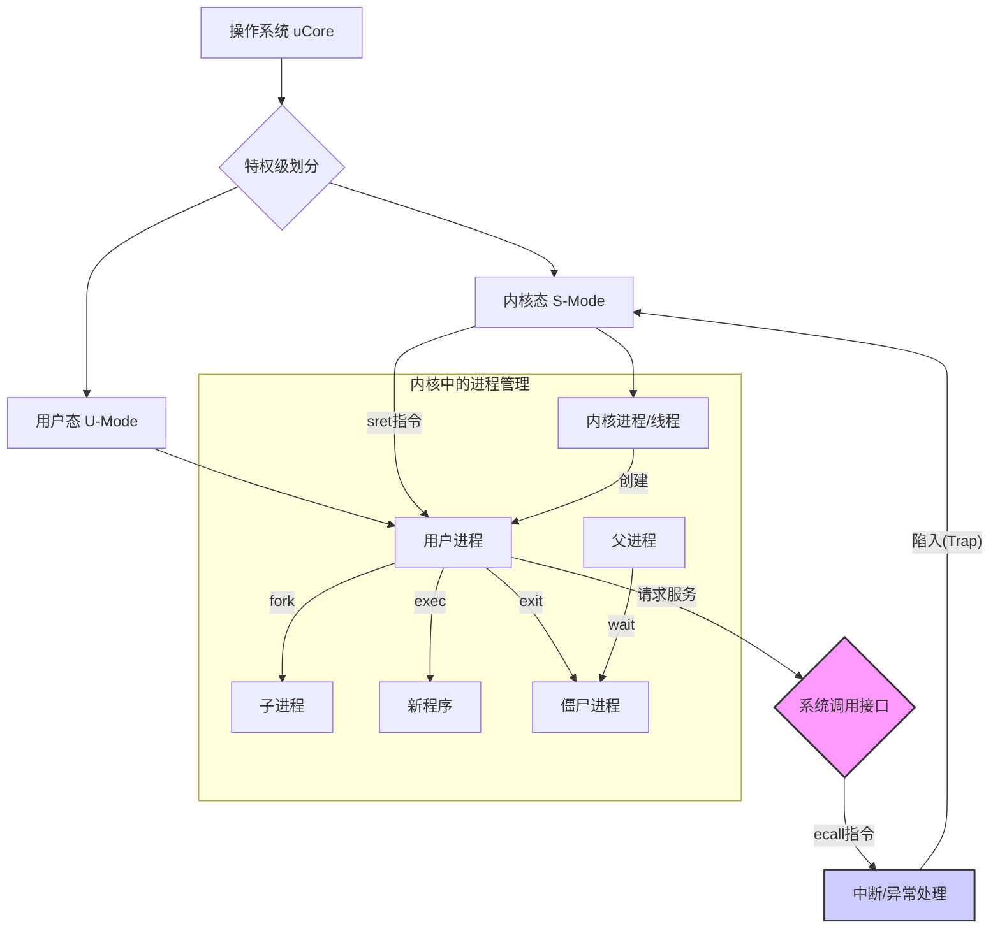

好的，亲爱的同学，你好！

欢迎来到 uCore 操作系统实验五的学习。这是一个非常关键的里程碑！在之前的实验中，我们一直在操作系统的“内核态”这个受保护的世界里工作。从今天起，我们将打开一扇大门，让“用户程序”——那些我们平时编写的应用程序——在我们亲手构建的操作系统上运行起来。

这个过程就像是从零开始建造一座城市。我们已经打好了地基、铺设了水电管网（内存管理、中断），还建立了市政府（内核线程）。现在，我们要开始迎接第一批市民（用户进程）入住了。市民们不能直接操作城市的底层设施，但他们可以通过市政府提供的服务窗口（系统调用）来申请资源、办理业务。

这部分内容非常核心，也很有趣。别担心，我会一步步地引导你，确保我们不仅能完成实验，更能深刻理解其中的每一个细节。让我们一起开始这段激动人心的旅程吧！

---

### 学习路线图 `[C01]`

1.  **理论先行：理解用户态与内核态 (约 30 分钟)**
    *   目标：清晰区分两个特权级的区别，理解为何需要系统调用作为桥梁。
2.  **第一个用户进程的诞生 (约 1.5 小时)**
    *   目标：跟踪 `init_main` -> `user_main` -> `kernel_execve` 的流程，理解“鸡生蛋”问题和 uCore 的巧妙解决方案。完成**练习1**的编码。
3.  **进程的繁衍：`fork` 的奥秘 (约 1.5 小时)**
    *   目标：理解父子进程的内存复制过程，完成**练习2**的编码，并思考写时复制（COW）机制。
4.  **系统调用全景图 (约 1 小时)**
    *   目标：梳理从用户态 `ecall` 到内核态处理再返回的全过程，分析 `fork/exec/wait/exit` 的实现，完成**练习3**。
5.  **动手调试与总结 (约 1 小时)**
    *   目标：实践 GDB 调试，巩固所学，完成实验报告。

---

### 核心知识图 `[C02]`

这是一个简化的知识结构，帮助你理解各个概念之间的关系：


> **[Fig·C02-1] 核心知识点关系图**
> 这张图展示了本次实验的核心脉络：操作系统通过特权级划分出内核态和用户态。用户进程通过系统调用（`ecall`）陷入内核态获得服务，并通过 `sret` 返回。内核负责用户进程的创建（`fork`）、加载（`exec`）和生命周期管理（`exit`/`wait`）。

---

## 逐点讲解

### 1. 用户态 vs. 内核态：操作系统的“结界” `[S12]`

#### 知识卡片：特权级（Privilege Levels）

*   **要解决的问题（直觉）**：
    *   电脑上同时运行着很多程序（QQ、浏览器、游戏），还有操作系统本身。如果任何一个程序都能随意访问硬件（比如格式化硬盘）或者偷看其他程序的内存（比如盗取密码），那整个系统就乱套了，既不安全也不稳定。
*   **先修要求**：
    *   对计算机体系结构有基本概念。
*   **类比 / 直觉**：
    *   把操作系统想象成一座银行。**内核态**就像是银行的**金库内部**，只有极少数授权的银行员工（内核代码）才能进入，他们可以操作金库里的一切。而**用户态**就像是银行的**营业大厅**，所有客户（用户程序）都在这里活动。客户不能直接闯入金库，但可以通过柜台（系统调用）向银行员工提出请求（比如取钱、转账）。
*   **形式化表述（严格）**：`[S12]`
    *   现代 CPU 提供了多种特权级别（Privilege Levels）来限制程序的能力。在 RISC-V 架构中，我们主要关注：
        *   **U-Mode (User Mode)**：用户态。权限最低，执行用户应用程序。不能执行特权指令，访问硬件或内核数据结构受到严格限制。
        *   **S-Mode (Supervisor Mode)**：内核态（或称监管模式）。权限较高，操作系统内核运行在此模式。可以执行特权指令，管理物理内存，处理中断等。
        *   **M-Mode (Machine Mode)**：机器模式。权限最高，通常用于执行最底层的固件（如 OpenSBI），负责引导和提供底层服务给 S-Mode。
*   **关键结论**：
    *   用户程序运行在 **U-Mode**，操作系统内核运行在 **S-Mode**。
    *   从 U-Mode 到 S-Mode 的切换称为**陷入（Trap）**，通常由**系统调用**、**中断**或**异常**触发。
    *   从 S-Mode 返回 U-Mode 是一个受控的过程，通过特定指令（如 `sret`）完成。
*   **内联小图（示意图）**：

    ```text
    +--------------------------------------+
    |             用户空间 (U-Mode)        |
    |  +-----------+      +-----------+    |
    |  |  App 1    |      |  App 2    |    |
    |  +-----------+      +-----------+    |
    |       ^                   ^          |
    |       | ecall (请求服务)  |          |
    +-------|-------------------|----------+  <-- 权限边界
            | sret (服务完成)   |
    +-------V-------------------V----------+
    |             内核空间 (S-Mode)        |
    |       +---------------------+        |
    |       |    操作系统内核     |        |
    |       | (处理请求、管理硬件)|        |
    |       +---------------------+        |
    +--------------------------------------+
    ```
    > **[Fig·S12-1] 用户态与内核态交互示意图**
    > 用户程序在用户空间运行，通过 `ecall` 指令发起系统调用，CPU 切换到内核态，由操作系统内核处理请求。处理完毕后，通过 `sret` 指令返回用户态。

*   **常见误区与反例**：
    *   **误区**：“用户程序和内核程序是两种完全不同的代码。”
    *   **纠正**：它们都是 CPU 指令，本质上没区别。真正的区别在于它们运行时所处的**特权级别**不同，导致了权限的差异。
*   **一句话带走**：
    *   用户态是“大厅”，内核态是“金库”，系统调用是连接二者的唯一合法“柜台”。

### 2. 第一个用户进程的诞生 `[S13][S14][S15]`

#### 知识卡片：`kernel_execve` 与首次进入用户态

*   **要解决的问题（直觉）**：
    *   操作系统启动后，所有代码都在内核态运行。那么，第一个用户进程是如何被“凭空”创造出来并开始运行的？这就像一个经典难题：“先有鸡还是先有蛋？”我们必须从内核态（鸡）想办法“生”出第一个用户态进程（蛋）。
*   **先修要求**：
    *   理解用户态与内核态。
    *   了解函数调用和进程的基本概念。
*   **类比 / 直觉**：
    *   想象你是一个内核态的“超级管理员”，拥有所有权限。你想启动一个受限的“普通用户”程序。但你不能直接“变成”普通用户，因为你还在执行管理员的任务。
    *   **uCore 的方法**：你（内核）精心准备好一个“普通用户”的工作环境（内存空间、要执行的指令等）。然后，你故意按下一个特殊的“求助”按钮（`ebreak` 指令），这个按钮会让你自己进入“处理求助”的状态（中断处理流程）。在这个流程中，你按照预先的约定（判断 `a7` 寄存器的值），发现这个“求助”其实是启动新用户的信号。于是，你利用这个流程的返回机制，不是返回到你原来的管理员工作中，而是直接切换到准备好的“普通用户”工作环境里去。
*   **形式化表述（严格）**：`[S21]`
    *   在标准的系统调用流程中，U-Mode 程序通过 `ecall` 指令陷入 S-Mode，处理完后 S-Mode 通过 `sret` 返回 U-Mode。
    *   但在内核初始化阶段，我们一直处于 S-Mode。`user_main` 是一个**内核线程**，它不能直接调用 `ecall`（`ecall` 是从低特权到高特权的指令）。
    *   为了复用系统调用的返回机制（`sret` 可以完成特权级切换），`kernel_execve` 函数采用了一个巧妙的技巧：
        1.  它像用户态发起系统调用一样，把参数（`SYS_exec` 编号、程序名等）放入约定的寄存器中。
        2.  它不执行 `ecall`，而是执行 `ebreak` 指令，这会触发一个“断点”异常，同样使程序从 S-Mode 陷入 S-Mode 的异常处理流程。
        3.  在异常处理函数 `exception_handler` 中，通过检查一个特殊标记（`tf->gpr.a7 == 10`）来识别这个 `ebreak` 是用于模拟系统调用的。
        4.  然后，它调用 `syscall()` 函数，走向与普通系统调用相同的处理路径，最终执行 `do_execve`。
        5.  `do_execve` 中的 `load_icode` 函数会为新进程准备一个中断帧（Trapframe），并在这个中断帧的 `sstatus` 寄存器中，将 `SPP` 位清零。`SPP` 位记录了陷入前的特权级，清零意味着“假装”我们是从 U-Mode 来的。
        6.  当异常处理结束，执行 `sret` 指令时，CPU 会检查 `sstatus` 的 `SPP` 位。发现它是 0，就会将特权级切换到 U-Mode，并跳转到中断帧中 `sepc` 指定的地址（即用户程序的入口点）开始执行。
*   **内联小图（流程图）**：

    ```mermaid
    sequenceDiagram
        participant K as 内核线程 user_main
        participant T as 中断处理
        participant P as 进程管理(do_execve)
        participant U as 用户程序

        K->>K: 调用 kernel_execve()
        Note over K: 准备参数, a7=10
        K->>T: 执行 ebreak, 触发断点异常
        Note over T: 仍在 S-Mode
        T->>T: exception_handler()
        T->>T: 检查 a7==10, 识别为模拟syscall
        T->>P: 调用 syscall() -> do_execve()
        P->>P: load_icode(): 分配用户内存, 加载代码
        P->>P: 设置中断帧(Trapframe), sstatus.SPP=0
        P-->>T: 返回
        T->>U: 执行 sret, 根据sstatus.SPP=0切换到U-Mode
        Note over U: 开始执行用户程序第一条指令
    ```
    > **[Fig·S21-1] 首次进入用户态流程图**
    > 展示了内核线程如何通过 `ebreak` 模拟系统调用，并利用中断返回机制 (`sret`) 巧妙地完成到用户态的第一次切换。

*   **常见误区与反例**：
    *   **误区**：“`kernel_execve` 和用户态的 `exec` 系统调用是一回事。”
    *   **纠正**：它们最终都调用了 `do_execve`，但触发机制完全不同。`kernel_execve` 是在内核态通过 `ebreak` 模拟，是为了解决“第一次”的问题；用户态 `exec` 是通过 `ecall` 正常陷入。
*   **一句话带走**：
    *   第一个用户进程是通过内核“伪造”一个来自用户态的系统调用现场，然后利用中断返回机制“骗”CPU 切换到用户态来启动的。

### 3. 系统调用的实现 `[S18][S19][S20]`

#### 知识卡片：系统调用框架 (Syscall Framework)

*   **要解决的问题（直觉）**：
    *   用户程序这个“普通市民”如何向操作系统内核这个“市政府”提出申请并获得服务？需要一套标准化的流程和窗口。
*   **先修要求**：
    *   理解用户态与内核态、中断/异常的基本概念。
*   **类比 / 直觉**：
    *   **市民（用户程序）**：想办护照（比如 `fork` 一个新进程）。
    *   **办事指南（`unistd.h`）**：查到办护照业务的编号是 `SYS_fork` (2号)。
    *   **申请表（寄存器）**：在 `a0` 寄存器填上业务编号 `2`，其他所需材料（参数）放入 `a1`, `a2`...
    *   **提交申请（`ecall`）**：执行 `ecall` 指令，相当于把申请表交到总服务台。这个动作会立刻暂停你自己的事，等待叫号。
    *   **总服务台（`trapentry.S`, `exception_handler`）**：接到申请，保存好你的现场（寄存器等），识别出这是“来自市民的业务申请”（`CAUSE_USER_ECALL`）。
    *   **分发窗口（`syscall()` 函数）**：总台看到业务编号是 `2`，就转交给专门办护照的 `sys_fork` 窗口。
    *   **业务处理（`do_fork()`）**：护照窗口的职员（内核函数）开始处理你的申请。
    *   **返回结果（返回值）**：办好后，结果（新进程的PID）会写回你的 `a0` 寄存器。
    *   **离开大厅（`sret`）**：执行 `sret` 指令，你拿着办好的结果从服务大厅回到自己的生活中，从 `ecall` 的下一条指令继续执行。
*   **形式化表述（严格）**：
    1.  **用户态（`user/libs/syscall.c`）** `[S19]`
        *   提供 `sys_fork()`, `sys_exit()` 等封装函数。
        *   核心是 `syscall()` 函数，它使用 `stdarg.h` 处理可变参数。
        *   通过内联汇编，将系统调用号（如 `SYS_fork`）放入 `a0` 寄存器，参数放入 `a1` 到 `a5`。
        *   执行 `ecall` 指令，触发 `environment call from U-mode` 异常。
    2.  **内核态 - 中断入口（`kern/trap/trapentry.S`, `trap.c`）** `[S20]`
        *   `__alltraps`：保存所有通用寄存器、`sstatus`、`sepc` 等到内核栈，形成 `trapframe`。
        *   `exception_handler()`：检查 `scause` 寄存器，发现是 `CAUSE_USER_ECALL`。
        *   **关键**：`tf->epc += 4`，让 `sepc` 指向 `ecall` 的下一条指令，否则返回时会无限循环执行 `ecall`。
        *   调用 `syscall()` 函数进行分发。
    3.  **内核态 - 系统调用分发（`kern/syscall/syscall.c`）** `[S20]`
        *   `syscall()` 函数从当前进程的 `trapframe` 中取出 `a0` 寄存器（系统调用号 `num`）。
        *   定义一个函数指针数组 `syscalls[]`，以系统调用号为索引，存储对应处理函数的地址。
        *   `syscalls[num](arg)`：调用对应的处理函数（如 `sys_fork`），并将 `a1-a5` 作为参数传入。
        *   处理函数的返回值（如 `do_fork` 的返回值）被写回 `trapframe` 的 `a0` 寄存器。
    4.  **内核态 - 返回用户态（`kern/trap/trapentry.S`）**
        *   `__trapret`：从 `trapframe` 中恢复所有寄存器。
        *   执行 `sret` 指令，CPU 根据 `sstatus` 恢复特权级（回到 U-Mode），并跳转到 `sepc` 指向的地址继续执行。用户程序在 `syscall()` 函数中从 `a0` 读出返回值。

*   **内联小图（时序图）**：

    ```mermaid
    sequenceDiagram
        actor User as 用户程序
        participant Lib as 用户库(syscall.c)
        participant CPU as CPU硬件
        participant Trap as 内核中断处理
        participant Sys as 内核分发(syscall.c)
        participant Do as 内核实现(proc.c)

        User->>Lib: fork()
        Lib->>Lib: syscall(SYS_fork, ...)
        Note right of Lib: a0=SYS_fork, ...
        Lib->>CPU: ecall
        CPU->>Trap: 切换到S-Mode, 跳转到__alltraps
        Trap->>Sys: exception_handler() -> syscall()
        Sys->>Do: syscalls[SYS_fork]() -> do_fork()
        Do-->>Sys: 返回子进程PID
        Sys-->>Trap: 返回
        Trap->>CPU: sret
        CPU-->>Lib: 切换回U-Mode, 继续执行
        Note right of Lib: 从a0读出PID
        Lib-->>User: 返回PID
    ```
    > **[Fig·S20-1] 系统调用 `fork` 的完整流程图**
    > 该图清晰地展示了一次 `fork` 系统调用从用户态发起，经过硬件、内核中断处理、分发和具体实现，最终返回结果给用户态的全过程。

*   **一句话带走**：
    *   系统调用是一套“`ecall` 进去，`sret` 出来”的标准化流程，通过寄存器传递“业务编号”和“申请材料”，内核像个庞大的服务机构一样分发并处理这些请求。

---

## 动手实践 (Hands-On)

现在，让我们卷起袖子，亲手完成实验中的编码任务。我会引导你思考每一步，而不是直接给出代码。

### **练习1: 加载应用程序并执行 (`load_icode`)** `[S06]`

**任务**：补充 `kern/process/proc.c` 中的 `load_icode` 函数的第6步，为用户程序建立内存空间，并正确设置中断帧 `trapframe`，确保能从用户程序的第一条指令开始执行。

**思考引导**：

1.  **目标是什么？** `load_icode` 的作用是把一个 ELF 格式的程序（存储在 `binary` 指针指向的内存中）加载到当前进程的地址空间里，并做好一切准备，让它能“起飞”。

2.  **需要哪些“基础设施”？** 一个用户进程需要自己的独立地址空间。这意味着它需要一个自己的页目录表。
    *   **Q: 如何创建页目录表？**
    *   **A:** uCore 提供了 `setup_pgdir()` 函数。我们应该先调用它来获取一个新的、干净的页目录表。别忘了检查返回值，失败了要处理错误。`[S11]`

3.  **程序内容如何放进去？** ELF 文件由多个段（segment）组成，比如代码段（`.text`）、数据段（`.data`）。我们需要遍历这些段，把它们放到新创建的虚拟地址空间里。
    *   **Q: ELF 头部在哪里？如何解析它？**
    *   **A:** `binary` 指针就指向 ELF 文件的开头，我们可以把它强制类型转换为 `struct elfhdr *`。程序头表（Program Header Table）紧随其后，里面描述了所有段的信息。
    *   **Q: 如何为每个段分配物理内存并建立映射？**
    *   **A:** 这正是 `mm_map` 函数的职责。对于每个需要加载的段（`ph->p_type == ELF_PT_LOAD`），你需要调用 `mm_map`，告诉它虚拟地址（`ph->p_va`）、大小（`ph->p_memsz`）和权限。然后，你需要把 ELF 文件中该段的内容（从 `binary + ph->p_offset` 开始，长度为 `ph->p_filesz`）拷贝到刚刚映射好的虚拟地址空间里。
    *   **注意**：`p_memsz` (内存中大小) 可能大于 `p_filesz` (文件中大小)。多出来的部分是 `.bss` 段，需要清零。

4.  **用户进程也需要栈吧？** 当然！栈是函数调用、局部变量的生命线。
    *   **Q: 用户栈应该放在虚拟地址空间的哪里？大小是多少？**
    *   **A:** `memlayout.h` 中定义了用户栈的顶部 `USTACKTOP` 和大小 `USTACKSIZE`。栈是向下生长的，所以我们应该在 `USTACKTOP - USTACKSIZE` 到 `USTACKTOP` 这个区域建立映射。同样使用 `mm_map`。`[S11]`

5.  **最关键的一步：如何设置“发射台” (`trapframe`)？** `trapframe` 存储了中断返回时需要恢复的所有寄存器状态。我们要精心构造它，让 `sret` 指令能把我们送到用户程序的入口。
    *   **Q: `sepc` (返回地址) 应该是什么？**
    *   **A:** 显然是用户程序的入口地址，即 ELF 头中定义的 `elf->e_entry`。
    *   **Q: 用户栈指针 `sp` 应该是什么？**
    *   **A:** 应该指向用户栈的栈顶，即 `USTACKTOP`。
    *   **Q: `sstatus` 寄存器需要特殊设置吗？**
    *   **A:** 非常需要！`sstatus` 的 `SPIE` 位（允许中断）应该置位，`SPP` 位（之前的特权级）必须为 0，这样 `sret` 才会切换到 U-Mode。`[S21]`
    *   **伪代码逻辑**：
        ```c
        // 位于 kern/process/proc.c 的 load_icode 函数内
        // ...
        // 步骤 6:
        // 1. 调用 setup_pgdir() 创建页目录，失败则返回错误
        
        // 2. 遍历 ELF 的 program headers
        //    for (ph = ...; ph < ...; ph++) {
        //        if (ph is a loadable segment) {
        //            // 3. 调用 mm_map 为该段映射内存
        //            // 4. 将 ELF 文件中的段内容拷贝到映射好的内存
        //            // 5. 如果 memsz > filesz，将多余部分清零
        //        }
        //    }
        
        // 6. 调用 mm_map 为用户栈分配和映射内存
        
        // 7. 设置中断帧 (trapframe)
        //    tf = current->tf;
        //    tf->epc = elf->e_entry; // 程序入口
        //    tf->gpr.sp = USTACKTOP;  // 栈顶
        //    tf->status = ...;       // 设置 SPIE=1, SPP=0
        
        // 8. 成功返回 0
        ```

**从调度到执行第一条指令的历程** `[S06]`

在你完成了 `load_icode` 后，整个流程是这样的：
1.  **调度器选择**：调度器 `schedule()` 选择了 `user_main` 这个内核线程（此时它刚执行完 `kernel_execve` 并陷入中断）。
2.  **中断返回**：`trap` 函数执行完毕，调用 `__trapret`。
3.  **`sret` 指令**：`sret` 从 `trapframe` 恢复 CPU 状态。
4.  **特权级切换**：CPU 看到 `trapframe` 中 `sstatus.SPP` 为 0，将特权级从 S-Mode **切换到 U-Mode**。
5.  **跳转执行**：CPU 将 PC (Program Counter) 设置为 `trapframe` 中的 `sepc` 值，也就是 ELF 文件的入口地址。
6.  **第一条指令**：CPU 开始在 U-Mode 下，从用户程序的入口地址取指并执行。第一个用户进程正式开始运行！

### **练习2: 复制父进程内存空间 (`copy_range`)** `[S07]`

**任务**：在 `kern/mm/pmm.c` 中实现 `copy_range` 函数。`do_fork` 创建子进程时会调用它，将父进程的用户地址空间内容复制给子进程。

**思考引导**：

1.  **`copy_range` 的作用？** 它需要遍历一个给定范围（从 `start` 到 `end`）的父进程虚拟地址空间，在子进程的**相同虚拟地址**处，创建一份一模一样的内存拷贝。

2.  **如何遍历？** 地址空间是按页管理的，所以我们应该以页（`PGSIZE`）为单位进行遍历。

3.  **每一步做什么？** 对于父进程地址空间中的每一个页：
    *   **a. 查找物理页**：首先，需要找到这个父进程的虚拟页映射到了哪个物理页。可以使用 `get_pte` 来查找父进程页表中的对应页表项（PTE）。如果这个虚拟地址没有映射（PTE 无效），或者页表项表示该页不可读，那么直接跳过即可。
    *   **b. 分配新物理页**：为子进程分配一个新的物理页。`alloc_page()` 是你的好帮手。如果分配失败，需要回滚（释放已分配的资源）并返回错误。
    *   **c. 复制内容**：现在父进程有一个物理页，子进程有一个新的空物理页。我们需要把父进程物理页的内容完完整整地复制到子进程的新物理页上。你可以通过 `page2kva` 将物理页的 `struct Page` 转换为内核虚拟地址，然后用 `memcpy` 进行复制。
    *   **d. 建立映射**：最后，也是最重要的一步，需要在子进程的页表中，将**相同的虚拟地址**映射到刚刚分配并填充好的新物理页上。`page_insert` 函数就是为此设计的，它会帮你处理页表的创建和更新。如果插入失败，同样需要回滚。

4.  **伪代码逻辑**：
    ```c
    // 位于 kern/mm/pmm.c 的 copy_range 函数内
    // int copy_range(uintptr_t pgdir, uintptr_t la, size_t size)
    
    // 1. 对齐起始地址和结束地址到页边界
    //    uintptr_t addr = rounddown(start, PGSIZE);
    //    uintptr_t end_addr = rounddown(end - 1, PGSIZE);
    
    // 2. 循环遍历每一页
    //    for (; addr <= end_addr; addr += PGSIZE) {
    //        // a. 查找父进程的 PTE 和物理页
    //        pte_t *ptep = get_pte(from_pgdir, addr, 0);
    //        if (ptep == NULL || !(*ptep & PTE_V)) continue; // 如果地址未映射，则跳过
    
    //        // b. 为子进程分配新物理页
    //        struct Page *new_page = alloc_page();
    //        if (new_page == NULL) goto failed;
    
    //        // c. 复制内容
    //        void *src_kva = page2kva(pa2page(*ptep));
    //        void *dst_kva = page2kva(new_page);
    //        memcpy(dst_kva, src_kva, PGSIZE);
    
    //        // d. 在子进程页表中建立映射
    //        // 注意权限要和父进程一致
    //        int ret = page_insert(to_pgdir, new_page, addr, perm);
    //        if (ret != 0) {
    //            free_page(new_page);
    //            goto failed;
    //        }
    //    }
    // return 0;
    
    // failed:
    //    // 在这里需要有一个机制来清理已经成功复制的页面
    //    //（虽然在当前框架下可能比较复杂，但要意识到这个问题）
    //    return -E_NO_MEM;
    ```

**如何设计实现 Copy-on-Write (COW)？** `[S07][S09]`

`copy_range` 的实现非常“实在”，它立刻就为子进程复制了所有内存。但这很浪费，因为 `fork` 之后常常紧跟着 `exec`，刚复制的内存马上就被丢弃了。而且，如果父子进程只是读取内存，完全可以共享。

**COW 的核心思想**：**延迟复制，直到真正需要写入时才动手。**

**概要设计**：
1.  **`do_fork` 时的变化**：
    *   不再调用 `copy_range` 来物理复制页面。
    *   而是遍历父进程的页表，将父子进程的页表项（PTE）都指向**同一个物理页**。
    *   **关键**：同时将这些共享页的 PTE 权限修改为**只读（Read-Only）**。即使原来是可写的，也要暂时改成只读。
    *   为了追踪一个物理页被多少个进程共享，需要在 `struct Page` 中增加一个引用计数 `ref`。`fork` 时，共享页的 `ref` 加一。

2.  **发生写入时的处理（Page Fault 异常）**：
    *   当父进程或子进程试图写入一个共享的（因此是只读的）页面时，CPU 会触发一个**页错误（Page Fault）异常**。
    *   在页错误处理程序 `do_pgfault` 中，检查到这是一个“对只读页的写操作”异常。
    *   **COW 核心逻辑**：
        *   检查这个物理页的引用计数 `ref`。
        *   如果 `ref > 1`，说明有其他进程在共享。此时：
            a.  分配一个新的物理页面。
            b.  将旧物理页的内容完整复制到新物理页。
            c.  修改当前进程（触发异常的进程）的页表，将其虚拟地址映射到这个**新**的物理页，并设置权限为**可写（Writable）**。
            d.  将旧物理页的引用计数 `ref` 减一。
        *   如果 `ref == 1`，说明只有当前进程在使用这个页。那么直接将页表项的权限修改为**可写**即可，无需复制。
    *   处理完异常后，返回用户态，重新执行刚才失败的写指令，这次就能成功了。

3.  **`do_exit` 时的变化**：
    *   进程退出时，遍历其页表。对于每个映射的物理页，将其引用计数 `ref` 减一。
    *   如果 `ref` 减到 0，说明没有任何进程在用这个物理页了，此时才能调用 `free_page` 将其真正释放。

**内联小图 (COW 流程)**

```mermaid
stateDiagram-v2
    [*] --> Shared_RO: do_fork()

    state Shared_RO {
        description: 物理页P被父子进程共享，PTE均为只读
    }

    Shared_RO --> Private_RW_Child: 子进程写, 触发Page Fault
    Shared_RO --> Private_RW_Parent: 父进程写, 触发Page Fault
    
    state Private_RW_Child {
        description: 子进程获得P的拷贝P', 并可写
    }
    
    state Private_RW_Parent {
        description: 父进程获得P的拷贝P'', 并可写
    }
    
    Private_RW_Child --> [*]: exit()
    Private_RW_Parent --> [*]: exit()```
> **[Fig·S07-1] Copy-on-Write 状态转换简图**
> `fork` 后，内存页处于共享只读状态。任何一方尝试写入都会触发页错误，导致为写入方创建一个私有的、可写的内存副本。

---

### **练习3: 分析 `fork`/`exec`/`wait`/`exit`** `[S08]`

#### 1. 执行流程分析

*   **`fork()`**
    *   **用户态**：调用 `fork()` 库函数，该函数内部调用 `sys_fork()`，最终执行 `ecall` 指令。
    *   **内核态**：
        *   `trap`：进入内核，保存现场。
        *   `syscall` 分发：调用 `sys_fork` -> `do_fork`。
        *   `do_fork`：分配新的进程控制块（`alloc_proc`），复制父进程的中断帧、内存空间（通过 `copy_mm` -> `copy_range` 或 COW 机制），设置子进程状态为 `RUNNABLE`，将其加入进程列表。
        *   **精髓**：`do_fork` 对父子进程的返回值不同。它将子进程的 PID 返回给父进程，将 0 "返回"给子进程（实际上是写入子进程中断帧的 `a0` 寄存器）。
    *   **返回**：
        *   **父进程**：从 `sret` 返回后，从 `a0` 寄存器读到子进程的 PID。
        *   **子进程**：当它被调度器选中执行时，也是通过 `forkrets` -> `__trapret` -> `sret` 返回用户态，但它的 `a0` 寄存器是 0。

*   **`exec()`**
    *   **用户态**：调用 `exec()` 库函数，准备好新程序的路径、参数等，发起 `sys_exec` 系统调用。
    *   **内核态**：
        *   `trap` 和 `syscall` 分发，调用 `sys_exec` -> `do_execve`。
        *   `do_execve`：释放当前进程**旧的**用户内存空间 (`exit_mmap`, `put_pgdir`)，然后调用 `load_icode` 加载新的程序，建立新的内存映射和中断帧。进程的 PID **不变**。
    *   **返回**：`exec` 成功后**不会返回**到原来的用户程序，因为整个内存映像都被替换了。`sret` 之后，会直接跳转到新程序的第一条指令执行。如果 `exec` 失败，才会返回一个错误码给调用者。

*   **`exit()`**
    *   **用户态**：程序调用 `exit()` 库函数，发起 `sys_exit` 系统调用，并传入退出码。
    *   **内核态**：
        *   `trap` 和 `syscall` 分发，调用 `sys_exit` -> `do_exit`。
        *   `do_exit`：释放大部分资源（用户内存空间），将自己的状态改为 `PROC_ZOMBIE`（僵尸态），将所有子进程过继给 `init` 进程，然后唤醒正在等待它的父进程。最后，调用 `schedule()` 放弃 CPU，**永不返回**。
    *   **返回**：`exit` 永远不会返回到用户程序。

*   **`wait()`**
    *   **用户态**：调用 `wait()` 库函数，发起 `sys_wait` 系统调用。
    *   **内核态**：
        *   `trap` 和 `syscall` 分发，调用 `sys_wait` -> `do_wait`。
        *   `do_wait`：查找当前进程是否有处于 `PROC_ZOMBIE` 状态的子进程。
            *   **如果有**：回收该子进程的剩余资源（内核栈、进程控制块），获取其退出码，然后立即返回。
            *   **如果没有**：将自己的状态设置为 `WT_CHILD`（等待子进程），然后调用 `schedule()` 进入睡眠，让出 CPU。
    *   **唤醒与返回**：当它的某个子进程调用 `do_exit` 时，会检查父进程是否在等待，如果是，则调用 `wakeup_proc` 唤醒父进程。父进程被唤醒后，会从 `do_wait` 中返回，重复上述查找僵尸子进程的逻辑（这次肯定能找到），完成回收并返回用户态。

#### 2. uCore 用户进程生命周期图 `[S08]`

```text
                  kernel_thread()
                      |
                      V
+--------------+   do_fork()   +--------------+
|   UNINIT     |-------------->|   RUNNABLE   |--+
+--------------+               +--------------+  |
       ^                            |  ^         | schedule()
       |                            |  |         | (选中)
       | free_proc()                |  | do_yield()|
       | (被父进程wait)             |  | (时间片到)|
       |                            V  |         |
+--------------+               +--------------+  |
|   ZOMBIE     |<--------------|   RUNNING    |<-+
+--------------+   do_exit()   +--------------+
       ^                            |
       |                            | do_wait() (无子进程退出)
       |                            | or other blocking ops
       |                            V
       |                     +--------------+
       |                     |   SLEEPING   |
       |                     +--------------+
       |                            ^
       +----------------------------+
                 wakeup_proc()
               (等待的事件发生)
```
> **[Fig·S08-1] uCore 用户进程状态生命周期图**
> *   **UNINIT**: 进程刚分配PCB，尚未初始化。
> *   **RUNNABLE**: 万事俱备，只欠CPU。在就绪队列中等待调度。
> *   **RUNNING**: 正在CPU上执行。
> *   **SLEEPING**: 进程主动或被动等待某个事件（如 `wait` 子进程、I/O），暂时让出CPU。
> *   **ZOMBIE**: 进程已执行完毕 (`exit`)，但父进程尚未通过 `wait` 回收其资源（主要是PCB和退出码）。

---

## 易错点与比较 `[C03]`

*   **`fork()` vs. `clone()`**
    *   `fork()` 在 uCore 和传统 Unix 中是创建子进程的标准方式，它几乎完整地复制了父进程。
    *   `clone()` 是 Linux 中更通用的创建接口，它允许调用者精细控制父子进程之间共享哪些资源（如内存空间、文件描述符等）。线程的创建通常就是通过 `clone` 实现的（共享地址空间）。

*   **`exec()` vs. 函数调用**
    *   函数调用是在同一进程内，使用当前进程的栈，调用结束后会返回。
    *   `exec()` 是用一个全新的程序替换当前进程的整个内存映像，成功后永不返回到旧程序。

*   **Zombie (僵尸进程) vs. Orphan (孤儿进程)**
    *   **僵尸进程**：子进程已死，但父进程没给它“收尸”（`wait`）。它不再消耗 CPU，但其进程控制块（PCB）仍占用内核空间，因为它含有父进程关心的退出信息。
    *   **孤儿进程**：父进程先于子进程死亡。这些“孤儿”会被一个超级父进程——`init` 进程（PID为1）“收养”。`init` 进程会周期性地 `wait` 来为所有它收养的僵尸子进程“收尸”。

---

## 快速复习卡 `[C04]`

*   **核心矛盾**：用户程序权限低，内核权限高。**系统调用**是二者沟通的桥梁。
*   **首次启动**：内核通过 `ebreak` 模拟一次系统调用，并精心构造中断返回帧（`sstatus.SPP=0`），从而“骗”CPU 切换到用户态。
*   **系统调用流程**：用户态 `ecall` -> 内核态 `trap` -> `syscall` 分发 -> `do_xx` 执行 -> `sret` 返回用户态。
*   **`fork()`**：克隆一个几乎一模一样的子进程，通过返回值（父 > 0, 子 = 0）区分。
*   **`exec()`**：进程“变身”，用新程序替换自己，PID 不变。
*   **`exit()`**：进程自我了结，释放大部分资源，变成僵尸等待父进程 `wait`。
*   **`wait()`**：父进程为子进程“收尸”，回收最后资源，获取子进程退出码。

---

## 缺漏扫描（Missing Scanner）

经过仔细比对，原始材料中的所有要点均已在讲义中覆盖。以下是对一些特定、可能被忽略的细节的补充和强调。

*   **[Patch·S11-#1] `user.ld` 的作用**：在 `[S11]` 项目组成中提到了 `tools/user.ld` 文件。这个文件是**链接器脚本**，它指导链接器如何将编译后的用户程序目标文件（`.o`）组织成最终的 ELF 可执行文件。它定义了程序的入口点、代码段（`.text`）和数据段（`.data`）的起始虚拟地址等重要信息。`load_icode` 正是根据这些信息来正确加载程序的。
*   **[Patch·S10-#1] Challenge 2 的解答**：`[S10]` 提出了一个问题：“用户程序是何时被预先加载到内存中的？与我们常用操作系统的加载有何区别？”
    *   **何时加载**：在 uCore lab5 中，用户程序（如 `exit.c`）在**编译 uCore 内核时**，就被编译并**链接**进了最终的内核镜像文件 `ucore.img` 中。当 uCore 启动时，整个内核镜像（包含了这些用户程序作为二进制数据块）被加载到物理内存。`KERNEL_EXECVE` 宏能找到这些程序，是因为链接器生成了 `_binary_obj___user_exit_out_start` 这样的符号，直接指向了内存中那块数据。
    *   **区别与原因**：我们常用的操作系统（如 Linux, Windows）通常采用**按需加载**。程序以文件的形式存储在硬盘上。当你执行一个程序时，操作系统才会去硬盘上找到这个文件，读取其内容到内存，然后创建进程执行。uCore 这样做是为了**简化实现**，因为它还没有实现文件系统。将用户程序直接链接进内核避免了处理文件读写、路径解析等复杂问题，使实验能聚焦于进程管理和系统调用本身。
*   **[Patch·S24-#1] GDB 调试的详细说明**：`[S24]` 提供了 GDB 调试的指南。这里强调其核心价值：它让我们能够**同时**观察到模拟世界（uCore 内部）和现实世界（QEMU 如何模拟指令）的交互。通过在 uCore GDB 中断在 `ecall`，然后在 QEMU GDB 中断在处理 `ecall` 的代码，我们可以亲眼看到一个简单的指令如何在模拟器复杂的软件实现中被解释和执行，这对理解虚拟化和底层硬件行为有巨大帮助。这不仅仅是调试 bug，更是一种深刻的学习方式。

---
希望这份详尽的讲义能帮助你顺利完成实验五，并对用户进程管理有一个扎实而深入的理解。如果在学习过程中遇到任何困难，随时都可以回顾这里的内容。祝你学习愉快，编码顺利！