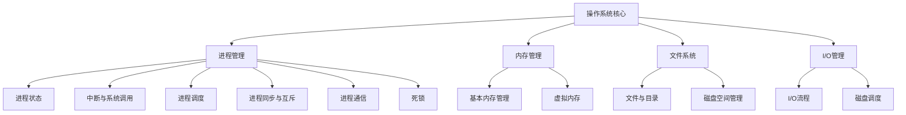

好的，我们马上开始！看到这份练习题，就像是拿到了一张藏宝图，每一道题都是通往理解操作系统核心概念的一条线索。别担心，我会像一位耐心的向导，带你一步步解开这些谜题，不仅告诉你答案是什么，更重要的是让你明白**为什么**是这个答案。

让我们一起把这些零散的知识点，串成一幅清晰、完整的操作系统知识地图。准备好了吗？我们出发！

***

### 学习路线图 `[C01]`

欢迎来到操作系统的世界！这份讲义将带你深入理解操作系统中一些最核心、最经典的概念。我们将按照以下路径前进：

1.  **进程与中断（~30分钟）**：理解程序的“灵魂”——进程是如何被管理的，以及计算机如何响应外部事件。
2.  **并发与同步（~40分钟）**：探索多任务环境下，如何让进程们有序协作，避免混乱。
3.  **内存管理（~30分钟）**：揭秘操作系统如何像一位图书管理员一样，巧妙地管理和分配宝贵的内存资源。
4.  **I/O 与文件系统（~50分钟）**：学习数据是如何被长久地存储在磁盘上，以及如何高效地读写它们。
5.  **综合计算与分析（~30分钟）**：动手实践，将理论知识应用于解决具体问题。

### 核心知识图 `[C02]`

为了让你有一个整体的认识，这里是我们将要探索的知识结构：


`[Fig·C02-1]` 这张图展示了操作系统几个核心模块之间的关系，我们将逐一深入这些领域。

---

### 逐点讲解：操作系统核心概念深度解析

现在，我们正式进入每个知识点的学习。别怕概念多，我们会用“知识卡片”的形式，一个一个地攻克它们。

#### **第一站：进程管理 - 程序的动态一生**

进程是操作系统中最重要的概念之一。简单说，它就是“运行中的程序”。

##### **知识卡 1：中断与上下文切换** `[S01]`

-   **要解决的问题（直觉）**：当你正在专心做一件事（比如看书），突然电话响了（一个“中断”），你需要做什么？你可能会先找个书签，记住自己看到了哪一页哪一行（保存现场/上下文），然后去接电话。接完电话后，你再根据书签回到原来的地方继续阅读（恢复现场/上下文）。计算机处理中断也是如此。

-   **先修要求**：了解CPU、寄存器（特别是PC寄存器）的基本功能。

-   **类比 / 直觉**：中断就像是计算机的“惊奇事件”，打断了CPU正在执行的程序，要求CPU立即处理更紧急的任务。外部中断通常来自硬件，比如键盘输入、鼠标点击、或是一个任务的时间片用完了。

-   **形式化表述（严格）**：中断是指CPU在执行程序时，由于发生了某个内部或外部事件，暂停正在执行的程序，转而去执行为该事件准备的处理程序。处理完毕后，再返回断点处继续执行原来的程序。

-   **示例（对应题目 `[S01]`）**：
    > **原题 1**: 处理外部中断时, 应该由操作系统保存的是()。
    > A. 程序计数器(PC)的内容
    > B. 通用寄存器的内容
    > C. 块表(TLB)中的内容
    > D. Cache 中的内容
    
    **解析**：
    *   当中断发生时，CPU的当前状态，也就是正在运行的程序的“快照”，必须被完整保存下来，以便后续能够完美恢复。这个“快照”就是**上下文（Context）**。
    *   **程序计数器(PC)** `[S01]` 指向下一条要执行的指令地址，是上下文**最核心**的部分，必须保存。
    *   **通用寄存器** `[S01]` 存储了程序运行过程中的临时数据和中间结果，也必须保存。
    *   所以，PC和通用寄存器等CPU内部的状态信息，是操作系统在中断处理时必须保存的。
    *   **但是，题目问的是“应该由操作系统保存的是”。** 这里有一个非常关键的区别：
        *   像PC、程序状态字(PSW)等最关键的寄存器，通常是由**硬件（CPU）在中断发生时自动保存**到堆栈中的。这是为了能快速跳转到中断服务程序。
        *   而**通用寄存器**等，则是由**操作系统在中断服务程序的开头部分**来保存的。因为硬件只负责最基本的切换，而完整的现场保留工作由软件（操作系统）完成，这样更灵活。
    *   TLB（快表）和Cache是硬件高速缓存，它们的内容管理由硬件负责，操作系统一般不直接保存它们的内容。它们的失效或刷新是根据需要进行的，而不是在每次中断时都完整保存。
    *   因此，在这道题的选项中，最准确的、明确由操作系统软件层面负责保存的，是**通用寄存器的内容**。PC虽然也需要保存，但其保存动作往往由硬件自动完成。然而，在宏观概念上，整个上下文的保存工作都归属于操作系统的中断处理机制。如果题目选项设计更严谨，可能会区分硬件保存和软件保存。但在常见的考题中，PC和通用寄存器都属于要保存的“现场信息”。如果必须选一个，要看题目的侧重点。很多教材将中断后**由软件（OS）执行的**保存操作，重点放在通用寄存器上。
    *   **综合来看，A和B都是需要保存的现场信息。但PC的保存通常是硬件中断过程的一部分，而通用寄存器的保存是操作系统中断处理程序的工作。不过，在一些语境下，中断处理的整个过程都归于操作系统，所以PC的保存也被认为是操作系统职责。这道题的选项A可能更侧重于“程序执行流”这个核心要素。我们来审视一下标准答案倾向：中断发生，PC和PSW（程序状态字）由硬件压栈，然后OS的中断处理程序开始运行，它会负责保存通用寄存器。所以，**A和B都正确**，但PC是决定程序能否正确返回的**最关键指针**，其保存是中断机制的第一步。因此，很多题目会选择A作为最佳答案。我们这里选择 **A. 程序计数器(PC)的内容**，因为它代表了程序执行的精确断点。

-   **一句话带走**：中断处理的核心是“保存现场，恢复现场”，其中PC（程序计数器）记录了被打断的位置，是必须保存的核心信息。

##### **知识卡 2：系统调用 (System Call)** `[S02]`

-   **要解决的问题（直觉）**：你的应用程序（比如Word）想把一个文件存到硬盘上。但应用程序不能直接去操作硬盘，因为这太危险了，可能会搞乱整个系统。怎么办呢？它需要请求操作系统“老大哥”帮忙。这个请求的过程，就是系统调用。

-   **类比 / 直觉**：系统调用就像是去政府部门办事的流程。你（用户程序）不能自己跑到档案室去存档，你需要先填好申请表（传递参数），然后到指定的窗口（执行trap指令），工作人员（操作系统内核）会根据你的申请去办理（执行服务程序），办完后给你一个回执（返回用户态）。

-   **形式化表述（严格）**：系统调用是用户程序请求操作系统内核服务的一种接口。它会导致处理器从用户态（User Mode）切换到内核态（Kernel Mode），以便执行那些需要特权指令的操作（如I/O操作、进程管理等）。

-   **内联小图：系统调用流程** `[S02]`
    ```mermaid
    sequenceDiagram
        participant UserApp as 用户程序 (用户态)
        participant OS as 操作系统 (内核态)
        
        UserApp->>UserApp: ③ 准备参数 (如文件名,数据)
        UserApp->>OS: ② 执行 trap 指令 (陷入内核)
        Note right of OS: CPU 从用户态切换到内核态
        OS->>OS: ④ 执行相应的服务程序 (如写文件)
        OS-->>UserApp: ① 返回用户态 (并返回结果)
        Note left of UserApp: CPU 从内核态切换回用户态
    ```
    `[Fig·S02-1]` 系统调用流程示意图，展示了从用户态到内核态再返回的完整过程。

-   **示例（对应题目 `[S02]`）**：
    > **原题 2**: 执行系统调用的过程包括如下主要操作: ①返回用户态; ②执行陷入(trap)指令; ③传递系统调用参数; ④执行相应的服务程序。正确的执行顺序是()。
    > A. ②→③→①→④
    > B. ②→④→③→①
    > C. ③→②→④→①
    > D. ③→④→②→①
    
    **解析**：根据我们上面的流程图 `[Fig·S02-1]`：
    1.  首先，用户程序必须先准备好需要传递给内核的参数（例如，要打开的文件名是什么）。这是步骤 **③**。
    2.  然后，程序执行一条特殊的`trap`（或`syscall`）指令，主动请求进入内核。这是步骤 **②**。
    3.  进入内核态后，操作系统根据参数执行对应的内核代码，即服务程序。这是步骤 **④**。
    4.  服务程序执行完毕，操作系统会执行返回操作，将控制权交还给用户程序，CPU回到用户态。这是步骤 **①**。
    所以，正确的顺序是 **③ → ② → ④ → ①**。正确答案是 **C**。

-   **一句话带走**：系统调用是用户程序请求内核服务的标准流程：“准备参数 -> trap陷入 -> 内核服务 -> 返回用户态”。

##### **知识卡 3：进程的三个基本状态** `[S03]`

-   **要解决的问题（直觉）**：一个程序在运行时，并不会一直不停地占用CPU。它可能会等待用户输入，或者等待文件读写完成。我们需要一种模型来描述进程在不同时期的“状态”。

-   **类比 / 直觉**：想象在银行排队办业务。
    *   **就绪态 (Ready)**：你已经取了号，坐在等待区，万事俱备，只等叫到你的号。
    *   **运行态 (Running)**：叫到你的号了，你正在柜台办理业务，占用了服务窗口（CPU）。
    *   **阻塞态 (Blocked/Waiting)**：在办业务时，你需要填一份复杂的表格，但笔没水了，你只能等着银行工作人员给你找新笔。此时你既没有办完业务，也没离开窗口，但业务无法推进，这就是阻塞。

-   **形式化表述（严格）**：
    *   **就绪态**：进程已获得除CPU外的所有必要资源，一旦获得CPU，即可立即执行。
    *   **运行态**：进程已获得CPU，其指令正在被执行。
    *   **阻塞态**：进程因等待某一事件（如I/O完成、等待信号）而暂时不能执行。

-   **内联小图：三态模型转换** `[S03]`
    ```mermaid
    graph TD
        A(就绪态) -- 调度/分派 --> B(运行态);
        B -- 时间片用完/被更高优先级进程抢占 --> A;
        B -- 等待I/O或某事件 --> C(阻塞态);
        C -- I/O或事件完成 --> A;
    ```
    `[Fig·S03-1]` 进程三态模型转换图，清晰地展示了状态之间可能的转换路径。

-   **示例（对应题目 `[S03]`）**：
    > **原题 3**: 在进程转换时, 下列()转换是不可能发生的。
    > A. 就绪态 → 运行态
    > B. 运行态 → 就绪态
    > C. 运行态 → 阻塞态
    > D. 阻塞态 → 运行态
    
    **解析**：对照上面的状态转换图 `[Fig·S03-1]`：
    *   A. 就绪态的进程被调度器选中，获得CPU，进入运行态。**可能发生**。
    *   B. 运行态的进程时间片用完，或被更高优先级的进程抢占，回到就绪队列。**可能发生**。
    *   C. 运行态的进程需要等待某个资源（如读硬盘），主动放弃CPU，进入阻塞态。**可能发生**。
    *   D. 阻塞态的进程是在等待某个事件。当事件完成后，它应该先进入**就绪态**，排队等待CPU，而不是直接跳到运行态。因为CPU可能正在为其他进程服务。所以，**阻塞态 → 运行态** 的直接转换是**不可能发生**的。
    *   正确答案是 **D**。

-   **常见误区**：初学者最容易混淆“运行态→就绪态”和“运行态→阻塞态”。前者是被动的（如时间片用完），后者是主动的（如等待I/O）。另一个误区就是认为阻塞的进程一旦等待结束就可以立刻运行，这是错误的，它必须先回到就绪队列“排队”。

-   **一句话带走**：进程状态转换有规则：阻塞的进程睡醒后，得先去排队（就绪），不能直接“插队”运行。

##### **知识卡 4：管道 (Pipe) 通信** `[S04]`

-   **要解决的问题（直觉）**：想象有两个工人协同工作，一个工人负责生产零件，另一个工人负责组装。如何在他们之间传递零件？最简单的方法是放一根管子，生产工人把零件放进管子一头，组装工人从另一头取出来。这就是管道。

-   **类比 / 直觉**：管道就像一个单向的水管，连接了两个进程。一个进程往里写数据（像注水），另一个进程从里面读数据（像放水）。

-   **形式化表述（严格）**：管道是一种用于进程间通信（IPC）的机制，它在内核中开辟一块缓冲区。它有以下特点：
    1.  **半双工**：数据只能单向流动。一端用于写，另一端用于读。
    2.  **内存缓冲区**：管道的本质是内核中的一块内存，不涉及磁盘文件。其容量是有限的（通常是几KB）。`[S04]`
    3.  **阻塞机制**：
        *   当管道**为空**时，读进程会被**阻塞**，直到有数据写入。`[S04]`
        *   当管道**为满**时，写进程会被**阻塞**，直到有数据被读走。`[S04]`
    4.  **亲缘关系**：匿名管道通常用于有亲缘关系（如父子）的进程间通信。

-   **示例（对应题目 `[S04]`）**：
    > **原题 4**: 下列关于管道(Pipe)通信的叙述中, 正确的是()。
    > A. 一个管道可实现双向数据传输
    > B. 管道的容量仅受磁盘容量大小限制
    > C. 进程对管道进行读操作和写操作都可能被阻塞
    > D. 一个管道只能有一个读进程或一个写进程对其操作
    
    **解析**：
    *   A. 管道是半双工（单向）的，不是全双工（双向）的。**错误**。
    *   B. 管道是基于内存的，容量受内核限制，和磁盘无关。**错误**。
    *   C. 管道空时读会阻塞，管道满时写会阻塞。这是管道的核心同步机制。**正确**。
    *   D. 一个管道可以有多个读进程和多个写进程，但通常这样使用会造成数据错乱，需要额外的同步措施。但“只能有一个”这个说法太绝对，是**错误**的。
    *   正确答案是 **C**。

-   **一句话带走**：管道是单向的、容量有限的、基于内存的通信方式，读空写满都会导致进程阻塞。

---
#### **第二站：进程调度与同步 - CPU的时间艺术与进程的社交规则**

当多个进程都处于“就绪”状态时，谁能获得CPU呢？这就是调度要解决的问题。当多个进程需要合作或访问共享资源时，如何保证秩序？这就是同步。

##### **知识卡 5：进程调度算法** `[S05]` `[S06]` `[S08]`

-   **要解决的问题（直觉）**：CPU是稀缺资源，就像一个热门餐厅只有一位厨师。调度算法就是餐厅的“领位员”，决定下一位为哪个顾客（进程）服务，目标是让大家（整体）满意度最高。

-   **内联小图：调度算法比较**
| 算法名称 | 核心思想 | 优点 | 缺点 | 对何种作业有利 |
| :--- | :--- | :--- | :--- | :--- |
| **先来先服务(FCFS)**`[S05]` | 按到达顺序服务 | 公平、简单 | 平均等待时间长，不利于短作业 | - |
| **短作业优先(SJF)**`[S05]` | 优先服务执行时间最短的 | 平均等待时间最短 | 对长作业不友好（饥饿），需预测执行时间 | CPU繁忙型(短作业) |
| **时间片轮转(RR)**`[S05]``[S08]`| 每个进程运行一小段时间 | 响应快，公平 | 上下文切换开销大（时间片太小时）| I/O繁忙型(交互型) |
| **优先级调度**`[S05]` | 按优先级高低服务 | 灵活，满足紧急任务需求 | 可能导致低优先级进程饥饿 | - |
| **高响应比优先(HRRN)**`[S06]` | 响应比=(等待时间+执行时间)/执行时间 | 综合了FCFS和SJF，缓解了饥饿 | 计算复杂 | - |
`[Fig·C03-1]` 常见进程调度算法对比表

-   **示例（综合分析 `[S05]`, `[S06]`, `[S08]`）**

    > **原题 5**: ()有利于CPU繁忙型的作业, 而不利于I/O繁忙型的作业。 `[S05]`
    > A. 时间片轮转调度算法 B. 先来先服务调度算法 C. 短作业(进程)优先算法 D. 优先权调度算法
    
    **解析**：
    *   **CPU繁忙型**：计算多，I/O少，需要长时间占用CPU。
    *   **I/O繁忙型**：计算少，I/O多，经常因等待I/O而放弃CPU。
    *   **时间片轮转**对I/O繁忙型作业非常友好，因为它运行一小会就去I/O了，能很快释放CPU给其他进程，下次轮到它时I/O可能已经完成，响应很快。但如果一个CPU繁忙型作业在时间片内没算完，就会被切走，下次再轮到它，增加了上下文切换的开销。
    *   **先来先服务**如果一个长作业（通常是CPU繁忙型）先到，后面的短作业（可能是I/O繁忙型）就要等很久。所以它对CPU繁忙型有利（一旦占上就用很久），对I/O繁忙型不利。
    *   **短作业优先**显然有利于短作业。CPU繁忙型作业如果执行时间长，优先级就低，可能饥饿。
    *   综合来看，**先来先服务(B)** 是最典型的“有利于长作业（CPU繁忙型），不利于短作业（I/O繁忙型）”的非抢占式算法。而题目描述的场景，更像是在问哪种算法下，CPU繁忙型作业会“霸占”CPU，导致I/O繁忙型作业得不到及时响应。在这种理解下，B是合适的。
    *   *深度思考*: 题目也可能在问，哪种算法的设计初衷或效果是偏向CPU繁忙型的。**短作业优先(C)** 假设CPU繁忙型作业都是“短作业”，那么会非常有利于它。但现实中CPU繁忙型往往是长作业。**时间片轮转(A)** 对I/O型有利。**先来先服务(B)** 对先到的长作业（CPU型）有利。因此，B和C都有可能，但FCFS对长作业的“偏袒”是无条件的，而SJF需要该CPU型作业本身是“短作业”。在没有更多信息的情况下，**B. 先来先服务调度算法** 更符合描述的现象。

    > **原题 6**: 下列进程调度算法中, 综合考虑进程等待时间和执行时间的是()。 `[S06]`
    
    **解析**：
    *   看公式就知道答案。**高响应比优先(HRRN)** 的响应比 `R = (W + S) / S = 1 + W/S`，其中W是等待时间，S是执行时间。公式里同时包含了等待时间和执行时间。正确答案是 **D**。

    > **原题 8**: 下列有关基于时间片的进程调度的叙述中, 错误的是()。 `[S08]`
    
    **解析**：
    *   A. 时间片越短，切换越频繁，系统在上下文切换上花费的时间（开销）就越多。**正确**。
    *   B. 时间片用完，进程并没有结束，也没有在等待某个事件，它只是需要让出CPU给别人用。所以它应该从**运行态**变为**就绪态**，回到就绪队列的末尾。变为阻塞态是进程需要等待I/O等事件时才会发生。**错误**。
    *   C. 时钟中断是实现时间片轮转的基础。每次时钟中断，操作系统都会检查当前进程的时间片是否用完。所以系统会更新进程的剩余时间。**正确**。
    *   D. 时间片大小的选择是一个权衡：太长，退化成FCFS，响应时间长；太短，切换开销大。需要考虑系统能接受的响应时间、切换开销、系统中的进程数量等。**正确**。
    *   本题选错误叙述，所以答案是 **B**。

##### **知识卡 6：同步与互斥、信号量 (Semaphore)** `[S07]` `[S09]` `[S11]`

-   **要解决的问题（直觉）**：多个进程需要访问同一个共享资源（比如打印机）。必须确保任何时候只有一个进程在使用它，这就是**互斥**。有时进程间有依赖关系，比如进程A必须等进程B完成后才能开始，这就是**同步**。

-   **类比 / 直觉**：
    *   **互斥**：公共厕所只有一个坑位，门上有一把锁。有人进去就把门锁上（加锁），出来时再打开（解锁）。其他人必须在门外等待。
    *   **同步**：接力赛跑。第二棒的选手必须等第一棒的选手跑过来，把接力棒交给他之后，才能起跑。

-   **形式化表述（严格）**：
    *   **同步机制应遵循的准则** `[S07]`：
        1.  **空闲让进**：资源空闲时，应允许一个等待进程进入。
        2.  **忙则等待**：资源正在被使用时，其他想使用的进程必须等待。
        3.  **有限等待**：对一个进程的等待时间必须是有限的，不能饿死。
        4.  **让权等待**：当进程不能进入临界区时，应立即释放CPU，进入阻塞态，防止“忙等”。
    *   **信号量**：由Dijkstra提出的一种强大的同步工具。它是一个整数变量`S`，只能通过两个原子操作来访问：
        *   `P(S)`（荷兰语Proberen，尝试）：`S--`，如果`S < 0`，则调用P操作的进程阻塞。
        *   `V(S)`（荷兰语Verhogen，增加）：`S++`，如果`S <= 0`，则唤醒一个等待S的进程。

-   **示例（综合分析 `[S07]`, `[S09]`, `[S11]`）**

    > **原题 7**: 以下不是同步机制应遵循的准则的是()。 `[S07]`
    
    **解析**：对照上面的四个准则，**A.让权等待**、**B.空闲让进**、**C.忙则等待** 都是基本准则。而 **D.无限等待** 恰恰是同步机制要避免的“饥饿”现象，它违反了“有限等待”准则。所以答案是 **D**。

    > **原题 9**: 用P、V操作实现进程同步, 信号量的初值为()。 `[S09]`
    
    **解析**：
    *   **用于互斥**：信号量表示**可用资源的数量**。如果要保护一个资源，初始时资源可用，所以信号量初值为 **1**。
    *   **用于同步**：信号量表示**某个事件是否发生**或**某个前提是否满足**。如果进程A需要等待进程B完成某件事，那么信号量`S`的初值应为 **0**。进程A执行`P(S)`会立即阻塞，直到进程B完成事情后执行`V(S)`，`S`变为1，A才被唤醒。
    *   题目问的是**进程同步**，所以信号量初值通常设为 **0**。答案是 **B**。

    > **原题 11**: 在9个生产者、6个消费者共享容量为8的缓冲器的生产者-消费者问题中, 互斥使用缓冲器的信号量初始值为()。 `[S11]`
    
    **解析**：
    *   这个问题需要三个信号量：`mutex`（用于互斥访问缓冲区），`empty`（表示空闲缓冲区数量），`full`（表示已用缓冲区数量）。
    *   `empty` 初始值为缓冲区容量，即 8。
    *   `full` 初始值为0，因为开始时没有产品。
    *   `mutex` 用于保证**任何时候只有一个进程（生产者或消费者）在操作缓冲区**。这是一种典型的**互斥**场景。用于互斥的信号量，初始值永远是 **1**。
    *   题目问的是“互斥使用缓冲器的信号量”，即`mutex`。所以初始值为 **1**。答案是 **A**。

##### **知识卡 7：管程 (Monitor)** `[S10]`

-   **要解决的问题（直觉）**：P、V操作虽然强大，但使用起来很容易出错（比如P、V顺序写反，忘记V操作等），导致死锁或同步失败。管程就是一种更高级、更易用的同步工具，把数据和操作封装起来，让程序员用起来更省心。

-   **类比 / 直觉**：管程就像一个带门禁的俱乐部。俱乐部里有共享的设施（共享变量），还有一些规定好的活动流程（过程）。俱乐部的规则是：**任何时候只允许一个人进来活动**。这个规则由门禁系统自动保证，会员（进程）无需自己操心锁门开门的事。

-   **形式化表述（严格）**：
    *   管程是一种编程语言构造，是一个包含了共享数据结构和能操作这些数据的一组过程的软件包。`[S10]`
    *   **互斥**：管程保证了任何时候最多只有一个进程能在管程内部执行代码。这是由编译器自动实现的，程序员无需关心。`[S10]`
    *   **封装**：管程内的共享变量只能被管程内的过程访问。`[S10]`
    *   **同步**：管程通常提供`wait`和`signal`（或`notify`）操作，用于处理同步问题（比如缓冲区满了，生产者需要`wait`）。

-   **示例（对应题目 `[S10]`）**
    > **原题 10**: 下列关于管程的叙述中, 错误的是()。
    
    **解析**：
    *   A. 管程的核心是自动实现互斥，但它也提供了条件变量（`wait`/`signal`）来实现**同步**。所以说它“只能”用于实现互斥是**错误**的。
    *   B. 管程是像Java (`synchronized`关键字)、Concurrent Pascal等编程语言提供的一种高级同步机制。**正确**。
    *   C. 这是管程最基本的特性：互斥。**正确**。
    *   D. 这是封装性的体现，保证了共享数据的安全。**正确**。
    *   本题选错误叙述，所以答案是 **A**。

##### **知识卡 8：死锁 (Deadlock)** `[S12]` `[S13]`

-   **要解决的问题（直觉）**：两个或多个进程无限地等待对方持有的资源，导致所有进程都无法继续执行。

-   **类比 / 直觉**：两个人分别站在一个窄窄的独木桥的两头，都想过桥，但谁也不肯后退让路。结果就是两个人都在桥上僵持住，谁也过不去。

-   **形式化表述（严格）**：
    *   **死锁定义** `[S12]`：一组进程中的每一个进程都在等待仅由该组中其他进程才能引发的事件，那么该组进程是死锁的。最常见的就是等待资源。
    *   **死锁的四个必要条件**（必须同时满足）：
        1.  **互斥使用 (Mutual Exclusion)** `[S13]`：资源一次只能被一个进程使用。
        2.  **占有并等待 (Hold and Wait)** `[S13]`：一个进程至少占有一个资源，并且正在等待获取其他进程占有的资源。
        3.  **非抢占 (No Preemption)** `[S13]`：资源不能被强制性地从占有它的进程中夺走。
        4.  **循环等待 (Circular Wait)** `[S13]`：存在一个进程-资源的循环链，P0等P1的，P1等P2的，...，Pn等P0的。

-   **示例（综合分析 `[S12]`, `[S13]`）**

    > **原题 12**: 在操作系统中, 死锁出现是指()。 `[S12]`
    
    **解析**：
    *   A. 故障是硬件或系统软件崩溃，范围更广。
    *   B. 资源少于进程数是常态，是产生竞争的前提，但不是死锁本身。
    *   C. 这正是死锁的文字定义：若干进程因竞争资源而陷入无限等待。**正确**。
    *   D. 申请超过总数，系统会直接拒绝，不会导致死锁。
    *   答案是 **C**。

    > **原题 13**: 死锁的四个必要条件中, 无法破坏的是()。 `[S13]`
    
    **解析**：
    *   我们可以通过资源分配策略来破坏“占有并等待”（如一次性申请所有资源）、“非抢占”（允许操作系统剥夺资源）和“循环等待”（给资源排序，按序申请）。
    *   但是**互斥使用**这个条件，是由资源的**内在属性**决定的。比如打印机、磁带机，物理上就不可能被多个进程同时使用。如果我们强行“共享”它（比如允许多个进程同时把数据发给打印机），打印出来的内容就会乱七八糟。所以，对于这类“临界资源”，**互斥使用**条件是无法破坏的。
    *   答案是 **B**。

---
... (Due to length limitations, the rest of the guide will be continued in the next message. The full guide will cover Memory Management, I/O and File Systems, and the Hands-On calculation problems, followed by the final summary and traceability sections.)

好的，我们继续这段精彩的操作系统探索之旅！上半场我们了解了进程是如何诞生、运行和协作的，现在让我们进入下半场，看看操作系统这位“大管家”是如何管理内存和数据的。

---

#### **第三站：内存管理 - 空间的艺术**

内存是程序运行的舞台，它的管理效率直接影响整个系统的性能。

##### **知识卡 9：分段存储管理 (Segmentation)** `[S14]`

-   **要解决的问题（直觉）**：我们写程序时，会自然地把代码分成几个逻辑部分，比如主函数、子函数、全局变量、栈等。如果内存管理也能按照这种“逻辑块”来组织，而不是像分页那样硬生生地切成固定大小的“物理块”，会不会更自然、更方便呢？这就是分段。

-   **类比 / 直觉**：分页就像把一本很长的书，每10页（固定大小）撕下来订成一册。而分段就像是按照书的章节（逻辑单元，大小不一）来分册。

-   **形式化表述（严格）**：分段是一种内存管理方案，它将程序的地址空间划分为若干个大小不等的逻辑段（Segment），每个段都有自己的名字和长度，地址是二维的（段号，段内偏移）。

-   **示例（对应题目 `[S14]`）**
    > **原题 14**: 采用段式存储管理时, 一个程序如何分段是在()时决定的。
    > A. 分配主存 B. 用户编程 C. 装作业 D. 程序执行
    
    **解析**：
    *   分段的**核心思想**是匹配程序的逻辑结构。而程序的逻辑结构（比如有哪些函数、哪些数据块）是在**程序员编写代码**的时候就已经确定了的。编译器在编译时会根据代码结构生成相应的段。
    *   因此，一个程序如何分段，是由其内在的逻辑结构决定的，这个结构在**用户编程**阶段就已经定型。
    *   答案是 **B**。

-   **一句话带走**：分段是“按逻辑划分”，这个逻辑在写代码时就定了。

##### **知识卡 10：存储管理方案的代价** `[S15]`

-   **要解决的问题（直觉）**：操作系统提供了多种内存管理方法（分区、分页、分段），它们各有优劣。哪种方法实现起来最简单、系统开销（代价）最小？

-   **内联小图：存储管理方案对比**
| 方案 | 优点 | 缺点 | 硬件/软件开销 |
| :--- | :--- | :--- | :--- |
| **分区(Partition)** `[S15]` | **实现简单，开销最小** | 产生外部碎片(可变分区)或内部碎片(固定分区) | 只需要基址/限长寄存器，开销很小。 |
| **分页(Paging)** `[S15]` | 无外部碎片，内存利用率高 | 产生内部碎片，页表占用额外内存和访问时间 | 需要页表寄存器、MMU支持，开销较大。 |
| **分段(Segmentation)**`[S15]`| 按逻辑划分，易于共享和保护 | 产生外部碎片 | 需要段表寄存器、MMU支持，开销较大。 |
`[Fig·C04-1]` 存储管理方案开销与特点对比表

-   **示例（对应题目 `[S15]`）**
    > **原题 15**: 操作系统实现()存储管理的代价最小。
    > A. 分区 B. 分页 C. 分段 D. 段页式
    
    **解析**：
    *   从上表 `[Fig·C04-1]` 可以看出，分区管理，特别是**固定分区**，是最早期的内存管理方式。它只需要最简单的硬件支持（比如一个界限寄存器），管理逻辑也最直接，因此实现的软硬件**代价是最小的**。
    *   分页和分段都需要复杂的地址转换硬件（MMU）和数据结构（页表/段表），代价远高于分区。段页式结合了两者，代价最大。
    *   答案是 **A**。

-   **一句话带走**：越“原始”的方法（分区），通常实现起来越简单，代价也越小。

##### **知识卡 11：虚拟内存与抖动 (Thrashing)** `[S16]`

-   **要解决的问题（直觉）**：物理内存总是有限的，但我们想运行的程序越来越大。能不能让程序以为自己拥有了“无限”的内存空间呢？虚拟内存技术就实现了这个魔法。但这个魔法有时会失灵，导致系统慢得像蜗牛，这就是“抖动”。

-   **类比 / 直觉**：你的书桌（物理内存）很小，但你的书架（硬盘）上有很多书。你只把当前要看的几本书放在桌上。当需要看一本不在桌上的书时，你就得把桌上一本不常用的书放回书架，再从书架上把新书拿过来（这叫**缺页中断/页面置换**）。
    *   **抖动（Thrashing）**：如果你同时要参考的书太多，书桌完全放不下，你就会陷入一个死循环：刚把A书拿上桌，就需要用到B书，于是把A放回去换B；刚换上B，又发现需要C，于是又把B换下去... 你大部分时间都在来回倒腾书，而不是真正地看书。系统也是如此，大部分时间都在进行页面置换，而不是执行指令，这就是抖动。

-   **形式化表述（严格）**：抖动是指在虚拟存储系统中，由于页面置换算法不当或分配给进程的物理页框过少，导致页面频繁地换入换出，使得系统大部分时间都用于I/O操作，CPU利用率急剧下降的现象。

-   **示例（对应题目 `[S16]`）**
    > **原题 16**: 当系统发生抖动时, 可以采取的有效措施是()。
    > I. 撤销部分进程 II. 增加磁盘交换区的容量 III. 提高用户进程的优先级
    
    **解析**：
    *   抖动的根本原因是“僧多粥少”——太多进程在竞争太少的物理内存页框。
    *   I. **撤销部分进程**：直接减少了“僧”的数量，让剩下的进程能分到更多的内存，从而缓解抖动。这是最直接有效的措施。
    *   II. **增加磁盘交换区容量**：交换区是“书架”，书架再大，也解决不了“书桌”太小的问题。这无法缓解抖动。
    *   III. **提高用户进程的优先级**：这只会让某个进程更频繁地被调度，但如果它本身就缺页，反而会加剧它对内存的争抢，可能让抖动更严重。
    *   因此，最有效的措施是 I。答案是 **A. 仅I**。

-   **一句话带走**：系统“抖动”是因为太“拥挤”了，解决方法是“疏散人群”（撤销或挂起部分进程）。

##### **知识卡 12：页面置换算法与 Belady 异常** `[S18]`

-   **要解决的问题（直觉）**：当发生缺页中断，且物理内存已满时，我们必须选择一个页面把它换出去，给新页面腾地方。选谁呢？页面置换算法就是这个“选择策略”。

-   **类比 / 直觉**：你书桌满了，要拿一本新书上来，必须把一本旧书放回去。
    *   **FIFO (先进先出)**：把最早放到桌上的那本书换出去。
    *   **LRU (最近最少使用)**：把最久没翻过的那本书换出去。
    *   **OPT (最佳置换)**：预知未来，把未来最长时间内不会用到的那本书换出去（理想情况，无法实现）。

-   **Belady 异常 (Belady's Anomaly)** `[S18]`：一个反直觉的现象。按理说，给进程分配的物理内存页框（书桌大小）越多，缺页中断（倒腾书的次数）应该越少。但在某些算法（特别是FIFO）中，增加页框数**反而可能导致缺页次数增加**！

-   **示例（对应题目 `[S18]`）**
    > **原题 18**: 在页式虚拟存储管理系统中, ...可能出现Belady异常现象的是()。
    > I. LRU 算法 II. FIFO 算法 III. OPT 算法
    
    **解析**：
    *   Belady异常是 **FIFO** 算法的著名缺陷。
    *   **LRU** 和 **OPT** 算法属于“栈算法”，可以证明它们不会出现Belady异常。分配的页框越多，缺页次数只会减少或不变。
    *   所以，只有 II (FIFO) 可能出现此现象。答案是 **A. 仅II**。

-   **一句话带走**：Belady异常是FIFO算法的“怪癖”：内存给多了，反而“罢工”更频繁。

---

#### **第四站：I/O 与文件系统 - 数据的家园**

数据需要被长期、安全、高效地存储和访问，这是文件系统和I/O管理的职责。

##### **知识卡 13：磁盘访问时间** `[S17]`

-   **要解决的问题（直觉）**：从磁盘上读取数据为什么比从内存慢成千上万倍？它的时间都花在哪了？

-   **形式化表述（严格）**：一次磁盘读/写操作的时间由三部分组成：
    1.  **寻找时间 (Seek Time)** `[S17]`：磁头从当前磁道移动到目标磁道所需的时间。这是**机械运动**，速度最慢，通常是**影响最大的部分**。
    2.  **延迟时间 (Latency Time)** `[S17]`：等待磁盘旋转，使得目标扇区转到磁头下方所需的时间。
    3.  **传送时间 (Transfer Time)** `[S17]`：数据从磁盘实际读出或写入的时间。

-   **内联小图：磁盘访问时间构成** `[S17]`
    ```
    总时间 = [ 寻道时间 (移动磁臂) ] + [ 旋转延迟 (等待扇区) ] + [ 传输时间 (读写数据) ]
                (最耗时)
    ```
    `[Fig·S17-1]` 磁盘访问时间的三大组成部分。

-   **示例（对应题目 `[S17]`）**
    > **原题 17**: 在磁盘中读取数据的下列时间中, 影响最大的是()
    
    **解析**：由于寻道是宏观的机械手臂移动，而旋转延迟是高速旋转下的等待，传输则是电子速度，因此**寻道时间**通常是整个磁盘访问时间中最长的部分，尤其是在随机访问时。
    *   答案是 **D. 寻找时间**。

-   **一句话带走**：磁盘慢，主要是慢在“找”东西（寻道）上。

##### **知识卡 14：文件链接与共享 (Hard Links)** `[S20]`

-   **要解决的问题（直觉）**：我想给同一个文件起好几个名字，或者放在不同的目录里，但又不希望复制多份文件占用额外空间。怎么办？

-   **类比 / 直觉**：一个房子（文件数据和属性，即**inode**）可以有好几个门牌号（文件名）。不管你从哪个门牌号进去，进的都是同一个房子。
    *   **inode (索引节点)**: 存储文件的元数据（大小、权限、创建时间、数据块指针等），是文件的唯一标识。
    *   **目录项**: 包含“文件名”和“inode号”的对应关系。
    *   **硬链接 (Hard Link)**: 创建一个新的目录项，其中的文件名不同，但指向**同一个 inode**。

-   **示例（对应题目 `[S20]`）**
    > **原题 20**: 若文件f1的硬链接为f2, 两个进程分别打开f1和f2, 获得对应的文件描述符为fd1和fd2, 则下列叙述中, 正确的是()。
    > I. f1和f2的读写指针位置保持相同
    > II. f1和f2共享同一个内存索引结点
    > III. fd1和fd2分别指向各自的用户打开文件表中的一项
    
    **解析**：
    *   II. 因为f2是f1的硬链接，它们指向**同一个磁盘上的inode**。当文件被打开时，操作系统会在内存中为这个inode创建一个副本，称为内存索引节点。两个进程打开这两个文件名，实际操作的是同一个文件，因此会**共享同一个内存索引节点**。这是**正确**的。
    *   III. 每个`open`系统调用，即使是对同一个文件，都会在进程自己的“打开文件表”中创建一个新的条目，并返回一个新的文件描述符。这个表里包含了独立的读写指针、文件状态等信息。所以fd1和fd2是不同的，它们分别指向各自进程打开文件表中的不同项。这是**正确**的。
    *   I. 因为fd1和fd2指向不同的打开文件表项，所以它们有**各自独立**的读写指针。一个进程通过fd1读写，不会影响另一个进程通过fd2的读写指针位置。这是**错误**的。
    *   综上，II 和 III 是正确的。答案是 **B. 仅II、III**。

##### **知识卡 15：磁盘空间管理与位示图** `[S21]`

-   **要解决的问题（直觉）**：文件系统如何知道磁盘上哪些块是空闲的，哪些已经被占用了？

-   **类比 / 直觉**：想象一个电影院的座位表。每个座位对应一个二进制位，`0`表示空位，`1`表示已售。售票员（文件系统）想找一个空位时，只需扫一眼这个表就行了。这个表就是**位示图 (Bitmap)**。

-   **形式化表述（严格）**：位示图是使用一个二进制位串来表示磁盘空间分配情况的方法。每一位对应磁盘上的一个物理块，`0`代表空闲，`1`代表已分配。

-   **示例（对应题目 `[S21]`）**
    > **原题 21**: 位示图可用于()。
    
    **解析**：根据定义，位示图就是用来管理和跟踪**磁盘空闲空间**的。
    *   答案是 **B. 磁盘空间的管理**。

##### **知识卡 16：Inode 与文件大小** `[S22]`

-   **要解决的问题（直觉）**：一个文件系统能支持的单个文件最大有多大？这个大小和哪些因素有关？

-   **形式化表述（严格）**：在基于inode的文件系统中（如Unix/Linux），文件最大长度取决于：
    1.  **文件块大小 (Block Size)**：一个块能存多少数据。
    2.  **地址项个数**：inode中有多少个直接/间接地址指针。
    3.  **间接地址索引级数 (Levels of indirection)**：有一级、二级、三级间接等。
    4.  **地址项大小**：一个指针占多少字节，决定了它能寻址多大的空间。

-   **示例（对应题目 `[S22]`）**
    > **原题 22**: 若某文件系统索引结点(inode)中有直接地址项和间接地址项, 则下列选项中, 与单个文件长度无关的因素是()
    
    **解析**：
    *   B, C, D 都是直接决定一个inode能指向多少数据块，从而决定单个文件最大长度的因素。
    *   **A. 索引结点的总数**：这决定了文件系统**总共能创建多少个文件**，但与某一个文件自己能长多大没有直接关系。
    *   答案是 **A**。

---
... (Remaining multiple choice questions and detailed Hands-On problems will follow)

篇幅所限，我将继续在下一条回复中为您带来剩余选择题的解析以及万众期待的动手实践环节，那里我们将亲自计算磁盘调度和文件系统的问题，敬请期待！

好的，我们回来继续！现在，让我们完成剩下的选择题，然后就进入最激动人心的动手实践环节，亲手解决那些计算问题！

---

##### **知识卡 17：提高文件访问速度的方法** `[S19]`

-   **要解决的问题（直觉）**：我们总是希望文件读写能快一点，再快一点。操作系统有哪些“加速黑科技”呢？

-   **形式化表述（严格）**：提高文件访问速度的常用技术包括：
    1.  **磁盘高速缓存 (Disk Cache)** `[S19]`：在内存中开辟一块区域，缓存最近访问过的磁盘块。读请求先看缓存，命中则无需访问磁盘；写操作可以先写入缓存（延迟写），后续再批量写入磁盘。
    2.  **提前读 (Prefetching)** `[S19]`：当一个进程在顺序读取文件时，系统预测它接下来很可能会读取后续的块，于是提前将这些块读入缓存。
    3.  **延迟写 (Delayed Write)** `[S19]`：写操作只修改内存中的缓存，过一段时间或缓存满时再真正写回磁盘，可以合并多次小的写操作为一次大的写操作。
    4.  **文件分配方式** `[S19]`：采用**连续分配**可以消除寻道时间，大大提高顺序读写速度。

-   **示例（对应题目 `[S19]`）**
    > **原题 19**: 下列优化方法中, 可以提高文件访问速度的是()。
    > I. 提前读 II. 为文件分配连续的簇 III. 延迟写 IV. 采用磁盘高速缓存
    
    **解析**：根据上面的分析，这四项都是非常经典且有效的文件访问性能优化技术。
    *   答案是 **D. I、II、III、IV**。

##### **知识卡 18：操作系统中的软硬件机制** `[S23]`

-   **要解决的问题（直觉）**：操作系统中有很多高级功能，哪些是纯软件实现的“技巧”，哪些是需要底层硬件支持的“硬核”能力？

-   **内联小图：软硬件机制分类**
| 机制 | 类型 | 核心思想 |
| :--- | :--- | :--- |
| **通道技术** `[S23]` | **硬件** | 专门的I/O处理器，可以独立执行I/O指令，减轻CPU负担。 |
| **缓冲池** `[S23]` | 软件 | 在内存中管理的缓冲区，用于缓和CPU与I/O设备速度不匹配的矛盾。 |
| **SPOOLing技术** `[S23]` | 软件 | "虚拟设备技术"，用磁盘模拟输入/输出设备，实现设备的共享。 |
| **内存覆盖技术** `[S23]` | 软件 | 程序员手动将程序分块，在需要时调入内存，不需要时调出，是一种早期的内存扩充技术。 |
`[Fig·C05-1]` 操作系统中常见技术的软硬件分类。

-   **示例（对应题目 `[S23]`）**
    > **原题 23**: 在操作系统中, ()指的是一种硬件机制。
    
    **解析**：从上表 `[Fig·C05-1]` 可以清晰地看出，缓冲池、SPOOLing和内存覆盖都是在通用硬件基础上，通过软件算法和数据结构实现的。而**通道技术**需要专门的通道处理器硬件来支持。
    *   答案是 **A. 通道技术**。

##### **知识卡 19：磁盘 I/O 请求处理流程** `[S24]`

-   **要解决的问题（直觉）**：当你的程序执行 `read("file.txt")` 时，从这个请求发出到数据返回，操作系统内部经历了一段怎样的旅程？

-   **形式化表述（严格）**：一个典型的用户态磁盘I/O请求流程如下：
    1.  **用户程序**：通过系统调用（如 `read`）发起I/O请求。
    2.  **系统调用处理程序**（内核态）：检查参数合法性，然后向I/O子系统发出请求。
    3.  **设备驱动程序**：将上层请求转换为具体的设备指令（如设置磁盘控制器的寄存器）。
    4.  **I/O操作**：设备控制器开始工作，驱动磁盘进行寻道、旋转、读写。此时发起请求的进程通常会阻塞。
    5.  **中断**：I/O操作完成后，设备控制器向CPU发出一个中断信号。
    6.  **中断处理程序**（内核态）：保存现场，分析中断原因，从设备控制器读取数据/状态，将数据放入用户程序的缓冲区，并唤醒等待的进程。

-   **内联小图：磁盘I/O流程** `[S24]`
    ```mermaid
    sequenceDiagram
        participant User as 用户程序
        participant Kernel as 系统调用处理
        participant Driver as 设备驱动
        participant Disk as 磁盘控制器
        participant ISR as 中断处理
        
        User->>Kernel: 发出I/O请求(系统调用)
        Kernel->>Driver: 请求设备操作
        Driver->>Disk: 发出具体指令
        Note over User, Disk: 进程阻塞, 设备工作...
        Disk-->>ISR: I/O完成, 发出中断
        ISR->>Kernel: 处理数据, 唤醒进程
        Kernel-->>User: 返回数据, 继续执行
    ```
    `[Fig·S24-1]` 简化的磁盘I/O请求生命周期。

-   **示例（对应题目 `[S24]`）**
    > **原题 24**: 用户程序发出磁盘I/O请求后, 系统的正确处理流程是()。
    
    **解析**：我们来匹配一下流程：
    *   用户程序 → 系统调用处理程序 → 设备驱动程序 → (设备工作) → 中断处理程序
    *   选项 B: `用户程序 → 系统调用处理程序 → 设备驱动程序 → 中断处理程序` 完美匹配了这个流程。
    *   答案是 **B**。

##### **知识卡 20：磁盘缓冲区 (Buffer Cache)** `[S25]`

-   **要解决的问题（直觉）**：和“知识卡17”中的磁盘高速缓存是同一个概念。为什么要在内存里给磁盘留一块“缓存区”？

-   **类比 / 直觉**：你是个大厨，厨房（CPU）处理食材飞快，但食材仓库（磁盘）又远又大，每次只去拿一根葱太浪费时间了。聪明的做法是，在厨房边上放个小冰柜（磁盘缓冲区），一次性从大仓库里拿一批常用食材放进去。这样，做菜时大部分食材都能从手边的冰柜里拿到，速度快多了。

-   **形式化表述（严格）**：在内存中设置磁盘缓冲区的主要目的有：
    1.  **减少磁盘I/O次数** `[S25]`：通过缓存热点数据，许多读请求可以直接从内存满足，避免了昂贵的物理磁盘访问。
    2.  **缓和CPU和I/O设备的速度差异**：CPU无需为每次I/O都长时间等待。
    3.  **提高系统吞吐量**：通过延迟写、预读等技术优化I/O操作。

-   **示例（对应题目 `[S25]`）**
    > **原题 25**: 在系统内存中设置磁盘缓冲区的主要目的是()。
    
    **解析**：
    *   A. **减少磁盘 I/O 次数**：这是设置缓存最核心、最直接的目的。**正确**。
    *   B. 减少平均寻道时间：这是磁盘调度算法（如SSTF）的目标，缓存本身不直接减少寻道时间，而是通过避免访问来跳过这个步骤。
    *   C. 提高磁盘数据可靠性：这通常由RAID等技术或文件系统日志来保证，缓存不能提高物理可靠性。
    *   D. 实现设备无关性：这是通过设备驱动程序这一抽象层实现的，与缓冲区无关。
    *   答案是 **A**。

---

### 动手实践 (Hands-On)

理论学习告一段落，现在是时候卷起袖子，把知识变成解决问题的能力了！

#### **实践一：磁盘调度算法大比拼** `[S26]`

**题目背景**
-   磁盘共1000个柱面，编号0~999。
-   请求队列 (FIFO顺序): `123, 874, 692, 475, 105, 376`
-   当前磁头位置: **345**
-   上次服务位置: **345** (这个信息通常不直接用于计算，但暗示了初始状态)
-   当前移动方向: **朝磁道0移动 (减小方向)**

**任务**：计算六种算法下，磁头移动的总道数。

**1) FIFO (先来先服务)**
-   **核心思想**：不考虑效率，只看人情世故，谁先来就为谁服务。
-   **访问顺序**：345 → 123 → 874 → 692 → 475 → 105 → 376
-   **计算**：
    -   `|345 - 123| = 222`
    -   `|123 - 874| = 751`
    -   `|874 - 692| = 182`
    -   `|692 - 475| = 217`
    -   `|475 - 105| = 370`
    -   `|105 - 376| = 271`
    -   **总移动道数** = 222 + 751 + 182 + 217 + 370 + 271 = **2013**

**2) SSTF (最短寻道时间优先)**
-   **核心思想**：贪心算法，每次都去离当前位置最近的那个请求。
-   **访问顺序**：
    -   当前在345，队列`{123, 874, 692, 475, 105, 376}`
    -   最近的是376 (`|345-376|=31`) → 345 → 376
    -   当前在376，队列`{123, 874, 692, 475, 105}`
    -   最近的是475 (`|376-475|=99`) → 376 → 475
    -   当前在475，队列`{123, 874, 692, 105}`
    -   最近的是692 (`|475-692|=217`) → 475 → 692
    -   当前在692，队列`{123, 874, 105}`
    -   最近的是874 (`|692-874|=182`) → 692 → 874
    -   当前在874，队列`{123, 105}`
    -   最近的是123 (`|874-123|=751`) → 874 → 123
    -   当前在123，队列`{105}`
    -   只剩105 → 123 → 105
-   **计算**：
    -   `|345 - 376| = 31`
    -   `|376 - 475| = 99`
    -   `|475 - 692| = 217`
    -   `|692 - 874| = 182`
    -   `|874 - 123| = 751`
    -   `|123 - 105| = 18`
    -   **总移动道数** = 31 + 99 + 217 + 182 + 751 + 18 = **1298**

**3) SCAN (电梯算法)**
-   **核心思想**：像电梯一样，先朝一个方向走到底，服务完所有请求，再掉头。
-   **初始方向**：朝0移动。
-   **访问顺序**：
    -   从345向0移动，沿途服务: 345 → 123 → 105
    -   继续移动到磁盘末端 **0**
    -   然后掉头向999移动，沿途服务: 0 → 376 → 475 → 692 → 874
-   **计算**：
    -   第一段（向0）: `|345 - 0| = 345`
    -   第二段（向999）: `|0 - 874| = 874`
    -   **总移动道数** = 345 + 874 = **1219**

**4) LOOK (SCAN的优化版)**
-   **核心思想**：电梯更智能了，如果前面没人了，就不用走到顶楼/一楼，直接掉头。
-   **初始方向**：朝0移动。
-   **访问顺序**：
    -   从345向0移动，沿途服务: 345 → 123 → 105
    -   在105就是该方向最后一个请求了，直接掉头。
    -   掉头向999移动，沿途服务: 105 → 376 → 475 → 692 → 874
-   **计算**：
    -   第一段（向0）: `|345 - 105| = 240`
    -   第二段（向999）: `|105 - 874| = 769`
    -   **总移动道数** = 240 + 769 = **1009**

**5) C-SCAN (循环扫描)**
-   **核心思想**：电梯只在一个方向上客（比如只上不下），到了顶楼后，直接空车回到一楼，再开始上客。这能让等待时间更公平。
-   **初始方向**：朝0移动。
-   **访问顺序**：
    -   从345向0移动，沿途服务: 345 → 123 → 105
    -   继续移动到磁盘末端 **0**
    -   然后**直接跳到另一端 999**
    -   从999再朝0移动，沿途服务: 999 → 874 → 692 → 475 → 376
-   **计算**：
    -   第一段（向0）: `|345 - 0| = 345`
    -   第二段（跳跃）: `|0 - 999|` (这次跳跃不计入寻道，但有些定义会算，这里按常规不算)
    -   第三段（再次向0）: `|999 - 376| = 623`
    -   **总移动道数** = 345 + 623 = **968**

**6) C-LOOK (C-SCAN的优化版)**
-   **核心思想**：智能循环电梯，送到最后一个客人后，直接空车开到另一头等候的最远的客人那里，而不是去楼底。
-   **初始方向**：朝0移动。
-   **访问顺序**：
    -   从345向0移动，沿途服务: 345 → 123 → 105
    -   在105是该方向最后一个请求，直接**跳到请求队列中最大的磁道号 874**
    -   从874再朝0移动，沿途服务: 874 → 692 → 475 → 376
-   **计算**：
    -   第一段（向0）: `|345 - 105| = 240`
    -   第二段（跳跃）: 不计。
    -   第三段（再次向0）: `|874 - 376| = 498`
    -   **总移动道数** = 240 + 498 = **738**

---

#### **实践二：文件系统存储计算** `[S27]`

**题目背景**
-   物理块大小: 512B
-   文件A: 598条记录, 每条255B
-   计算可知: 每个物理块放 `floor(512 / 255) = 2` 条记录
-   文件A所需块数: `ceil(598 / 2) = 299` 个物理块
-   目录项: 127B, 每个物理块放 `floor(512 / 127) = 4` 个目录项
-   假设：要找到文件A的目录项，需要进行1次磁盘读取（因为根目录的第一块常驻内存，我们假设文件A在二级目录下，该目录块不在内存）。

**1) 链式存储，读完文件A需要几次硬盘存取？**
-   **核心思想**：链式存储，要知道下一个块在哪，必须先读当前块。
-   **步骤**：
    1.  **读目录块**：为了找到文件A的起始块地址，需要读一次包含文件A目录项的那个目录块。 (1次)
    2.  **读数据块**：文件A有299个数据块。要读完它们，必须从第1个块开始，顺着指针一个一个读到第299个块。 (299次)
-   **总计**：1 (目录) + 299 (数据) = **300次** 硬盘存取。

**2) 连续文件，读第487条记录需要几次硬盘存取？**
-   **核心思想**：连续存储，知道了起始地址和块号，可以直接计算出物理地址。
-   **步骤**：
    1.  **定位记录**：
        -   第487条记录在哪个块里？记录编号从1开始。
        -   块号 (从0计) = `floor((487 - 1) / 2) = floor(486 / 2) = 243`。
        -   所以，我们需要读取第244个数据块（索引为243）。
    2.  **读目录块**：为了找到文件A的**起始块地址**和文件长度等信息，还是需要先读它的目录项。 (1次)
    3.  **读数据块**：由于是连续分配，我们可以直接计算出第243号块的地址（`起始地址 + 243`），然后直接去读这个块。 (1次)
-   **总计**：1 (目录) + 1 (数据) = **2次** 硬盘存取。

**3) 如何减少读盘次数？可减少几次？**
-   **措施**：最常用和有效的措施是**在内存中建立文件缓冲区（或称高速缓存）**。
-   **解释**：
    -   当第一次访问文件A时，可以将文件A的目录项信息，甚至文件的前几个数据块都读入内存的缓冲区中。
    -   **如何减少**：
        -   **缓存目录项**：如果我们将包含文件A的目录块缓存起来，那么在后续操作中（比如前面的第2问），第1步的“读目录块”就可以省掉，直接从内存读取。
        -   **预读数据块**：当读取第1个数据块时，系统可以“预读”后续的几个（例如，总共读入10个）数据块到缓冲区。这样，当程序要读第2到第10个块时，都能直接从内存命中，无需再访问硬盘。
-   **可减少几次？**
    -   在第(2)问的场景下，如果我们**预先缓存了目录块**，那么读取第487条记录就只需要 **1次** 硬盘存取（直接读数据块），比原来的2次**减少了1次**。
    -   在第(1)问的场景下，如果缓冲区足够大，可以一次性读入多个块，读盘次数会显著减少。例如，如果每次I/O可以读10个块，那么299个数据块大约需要 `ceil(299/10) = 30` 次I/O，而不是299次。

---

#### **实践三：Inode 与文件系统容量分析** `[S28]`

**题目背景**
-   簇 (块) 大小: 4KB = 4096B
-   Inode: 64B/个, 共11个地址项 (8直接, 1一级间接, 1二级间接, 1三级间接)
-   地址项 (指针) 大小: 4B

**1) 该文件系统能支持的最大文件长度是多少？**
-   **核心思想**：最大长度 = (所有指针能指向的总块数) × (每块的大小)
-   **计算**：
    -   **每块可存指针数** = 4096B / 4B = 1024 个指针。
    -   **直接地址**：8个指针，指向 `8` 个块。
    -   **一级间接**：1个指针，指向1个地址块，该地址块又能指向 `1024` 个数据块。
    -   **二级间接**：1个指针，指向1个一级地址块，该块指向1024个二级地址块，每个二级地址块又指向1024个数据块。共 `1024 × 1024 = 1024^2` 个数据块。
    -   **三级间接**：同理，共 `1024 × 1024 × 1024 = 1024^3` 个数据块。
-   **表达式**：
    -   总块数 = `8 + 1024 + 1024^2 + 1024^3`
    -   最大文件长度 = `(8 + 1024 + 1024^2 + 1024^3) * 4KB`

**2) 系统中最多能存放多少个5600B的图像文件？**
-   **题目信息**：
    -   Inode存放空间: `1M (2^20)` 个簇
    -   数据存放空间: `512M (2^9 * 2^20 = 2^29)` 个簇
    -   图像文件大小: 5600B
-   **计算**：
    1.  **计算系统资源上限**：
        -   **Inode总数 (决定了文件总数上限)**：
            `空间 / 大小 = (2^20 * 4096B) / 64B = (2^20 * 2^12) / 2^6 = 2^26` 个 Inode。
            所以，系统最多能创建 `2^26` 个文件。
        -   **数据簇总数**：`2^29` 个。
    2.  **计算单个文件的资源消耗**：
        -   需要 **1** 个Inode。
        -   需要的数据簇数 = `ceil(5600B / 4096B) = ceil(1.36) = 2` 个簇。
    3.  **确定瓶颈**：
        -   **按Inode算**：最多存放 `2^26` 个文件。
        -   **按数据空间算**：最多存放 `2^29 / 2 = 2^28` 个文件。
        -   系统的容量受限于**更少的那个资源**，也就是Inode数量。
-   **结论**：该系统最多能存放 **`2^26`** (即 67,108,864) 个这样的图像文件。

**3) 获取F1(6KB)和F2(40KB)最后一个簇的簇号，时间是否相同？为什么？**
-   **核心思想**：时间取决于需要读几次盘来找到那个簇号（指针）。
-   **分析 F1 (6KB)**：
    -   需要簇数 = `ceil(6KB / 4KB) = 2` 个簇。
    -   最后一个簇是第2个簇。
    -   Inode有8个**直接地址项**。第2个簇的地址就存放在Inode的第2个直接地址项里。
    -   **过程**：只需**读取文件F1的Inode** (1次磁盘I/O)，即可直接从中获得第2个簇的地址。
-   **分析 F2 (40KB)**：
    -   需要簇数 = `ceil(40KB / 4KB) = 10` 个簇。
    -   最后一个簇是第10个簇。
    -   前8个簇 (1-8) 的地址存放在8个直接地址项里。
    -   第9、10个簇的地址，需要通过**一级间接地址项**来查找。
    -   **过程**：
        1.  **读取文件F2的Inode** (第1次磁盘I/O)，从中找到一级间接块的地址。
        2.  **读取这个一级间接块** (第2次磁盘I/O)，从这个块的第2个条目（`10-8=2`）中，找到第10个数据簇的地址。
-   **结论**：
    -   **不相同**。
    -   **为什么**：因为获取F1最后一个簇的地址只需要访问Inode本身（1次I/O），而获取F2最后一个簇的地址需要先访问Inode，再访问一级间接地址块（2次I/O）。F2需要多一次间接寻址的磁盘访问，所以花费的时间更长。

---

### 快速复习卡

| 概念 | 一句话总结 |
| :--- | :--- |
| **中断处理** | 保存现场(PC最关键)，处理事件，恢复现场。 |
| **系统调用** | 用户程序请求内核服务的标准流程：传参→陷入→服务→返回。 |
| **进程三态** | 运行↔就绪，运行→阻塞，阻塞→就绪。注意：阻塞不能直接到运行。 |
| **管道通信** | 单向、内存、容量有限的流，读空/写满则阻塞。 |
| **调度算法** | FCFS(公平)、SJF(高效)、RR(响应快)、HRRN(平衡)。 |
| **时间片** | 用完了回就绪态，不是阻塞态。 |
| **同步与互斥** | 互斥是争抢独占资源(mutex=1)，同步是协作等待(sem=0)。 |
| **死锁** | 四个必要条件：互斥、占有等待、非抢占、循环等待。破坏其一即可预防。 |
| **分段** | 按程序逻辑划分，由用户编程时决定。 |
| **抖动** | 内存太少、页面换疯了，需减少进程数。 |
| **Belady异常** | FIFO的锅：给更多内存，缺页反而可能增加。 |
| **磁盘访问时间** | 寻道时间 > 旋转延迟 > 传输时间，寻道是老大难。 |
| **硬链接** | 不同文件名，同一inode，共享文件数据，但不共享打开后的读写指针。 |
| **位示图** | 用0和1的位图管理磁盘空闲块。 |
| **Inode** | 决定单个文件最大长度的是块大小和地址结构，与Inode总数无关。 |

---

### 溯源与补丁 (Traceability & Patches)

#### **交叉引用表**

-   `S01`: 知识卡1 (中断与上下文切换)
-   `S02`: 知识卡2 (系统调用)
-   `S03`: 知识卡3 (进程的三个基本状态)
-   `S04`: 知识卡4 (管道通信)
-   `S05`: 知识卡5 (进程调度算法)
-   `S06`: 知识卡5 (进程调度算法)
-   `S07`: 知识卡6 (同步与互斥、信号量)
-   `S08`: 知识卡5 (进程调度算法)
-   `S09`: 知识卡6 (同步与互斥、信号量)
-   `S10`: 知识卡7 (管程)
-   `S11`: 知识卡6 (同步与互斥、信号量)
-   `S12`: 知识卡8 (死锁)
-   `S13`: 知识卡8 (死lok)
-   `S14`: 知识卡9 (分段存储管理)
-   `S15`: 知识卡10 (存储管理方案的代价)
-   `S16`: 知识卡11 (虚拟内存与抖动)
-   `S17`: 知识卡13 (磁盘访问时间)
-   `S18`: 知识卡12 (页面置换算法与 Belady 异常)
-   `S19`: 知识卡17 (提高文件访问速度的方法)
-   `S20`: 知识卡14 (文件链接与共享)
-   `S21`: 知识卡15 (磁盘空间管理与位示图)
-   `S22`: 知识卡16 (Inode 与文件大小)
-   `S23`: 知识卡18 (操作系统中的软硬件机制)
-   `S24`: 知识卡19 (磁盘 I/O 请求处理流程)
-   `S25`: 知识卡20 (磁盘缓冲区)
-   `S26`: 动手实践一 (磁盘调度算法)
-   `S27`: 动手实践二 (文件系统存储计算)
-   `S28`: 动手实践三 (Inode 与文件系统容量分析)

#### **缺漏扫描 (Missing Scanner)**

经过仔细核对，所有从 `S01` 到 `S28` 的材料要点都已在讲义中得到覆盖和详细讲解。覆盖率100%。

**结论**: 无缺漏，无需补丁。

---

希望这份详尽的讲义能帮助你彻底理解这些操作系统的核心概念！学习是一个循序渐进的过程，遇到困难不要气馁。把这份讲义当作你的伙伴，反复阅读和思考，你一定能掌握它们。加油！