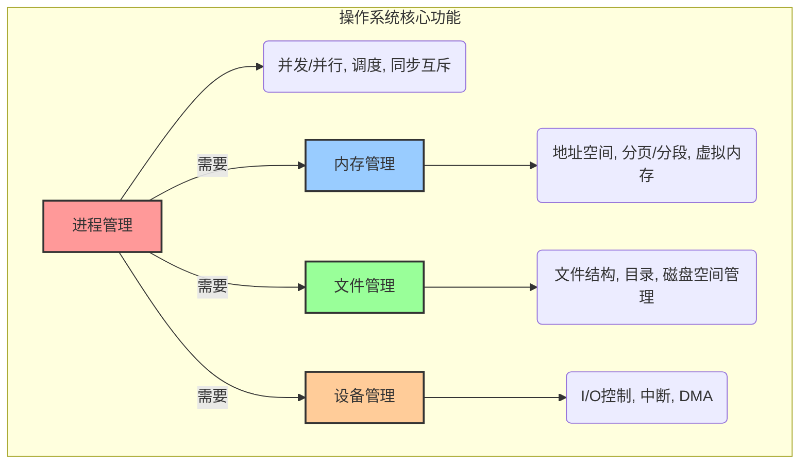
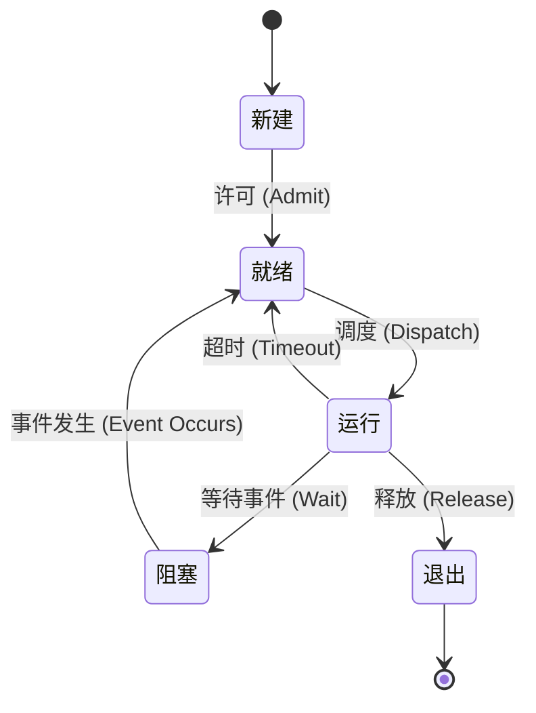
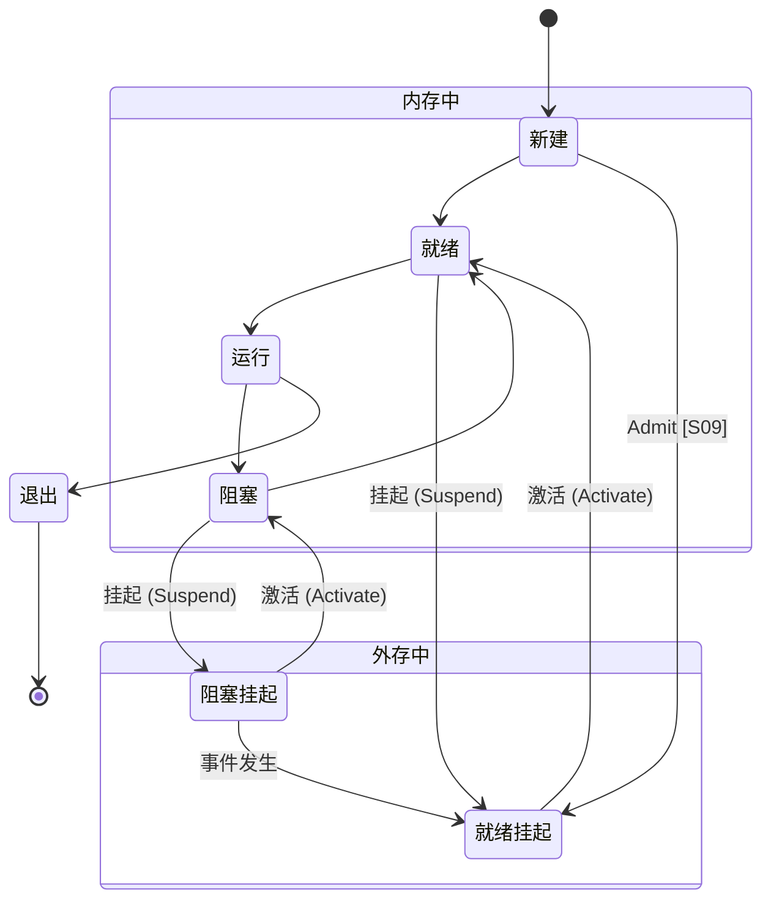
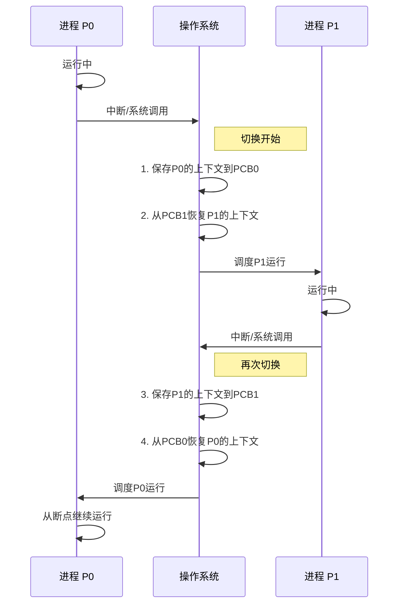
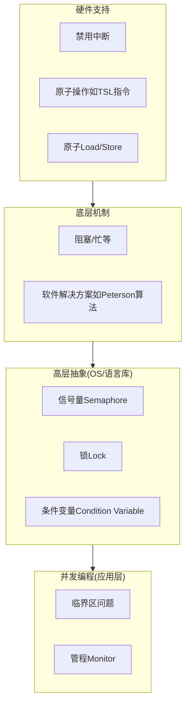
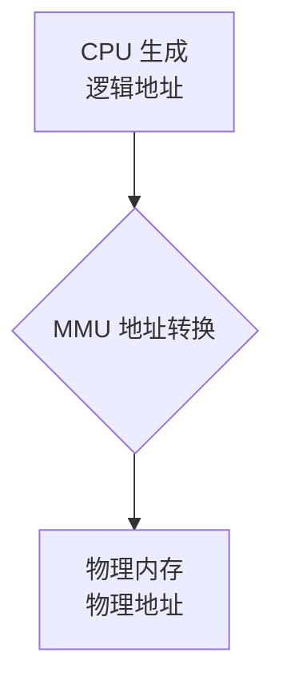
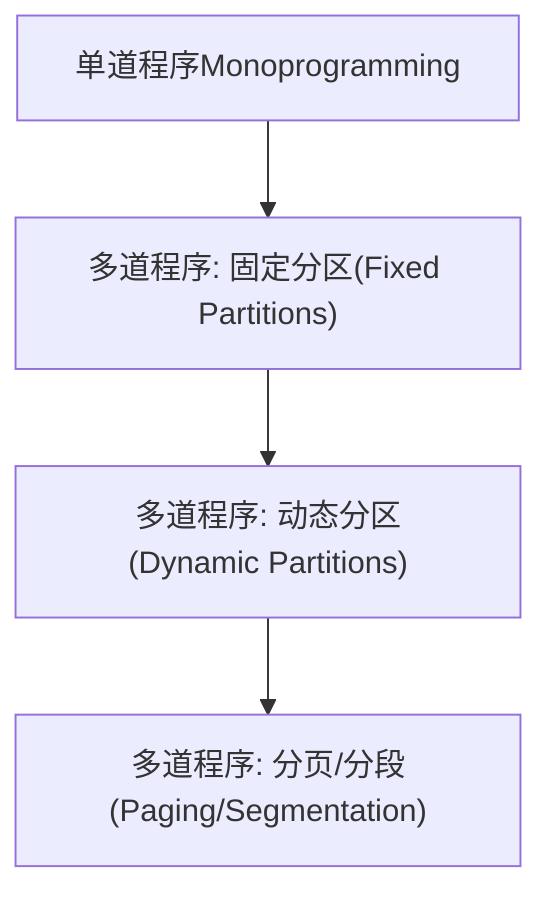
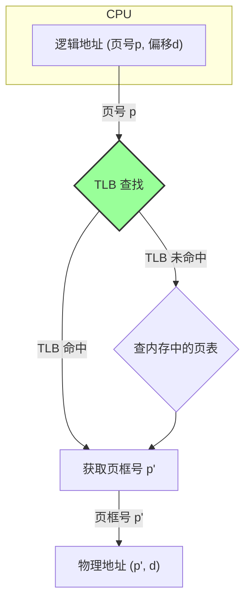

### **学习路线图** `[C01]`

你好呀！为了让你的复习之旅更加清晰，这里有一份为你量身定制的路线图。跟着它，你会发现操作系统的世界其实井井有条：

1.  **第一站：进程与线程的世界 (预计 3 小时)**
    *   我们将认识操作系统中的“劳动者”——进程和线程，理解它们如何“同时”工作（并发与并行），以及操作系统如何管理它们的生老病死（状态迁移）和工作安排（调度）。
2.  **第二站：内存管理的智慧 (预计 2.5 小时)**
    *   探索操作系统如何像一位图书管理员一样，为众多进程分配和管理有限的内存空间。从简单的分区到复杂的虚拟内存、分页、分段，你将掌握内存管理的精髓。
3.  **第三站：文件与设备的交互 (预计 2 小时)**
    *   了解文件是如何在硬盘上被组织和存放的，以及操作系统如何优雅地处理各种输入输出设备，让程序与外部世界顺畅沟通。
4.  **第四站：死锁的困境与化解 (预计 1 小时)**
    *   学习一个非常经典的问题——死锁。我们会分析它发生的原因，并学习如何像侦探一样预防、避免或解决它。
5.  **第五站：融会贯通 (预计 1.5 小时)**
    *   通过一系列精心挑选的练习题，将所有知识点串联起来，进行实战演练，巩固你的理解。

### **核心知识图** `[C01]`

这张图揭示了操作系统最核心的四大管理职能。记住，所有复杂的概念都围绕着这四个中心展开。


`[Fig·C01-1]` **图注**：操作系统就像一个大管家，主要负责管理四样东西：进程、内存、文件和设备。进程管理是核心，它驱动着其他所有管理活动。

---

## **第一章：课程引言与考核说明** `[C02]`

在正式开始学习之前，我们先来了解一下这门课程的考核方式和重点，做到知己知彼，百战不殆。`[S01]` `[S02]` `[S03]`

### **知识卡片：考试题型与分值分布** `[S02]`

* 题型
    - **选择题**：共15题，每题2分，总计30分。考察范围广泛，包括基本概念、知识的综合运用，甚至一些有趣的“脑筋急转弯”。
    - **计算题**：共3题，每题10分，总计30分。需要你利用学过的某个概念或原理（比如进程调度算法、页面置换算法等）进行计算、分析或设计。
    - **系统分析题**：共2题，每题20分，总计40分。这是综合能力题，要求运用理论和实验知识进行综合设计、分析与优化。
- **实务要点 / 工程提示**： `[S02]`
    - **实验很重要**：会有10%-20%的题目与你做过的实验直接相关。所以，一定要认真对待每一个实验！

| 知识模块 | 权重范围 | 复习优先级 |
| :--- | :--- | :--- |
| **进程管理** | **30%-45%** | **最高** |
| **内存管理** | **30%-45%** | **最高** |
| 文件系统 | 10%-15% | 次高 |
| 设备管理 | 10%-15% | 次高 |
| 死锁 | 5%-10% | 中等 |
| 安全 | [Unparsed] | 了解 |


---

## **第二章：进程管理——操作系统的灵魂** `[C03]`

进程管理是操作系统中最核心、最复杂的部分。理解了进程，你就理解了现代计算机“一心多用”的奥秘。

### **2.1 进程模型** `[S04]`

#### **知识卡片：进程（Process）的概念** `[S04]`

- **要解决的问题（直觉）**：我们平时运行的QQ、浏览器、游戏，它们在操作系统眼里究竟是什么？操作系统是如何管理这些同时运行的程序的？
- **类比 / 直觉**：想象一个大厨（CPU）在厨房里做菜。桌上放着一本菜谱（程序代码），但光有菜谱是做不出菜的。当大厨开始照着菜谱的某个步骤（比如“切番茄”）开始备料、切菜时，这个“正在进行中的烹饪活动”就是一个**进程**。菜谱是静态的，而进程是动态的、活动的过程。
- **形式化表述（严格）**：进程是**程序的一次执行过程**，是系统进行资源分配和调度的基本单位。它是一个动态的概念，包括程序代码、数据、以及程序执行的状态信息（如程序计数器、寄存器等）。`[S04]` `[S20]`
- **一句话带走**：程序是菜谱，进程是正在做菜的活动。

#### **知识卡片：并发（Concurrency）与并行（Parallelism）** `[S04]` `[S05]`

- **要解决的问题（直觉）**：我的电脑明明只有一个CPU，为什么能一边听歌、一边聊天、一边写文档，感觉像同时在做好多事？
- **类比 / 直觉**：`[S05]`
    - **并发**：还是那个大厨（单核CPU），他要同时做“番茄炒蛋”和“凉拌黄瓜”两道菜。他会先切几下番茄，然后去拍几下黄瓜，再回来炒几下鸡蛋... 从宏观上看，两道菜都在“同时”推进，但任何一个瞬间，大厨手里只在做一件事。这就是**并发**，指多个任务在**一段时间内**交替执行，看起来像在同时进行。
    - **并行**：现在厨房来了两个大厨（多核CPU），一个专门做番茄炒蛋，另一个专门做凉拌黄瓜。在任何一个瞬间，两道菜都在被真正地同时制作。这就是**并行**，指多个任务在**同一时刻**真正地同时执行。
- **内联小图**：

```
      并行 (Parallelism) - 真实的同时发生
      事件 A: +--------------------------------+
      事件 B: +--------------------------------+
             ----------------------------------> 时间

      并发 (Concurrency) - 逻辑上的同时发生
      事件 A: +------+           +------+              +------+
      事件 B:          +------+             +------+
             ----------------------------------> 时间
```
`[Fig·S05-1]` **图注**：并行是两个任务肩并肩同时跑；并发是两个任务在一条跑道上，通过快速切换，交替着向前跑。
![[Pasted image 20260118155454.png]]
- **关键结论**：`[S05]`
    - 并行一定需要多核处理器。
    - 并发在单核处理器上就能实现。
    - 在多核处理器上，可以同时存在并发（一个核心上跑多个任务）和并行（多个核心同时跑任务）。
- **与相近概念对比**：

| 特性 | 并发 (Concurrency) | 并行 (Parallelism) |
| :--- | :--- | :--- |
| **核心数** | 单核或多核都可以 | 必须多核 |
| **时间点** | 任意**时刻**只有一个任务在执行 | 任意**时刻**可以有多个任务在执行 |
| **时间段** | 一**段时间**内多个任务都有进展 | 一**段时间**内多个任务都有进展 |
| **本质** | 宏观上同时，微观上交替 | 宏观微观都同时 |
`[Fig·S05-2]` **表格注**：区分并发与并行的关键在于“同一时刻”是否有多个任务在执行。

#### **知识卡片：进程引入的四大特性** `[S04]`

- **要解决的问题（直觉）**：引入了“进程”这个概念后，操作系统获得了哪些强大的新能力？
- **形式化表述（严格）**：`[S04]`
    1.  **虚拟性 (Virtualization)**：操作系统为每个进程创造了一种“幻觉”。每个进程都以为自己独占了整台计算机，拥有独立的内存地址空间和设备。比如，进程A和进程B的内存地址都可以从0开始，但操作系统会巧妙地将它们映射到物理内存的不同位置，使它们互不干扰。
    2.  **并发性 (Concurrency)**：正如我们刚刚讨论的，操作系统通过快速地在多个进程间切换CPU的执行权，使得多个进程在宏观上能够“同时”向前推进，极大地提升了系统效率。
    3.  **共享性 (Sharing)**：进程之间并非完全隔离，它们可以有控制地共享系统资源，如内存、文件、设备等。这种共享是“分时复用”的，比如多个进程轮流使用打印机。
    4.  **不确定性 (Indeterminacy) / 异步性**：由于进程的执行是走走停停、断续推进的，我们无法预知一个进程究竟会在哪个精确的时刻被调度执行，也无法预知它的具体执行顺序。这带来了并发编程中的挑战，比如需要处理竞争条件。

### **2.2 进程的实现** `[S06]`

我们已经知道了进程是什么，现在来看看操作系统内部是如何具体实现和管理进程的。

#### **知识卡片：进程状态迁移模型** `[S06]` `[S07]`

- **要解决的问题（直觉）**：一个进程从“出生”到“消亡”，会经历哪些不同的生命阶段？操作系统如何追踪和管理这些阶段的转变？`[S06]`
- **类比 / 直觉**：想象一位病人在医院看病的过程。
    - **新建态 (New)**：病人刚到医院，正在填写挂号单。这个进程刚刚被创建，系统正在为其分配资源。
    - **就绪态 (Ready)**：病人挂完号，坐在候诊区等待叫号。进程已万事俱备（资源都分配好了），只差CPU了。
    - **运行态 (Running)**：病人被叫到号，进入诊室，医生（CPU）正在为他看病。进程正在CPU上执行。
    - **阻塞态/等待态 (Blocked/Waiting)**：医生让病人先去拍个X光片，在拿到片子之前，诊疗无法继续。进程因为等待某个事件（如I/O操作完成、等待用户输入）而主动放弃CPU，暂停执行。
    - **退出态 (Exited)**：病人看完病，离开医院。进程执行完毕或被终止，系统正在回收其资源。
- **内联小图（五状态模型）**：


`[Fig·S07-1]` **图注**：这是经典的进程五状态模型，展示了一个进程生命周期中的各种状态以及转换条件。`[S07]`

![[Pasted image 20260118155636.png]]

- **关键结论解读** `[S07]`
    - **状态管理的目的**：这个模型的核心是为了合理分配和管理CPU资源。`[S07]`
    - **为何阻塞**：进程从运行态到阻塞态，通常是因为它自己发起了某个耗时的操作，比如一个系统调用（`syscall`）去读文件，不得不等待硬盘。`[S07]`
    - **从阻塞到就绪**：当等待的事件完成时（比如硬盘读完了数据），会产生一个**中断**。操作系统响应这个中断，并将对应进程的状态从阻塞态改为就绪态，让它重新排队等待CPU。`[S07]`
    - **回到运行**：当处于就绪态的进程再次被调度器选中，它会从上次中断的地方（例如，`syscall`函数返回之后）继续执行。`[S07]`

#### **知识卡片：挂起（Suspend）状态的引入** `[S08]` `[S09]` `[S59]`

- **要解决的问题（直觉）**：如果候诊区的病人太多（就绪进程太多），把医院的内存都占满了，导致新病人无法挂号怎么办？
- **类比 / 直觉**：医院管理员可以暂时让一些病情不紧急的候诊病人（就绪态进程）或者正在等X光片的病人（阻塞态进程）先到医院外的休息区等待，把候诊区的座位腾出来。这个“被移到院外”的状态，就是**挂起态**。
- **形式化表述（严格）**：当内存资源紧张时，操作系统可以将某些进程暂时从内存中换出到外存（硬盘）上，此时该进程处于挂起状态。挂起状态的引入是为了调节系统负载，解决内存不足的问题。`[S08]` `[S59]` 挂起的过程对用户程序是不可见的。`[S08]`
- **内联小图（七状态模型）**：


`[Fig·S09-1]` **图注**：双挂起进程模型（七状态模型）在五状态模型基础上增加了“就绪挂起”和“阻塞挂起”两个状态，以及相应的挂起和激活操作，核心是为了管理内存资源。`[S09]`

![[Pasted image 20260118155736.png]]

![[Pasted image 20260118155756.png]]

- **一句话带走**：阻塞是进程主动放弃CPU等待事件，挂起是操作系统为了释放内存而被动将进程换出到硬盘。

#### **知识卡片：进程调度算法** `[S06]` `[S10]`

- **要解决的问题（直觉）**：候诊区里那么多等待的病人（就绪队列里的进程），下次应该叫谁去看病（运行）呢？`[S06]` 这就是调度算法要解决的问题。`[S10]`
- **常见的调度算法**：`[S10]`
    1.  **先来先服务 (First-Come, First-Served, FCFS)**：
        *   **直觉**：就像排队买票，谁先来谁先上。
        *   **优点**：公平、简单。
        *   **缺点**：如果一个计算时间很长的进程先到了，后面一堆短进程就得一直等，造成平均等待时间很长。
    2.  **短任务优先 (Shortest Job First, SJF) / 剩余时间短任务优先 (Shortest Remaining Time Next, SRTN)**：
        *   **直觉**：优先处理那些能很快完成的任务。SRTN是其抢占式版本，如果来了一个比当前正在执行的任务剩余时间还短的新任务，会立即切换。
        *   **优点**：理论上平均等待时间最短。
        *   **缺点**：可能导致长任务“饿死”（一直等不到执行）。并且难以预估任务到底有多“短”。
    3.  **时间片轮转 (Round Robin, RR)**：
        *   **直觉**：每个进程轮流执行一个固定的“时间片”（比如10毫秒），时间到了就换下一个，排到队尾等下一轮。
        *   **优点**：公平，响应及时，不会有进程长时间得不到响应。
        *   **缺点**：时间片太短，频繁切换会带来大的开销；时间片太长，就退化成了FCFS。
    4.  **优先级队列 (Priority Queue)**：
        *   **直觉**：给每个进程分配一个优先级，优先级高的先执行。
        *   **优点**：可以满足不同任务的紧急程度需求。
        *   **缺点**：可能导致低优先级任务“饿死”。
- **调度算法的设计原则** `[S10]`
    *   **最优解**：没有绝对的“最优”算法，需要在各种指标间做权衡。
    *   **可获取的参数**：设计算法时，只能利用已知的进程信息（如到达时间、优先级），而不能用未知的（如未来的执行时间）。
    *   **代价**：获取和推断这些参数本身也是有成本的。
- **调度的驱动力** `[S10]`
    *   **进程主动调度**：进程执行完任务或主动让出CPU（如调用`yield()`）。或者进程发起系统调用（如`read()`），操作系统认为需要等待，从而进行调度。
    *   **中断抢占调度**：一个外部事件（如时钟中断、I/O完成中断）发生，打断了当前进程，操作系统借此机会重新进行一次调度决策。
    * 关于调度更详细的介绍：[^2]
    * 关于调度的驱动力可以参考一下lab6的说法：[^1]

#### **知识卡片：调度算法的评价指标** `[S11]`

- **要解决的问题（直觉）**：我们怎么评价一个调度算法是“好”还是“坏”？
- **指标体系** `[S11]`

| 指标名称       | 定义                   | 目标      | 直觉类比（以看病为例）    |
| :--------- | :------------------- | :------ | :------------- |
| **CPU使用率** | CPU处于忙状态的时间百分比       | **最大化** | 医院的诊室尽可能不要空着   |
| **吞吐量**    | 单位时间内完成的进程数量         | **最大化** | 一小时内看完了多少个病人   |
| **周转时间**   | 进程从提交到完成的总时间（=运行+等待） | **最小化** | 从进医院到离开医院的总时长  |
| **等待时间**   | 进程在就绪队列中等待的总时间       | **最小化** | 在候诊区等待的总时长     |
| **响应时间**   | 从提交请求到第一次产生响应的时间     | **最小化** | 从挂号到第一次见到医生的时长 |
`[Fig·S11-1]` **表格注**：这些指标往往是相互矛盾的。例如，为了提高CPU使用率和吞吐量，可能会牺牲某些进程的响应时间。一个好的调度算法是在这些指标间取得平衡。
响应时间和等待时间有什么区别：[^3]

### **2.3 进程切换（上下文切换）** `[S12]` `[S13]` `[S14]`

#### **知识卡片：上下文切换 (Context Switch)** `[S12]`

- **要解决的问题（直觉）**：当操作系统决定让进程A暂停，切换到进程B去执行时，如何确保进程A下次回来时，能从刚才暂停的地方“无缝衔接”地继续执行？
- **类比 / 直觉**：想象你在同时看两本书，一本是《物理》，一本是《历史》。你看《物理》看到第50页第3行，突然想换着看《历史》。你会拿一张书签，夹在《物理》的第50页第3行，记住你刚才的思路，然后才去翻开《历史》。这个“夹书签，记思路”的动作，就类似于**保存上下文**。当你再从《历史》换回《物理》时，你找到书签，就能立刻继续，这叫**恢复上下文**。整个过程就是一次“上下文切换”。
- **形式化表述（严格）**：`[S12]` 上下文切换是指CPU从一个进程或线程切换到另一个进程或线程。这个过程包括：
    1.  **暂停当前运行进程**：将其从“运行”状态变为其他状态（如“就绪”或“阻塞”）。
    2.  **保存当前进程的上下文**：将进程的执行状态（即“上下文”）保存到内存的特定区域（通常是进程控制块PCB）。
    3.  **加载下一个进程的上下文**：从内存中找到下一个要执行进程的PCB，将其保存的上下文加载到CPU的寄存器中。
    4.  **调度另一个进程运行**：将该进程的状态变为“运行”，CPU开始执行新进程的代码。
- **进程的上下文都包括什么？** `[S12]`
    *   **寄存器 (PC, SP, ...)**：程序计数器（PC）记录了下一条要执行的指令地址，栈指针（SP）指向当前栈顶，还有各种通用寄存器。这是“书签”最核心的部分。
    *   **CPU状态**：CPU的各种状态字、模式等。
    *   **内存地址空间**：指向该进程的页表等信息，定义了它的虚拟内存布局。
    *   **进程生命周期的信息**：进程ID、状态、优先级等。

- **内联小图（上下文切换流程）** `[S13]`


`[Fig·S13-1]` **图注**：展示了从进程P0切换到P1，再切换回P0的完整流程。核心操作是操作系统对两个进程上下文（保存在各自的PCB中）的保存和恢复。

- **关键要求**：`[S12]` 进程切换必须**快速**，因为这是一项纯粹的开销，不产生任何有效工作。

![[Pasted image 20260118160603.png]]

图片介绍：[^32]

#### **动手实践：`switch_to` 的实现** `[S15]` `[S16]`

`[S15]` 和 `[S16]` 的代码片段向我们揭示了上下文切换在底层汇编和C代码中是如何实现的。让我们一步步来解析它。

**衍生问题**：`[S15]`
-   地址空间的切换是如何实现的？
-   进程切换的代价有多大？
-   线程切换和进程切换有什么不同？
- 回答：[^31]

我们先来看 `switch.S` 这个汇编文件，它负责最核心的寄存器切换。`[S15]`

```assembly
.text
.globl switch_to
switch_to: # 函数 switch_to(from, to)
    
    # ------------------- 步骤1: 保存旧进程(from)的上下文 -------------------
    # from 的地址在栈上 esp+4 的位置
    movl 4(%esp), %eax      # 将 from 的地址加载到 eax 寄存器
                            # eax 现在是 "from" 进程的 context 结构体指针
    
    # 保存旧进程的寄存器到它的 context 结构体中
    popl 0(%eax)            # 将返回地址 (eip) 从栈中弹出，保存到 context->eip
    movl %esp, 4(%eax)      # 保存栈指针 esp 到 context->esp
    movl %ebx, 8(%eax)      # 保存 ebx
    movl %ecx, 12(%eax)     # 保存 ecx
    movl %edx, 16(%eax)     # ...
    movl %esi, 20(%eax)
    movl %edi, 24(%eax)
    movl %ebp, 28(%eax)
    
    # ------------------- 步骤2: 恢复新进程(to)的上下文 -------------------
    # to 的地址在栈上 esp+8 的位置
    movl 4(%esp), %eax      # 注意，栈指针esp没变，但参数位置变了
                            # (因为popl了一个返回地址，栈顶变了)
                            # 原来的8(%esp)现在是4(%esp)
                            # 将 to 的地址加载到 eax
                            # eax 现在是 "to" 进程的 context 结构体指针
    
    # 从 to 的 context 结构体中恢复寄存器
    movl 28(%eax), %ebp     # 恢复 ebp
    movl 24(%eax), %edi     # 恢复 edi
    movl 20(%eax), %esi     # ...
    movl 16(%eax), %edx
    movl 12(%eax), %ecx
    movl 8(%eax), %ebx
    movl 4(%eax), %esp      # 恢复栈指针 esp, 这一步是关键的“换栈”！
    
    # ------------------- 步骤3: 跳转到新进程的执行点 -------------------
    pushl 0(%eax)           # 将 to 进程的 eip 压入新的栈中
    ret                     # ret指令会把栈顶的值弹出给 eip 寄存器，
                            # 于是CPU就跳转到新进程上次中断的地方开始执行了！
```
`[Fig·S15-1]` **代码注**：`switch_to`函数通过一系列`mov`指令，完成了将CPU所有关键寄存器从`from`进程的内存区域复制走，再从`to`进程的内存区域加载回来的过程。最神奇的一步是恢复`esp`，直接把执行的“舞台”（栈）给换掉了。
栈的切换的解释：[^4]

**现在我们来看C代码 `proc_run` 如何调用 `switch_to`** `[S16]`

```c
// 文件: kern/process/proc.c
void proc_run(struct proc_struct *proc) {
    if (proc != current) { // 如果要运行的进程不是当前进程
        struct proc_struct *prev = current, *next = proc;
        
        // ... (保存中断状态)
        
        current = proc; // 更新全局变量，表示当前运行的是新进程了
        
        // 关键步骤1: 切换地址空间！
        lcr3(next->cr3); // 将新进程的页目录基址寄存器cr3加载到CPU
                         // 从这一刻起，CPU看到的内存就是新进程的内存了
        
        // 关键步骤2: 切换寄存器和执行流！
        switch_to(&(prev->context), &(next->context));
        
        // ... (恢复中断状态)
    }
}
```
`[Fig·S16-1]` **代码注**：`proc_run`在调用`switch_to`**之前**，先用`lcr3`指令切换了页表。这是实现地址空间切换的核心。

**回答衍生问题** `[S15]` `[S16]`
1.  **地址空间的切换是如何实现的?** `[S16]`
    *   通过执行 `lcr3(next->cr3)` 指令实现的。`cr3` 寄存器存放的是当前页表的物理地址。改变 `cr3` 的值，就相当于给CPU换了一本“地址翻译手册”，整个虚拟地址到物理地址的映射关系就都变了，从而切换了地址空间。`[S16]`

2.  **换了地址空间为啥不影响`switch_to`的执行?** `[S16]`
    *   因为内核空间是所有进程共享和统一的。`[S16]` `switch_to` 这段代码位于内核空间（一点解释[^5]），切换前后的虚拟地址是一样的（为什么[^6]），都能映射到同一块物理内存。所以，即使`cr3`变了，执行`switch_to`的指令流并不会受影响。

3.  **TLB中存的是什么？为什么换页表不用管TLB？** `[S1t6]`
    *   TLB（快表）是页表项的一个高速缓存，存的是最近用过的“虚拟页号 -> 物理页框号”的映射关系。`[S16]`
    *   **写入cr3时，硬件会自动让TLB中的旧内容失效**。`[S16]` 因为旧的映射关系在新地址空间里是无效的，必须清空，否则会访问到错误的物理内存。

4.  **进程切换的代价有多大？** `[S17]`
    *   **代价很高**。它不仅包括保存和恢复寄存器的时间，还包括`cr3`切换导致的TLB失效，这会使得切换后的进程最初几次内存访问变慢（因为需要重新查询慢速的主存页表）。
    *   一个实验数据显示，在i7四核处理器上，当线程数从4增加到5时（即从一个核心跑一个线程变为一个核心跑多个线程，开始发生频繁调度），完成任务的时间从约5分钟飙升到8分40秒。`[S17]` 这多出来的时间，很大一部分就是调度的代价。
    *   在鲲鹏服务器上，一次线程调度约耗时1900ns，足够执行上千条机器指令。`[S17]`

5.  **线程呢？** `[S15]`
    *   **线程切换通常比进程切换快得多**。如果是同一进程下的两个线程切换，它们共享同一个地址空间，因此**不需要切换页表（不用改`cr3`），也就不会导致TLB失效**。切换时只需要保存和恢复寄存器上下文即可。这正是线程比进程更“轻量级”的核心原因。
6. **有 cache 吗？Cache 怎么办？**
	*   **是否有 Cache？**
	    是的，现代 CPU 都有多级高速缓存（Cache）。
	*   **Cache 怎么办（如何处理）？**
	    *   **物理地址索引/标记（VIPT/PIPT）：** 现代 x86 CPU 的 Cache 主要是**物理地址标记**（Physically Tagged）的。这意味着 Cache 里的数据是和物理地址绑定的，而不是虚拟地址。
	    *   **无需手动刷新：** 当切换 CR3（切换地址空间）时，虽然虚拟地址到物理地址的映射变了，但物理内存里的数据没变。因为 Cache 是根据物理地址找数据的，所以切换进程时**硬件不需要像刷新 TLB 那样强制清空（Flush）整个 Cache**。
	*   **图片中“丢弃”或“用实地址 cache”的意思：**
	    *   **“丢弃”：** 虽然硬件不强制清空，但从软件角度看，新进程运行后会访问自己的代码和数据，旧进程留在 Cache 里的数据对新进程没用，会逐渐被换出（被覆盖），这会导致新进程刚开始运行时 **Cache Miss（缓存缺失）** 率很高，性能暂时下降。
	    *   **“实地址 cache”：** 指的就是 Cache 最终是靠“物理地址”来定位数据的。这保证了即使虚拟地址空间切换，Cache 内部的数据一致性也不会出错。
	* 以上是小g的解释，但是我看PPT的答案感觉他的意思应该是此时题里用的是虚地址cache：
		* 若是**虚地址索引**的必须手动或硬件**丢弃**（旧时代的做法）。
	    - 若是**实地址索引**的**不用丢弃**，数据依然有效（现代 CPU 的做法）。
	
7. **为什么换了地址空间不需要重新定位变量？**
	**核心原因：因为多个进程之间，内核空间（Kernel Space）的映射是共享和统一的。**
	
	*   **地址空间的布局：**
	    在 ucore 或 Linux 等操作系统中，虚拟地址空间被划分为**用户空间**和**内核空间**。
	    *   每个进程的**用户空间**（低地址部分）是独立的、互不相同的。
	    *   每个进程的**内核空间**（高地址部分，例如 0xC0000000 以上）在所有的页表里都是**一模一样的映射**。
	*   **执行流的一致性：**
	    图中执行 `lcr3(next->cr3)` 时，CPU 正处于内核态，运行的是内核代码。
	    1.  **代码位置相同：** 所有的页表都把相同的物理内存（内核代码段）映射到了相同的虚拟地址。所以切换了页表后，下一条指令（即 `switch_to`）的虚拟地址在新的页表里依然指向相同的物理位置。
	    2.  **变量位置相同：** 内核使用的全局变量（如 `current` 指针）和局部变量（在内核栈上）在所有页表的内核映射区都是一致的。
	*   **总结：**
	    虽然换了 CR3（切换了整个页表），但因为 **“变的是用户态，不变的是内核态”**，正在运行的内核代码感觉不到地址空间发生了剧变。就像在不同的房子里（进程），天花板（内核空间）的设计和位置都是一模一样的，只要你抬头看天，在哪间屋子都一样。
	
	**补充：**
	如果内核空间不是统一映射的，那么在 `lcr3` 指令执行完的瞬间，PC 指针（指令寄存器）指向的下一条指令就会变成“非法地址”或指向完全错误的代码，系统会立即崩溃。这也是为什么操作系统的页表初始化时，必须把内核部分的页表项复制给每一个进程。

为什么这里前面说线程数增加耗时大，后面又说线程切换快很多，线程和进程有什么区别，他俩的切换又有什么区别：[^7]

线程切换和进程切换会写两套函数吗：[^8]

---

### **2.4 进程间通信（Inter-Process Communication, IPC）** `[S18]`

#### **知识卡片：进程间通信 (IPC)** `[S18]`

-   **要解决的问题（直觉）**：想象一下，操作系统中的每个进程都是一座座独立的“信息孤岛”。如果它们需要协同完成一项任务（比如，一个进程负责从网上下载数据，另一个进程负责分析这些数据），就必须在岛屿之间建立桥梁或航线。IPC就是操作系统提供的这些“桥梁”和“航线”。
-   **类比 / 直觉**：进程间通信就像人与人之间的交流方式。
    -   **打电话（信号）**：快速发送一个简单的通知，比如“快接电话！”。信息量少，但能立刻打断对方。
    -   **寄信（管道/消息队列）**：通过邮局（内核）传递一封信。信的内容可以更丰富，但有固定的格式和大小限制。
    -   **面对面交谈/共享白板（共享内存）**：两人共享一块白板，可以直接在上面读写信息。速度最快，但需要双方协调好谁写谁读，别写乱了。
-   **形式化表述（严格）**：IPC是操作系统提供的一系列机制，用于在不同进程之间传递数据和信号，实现进程的协同工作。常见的IPC机制包括：`[S18]`

| IPC 机制                   | 关键特性                     | 优点                      | 缺点                      |
| :----------------------- | :----------------------- | :---------------------- | :---------------------- |
| **信号 (Signal)**          | 异步通知机制，类似“软件中断”          | 简单，开销小                  | 传递的信息量极少，只有一个信号编号       |
| **管道 (Pipe)**            | 半双工（单向）的字节流通道，有亲缘关系进程间使用 | 简单易用，符合流式读写习惯           | 只能单向通信，通常只能用于父子进程间      |
| **消息队列 (Message Queue)** | 消息的链表，存储在内核中，按类型标识       | 解除了发送方和接收方的时间耦合         | 消息大小和队列总大小有限制           |
| **共享内存 (Shared Memory)** | 多个进程共享同一块物理内存区域          | **速度最快**，数据无需在内核和用户空间拷贝 | 需要额外的同步机制（如信号量）来保证数据一致性 |
`[Fig·S18-1]` **表格注**：选择哪种IPC方式取决于通信需求。对于简单通知用信号，对于流式数据用管道，对于结构化消息用消息队列，对于需要高速、大量数据交换的场景，共享内存是最佳选择。

具体介绍：[^9]

### **2.5 线程——更轻快的执行者** `[S19]` `[S20]` `[S21]` `[S22]`

我们之前讨论过，进程切换的代价很高，尤其是地址空间的切换。那么，有没有一种“更轻量级”的方式，让一个任务内部的多个子任务能够并发执行，而又不必承受那么大的切换开销呢？答案就是线程。

#### **知识卡片：线程（Thread）的概念** `[S20]`

-   **要解决的问题（直觉）**：在一个复杂的程序里（比如一个视频播放器），需要同时做很多事：解码视频、渲染画面、播放音频、响应用户暂停/快进的点击。如果为每件事都创建一个独立的进程，开销太大且资源共享复杂。如何在一个进程内部实现这种并发？
-    **类比 / 直觉**：一个**进程**就像一个设备齐全的**大厨房**。厨房里有炉灶、锅碗瓢盆、食材等所有资源（地址空间、文件句柄等）。而**线程**就像厨房里的**厨师**。
    -   **资源共享**：所有厨师共享厨房里的所有资源。
    -   **独立工作**：每个厨师可以独立地执行一个任务（炒菜、切菜、洗碗）。每个厨师有自己的大脑（程序计数器 PC）、双手（寄存器）和一小块临时的操作台（栈 Stack）。
    -   **轻量切换**：让切菜的厨师和炒菜的厨师换一下工作，非常简单，他们只需交换位置即可，不需要重新建一个厨房。这比让两个来自不同厨房的厨师换工作要快得多。
-   **形式化表述（严格）**：`[S20]` 线程是进程内的一个执行单元，是**CPU调度的基本单位**。一个进程可以包含多个线程，它们共享进程的地址空间和资源，但每个线程拥有自己独立的程序计数器、栈和一组寄存器。因此，线程也被称为“轻量级进程”。
    -   **进程的角色**：资源分配的基本单位。
    -   **线程的角色**：处理机（CPU）调度的基本单位。
-   **内联小图（进程与线程的关系）**：`[S20]`

```
+------------------------------------------+
| 进程地址空间                             |
| +--------------------------------------+ |
| | 代码段 (Code)                        | |  <-- 所有线程共享
| +--------------------------------------+ |
| | 数据段 (Data) / 堆 (Heap)            | |  <-- 所有线程共享
| +--------------------------------------+ |
| | 打开的文件、信号等                     | |  <-- 所有线程共享
| +--------------------------------------+ |
|                                          |
| +-----------+  +-----------+  +-----------+
| | 线程1栈   |  | 线程2栈   |  | ...       |  <-- 每个线程独有
| +-----------+  +-----------+  +-----------+
|                                          |
+------------------------------------------+

+---------+        +---------+
| TCB1    |        | TCB2    |
| PC, SP  |        | PC, SP  |  <-- 每个线程独有的执行上下文
| 寄存器  |        | 寄存器  |
+---------+        +---------+
```
`[Fig·S20-1]` **图注**：一个进程的内存空间中，代码、数据等是所有线程共享的，而每个线程有自己独立的栈和线程控制块（TCB），用来保存自己的执行状态。

#### **知识卡片：线程的实现模型** `[S19]` `[S21]` `[S22]`

-   **要解决的问题（直觉）**：这些“厨师”（线程）是由厨房内部的“厨师长”（用户程序库）来管理，还是由更高层级的“餐厅总经理”（操作系统内核）来管理呢？`[S21]`
-   **两大主流模型**：用户态线程（User-Level Threads, ULT） vs 内核态线程（Kernel-Level Threads, KLT）。

1.  **用户态线程 (ULT)** `[S22]`
    *   **直觉**：线程的管理（创建、销毁、调度）完全在用户空间通过一个线程库来完成，操作系统内核对此一无所知，它只看到了一个进程。就像厨师长自己安排厨房里厨师们的工作，餐厅总经理根本不知道厨房里有几个厨师。
    *   **内联小图**：`[S21]`
        ```
           用户空间 (User Space)
        +----------------------------+
        | Process                    |
        |  +--Thread--+ +--Thread--+ |
        |  | {~~~~~} | | {~~~~~} | |
        |  +----------+ +----------+ |
        |  | 线程运行时库 (调度)    | |
        +----------------------------+
           --------------------------
           内核空间 (Kernel Space)
        +----------------------------+
        | Kernel                     |  <-- 内核只看到一个进程
        | +------------------------+ |
        | | Process Table Entry    | |
        +----------------------------+
        ```
        `[Fig·S21-1]` **图注**：在ULT模型中，多个线程存在于一个进程内，内核只管理进程，不管理线程。

2.  **内核态线程 (KLT)** `[S22]`
    *   **直觉**：线程的管理完全由操作系统内核负责。餐厅总经理直接管理每一个厨师，知道谁在忙、谁在等。
    *   **内联小图**：`[S21]`
        ```
           用户空间 (User Space)
        +----------------------------+
        | Process                    |
        |  +--Thread--+ +--Thread--+ |
        |  | {~~~~~} | | {~~~~~} | |
        +----------------------------+
           --------------------------
           内核空间 (Kernel Space)
        +----------------------------+
        | Kernel                     |  <-- 内核能看到并管理每个线程
        | +------------+ +---------+ |
        | |Process Tbl | |Thread Tbl| |
        +----------------------------+
        ```
        `[Fig·S21-2]` **图注**：在KLT模型中，内核拥有独立的线程表来管理系统中的所有线程。

-   **对比与总结**：`[S22]`

| 对比项 | 用户态线程 (ULT) | 内核态线程 (KLT) |
| :--- | :--- | :--- |
| **管理方** | 用户空间的线程库 | 操作系统内核 |
| **切换速度** | **快** (无需陷入内核) | **慢** (需要系统调用，模式转换) |
| **阻塞影响** | 一个线程阻塞，**整个进程阻塞** | 一个线程阻塞，**不影响其他线程** |
| **多核利用** | **无法**利用多核并行 | **可以**利用多核并行 |
| **系统依赖** | 不依赖特定OS | 依赖OS提供支持 |
`[Fig·S22-1]` **表格注**：ULT的优势是快，劣势是阻塞问题和无法利用多核；KLT正好相反，解决了ULT的劣势，但切换开销更大。现代操作系统大多采用KLT模型。

-   **易错点与比较**：`[S22]`
    *   **为什么KLT切换需要转换到内核模式？** 因为线程的调度是由内核代码执行的，而用户程序无法直接执行内核代码。必须通过系统调用（一种受控的“中断”）从用户态陷入（trap）到内核态，执行完调度代码后再返回用户态。这个模式切换过程涉及保存和恢复现场，比纯用户态的函数调用要慢得多。

3.  **组合式 (Hybrid)** `[S19]`
    *   这种模型试图结合ULT和KLT的优点。它将多个用户态线程映射到少量内核态线程上。这是一种折衷方案，但实现复杂，现在已不常用。

详细介绍一下这个组合式，以及用户式线程还和之前说的一样是和进程切换共享一个函数吗：[^10]

### **2.6 进程管理中的新概念** `[S23]`

随着对性能的极致追求，比线程更轻量的并发概念也应运而生。

#### **知识卡片：纤程 (Fiber) 与 协程 (Coroutine)** `[S23]`

-   **要解决的问题（直觉）**：即便是ULT，线程库的调度器也可能在你代码执行到一半时，因为时间片到了而强行切换，这叫“抢占式”调度。如果我们想要一种完全由程序员自己控制切换时机的、非抢占式的并发方式，该怎么办？
-   **类比 / 直觉**：协程就像两个非常有礼貌的工匠在同一个工作台工作。工匠A做到一个阶段性成果后，会主动把工具交给工匠B，并告诉他：“我这部分弄好了，接下来看你的了”。工匠B接手后继续工作，直到他完成自己的部分，再主动交还给A。整个过程没有一个外部的“工头”来强制他们换班，切换完全是**协作式**的。
-   **形式化表述（严格）**：`[S23]` 协程是用户态的、协作式调度的执行单元。它的核心特点是：
    *   **发挥ULT快速切换的优势**：切换开销极小，因为完全在用户态进行。
    *   **避免无序的争抢**：切换点由程序员在代码中显式指定（如 `yield`），因此不会在关键操作执行到一半时被打断，极大地简化了并发编程，减少了对锁的需求。
    *   **对程序员的要求**：程序员必须精心设计代码，确保协程不会长时间“霸占”CPU，并在合适的时机主动让出执行权。
-   **实务要点 / 工程提示**：`[S23]`
    *   `ucontext` 是在一些类Unix系统中提供的一套用于实现用户级上下文切换的API，是构建协程库的底层工具之一。
    *   **性能提升**：如 `[S23]` 所示，华为鲲鹏服务器的实验数据显示，通过用户级上下文切换（类似协程），可以将调度延迟从内核线程的2500ns级别降低到900ns级别，性能提升近60%。这在需要处理海量并发连接的高性能网络服务中非常关键。

什么是纤程：[^11]

---

### **快速复习卡 (新增内容)**

*   **进程间通信(IPC)**：是进程协作的桥梁。包括信号（通知）、管道（流）、消息队列（消息）、共享内存（高速数据交换）。`[S18]`
*   **线程**：是CPU调度的基本单位，是轻量级进程。共享进程资源，但有独立的栈和寄存器。`[S20]`
*   **进程 vs. 线程**：进程是**资源分配**单位，线程是**调度**单位。线程切换比进程切换快得多，因为通常**不涉及地址空间切换**。
*   **用户态线程(ULT)**：快，但一个阻塞全阻塞，且无法利用多核。`[S22]`
*   **内核态线程(KLT)**：慢，但阻塞不影响他人，且能利用多核。现代OS主流。`[S22]`
*   **协程/纤程**：用户态的、**协作式**调度。切换时机由程序员控制，开销极小，能有效避免数据竞争。`[S23]`

---

### **2.7 并发与同步（进程间通信 vs 线程间并发）** `[S24]`

当多个“厨师”（线程）在同一个“厨房”（进程）里忙碌时，问题就来了。如果两个厨师同时去拿最后一个鸡蛋，会发生什么？如果一道菜必须等另一道菜的汤汁做好才能下锅，它们如何协调？这就是同步要解决的核心问题。

#### **知识卡片：竞争条件 (Race Condition) 与 临界区 (Critical Section)** `[S24]`

-   **要解决的问题（直觉）**：当多个执行流（线程/进程）同时读写同一个共享资源（如变量、文件）时，最终的结果会因它们执行的相对速度和时序而变得不可预测，甚至错误。这种情况就是“竞争条件”。
-   **类比 / 直觉**：假设你和你朋友共用一个银行账户，余额1000元。你俩同时在两台ATM机上取款100元。
    1.  你的ATM机读取余额：1000元。
    2.  **（此时发生切换！）** 你朋友的ATM机也读取余额：1000元。
    3.  你朋友的机器计算新余额：1000 - 100 = 900元，并写入账户。
    4.  **（切换回来！）** 你的ATM机计算新余额：1000 - 100 = 900元，并写入账户。
    最终结果：你们俩都取了100元，但账户余额却是900元，而不是应有的800元！银行亏了100元。这就是竞争条件导致的错误。
-   **形式化表述（严格）**：`[S24]`
    *   **竞争条件**：两个或多个进程/线程的输出结果，取决于它们执行的精确时间顺序。
    *   **临界区**：每个并发程序中**访问共享资源**的那段代码。在上面的例子中，“读取余额 -> 计算新余额 -> 写入新余额”这一系列操作就构成了一个临界区。
-   **一句话带走**：必须确保在任何时刻，最多只有一个执行流能进入临界区，这就是**互斥（Mutual Exclusion）**。

#### **知识卡片：同步问题的解决思路** `[S24]` `[S25]`

-   **要解决的问题（直觉）**：如何为我们的“临界区”代码加上一把锁，保证每次只有一个人能进去操作？
-   **一个层层递进的方案图**：`[S25]` 解决同步问题，就像建造一座大厦，需要从坚实的地基开始。


`[Fig·S25-1]` **图注**：同步方法的实现层次。硬件提供了最基本的原子性保证，操作系统和语言库在此之上封装出更易用的工具（如信号量、锁），最终让应用程序员可以方便地解决临界区等并发问题。

![[Pasted image 20260117173801.png]]

-   **几种方案的简要评述** `[S24]`
    *   **基于高级语言的“取巧”设计**：比如用一个`turn`变量来决定谁执行。这些方案通常在单步执行时看起来没问题，但无法保证操作的**原子性**，在并发环境下几乎都是错误的。
    *   **关中断**：在单核CPU上，进入临界区前关闭所有中断，出临界区后再开启。这样可以保证临界区代码不会被切换出去，从而实现互斥。**但这是个非常危险且不推荐的方法**。
        *   **为什么不安全？** `[S24]` 如果用户程序可以随意关中断，它可能就再也不打开了，整个系统都会瘫痪。而且，在多核CPU上，关掉一个核的中断，并不能阻止另一个核进入临界区。所以此法基本被废弃。
    *   **硬件原子指令（原语）**：CPU提供的一些特殊指令，如`TSL`（Test-and-Set Lock），可以**在一个不可分割的指令周期内**完成“读取一个内存值并写入一个新值”的操作。这是构建所有高级同步工具（如锁、信号量）的基石。

#### **知识卡片：信号量 (Semaphore)** `[S24]` `[S26]` `[S27]`

信号量是荷兰计算机科学家 Dijkstra 发明的一种强大的同步工具。

-   **要解决的问题（直觉）**：提供一个简单、通用的机制，既能解决互斥问题，也能解决更复杂的同步问题（如等待某个条件达成）。
-   **类比 / 直觉**：想象一个自习室门口挂着一个牌子，上面写着“剩余座位数”，初始为 N。
    *   `P` **操作（申请资源）**：想进去自习的人（进程/线程）先看牌子。如果数字大于0，就把数字减1，然后进去。如果数字等于0，就必须在门口排队等着（阻塞）。
    *   `V` **操作（释放资源）**：从自习室出来的人，把牌子上的数字加1。如果门口有人在排队，就通知排在最前面的那个人可以进去了。
    `P`和`V`操作本身必须是**原子**的。
-   **形式化表述（严格）**：信号量是一个整数变量 `S`，只能通过两个原子操作来访问：
    *   `P(S)`（荷兰语 Proberen, 尝试）:
        ```
        while (S <= 0) { wait; } // 如果S为0或负，则等待
        S = S - 1;
        ```
    *   `V(S)`（荷兰语 Verhogen, 增加）:
        ```
        S = S + 1;
        // 如果有进程在等待S，唤醒一个
        ```
-   **用信号量实现互斥** `[S26]`
    *   **方法**：为每个临界区设置一个信号量 `mutex`（mutual exclusion 的缩写），并将其**初始值设为1**。
    *   **示例伪代码**：
        ```c
        // 初始化
        Semaphore mutex = new Semaphore(1);
        
        // 临界区代码
        mutex->P();         // 进入临界区前，"加锁"
        // ...
        // 访问共享资源的代码
        // ...
        Critical Section;
        mutex->V();         // 退出临界区后，"解锁"
        ```
        `[Fig·S26-1]` **代码注**：`P()`和`V()`操作必须成对出现，顺序不能错，不能重复或遗漏。`P()`保证了只有一个线程能通过，`V()`则在用完后释放资源，让其他等待者有机会进入。`[S26]`

-   **用信号量实现条件同步** `[S27]`
    *   **方法**：为一个特定的同步条件设置一个信号量 `condition`，并将其**初始值设为0**。
    *   **场景**：线程A需要等待线程B完成某项任务X之后，才能继续执行任务N。
    *   **示例伪代码**：
        ```c
        // 初始化
        Semaphore condition = new Semaphore(0);
        
        // --- 线程A ---
        ...
        M; // 任务M
        condition->P(); // 在这里等待，因为初始值为0，必然阻塞
        N; // 任务N，只有在B执行V操作后才能执行
        ...
        
        // --- 线程B ---
        ...
        X; // 任务X
        condition->V(); // 任务X完成后，通知A可以继续了
        Y; // 任务Y
        ...
        ```
        `[Fig·S27-1]` **代码注**：初始值为0的信号量就像一个“门闩”。线程A执行到`P()`时被拦住。线程B完成任务后执行`V()`，将信号量值变为1，相当于“打开门闩”，让等待的线程A得以通过。

信号量和之前说到的“turn”的区别：[^12]
信号量是因为使用了函数才保证了原子性吗：[^13]

#### **动手实践：十字路口交通问题** `[S28]` `[S29]` `[S30]` `[S31]`

这是一个经典的用信号量解决同步与死锁问题的例子。
![[Pasted image 20260117180412.png]]

-   **问题描述** `[S28]`：一个十字路口，中心有四个区域（如下图的R,Y,B,G）。车辆从四个方向驶来，如何设计信号量，保证：
    1.  通行时不会发生事故（互斥）。
    2.  不会出现一方车辆长时间等待（公平性/无饥饿）。
    3.  不会所有车都卡在路口动弹不得（无死锁）。
好的，既然逻辑已经校正，我们结合这幅图的色块分布（左上R、右上Y、左下B、右下G）以及**靠右行驶**的规则，重新完整、详细地梳理一遍这道题的解题思路。

---

### 一、 问题建模：把地图变成代码

首先，我们需要把图上的路口转化为操作系统中的资源模型。

1.  **资源划分**：
    路口中心被切分为4个小方块，每个方块都是一个独立的临界资源。
    *   **R** (Red, 红) - 左上
    *   **Y** (Yellow, 黄) - 右上
    *   **B** (Blue, 蓝) - 左下
    *   **G** (Green, 绿) - 右下

![[Pasted image 20260117182000.png]]

2.  **信号量定义**：
    为了防止两辆车撞在同一个格子上，我们定义4个互斥信号量，初值都为 **1**。
    ```c
    semaphore R = 1, Y = 1, B = 1, G = 1;
    ```

---

### 二、 车辆行驶逻辑（死锁的伏笔）

根据图示和“靠右行驶”的规则，4个方向的车流路径如下（这里是关键，逻辑必须严丝合缝）：

1.  **车1（左 -> 右）**：
    *   走下半车道。
    *   路径：先踩 **B** (左下)，再踩 **G** (右下)。
    *   **代码**：`P(B); P(G); ... V(G); V(B);`为啥是这个顺序：[^14]

2.  **车2（下 -> 上）**：
    *   走右半车道。
    *   路径：先踩 **G** (右下)，再踩 **Y** (右上)。
    *   **代码**：`P(G); P(Y); ... V(Y); V(G);`

3.  **车3（右 -> 左）**：
    *   走上半车道。
    *   路径：先踩 **Y** (右上)，再踩 **R** (左上)。
    *   **代码**：`P(Y); P(R); ... V(R); V(Y);`

4.  **车4（上 -> 下）**：
    *   走左半车道。
    *   路径：先踩 **R** (左上)，再踩 **B** (左下)。
    *   **代码**：`P(R); P(B); ... V(B); V(R);`

---

### 三、 死锁场景复现（最坏情况）

如果路口没有红绿灯，也没有额外的管理，4辆车同时到达路口边界，会发生什么？

1.  **第一阶段：同时抢占第一块地**
    *   车1 执行 `P(B)` -> 成功拿到 **B**。
    *   车2 执行 `P(G)` -> 成功拿到 **G**。
    *   车3 执行 `P(Y)` -> 成功拿到 **Y**。
    *   车4 执行 `P(R)` -> 成功拿到 **R**。
    *   **此时路口状态**：4块地砖全部被占满，每辆车各占一块，互不相让。

2.  **第二阶段：同时请求下一块地**
    *   **车1** 想往前走，请求 `P(G)` -> 失败！(G被车2占着) -> **车1阻塞**。
    *   **车2** 想往前走，请求 `P(Y)` -> 失败！(Y被车3占着) -> **车2阻塞**。
    *   **车3** 想往前走，请求 `P(R)` -> 失败！(R被车4占着) -> **车3阻塞**。
    *   **车4** 想往前走，请求 `P(B)` -> 失败！(B被车1占着) -> **车4阻塞**。

3.  **结论**：
    形成了 **车1等车2，车2等车3，车3等车4，车4等车1** 的环路等待。这就是典型的**死锁（Deadlock）**。

---

### 四、 解决方案：引入“看门人”

为了打破这个环路，我们采用**限制并发数**的策略。只要不让4辆车同时卡在路口里，死锁就解了。

**1. 改进设计**
引入一个新的信号量 `gate`，相当于在路口放了一个“看门人”或者“计数器”。
*   **初值设为 3**（关键点）：意思是最多允许 **3辆车** 同时进入这个十字路口的区域。

**2. 改进后的通用代码结构**
```c
// 任何一辆车要过路口，逻辑如下：

P(gate);  // 【进门卡】先申请进入路口的名额。如果路口里已经有3辆车，第4辆必须在外面等。

    // ...这里执行原来的抢地砖逻辑...
    // 例如车1：
    P(B);
    P(G);
    // 通过路口
    V(G);
    V(B);

V(gate);  // 【出门卡】离开路口，归还名额，让外面排队的车进来。
```

**3. 为什么这样能解决死锁？（逻辑推演）**
我们再次假设最坏的情况：4辆车同时来了。

*   **步骤1**：前3辆车（比如车1、车2、车3）手快，执行了 `P(gate)`，把名额减到了0。它们成功进入路口，分别占据了 B、G、Y。
*   **步骤2**：**第4辆车（车4）** 到达，执行 `P(gate)`。因为此时 `gate` 是0，**车4被拦在了路口外面**，它甚至连第一块地砖 `R` 都摸不到。
*   **步骤3**：此时路口内的情况是：
    *   资源被占：B、G、Y。
    *   **资源空闲：R** (因为车4没进来，没人抢R)。
    *   谁需要 R？-> **车3** (它占了Y，下一步要R)。
*   **步骤4**：
    *   车3 请求 `P(R)` -> **成功！** (因为R是空的)。
    *   车3 顺利通过路口，执行 `V(R)` 和 `V(Y)`，并执行 `V(gate)`。
*   **步骤5**：
    *   车3释放了资源，车2就可以拿到Y走人...
    *   车3释放了 `gate`，在外面排队的车4终于可以进来了。

如何设计，可以使得不出现一方堵塞时间过长的情况？：[^15]

-   **另一个解题思路：参考哲学家就餐** `[S31]`
    *   **类比**：这个问题本质上和“哲学家就餐”非常相似。每辆车就像一个哲学家，需要的两块路面资源就像哲学家需要的两根筷子。这是什么：[^16]
    *   **解决方案**：可以借鉴哲学家就餐问题的解法。例如：
        1.  **破坏循环等待条件**：给所有路面资源（B,G,Y,R）进行编号，要求所有车辆必须按编号从小到大的顺序申请资源。
        2.  **破坏占有并等待条件**：要求车辆必须一次性获得它需要的所有路面资源，如果不能同时获得，就一个都不占，主动放弃并稍后重试。

#### **动手实践：分析一段并发代码** `[S32]`

-   **题目**：
    *   共享全局变量：`Complex x, y, z;`
    *   三个线程分别执行 `Threadfunc1`, `Threadfunc2`, `Threadfunc3`。
    *   (1) 什么是互斥？哪些操作需要互斥？
    *   (2) 用PV操作保证正确性，并减少不必要的等待。
![[Pasted image 20260117194235.png]]
-   **解答**：
    1.  **互斥与临界区**：
        *   **互斥**是指当一个线程在访问某个共享资源时，其他线程不能访问该资源，必须等待。
        *   在这段代码中，全局变量 `x, y, z` 是共享资源。所有对 `x, y, z` 进行读或写的操作都需要互斥。具体来说：
            *   `Threadfunc1` 中的 `w=add(x,y)` 读取了 `x` 和 `y`。
            *   `Threadfunc2` 中的 `n=add(y,z)` 读取了 `y` 和 `z`。
            *   `Threadfunc3` 中的 `z=add(z,w)` 读写了 `z`，`y=add(y,w)` 读写了 `y`，`w=add(x,z)` 读取了 `x` 和 `z`。
        （注意：`w` 和 `n` 都是线程内的局部变量，它们本身不是共享资源，不需要互斥保护）。

    2.  **添加PV操作**：
        *   **目标**：为了最大化并发（减少等待），我们应该使用更细粒度的锁，即为每个共享变量设立一个单独的信号量。
        *   **定义信号量**：
            ```c
            Semaphore mutex_x = new Semaphore(1);
            Semaphore mutex_y = new Semaphore(1);
            Semaphore mutex_z = new Semaphore(1);
            ```
        *   **修改代码（核心：为防止死锁，必须按固定顺序申请锁，例如 x -> y -> z）**：
            ```c
            // --- Threadfunc1 ---
            Threadfunc1 {
                Complex w;
                P(mutex_x); // 按序加锁 x
                P(mutex_y); // 再加锁 y
                w = add(x, y);
                V(mutex_y); // 按加锁的反序解锁
                V(mutex_x);
                ...
            }
            
            // --- Threadfunc2 ---
            Threadfunc2 {
                Complex n;
                P(mutex_y); // 按序加锁 y
                P(mutex_z); // 再加锁 z
                n = add(y, z);
                V(mutex_z);
                V(mutex_y);
                ...
            }
            
            // --- Threadfunc3 ---
            Threadfunc3 {
                Complex w;
                ...
                // 操作 z=add(z,w)
                P(mutex_z);
                z = add(z, w); // 假设w是此线程前面算好的局部值
                V(mutex_z);
                
                // 操作 y=add(y,w)
                P(mutex_y);
                y = add(y, w); // 假设w是此线程前面算好的局部值
                V(mutex_y);
                
                // 操作 w=add(x,z)
                P(mutex_x); // 按序加锁 x
                P(mutex_z); // 再加锁 z
                w = add(x, z);
                V(mutex_z);
                V(mutex_x);
                ...
            }
            ```


---

### **2.8 多核并发的新挑战：指令乱序** `[S33]`

#### **知识卡片：指令乱序执行 (Instruction Reordering) 与 内存屏障 (Memory Barrier)** `[S33]`

-   **要解决的问题（直觉）**：我写的代码明明是先 `a=1`，再 `flag=true`，为什么在别的CPU核上看起来，好像是 `flag=true` 先发生了？
-   **类比 / 直觉**：想象一位极其高效的办公室文员（CPU）。他拿到一个任务清单（你的代码）：
    1.  复印文件A (耗时)
    2.  发一封邮件 (很快)
    3.  复印文件B (耗时)
    为了提高效率，他可能会调整工作顺序：先把邮件发了，然后把文件A和B一起拿到复印机那里去复印。从他**自己的角度**看，只要最后所有任务都完成了，这个调整就是个聪明的优化。
    但问题是，隔壁办公室的另一位同事（另一个CPU核）正在等他复印完文件A的信号（比如邮件）。由于文员调整了顺序，同事提前收到了邮件，以为文件A已经复印好了，结果跑过去一看，文件根本不在！这就是**指令乱序**在多核环境下引发的问题。
-   **形式化表述（严格）**：`[S33]` 为了提升性能，现代处理器（CPU）和编译器都可能对指令进行重排序（乱序执行）。这种重排在单个核心上运行时，会保证其结果与代码顺序执行的结果一致，不会出问题。但在**多核SMP（对称多处理）架构**下，一个核心的指令乱序对于正在观察共享内存的另一个核心来说是可见的，这会破坏程序员对内存操作顺序的预期，从而导致并发错误。

-   **示例（来自 `[S33]` 的致命乱序）**：
    *   **场景**：CPU0负责准备数据并设置一个标志位`flag`，CPU1则等待`flag`变为`true`后使用这些数据。
    *   **代码**：
        ```c
        // 初始状态: a=0, b=0, c=0, flag=false
        
        // --- CPU0 ---               // --- CPU1 ---
        a = 1;                        while (true) {
        b = 2;                            if (flag) {
        c = 3;                                do_something(a, b, c);
        flag = true;                          break;
                                          }
                                      }
        ```
    *   **两种执行时序对比**：

| 理想的顺序执行 (符合预期) `[S33]` | 乱序执行 (导致Bug) `[S33]` |
| :--- | :--- |
| **CPU0**: `a = 1;` | **CPU0**: `a = 1;` |
| **CPU0**: `b = 2;` | **CPU0**: `b = 2;` |
| **CPU0**: `c = 3;` | **CPU0**: `flag = true;`  **(指令被提前!)** |
| **CPU0**: `flag = true;` | **CPU1**: 读到 `flag == true`，跳出循环 |
| **CPU1**: 读到 `flag == true` | **CPU1**: 执行 `do_something(1, 2, 0)` **(错误! c还是0)** |
| **CPU1**: 执行 `do_something(1, 2, 3)` | **CPU0**: `c = 3;` (执行得太晚了) |
`[Fig·S33-1]` **表格注**：在乱序执行的情况下，`flag = true` 这条指令被CPU0提前执行了。CPU1看到 `flag` 为 `true` 时，`c` 的赋值操作还没来得及发生，导致 `do_something` 函数使用了脏数据。

这是一篇关于**内存屏障（Memory Barrier / Fence）** 的深度解析。为了让你透彻理解，我们将从“为什么需要它”、“它到底分几种”以及“经典失效案例”三个维度展开。

---

### 1. 核心背景：为什么 CPU 会“欺骗”我们？

在单核时代，我们理所当然地认为代码是按顺序执行的（Sequential Consistency）。但在多核时代，CPU 为了极致的快，采用了两个“作弊手段”，导致了直觉的崩塌：

1.  **编译器优化**：编译器可能会发现两行代码没关联，为了凑指令流水线，把它们调换顺序。
2.  **CPU 乱序执行与缓存**：
    *   CPU 写数据时，不是直接写进内存（太慢了），而是先写进**Store Buffer（写缓冲）**。
    *   这就导致了一个严重的**时间差**：核心 A 觉得自己已经写了变量 `X=1`，但在核心 B 看来，`X` 还是 `0`，因为数据还在 A 的缓冲里没同步出去。

**结论**：在没有内存屏障的情况下，多线程看到的内存状态是不一致的，就像每个人手里的剧本页码都对不上。

---

### 2. 内存屏障的深度概念

内存屏障就是**强制同步点**。它的作用不仅是“禁止重排”，更是“强制刷缓存”。

#### 形象的比喻：
假设你（CPU A）在写两封信（两个变量赋值）：
*   **信件 1**：重要情报（数据 `data`）。
*   **信件 2**：通知对方情报已写好（标志位 `ready`）。

如果没有屏障，邮局（CPU 乱序机制）可能会先把“信件 2”寄出去。接收者（CPU B）收到“情报已写好”的通知，打开“信件 1”一看，却是一张白纸（数据还没同步过来）。

**内存屏障**就是你对邮局下的死命令：“**必须先把信件 1 寄送成功并确认对方收到了，才能寄信件 2！**”

---

### 3. 内存屏障的三种主要类型

为了精细控制性能，内存屏障通常分为三类（以硬件层面为例）：

#### A. 写屏障 (Store Memory Barrier)
*   **作用**：告诉 CPU，“在执行这道屏障之后的**写**操作之前，必须保证屏障前面的所有**写**操作都已经刷新到内存里了。”
*   **口语化**：**“后面的先别写，等我把前面的写完！”**
*   **场景**：生产者生产数据。

#### B. 读屏障 (Load Memory Barrier)
*   **作用**：告诉 CPU，“在执行这道屏障之后的**读**操作之前，必须把屏障前面所有的**读**操作都处理完，并且要感知到其他 CPU 造成的缓存变化。”
*   **口语化**：**“后面的先别读，让我先把眼前的看清楚！”**
*   **场景**：消费者读取数据。

#### C. 全屏障 (Full Memory Barrier)
*   **作用**：读写通吃。最安全，但性能损耗最大。
*   **口语化**：**“全场起立！前面的没做完，后面的谁也不许动！”**

---

### 4. 经典实例解析

#### 案例一：经典的“Flag”同步问题（生产者-消费者）

这是最常见的场景，一个线程准备数据，另一个线程读取数据。

**代码（无屏障版 - 有 Bug）：**

```cpp
// 初始状态：data = 0, flag = false

// --- 线程 A (生产者) ---
void producer() {
    data = 100;    // 动作 1
    flag = true;   // 动作 2
}

// --- 线程 B (消费者) ---
void consumer() {
    while (!flag); // 动作 3：等待 flag 变真
    assert(data == 100); // 动作 4：断言 data 必须是 100
}
```

**出问题的地方**：
1.  **CPU A 乱序**：它可能觉得 `data` 和 `flag` 没关系，于是先执行了 `flag = true`。
2.  **CPU B 执行**：看到 `flag` 为真了，立马去读 `data`。
3.  **结果**：此时 `data = 100` 还在 CPU A 的写缓冲里，内存里还是 0。CPU B 读到了 0，程序崩溃。

**解决方案（加屏障）：**

```cpp
// --- 线程 A ---
void producer() {
    data = 100;
    // 【写屏障】：确保 data=100 真的写入内存后，才能写 flag
    StoreMemoryBarrier(); 
    flag = true;
}

// --- 线程 B ---
void consumer() {
    while (!flag);
    // 【读屏障】：确保读到 flag 变化后，强制重新从内存加载 data，而不是用缓存旧值
    LoadMemoryBarrier();
    assert(data == 100);
}
```

---

#### 案例二：Peterson 算法为什么会失效？

 Peterson 算法是一个不用硬件锁实现的互斥锁算法。它极其依赖**Store-Load**顺序。

**逻辑简化版**：
*   **线程 0** 说：“我要进屋了（`flag[0]=true`）”，然后检查“线程 1 是不是也在屋里（读取 `flag[1]`）”。
*   **线程 1** 说：“我要进屋了（`flag[1]=true`）”，然后检查“线程 0 是不是也在屋里（读取 `flag[0]`）”。

**代码逻辑**：
```cpp
// 线程 0
flag[0] = true;  // 写 Store
// 危险区域：如果没有屏障
if (flag[1] == false) { // 读 Load
    // 进入临界区
}
```

**失效原因**：
现代 CPU 经常发生 **Store-Load 重排序**。
1.  线程 0 把 `flag[0]=true` 放在了写缓冲里（还没写进内存）。
2.  线程 0 紧接着去执行 `if(flag[1])`。此时它读到 `flag[1]` 是 false。于是线程 0 进去了。
3.  同时，线程 1 也把 `flag[1]=true` 放在缓冲里，去读 `flag[0]`，发现也是 false。于是线程 1 也进去了。
4.  **灾难**：两个线程同时进入了临界区。

为什么读/写屏障会失效：[^17]

**修正**：
必须在“写 flag”和“读 other_flag”之间插入一个**全屏障（Full Barrier / `mfence`）**，强制将写缓冲的内容刷入内存，确保“我进屋”这个动作被全世界看到后，再去检查别人。

---

### 5. 总结

为了把这部分彻底讲透，我们可以用这三句话带走：

1.  **乱序是常态**：为了快，CPU 会偷偷调整指令顺序（重排），或者先把数据写在私有的小本本上（缓存/Store Buffer）。
2.  **屏障是红绿灯**：内存屏障是一条指令，它强行阻塞 CPU，直到屏障前的所有内存操作真正落袋为安（对所有核心可见）。
3.  **无锁编程的基石**：只要你在这个变量上没加锁（Mutex），却想在多线程间共享它（比如实现无锁队列、单例模式），你就必须手动或通过语言特性（如 C++ `std::atomic`, Java `volatile`）来安插内存屏障，否则 100% 会遇到诡异的 Bug。

---

## **第三章：系统调用与保护机制** `[C04]`

我们已经深入了解了进程的世界，但还有一个根本问题：用户程序是运行在一个受限的环境中的，而操作系统内核拥有至高无上的权力。用户程序是如何“请求”内核为它服务的呢？例如，它想读一个文件，这个操作涉及到驱动硬盘，它自己没权限做，怎么办？答案就是**系统调用**。

### **3.1 权限与保护** `[S34]`

#### **知识卡片：特权级 (Privilege Levels) 与内存保护** `[S34]`

-   **要解决的问题（直觉）**：为什么我的QQ崩了，只是QQ自己关掉，而整个Windows系统不会蓝屏？操作系统是如何保护自己和其他程序不受流氓软件的破坏的？
-   **类比 / 直觉**：想象一座城堡。
    *   **内核（Kernel）**：住在城堡最核心的内城，拥有所有宝藏和武器库的钥匙，权力至高无上。这就是**内核态（Kernel Mode）**，通常称为Ring 0。
    *   **用户程序（User Programs）**：住在城堡的外城，活动范围受限，不能随便进入内城，更不能碰武器。这就是**用户态（User Mode）**，通常称为Ring 3。
    *   **内存保护**：内城和外城之间有高墙和护城河隔开。外城的居民（用户程序）有自己的房子（地址空间），但绝对不能闯入内城（内核空间）或其他居民的房子里。CPU和MMU（内存管理单元）就是守城的卫兵，任何非法的内存访问都会被立刻阻止。`[S34]`
-   **形式化表述（严格）**：现代CPU硬件提供了多个**特权级别**。操作系统内核运行在最高特权级（内核态），可以执行所有指令，访问所有内存。而应用程序运行在最低特权级（用户态），只能执行一部分安全的指令，访问被操作系统分配给它自己的内存。这种硬件级别的隔离机制，是实现系统稳定和安全的基础。

### **3.2 系统调用 (System Call)** `[S34]` `[S35]`

#### **知识卡片：系统调用的本质** `[S34]`

-   **要解决的问题（直觉）**：外城的居民（用户程序）想请求内城的国王（内核）办件事，比如借用一下皇家马车（使用设备），他们不能直接闯进去，得通过一个正式、受控的途径。这个途径是什么？
-   **类比 / 直觉**：这个途径就像在城堡门口设立了一个“军机处”。
    1.  **请求**：外城居民写好一份奏折（准备好系统调用参数），写明要办什么事（系统调用编号，如“6号代表读文件”）。
    2.  **敲门（陷入）**：居民走到军机处门口，敲响一个特定的大钟（执行一条特殊的CPU指令，如 `int 0x80` 或 `syscall`）。
    3.  **模式切换**：钟声一响，卫兵（CPU）立刻打开一扇小门，把居民的身份从“外城平民”暂时提升为“面圣使者”（**从用户态切换到内核态**），并让他进入军机处。
    4.  **内核服务**：军机处的大臣（系统调用处理程序）接过奏折，根据编号找到对应的处理流程，动用内城的权力去完成请求（比如调动马车）。
    5.  **返回**：事情办完后，大臣把结果写在奏折背面，交还给使者，卫兵再把他送出小门，身份变回“外城平民”（**从内核态切换回用户态**）。
-   **形式化表述（严格）**：`[S34]` `[S35]`
    *   **本质**：系统调用是操作系统提供给用户程序的**接口（API）**，它本质上是一个由OS提供的函数。
    *   **过程**：提升权限的过程是一个由用户程序主动发起的**中断（或异常）**，通常称为**陷入（Trap）**。`[S34]`
    *   **意义**：它是用户空间代码请求内核空间服务的**唯一合法途径**，是隔离用户程序与硬件的保护层。
    *   **代价**：系统调用的代价相对较高，因为它涉及两次特权级切换，以及内核为了安全需要进行的复杂的参数检查和状态保存/恢复。`[S35]`

#### **动手实践：解析一个`read`系统调用** `[S35]` `[S36]`

让我们看看一个 `read(fd, data, len)` 系统调用在底层是如何发生的。
![[Pasted image 20260117200306.png]]

-   **怎么知道要干什么？** `[S35]`
    *   用户程序和OS之间有一个**约定**：用一个特定的编号来代表一个特定的系统调用。例如，`#define SYS_read 6`。`[S35]`
    *   在调用前，库函数（如glibc）会把系统调用号（6）和参数（fd, data, len）按照约定好的方式放入寄存器或压入栈中。
    *   在 `[S35]` 的汇编代码中，`mov eax,(%esp)` 等指令就是在填充参数，而 `“a” (num)` 这句内联汇编的作用就是把`SYS_read`的编号（6）放进 `eax` 寄存器。

-   **哪一个指令提升了权限？** `[S35]`
    *   是 `int %1` 这句内联汇编对应的 `int 0x80` (在x86中) 或 `syscall` 指令。这条指令会产生一个中断，使CPU从用户态切换到内核态，并跳转到内核预设好的中断处理入口。
    * 没学过汇编的话看这里：[^18]

-   **为什么提升了权限不会破坏安全性？** `[S35]`
    *   因为权限提升后，**CPU只会跳转到内核预先指定的、唯一固定的代码地址去执行**（中断向量表里定义的入口）。它不会执行用户指定的任意代码。而内核的这段入口代码，在完成服务后，一定会通过 `iret` 或 `sysexit` 指令回收权限，返回用户态。整个过程是完全受控的。

-   **系统调用`read`的实现流程（一个简化的追踪）** `[S36]`
    1.  `kern/trap/trapentry.S: alltraps()`：这是所有中断/异常的总入口。硬件在陷入后，会跳转到这里。它负责保存用户态的现场。
    2.  `kern/trap/trap.c: trap()`：这是一个C函数，用于分析中断的具体类型。它检查到中断号是 `T_SYSCALL`，说明这是一个系统调用。
    3.  `kern/syscall/syscall.c: syscall()`：系统调用总分发函数。它从寄存器（如`eax`）中取出系统调用号，发现是 `SYS_read`。
    4.  `kern/syscall/syscall.c: sys_read()`：`read`系统调用的具体内核实现。它从当前进程的中断帧（trapframe）的栈指针 `tf->sp` 处获取用户传递的参数 `fd, buf, length`。
    5.  `kern/fs/sysfile.c: sysfile_read()`：调用文件系统的代码，真正去读取文件内容。
    6.  `kern/trap/trapentry.S: trapret()`：所有处理完成后，通过这个入口恢复用户现场，并执行 `iret` 指令返回用户态。


---

## **第四章：内存管理** `[S37]`

计算机的内存（主存，RAM）是宝贵且有限的资源。当多个进程需要同时运行时，操作系统这位“大管家”必须精心规划，如何将这有限的空间安全、高效地分配给它们。

### **4.1 内存管理的基本概念** `[S37]` `[S38]`

#### **知识卡片：地址空间 (Address Space)** `[S37]`

-   **要解决的问题（直觉）**：程序在编译时，并不知道它未来会被加载到物理内存的哪个具体位置。那么，程序员和编译器是如何指定内存地址的呢？
-   **类比 / 直觉**：想象你在写一本书，书中有很多章节引用，比如“详见第8章第3节”。你并不知道这本书最终印刷出来后，“第8章第3节”会对应到整本书的第几页（比如第152页）。你使用的“章节号”就是一种**逻辑地址**，而印刷后的“页码”就是**物理地址**。从章节号找到对应页码的过程，就叫**地址转换**。
-   **形式化表述（严格）**：`[S37]`
    *   **逻辑地址/虚拟地址 (Logical/Virtual Address)**：由CPU生成，也称为虚拟地址。它是一个程序自己视角下的地址，通常从0开始。程序员和编译器面对的都是逻辑地址。
    *   **物理地址 (Physical Address)**：内存硬件（内存条）上实际的地址。
    *   **地址转换/重定位 (Address Translation/Relocation)**：将逻辑地址映射到物理地址的过程。这个关键任务由操作系统和**MMU (Memory Management Unit)** 硬件协同完成。
    *   **线性地址 (Linear Address)**：在x86架构中，分段机制会先将逻辑地址转换为线性地址，然后分页机制再将线性地址转换为物理地址。在很多现代操作系统中，分段机制被弱化，逻辑地址、虚拟地址和线性地址可以看作是基本同义的。
    * 线性地址和连续地址：[^19]
-   **内联小图（地址转换流程）**


`[Fig·S37-1]` **图注**：CPU总是与逻辑地址打交道，而内存硬件只认物理地址。中间的MMU是翻译官。

#### **知识卡片：内存管理模型的演进** `[S38]`

-   **要解决的问题（直觉）**：操作系统管理内存的技术是如何一步步发展到今天的样子的？
-   **演进路径**：`[S38]`


`[Fig·S38-1]` **图注**：内存管理技术从最简单的“一人独享”，发展到“划分固定包间”，再到“按需提供大小可变的包间”，最终演进为现代复杂的“分页/分段”虚拟内存技术，以解决空间利用率和灵活性的问题。

### **4.2 连续内存管理** `[S37]` `[S39]` `[S40]`

这是早期操作系统使用的方法，核心思想是：为一个进程分配**一块连续的、完整的**物理内存区域。

#### **知识卡片：动态分区分配 (Dynamic Partitioning)** `[S39]`

-   **要解决的问题（直觉）**：固定分区大小不一，可能导致浪费（大分区装小程序）。能否按进程实际需要的大小来分配内存？
-   **类比 / 直觉**：就像一个停车场，不再划分固定大小的车位，而是来一辆车，就按它的尺寸画一个刚刚好的车位给它。
-   **形式化表述（严格）**：`[S39]` 当一个程序需要加载时，操作系统从空闲内存中寻找一个足够大的连续块（分区）分配给它。进程运行结束后，再释放这块分区。
    *   **操作系统需要维护的数据结构**：一个记录着所有**已分配分区**和**空闲分区（内存空洞, Empty-blocks）** 的列表。`[S39]`
-   **问题：外部碎片 (External Fragmentation)**
    *   **直觉**：停车场里，车子来来走走，最后剩下的可能都是一些零散的、单个都停不下一辆新车的小空地。虽然这些小空地加起来总面积很大，但没有一块是连续的，所以新车还是进不来。
    *   **形式化**：随着进程的换入换出，内存中会产生大量不连续的小空闲分区。这些空闲分区总和可能很大，但由于不连续，无法满足一个较大新进程的分配请求。

#### **知识卡片：碎片整理：紧凑 (Compaction)** `[S40]`

-   **要解决的问题（直觉）**：如何解决外部碎片问题？
-   **类比 / 直觉**：停车场管理员（操作系统）吹哨子，让所有在场的车都挪一下，全部靠到一边停好，这样就把所有零散的小空地合并成了一块大的连续空地。
-   **形式化表述（严格）**：`[S40]` 通过移动内存中现有进程的位置，将所有已分配的分区调整到内存的一端，从而将所有的小空闲分区合并成一个大的连续空闲区。
-   **紧凑的条件和代价** `[S40]`
    *   **条件**：所有应用程序必须是**可动态重定位**的。也就是说，程序代码中的地址引用不能是写死的物理地址，必须是逻辑地址，这样移动后才能通过地址转换机制重新定位到新的物理位置。
    *   **代价**：**开销巨大**。移动内存是一个非常耗时的操作，期间所有进程都必须暂停。因此，紧凑操作不能频繁进行。

### **4.3 非连续内存管理：虚拟内存方案** `[S41]`

连续分配的根本问题在于“连续”二字。如果能打破这个限制，允许一个进程的物理内存是分散的，问题就迎刃而解了。这就是虚拟内存技术的核心思想。

#### **知识卡片：覆盖 (Overlay) 技术** `[S41]`

-   **要解决的问题（直觉）**：在没有虚拟内存的时代，如果一个程序比整个物理内存还大，怎么办？
-   **类比 / 直觉**：你的书桌（内存）很小，放不下一整本厚书（大程序）。但你看书时，只需要把当前要看的那一章摊开放在桌上就行了。看完这一章，再把它收起来，换下一章。
-   **形式化表述（严格）**：`[S41]` 由程序员手动将程序划分为若干个功能上相对独立的模块（覆盖块）。程序运行时，只将当前需要的模块加载到内存中一个固定的“覆盖区”。当需要另一个模块时，再用新的模块去**覆盖**掉旧的模块。
-   **缺点**：完全由程序员控制，实现复杂且不透明，现在基本已被淘汰。

#### **知识卡片：分页 (Paging) 内存管理** `[S37]`

这是现代操作系统最核心的内存管理技术。

-   **要解决的问题（直觉）**：如何让操作系统自动、透明地管理非连续内存，彻底解决外部碎片问题？
-   **类比 / 直觉**：图书馆（物理内存）里有很多大小完全相同的书架（**页框, Page Frame**）。任何一本书（进程的逻辑地址空间）在印刷前，都被拆分成固定大小的一页一页（**页面, Page**）。
    *   **存储**：这本书的第1页可能放在A书架，第2页放在F书架，第3页放在B书架……它们可以被存放在任意空闲的书架上，无需连续。
    *   **查找**：为了能找到书的全部内容，图书馆提供了一张“**目录表**”（**页表, Page Table**）。这张表记录了“书的第 `i` 页”存放在“哪个书架”上的对应关系。
-   **形式化表述（严格）**：`[S37]`
    *   **页面 (Page)**：将进程的**逻辑地址空间**划分为大小相等的块。
    *   **页框 (Page Frame)**：将**物理内存**划分为与页面大小相等的块。
    *   **页表 (Page Table)**：每个进程都有一个页表，存储了该进程的每个页面到物理内存中页框的映射关系。页表本身也存放在内存中。
    *   **地址转换**：
        1.  一个逻辑地址被CPU分为两部分：**页号 (p)** 和 **页内偏移 (d)**。
        2.  MMU以**页号 `p`** 为索引，查询当前进程的**页表**，找到对应的**页框号 `p'`**。
        3.  将**页框号 `p'`** 和**页内偏移 `d`** 拼接起来，形成最终的**物理地址**。
-   **优点**：
    *   **无外部碎片**：任何空闲的页框都可以被分配，内存利用率高。
    *   **内存共享容易**：可以让不同进程的页表项指向同一个物理页框。
    *   支持**虚拟内存**（后面会讲）。
-   **缺点**：
    *   **内部碎片**：一个进程的最后一页通常不会占满整个页面，页面中未使用的部分就成了内部碎片。但由于页面大小通常较小（如4KB），这种浪费可以接受。
    *   **页表开销**：页表本身需要占用内存空间。对于地址空间巨大的进程，页表可能会非常大。

#### **知识卡片：多级页表 (Multi-Level Page Table)** `[S42]`

-   **要解决的问题（直觉）**：对于一个32位系统，逻辑地址空间是4GB。如果页面大小是4KB，那么一个进程就需要 `4GB/4KB = 1M`（一百万）个页表项。如果每个页表项占4字节，那么光是页表就要占用4MB内存！如果有很多进程，页表的开销就太大了。怎么办？
-   **类比 / 直觉**：为一本超级厚的书（百万页）编目录。如果把所有章节的页码都列在一个长长的列表里，这个目录本身就会厚得吓人。一个更好的办法是制作一个“分级目录”：
    *   **顶级目录**：只列出“第一部分（1-10章）”、“第二部分（11-20章）”……
    *   **二级目录**：当你需要找第8章时，先在顶级目录找到“第一部分”对应的页码，翻到那里，会看到一个只包含1-10章的更详细的目录。
    这样，你只需要把顶级目录和当前正在看的“第一部分”的二级目录放在手边就行了，无需把整本书的详细目录都摊开。
-   **形式化表述（严格）**：`[S42]` 将页表本身也进行分页，形成一个层次结构。
    *   **二级页表 (Two-Level Page Table)**：
        1.  将逻辑地址进一步拆分，如 `PT1 (10位) | PT2 (10位) | Offset (12位)`。
        2.  `PT1` 作为**顶级页表（页目录）** 的索引，找到一个**二级页表**的地址。
        3.  `PT2` 作为这个**二级页表**的索引，最终找到目标页框的地址。
    *   **优点**：
        *   **节省空间**：如果一个进程的地址空间大部分是未使用的（例如，只用了头尾一点点），那么就不需要为那些未使用区域创建二级页表，只需在顶级页表中标记为空即可。只有被实际用到的地址区域，才需要分配二级页表。
        *   **按需加载**：甚至顶级页表和二级页表本身也可以被换出到磁盘。

-   **动手实践：x64的四级页表** `[S44]` `[S45]`
    *   **背景**：x64架构的虚拟地址有64位，但目前只用了其中的48位。物理地址通常也是40多位。
    * ![[Pasted image 20260117204542.png]]
    *   **结构** `[S44]`：一个48位的虚拟地址被划分为：
        *   `9位`：四级页表（PML4）索引
        *   `9位`：三级页表（PDP）索引
        *   `9位`：二级页表（PD）索引
        *   `9位`：一级页表（PT）索引
        *   `12位`：页内偏移（对应4KB页面）
    *   **为什么每级都是9位？** `[S45]`
        *   因为每个页表（无论哪一级）的大小被设计成刚好占用一个物理页框，即4KB。
        *   在x64中，一个页表项（PTE）占8字节（64位）。
        *   所以一个4KB的页框可以存放 `4KB / 8B = 512` 个页表项。
        *   要索引这512个表项，需要 `log2(512) = 9` 位地址。
        *   因此，x64的多级页表，每一级都使用9位来做索引。
    *   **寻址空间** `[S45]`：48位虚拟地址可以寻址 `2^48 = 256TB` 的空间。最高的16位目前没有使用，被保留。

![[Pasted image 20260118170902.png]]
回答：[^33]

---

### **快速复习卡 (新增内容)**

*   **地址空间**：逻辑/虚拟地址（CPU视角） vs. 物理地址（内存视角）。MMU负责翻译。`[S37]`
*   **连续分配**：为一个进程分配一整块连续内存。主要问题是**外部碎片**。`[S39]`
*   **紧凑**：移动进程来合并外部碎片，但开销巨大。`[S40]`
*   **分页**：将逻辑空间划分为**页面**，物理内存划分为**页框**。通过**页表**建立映射。解决了外部碎片，但有少量内部碎片。`[S37]`
*   **多级页表**：将页表再分页，形成层级结构（如x64的四级页表），以节省页表自身占用的空间。`[S42]` `[S44]` `[S45]`
*   **x64页表**：每级用9位索引，因为 `4KB页大小 / 8字节PTE = 512 = 2^9`。`[S45]`


---

### **4.4 内存访问的性能优化** `[S46]`

#### **知识卡片：快表 (Translation Lookaside Buffer, TLB)** `[S37]` `[S46]`

-   **要解决的问题（直觉）**：如何加速地址转换过程，避免每次都去主存中漫游多级页表？
-   **类比 / 直觉**：想象你在图书馆查书。每次都从头翻阅那本厚厚的总目录（多级页表）实在太慢了。一个聪明的做法是，在你身边放一张小纸条（TLB），把你**最近查过的**几本书的“书名 -> 书架号”对应关系记下来。下次再找同样的书时，你先看一眼小纸条，如果上面有，就直接去书架了，速度飞快！这张小纸条就是TLB。
-   **形式化表述（严格）**：`[S46]` TLB是一个小型的、高速的硬件相联存储器（Content-Addressable Memory），可以看作是**页表的高速缓存**。它存储了最近被使用过的页表项（`页号 -> 页框号`的映射）。
-   **内联小图（带TLB的地址转换流程）** `[S46]`


`[Fig·S46-1]` **图注**：CPU进行地址转换时，会先并行地查找TLB。如果TLB命中（Hit），则直接获得页框号，速度极快。如果TLB未命中（Miss），才需要去访问内存中的页表，并将查到的结果存入TLB中，以备后用。

![[Pasted image 20260118174430.png]]

-   **关键结论**：
    *   由于程序的**局部性原理**（访问过的地址及其附近地址，很可能在短期内再次被访问），TLB的命中率通常非常高（如99%），因此它能极大地提升内存访问性能。
    *   TLB是上下文切换代价高的一个重要原因。当切换进程时，旧进程的地址映射关系失效，必须清空或标记TLB中的内容，新进程需要重新填充TLB，这个过程称为“TLB flush”。`[S16]`

### **4.5 页面大小的探讨** `[S47]`

#### **知识卡片：大页 (Huge Pages)** `[S47]`

-   **要解决的问题（直觉）**：我们一直默认页面大小是4KB，这个大小真的是不可动摇的吗？用更大的页面（比如2MB或1GB）有什么好处和坏处？
-   **形式化表述（严格）**：现代CPU架构（如x86-64, RISC-V）支持多种页面大小。除了标准的4KB页面，还支持2MB（大页）甚至1GB（巨页）的页面。
-   **大页的优缺点分析** `[S47]`

| 特性 | 优点 | 缺点 |
| :--- | :--- | :--- |
| **页表查找时间** | **减少**。一个大页覆盖的内存区域原来需要很多小页来覆盖，现在只需要一个页表项。地址转换时，多级页表的查询层级可以减少。 | - |
| **TLB项** | **节省**。一个TLB表项现在能映射更大的内存范围，同样大小的TLB能缓存的地址空间大大增加，提高了TLB命中率。 | - |
| **内存浪费** | **可能增加内部碎片**。如果一个程序只用了大页的一小部分，剩下的空间就被浪费了。但对于占用大量连续内存的程序（如数据库、虚拟机），这个问题不突出。 | **增加内部碎片** |
| **兼容性** | 可能破坏某些依赖4KB页大小的旧软件或库的兼容性。 | **破坏兼容性** |
`[Fig·S47-1]` **表格注**：大页的核心优势在于性能，通过减少页表层级和提高TLB效率来加速内存访问，特别适合内存密集型应用。其主要代价是可能增加内存浪费。
介绍：[^20]

![[Pasted image 20260118175003.png]]
图片介绍：[^34]

![[Pasted image 20260118175044.png]]
问题回答：[^35]


### **4.6 虚拟内存的核心机制：缺页中断** `[S50]`

现在，我们终于来到了虚拟内存最神奇的地方：它如何让一个程序使用的内存（逻辑地址空间）远大于实际可用的物理内存？

#### **知识卡片：按需分页 (Demand Paging) 与 缺页异常 (Page Fault)** `[S50]`

-   **要解决的问题（直觉）**：我的电脑只有8GB物理内存，为什么能运行一个需要16GB内存的游戏？
-   **类比 / 直觉**：你是一位作家，正在写一部鸿篇巨著（一个大程序），你的书桌（物理内存）非常小，一次只能放几页稿纸。
    *   **按需分页/延迟加载**：你并不会一开始就把所有章节的稿纸都搬到桌上。你只在需要写某一页时，才去文件柜（硬盘）里把它找出来放到桌上。
    *   **缺页异常**：当你写着写着，需要引用第500章的内容，但你发现桌上没有这一页的稿纸。这时，你不得不停下手中的笔（CPU产生**缺页异常**），站起来，去文件柜里翻找（操作系统**处理中断**）。
    *   **页面换入**：你找到了第500章的稿纸，把它放到书桌上（加载到物理内存）。如果书桌满了，你还得先把一张不常用的稿纸（比如第1章的）放回文件柜（**页面换出**）。
    *   **继续工作**：稿纸放到桌上后，你回到座位，从刚才被打断的地方继续写作（**重新执行指令**）。
-   **形式化表述（严格）**：`[S50]`
    *   **分页并没有创造更多的内存，分页使得内存可以被延迟加载/按需加载**。`[S50]`
    *   **缺页异常处理流程** `[Fig·S50-1]`：
        1.  **CPU访存**：CPU发出一个逻辑地址，MMU进行转换。
        2.  **查页表，产生异常**：MMU发现该页对应的页表项无效（比如有个标志位为0），说明该页不在物理内存中。MMU将产生一个**缺页异常（Page Fault）**，这是一个中断。
        3.  **OS响应**：操作系统接管CPU，开始处理这个异常。它会在一个叫`maps`的数据结构里查找，确定这个虚拟地址是合法的，以及它在磁盘上的位置。
        4.  **寻找空闲页框**：OS在物理内存中寻找一个空闲的页框。
        5.  **（若无空闲页框）页面换出**：如果找不到空闲页框，OS必须启动**页面置换算法**，选择一个“牺牲”页。
        6.  **写回磁盘**：如果牺牲页是“脏”的（被修改过），必须先把它写回磁盘，以防数据丢失。
        7.  **更新牺牲页的页表**：将牺牲页的页表项标记为无效，并更新`maps`记录。
        8.  **换入新页**：从磁盘读取所需页面，加载到刚刚腾出的页框中。
        9.  **更新新页的页表**：更新新页的页表项，填入页框号，并设置有效位为1。
        10. **返回并重试**：异常处理结束，返回到用户程序。CPU会**重新执行刚才产生异常的那条指令**，这一次地址转换就能成功了。
![[Pasted image 20260118174906.png]]
### **4.7 页面置换算法** `[S51]`

#### **知识卡片：页面置换算法 (Page Replacement Algorithm)** `[S51]`

-   **要解决的问题（直觉）**：当内存已满，需要换入一个新页面时，应该选择哪个旧页面作为“牺牲品”踢出去？一个好的算法应该能踢掉那个“最没用”的页面，从而减少未来的缺页次数。
-   **常见算法及其原理** `[S51]`

| 算法名称 | 原理 (Principle) | 性能 (Performance) & 特点 |
| :--- | :--- | :--- |
| **最优算法 (OPT/MIN)** | 替换掉**未来最长时间内不会被访问**的页面。 | 性能最好，但无法实现，因为无法预知未来。作为理论基准。 |
| **先进先出 (FIFO)** | 替换掉**在内存中驻留时间最长**的页面。 | 实现简单，但性能不佳。可能会换出常用页。**会产生Belady异常**。 |
| **最近最少使用 (LRU)** | 替换掉**过去最长时间没有被访问**的页面。基于局部性原理。 | 性能很好，接近最优。但实现开销大，需要硬件支持来记录访问时间。 |
| **最近未使用 (NRU)** | 一种LRU的近似。利用页表中的**R位(引用位)**和**M位(修改位)**将页面分类，优先替换R=0, M=0的页面。 | `[Unparsed]` "RM" classification。性能不错，开销适中，是一种实用的折衷。 |
| **工作集 (Working Set)** | 认为进程在一段时间内的访存集中在一个较小的页面集合里，即“工作集”。换出不在当前工作集内的页面。 | 性能稳定，效率高。能有效防止抖动。 |
| **缺页率算法 (PFF)** | 根据缺页发生的频率来动态调整分配给进程的页框数。 | 稳定、高效、实用 (Stable, efficiency and practical)。 |
`[Fig·S51-1]` **表格注**：理解各种算法的核心思想和推演其执行过程是考察的重点。`[S51]`

#### **动手实践：工作集置换算法过程推演** `[S52]`
![[Pasted image 20260117205536.png]]
-   **场景**：窗口大小 `τ = 4`。访问序列为 `c, c, d, b, c, e, c, e, a, d`。
-   **推演过程**：
    *   **工作集**：在时刻 `t` 的工作集 `WS(t)` 是指在时间 `(t-τ, t]` 内被访问过的页面的集合。
    *   **置换规则**：发生缺页时，换出不在当前工作集中的页面。

| 时间 t | 0 | 1 | 2 | 3 | 4 | 5 | 6 | 7 | 8 | 9 | 10 |
| :--- | :-- | :- | :- | :- | :- | :- | :- | :- | :- | :- | :-- |
| **访问页面** | c | c | d | b | c | e | c | e | a | d | |
| **内存中页面** | {c} | {c} | {c,d}|{c,d,b}|{c,d,b}|{c,d,b,e}|{c,d,b,e}|{c,e,b}|{c,e,b,a}|{c,e,a,d}| |
| **缺页？** | **Y** | N | **Y** | **Y** | N | **Y** | N | N | **Y** | **Y** | |
| **工作集 WS(t)** | {c} | {c} | {c,d}|{c,d,b}|{c,d,b}|{d,b,c,e}|{b,c,e}|{c,e}|{c,e,a}|{e,a,d}| |
| **换出页面** | - | - | - | - | - | - | **d** | - | **b** | **b** | |

`[Fig·S52-1]` **表格注**：
*   t=6, 访问c, 内存为{c,d,b,e}。`WS(6)={b,c,e}`。**d不在工作集内**，所以虽然内存没满，但d可能被换出（或者说，它是最优先的换出候选）。
*   t=8, 缺页a。此时内存为{c,e,b}。`WS(8)={c,e,a}`。b不在工作集内，换出b，换入a。
*   t=9, 缺页d。此时内存为{c,e,a}。`WS(9)={e,a,d}`。c不在工作集内，换出c，换入d。
> 注：`[S52]`的图示非常简化，实际工作集算法的实现更为复杂，但核心思想是驱逐不在近期“热点”区域的页面。

再次解释：[^21]

---

### **4.8 内存管理的高级话题** `[S53]` `[S54]` `[S55]`

#### **知识卡片：MGLRU (Multi-Generational LRU)** `[S53]`

-   **要解决的问题（直觉）**：经典的LRU算法需要精确记录每个页面的访问时间，硬件开销大，软件模拟效率低。Linux长期以来使用一种基于两个链表（active/inactive）的近似LRU算法，但在某些场景下表现不佳。如何设计一个更高效、更精确的LRU近似算法？
-   **类比 / 直觉**：想象一个图书管理员，他想知道哪些书是“冷门书”，可以移到仓库。
    *   **旧方法（双链表LRU近似）**：他把书架分为“热门区”和“冷门区”。一本书被访问了，就从冷门区移到热门区。热门区的书很久没被访问，就移回冷门区。需要腾位置时，就从冷门区的书里挑一本最旧的。这种方法比较粗糙。
    *   **新方法（MGLRU）**：他给每本书都贴上一个“出生年代”标签。新加入的书是“新生代”。他会定期巡视，如果发现一本“新生代”的书被访问过了（比如书页上有指纹），就在下次巡视时，把它升级为“次新生代”。如果一直没被访问，它的“年代”就不会变。需要腾位置时，他会毫不犹豫地选择“年代最古老”且“没有指纹”的书。
-   **形式化表述（严格）**：`[S53]` MGLRU是Google工程师为解决Linux内核页面回收效率问题而提出的一种新机制。其核心思想是：
    *   **多代 (Generations)**：将页面按“年龄”划分为多个代。最近访问的页面属于年轻的代，很久未访问的页面属于年老的代。
    *   **老化 (Aging)**：通过定期进行**页表遍历 (Page table walks)**，检查页面的访问位（Accessed bit）。如果一个页面被访问过，它的代数会增加（变得更年轻）；如果未被访问，则会停留在原地，相对变老。
    *   **驱逐 (Eviction)**：当需要回收页面时，优先从最老的代中选择未被访问的页面进行驱逐。
    *   **反馈循环 (Feedback loops)**：算法还能根据系统压力等信息动态调整其行为。
-   **优点**：相比传统的LRU近似算法，MGLRU能够更精确地识别出真正“冷”的页面，从而在各种负载下都表现出更高的性能和效率。
和真正的LRU的区别：[^22]

#### **知识卡片：抖动 (Thrashing)** `[S54]`

-   **要解决的问题（直觉）**：为什么有时候电脑里的程序开得稍微多一点，硬盘灯就狂闪，整个系统变得比蜗牛还慢？
-   **类比 / 直觉**：还是那位在小书桌上写鸿篇巨著的作家。如果编辑给他的任务太重，要求他同时参考100个不同章节的内容来写作，而他的小书桌一次只能放5页稿纸。那么他会陷入一个灾难性的循环：
    1.  写第一句，需要第1章 -> 从文件柜找来第1章。
    2.  写第二句，需要第2章 -> 书桌满了，把第1章放回去，找来第2章。
    3.  写第三句，需要第3章 -> 把xx章放回去，找来第3章。
    4.  写第四句，又需要第1章了！ -> 再把xx章放回去，找回第1章...
    他把所有的时间都花在了“往返文件柜”和“整理书桌”上，而真正“写作”的时间几乎为零。
-   **形式化表述（严格）**：`[S54]` 抖动是指这样一种系统状态：由于分配给进程的物理页框过少，无法容纳其“工作集”（即当前活跃使用的页面集合），导致进程运行中频繁地发生缺页中断。操作系统不得不花费大量时间在磁盘和内存之间换入换出页面，而CPU大部分时间都在等待I/O，几乎没有时间执行有效的用户代码，导致系统吞吐量急剧下降。
-   **内联小图（CPU利用率与并发进程数的关系）** `[S54]`

```
      ^ CPU利用率
      |
      |          . . . . . . .
      |      . '               ' .
      |    /                       \
      |   /                         \
      |  /                           \    <-- 抖动区 (Thrashing)
      | /                             \
      |/                               ' . . . .
      +-------------------------------------------> 并发进程数
```
`[Fig·S54-1]` **图注**：起初，增加并发进程数可以提高CPU利用率。但当进程数超过某个阈值后，内存变得极度紧张，系统开始发生抖动，导致缺页率急剧上升，CPU因为忙于等待页面换入换出而无事可做，利用率反而断崖式下跌。`[S54]`

-   **抖动的原因与解决方案** `[S55]`
    *   **根本原因**：并发进程的总工作集大小远大于可用物理内存。
    *   **解决方案**：
        1.  **负载控制**：当检测到抖动时，操作系统应该采取措施降低并发度，比如**挂起（Swap out）** 一些进程，释放它们占用的页框，直到系统恢复正常。`[S58]` `[S59]`
        2.  **采用基于工作集的置换算法**：这种算法能很好地估计进程的内存需求，避免从一个进程的工作集中“偷”走页面分配给另一个进程。[^23]

#### **知识卡片：Belady 异常 (Belady's Anomaly)** `[S55]`

-   **要解决的问题（直觉）**：按理说，给一个进程分配的物理内存越多（页框越多），它的缺页次数应该越少才对。有没有可能出现“好心办坏事”，分配的内存越多，缺页反而越多的奇怪现象？
-   **形式化表述（严格）**：`[S55]` Belady异常是指，对于某些页面置换算法（最典型的是**FIFO**），当分配给一个进程的物理页框数增加时，其缺页次数**反而可能增加**的现象。
-   **本质是什么？** `[S55]`
    *   **违背了栈属性**：LRU、OPT这类算法具有“栈属性”，即：用 `n` 个页框时内存中的页面集合，必然包含于用 `n+1` 个页框时内存中的页面集合。这保证了增加页框不会使情况变糟。
    *   **FIFO的“短视”**：FIFO算法的决策只基于页面进入内存的时间，而完全忽略了页面的访问模式。增加一个页框后，可能会改变整个页面的换出序列，导致一个本应在内存中停留很久的“热点页”被一个“过客页”过早地踢了出去，从而在后续访问中引发额外的缺页。
    *   **违背局部性原理**：Belady异常的发生，根本上是因为FIFO算法没有利用程序的局部性原理。它换出的可能是马上又要被访问的热点页，而不是“过去最久没用”或“未来最久不用”的冷数据。
栈属性和短视的解释：[^24]

-   **为什么LRU不在现代OS中被广泛使用？** `[S55]` `[S57]`
    *   尽管LRU性能好且没有Belady异常，但**精确实现LRU的开销极大**。需要为每个页面维护一个时间戳或在硬件中维护一个链表，每次内存访问都要更新，这在高速系统中是难以承受的。
    *   因此，现代操作系统普遍采用的是**近似LRU算法**，如前面提到的双链表法和MGLRU，它们在性能和实现开销之间取得了更好的平衡。

![[Pasted image 20260118180610.png]]
图片解释：[^36]

![[Pasted image 20260118180912.png]]
问题回答：[^37]

---

### **4.9 内存管理与进程状态的联动** `[S58]` `[S59]`

我们之前在讲进程模型时引入了“挂起”状态，现在我们终于可以从内存管理角度深刻理解它了。

![[Pasted image 20260117213516.png]]

-   **我们为了缓解内存不足都做了什么？** `[S58]`
    1.  **换出不常用的页面**：对于一个活跃进程，如果它的某些页面很久没用了，页面置换算法会把它们换出到磁盘。这对应的是**阻塞态**的进程。一个阻塞态的进程，它的大部分数据可能还在内存中，只有少量页面被换出。`[S59]`
    2.  **换出不怎么运行的进程**：如果一个进程整体上都不活跃（比如优先级很低，长时间处于**就绪态**但得不到CPU），或者系统为了解决抖动问题需要降低并发度，操作系统可能会决定将这个进程**整体换出（Swap out）**，即把它所有的页面都移到磁盘交换区。这个进程就进入了**挂起态**。`[S58]` `[S59]`

-   **挂起进程模型再审视** `[S59]`
    *   **为什么挂起了进程？** `[S59]` 为了释放它占用的**所有**物理内存，以缓解内存压力或解决抖动。
    *   **挂起的进程，数据去了哪里？** `[S59]` 去了外存（硬盘）的交换空间（Swap Space）。
    *   **阻塞的进程，是不是所有数据都在内存中？** `[S59]` **不一定**。阻塞的进程只是在等待某个事件，它仍然是内存管理的参与者，其不常用的页面同样可能被页面置换算法换出。

---

## **第五章：文件系统** `[S60]`

文件系统负责管理外存（主要是磁盘）上的数据，它以“文件”和“文件夹（目录）”的形式，为用户和应用程序提供了一个清晰、统一的视图来组织和访问持久化数据。

### **5.1 文件的组织与管理** `[S60]` `[S61]` `[S62]` `[S63]`

#### **知识卡片：文件的逻辑结构与物理结构** `[S64]`

-   **要解决的问题（直觉）**：我们看到的 `word.docx` 文件和 `music.mp3` 文件，它们在硬盘上究竟是以什么形态存在的？
-   **类比 / 直觉**：
    *   **逻辑结构**：这是从**用户视角**看到的文件样子。比如，一个文本文件在你看来就是一长串连续的字符流。一本书在你看来是树状的“章-节-段落”。`[S64]`
    *   **物理结构**：这是文件在**硬盘上**的实际存储样子。硬盘被划分为一个个固定大小的“块”（Block）。一个文件的数据可能被存放在很多个不连续的块里。`[S64]`
-   **文件系统要解决的核心问题** `[S64]`：如何建立从“文件的逻辑结构”到“磁盘块的物理结构”之间的映射，即如何把一个逻辑上连续的文件，分散地存放到物理上不连续的磁盘块中，并且还能高效地把它们找回来。

#### **知识卡片：文件分配方式** `[S61]` `[S62]` `[S63]`

操作系统主要有三种方式来组织文件占用的磁盘块。

1.  **连续分配 (Continuous Allocation)** `[S63]`
    *   **原理**：为一个文件分配一组**连续的**磁盘块。
    *   **优点**：实现简单；支持顺序访问和随机访问，**速度快**（磁头无需移动）。
    *   **缺点**：存在**外部碎片**问题（和连续内存分配一样）；文件创建时必须知道其大小，且**文件不易扩展**。
    *   **适用场景**：DVD等一次性写入、文件大小固定的介质。

2.  **链式分配 (Linked Allocation / Link Table)** `[S61]` `[S63]`
    *   **原理**：每个磁盘块中除了存放数据，还会留出一小块空间存放一个**指针**，指向下一个属于该文件的磁盘块。文件在目录中只需记录起始块号。非连续分配。
    *   **内联小图** `[Fig·S61-1]`
        ```
        文件A -> [块4] -> [块7] -> [块10] -> [块12] -> NULL
        
        磁盘块4: [数据... | 指针:7]
        磁盘块7: [数据... | 指针:10]
        ...
        ```
    *   **优点**：**无外部碎片**；文件可以动态增长。
    *   **缺点**：
        *   **不支持高效的随机访问**（要找第100块，必须从第1块开始顺着链表读99次）。
        *   指针占用了一部分存储空间。
        *   链表中的任何一个指针损坏，都会导致后续文件内容丢失，可靠性差。
    *   **变种**：**文件分配表 (FAT)**，如FAT32文件系统。它把所有磁盘块的指针集中存放在内存一张大表（FAT表）里，而不是分散在每个块中。这解决了指针占用数据空间和部分可靠性问题，并加速了顺序访问，但随机访问依然慢。`[S61]`

3.  **索引分配 (Indexed Allocation / Index Table)** `[S62]` `[S63]`
    *   **原理**：为每个文件创建一个专门的“**索引块**”（在Unix/Linux中称为 **i-node, 索引节点**）。这个索引块里不存文件数据，而是存放一个**指向文件所有数据块的指针列表**。目录项中只需记录该文件的i-node地址。
    *   **内联小图** `[Fig·S62-1]`
        ```
        文件B -> [i-node块]
                    |
                    +--> [数据块 6]
                    +--> [数据块 3]
                    +--> [数据块 11]
                    +--> [数据块 14]
                    ...
        ```
    *   **优点**：**无外部碎片**；**支持高效的随机访问**（想找第100块，只需在i-node里查第100个条目即可得到块地址）；文件易于扩展。
    *   **缺点**：对于小文件，单独分配一个i-node块可能有些浪费。对于超大文件，一个i-node块可能存不下所有的指针。
    *   **解决方案（多级索引）** `[S62]`：为了支持超大文件，i-node中可以包含**间接指针**。
        *   **一级间接**：一个指针指向的不是数据块，而是另一个“二级索引块”，这个块里全是数据块指针。
        *   **二级/三级间接**：以此类推，可以构建一个指针的树状结构。

-   **三种分配方式对比总结** `[S63]`

| 特性 | 连续分配 | 链式分配 | 索引分配 (i-node) |
| :--- | :--- | :--- | :--- |
| **外部碎片** | **有** | 无 | 无 |
| **随机访问** | **高效** | 低效 | **高效** |
| **文件扩展** | 困难 | 容易 | 容易 |
| **主要缺点** | 碎片、不易扩展 | 不支持随机访问 | 索引块开销 |
| **现代应用**| 少用 | FAT系统 | **广泛使用 (Unix/Linux/macOS)**|
`[Fig·S63-1]` **表格注**：索引分配（i-node）是现代主流文件系统的基石，因为它在解决了外部碎片的同时，还能提供高效的随机访问能力。

![[Pasted image 20260117215324.png]]

翻译版：

| 特性 | 连续分配 (Continuous) | 链接分配 (Link table) | 索引分配 (Index table) |
| :--- | :--- | :--- | :--- |
| **支持介质：磁带 (Tape)** | 支持 (Supported) | 不支持 (Unsupported) | 不支持 (Unsupported) |
| **支持介质：磁盘 (Disk)** | 支持 (Supported) | 支持 (Supported) | 支持 (Supported) |
| **访问模式 (Access mode)** | 顺序访问 & 随机访问 | 仅顺序访问 | 顺序访问 & 随机访问 |
| **效率 (Efficiency)** | 低 (Low) | 中 (Middle) | 高 (High) |
| **应用情况 (Application)** | 因过于简单而不常被使用* | 不流行/不常用 (Not popular) | 广泛使用 (Widely used) |
为什么不支持磁带：[^25]

### **5.2 目录与文件系统实现** `[S60]`

#### **知识卡片：目录管理** `[S60]`

-   **要解决的问题**：如何组织成千上万的文件，让用户可以方便地查找和管理？
-   **主流方式**：**树形目录结构**。`[S60]` 这就是我们熟悉的文件夹套文件夹的形式。
-   **实现**：一个目录（文件夹）本身也是一个特殊的文件，它的内容是一个列表，记录了该目录下所有文件（或子目录）的**文件名**和对应的**属性/位置信息**（如i-node号码）。

#### **知识卡片：虚拟文件系统 (VFS)** `[S60]`

-   **要解决的问题**：我的电脑上可能有C盘（NTFS格式）、U盘（FAT32格式）、还挂载了一个网络共享（NFS）。为什么我的应用程序（比如Word）可以用完全相同的方式（如 `open`, `read`, `write`）来操作这些来自不同文件系统的文件，而无需关心它们的底层差异？
-   **类比 / 直觉**：VFS就像一个“标准电源插座”。无论背后的发电厂是火电、水电还是核电（底层文件系统），你所有的电器（应用程序）都可以插在这个标准插座上正常工作。VFS定义了一套标准的插头和电压规范（标准的系统调用接口）。
-   **形式化表舍（严格）**：VFS是操作系统内核中的一个**抽象层**，它为所有用户程序提供了一套**统一的文件操作接口**（如`open`, `read`, `write`, `close`等）。当一个文件操作请求到达时，VFS会判断该文件属于哪个具体的文件系统（如ext4, NTFS），然后调用该文件系统驱动提供的、符合VFS规范的具体实现函数来完成操作。
-   **优点**：极大地增强了操作系统的可扩展性，可以轻松地支持新的文件系统类型。
- 例子：[^26]

#### **知识卡片：文件系统与硬盘管理的结合** `[S64]`

-   **文件在逻辑上是树形的，在物理上是线性的**。`[S64]`
    *   **逻辑树形**：指我们通过`C:\Users\Documents\...`这样的路径来访问文件，形成一个目录树。
    *   **物理线性**：指文件最终要被存放到硬盘上从0到N编号的一系列线性磁盘块中。
    * 如何理解：[^27]
-   **文件系统与磁盘调度的关系** `[S64]`
    *   **文件系统** 解决的是**空间分配**问题：决定一个文件的**数据块应该放在哪些扇区和磁道上**。
    *   **硬盘调度算法**（如SSTF, SCAN，后面设备管理会讲）解决的是**访问顺序**问题：当有一系列磁盘I/O请求时，决定以何种顺序移动磁臂去服务这些请求，以**减少磁臂移动**，提高效率。
-   **优化目标** `[S64]`：
    1.  **文件系统层面**：在分配磁盘块时，尽量将一个文件的块分配得**连续**或**靠近**，这样读取时磁头移动就少。
    2.  **磁盘调度层面**：优化I/O请求队列的执行顺序，减少总的寻道时间。

---

## **第六章：设备管理与I/O** `[C05]`

设备管理是操作系统的四大职能之一，它负责驱动和协调计算机上种类繁多的I/O设备（输入/输出设备），如硬盘、键盘、鼠标、打印机、网络接口等。

### **6.1 存储体系结构与I/O性能** `[S65]` `[S66]`

#### **知识卡片：存储器金字塔 (Memory Hierarchy)** `[S65]`

-   **要解决的问题（直觉）**：为什么计算机需要这么多不同种类的存储设备？比如CPU里的寄存器、缓存，主板上的内存条，还有机箱里的硬盘。为什么不直接用一种又快又大的存储器呢？
-   **基本矛盾**：存储技术存在一个无法调和的矛盾：**速度越快，每字节的成本就越高，因此容量就越小**。
-   **金字塔模型**：计算机科学家们设计了一个分层的存储体系结构，来平衡速度、容量和成本。
    
    ```
          ^ 速度越快, 成本越高
          |
    +-----------+  <-- 寄存器 (Registers)
    |  Cache    |  <-- 高速缓存 (L1, L2, L3)
    +-----------+
    | Main Mem  |  <-- 主存 (RAM)
    +-----------+
    |   Disk    |  <-- 磁盘 (SSD, HDD)
    +-----------+
    |   Tape    |  <-- 磁带 (备份)
    +-----------+
          |
          v 容量越大, 速度越慢
    ```
    `[Fig·S65-1]` **图注**：存储器金字塔。越往上，速度越快，容量越小，成本越高；越往下，速度越慢，容量越大，成本越低。
![[Pasted image 20260118181400.png]]
    
-   **关键原理**：
    *   **局部性原理**：操作系统和硬件利用程序的**时间局部性**（刚访问过的数据很可能再次访问）和**空间局部性**（访问了某个数据，其附近的数据也很可能被访问），将当前最需要的数据尽量放在金字塔的高层（如缓存、主存），从而在宏观上获得接近顶层存储器的速度，同时享受底层存储器的大容量和低成本。
    *   **数据流动**：数据在金字塔的相邻层次之间流动。例如，当CPU需要数据时，它首先查找缓存，如果缓存没有（Cache Miss），再从主存加载，如果主存没有（缺页中断），再从磁盘加载。

#### **知识卡片：计算机世界的时间尺度** `[S66]`

-   **要解决的问题（直觉）**：我们常说磁盘I/O很慢，到底有多慢？与CPU执行一条指令或访问内存相比，这个差距有多夸张？
-   **一个惊人的类比** `[S66]`：
    *   将 **CPU执行一个周期（~0.3 ns）** 的时间，放大到我们能感知的 **1秒**。
    *   那么：
        *   **访问L1缓存（~0.9 ns）** 就像在 **3秒** 后拿到东西。
        *   **访问主存（~120 ns）** 就像等了 **6分钟**！
        *   **一次旋转磁盘I/O（~1-10 ms）** 就像等了 **1到12个月**！！！
        *   **一次网络传输（美国->澳大利亚，~183ms）** 就像等了 **19年**......
-   **关键结论** `[S66]`
    *   CPU、缓存、内存属于“电子速度”的世界，而磁盘、网络属于“机械/物理速度”的世界，它们之间存在着**数量级**的鸿沟。
    *   **I/O操作是计算机中最主要的性能瓶颈之一**。因此，操作系统的一个核心优化目标就是：**尽可能减少或避免直接、频繁地访问慢速设备**。

### **6.2 磁盘I/O与调度** `[S67]` `[S68]` `[S69]`

硬盘是迄今为止最重要的I/O设备之一。我们来深入了解一下它的工作原理和优化方法。

#### **知识卡片：磁盘访问时间的构成** `[S67]`

-   **一次磁盘读/写操作的总时间** = **寻道时间** + **旋转延迟** + **传输时间**。
    1.  **寻道时间 (Seek Time)**：将磁头臂移动到目标磁道（柱面）上空所需的时间。这是**最耗时**的部分。`[S67]`
    2.  **旋转延迟 (Rotational Latency)**：等待磁盘盘片旋转，使得目标扇区转到磁头正下方所需的时间。
    3.  **传输时间 (Transfer Time)**：数据实际从磁盘扇区读出或写入的时间。
-   **磁盘调度的目标** `[S67]`：来自不同进程的I/O请求通常是随机分布在磁盘的不同磁道上的。磁盘调度的主要目标就是**设计一种策略来处理这些请求队列，以减少总的平均寻道时间**。
- 名词介绍：[^28]

#### **知识卡片：磁盘调度算法** `[S68]` `[S69]`
![[Pasted image 20260118182329.png]]
图中几个算法的介绍：[^38]

-   **要解决的问题（直觉）**：电梯里有好几个人，分别要去3楼、8楼、1楼、10楼。电梯应该按什么顺序去服务这些请求，才能让总的运行时间最短，大家等待的时间最合理？
-   **常见算法** `[S68]`
    *   **先进先出 (FIFO)**：按请求到达的顺序处理。
        *   **优点**：公平。
        *   **缺点**：效率极低，磁头臂可能在磁盘上大范围来回移动，就像电梯在一楼和十楼之间反复折返。
    *   **最短寻道时间优先 (SSTF)**：`[S69]` 优先处理与当前磁头位置**最近**的那个磁道请求。
        *   **优点**：平均寻道时间短，吞吐量高。
        *   **缺点**：可能导致**饥饿**。如果请求总是集中在磁盘中间区域，那么离得很远的边缘磁道的请求可能永远得不到服务。
    *   **扫描算法 (SCAN / 电梯算法)**：磁头在一个方向上移动，处理所有沿途的请求，直到到达磁盘末端，然后改变方向继续扫描。
        *   **优点**：克服了SSTF的饥饿问题，平均性能也不错。
        *   **缺点**：对两端的磁道不公平（刚扫过就要等很久）。
    *   **循环扫描算法 (C-SCAN)**：只在一个方向上处理请求（比如从里到外）。到达末端后，磁头**直接快速返回**起始端，再重新开始扫描。
        *   **优点**：比SCAN更公平，等待时间更均匀。
    *   **LOOK / C-LOOK**：是SCAN / C-SCAN的优化。磁头移动到该方向上**最远的一个请求**处就立即折返，无需到达磁盘末端。这是实际中最常用的算法。

-   **动手实践：SSTF算法示例** `[S69]`
- ![[Pasted image 20260118150527.png]]
    *   **场景**：
        *   磁盘访问序列: `98, 183, 37, 122, 14, 124, 65, 67`
        *   初始磁头位置: `53`
        *   磁道范围: `0-199`
    *   **执行过程**：
        1.  当前在`53`。离`53`最近的是`65`。移动到`65` (距离 `65-53=12`)。
        2.  当前在`65`。离`65`最近的是`67`。移动到`67` (距离 `67-65=2`)。
        3.  当前在`67`。离`67`最近的是`37`。移动到`37` (距离 `67-37=30`)。
        4.  当前在`37`。离`37`最近的是`14`。移动到`14` (距离 `37-14=23`)。
        5.  当前在`14`。离`14`最近的是`98`。移动到`98` (距离 `98-14=84`)。
        6.  当前在`98`。离`98`最近的是`122`。移动到`122` (距离 `122-98=24`)。
        7.  当前在`122`。离`122`最近的是`124`。移动到`124` (距离 `124-122=2`)。
        8.  当前在`124`。只剩下`183`。移动到`183` (距离 `183-124=59`)。
    *   **合计磁头移动距离** = `12+2+30+23+84+24+2+59 = 236`。 `[S69]`

### **6.3 I/O的实现方式** `[S71]` `[S72]` `[S73]` `[S74]`

![[Pasted image 20260118182602.png]]
知识点补充：[^39]

#### **知识卡片：CPU与设备的三种通信模式** `[S71]`

1.  **忙等待 (Busy Waiting / Polling)** `[S72]`
    *   **原理**：CPU向设备控制器发送一个命令后，就**原地循环**，不断地去查询设备的状态寄存器，看操作是否完成。
    *   **优点**：实现简单。
    *   **缺点**：**CPU被严重浪费**。在等待设备（如打印机）的漫长时间里，CPU什么有用的事都干不了。

2.  **中断 (Interrupt)** `[S73]`
    *   **原理**：CPU向设备发出命令后，**就去做别的事情了**（调度其他进程运行）。当设备完成任务后，会主动向CPU发送一个**中断信号**。CPU捕获到中断后，保存当前进程的现场，转去执行**中断服务程序**来处理后续事宜，处理完再返回被打断的进程。
    *   **优点**：**极大地提高了CPU利用率**。
    *   **缺点**：如果I/O操作非常频繁且数据量小（比如键盘输入），频繁的中断本身也会带来不小的开销。

3.  **直接内存访问 (DMA - Direct Memory Access)** `[S74]`
    *   **要解决的问题**：在中断模式下，数据从设备到内存的传输，仍然需要CPU一个字节一个字节地去中转。对于高速、大块的数据传输（如磁盘读写），这会占用CPU大量时间。
    *   **原理**：引入一个**DMA控制器**。CPU只需“授权”并告诉DMA控制器：“请把磁盘上的这1MB数据，直接拷贝到内存的这个地址去。搞定了再中断我。” 之后，CPU就完全不管了。DMA控制器会全权负责整个数据传输过程，**无需CPU介入**。传输完成后，DMA控制器才向CPU发送一次中断。
    *   **优点**：**将CPU从繁重的数据拷贝任务中彻底解放出来**，进一步提高了CPU利用率和系统并行能力。
    *   **缺点**：需要额外的硬件（DMA控制器）支持。
    * 什么是DMA控制器：[^29]

![[Pasted image 20260118183723.png]]

图片介绍：[^40]

---

## **第七章：死锁 (Deadlock)** `[S76]`

### **7.1 死锁的概念与条件**

#### **知识卡片：死锁 (Deadlock)**

-   **要解决的问题（直觉）**：在并发环境下，多个进程因为互相等待对方持有的资源而陷入僵局，所有进程都无法向前推进。这种情况就是死锁。
-   **类比 / 直觉**：
    *   **十字路口堵车**：四个路口的车都想进入十字路口中心，结果各自占了路口的一部分，又都堵住了对方前进的道路，谁也动不了。`[S29]`
    *   **哲学家就餐**：五个哲学家围坐一桌，每人左右手边各有一根筷子。每个哲学家都必须同时拿起左右两根筷子才能吃饭。如果所有哲学家都同时拿起自己左手的筷子，然后去等右手的筷子，那么他们将永远等下去，因为每个人右手的筷子都被邻座拿走了。
-   **形式化表述（严格）**：`[S83]` 一组进程的集合，其中每个进程都在等待一个只有该集合中其他进程才能引发的事件（通常是释放资源），从而导致所有进程都处于永久阻塞状态。

#### **知识卡片：死锁的四个必要条件** `[S83]`

-   一个系统中要发生死锁，必须**同时满足**以下四个条件。只要破坏其中任意一个，死锁就不会发生。
    1.  **互斥 (Mutual Exclusion)**：`[S83]` 资源一次只能被一个进程使用。这是资源的固有属性，通常无法破坏。
    2.  **占有并等待 (Hold and Wait)**：`[S83]` 一个进程至少占有一个资源，并且在等待获取其他进程占有的额外资源。
    3.  **非抢占 (No Preemption)**：`[S83]` 资源不能被强制性地从占有它的进程中抢夺过来，只能由进程在用完后主动释放。
    4.  **循环等待 (Circular Wait)**：`[S83]` 存在一个进程-资源的等待链 `P0 -> P1 -> P2 -> ... -> Pn -> P0`，其中 P0 等待 P1 的资源，P1 等待 P2 的资源，...，Pn 等待 P0 的资源。

### **7.2 处理死锁的四种策略** `[S76]` `[S77]`

操作系统可以采用四种不同的策略来“对付”死锁问题。`[S77]`

#### **知识卡片：死锁预防 (Prevention)** `[S77]`

-   **思路**：通过施加某些限制，从结构上**破坏死锁四个必要条件中的一个或多个**，从而在编译时或系统设计时就确保死锁永远不会发生。
-   **策略**：
    *   **破坏“占有并等待”**：
        *   **一次性请求所有资源**：进程在开始运行前，必须一次性申请到它需要的所有资源。
        *   **缺点**：资源利用率低（很多资源可能在后期才用到，但一开始就被占了）；进程可能“饿死”（需要的资源一直凑不齐）。`[S77]`
    *   **破坏“非抢占”**：
        *   **资源剥夺**：如果一个进程申请不到新资源，它必须释放已占有的所有资源，稍后再重新申请。
        *   **缺点**：实现复杂，恢复现场代价高，可能导致进程反复重启。`[S77]`
    *   **破坏“循环等待”**：
        *   **资源有序申请**：对所有资源类型进行全局排序，要求每个进程都必须按递增的顺序来申请资源。
        *   **优点**：是目前最常用、最有效的死锁预防策略。
        *   **缺点**：限制了编程灵活性，不方便灵活申请新资源。`[S77]`

#### **知识卡片：死锁避免 (Avoidance)** `[S77]`

-   **思路**：不从结构上禁止死锁，而是在**运行时**，每当有资源分配请求时，都先进行“**安全状态检查**”。如果这次分配会使系统进入**不安全状态**（即**可能**会导致死锁的状态），就拒绝这次分配，让进程等待。
-   **核心**：确保系统永远不会进入不安全状态，从而间接地避免了死锁。
-   **银行家算法 (Banker's Algorithm)** `[S76]`：是死锁避免最著名的算法。
    *   **前提**：需要事先知道每个进程对每种资源的最大需求量。`[S77]`
    *   **过程**：当进程请求资源时，系统**假装**把资源分配给它，然后检查系统中是否存在一个“安全序列”（即一个进程的执行顺序），能让所有进程都顺利完成。如果存在，这次分配就是安全的；否则就是不安全的，系统将撤销这次“假装的”分配。
    *   **缺点**：前提条件苛刻（很难预知最大需求）；计算开销大；可能导致进程长时间阻塞。`[S77]`
什么是银行家算法：[^30]
#### **知识卡片：死锁检测与恢复 (Detection & Recovery)** `[S77]`

-   **思路**：对死锁的发生不加任何限制，而是**允许死锁发生**。系统维护一个“资源分配图”，并**定期运行一个检测算法**来查找图中是否存在循环等待。
-   **如果检测到死锁，就采取措施进行恢复**：
    *   **进程终止**：简单粗暴，终止死锁环中的一个或多个进程。
    *   **资源抢占**：从死锁环中的一个或多个进程那里抢占资源，分配给其他进程，打破循环。
    *   **缺点**：检测算法本身有开销；恢复代价高，可能造成数据损失。`[S77]`

#### **知识卡片：死锁忽略 (Ignoring)** `[S77]`

-   **思路**：大名鼎鼎的“**鸵鸟算法**”。`[S77]`
-   **策略**：假装系统中根本不存在死锁问题。`[S77]`
-   **理由**：在很多通用操作系统（如Windows, Linux）中，死锁发生的概率非常低。而预防、避免、检测的代价都比较高，可能会降低系统性能。因此，系统设计者选择将处理死锁的责任留给用户。如果真的发生了死锁，最常见的解决办法就是——重启程序，或者重启电脑。
-   **结论**：这是目前**最广泛采用**的策略。

-   **四种策略对比总结** `[Fig·S77-1]`

| 策略 | 何时处理 | 实现方式 | 优点 | 缺点 |
| :--- | :--- | :--- | :--- | :--- |
| **预防** | 编译/设计时 | 破坏必要条件 | 保证无死锁 | 限制多，资源利用率低 |
| **避免** | 运行时分配前| 安全状态检查 (银行家算法)| 不必进行剥夺，资源利用率较高| 需要先验知识，计算开销大 |
| **检测** | 运行时定期 | 查找资源分配图中的环 | 允许资源请求，不延长初始化时间| 恢复代价高，可能造成损失 |
| **忽略** | 不处理 | 鸵鸟算法 | 无系统开销 | 死锁发生只能手动解决 |
`[Fig·S77-1]` **表格注**：这四种策略从“最严格”到“最宽松”形成一个谱系。选择哪种策略，是在系统开销、资源利用率和可靠性之间的权衡。

![[Pasted image 20260118151948.png]]

---


[^1]: 首先需要明确的是：进程切换究竟在什么情况下会发生？大体可以分为两类情形——**主动调度**与**被动调度**。
	
	**主动调度**指的是进程自愿放弃 CPU。典型情况包括：
	
	1. 进程主动放弃当前的CPU资源，显式调用 `wait`、`sleep` 等接口表示自己需要等待；
	    
	2. 进程尝试获取某个不可用的资源（比如尝试获得未被释放的锁，或进行磁盘I/O操作的时候），因此必须阻塞；
	    
	3. 内核线程在执行过程中基于逻辑需要显式调用 `schedule`。
	
	与主动调度相对应，**被动调度**发生在进程未主动让出 CPU 时。ucore 不信任用户进程会自动停下来，因此需要提供一种机制在用户态执行期间能够及时打断它，实现抢占式调度。被动调度主要通过两类途径完成：
	
	1. **系统调用陷入内核态。**  
	    用户进程在执行系统调用时会通过 `ecall` 进入内核态。虽然这是由用户显式触发的，但从调度角度看此时进程并没有主动想放弃 CPU，因此属于被动调度的触发点。内核在系统调用返回前会检查调度标记，从而决定是否切换到其他就绪进程。
	    
	2. **外部中断（比如时钟中断）将用户态打断。**  
	    用户进程在正常执行过程中可能被外部硬件中断打断，其中最关键的是时钟中断。时钟中断使内核能够周期性获得控制权，用于更新时间片并在必要时触发抢占，以保证用户进程不会无限运行下去。
	    
	
	无论是哪一种情况，用户进程都会通过 trap 机制进入内核态。进入 trap 时，硬件会首先保存用户态的中断帧，CPU 切换到内核态并执行相应的中断或系统调用的处理函数。在处理完这些 trap 逻辑之后，内核会统一检查当前进程是否应当调度，比如时间片是否用尽或是否已被标记为需要调度。如果满足条件，内核便保存当前进程 A 的内核态上下文，切换到进程 B 的内核态。之后 B 将从内核态返回到用户态继续执行。如果将来 B 再次陷入 trap 并触发调度，则控制权可能重新回到 A，使得 A 能从先前的内核态继续执行并最终返回用户态。
	
	综上，ucore 的调度机制同时依赖主动调度与被动调度：前者确保内核线程在不可抢占的环境下仍然保持系统活性，后者确保用户进程能够被及时打断，避免独占 CPU。
	
	

[^2]: 
	### 1. 进程主动调度 (Voluntary/Non-preemptive Scheduling)
	
	这种情况指的是：**当前正在运行的进程，因为自身内部的原因，无法继续运行或不再需要立即运行，从而把CPU控制权交还给操作系统。**
	
	主要有以下三种场景：
	
	*   **进程执行完毕 (Termination)**：
	    *   进程完成了所有任务，调用了 `exit()` 或主函数返回。
	    *   **结果**：进程销毁，CPU空闲，操作系统必须调度另一个进程。
	*   **进程请求等待 (Blocking/Waiting)**：
	    *   进程发起了一个**阻塞式系统调用**，比如 `read()`（读取磁盘文件）或 `recv()`（等待网络数据）。
	    *   **原因**：因为I/O操作（读磁盘、等网速）比CPU慢了几个数量级，数据没回来之前，进程没法往下执行代码。
	    *   **状态变化**：运行状态 (Running) $\to$ **阻塞状态 (Blocked/Waiting)**。
	    *   **结果**：为了不让CPU傻等，操作系统会把该进程挂起，调度另一个“就绪”的进程上台。
	*   **主动让出 (Yielding)**：
	    *   进程虽然还没算完，但出于“礼貌”或协同目的，主动调用 `yield()`。
	    *   **状态变化**：运行状态 (Running) $\to$ **就绪状态 (Ready)**。
	
	#### 💡 重点解析：什么是 `yield()`？
	
	`yield()` 是一个特殊的系统指令（在编程语言中通常体现为 `sched_yield()`、`Thread.yield()` 或协程中的 `yield`）。
	
	*   **含义**：
	    它的潜台词是：“我手头的活还没干完，但我愿意把CPU暂时让给别人。如果此时有其他人在排队（就绪队列不为空），那就让他们先运行；如果没有别人排队，那我接着干。”
	*   **与“阻塞”的区别**：
	    *   调用 `read()` 导致的**阻塞**是**不得不停**（因为没数据，想跑也跑不了），进程会进入**等待队列**，直到数据来了才能回就绪队列。
	    *   调用 `yield()` 是**主动礼让**（本身还能跑，只是不想独占），进程会直接回到**就绪队列**的末尾，等待下一次被调度。
	*   **应用场景**：
	    *   **早期协同式多任务系统**：早期的Windows 3.1或Mac OS 9，如果没有进程主动 `yield`，整个电脑就会卡死在一个程序上。
	    *   **高密集计算程序**：一个程序在做死循环计算，为了防止界面卡死（UI无响应），程序员可能会在循环里插一个 `yield`，给UI线程处理鼠标点击的机会。
	    *   **自旋锁优化**：当一个线程想获取锁但拿不到时，它可能会 `yield` 一下，防止空转浪费CPU电量。
	
	---
	
	### 2. 中断抢占调度 (Interrupt/Preemptive Scheduling)
	
	这种情况指的是：**当前进程正如痴如醉地运行着，完全不想交出CPU，但外界发生了一个更高优先级的硬件事件（中断），强行打断了它。**
	
	这是现代操作系统（如Windows 10/11, Linux, macOS, Android）最核心的特性，称为**抢占式多任务处理**。
	
	主要依靠硬件中断来实现：
	
	*   **时钟中断 (Clock Interrupt) —— 最典型的驱动力**：
	    *   **机制**：计算机主板上有一个定时器硬件，每隔一小段时间（比如10毫秒，称为一个**时间片/Time Quantum**）就会向CPU发送一个电信号。
	    *   **过程**：
	        1.  时钟滴答响了，CPU收到中断信号。
	        2.  硬件强制CPU暂停当前正在执行的代码。
	        3.  控制权瞬间转移给操作系统的**中断处理程序**。
	        4.  操作系统看一眼表：“哦，这个进程的时间片用完了。”
	        5.  **调度**：操作系统强行把当前进程赶下台（放回就绪队列），换另一个进程上来。
	    *   **意义**：保证了即便程序写了死循环，电脑也不会死机，其他程序依然能响应。
	
	*   **I/O 完成中断 (I/O Completion Interrupt)**：
	    *   **场景**：假设进程A正在运行，而之前被阻塞的进程B正在等待硬盘读取数据。突然，硬盘读取完成了，向CPU发一个中断。
	    *   **过程**：
	        1.  CPU暂停进程A，处理硬盘中断。
	        2.  操作系统知道数据好了，就把等待数据的进程B从“阻塞状态”挪到“就绪状态”。
	        3.  **调度决策**：操作系统可能会发现：“哎呀，进程B的优先级比当前正在跑的进程A还要高（或者进程A是后台任务，B是前台交互）！”
	        4.  于是，操作系统决定不让进程A继续了，直接切换到进程B执行。
	
	---
	
	### 总结对比
	
	| 特性               | 主动调度 (Voluntary)                       | 抢占调度 (Preemptive)          |
	| :--------------- | :------------------------------------- | :------------------------- |
	| **触发原因**         | 进程内部行为 (代码逻辑)                          | 外部硬件事件 (时钟、外设)             |
	| **典型场景**         | 等待IO (`read`)、结束 (`exit`)、礼让 (`yield`) | 时间片耗尽 (时钟中断)、高优先级唤醒 (IO中断) |
	| **控制权**          | 进程自己交出来                                | 操作系统强行抢过去                  |
	| **现代OS地位**       | 基础功能                                   | 核心功能 (保证流畅性的关键)            |

[^3]: 这是一个非常敏锐的问题！在很多简单的场景下，这两个概念容易混淆，但在**交互式系统**（比如你正在使用的Windows或手机）和**复杂的调度算法**（如时间片轮转）中，它们有着本质的区别。
	
	简单总结它们的区别：
	*   **响应时间**关注的是**“开始”**（用户多久能感觉到系统动了）。
	*   **等待时间**关注的是**“过程”**（进程在整个生命周期里被搁置了多久）。
	
	---
	
	### 1. 核心区别：定义与计算方式
	
	#### **响应时间 (Response Time)**
	*   **定义**：从用户提交请求到系统**首次**产生响应（开始执行）的时间。
	*   **性质**：**一次性的**。一旦进程开始执行第一行代码（或者在界面上弹出了一个“正在加载”的图标），响应时间的计算就结束了。
	*   **关注点**：**用户体验**。用户最怕点了鼠标没反应，只要系统动了一下，用户就会安心。
	
	#### **等待时间 (Waiting Time)**
	*   **定义**：进程在**就绪队列**中等待调度的**总时间**。
	*   **性质**：**累积的**。进程的一生可能被中断很多次（被抢占）。每次被赶回就绪队列排队的时间，都要加到等待时间里。
	*   **公式**：$等待时间 = 周转时间 - 实际运行时间$。
	
	---
	
	### 2. 进阶版的“看病类比”
	
	为了区分这两个概念，我们需要把“看病”的过程变复杂一点（引入**复诊**或**检查**的环节），因为现代操作系统大多是**抢占式**的，就像医生看病看一半可能会让你先去做个检查，他先看别人。
	
	**场景**：你得了一个疑难杂症，需要多次进出诊室。
	
	1.  **挂号提交**（进程提交）：上午 **9:00**。
	2.  **第一次叫号**（首次响应）：上午 **9:10**。医生把你叫进去，问了两句病情（花费2分钟）。
	    *   👉 **响应时间 = 10分钟** （9:00 到 9:10）。
	    *   *（注意：此时你的等待时间暂时也是10分钟）*
	3.  **被赶出来/去检查**（中断/抢占）：医生说“去拍个片子再来”。你回到**候诊区**等待。
	4.  **第二次叫号**（再次调度）：上午 **10:00**。片子出来了，医生再次叫你进去看结果。
	    *   👉 这中间你在候诊区又干坐了 **48分钟**（9:12出来，10:00进去）。
	5.  **看病结束**。
	
	**总结计算**：
	*   **响应时间**：**10分钟**（只看第一次见医生）。
	*   **等待时间**：10分钟（第一次排队） + 48分钟（第二次排队）= **58分钟**。
	
	> **结论**：响应时间很短（你很快见到了医生，知道有人在管你了），但等待时间很长（中间被晾在一边很久）。
	
	---
	
	### 3. 在计算机中的实际意义
	
	#### **为什么有了等待时间，还需要响应时间？**
	
	设想一个**时间片轮转调度 (Round Robin)** 的场景，就像医生每人只看1分钟，然后换下一个病人，循环往复。
	
	*   **对于“打字”程序（交互式进程）**：
	    *   如果你敲一下键盘，屏幕要等5秒才显示字，你肯定疯了。
	    *   **目标**：**响应时间**必须极短。哪怕CPU只处理0.01秒就切换走也没关系，重点是立刻要有反应。
	*   **对于“视频渲染”程序（批处理进程）**：
	    *   你点击“开始渲染”，界面卡住几秒钟没关系，只要最后总共花的时间（周转时间）短就行。
	    *   **目标**：不太在乎响应时间，更在乎**吞吐量**和**周转时间**。
	
	### 一图看懂
	
	```text
	时间轴: |---排队---|===运行===|---排队---|===运行===|---排队---|===运行===| 结束
	        ^          ^
	      提交请求    首次运行
	
	      |<--响应时间->|
	      |          |
	      |<----------等待时间-------------->| (累加所有虚线部分)
	```
	
	*   **响应时间** = 只有第一段排队时间。
	*   **等待时间** = 第一段 + 第二段 + 第三段... 所有排队时间的总和。

[^4]: 这确实是操作系统内核中最“烧脑”但也最精彩的汇编代码之一。你看不懂是因为这里涉及到**C语言函数调用栈的布局**以及**`pop`指令的隐式副作用**。
	
	核心难点在于：**栈指针 `esp` 既是数据的“操作台”，也是我们“切换时空”的工具。**
	
	我画图带你一步步拆解，重点解决你关于 `+4`、`+8` 以及 `esp` 变化的疑惑。
	
	---
	
	### 1. 核心解密：函数调用时的栈布局
	
	在 C 语言调用 `switch_to(p_from, p_to)` 这一瞬间，CPU 执行 `call` 指令，会把当前的“返回地址”（就是 switch_to 执行完该回到的地方）压入栈中。
	
	**刚进入 `switch_to` 函数的第一行代码时，栈长这样（一定要记住这张图）：**
	
	| 内存地址 | 栈中的内容 | 相对当前的 %esp 的位置 | 含义 |
	| :--- | :--- | :--- | :--- |
	| 高地址 | ... | ... | |
	| $\uparrow$ | **p_to** | **8(%esp)** | 第二个参数 (新进程指针) |
	| | **p_from** | **4(%esp)** | 第一个参数 (旧进程指针) |
	| **esp** $\to$ | **返回地址(RetAddr)** | **0(%esp)** | `call` 指令压入的，用于 `ret` 返回 |
	| 低地址 | ... | ... | |
	
	
	---
	
	### 2. 动态演示：代码一步步执行
	
	现在我们逐行执行你的汇编代码，观察 `esp` 的变化。
	
	#### **第一阶段：保存旧进程 (from)**
	
	```asm
	movl 4(%esp), %eax      
	# 此时 esp 指向 RetAddr。
	# esp+4 处存放着 p_from。
	# 动作：把 p_from (结构体指针) 拿出来放到 eax 寄存器。
	```
	
	接下来这句是**导致偏移量变化的关键**：
	
	```asm
	popl 0(%eax)
	```
	
	*   **`popl` 的两个动作**：
	    1.  把栈顶的值（也就是 **RetAddr**）读出来，写到 `0(%eax)`（也就是 `from->eip`）里保存起来。
	    2.  **修改栈指针**：`esp = esp + 4`。相当于把元素弹出栈，栈变浅了。
	
	**执行完 `popl` 后，栈变成了这样：**
	
	| 栈中的内容 | 现在的 %esp 位置 | 以前的 %esp 位置 |
	| :--- | :--- | :--- |
	| **p_to** | **4(%esp)** | *8(old_esp)* |
	| **p_from** | **0(%esp)** $\leftarrow$ **当前esp指在这里** | *4(old_esp)* |
	| *(原来的RetAddr)* | *(已弹出)* | *0(old_esp)* |
	
	
	继续保存：
	```asm
	movl %esp, 4(%eax)      
	# 把当前的 esp 保存到 from->esp 中。
	# 这一步至关重要！我们在记录旧进程的“案发现场”。
	# 以后再想回到旧进程，只要把 esp 恢复成这个值，就能找到这个栈。
	```
	
	---
	
	#### **第二阶段：加载新进程 (to)**
	
	```asm
	movl 4(%esp), %eax      
	# 注意！此时 esp 已经变了（因为上面的 popl）。
	# 现在的 4(%esp) 指向的是 p_to。
	# 动作：把 p_to (结构体指针) 放到 eax 寄存器。
	```
	
	接下来的恢复寄存器操作（`movl ...`）略过，直接看最震撼的一步：
	
	```asm
	movl 4(%eax), %esp
	```
	
	*   **这是什么？** 这是 **“换栈”**（Stack Pivot）。
	*   `eax` 指向新进程 `to` 的结构体，`4(%eax)` 里存的是新进程上次被打断时保存的 `esp`。
	*   **执行瞬间**：CPU 的 `esp` 寄存器里的值，瞬间从“旧进程的栈地址”变成了“新进程的栈地址”。
	*   **后果**：之前的栈（存放 p_from, p_to 的那个栈）完全被抛弃了。现在的 `esp` 指向了新进程的内核栈。
	
	---
	
	#### **第三阶段：穿越完成 (Jump)**
	
	此时 `esp` 已经指向新进程的栈了，新进程的栈顶应该存着它上次保存的 `eip`（返回地址）。
	
	```asm
	pushl 0(%eax)           
	# eax 依然是 p_to。0(%eax) 是 to->eip（新进程该开始执行的代码地址）。
	# 把这个地址压入【新进程的栈】中。
	```
	
	```asm
	ret
	# ret 指令的含义是：pop eip。
	# 它从当前栈顶弹出一个值，赋给 eip (指令指针寄存器)。
	# 因为刚才我们手动 push 了 to->eip，所以 CPU 下一条指令就会去执行新进程的代码！
	```

[^5]: 这句话的意思是：**全都在内核空间**。
	
	不论是代码指令本身、参数、使用的栈、还是调用它的前后几条指令，**统统都位于内核地址空间（比如 3G~4G 区域）内**。
	
	你可以把 `switch_to` 理解为操作系统最核心的“心脏手术”。这种手术绝对不可能在病人家里（用户空间）做，必须在无菌手术室（内核空间）里进行。
	
	我为你拆解一下“全都在内核空间”具体是指哪三个层面：
	
	### 1. 指令位置在内核空间
	**“这段汇编代码本身存在哪里？”**
	*   `switch_to` 对应的那些机器指令（`mov`, `pop`, `push` 等），物理上存储在内存的内核代码段中。
	*   虚拟地址上，它们位于高地址（比如 `0xC000xxxx`）。
	*   **用户无法触碰**：用户程序（你的 `main` 函数）里绝对没有这些指令。如果用户试图跳转到这个地址执行，CPU 会直接报“段错误”或“权限不足”把你杀掉。
	
	### 2. 执行环境（栈）在内核空间
	**“`esp` 指针指向哪里？”**
	*   在执行 `switch_to` 之前，进程必须已经通过系统调用（如 `read`）或者中断（如时钟中断）进入了**内核态**。
	*   一旦进入内核态，CPU 就会自动切换到**内核栈**。
	*   所以，`switch_to` 代码里操作的 `esp`（包括参数 `from` 和 `to` 存放的位置），全是**内核栈**上的地址。
	*   **根本不涉及用户栈**：此时用户空间的栈（User Stack）正静静地躺在低地址区域，完全没被用到。
	
	### 3. 参数（数据）在内核空间
	**“`from` 和 `to` 指向哪里？”**
	*   `switch_to` 的参数通常是进程控制块（PCB / `task_struct`）的指针。
	*   **PCB 是操作系统管理的绝密档案**，它当然是存放在内核的数据区（Kernel Heap）里的。
	*   你不可能在用户空间的 `malloc` 里申请到一个 PCB。
	
	---
	
	### 直观的流程图
	
	为了让你看清“前后几条指令”都在哪，我们可以看一个典型的调度过程：
	
	```text
	【用户空间 (User Space)】 0x00000000 ~ 0xBFFFFFFF
	      |
	      |  (用户程序运行中...)
	      |  调用 read() 系统调用 -> 触发中断/陷阱
	      v
	------------------ 严 格 的 边 界 (Ring 3 -> Ring 0) ------------------
	      v
	【内核空间 (Kernel Space)】 0xC0000000 ~ 0xFFFFFFFF
	      |
	      |  1. sys_read() 处理函数开始执行
	      |  2. 发现没有数据，决定阻塞当前进程
	      |  3. 调用 schedule() 函数  <-- 依然在内核
	      |       |
	      |       |-- 准备工作...
	      |       v
	      |     调用 switch_to(prev, next)  <-- 【我们要讨论的主角】
	      |       |
	      |       |   指令：mov ..., %esp  (在内核栈上操作)
	      |       |   指令：mov ..., %cr3  (切换页表)
	      |       v
	      |     函数返回 (ret)
	      |
	      |  4. 此时已经变成新进程 B 在内核里跑了
	      |  ...
	      v
	------------------ 严 格 的 边 界 (Ring 0 -> Ring 3) ------------------
	      v
	【用户空间 (User Space)】
	      |
	      |  (恢复到进程 B 的用户代码继续运行)
	```
	
	### 总结
	
	当我们在讨论 `switch_to` 时，我们是在讨论操作系统**最深层**的内部逻辑。
	
	*   **它的上一条指令**：一定是内核里的函数（通常是 `schedule()`）。
	*   **它的下一条指令**：一定是内核里的指令（新进程上次被中断时留在内核里的后续指令）。
	*   **它的所有操作**：都是在内核的地盘上，用内核的工具（内核栈），操作内核的数据（PCB）。
	
	所以，**它是彻头彻尾的内核空间代码。**

[^6]: 这个问题的答案有点像那句禅语：**“见山是山，见山不是山”。**
	
	准确的回答是：**每个进程在“名义上”都有一个内核空间（虚拟地址空间），但在“实质上”大家共享同一个内核空间（物理内存）。**
	
	为了让你彻底通透，我们要区分两个概念：**“视野”** 和 **“实体”**。
	
	---
	
	### 1. 虚拟层面（视野）：是的，每人都有
	**每个进程都觉得这一整片内核空间是属于自己的。**
	
	*   每个进程创建时，都会分配满打满算的 4GB 虚拟地址空间（32位系统为例）。
	*   其中高位的 1GB（3G~4G）都被标记为“内核空间”。
	*   无论你在进程 A 还是进程 B 里，你都可以通过同样的虚拟地址（比如 `0xC0000000`）去访问内核。
	
	**类比**：
	这就好比住在同一栋大楼里的住户。每个人的房间里都有**一扇朝南的窗户**。
	*   住户 A 说：“我有我的窗外风景。”
	*   住户 B 说：“我有我的窗外风景。”
	*   在他们的“视野”（虚拟空间）里，这个窗户确实包含在他们的房间规划里的。
	
	### 2. 物理层面（实体）：不，只有一份
	**内存条上，操作系统内核的代码和数据只有一份，死死地待在物理内存的某个角落。**
	
	*   虽然每个进程的页表里都有“内核映射条目”，但这些条目**全都指向同一个物理地址**。
	*   操作系统绝不会为了新建一个进程，就把庞大的内核代码在物理内存里再拷贝一份。那太浪费内存了！
	
	**类比**：
	回到刚才的窗户。
	*   虽然 A 和 B 都有窗户，但他们往外看时，看到的**是同一个月亮**。
	*   并不是因为 A 有窗户，天上就专门为 A 挂了一个月亮；B 有窗户，天上又专门为 B 挂了一个月亮。
	*   **月亮（物理内核）只有一个，大家通过各自的窗户（页表映射）共享这一个景色。**
	
	---
	
	### 3. 为什么这样设计？（核心意义）
	
	这种“名义私有，实际共享”的设计，解决了两个超级重要的问题：
	
	#### A. 节省资源
	内核代码动辄几十 MB，如果开 100 个进程就拷贝 100 份内核，内存早就爆了。
	*   **做法**：拷贝的只是**指针**（页表项，几 KB 大小），而不是**内容**。
	
	#### B. 统一的世界观（同步）
	这是最关键的。
	*   假设进程 A 调用 `read()` 读取网卡数据，内核把数据放到了内核缓存区。
	*   因为大家共享同一个物理内核空间，进程 B（或者内核调度程序）立刻就能看到这个数据变化。
	*   如果每人真的有一份独立的物理内核，那 A 读进来的数据，B 根本看不到，操作系统就分裂了，没法管理硬件了。
	
	---
	
	### 4. 只有一样东西是“内核里私有”的
	
	虽然内核空间是共享的，但有一个特殊的东西是每个进程（或线程）独有的，那就是**内核栈（Kernel Stack）**。
	
	*   当进程 A 进入内核态跑代码时，它需要一个地方存临时变量、函数调用链。它不能用进程 B 的栈，否则数据就打架了。
	*   **解决办法**：
	    *   物理内存里确实只有一份内核代码。
	    *   但是操作系统会在内核的内存池（Heap）里，给每个进程申请两页纸（8KB），专门作为这个进程在内核里“办事”时的**私有工作台**（内核栈）。
	    *   **注意**：这个“私有”只是逻辑上的，物理上它依然在那个共享的内核物理内存区域里，只是别的人不碰它而已。
	
	### 总结
	
	*   **进程 A**：我有内核空间！（看一看页表：是的，我有地址映射）。
	*   **进程 B**：我也有内核空间！（看一看页表：是的，我也有地址映射）。
	*   **物理内存（上帝视角）**：你们俩别争了，你们指的都是我头顶上的这同一块肉（同一块物理 RAM）。

[^7]: 这看起来是一个矛盾，但实际上是**两个不同维度的比较**。
	
	简单来说：
	1.  **前面的例子（4线程变5线程）**：是在比 **“不切换” vs “切换”**。只要发生了切换，无论切的是谁，代价都比“埋头苦干”要大得多。
	2.  **后面的结论（线程比进程快）**：是在比 **“切换进程” vs “切换线程”**。既然非要切换不可，切线程比切进程要便宜。
	
	为了让你彻底明白，我们需要先搞清楚**进程和线程的区别**，然后再回头看这两个场景。
	
	---
	
	### 1. 进程 vs 线程：房子与人
	
	*   **进程 (Process)** = **资源单位**（房子）。
	    *   拥有独立的内存空间（客厅、卧室）、页表（房产证）、文件描述符等。
	    *   进程之间是隔离的，A进程看不见B进程的数据。
	*   **线程 (Thread)** = **调度单位**（人）。
	    *   是真正干活的实体（CPU执行流）。
	    *   一个进程里可以住好几个人（多线程）。
	    *   **关键点**：同在一个房子里的线程，**共享**客厅、厕所和厨房（**共享内存地址空间**）。
	
	---
	
	### 2. 为什么说“线程切换比进程切换快”？
	
	这是指**同一个进程内部**的两个线程互相切换（A房间的人换B房间的人出来干活）。
	
	*   **进程切换 (Process Switch)**：
	    *   **动作**：从“张家”换到“李家”。
	    *   **代价**：
	        1.  **换上下文**：保存寄存器。
	        2.  **换内存 (`cr3`)**：**这是最贵的！** 需要告诉CPU“换地图了”。
	        3.  **副作用 (TLB失效)**：CPU原本缓存了很多“张家”的地址映射（TLB），换到“李家”后全部作废。刚开始的一段时间，CPU查地址会非常慢（因为没有缓存）。
	*   **线程切换 (Thread Switch)**：
	    *   **动作**：在“张家”里，老大累了，换老二接着干。
	    *   **代价**：
	        1.  **换上下文**：保存寄存器（因为每个人手里的活不一样）。
	        2.  **不换内存！**：房子没变，地图不用换，`cr3` 不用变。
	        3.  **副作用小**：TLB（地址缓存）依然有效！老二可以直接利用老大之前预热好的缓存。
	
	**结论**：因为少了一个“换内存映射”和“TLB冷启动”的过程，所以**线程切换通常只有进程切换代价的几分之一甚至几十分之一。**
	
	---
	
	### 3. 那为什么“4线程变5线程”代价那么大？
	
	回到你提到的那个实验：*i7四核处理器，线程从4个增加到5个，耗时飙升。*
	
	这里的问题不在于“线程切换太慢”，而在于**从“不需要切换”变成了“需要切换”**。
	
	*   **4核跑4线程**：
	    *   **状态**：**真·并行 (Parallelism)**。
	    *   每个核心伺候一个线程，一人一条道，油门踩到底。
	    *   **切换次数**：几乎为 0。CPU 100% 的时间都在做计算。
	*   **4核跑5线程**：
	    *   **状态**：**并发 (Concurrency)**。
	    *   根据抽屉原理，必然有一个核心需要同时照顾两个线程。
	    *   **后果**：操作系统必须介入，不断地把线程A踢下去，换线程B上来，再把B踢下去...
	    *   **代价来源**：
	        1.  **上下文切换的时间**：虽然单次切换只要几微秒，但每秒可能发生几百上千次，积少成多。
	        2.  **Cache 污染（最致命的）**：线程A刚把数据加载到 CPU 的 L1/L2 缓存里，还没热乎呢，就被线程B挤走了；线程B把缓存填满自己的数据；等线程A回来时，发现缓存全没了，只能去慢速内存里重新读。
	
	**类比**：
	*   **4人坐4把椅子**：每个人都坐着不动干活，效率最高。
	*   **5人坐4把椅子**：必须有两个人轮流坐一把椅子。起立、坐下、调整姿势、重新找文件……这些动作浪费了大量本来可以用来干活的时间。
	
	---
	
	### 总结
	
	1.  **进程切换**：既要换人（寄存器），又要换房子（`cr3`/页表/TLB）。**最慢**。
	2.  **线程切换**：只换人（寄存器），不换房子。**快很多**。
	3.  **并发调度的代价**：无论切进程还是切线程，**只要发生切换**，就有开销（时间+缓存污染）。
	    *   这就是为什么那个实验里，一旦线程数超过核心数，性能就会断崖式下跌。
	    *   因为系统从“纯计算模式”进入了“频繁搬运模式”。

[^8]: 这是一个非常棒的直觉！但答案可能会让你感到意外：
	
	在 Linux 这样主流的操作系统内核中，**通常并没有两个截然不同的函数**（比如 `switch_process` 和 `switch_thread`）。
	
	相反，它们**共用同一个核心调度函数**（通常叫 `schedule()` 调用 `context_switch()`），但是在这个函数内部，有一个非常关键的 **“判断逻辑（if）”** 来决定要不要切换地址空间。
	
	我们可以把这个机制概括为：**“一套代码，两种路径”**。
	
	---
	
	### 1. 为什么用同一个函数？（Linux 的哲学）
	
	在 Linux 内核眼中，**进程和线程并没有本质的区别**。
	它们都被称为 **"Task"**（任务），都用同一个结构体 `task_struct` 来描述。
	
	*   **进程**：一个独占虚拟内存的 Task。
	*   **线程**：一个跟别的 Task **共享**同一个虚拟内存（指向同一个 `mm_struct`）的 Task。
	
	既然大家都是 Task，调度器（Scheduler）就一视同仁，把它们都挂在同一个就绪队列里排队。轮到谁了，就调谁。
	
	### 2. 函数内部是如何“偷懒”的？
	
	当调度器决定把 CPU 从 **Task A** 切到 **Task B** 时，它会执行核心函数 `context_switch`。
	
	这个函数的逻辑大概是这样的（伪代码）：
	
	```c
	void context_switch(task_struct *prev, task_struct *next) {
	    // 1. 看看这两个任务是不是共享内存空间 (mm_struct)
	    struct mm_struct *old_mm = prev->mm;
	    struct mm_struct *new_mm = next->mm;
	
	    // --- 关键判断 ---
	    if (old_mm != new_mm) { 
	        // 【情况 A】：内存描述符不一样 -> 这是“进程切换”
	        // 必须切换页表 (CR3)，这步很贵！
	        switch_mm(old_mm, new_mm); 
	    } else {
	        // 【情况 B】：内存描述符一样 -> 这是“线程切换”
	        // 既然大家是一家人，地址空间一样，那就省了！
	        // 此时什么都不做，直接跳过 switch_mm，大大提速！
	    }
	
	    // 2. 无论是不是一家人，CPU 寄存器和栈肯定得换
	    // 这就是我们之前分析的汇编代码 switch_to
	    switch_to(prev, next);
	}
	```
	
	### 3. 两种场景的实际执行
	
	#### 场景一：进程切换（A $\to$ B）
	*   **输入**：Task A 和 Task B 的 `mm` 指针不同。
	*   **执行**：
	    1.  执行 `switch_mm()`：修改 `cr3`，刷新 TLB（最耗时）。
	    2.  执行 `switch_to()`：保存 A 的寄存器，恢复 B 的寄存器（包括 `esp`）。
	*   **结果**：这就是所谓的“重型”切换。
	
	#### 场景二：线程切换（线程 T1 $\to$ 线程 T2，属于同一个进程）
	*   **输入**：T1 和 T2 指向**同一个** `mm` 结构体。
	*   **执行**：
	    1.  `if` 判断成立：**直接跳过 `switch_mm()`**。`cr3` 寄存器纹丝不动，TLB 里的缓存继续有效。
	    2.  只执行 `switch_to()`：仅仅保存 T1 的寄存器，恢复 T2 的寄存器。
	*   **结果**：这就是所谓的“轻量级”切换。
	
	---
	
	### 4. 总结
	
	并不是操作系统写了两个函数：
	*   ❌ `function_switch_process()`
	*   ❌ `function_switch_thread()`
	
	而是写了一个智能的函数：
	*   ✅ `function_context_switch()`
	
	正是因为这个 **`if (old->mm == new->mm)`** 的判断极其高效，才使得线程切换相比进程切换有了巨大的性能优势。

[^9]: 没问题，我们把这四种 IPC（进程间通信）机制拆解开来，一个个详细说。
	
	我会重点先回答你关于 **“管道 (Pipe)”** 的疑问，因为它最直观但也最容易产生误解。
	
	---
	
	### 1. 重点解析：管道 (Pipe)
	
	**你的疑问**：“只能单向通信是什么意思？意思是建立了通信通道以后只能 A 给 B 发吗？”
	
	**答案**：**是的，完全正确。**
	
	#### 形象类比：**“一根只能单向流动的水管”**
	想象你和你的朋友分别站在楼上和楼下，你们之间接了一根水管。
	*   **A进程（楼上）**：拿着水壶往管子里倒水（写入数据）。
	*   **B进程（楼下）**：拿着桶在管子出口接水（读取数据）。
	
	**核心限制（半双工）：**
	1.  水只能从高往低流（A $\to$ B）。
	2.  如果不改动管子结构，楼下的 B 没法通过这根管子把水“推”回去给 A。
	3.  如果 B 也有话对 A 说，怎么办？**必须再接另一根水管**（专门用于 B $\to$ A）。
	
	#### 技术细节：
	*   **为什么叫“流 (Stream)”？**
	    管道里的数据就像水流一样，没有明确的“边界”。A 写了 "Hello"，又写了 "World"，B 那边收到的是一连串的 "HelloWorld"。B 不知道哪是第一句的结束。
	*   **亲缘关系限制**：
	    通常的匿名管道（`pipe`）只能在父子进程之间用。
	    *   **场景**：爸爸（父进程）创建了一根管子，然后生了个儿子（子进程）。因为儿子继承了爸爸的资源，所以儿子手里也握着这根管子的两头。
	    *   **约定**：爸爸关闭读端（只写），儿子关闭写端（只读）。这样就形成了一个单向通道。
	
	---
	
	### 2. 信号 (Signal)
	
	**形象类比：** **“古时候的烽火台”** 或 **“手机震动”**
	
	*   **特点**：
	    *   **极简**：这是所有通信方式里最简单的。
	    *   **不带数据**：你没法通过信号发一篇 500 字的文章。你只能发一个“代号”。
	    *   **紧急/中断**：信号通常用于告诉进程“出大事了”。
	
	*   **场景举例**：
	    *   **SIGINT (信号值 2)**：你在终端里按下 `Ctrl + C`。操作系统给正在跑的程序发个信号：“别跑了，用户让你停下！”。
	    *   **SIGKILL (信号值 9)**：强制杀进程。操作系统说：“你必须立刻死，没得商量。”
	
	*   **优点**：快，优先级高。
	*   **缺点**：知道“出事了”，但不知道具体出了啥事（信息量太少）。
	
	---
	
	### 3. 消息队列 (Message Queue)
	
	**形象类比：** **“单位里的信箱/快递柜”**
	
	*   **区别于管道**：
	    *   **管道**是水管，水流是连续的。
	    *   **消息队列**是快递柜，里面是一个个独立的**包裹（数据包）**。
	
	*   **工作模式**：
	    1.  **内核**充当快递柜管理员。
	    2.  **进程 A** 投递一个包裹（消息），上面写着：“这是给财务部的（类型标识）”。
	    3.  **进程 A** 投完就可以走了（**异步**，不需要等 B 此时此刻一定在场）。
	    4.  **进程 B** 什么时候有空，去快递柜取走“给财务部”的包裹。
	
	*   **优点**：
	    *   A 和 B 不用同时在线（解耦）。
	    *   数据有边界（一个包就是一个包，不会粘在一起）。
	*   **缺点**：
	    *   **拷贝开销**：A 把数据从用户态拷给内核（存柜子），B 再从内核拷回用户态（取柜子）。这中间有两次数据搬运，数据量大时比较慢。
	
	---
	
	### 4. 共享内存 (Shared Memory) —— 最快的方式
	
	**形象类比：** **“会议室里的白板”**
	
	还记得我们刚才讨论的 `cr3` 和页表吗？这个概念在这里完美复用。
	
	*   **原理**：
	    *   通常，进程 A 和进程 B 的内存是完全隔离的（各回各家）。
	    *   **共享内存**就是操作系统专门找了一块**物理内存**。
	    *   然后修改 A 的页表，把这块物理内存映射到 A 的虚拟地址里。
	    *   同时修改 B 的页表，把**同一块物理内存**映射到 B 的虚拟地址里。
	
	*   **效果**：
	    *   A 在白板上写了个“1”，B 抬头一看，立刻就看到了“1”。
	    *   **根本不需要拷贝！** 数据根本没有离开过这块物理内存。所以它是所有 IPC 里**速度最快**的。
	
	*   **致命缺点（需要同步）**：
	    *   因为太快太直接了，没有任何中间人管理。
	    *   如果 A 正在写“Hello”，才写了“He...”，B 就突然冲过来读，B 就会读到残缺的数据。
	    *   **解决**：必须配合**“信号量 (Semaphore)”**（相当于白板笔只有一支，谁抢到笔谁写，写完把笔放回去，别人才能拿）。
	
	---
	
	### 总结对比图
	
	| 方式 | 生活类比 | 核心特征 | 通信方向 | 速度 |
	| :--- | :--- | :--- | :--- | :--- |
	| **信号** | **摔杯为号** | 只传指令，不传数据 | 任意 | 快 |
	| **管道** | **接水管** | 数据像水流，无边界 | **单向** (A$\to$B) | 一般 |
	| **消息队列** | **快递柜** | 数据是包裹，有边界 | 双向 (互发快递) | 慢 (有拷贝) |
	| **共享内存** | **公共白板** | 物理内存共享 | **自由读写** | **极快** (无拷贝) |

[^10]: 这是一个非常深入且容易混淆的点。
	
	首先回答你关于函数的问题，因为这能帮你更好地理清前面的概念。
	
	### 1. 核心解答：用户态线程（ULT）还用那个内核的 `schedule()` 函数吗？
	
	**答案是：不用！绝对不用。**
	
	这正是用户态线程和内核态线程（及进程）最本质的区别。
	
	*   **内核态线程 (KLT) / 进程**：
	    *   **调度者**：操作系统内核。
	    *   **使用的函数**：你之前学到的内核里的 `schedule()` 和 `context_switch()`。
	    *   **发生场所**：内核空间（Ring 0）。
	    *   **必须操作**：修改 `cr3`（如果是进程切换）或修改内核栈 `esp`，并且一定要陷入内核态。
	
	*   **用户态线程 (ULT)**：
	    *   **调度者**：你程序里引入的一个**“库”**（比如早期的 `pthread` 用户级实现，或者现在 Go 语言的 Runtime）。
	    *   **使用的函数**：这是**用户空间的一个普通函数**（比如 `my_thread_yield()`）。
	    *   **发生场所**：用户空间（Ring 3）。
	    *   **操作**：它只是在**用户空间的堆栈**之间跳来跳去。
	    *   **内核视角**：内核根本不知道你在切换！内核看到的只是一个正在跑的进程 A，至于进程 A 内部是线程 1 在跑还是线程 2 在跑，内核完全不关心，也不干预。
	
	---
	
	### 2. 深入解析：组合式模型 (Hybrid Model / M:N Model)
	
	组合式模型是为了解决 ULT（利用不了多核）和 KLT（切换太重）各自的痛点而诞生的。
	
	它的核心思想是：**多对多 (M:N)**。
	即：**M 个用户态线程** 映射到 **N 个内核态线程** 上（通常 $M > N$）。
	
	#### 形象类比：外包公司的项目组
	
	*   **用户态线程 (ULT)** = **具体的干活员工**（有 100 个人）。
	*   **内核态线程 (KLT)** = **进出公司的门禁卡/工位**（只有 4 个）。
	*   **操作系统内核** = **大楼保安**（只认工位/门禁卡，不认人）。
	*   **线程库 (中间层)** = **外包公司经理**。
	
	**工作流程**：
	1.  **资源限制**：公司只有 4 个工位（4 个内核线程），但接了 100 个人的活（100 个用户线程）。
	2.  **经理调度 (用户态切换)**：经理让员工 A 坐在工位 1 上干活。干了一会儿，经理拍拍 A 的肩膀：“你歇会儿，把工位让给员工 B。”
	    *   **注意**：这个过程在大楼保安（内核）眼里，工位 1 始终有人在干活，保安根本不知道换人了。**这就是 ULT 切换快的原因。**
	3.  **并发能力 (多核利用)**：因为有 4 个工位，所以最多可以有 4 个人同时干活（利用 4 核 CPU）。
	4.  **阻塞处理**：如果员工 A 在工位 1 上因为等快递（IO阻塞）睡着了。
	    *   **纯 ULT 的悲剧**：保安看到工位 1 睡着了，就把工位 1 停掉了。经理也没辙。
	    *   **组合式的救赎**：内核（保安）会通知经理（通过一种叫 **Scheduler Activations** 的机制）：“喂，工位 1 堵住了！”。经理收到通知后，立马安排另一个空闲的工位（如果还有的话）或者把员工 A 挪走，换员工 C 上来干活。
	
	#### 组合式的技术细节
	
	这种模型引入了一个中间结构，通常称为 **LWP (Lightweight Process，轻量级进程)**，它其实就是那个“工位”。
	
	*   **用户线程** $\leftrightarrow$ **LWP** $\leftrightarrow$ **内核线程**
	*   用户库负责把用户线程绑定到 LWP 上。
	*   内核负责把 LWP 调度到 CPU 上。
	
	#### 为什么现在不怎么用了？
	
	虽然听起来很完美（又快又能并行），但它有一个致命弱点：**太复杂了！**
	
	1.  **双重调度难题**：内核有一套调度策略，用户库也有一套调度策略。两者如果配合不好，容易打架。比如内核刚把一个 LWP 的时间片分给高优先级任务，用户库却在这个 LWP 上跑了一个低优先级的用户线程。
	2.  **实现难度**：要让内核把阻塞信息准确、及时地通知给用户空间的线程库（Scheduler Activations），在工程实现上非常困难，很容易出现 Bug。
	
	**现状**：
	*   **Linux/Windows**：目前主流操作系统大多回归到了 **1:1 模型 (KLT)**。即一个用户线程直接对应一个内核线程。因为现代硬件越来越快，KLT 的切换代价已经可以接受了，简单就是美。
	*   **语言层面的“复辟”**：虽然操作系统层面放弃了，但在**编程语言层面**，这种模型复活了！
	    *   **Go 语言 (Goroutine)**：Go 的协程就是典型的 **M:N 模型**。Go 运行时（Runtime）就是那个“经理”，它在用户态调度成千上万个 Goroutine，跑在底层的几个系统线程上。
	
	---
	
	### 总结对比：切换到底发生了什么？
	
	为了彻底搞清你的疑问，我们看下这两种切换的代码层面区别：
	
	#### 场景 A：内核线程切换 (Linux `schedule`)
	这是你在内核里看到的。
	
	```c
	// 运行在：内核态 (Ring 0)
	void schedule() {
	    // 1. 关中断
	    // 2. 找下一个任务 next
	    // 3. 切换页表 (cr3) -> 真的很慢
	    switch_mm(prev->mm, next->mm); 
	    // 4. 切换寄存器和栈 (esp)
	    switch_to(prev, next);
	}
	```
	
	#### 场景 B：用户态线程切换 (比如 Go 的调度)
	这是在用户程序（Runtime）里发生的，内核完全不知情。
	
	```c
	// 运行在：用户态 (Ring 3)
	void user_level_schedule() {
	    // 1. 不需要关中断
	    // 2. 不需要切 cr3 (大家都在同一个进程里，内存是一样的)
	    // 3. 甚至不需要进内核！
	    
	    // 仅仅是保存当前函数的执行点，跳转到另一个函数的执行点
	    // 类似于汇编里的：
	    save_registers_to_struct(thread_A);
	    load_registers_from_struct(thread_B);
	    // 这里的“栈”是用户空间里 malloc 出来的一块内存
	}
	```
	
	所以，用户态线程切换**不是**用操作系统的 `switch_to`，而是用**语言运行时库自己写的类似逻辑的汇编代码**，而且更轻量，完全不涉及特权级的转换。

[^11]: 简单来说，**纤程（Fiber）就是“线程中的线程”**。
	
	它和协程（Coroutine）在概念上几乎是孪生兄弟，甚至在很多语境下指的是同一个东西。但如果非要抠字眼区分，**“纤程”这个词更多地出现在操作系统（特别是 Windows）的底层 API 或者某些特定的语言实现（如 Ruby）中**。
	
	为了让你彻底搞懂，我们从**“层级关系”**和**“区别”**两个角度来看。
	
	---
	
	### 1. 层级关系：套娃结构
	
	把计算机执行任务的单位想象成**俄罗斯套娃**：
	
	1.  **最大娃：进程 (Process)**
	    *   **定义**：拥有独立的资源（内存、文件句柄）。
	    *   **管理者**：操作系统。
	2.  **中间娃：线程 (Thread)**
	    *   **定义**：进程里的执行流，共享进程内存。
	    *   **管理者**：操作系统（内核态线程）或 运行时库（用户态线程）。
	    *   **特点**：通常是**抢占式**的（操作系统强制切换，随时可能被打断）。
	3.  **最小娃：纤程 (Fiber)**
	    *   **定义**：**线程里**的执行流。
	    *   **管理者**：**应用程序员自己**（或语言运行时）。
	    *   **特点**：**协作式**的（必须手动 `SwitchToFiber` 或 `yield` 才会切换）。
	
	> **直觉类比**：
	> *   **进程** = **工厂**。
	> *   **线程** = **工人**。
	> *   **纤程** = 工人正在做的**具体工序**（拧螺丝、贴标签、装箱）。
	>
	> 操作系统（工头）只管派工人（线程）去干活。至于这个工人在工位上是先拧螺丝还是先贴标签（在纤程之间切换），工头根本不管，也看不见。工人自己决定：“我螺丝拧完了，现在我要切换去贴标签了。”
	
	---
	
	### 2. 纤程的核心特征
	
	1.  **对操作系统隐形**：
	    操作系统内核只知道有一个线程在跑，完全不知道这个线程内部还切来切去。
	2.  **自带栈 (Stack)**：
	    这是纤程的一个重要特征。每个纤程都有自己独立的栈空间，用来保存它的局部变量和函数调用链。这意味着它可以像线程一样执行复杂的函数嵌套。
	3.  **手动切换 (Manual Switching)**：
	    这是它和线程最大的区别。
	    *   **线程**：你跑着跑着，CPU 突然没了（时间片到了）。
	    *   **纤程**：你只要不主动调用 `yield`（让出），这 CPU 永远是你的（在这个线程的时间片内）。
	
	---
	
	### 3. 纤程 vs 协程：到底有什么区别？
	
	这两个词经常混用，但细究起来有一种微妙的侧重：
	
	| 维度 | 纤程 (Fiber) | 协程 (Coroutine) |
	| :--- | :--- | :--- |
	| **侧重点** | 侧重于**底层实现/系统级概念**。 | 侧重于**编程模型/代码逻辑**。 |
	| **典型代表** | **Windows API** (`CreateFiber`)。Windows 实际上提供了一套 C 语言接口叫 Fiber，让开发者在一个线程里手动切栈。 | **Python (`async/await`)**, **Lua**, **Kotlin**。 |
	| **实现细节** | 通常暗示**有栈 (Stackful)**。每个纤程都要分配几 KB 的内存做栈。 | 可以是**有栈**，也可以是**无栈 (Stackless)**（如 Python/JS 的 await 只是个状态机，不保存完整栈）。 |
	| **层级视角** | 它是**线程**的子集。 | 它是**函数**的泛化（可以暂停的函数）。 |
	
	**一句话总结区别**：
	*   当你听到 **“纤程”** 时，想的是：操作系统或运行时库提供的**一种底层机制**，让一个线程能模拟出并发执行的效果。
	*   当你听到 **“协程”** 时，想的是：一种**代码写法**，让函数可以挂起和恢复。
	
	### 4. 为什么需要纤程？（应用场景）
	
	既然已经有线程了，为什么还要搞个纤程？
	
	**场景：旧系统的改造（特别是 Windows）**
	很多早期的服务器软件是单线程编写的。为了让它能并发处理任务，但又不想重写整个架构去处理复杂的多线程锁（Lock）问题，开发者可以使用纤程。
	*   **好处**：不用加锁！因为在同一个线程里，纤程 A 和纤程 B 永远不可能同时运行，不存在资源竞争。
	*   **代价**：如果纤程 A 发起了一个阻塞的 IO 请求（比如读磁盘），**整个线程就卡死了**，纤程 B 也别想跑。
	
	### 总结
	
	**纤程就是一种由程序员自己控制切换时机、运行在用户态、极其轻量级的“微型线程”。**
	
	在现代编程中，我们更多地使用 **“协程”** 这个词，而 **“纤程”** 更多地保留在 Windows 系统编程或某些特定语言（如 Ruby, C++ Boost库）的术语中。它们本质上都是为了解决同一个问题：**如何在不增加内核负担的情况下，实现超高并发。**

[^12]: 这是一个极其精准的问题。
	
	直观上看，信号量（Semaphore）和一个普通的整数变量（比如 `turn` 或 `count`）看起来一模一样：**它们本质上都是存了一个整数**。
	
	但它们的区别在于**“特权”**和**“包装”**。
	
	一句话概括：**普通变量是“裸奔”的，而信号量是穿了“防弹衣”的，并且自带“传达室大爷”。**
	
	---
	
	### 1. 核心区别：原子性 (Atomicity)
	
	这是最根本的区别。
	
	*   **普通变量 (`int count`)**：
	    *   你对它做 `count--`（减1）操作，CPU 实际上分三步走：读、改、写。
	    *   **漏洞**：如前所述，只要在“读”和“写”中间发生中断，数据就乱了。
	    *   **比喻**：就像公共厕所门上挂了个牌子写着“空闲”。你要进厕所，得先看牌子，再翻牌子。**两个手快的人可能同时看到“空闲”，同时冲进去。**
	
	*   **信号量 (`sem_t s`)**：
	    *   你不能直接用 `s = s - 1` 修改它。你必须调用操作系统提供的**特殊函数**：`P(s)`（等待/减）和 `V(s)`（发送/加）。
	    *   **特权**：操作系统保证 `P` 和 `V` 操作是**原子的**。
	    *   **实现原理**：操作系统在执行 `P` 或 `V` 时，会**暂时屏蔽中断**或者使用**硬件原子指令（如 TSL/CAS）**。这意味着，当一个进程在修改信号量时，**天王老子来了也得在外面等着**，绝对插不进来。
	    *   **比喻**：厕所门口坐着一位**铁面无私的管理员（操作系统）**，钥匙在他手里。你要上厕所，必须问他要。哪怕一万个人同时冲过来问他要，他也能极其冷静地、一个接一个地处理，绝不会给两个人同一把钥匙。
	
	---
	
	### 2. 进阶区别：排队机制 (Blocking vs Busy Waiting)
	
	除了原子性，信号量还有一个普通变量做不到的强大功能：**管理等待者**。
	
	#### 场景：厕所满了，你怎么办？
	
	*   **普通变量的“笨办法”（忙等待 / Spinlock）**：
	    *   你会写一个 `while` 循环：
	        ```c
	        while (turn == 1); // 只要有人，我就死盯着看，直到他出来
	        ```
	    *   **后果**：你一直站在门口盯着，极其浪费时间（浪费 CPU 时间片）。CPU 实际上在空转，发热，耗电，却什么都没干。
	
	*   **信号量的“聪明办法”（阻塞 / Blocking）**：
	    *   当你调用 `P(s)` 发现此时信号量的值是 0（没资源了），信号量机制会**自动把你“打晕”**。
	    *   **动作**：
	        1.  操作系统把你的进程状态改为 **“阻塞态 (Blocked)”**。
	        2.  把你踢出 CPU，把你扔到这个信号量专属的 **“等待队列”** 里去睡觉。
	        3.  CPU 转头去执行别的有意义的任务。
	    *   **唤醒**：等别人上完厕所调用 `V(s)` 时，操作系统会去等待队列里把你**叫醒**（变回就绪态），让你接着运行。
	
	---
	
	### 3. 结构对比
	
	为了让你看得更清楚，我们扒开它们的皮看看里面是什么：
	
	**普通变量**：
	```c
	int count = 1; 
	// 就这一个值，没了。
	```
	
	**信号量（在内核里的伪代码样子）**：
	```c
	struct semaphore {
	    int value;              // 1. 那个整数（资源计数）
	    struct process *queue;  // 2. 一个队列（睡在这个信号量上的进程名单）
	};
	```
	
	**当你调用 `P(sem)` (Wait) 时，内核其实在干这事**：
	```c
	// [原子操作开始] --- 严禁打断 ---
	sem.value--;
	if (sem.value < 0) {
	    // 资源不够了！
	    add_process_to_queue(current_process, sem.queue); // 把你记在小本本上
	    block(current_process); // 把你打晕，让出CPU
	}
	// [原子操作结束] ----------------
	```
	
	### 总结
	
	| 特性 | 普通变量 + `if` 判断 | 信号量 (Semaphore) |
	| :--- | :--- | :--- |
	| **操作方式** | 直接读写内存 | 必须通过 `P()` / `V()` 系统调用 |
	| **原子性** | **无**（多线程下会数据竞争） | **有**（OS/硬件保证绝对安全） |
	| **没资源时** | **忙等待**（死循环空转，浪费CPU） | **阻塞**（主动睡觉，让出CPU，效率高） |
	| **本质** | 一个数字 | **一个数字 + 一个排队队列 + 操作系统保镖** |
	
	所以，信号量就是**那个“取巧”的普通变量**经过了操作系统的**原子化加持**和**队列化管理**后的完全体。

[^13]: 这是一个非常关键的误解，必须纠正：
	
	**不是因为“它是函数”所以不被打断，而是因为这个函数内部使用了“特权指令”或“硬件黑魔法”。**
	
	普通的函数（比如你自己写的 `my_add()`）是随时会被打断的。而信号量的操作函数（比如 `sem_wait` 或 `P` 操作）之所以特殊，是因为它们通常是**操作系统提供的“系统调用”**，或者使用了**CPU 的特殊硬件指令**。
	
	我来把“普通函数”和“信号量函数”做个对比，你就明白了。
	
	---
	
	### 1. 普通函数：随时会被“腰斩”
	
	假设你自己写了一个函数，逻辑和信号量一模一样：
	
	```c
	// 这是一个普通的C语言函数（用户态）
	void my_fake_P(int *count) {
	    // ------------------------------------
	    // 危险区域：CPU随时可能在这里切换进程！
	    // ------------------------------------
	    *count = *count - 1; 
	}
	```
	
	*   **为什么它会被打断？**
	    *   当你代码运行到 `*count - 1` 这行时，恰好时钟中断响了（比如10毫秒时间到了）。
	    *   操作系统完全不管你这个函数执行完了没有，直接把你暂停，切到别的进程去。
	    *   **结果**：只要是运行在**用户态**的普通代码，都没有“免死金牌”。
	
	---
	
	### 2. 信号量函数：拥有“免死金牌”
	
	信号量的 `P()` 或 `V()` 函数，实际上是**操作系统内核（Kernel）**提供给你的代码。
	
	当你调用 `sem_wait(&s)` 时，发生了以下神圣的过程：
	
	#### 秘密武器一：陷入内核 (System Call)
	你的程序会执行一条特殊的指令（如 `int 0x80` 或 `syscall`），告诉 CPU：“我要进皇宫（内核）办事了”。
	*   此时，你的身份从“平民（用户态）”变成了“钦差大臣（内核态）”。
	
	#### 秘密武器二：关中断 (Disable Interrupts) —— 单核时代
	在早期的操作系统（或单核环境）中，内核在执行修改信号量变量的那几行关键代码前，会先执行一条汇编指令：**`CLI` (Clear Interrupts)**。
	*   **含义**：这句话相当于把 CPU 的“电话线”拔了。
	*   **效果**：时钟中断？屏蔽！键盘中断？屏蔽！**在这个函数改完变量之前，天王老子来了也通知不到 CPU。**
	*   **结果**：绝对不会被打断。
	
	#### 秘密武器三：硬件原子指令 (Hardware Atomic Instructions) —— 多核时代
	在现在的多核电脑上，光关中断不管用了（因为别的核心还能访问内存）。
	信号量函数会使用 CPU 提供的特殊指令，比如 **CAS (Compare-And-Swap)** 或 **LOCK 前缀指令**。
	*   **含义**：这条指令告诉内存控制器：“把这块内存锁死！在我修改完这个值之前，**别的 CPU 核心谁也不许碰这块内存！**”
	*   **效果**：物理层面的独占。
	
	---
	
	### 3. 形象类比：写日记 vs 银行转账
	
	*   **普通函数（写日记）**：
	    *   你在本子上写：“今天赚了...”，刚写一半，妈妈喊你去吃饭（中断）。
	    *   你只能停笔去吃饭。回来一看，弟弟在你本子上乱画了几笔。
	    *   **因为你没有锁门的权力。**
	
	*   **信号量函数（银行柜台转账）**：
	    *   你去银行柜台（系统调用）。
	    *   你把钱递进窗口。此时柜员在操作电脑（内核态）。
	    *   就算外面突然着火了（中断），或者后面排队的人想插队（竞争），柜员也会把这一笔交易**彻底敲完回车**，才会处理别的事。
	    *   **因为银行柜台有防弹玻璃和专门的业务流程（原子性保障）。**
	
	### 总结
	
	信号量之所以“原子”，是因为：
	它是**操作系统内核**亲自执行的代码，并且在这个代码执行期间，它动用了**关闭中断**或**锁定内存总线**的特权能力。
	
	**普通函数没有这个特权，所以普通函数做不到。**

[^14]: 这是一个非常敏锐的观察！你发现了代码逻辑和物理直觉之间的一个微小但有趣的**“反直觉”**之处。
	
	按照物理常识，车从 B 开到 G，肯定是**先离开 B**，**再离开 G**。所以直觉上代码应该是 `V(B); V(G);`。
	
	但为什么示例代码写成了 `V(G); V(B)`（或者经常看到的对称写法 `V(B); V(G)` 甚至 `V(G); V(B)`）？主要有两个原因：**编程习惯（对称性）** 和 **原子性处理**。
	
	### 1. 编程习惯：栈式管理（后进先出）
	
	在计算机编程中，处理多把锁（多个信号量）时，有一个非常经典的“洁癖”习惯：**怎么拿的，就反着怎么还**（First-In-Last-Out, FILO）。
	
	*   **申请顺序**：`P(B)` -> `P(G)`
	    *   就像你先穿内裤（B），再穿裤子（G）。
	*   **释放顺序**：`V(G)` -> `V(B)`
	    *   脱的时候，通常是先脱裤子（G），再脱内裤（B）。
	
	这种写法的目的通常是为了代码结构的**对称美**和**作用域安全**（类似于括号匹配 `{{ }}`）。虽然在这个具体的交通路口例子里，物理上确实是先离开 B，但写代码的人往往倾向于把“通过路口”看作一个完整的任务包：
	> “我现在拿着两把钥匙（B和G），我跑完了整个路口，现在我把两把钥匙都交还给系统。”
	
	至于先还哪把，对于**死锁的预防**来说，**毫无影响**。死锁只跟 `P`（申请）的顺序有关，跟 `V`（释放）的顺序无关。
	
	### 2. 另一种更高效的写法（优化版）
	
	如果我们要**极致追求路口的通行效率**，你是完全正确的！代码应该按照物理离开的顺序来写，这在操作系统中叫做**细粒度锁释放**。
	
	**最优化的代码逻辑（模拟真实物理过程）：**
	
	```c
	P(B); // 1. 占领 B，进入路口
	      // ... 在 B 上行驶 ...
	
	P(G); // 2. 申请 G。此时同时占有 B 和 G。
	      // ... 车身跨过 B 和 G 的分界线，完全进入 G ...
	
	V(B); // 3. 【关键】车屁股已经离开 B 了！赶紧把 B 释放掉。
	      //    这样后面等待 B 的车（车4）立马就能进来了，不用等你走完 G。
	
	      // ... 在 G 上行驶 ...
	      // ... 离开路口 ...
	
	V(G); // 4. 离开 G，释放 G。
	```
	
	**对比总结：**
	
	*   **示例代码 (`... V(G); V(B)`)**：
	    *   **特点**：比较“懒”或者说比较“工整”。它把“通过路口”当成一件事，办完了统一还钥匙。
	    *   **缺点**：B 资源会被多占用一小会儿（直到车子离开 G 之后才释放 B）。这会稍微降低一点点路口的吞吐量。
	    *   **优点**：代码逻辑简单，不容易出错。
	
	*   **你的直觉 (`V(B); V(G)`)**：
	    *   **特点**：完全符合物理移动规律。
	    *   **优点**：**效率更高**！后面的车可以更早拿到 B。
	    *   **缺点**：代码逻辑稍微分散一点，需要精准控制“在何时释放哪个锁”。
	
	**一句话总结：**
	示例代码的写法主要是为了**代码规范的对称性**，虽然物理上稍微有一点“拖泥带水”（车都离开B了还拿着B的锁），但逻辑上是**绝对正确且安全**的。对于做题来说，`V` 的顺序通常不扣分，关键在于 `P` 的顺序不能错。

[^15]: 这是一个非常经典的操作系统（OS）**进程同步/互斥**问题，类似于“哲学家进餐问题”的变种。
	
	图片中提到的“死锁”是因为四个方向的车如果同时占用了自己右手边的资源（例如：左车占B，下车占G，右车占Y，上车占R），就会互相等待，导致死锁。图片给出的解决方案是“限制最多3辆车同时进入”，这确实能解决死锁。
	
	但是，你的问题是关于**“一方堵塞时间过长”**，也就是操作系统中的**“饥饿”（Starvation）**问题。如果东西向的车流源源不断，南北向的车可能永远抢不到资源，导致“饥饿”。
	
	要设计一个“公平”的机制来避免长时间堵塞，可以采用以下几种策略：
	
	### 1. 引入“红绿灯”轮转机制（时间片轮转/Round Robin）
	这是现实生活中最常用的方法，也是最彻底解决饥饿的方法。
	*   **设计思路**：不让车辆单纯根据资源（路面）空闲来抢占，而是增加一个“方向权限”。
	*   **实现方式**：
	    *   设置一个全局变量或信号量 `Turn`。
	    *   一段时间内（或处理完一批车后），只允许“东西向”通行；
	    *   下一段时间，切换为只允许“南北向”通行。
	*   **优点**：绝对公平，不会出现一方饿死。
	*   **缺点**：如果东西向没车，南北向也要干等，吞吐量可能下降（除非加入感应机制）。
	
	### 2. 增加“排队/入场”公平锁（FCFS - 先来先服务）
	如果不想用死板的红绿灯，而是想保持动态抢占，但要保证公平，必须强制让“后来的车”不能插“等待中的车”的队。
	*   **设计思路**：在请求路面资源（P操作）之前，先通过一个“排队闸机”。
	*   **实现方式**：
	    *   增加一个**互斥信号量** `Mutex_Order`（初值为1）。
	    *   所有车辆在进入路口前，必须先执行 `P(Mutex_Order)`，一旦进入“准备区”后立刻执行 `V(Mutex_Order)`，然后再去申请具体的路面资源（P(B), P(G)等）。
	    *   **关键点**：这强行将“抢资源”的过程变成了一个有序的队列。如果一个南北向的车卡在等待路面资源，它已经通过了 `Mutex_Order`。后续源源不断的东西向车辆会被挡在 `Mutex_Order` 外面，直到前面那辆等待的车完成操作。
	*   **代码逻辑示意**：
	    ```c
	    P(Mutex_Order); // 1. 排队取号
	    P(Limit_3);     // 2. 也就是图片里说的限制3辆车，防死锁
	    V(Mutex_Order); // 3. 取完号，让给下一个人取号（但此时我还没拿到路权）
	
	    P(Quadrant_1);  // 4. 申请第一块路面（如B）
	    P(Quadrant_2);  // 5. 申请第二块路面（如G）
	
	    // ... 通行 ...
	
	    V(Quadrant_2);
	    V(Quadrant_1);
	    V(Limit_3);
	    ```
	*   **优点**：兼顾了并发效率和公平性（First-Come, First-Served）。
	
	### 3. 计数器策略（最大连续通行限制）
	这是“读者-写者问题”中**写者优先**逻辑的一种变体。
	*   **设计思路**：允许一方连续通行，但设置上限。
	*   **实现方式**：
	    *   为每个方向维护一个计数器。
	    *   当东西方向连续通过了 $N$ 辆车，且检测到南北方向有车在等待时，强制阻塞东西方向的后续车辆，直到南北方向的车辆通过。
	*   **优点**：在高并发下比FCFS效率稍高（减少上下文切换）。
	
	### 总结与推荐
	针对题目这种信号量模型：
	
	1.  **最简单的“防饿死”设计**：采用**策略2（排队公平锁）**。只需要在最外层加一个互斥锁让大家“排队进场”，就能保证已经在等待的车（比如被东西向车流堵住的南北车）不会被新来的东西向车无限插队。
	2.  **最符合交通规则的设计**：采用**策略1（红绿灯）**。将时间分为周期，奇数周期放行东西，偶数周期放行南北。
	
	**一句话答案**：在申请具体的路面信号量（R,Y,B,G）之前，增加一个**“排队信号量”**（起到FIFO队列的作用），确保先到达路口等待的车辆比后到达的车辆优先获得资源竞争权。

[^16]: **哲学家就餐问题（Dining Philosophers Problem）** 是计算机科学中一个非常经典的**同步（Synchronization）**问题，由计算机科学家 **Edsger Dijkstra** 在 1965 年提出（后来由 Tony Hoare 完善了场景描述）。
	
	它主要用来演示在**并发计算**中，多个进程之间如何竞争共享资源，以及如何避免**死锁（Deadlock）**和**饥饿（Starvation）**。
	
	---
	
	### 1. 场景描述
	想象有 **5 位哲学家** 围坐在一张圆桌旁。
	*   **生活方式**：哲学家只会做两件事——**思考（Thinking）** 和 **进餐（Eating）**。
	*   **餐具**：桌子中间有一大碗意面，每两个哲学家之间放了 **一把叉子**（或者筷子）。所以桌上一共有 **5 把叉子**。
	*   **进餐规则**：
	    1.  当哲学家饿了想吃面时，必须**同时拿到**他左手边和右手边的两把叉子。
	    2.  如果叉子被邻居拿走了，他必须等待。
	    3.  他不能抢邻居手里的叉子。
	    4.  吃完后，他会把两把叉子放回原处，继续思考。
	
	### 2. 问题核心：会发生什么糟糕的事？
	
	如果不精心设计拿叉子的规则，就会出现严重的问题。
	
	#### A. 死锁（Deadlock）——“谁都吃不上”
	假设 5 位哲学家同时决定进餐：
	1.  每个人都先拿起了自己**左手**边的叉子。
	2.  现在，桌上 5 把叉子都被拿起来了。
	3.  每个人都想拿**右手**边的叉子，但右手边的叉子已经在邻居的手里了。
	4.  结果：**所有人都在等右手边的叉子，且没人会放下左手的叉子。**
	5.  整个系统卡死，所有哲学家都会饿死。这就是**死锁**。
	
	#### B. 饥饿（Starvation）——“某个人一直吃不上”
	假设没有死锁，但调度不公平。
	*   哲学家A左右两边的邻居（B和E）非常能吃。
	*   B吃完了放下叉子，E立刻拿起来吃；E吃完放下，B立刻又拿起来。
	*   虽然系统在运行（有人在吃），但夹在中间的 **哲学家A** 永远抢不到两把叉子同时空闲的机会。
	*   结果：哲学家A饿死了。这就是**饥饿**。
	
	### 3. 在操作系统中的映射
	这个故事其实是一个隐喻：
	*   **哲学家** = **进程（Process）** 或 **线程（Thread）**。
	*   **叉子** = **共享资源**（如打印机、内存锁、数据库连接、文件句柄等）。
	*   **进餐** = **临界区代码执行**（正在使用资源）。
	*   **思考** = **非临界区代码**（处理数据，不需要资源）。
	
	这个问题揭示了操作系统设计中的核心挑战：**如何在多个进程竞争有限资源时，保证互斥性，同时防止系统卡死或某些进程被遗忘。**
	
	### 4. 常见的解决方案
	为了解决这个问题，通常有以下几种经典策略（你上一题的十字路口问题也用到了其中的思路）：
	
	![[Pasted image 20260117194200.png]]
	
	1.  **限制人数（资源限制法）**：
	    *   虽然有5个座位，但只允许 **最多4个哲学家** 同时入座。
	    *   这样至少有1个哲学家能拿到两把叉子吃完离开，从而释放资源。
	    *   *（这就是你上一题中“限制3辆车进入路口”的原理）*
	
	2.  **打破循环等待（资源分级法）**：
	    *   给叉子编号（1到5）。
	    *   规定所有哲学家必须**先拿小编号，再拿大编号**。
	    *   对于拿1号和5号叉子的那个哲学家，他必须先拿1号，这就打破了环形依赖，死锁不再可能发生。
	
	3.  **奇偶策略（非对称法）**：
	    *   规定奇数号哲学家先拿左手叉子，偶数号哲学家先拿右手叉子。
	    *   这样竞争会集中在某些叉子上，总有人能先吃上，避免了所有人同时拿同一侧叉子的僵局。
	
	4.  **服务员机制（引入管程/Monitor）**：
	    *   引入一个“服务员”（互斥锁）。
	    *   哲学家想吃的时候，必须先问服务员：“我现在能拿叉子吗？”
	    *   只有当左右两把叉子都在桌上时，服务员才允许他拿起两把叉子；否则让他排队。
	
	### 总结
	哲学家就餐问题不是为了研究吃饭，而是为了教会我们在编写并发程序时，如何**合理分配资源**，避免**循环等待**导致的死锁。

[^17]: **简单直接的回答：是的，完全正确。**
	
	对于 Peterson 算法（以及 Dekkers 算法）这种依赖 **Store-Load** 顺序的逻辑，单纯的**写屏障（Store Barrier）**或者单纯的**读屏障（Load Barrier）**是**无法解决问题**的。
	
	必须使用能防止 Store 和 Load 发生重排序的**全屏障（Full Barrier / `mfence`）**。
	
	为了让你彻底明白为什么“单边屏障”会失效，我们需要钻进 CPU 的逻辑里看一看。
	
	---
	
	### 1. 为什么“写屏障”救不了 Peterson 算法？
	
	**写屏障（Store Barrier）的定义**：确保屏障**前**的写操作，比屏障**后**的写操作先提交。
	*   它管的是：**写 vs 写**。
	*   它不管：**写 vs 读**。
	
	**场景复盘**：
	```cpp
	flag[0] = true;       // 写
	// 插入写屏障 (Store Barrier)
	if (flag[1] == false) // 读
	```
	
	**CPU 的内心戏**：
	> “主人让我插了个写屏障。意思是如果我在后面还要写别的变量，必须先把 `flag[0]` 写完。
	>
	> **但是！** 后面那句 `if (flag[1] == false)` 是个**读操作**啊！写屏障不管读操作。
	>
	> 所以，为了效率，我先把 `flag[0]` 扔到写缓冲（Store Buffer）里慢慢排队，然后**立马跳过屏障**去读 `flag[1]`。反正只要没发生新的写操作，就不算违反写屏障的规定。”
	
	**结果**：读操作依然跑到了写操作真正落地之前。`flag[0]` 还在缓冲区，对方没看见，锁失效。
	
	---
	
	### 2. 为什么“读屏障”也救不了？
	
	**读屏障（Load Barrier）的定义**：确保屏障**前**的读操作，先于屏障**后**的读操作完成。
	*   它管的是：**读 vs 读**。
	*   它不管：**写 vs 读**。
	
	**场景复盘**：
	```cpp
	flag[0] = true;       // 写
	// 插入读屏障 (Load Barrier)
	if (flag[1] == false) // 读
	```
	
	**CPU 的内心戏**：
	> “主人让我插了个读屏障。意思是这句之前的**读**操作必须先做完。
	>
	> 可是，前面的 `flag[0] = true` 是个**写操作**啊！读屏障不约束写操作。
	>
	> 所以，我还是先把 `flag[0]` 扔进写缓冲里不管它（还没刷入内存），然后去处理后面的读 `flag[1]`。这完全符合读屏障的规矩。”
	
	**结果**：同样，写操作被挂起，读操作先执行了。对方还是看不见 `flag[0]`，锁失效。
	
	---
	
	### 3. 为什么只有“全屏障”才行？
	
	Peterson 算法的命门在于：**“我必须先把自己的旗子插在地上（写进内存），确认旗子立稳了，再去抬头看对面的旗子。”**
	
	这对应的是计算机体系结构中最难维持的一种顺序：**Store-Load**（写后读）。
	
	*   **Store Buffer 的存在**：CPU 为了快，写东西是先写进私有的 Buffer，而不是直接写内存。
	*   **Store-Load 重排**：CPU 默认认为“我刚写的这个 `flag[0]` 和我要读的那个 `flag[1]` 没关系”，所以它会优先执行读指令（因为读指令如果不执行，流水线就卡住了），而让写指令慢慢排队。
	
	**全屏障（Full Barrier / `mfence`）的作用**：
	它是一道死命令。它强制 CPU **排空写缓冲区（Store Buffer）**。
	
	> **全屏障的内心戏**：
	> “停！前面的 `flag[0] = true` 必须立刻、马上从缓冲区刷进主内存！只有等内存确认收到了数据，并且对其他核心可见了，才能执行下一条指令（不管是读还是写）。”
	
	### 总结图解
	
	如果把写操作比作“寄信”，读操作比作“看信箱”：
	
	1.  **无屏障**：信刚扔进邮筒（还在本地），你就去看信箱了。
	2.  **写屏障**：保证你的第一封信比第二封信先寄出。**但没禁止你在寄信过程中的空隙去看信箱。**
	3.  **读屏障**：保证你先看信箱 A，再看信箱 B。**但不管你信寄出去了没有。**
	4.  **全屏障（Store-Load 屏障）**：**站在邮筒前死等，直到邮递员把信拿走并盖上邮戳，你才转身去看信箱。**
	
	所以，Peterson 算法**必须**使用全屏障（Store-Load Barrier）。在 x86 架构上，这通常对应 `mfence` 指令，或者使用带有 `LOCK` 前缀的指令（如 `xchg`），它们都隐含了全屏障的效果。

[^18]: 这段代码是一段经典的 **C语言内嵌汇编 (Inline Assembly)**，通常用于操作系统内核或系统库（如 libc）中。
	
	它的核心作用是：**发起一个系统调用（System Call）**。
	
	简单来说，这是用户态程序（User Mode）想请求操作系统内核（Kernel Mode）办事时（比如读写文件、创建进程），必须走的“专用通道”。
	
	下面我为你逐行拆解这段“天书”一样的代码：
	
	### 1. 宏观结构
	```c
	asm volatile ( 汇编指令 : 输出部分 : 输入部分 : 破坏列表 );
	```
	这是 GCC 编译器内嵌汇编的标准格式。
	*   **`asm`**: 告诉编译器这里开始写汇编了。
	*   **`volatile`**: 警告编译器，“这段代码非常重要，**严禁**为了优化而删除它或挪动它的位置”。
	
	---
	
	### 2. 逐行详解
	
	#### A. 核心指令
	```c
	"int %1; " 
	```
	*   **`int`**: 这是 x86 汇编指令 **Interrupt（软中断/陷阱）**。它是用户态进入内核态的“大门”。
	*   **`%1`**: 这是一个占位符。它对应后面输入部分的第 1 个参数（从 0 开始计数）。在这里，它对应的是 `T_SYSCALL`。
	*   **含义**: 触发编号为 `T_SYSCALL` 的中断（在 Linux 中通常是 `int 0x80`）。CPU 收到这个中断后，会暂停当前程序，跳转到操作系统内核的代码去执行。
	
	#### B. 输出部分 (Output Operands)
	```c
	: "=a" (ret)
	```
	*   **冒号**：分隔符，表示指令结束，开始定义输出。
	*   **`"=a"`**:
	    *   `=` 表示这个变量是只写的（Write-only）。
	    *   `a` 代表 x86 CPU 的 **EAX 寄存器**。
	*   **`(ret)`**: 括号里的 `ret` 是 C 语言定义的变量。
	*   **含义**: 当汇编执行完，把 **EAX 寄存器**里的值赋给变量 `ret`。在系统调用中，EAX 通常用来存放**返回结果**（比如成功是 0，失败是 -1）。
	
	#### C. 输入部分 (Input Operands)
	这里定义了在执行 `int` 指令前，怎么把 C 语言的变量塞进 CPU 寄存器里。
	
	```c
	: "i" (T_SYSCALL),
	```
	*   **第 0 号输入**（对应上面的 `%1`）。
	*   **`"i"`**: Immediate（立即数）。编译器会直接把 `T_SYSCALL` 的值（比如 128 或 0x80）填到汇编指令里。
	
	```c
	  "a" (num),
	```
	*   **`"a"` (EAX)**: 把 C 变量 `num` 的值放入 **EAX 寄存器**。
	*   **作用**: 在系统调用规范中，EAX 通常存放**系统调用号**。比如 `num=1` 代表 `exit`，`num=4` 代表 `write`。内核看到 EAX 是几，就知道你要干什么。
	
	```c
	  "d" (a[0]),
	  "c" (a[1]),
	  "b" (a[2]),
	  "D" (a[3]),
	  "S" (a[4])
	```
	*   这些行把数组 `a` 中的参数依次放入指定的寄存器：
	    *   `"d"` -> **EDX**
	    *   `"c"` -> **ECX**
	    *   `"b"` -> **EBX**
	    *   `"D"` -> **EDI** (Destination Index)
	    *   `"S"` -> **ESI** (Source Index)
	*   **作用**: 这些是传递给系统调用的**参数**。比如你要写文件，这里就存放文件描述符、缓冲区地址、写入长度等。
	
	#### D. 破坏/重写列表 (Clobber List)
	```c
	: "cc", "memory");
	```
	*   **`"cc"`**: Condition Codes。告诉编译器，这段汇编会改变 CPU 的状态标志位（如进位标志、零标志），请编译器注意。
	*   **`"memory"`**: **这里对应我们要找的“内存屏障”！**
	    *   这是一个**编译器内存屏障 (Compiler Barrier)**。
	    *   它告诉编译器：“这段汇编代码可能会以你不知道的方式修改内存。所以在执行这段代码前，**必须把所有缓存在寄存器里的变量值写回内存**；执行完后，必须重新从内存读取变量，不能用旧缓存。”
	
	---
	
	### 总结：这段代码的剧本
	
	假设你调用了 `syscall(WRITE, fd, buf, len)`，这段代码会上演如下剧本：
	
	1.  **准备动作**：把 `WRITE` 的编号放进 `EAX`，把 `fd` 放进 `EDX`，`buf` 放进 `ECX`...
	2.  **编译器屏障**：确保前面的内存操作都已落地。
	3.  **敲门 (`int T_SYSCALL`)**：CPU 暂停，切换权限，进入内核。
	4.  **内核干活**：内核根据 `EAX` 的值查表，发现是“写文件”，于是读取其它寄存器的参数，完成写操作。
	5.  **内核返回**：内核把执行结果（比如成功写入的字节数）放回 `EAX`，然后退回用户态。
	6.  **收尾**：代码把 `EAX` 里的值拿出来赋给变量 `ret`。
	
	**一句话解释**：这是程序把参数装进特定的寄存器，然后“按铃”叫醒操作系统内核来处理任务的底层实现代码。

[^19]: 这两个概念都属于操作系统内存管理的范畴。要理解它们，我们需要把视角分为**“程序看到的（软件视角）”**和**“硬件实际存储的（物理视角）”**。
	
	简单来说：
	*   **线性地址（Linear Address）**：是**坐标系**。它是操作系统给程序画的一张“虚拟地图”上的地址。
	*   **连续地址（Contiguous Address）**：是**状态**。指一连串中间没有断开、紧挨着的地址。
	
	下面我们深度解析这两者的含义以及它们之间的关系。
	
	---
	
	### 1. 线性地址 (Linear Address)
	
	在 x86 体系结构中，CPU 访问内存要经过复杂的转换。线性地址是转换过程中的**中间态**（但在现代操作系统中，它基本上等同于**虚拟地址**）。
	
	#### 地址转换的流水线：
	1.  **逻辑地址 (Logical Address)**：程序代码中写死的地址（段选择符 : 偏移量）。
	2.  **分段机制 (Segmentation)**：把逻辑地址转换成 **线性地址**。
	3.  **分页机制 (Paging)**：把 **线性地址** 映射到最终的 **物理地址 (Physical Address)**。
	
	> **公式**：
	> 逻辑地址 $\xrightarrow{分段}$ **线性地址** $\xrightarrow{分页}$ 物理地址
	
	#### 现代操作系统的做法（Flat Mode）：
	在 Linux 或 Windows（64位/32位）中，操作系统为了简化管理，基本上把“分段”功能屏蔽了（段基址设为 0）。
	**结果就是：** 逻辑地址 $\approx$ **线性地址** $\approx$ **虚拟地址**。
	
	**通俗理解**：
	线性地址就是 CPU 认为它拥有的那一整块巨大的内存空间（比如 4GB 或 TB 级）。程序拿到的指针（比如 `0x7ffee123`）本质上就是线性地址。
	
	---
	
	### 2. 连续地址 (Contiguous Address)
	
	“连续”是一个形容词。它意味着地址 `N` 的下一个一定是 `N+1`，中间没有空洞。
	
	在内存管理中，我们必须区分**两种连续性**：
	
	#### A. 线性地址连续（虚拟连续）
	这是**程序**看到的连续。
	*   **例子**：你在 C 语言里申请了一个大数组 `int a[1000]`。
	*   **现象**：`&a[0]` 和 `&a[1]` 在数值上是挨着的。程序认为这块内存是一整块。
	*   **作用**：让编程变得简单，你可以用下标随意访问。
	
	#### B. 物理地址连续（物理连续）
	这是**内存条（RAM）**上实际发生的连续。
	*   **现象**：数据真正存储在物理内存条的 `第 100 号单元`、`第 101 号单元`...
	*   **作用**：这对硬件设备（如 DMA 控制器）很重要，但对普通应用程序不可见。
	
	---
	
	### 3. 核心矛盾：线性和物理通常是不对应的！
	
	**这是现代操作系统最神奇的地方（分页机制的魔术）：**
	
	你在程序里看到的**线性地址是连续的**，但对应的**物理地址通常是破碎（不连续）的**。
	
	#### 举个生动的例子：
	假设你向系统申请了 **8KB** 的内存（也就是 2 个内存页，每页 4KB）。
	
	*   **线性地址（你看到的）**：
	    *   是一个连续的区间：`0x1000` 到 `0x2FFF`。
	    *   你可以顺滑地从头读到尾。
	
	*   **物理地址（实际存储的）**：
	    *   操作系统发现内存比较乱，于是：
	        *   前 4KB（`0x1000 - 0x1FFF`）映射到了物理内存的 **角落 A**（比如 `0x8000`）。
	        *   后 4KB（`0x2000 - 0x2FFF`）映射到了物理内存的 **角落 B**（比如 `0x3000`）。
	    *   **注意**：物理地址 `0x3000` 竟然比 `0x8000` 还小，而且两者隔得很远！
	
	#### 为什么这么做？
	为了**解决内存碎片问题**。
	如果强制要求物理地址必须连续，那么当你需要一大块内存，而内存里到处都是小空洞时，系统就分配不出来了（就像你买电影票，想买 10 张连座很难，但买 10 张分散的票很容易）。
	通过“线性地址连续，物理地址离散”，操作系统骗过了应用程序，让它以为自己独占了一大块连续内存。
	
	---
	
	### 4. 总结与应用场景
	
	| 概念 | 谁在用？ | 关键点 |
	| :--- | :--- | :--- |
	| **线性地址** | 应用程序、CPU 指令 | 它是虚拟的门牌号。`0x0` ~ `0xFFFFFFFF` 的平坦空间。 |
	| **线性连续** | `malloc`、数组 | 对程序员友好。只要线性地址连续，程序就能通过指针偏移（`p++`）访问。 |
	| **物理连续** | **DMA**、设备驱动 | 某些硬件（如网卡、显卡）比较笨，不懂虚拟地址，必须给它真实的、连续的物理内存。 |
	
	#### 深度补充（Linux 内核开发相关）：
	如果你在写驱动或内核模块，你会遇到两个分配函数：
	1.  **`vmalloc()`**：分配**线性地址连续**，但物理地址可能不连续的内存。（适合大块数据，性能稍差）。
	2.  **`kmalloc()`**：分配的内存**既是线性连续，也是物理连续**的。（适合做 DMA，或者需要高性能的场景，通常只能分配较小的块）。
	
	**一句话带走**：
	**线性地址**是操作系统画的大饼（虚拟的坐标）；我们通常只关心饼画得圆不圆（**线性连续**），而不在乎做饼的面粉是不是从同一个袋子里倒出来的（**物理连续**）。

[^20]: 这张幻灯片列出了**大页（Huge Pages / Large Pages）**内存管理机制的核心优缺点。
	
	通常，现代操作系统默认的页大小是 **4KB**。而“大页”通常指 **2MB** 或 **1GB**（在 x86-64 架构上）的页面大小。
	
	为了让你彻底明白这张图，我们逐一拆解这些点：
	
	---
	
	### 1. 优点：省页表的查找时间 (Reduces Page Table Walk)
	
	**原理**：
	在现代的 64 位系统中，从虚拟地址到物理地址的转换，通常需要经过 4 级页表（L4 -> L3 -> L2 -> L1）。
	*   **普通页 (4KB)**：CPU 必须一层一层查到最底层的 L1 页表（Page Table），要访问内存 4 次才能找到物理地址。
	*   **大页 (2MB)**：CPU 查到 L2 页表（Page Directory）时，发现这里标记为“大页”，就直接停止查找了。它不需要去查 L1 页表。
	
	**结论**：
	查找层级变少了（比如从 4 层变成了 3 层或 2 层），CPU 访问内存做地址转换的次数减少，延迟降低。
	
	---
	
	### 2. 优点：省 TLB 项 (Reduces TLB Misses) —— **这是最重要的优点**
	
	**背景**：
	**TLB (Translation Lookaside Buffer)** 是 CPU 里的一个“超高速缓存”，专门用来存“虚拟地址 -> 物理地址”的映射结果。
	TLB 非常贵，容量很小，通常只有几百到几千项。
	
	**数学账**：
	假设 TLB 有 1024 个条目（Entry）。
	*   **使用 4KB 页**：
	    TLB 能覆盖的内存总大小 = $1024 \times 4\text{KB} = 4\text{MB}$。
	    如果你的程序（比如 Oracle 数据库或 Java 堆）占用了 10GB 内存，TLB 根本装不下，CPU 就会频繁发生 **TLB Miss（缓存未命中）**，被迫去慢速查页表。
	*   **使用 2MB 大页**：
	    TLB 能覆盖的内存总大小 = $1024 \times 2\text{MB} = 2\text{GB}$。
	    覆盖范围瞬间扩大了 512 倍！这意味着同样的 TLB 容量，能让 CPU “记住”更多的内存地址映射，极大减少了 TLB Miss。
	
	---
	
	### 3. 缺点/疑问：浪费内存（是吗？）(Wastes Memory / Internal Fragmentation)
	
	图片里的括号“（是吗？）”是在引导你思考。答案是：**是的，会浪费，取决于场景。**
	
	**原理（内部碎片）**：
	内存分配的最小单位变大了。
	*   **场景**：假设你的程序只想要申请 **10KB** 的内存。
	    *   **4KB 页模式**：分配 3 个页（12KB），浪费 2KB。
	    *   **2MB 大页模式**：系统必须给你分配一整块 **2MB (2048KB)** 的大页。你只用了 10KB，剩下的 **2038KB 全部浪费了**，别的程序也用不了。
	
	**结论**：
	对于**小而散**的内存分配（比如小脚本、普通桌面应用），大页会造成严重的**内部碎片**，浪费宝贵的物理内存。
	但对于**大块连续内存需求**（如数据库 Buffer Pool、虚拟机内存），因为它们本来就要用几个 G，所以几乎不存在浪费。
	
	---
	
	### 4. 缺点：破坏兼容性 / 增加管理难度
	
	这里的“破坏兼容性”可以从两个维度理解：
	
	1.  **物理内存分配难度（碎片的噩梦）**：
	    *   要分配一个 4KB 的页，只要物理内存里随便哪里有个 4KB 的空洞就行。
	    *   要分配一个 **2MB 或 1GB 的连续大页**，物理内存必须真的是“连续”的。如果内存运行久了，碎片化严重（东一块西一块），操作系统为了凑出一个 2MB 的大页，必须启动**内存紧凑（Compaction）**，把数据搬来搬去。这会导致**系统突然卡顿（Latency Spikes）**。这在实时性要求高的系统中是不可接受的。
	
	2.  **Swap（交换）困难**：
	    *   当内存不足需要把数据换出到磁盘（Swap）时，换出 4KB 很轻松。但要换出一个 1GB 的大页，IO 开销巨大，而且很难拆分。
	
	---
	
	### 总结：大页是把双刃剑
	
	*   **什么时候用？**
	    *   **数据库**（MySQL, Oracle, PostgreSQL）：因为它们自带巨大的缓存池。
	    *   **Java 应用**（Huge Heap）：减少 GC 时的 TLB Miss。
	    *   **虚拟化/云计算**（KVM/QEMU）：给虚拟机分配内存。
	*   **什么时候不用？**
	    *   **普通桌面软件**：不仅浪费内存，启动还慢。
	    *   **内存碎片严重时**：强制开启大页（如 Linux 的 Transparent Huge Pages, THP）有时会导致 CPU 飙高去整理内存，反而降低性能。

[^21]: 这张图展示的是操作系统内存管理中**工作集模型（Working Set Model）**的页面置换算法演示。
	
	简单来说，它演示了随着时间的推移，哪些内存页面（a, b, c, d, e）被保留在内存中，哪些被移除，以及何时会发生“缺页中断”。
	
	以下是详细的图解说明：
	
	### 1. 核心参数
	*   **$\tau = 4$ (Tau = 4)**：这是**工作集窗口（Window Size）**的大小。
	    *   **规则**：只要一个页面在“当前时间”往前推的 **4个时间单位**内（包括当前时间）被访问过，它就会被保留在内存（工作集）中。
	    *   如果一个页面最后一次被访问的时间超出了这个窗口（太久没用了），它就会被移出内存。
	
	### 2. 图表各行含义
	*   **第一行（时间）**：表示离散的时间点，从 0 到 10。
	*   **第二行（访问页面）**：CPU 在该时间点请求访问的页面编号（例如在时间 1 访问了 c，时间 4 访问了 b）。
	*   **中间的大表格（逻辑页面状态）**：
	    *   **纵轴**：页面 a, b, c, d, e。
	    *   **圆点**：表示该页面此时**在内存中**。
	        *   🔴 **红点**：表示当前时刻**正在访问**该页面。
	        *   🔵 **蓝点**：表示该页面**保留在内存中**（因为它在过去 4 个时间单位内被访问过）。
	        *   **空白**：表示该页面此时不在内存中（已被置换出去）。
	    *   **初始状态（左侧 t=0, t=-1...）**：
	        *   图表左侧标明了初始条件：页面 a 在 t=0 被访问，d 在 t=-1，e 在 t=-2。
	
	*   **最后一行（缺页状态）**：
	    *   🟣 **紫色六边形**：表示发生了**缺页中断（Page Fault）**。这意味着 CPU 想要访问的页面当时不在内存中，必须从磁盘调入。
	
	### 3. 具体过程演示（举例说明）
	
	让我们跟踪几个关键的时间点来理解它是如何工作的：
	
	*   **时间 1 (访问 c)**：
	    *   **窗口范围**：[1, 0, -1, -2]。
	    *   **状态**：我们需要 'c'。之前内存里只有 a, d, e。'c' 不在，所以发生**缺页**（底部出现紫点）。
	    *   **结果**：c 被加入。此时 a(0), d(-1), e(-2) 都在窗口范围内，全部保留。
	
	*   **时间 2 (访问 c)**：
	    *   **窗口范围**：[2, 1, 0, -1]。
	    *   **变化**：页面 'e' 上次访问是在 t=-2。
	    *   **判定**：t=-2 已经超出了当前窗口范围（2 - (-2) = 4，但这通常意味着超过了由当前算起的第4个位置，或者简单理解为窗口向右滑，把 -2 挤出去了）。
	    *   **结果**：**页面 'e' 消失了**（被移出内存）。页面 a, c, d 保留。
	
	*   **时间 4 (访问 b)**：
	    *   **窗口范围**：[4, 3, 2, 1]。
	    *   **变化**：页面 'a' 上次访问是在 t=0。此时 t=0 已经滑出窗口。
	    *   **结果**：**页面 'a' 消失**。我们需要 'b'，'b' 不在内存，发生**缺页**。
	
	*   **时间 10 (访问 d)**：
	    *   **窗口范围**：[10, 9, 8, 7]。
	    *   **历史**：过去4次访问是 d(10), a(9), e(8), c(7)。
	    *   **结果**：内存中应该保留 a, c, d, e。因为 'd' 之前在时间 3 访问过，到时间 10 时早已过期（10-3=7 > 4），所以被移出去了。这次重新访问 'd'，需要重新调入，因此发生**缺页**。
	
	### 总结
	这张图直观地展示了**工作集算法**的动态特性：**内存分配给进程的页面数量不是固定的**（有时有3个点，有时有4个点）。它根据程序的局部性原理，动态地决定保留哪些页面，自动剔除那些“过时”的页面。
	
	窗口就是工作集吗：
	
	严格来说，**不完全是**。它们是因果关系，或者是“工具”与“结果”的关系。
	
	为了帮你理清概念，可以这样区分：
	
	### 1. 窗口 ($\tau$ 或 $\Delta$) —— 是“尺子”
	*   **学名**：工作集窗口（Working Set Window）。
	*   **定义**：它是一个**固定的时间范围**或**指令步数**。
	*   **在图中**：$\tau = 4$ 就是这个窗口的大小。它规定了我们要往回看多久。
	*   **比喻**：想象你手里拿了一个宽度为 4 厘米的**放大镜**，你在时间轴上向右滑动。
	
	### 2. 工作集 (Working Set) —— 是“尺子里的东西”
	*   **学名**：工作集（Working Set, 记为 $W(t, \Delta)$）。
	*   **定义**：在这个窗口时间范围内，**实际被访问过的那些页面**的集合。
	*   **在图中**：也就是每一列竖着看，那些**存在的圆点（页面）**的组合。
	*   **比喻**：当你把放大镜（窗口）放在某个时间点时，放大镜里**实际上看到的那些字母**（页面 a, c, d...）就是工作集。
	
	---
	
	### 举个图中的例子说明（以时间点 2 为例）：
	
	*   **窗口 ($\tau$)**：规定我们要看最近的 **4** 个时间单位（包括现在）。
	    *   范围是：时间 2, 1, 0, -1。
	*   **历史访问记录**：
	    *   时间 2: 访问 c
	    *   时间 1: 访问 c
	    *   时间 0: 访问 a
	    *   时间 -1: 访问 d
	*   **工作集 (Working Set)**：
	    *   把上面出现过的页面去重：**$\{ c, a, d \}$**。
	    *   所以，在时间 2，**工作集**是 $\{a, c, d\}$。
	
	### 总结
	*   **窗口**是**规则**（定死的，比如 4）。
	*   **工作集**是**结果**（动态变化的，比如 $\{a, c\}$ 或 $\{a, b, c, e\}$）。
	
	操作系统利用这个**窗口**大小，计算出当前的**工作集**，从而决定在这个时刻，必须把哪些页面保存在物理内存里，以防止频繁缺页。

[^22]: 这是一个非常深刻的问题！很多时候我们说“LRU”，其实指的都是“LRU的某种近似实现”。
	
	**真正的 LRU (True LRU)** 和 **MGLRU** 的核心区别在于：**一个是理想化的“微观精确”，另一个是工程化的“宏观分层”。**
	
	我们可以从以下三个维度来对比：
	
	### 1. 记录粒度（精确排队 vs. 粗略分桶）
	
	*   **真正的 LRU（True LRU）**：
	    *   **机制**：它要求维护一个严格的、全局的**队列**。
	    *   **精度**：**每一次**内存访问（读/写），该页面都必须瞬间移动到队列的最前端。
	    *   **结果**：它知道页面 A 是 10:00:01 访问的，页面 B 是 10:00:02 访问的，B 绝对比 A 新。
	    *   **比喻**：像是**排队做核酸**。只要你动了一下（被访问），你就必须插队插到第一个位置。后面的一万个人都得往后退一步。
	
	*   **MGLRU（多代 LRU）**：
	    *   **机制**：它不搞严格排队，而是搞**“分层（代）”**。比如设立 4 个桶（第1代、第2代...）。
	    *   **精度**：它只关心页面是“最近很火”（在年轻代）还是“很久没用”（在老年代）。它**不区分**同一个代里的页面谁比谁早了几毫秒。
	    *   **结果**：它知道 A 和 B 都在“年轻代”里，这就够了。要淘汰时，直接去“老年代”里找，而不是纠结 A 和 B 谁更新。
	    *   **比喻**：像是**公司的职级体系**。只要你表现好（被访问），你就升职到 P8（年轻代）。裁员时（回收内存），先裁 P4（老年代），而不是去比较两个 P8 谁刚才多回了一封邮件。
	
	### 2. 性能开销（不可接受 vs. 高效批量）
	
	这是为什么操作系统**不能**用 True LRU 的根本原因。
	
	*   **真正的 LRU**：
	    *   **代价**：内存访问是纳秒级（ns）的操作，频率极高（每秒几十亿次）。如果每次访问都要去修改软件层面的链表指针（Lock、Unlink、Relink），CPU 的时间全花在维护链表上了，程序根本跑不动。
	    *   **现实**：只有在硬件层面（比如 CPU 的 L1/L2 缓存）才能实现真正的 LRU，因为那是集成在电路里的。在操作系统管理的几 GB、几 TB 内存里，**软件做不到**。
	
	*   **MGLRU**：
	    *   **代价**：它不需要每次访问都更新状态。它利用 CPU 的硬件特性（访问位 Accessed Bit）。当 CPU 访问页面时，硬件会自动把这个位置 1（这是极快的）。
	    *   **操作**：MGLRU 像个**巡逻员**，每隔一段时间（或内存紧张时）批量扫描一遍页表，看看谁的“灯”亮了，亮了就给它“升代”，没亮就让它慢慢“变老”。
	    *   **现实**：这是批量操作，对 CPU 占用极低。
	
	### 3. 决策逻辑（最近一次 vs. 历史热度）
	
	*   **真正的 LRU**：
	    *   **弱点**：它只看**“最后一次”**。如果一个几百年不用的冷门数据，刚才偶然被扫描了一次，它瞬间变成了“最新”，很久都不会被淘汰。这叫**缓存污染**。
	
	*   **MGLRU**：
	    *   **优势**：因为它有“代”的概念（类似于前面提到的工作集窗口的思想），它不仅看你刚才有没有被访问，还看你**能不能在年轻代里待得住**。通过多层的过滤，它更能识别出那些**“长期活跃”**的工作集，抗干扰能力比简单的 LRU 更强。
	
	---
	
	### 总结
	
	| 特性 | 真正的 LRU (True LRU) | MGLRU (Multi-Generational) |
	| :--- | :--- | :--- |
	| **本质** | 理想的算法 | 工程化的近似算法 |
	| **数据结构** | 严格排序的双向链表 | 多个桶（代） |
	| **更新频率** | **每一次**内存访问 (极慢) | **批量**扫描或按需调整 (极快) |
	| **区分度** | 精确到纳秒 | 模糊区分（很热、一般、很冷） |
	| **能否落地** | 不能（操作系统层面） | 能（Linux, Android, ChromeOS 都在用） |
	
	**一句话概括：**
	**真正的 LRU 是一个要把每个人排好序的强迫症管理员（累死），而 MGLRU 是一个把人分到不同房间管理的聪明管家（高效）。**

[^23]: 
	以下是关于该算法的详细介绍，我们将从**原理**、**运作机制**、**如何解决“偷页”问题**以及**实际落地**四个方面来解析。
	
	---
	
	### 1. 核心原理：局部性与动态分配
	
	工作集算法基于 Denning 在 1968 年提出的**局部性原理（Locality Principle）**。它认为：程序在一段时间内，只会频繁访问所有页面中的一小部分（即“工作集”）。
	
	#### 关键参数：$\Delta$ (Delta) —— 窗口大小
	这是算法唯一的、也是最重要的“调节旋钮”。
	*   它定义了我们“回头看”的时间长度（或指令条数）。
	*   **工作集 $W(t, \Delta)$**：在时刻 $t$，过去 $\Delta$ 时间内被访问过的所有页面的集合。
	
	#### 与传统算法的区别
	*   **传统算法（如 LRU）**：通常假设分配给进程的物理块数是**固定**的（比如给进程 A 分配 4 个框，满了就得踢旧的）。
	*   **工作集算法**：分配给进程的物理块数是**动态变化**的。
	    *   进程忙的时候（工作集大），我就给你多分内存。
	    *   进程闲的时候（工作集小），我就回收你的内存给别人用。
	
	---
	
	### 2. 算法是如何运作的？
	
	想象操作系统有一个监视器，随着时间推移，它不断执行以下逻辑：
	
	1.  **监控访问**：记录每个页面最后一次被访问的时间 $t_{last}$。
	2.  **滑动窗口检测**：在当前时间 $t$，检查内存中的每一个页面。
	    *   计算页面的“闲置时间”：$age = t - t_{last}$。
	    *   **保留规则**：如果 $age < \Delta$（说明还在窗口内），**保留**在内存中。
	    *   **淘汰规则**：如果 $age > \Delta$（说明滑出窗口了），**从物理内存中移除**，哪怕内存还没满！
	3.  **处理缺页**：
	    *   当进程需要访问一个不在内存的页面时，直接调入，**并增加该进程的物理块分配数量**（因为工作集变大了）。
	
	**直观理解**：
	它像一个**“自动清理工”**。它不关心内存是不是满了，它只关心“这个页面是不是过期了”。过期的页面会自动掉落，腾出空间。
	
	---
	
	### 3. 为什么它能避免“偷页”与“抖动”？
	
	这是你最关心的部分。让我们对比一下**全局 LRU** 和 **工作集算法**：
	
	#### 场景设定
	*   **进程 A**：也是活跃进程，需要 50 个页面。
	*   **进程 B**：一个刚启动的大型程序，疯狂读取数据，瞬间需要 1000 个页面。
	*   **物理内存**：资源有限。
	
	#### 🔴 全局 LRU 的做法（“偷页”）
	LRU 会维护一个全局的页面队列。当进程 B 疯狂读取新页面时，它会把旧页面挤出去。
	*   **后果**：因为进程 A 的 50 个页面相对于进程 B 的新页面来说是“旧”的，LRU 会把进程 A 的页面踢出内存，分配给进程 B。
	*   **结局**：进程 A 试图运行时，发现页面没了，发生缺页中断；刚调入，又被进程 B 挤出去。这就是**抖动（Thrashing）**。
	
	#### 🟢 工作集算法的做法（“按需保护”）
	工作集算法**独立计算**每个进程的需求：
	*   **对进程 A**：只要这 50 个页面在 $\Delta$ 时间内被访问过，它们就是 A 的“合法工作集”。**操作系统保证这 50 个页面都在内存里**，绝不回收。
	*   **对进程 B**：你需要 1000 个页面？好，我计算你的工作集大小。
	    *   如果 **物理内存剩余空间 > 1000**：分配给 B，大家相安无事。
	    *   如果 **物理内存剩余空间 < 1000**：**关键点来了！** 操作系统会发现总需求超过了总供给。
	*   **处理策略**：它不会去偷 A 的页面，而是**直接挂起（Suspend）进程 B**（或者换出整个进程 A）。
	    *   **逻辑**：既然满足不了所有人的工作集，与其让大家一起抖动（都变慢），不如先让一部分人流畅运行，另一部分人排队。
	
	**总结**：工作集算法通过维护每个进程的“私有领地”，防止了贪婪进程通过全局置换策略“掠夺”其他进程的资源。
	
	---
	
	### 4. 实际落地的困难与近似：WSClock 算法
	
	虽然工作集算法理论完美，但在实际操作系统中实现它有两个巨大的困难：
	1.  **开销大**：要记录每个页面精确的“最后访问时间”并在每次访问时更新，硬件做不到。
	2.  **扫描慢**：每次缺页都要扫描所有页面来判断谁过期，效率太低。
	
	因此，现代操作系统（如 Linux 和 Windows 的变种）通常使用的是**基于工作集的时钟算法（WSClock Algorithm）**，这是理论与工程的完美妥协：
	
	*   **结合 Clock 算法**：把所有页面排成一个环形链表。
	*   **利用引用位 (R位)**：硬件在访问页面时自动置 1。
	*   **近似 $\Delta$**：操作系统定期扫描（或者缺页时扫描）。
	    *   指针指向一个页面，如果 R=1，说明最近用过，把它置 0，并更新该页面的“上次使用时间”为当前时间。
	    *   如果 R=0，计算它的生存时间。如果生存时间 > $\Delta$，则将其置换出去；否则保留。
	
	### 总结
	
	基于工作集的置换算法是内存管理的一个里程碑，它的核心贡献在于：
	
	1.  **观念转变**：从“内存满了踢谁”转变为“为了让你流畅运行，你需要多少”。
	2.  **隔离保护**：通过识别每个进程的固有工作集，防止了进程间的恶性资源竞争（你说的“偷页”）。
	3.  **防止抖动**：它提供了判断系统负载是否过高的黄金标准（$\sum WSS > \text{Total Memory}$），从而触发进程调度层面的调整（挂起进程），而不仅仅是内存层面的挣扎。

[^24]: 这段描述触及了操作系统内存管理中最反直觉、也最迷人的一个现象——**Belady 异常（Belady's Anomaly）**。
	
	要理解这段话，我们必须把**“栈属性（Stack Property）”**和**“FIFO 的短视”**分开来讲。
	
	---
	
	### 1. 什么是“栈属性”？（Stack Property）
	
	**定义：**
	如果不论时间 $t$ 如何，拥有 $n+1$ 个页框的内存集合，永远包含拥有 $n$ 个页框的内存集合，那么这个算法就具有“栈属性”。
	
	用数学符号表示：
	$$ M(n, t) \subseteq M(n+1, t) $$
	其中 $M$ 代表内存里的页面集合。
	
	**直观解释——“排行榜原理”：**
	想象一下音乐排行榜。
	*   **LRU（最近最少使用）** 就像是一个“热歌榜”。
	    *   如果你只有 3 个页框，内存里存的是【第1名、第2名、第3名】。
	    *   如果你有 4 个页框，内存里存的是【第1名、第2名、第3名、第4名】。
	    *   **结论**：只要你在前 3 名里，你就**一定**在前 4 名里。这就是**栈属性**。
	
	**为什么这很重要？**
	这就保证了一个非常符合逻辑的推论：**给内存加条子（增加页框），系统性能绝对不会变差（缺页率只会降低或持平，绝不会升高）。**
	
	---
	
	### 2. 为什么 FIFO 违背了栈属性？
	
	**FIFO（先进先出）** 的决策逻辑不是基于“热度”，而是基于“出生时间”。这导致它**没有**包含关系。
	
	**直观解释——“排队进场”：**
	FIFO 就像一个传送带。增加页框，相当于**把传送带变长了**。
	这就引出了**“短视”**的副作用：
	*   在 3 个页框时，页面 A 可能因为传送带短，早就掉下去了（被置换）。
	*   在 4 个页框时，页面 A 因为传送带变长，还在上面停留。
	
	**听起来“停留更久”是好事？不一定！**
	这就是最诡异的地方：**有时候，让一个“老家伙”赖着不走，反而会占着茅坑不拉屎，导致后面更重要的页面进不来，引发连锁反应（蝴蝶效应）。**
	
	这被称为 **Belady 异常**。
	
	---
	
	### 3. 实战演示：FIFO 的“短视”如何导致灾难
	
	让我们通过一个经典的**反例**来看看，为什么内存变大，缺页反而更多。
	
	**访问序列**：`1, 2, 3, 4, 1, 2, 5, 1, 2, 3, 4, 5`
	
	#### 情况 A：内存有 3 个页框（FIFO）
	| 访问 | 内存状态 (3框) | 是否缺页? | 解释 |
	| :--- | :--- | :--- | :--- |
	| 1 | **1** | ❌ | |
	| 2 | 1, **2** | ❌ | |
	| 3 | 1, 2, **3** | ❌ | |
	| 4 | **4**, 2, 3 | ❌ | 1 最老，被 4 踢走 |
	| 1 | 4, **1**, 3 | ❌ | 2 最老，被 1 踢走 |
	| 2 | 4, 1, **2** | ❌ | 3 最老，被 2 踢走 |
	| 5 | **5**, 1, 2 | ❌ | 4 最老，被 5 踢走 |
	| 1 | 5, 1, 2 | ✅ | **命中！** (1 还在) |
	| 2 | 5, 1, 2 | ✅ | **命中！** (2 还在) |
	| 3 | 5, **3**, 2 | ❌ | 1 最老，被 3 踢走 |
	| 4 | 5, 3, **4** | ❌ | 2 最老，被 4 踢走 |
	| 5 | 5, 3, 4 | ✅ | **命中！** |
	
	**结果**：总共 **9 次缺页**。
	
	---
	
	#### 情况 B：内存有 4 个页框（FIFO）—— 内存变大了！
	| 访问 | 内存状态 (4框) | 是否缺页? | 解释 |
	| :--- | :--- | :--- | :--- |
	| 1 | 1 | ❌ | |
	| 2 | 1, 2 | ❌ | |
	| 3 | 1, 2, 3 | ❌ | |
	| 4 | 1, 2, 3, 4 | ❌ | **都没事，大家都在** |
	| 1 | 1, 2, 3, 4 | ✅ | **命中！** |
	| 2 | 1, 2, 3, 4 | ✅ | **命中！** |
	| 5 | **5**, 2, 3, 4 | ❌ | 1 最老，被 5 踢走 (注意：这里踢走了1) |
	| 1 | 5, **1**, 3, 4 | ❌ | **缺页！** (刚才1被5踢了，现在又要用1，必须踢走2) |
	| 2 | 5, 1, **2**, 4 | ❌ | **缺页！** (刚才2被1踢了，现在又要用2，必须踢走3) |
	| 3 | 5, 1, 2, **3** | ❌ | **缺页！** (刚才3被2踢了... 连锁反应) |
	| 4 | **4**, 1, 2, 3 | ❌ | **缺页！** |
	| 5 | 4, **5**, 2, 3 | ❌ | **缺页！** |
	
	**结果**：总共 **10 次缺页**。
	
	---
	
	### 4. 深度复盘：到底发生了什么？
	
	请对比上面的两个表，注意看**访问页面 `5`** 时的那一刻：
	
	1.  **在 3 页框时**：
	    *   页面 `1` 和 `2` 早就因为“传送带短”被踢出去了，后来因为被访问，又**重新加载**回了内存。
	    *   所以当序列走到后面的 `1, 2` 时，它们是**新加载**的，刚好能命中。
	
	2.  **在 4 页框时**：
	    *   页面 `1` 因为“传送带长”，一直赖在内存里没走。
	    *   当访问 `5` 时，内存满了，FIFO 必须踢人。它一看：`1` 是最老的（从开天辟地就在），于是**把 `1` 踢了换 `5`**。
	    *   **灾难开始**：紧接着下一秒，CPU 就要访问 `1`。
	    *   系统大喊：“我刚把 `1` 踢掉啊！”
	    *   于是只能再缺页，把 `2` 踢掉换回 `1`。
	    *   紧接着又要访问 `2`... 就像推倒了多米诺骨牌。
	
	### 总结
	
	*   **栈属性（LRU/OPT）**：保证了内存里的页面是**“精英俱乐部”**。扩容只会让俱乐部容纳更多精英，原本的精英绝不会被赶走。
	*   **FIFO 的短视**：它只看**资历（进入时间）**。
	    *   增加内存有时会把一个**“本来该早点死掉、然后重生刷新”**的页面，强行**“续命”**到了一个尴尬的时间点。
	    *   它在那个尴尬的时间点刚好“寿终正寝”（被置换），却导致了后续一连串的资源错配。
	
	这就是为什么在现代操作系统中，单纯的 FIFO 几乎不被使用，因为它在内存扩容时的表现是**不可预测的**。

[^25]: 这是一个由**物理特性**决定的限制。
	
	简单来说：**磁带（Tape）只能“一条道走到黑”（顺序读写），而链接分配和索引分配的核心要求是“到处乱跳”（随机读写）。**
	
	这就好比你要听一首歌：
	*   **磁盘（Disk）** 像是在手机 App 上听歌，手指一点就能瞬间切到任何一首。
	*   **磁带（Tape）** 像是用老式复读机/卡带机。如果你想听磁带面最后的那首歌，你必须**快进**好几分钟才能到达那里。
	
	以下是详细的原理分析：
	
	### 1. 根本原因：顺序存取 vs 随机存取
	
	*   **磁带是“顺序存取设备” (Sequential Access Device)**：
	    *   它的物理结构是一条长长的塑料带。
	    *   读写头是固定的（或者只能微调），要读第 100 米处的数据，必须先卷过前 99 米。
	    *   **没有任何办法**直接“空降”到第 100 米。
	
	*   **链接分配 & 索引分配 依赖“随机存取” (Random Access)**：
	    *   这两种算法的共同点是：文件的物理块是**打散**的（非连续）。
	    *   文件块 A 可能在磁带头，文件块 B 可能在磁带尾。
	
	### 2. 为什么链接分配（Linked）在磁带上是灾难？
	
	回顾链接分配：**每个块里有个指针，指向下一个块的位置。**
	
	*   **场景**：假设一个文件分成了 3 块，散落在磁带的 `0米`、`100米`、`10米` 处。
	*   **磁带的读写过程**：
	    1.  读第 1 块（在 0 米）：读完，拿到指针，发现下一块在 100 米。
	    2.  **痛苦时刻**：磁带机开始疯狂**快进**（吱吱吱转个半天），卷过中间 99 米的无用数据，终于到了 100 米。
	    3.  读第 2 块（在 100 米）：读完，拿到指针，发现下一块在 10 米。
	    4.  **更痛苦时刻**：磁带机开始疯狂**倒带**（Rewind），倒回 10 米处。
	    5.  读第 3 块。
	
	*   **结论**：读一个几 KB 的小文件可能需要几分钟的机械卷带时间。这对计算机来说是不可接受的，而且频繁的快进倒带会把磁带扯断。
	
	### 3. 为什么索引分配（Indexed）在磁带上也不行？
	
	回顾索引分配：**先读一个“索引表”，表里记录了所有块的地址，然后按地址去抓数据。**
	
	*   **场景**：同上。
	*   **磁带的读写过程**：
	    1.  先读索引块：发现地址列表是 `[0, 100, 10]`。
	    2.  读数据块 1（0米）：读完。
	    3.  **痛苦时刻**：看索引，下一个在 100 米。开始**快进**。
	    4.  读数据块 2（100米）：读完。
	    5.  **痛苦时刻**：看索引，下一个在 10 米。开始**倒带**。
	
	*   **结论**：和链接分配一样，虽然你知道地址在哪里，但物理上你过不去啊！
	
	### 4. 为什么连续分配（Continuous）支持磁带？
	
	*   **原理**：文件 `A` 的所有数据块必须连在一起，比如占用了磁带的 `10米` 到 `15米`。
	*   **磁带表现**：
	    *   只要把磁带卷到 `10米` 的开头。
	    *   然后就可以**流畅地、不间断地**一直读到 `15米`。
	    *   中间不需要停顿，不需要快进倒带，完全符合磁带“流式”工作的物理特性。
	
	### 总结
	
	表格中显示磁带**不支持（Unsupported）**链接表和索引表，不是因为逻辑上做不到（你非要写也可以），而是因为**效率极低以至于无法使用**。
	
	*   **磁带** = 只能排队走（适合连续分配）。
	*   **磁盘** = 可以瞬间传送（适合各种分配）。

[^26]: 这是一个非常棒的请求。要理解 VFS 是如何“管理调用”的，最好的办法是看代码逻辑（伪代码），因为它本质上是利用了 **C 语言的函数指针** 来实现面向对象编程中的 **“多态（Polymorphism）”**。
	
	我们可以把 VFS 想象成一个 **“接线员”**，而不同的文件系统（ext4, FAT32, NTFS）则是具体的 **“技术专员”**。
	
	下面是一个从**用户层**到**具体驱动层**的完整调用示例。
	
	---
	
	### 场景设定
	假设你的电脑上插了两个设备：
	1.  **硬盘**：格式是 `ext4`（Linux 常用格式）。
	2.  **U盘**：格式是 `FAT32`。
	
	你的程序代码里写了一行简单的读取命令：
	```c
	read(fd, buffer, 1024);
	```
	不论 `fd` (文件描述符) 指向的是硬盘里的文件，还是 U 盘里的文件，你的代码都不需要改。**下面我们看 VFS 是如何在其间“偷梁换柱”的。**
	
	---
	
	### 1. VFS 的核心结构体：定义“标准接口”
	
	在操作系统内核里，VFS 定义了一个通用的结构体，叫 `file_operations`（文件操作）。这相当于前面提到的“标准插座规范”。
	
	它大概长这样（简化版）：
	
	```c
	// VFS 定义的“操作手册”模板
	struct file_operations {
	    // 这是一个函数指针：指向具体的读函数
	    ssize_t (*read) (struct file *, char *, size_t, loff_t *);
	    // 这是一个函数指针：指向具体的写函数
	    ssize_t (*write) (struct file *, const char *, size_t, loff_t *);
	    // 打开、关闭等其他操作...
	    int (*open) (struct inode *, struct file *);
	};
	```
	**关键点**：这里只有指针（空壳子），没有具体的代码实现。VFS 说：“不管你是谁，只要你想当文件系统，你就必须填好这张表。”
	
	---
	
	### 2. 具体文件系统的注册：填表
	
	当操作系统加载 `ext4` 和 `FAT32` 驱动时，它们会各自准备好自己的函数，并把它们填入 VFS 的模板里。
	
	**FAT32 驱动的代码（U盘）：**
	```c
	// FAT32 具体的读文件逻辑
	ssize_t fat32_read_impl(...) {
	    // 只有 FAT32 懂的逻辑：比如解析文件分配表(FAT)
	    return read_from_usb_sector(...);
	}
	
	// 填表
	struct file_operations fat32_fops = {
	    .read = fat32_read_impl,  // 把指针指向自己的函数
	    .write = fat32_write_impl,
	};
	```
	
	**ext4 驱动的代码（硬盘）：**
	```c
	// ext4 具体的读文件逻辑
	ssize_t ext4_read_impl(...) {
	    // 只有 ext4 懂的逻辑：比如查看 inode table, block bitmap
	    return read_from_hard_disk_sector(...);
	}
	
	// 填表
	struct file_operations ext4_fops = {
	    .read = ext4_read_impl,   // 把指针指向自己的函数
	    .write = ext4_write_impl,
	};
	```
	
	---
	
	### 3. 调用全流程演示
	
	当你在用户程序中执行 `read(fd, ...)` 时，发生了以下连锁反应：
	
	#### 第一步：用户态 -> 内核态
	用户调用 `read()`，触发系统调用 `sys_read`。操作系统根据 `fd` 找到了内核中代表这个文件的结构体 `struct file`。
	
	#### 第二步：VFS 层的路由（关键时刻）
	这个 `struct file` 里有一个指针 `f_op`，它指向了该文件对应的操作表。
	*   如果 `fd` 对应的是 **U盘文件**，`f_op` 指向的就是 `fat32_fops`。
	*   如果 `fd` 对应的是 **硬盘文件**，`f_op` 指向的就是 `ext4_fops`。
	
	**VFS 的代码逻辑是这样的（完全统一）：**
	
	```c
	// 内核里的 sys_read 函数
	ssize_t sys_read(unsigned int fd, char *buf, size_t count) {
	    // 1. 根据 fd 找到文件对象
	    struct file *f = fget(fd);
	    
	    // 2. VFS 执行调用！
	    // 翻译：不管 f->f_op 指向谁，我就调用它的 read 函数
	    if (f->f_op->read) {
	        return f->f_op->read(f, buf, count, &pos);
	    }
	}
	```
	
	#### 第三步：执行具体驱动
	*   如果是 U 盘文件：`sys_read` 实际上执行了 `fat32_read_impl(...)`。
	*   如果是硬盘文件：`sys_read` 实际上执行了 `ext4_read_impl(...)`。
	
	---
	

[^27]: 这是一个非常深刻的计算机科学哲学视角：**“逻辑与物理的分离”**。这是操作系统存在的最大意义之一。
	
	这句话揭示了**人类思维习惯**与**机器硬件特性**之间的根本冲突，以及文件系统是如何调和这种冲突的。
	
	我们可以通过三个维度来详细拆解这句话：
	
	### 1. 逻辑上的“树”：为了迁就人类的大脑
	人类的大脑不善于处理扁平的、海量的数据。我们习惯**分类**和**层级**。
	
	*   **人类的视角**：
	    *   “我的照片放在 `D:\娱乐\照片\2023年` 里。”
	    *   “我的论文放在 `D:\工作\文档\毕业论文` 里。”
	*   **树形结构的意义**：
	    *   它提供了一种**路径（Path）**的概念。
	    *   根目录（Root）是起点，文件夹是树枝，文件是树叶。
	    *   这种结构让我们能在几百万个文件中快速找到目标，而不需要记每一个文件的编号。
	
	### 2. 物理上的“线”：为了迁就硬件的特性
	硬盘（无论是机械硬盘 HDD 还是固态硬盘 SSD）的大脑非常简单，它不懂什么是“文件夹”，也不懂什么是“层级”。
	
	*   **机器的视角**：
	    *   硬盘看起来就是一个**巨大的、一维的数组**。
	    *   它由无数个**块（Block）**组成，从 0 开始编号：Block 0, Block 1, Block 2 ... 直到 Block N（这叫做 LBA，逻辑块寻址）。
	*   **线性结构的意义**：
	    *   硬件控制器只认编号。它接收的指令非常傻瓜：“读取第 500 号块”或者“把数据写入第 9999 号块”。
	    *   它根本不知道第 500 号块里的数据是属于“照片”文件夹还是“系统”文件夹，对它来说都是二进制的 0 和 1。
	
	---
	
	### 3. 核心问题：如何把“树”塞进“线”里？（映射机制）
	
	这就是文件系统（File System）最神奇的地方。它通过**“把目录变成特殊文件”**来实现这种映射。
	
	让我们模拟操作系统查找 `C:\User\Photo.jpg` 的过程，看看树是怎么变成线的：
	
	1.  **起点（根目录）**：
	    *   文件系统规定，**根目录（Root）** 永远固定在磁盘的某个已知位置（比如 **Block 2**）。
	    *   硬盘读 **Block 2**，发现里面是一张表（目录表）。
	
	2.  **第一层跳转（找 User）**：
	    *   在 Block 2 的表里，系统找到了 `"User"` 这个名字，后面记录着它对应的地址：**Block 100**。
	    *   *（注意：这就完成了一次树的分叉，但物理上只是跳到了第 100 号块）*
	
	3.  **第二层跳转（找 Photo.jpg）**：
	    *   硬盘读 **Block 100**。因为 `"User"` 是一个文件夹，所以 Block 100 里存的也是一张表。
	    *   在表里找到了 `"Photo.jpg"`，后面记录着它的索引节点（Inode）或数据地址：**Block 5000**。
	
	4.  **终点（获取数据）**：
	    *   硬盘直接去读 **Block 5000**，拿到了真正的照片数据。
	
	### 4. 形象的比喻
	
	**逻辑树形** 就像是 **图书馆的索引卡片系统**：
	*   你要找书，先找“科学类”，再找“物理学”，再找“量子力学”。这是分层级的（树）。
	
	**物理线性** 就像是 **图书馆的书架**：
	*   书架就是一排长长的架子，只有“第1排、第2排...第100排”。
	*   书架本身不在乎你放的是小说还是教材，它只负责提供一个个格位（Block）。
	
	**文件系统** 就是 **图书管理员**：
	*   他在脑子里构建了一棵树（知识分类）。
	*   当你要找书时，他把这棵树映射到线性的书架上：“哦，《量子力学》在第 4 排第 12 格。”
	
	### 总结
	
	*   **逻辑树形**：是**用户界面**。是为了让你用得爽，方便你管理和记忆。
	*   **物理线性**：是**存储实现**。是为了让硬盘造得简单，方便寻址和存取。
	*   **文件系统**：是中间的**翻译官**，把用户眼中的“层级”翻译成硬盘眼中的“编号”。

[^28]: 这个问题问得很好。要理解这些术语，最直观的方法是把**机械硬盘（HDD）**想象成一个**老式的黑胶唱片机**。
	
	虽然硬盘比唱片机精密无数倍，但它们的物理结构逻辑是非常相似的。
	
	以下是针对你提到的三个核心概念的图解式说明：
	
	### 1. 核心硬件结构（以此理解“磁头臂”）
	
	*   **盘片 (Platter)**：
	    *   **类比**：唱片本身。
	    *   **解释**：这是一个像镜子一样光亮的圆形磁盘，表面涂有磁性材料。数据就存储在这里。硬盘工作时，盘片会高速旋转（例如每分钟 7200 转）。
	*   **磁头 (Head)**：
	    *   **类比**：唱针。
	    *   **解释**：它负责读取和写入数据。但在硬盘里，磁头**并不接触**盘片，而是悬浮在盘片上方极微小的高度（像飞机贴地飞行）。
	*   **磁头臂 (Actuator Arm)**：
	    *   **类比**：唱臂（那个长长的杆子）。
	    *   **解释**：这是一根金属杆，前端装着**磁头**。它的尾部有一个电机（音圈电机），控制它像雨刮器一样在盘片上方左右摆动。
	    *   **作用**：它的唯一任务就是**把磁头送到指定的“跑道”（磁道）上方**。
	
	---
	
	### 2. 数据分布结构（以此理解“磁道”和“扇区”）
	
	盘片上的数据不是乱放的，而是按照严格的几何形状排列：
	
	*   **磁道 (Track)**：
	    *   **样子**：想象一下操场的**环形跑道**，或者树桩的**年轮**。
	    *   **解释**：盘片表面被划分成无数个同心圆圈，每一个圈就是一个“磁道”。
	*   **柱面 (Cylinder)**：
	    *   **解释**：因为硬盘里通常叠着好几张盘片（像多层蛋糕），所有盘片上**半径相同**的那些磁道堆叠在一起，在垂直方向上看就像一个圆柱体。
	    *   **注意**：在计算寻道时间时，去“第5个磁道”和去“第5个柱面”其实是同一个动作，因为所有的磁头臂是连在一起同步移动的。
	*   **扇区 (Sector)**：
	    *   **样子**：把饼切成一块一块的形状。
	    *   **解释**：每个磁道（圆圈）又被切分成很多小段，每一小段就是一个扇区。这是硬盘读写的**最小单位**。
	
	---
	
	### 3. 把术语代入你的公式（全流程演示）
	
	现在我们用这些概念来重看你的公式，模拟一次读取数据的过程：
	
	**任务：CPU 命令硬盘去读取“第 10 圈（磁道）”的“第 3 号位置（扇区）”的数据。**
	
	1.  **寻道时间 (Seek Time) —— 动胳膊**
	    *   **动作**：现在的磁头停在第 1 圈，它需要移动到第 10 圈。
	    *   **过程**：**磁头臂**（Actuator Arm）启动，带动**磁头**物理移动，跨越盘片表面，停在第 10 圈（**磁道**）上方。
	    *   **为什么最耗时？**：因为这是一个纯机械运动，要克服惯性、加速、减速、精准定位。相比电子信号的速度，机械运动慢得像蜗牛。
	
	2.  **旋转延迟 (Rotational Latency) —— 等转盘**
	    *   **动作**：磁头臂已经到了第 10 圈，但盘片在转动。此时磁头下面可能是“第 20 号扇区”，我们需要等“第 3 号扇区”转过来。
	    *   **过程**：磁头不动，死等盘片旋转，直到目标**扇区**转到磁头正下方。
	    *   **耗时取决于**：硬盘转速（RPM）。转得越快，等待时间平均越短。
	
	3.  **传输时间 (Transfer Time) —— 读数据**
	    *   **动作**：目标扇区终于来了！
	    *   **过程**：磁头感应盘片上的磁性变化（0和1），将数据读出并传给电脑。
	    *   **耗时取决于**：数据的大小和磁盘的记录密度。
	
	### 总结图表
	
	| 术语 | 形象类比 | 对应的时间成本 | 备注 |
	| :--- | :--- | :--- | :--- |
	| **磁头臂** | 唱臂 | **寻道时间** | 负责径向移动（里<->外） |
	| **磁道/柱面** | 跑道/年轮 | (目的地) | 磁头臂要找的目标位置 |
	| **盘片旋转** | 唱片转动 | **旋转延迟** | 负责切向移动（转圈圈） |
	| **扇区** | 一块披萨 | **传输时间** | 数据真正存放的小格子 |
	
	所以，所谓“磁头臂”就是那个负责搬运读写头的**机械手臂**，它的移动速度直接决定了硬盘响应速度的快慢。

[^29]: 这是一篇关于 **DMA控制器 (DMAC - DMA Controller)** 的详细介绍。
	
	正如你所总结的，DMA的核心价值在于**“让专业的人做专业的事”**——让CPU专注于计算和逻辑控制，而将简单重复的数据搬运工作交给DMA控制器。
	
	以下是关于DMA控制器的深度解析：
	
	---
	
	### 1. 什么是DMA控制器？
	
	DMA控制器是一个专门的硬件模块（通常是一个集成电路芯片或集成在SoC/南桥中）。它就像是一个**“特权数据搬运工”**。
	
	在没有DMA时，CPU必须亲自执行指令来读写数据（例如 `MOV A, B`），这被称为 **PIO (Programmed I/O)** 模式。
	而在DMA模式下，DMA控制器能够**接管系统总线（System Bus）的控制权**，模仿CPU的行为，直接向内存发出读写命令。
	
	### 2. DMA控制器的内部结构 (它的大脑)
	
	为了完成数据搬运，DMA控制器内部必须包含一组**寄存器**，用来记录“搬运清单”。主要包括：
	
	1.  **内存地址寄存器 (Memory Address Register)**：
	    *   记录数据要搬运到内存的哪个起始地址，或者从哪个地址开始搬。
	    *   每传输一个数据单位，这个地址会自动加1（或减1）。
	2.  **计数寄存器 (Byte/Word Count Register)**：
	    *   记录一共需要搬运多少数据（例如 4KB）。
	    *   每传输一个数据单位，计数器减1。当减到0时，表示任务完成。
	3.  **控制寄存器 (Control Register)**：
	    *   CPU通过写入这个寄存器来下达命令：是“读”还是“写”？是一次搬完还是分批搬？
	4.  **状态寄存器 (Status Register)**：
	    *   记录当前的状态：是在忙着搬运，还是已经闲置？有没有发生错误？
	
	### 3. DMA的工作流程 (详细步骤)
	
	这是一个“CPU授权 -> DMA接管 -> 搬运 -> 归还权限 -> 汇报”的过程。
	
	*   **Step 1: 预处理 (CPU介入)**
	    *   CPU 想要读取磁盘数据。
	    *   CPU 初始化 DMA控制器：写入**源地址**（磁盘接口）、**目的地址**（内存缓冲区）、**传输数据量**以及**传输方向**。
	    *   CPU 发送“启动”命令给DMA，然后CPU转头去处理其他线程或进程（**CPU获得自由**）。
	
	*   **Step 2: 申请总线 (Handshake)**
	    *   当磁盘设备准备好数据后，向DMA控制器发送 **DMA请求 (DREQ)**。
	    *   DMA控制器向CPU发送 **总线持有请求 (HRQ - Hold Request)**。
	    *   CPU 当前指令周期结束后，同意请求，发送 **总线响应 (HLDA - Hold Acknowledge)**，并**暂时放弃**对系统总线（地址总线、数据总线、控制总线）的控制权。
	    *   *注：此时CPU虽然不处理数据传输，但仍可处理缓存（Cache）内的指令，只要不涉及访问内存。*
	
	*   **Step 3: 数据传输 (DMA独占)**
	    *   DMA控制器获得总线控制权，“变身”为系统主宰。
	    *   它直接向内存发送地址和写信号，向I/O设备发送读信号。
	    *   数据直接通过总线从I/O设备流向内存（**不经过CPU内部寄存器**）。
	
	*   **Step 4: 结束与中断 (CPU介入)**
	    *   当计数寄存器归零，传输结束。
	    *   DMA控制器释放总线控制权，并通知CPU（撤销HRQ信号）。
	    *   DMA控制器向CPU发送一个**中断信号**。
	    *   CPU处理中断，检查数据是否传输完整，然后继续后续的数据处理逻辑。
	
	### 4. DMA的传输模式 (搬运策略)
	
	DMA在占用总线时，有几种不同的策略，取决于对系统性能的影响：
	
	1.  **突发模式 (Burst Mode / Block Transfer)**：
	    *   **策略**：一旦拿到总线，就把所有数据（如1KB）一口气搬完，然后再把总线还给CPU。
	    *   **优点**：传输速度最快，效率最高。
	    *   **缺点**：在搬运期间，CPU完全无法访问内存，如果CPU缓存未命中，CPU必须强制等待（Stall），可能导致系统短时间“卡顿”。
	2.  **周期窃取模式 (Cycle Stealing)**：
	    *   **策略**：DMA搬运一个字（Word），就把总线还给CPU一个周期，然后再申请，再搬运一个字。
	    *   **优点**：CPU不会被长时间阻塞，系统响应更及时。
	    *   **缺点**：频繁申请和释放总线，增加了额外的开销，总传输时间变长。
	3.  **透明模式 (Transparent Mode)**：
	    *   **策略**：DMA只在CPU不使用总线的时钟周期（例如CPU在做内部运算时）偷偷进行传输。
	    *   **优点**：对CPU程序执行完全无影响。
	    *   **缺点**：很难检测CPU何时不用总线，硬件设计极其复杂，现在较少使用。
	
	### 5. 进阶概念：分散-聚集 DMA (Scatter-Gather DMA)
	
	早期的DMA要求内存地址必须是**连续**的。但在现代操作系统中，使用虚拟内存，物理内存往往是碎片的。
	**Scatter-Gather DMA** 允许传输一系列不连续的内存块。
	*   CPU会在内存中建立一个“链表”描述符，告诉DMA：“先把前100字节放地址A，再把后200字节放地址B...”。
	*   DMA控制器可以自动读取这个链表，连续完成所有复杂的搬运工作，而无需CPU多次中断介入。
	
	### 6. 总结与比喻
	
	如果把计算机比作一家**公司**：
	*   **CPU** 是 **CEO**。
	*   **内存** 是 **仓库**。
	*   **I/O设备（如硬盘）** 是 **供货商**。
	*   **系统总线** 是 **公司唯一的货运通道**。
	
	**中断模式 (无DMA)**：
	供货商来了货，CEO必须亲自停下手头的工作，推着小车去门口，把货物一箱箱搬进仓库。搬完后，CEO累得半死，还没时间做决策。
	
	**DMA模式**：
	公司雇佣了一名 **物流经理 (DMA控制器)**。
	CEO只需签一张单子（初始化）给物流经理：“门口有1000箱货，搬到仓库C区，搬完叫我。”
	物流经理这就去占用货运通道（占用总线）搬货。搬完后，打电话（中断）通知CEO。
	在此期间，CEO可以坐在办公室里思考公司战略（执行其他计算任务），只要他不需去仓库（访问内存），他就完全不受影响。

[^30]: 这是一篇关于 **银行家算法 (Banker's Algorithm)** 的详细深度解析。
	
	这个算法由计算机科学界的泰斗 **艾兹格·迪科斯彻 (Edsger Dijkstra)** 提出。它的核心思想可以用一句话概括：**“三思而后行”**。系统在分配资源之前，先进行预演，只有确认这次分配不会导致未来可能会“走投无路”（死锁），才会真正把资源分出去。
	
	---
	
	### 1. 核心比喻：为什么叫“银行家”算法？
	
	为了理解它，我们想象一个银行贷款的场景：
	
	*   **银行家 (OS)**：手头有一定数量的**现金 (系统资源)**。
	*   **客户 (进程)**：这是几家大公司，它们做项目需要资金。
	*   **规则**：
	    1.  客户在贷款前，必须先声明自己做完项目**总共最多**需要多少钱（最大需求）。
	    2.  银行家承诺：只要客户的资金需求得到满足，客户一定会在有限时间内做完项目，并把钱**全部归还**。
	    3.  银行家的目标：**绝对不能**出现把钱分得太散，导致所有客户的钱都不够做完项目，结果大家都烂尾，钱也还不上（死锁）。
	
	**不安全状态举例**：
	假设银行只剩 **$10**。
	客户A还需要 **$20** 才能完工还钱。
	客户B还需要 **$30** 才能完工还钱。
	如果你把这最后的 **$10** 借给客户B，那么A和B都凑不够钱，大家都完蛋。这就是“不安全状态”。
	
	---
	
	### 2. 算法实现的基础：关键数据结构
	
	为了实现这个算法，操作系统需要在内存中维护几张表格（矩阵/向量），假设系统中有 $n$ 个进程， $m$ 类资源：
	
	1.  **`Available` (可用资源向量)**：
	    *   一个长度为 $m$ 的数组。
	    *   `Available[j] = k` 表示第 $j$ 类资源目前还剩下 $k$ 个。
	2.  **`Max` (最大需求矩阵)**：
	    *   一个 $n \times m$ 的矩阵。
	    *   `Max[i][j] = k` 表示进程 $i$ 为了完成任务，对第 $j$ 类资源的最大需求量是 $k$。
	3.  **`Allocation` (已分配矩阵)**：
	    *   `Allocation[i][j] = k` 表示进程 $i$ **当前手里已经拿着** $k$ 个第 $j$ 类资源。
	4.  **`Need` (需求矩阵)**：
	    *   这是计算出来的核心数据：**还需要多少？**
	    *   **公式**：`Need[i][j] = Max[i][j] - Allocation[i][j]`
	    *   表示进程 $i$ 还需要 $k$ 个资源才能完成任务。
	
	---
	
	### 3. 算法的核心流程 (怎么算？)
	
	当一个进程 $P_i$ 发出资源请求 `Request[j]` 时，系统执行以下步骤：
	
	#### 第一步：合法性检查 (Sanity Check)
	1.  **请求是否合理？** `Request <= Need[i]`？（你想要的比你当初声明的最大值还多？如果是，报错。）
	2.  **系统是否有货？** `Request <= Available`？（银行里有没有这么多钱？如果没有，进程阻塞等待。）
	
	#### 第二步：试探性分配 (Pretend)
	如果上述检查通过，系统**不会**马上真的给资源，而是**假装**给它。
	修改数据结构：
	*   `Available = Available - Request`
	*   `Allocation[i] = Allocation[i] + Request`
	*   `Need[i] = Need[i] - Request`
	
	#### 第三步：执行安全性算法 (Safety Algorithm) —— 最关键的一步
	系统现在的状态改变了。现在，系统需要检查：**在这个新的状态下，是否存在一个“安全序列”？**
	
	**什么是安全序列？**
	就是指：是否存在一个进程的排队顺序（比如 P1 -> P3 -> P0...），按照这个顺序：
	1.  银行先把剩下的钱凑给 P1，P1 够了，干完活，**归还**所有资源。
	2.  银行把 P1 还回来的钱 + 原有的钱，凑给 P3，P3 干完活，**归还**。
	3.  ...以此类推，直到所有进程都能完成。
	
	如果找得到这样的顺序，说明这次尝试是**安全**的 -> **正式分配资源**。
	如果找不到（无论怎么排，大家都凑不够），说明这次尝试是**不安全**的 -> **撤销刚才的“假装分配”，恢复原状，让进程 $P_i$ 等待**。
	
	---
	
	### 4. 实例演示 (具体怎么算)
	
	假设系统有 **3种资源 (A, B, C)**，共有 **5个进程 (P0 - P4)**。
	当前时刻 **Available (手头现金)** 为：`[3, 3, 2]`
	
	**当前状态表：**
	
	| 进程 | Allocation (已分配) | Need (还需要) | Max (最大需求) |
	| :--- | :--- | :--- | :--- |
	| **P0** | 0, 1, 0 | **7, 4, 3** | 7, 5, 3 |
	| **P1** | 2, 0, 0 | **1, 2, 2** | 3, 2, 2 |
	| **P2** | 3, 0, 2 | **6, 0, 0** | 9, 0, 2 |
	| **P3** | 2, 1, 1 | **0, 1, 1** | 2, 2, 2 |
	| **P4** | 0, 0, 2 | **4, 3, 1** | 4, 3, 3 |
	
	**问题：现在这个状态安全吗？（我们要寻找安全序列）**
	*手中现金 Available = [3, 3, 2]*
	
	**Round 1:**
	*   看 P0：Need [7,4,3] > Available [3,3,2]，不够，跳过。
	*   看 P1：Need [1,2,2] <= Available [3,3,2]，**够了！**
	    *   假设 P1 拿到资源运行结束，归还它占用的 [2,0,0]。
	    *   新 Available = [3,3,2] + [2,0,0] = **[5, 3, 2]**。
	    *   **安全序列目前：[P1]**
	
	**Round 2:**
	*   看 P0：Need [7,4,3] > Available [5,3,2]，A资源不够，跳过。
	*   看 P2：Need [6,0,0] > Available [5,3,2]，A资源不够，跳过。
	*   看 P3：Need [0,1,1] <= Available [5,3,2]，**够了！**
	    *   假设 P3 运行结束，归还它占用的 [2,1,1]。
	    *   新 Available = [5,3,2] + [2,1,1] = **[7, 4, 3]**。
	    *   **安全序列目前：[P1, P3]**
	
	**Round 3:**
	*   看 P0：Need [7,4,3] <= Available [7,4,3]，**够了！**
	    *   P0 结束，归还 [0,1,0]。
	    *   新 Available = [7,4,3] + [0,1,0] = **[7, 5, 3]**。
	    *   **安全序列目前：[P1, P3, P0]**
	
	接下来 P2 和 P4 的需求都能满足。
	**结论**：存在安全序列 `P1 -> P3 -> P0 -> P2 -> P4`（答案不唯一），所以系统处于**安全状态**。
	
	---
	
	### 5. 假如这时候 P1 请求资源 Request(1, 0, 2)
	
	1.  **检查合法性**：Request(1,0,2) <= Need(1,2,2) 且 <= Available(3,3,2)。合法。
	2.  **试探分配**：
	    *   Available 变为 [2, 3, 0]
	    *   P1 Allocation 变为 [3, 0, 2]
	    *   P1 Need 变为 [0, 2, 0]
	3.  **安全性检查**：
	    *   在新的 Available [2, 3, 0] 下，能不能找到安全序列？
	    *   检查 P1 Need [0,2,0] <= [2,3,0]，可以。P1完成后归还 [3,0,2]，Available 变成 [5,3,2]。
	    *   ...后续步骤同上。
	    *   如果能走通，则**同意**请求。
	
	### 6. 为什么它有缺点？
	
	尽管逻辑严密，但银行家算法在现代通用操作系统（如 Windows, Linux）中**几乎不被使用**，原因正是你提到的：
	
	1.  **预知未来太难**：大多数进程在运行前根本不知道自己将来需要多少资源（比如一个浏览器，用户打开多少个标签页决定了它需要多少内存，这无法预知）。
	2.  **资源数量动态变化**：算法假设 Available 是固定的，但现实中设备可能被热拔插，内存可能动态变化。
	3.  **进程数量动态变化**：算法假设进程数固定，但现实中进程随时在创建和销毁。
	4.  **性能开销**：每次请求都要跑一次安全性算法（矩阵运算），这对频繁申请资源的系统来说，效率太低了。
	
	**总结**：银行家算法是**理论上的完美主义者**，但在现实世界的工程实践中，我们通常采用“死锁检测与恢复”或者“鸵鸟策略”（假装问题不存在，依靠程序员和重启解决），而不是这种昂贵的预防措施。

[^31]: 图片展示的是 ucore 操作系统中 `switch_to` 函数的汇编实现，它主要负责**内核线程/进程的硬件上下文切换**（即 CPU 寄存器和栈的切换）。
	
	针对图中提出的三个衍生问题，结合操作系统原理和 ucore 的实现，回答如下：
	
	### 1. 地址空间的切换是如何实现的？
	**实现机制：**
	地址空间的切换**并不在**图中这段 `switch_to` 汇编代码中实现，而是在调用 `switch_to` 之前的内核函数（在 ucore 中通常是 `proc_run` 函数）中完成。
	
	*   **硬件层面：** 在 x86 架构下，每个进程有自己的页表。切换地址空间本质上是更新 CPU 的 **CR3 寄存器**（控制寄存器 3），使其指向新进程的页目录表（Page Directory Table）基地址。
	*   **代码实现：** 在 ucore 中，`proc_run` 会执行类似 `lcr3(next->cr3)` 的操作。当 CR3 寄存器被修改后，MMU（内存管理单元）就会按照新进程的映射关系来解析虚拟地址，从而实现了地址空间的隔离和切换。
	*   **本图代码的作用：** 图中的代码只负责切换“执行现场”（寄存器和栈）。地址空间（虚拟内存映射）是在这个现场准备好之前或之后切换好的。
	
	### 2. 进程切换的代价有多大？
	进程切换的代价被认为是“昂贵”的，主要包括**直接代价**和**间接代价**：
	
	*   **直接代价（Visible）：**
	    *   **寄存器保存与恢复：** 如代码所示，需要将一整套寄存器（eax, ebx, ecx, edx, esp, ebp 等）存入内存并重新加载。
	    *   **特权级切换：** 进程切换通常伴随着中断或系统调用，涉及到从用户态到内核态的上下文转换。
	*   **间接代价（Hidden - 影响更大）：**
	    *   **TLB 刷新（最主要消耗）：** 切换地址空间（修改 CR3）会导致 **TLB（转换检测缓冲区/快表）失效**。这意味着新进程开始运行后，每一次内存访问都可能触发较慢的多级页表查询，显著降低执行速度。
	    *   **缓存污染（Cache Miss）：** 新进程运行后，CPU L1/L2/L3 缓存中原有的数据对它来说大多是无效的，会产生大量的缓存缺失，导致初期运行缓慢。
	    *   **分支预测失败：** 硬件分支预测器的状态也会变得不适用。
	
	### 3. 线程呢？
	线程切换的代价通常比进程切换要**小得多**，原因如下：
	
	*   **不切换地址空间：** 同一进程内的多个线程共享同一个地址空间（页表）。
	    *   **无需修改 CR3：** 在同一进程的线程间切换时，不需要刷新 CR3 寄存器。
	    *   **TLB 条目依然有效：** 由于地址映射没变，TLB 中的缓存条目（特别是内核态和共享内存部分）仍然可用，极大地减少了内存访问延迟。
	*   **Cache 命中率更高：** 因为线程共享代码段和全局数据，它们在 Cache 中的热点数据可能有重叠，缓存污染的情况比进程切换轻微。
	*   **切换内容更少：** 线程切换只需要执行类似图中 `switch_to` 的操作（切换寄存器和私有栈），而不需要执行耗时的页表重载操作。
	
	**总结：**
	*   **进程切换** = 切换硬件上下文 + **切换地址空间（刷新 TLB）**。
	*   **线程切换** = 切换硬件上下文（在同一地址空间内）。
	这正是现代高性能程序（如 Web 服务器、数据库）倾向于使用多线程模型而非多进程模型进行并发处理的重要原因。

[^32]: 这张图片详细展示了计算机操作系统中**进程切换（Process Switching / Context Switching）**的完整生命周期和底层逻辑。
	
	我们可以从左侧的“地址空间”和右侧的“执行流切换”两个维度来深入解读：
	
	### 1. 左侧：地址空间 (Address Space)
	这部分展示了内存的布局。
	*   **层级结构**：最底层是**操作系统**（OS），往上是系统应用软件，再往上是各个独立的**进程**（进程1、进程2...进程n）。
	*   **隔离性**：每个进程都有自己独立的地址空间。图片右上角文字提醒：“同步的还有地址空间的切换”，这意味着当CPU从执行进程1切换到进程2时，操作系统不仅要切换代码，还要切换内存映射表（如页表），确保进程2只能访问自己的内存，实现安全隔离。
	
	---
	
	### 2. 右侧：进程切换的过程（执行流）
	这部分通过时间轴展示了程序1、操作系统、程序2和I/O设备之间的交互。我们可以分为以下几个阶段：
	
	#### 第一阶段：从程序 1 切换到程序 2
	1.  **主动让出**：**程序 1** 正在运行 `main` 函数，执行到第 $k$ 行时调用了 `sleep()` 系统调用。
	2.  **陷入内核**：控制权从用户态转交给**操作系统**。
	3.  **操作系统处理**：
	    *   OS 执行 `sleep` 函数，内部调用 `add_timer()`（将进程1放入等待队列并设定定时器）。
	    *   **保存现场（Save Context）**：这是关键一步（图中橙色圆圈）。操作系统将程序 1 当前的寄存器状态、程序计数器（PC）、栈指针等信息保存到该进程的 PCB（进程控制块）中。
	4.  **任务调度**：OS 调用 `schedule()` 函数，决定下一个运行谁。在这个例子中，它选择了**程序 2**。
	5.  **开始执行**：**程序 2** 的环境被加载，开始执行其 `main` 函数。
	
	#### 第二阶段：程序 2 运行与 I/O 交互
	*   程序 2 在运行过程中可能会启动某些 I/O 操作（虚线指向 I/O 设备）。
	*   此时 CPU 在跑程序 2，而 I/O 设备（或定时器硬件）在后台独立工作。
	
	#### 第三阶段：从程序 2 切换回程序 1
	1.  **硬件中断**：当定时器时间到（或 I/O 完成）时，**I/O 设备**向 CPU 发送一个**中断（Interrupt）**信号。
	2.  **强制剥夺**：CPU 暂停正在执行的程序 2，再次进入**操作系统**的内核空间。
	3.  **双向切换**：
	    *   **保存现场**：操作系统保存程序 2 当前的运行状态。
	    *   **恢复现场（Restore Context）**：操作系统从 PCB 中读取之前保存的程序 1 的状态，并重新加载到 CPU 寄存器中。
	4.  **再次调度**：执行 `schedule()` 确认恢复程序 1 的运行。
	5.  **回到原点**：程序 1 从第 $k+1$ 行继续向下执行，好像从来没有被中断过一样。
	
	---
	
	### 总结：图片的核心要点
	
	1.  **上下文切换（Context Switch）**：图中多次出现的“保存现场”和“恢复现场”就是上下文切换。这是操作系统实现多任务并发的核心机制，虽然它保证了多程序运行，但切换本身是需要消耗 CPU 时间的（开销）。
	2.  **状态转换**：
	    *   程序 1 从 **运行态** $\rightarrow$ **阻塞态**（sleep） $\rightarrow$ **就绪态**（定时到） $\rightarrow$ **运行态**。
	3.  **协同工作**：展示了硬件（I/O设备/中断）、软件（用户程序）和管家（操作系统）是如何紧密配合的。
	4.  **地址空间同步**：强调了进程切换不仅仅是改一个指令指针，整个内存视图（地址空间）也要随之切换，以保证进程间的独立性。
	
	这张图非常经典地解释了为什么你在电脑上可以同时开着音乐、写着代码且互不干扰。

[^33]: 这组问题主要围绕计算机系统中的**4KB（4096字节）页面大小**这一核心概念展开。在现代操作系统和硬件架构（如 x86、ARM）中，4KB 是内存管理的最小基本单位。
	
	以下是对图片中问题的详细回答：
	
	### 1. 4K 产生了什么深远意义的影响？
	
	4K 页面大小的设计是在“管理开销”与“内存碎片”之间取得的一个**黄金平衡点**。其深远影响包括：
	
	*   **标准化与性能基准：** 4KB 成为了几乎所有主流操作系统（Linux, Windows, macOS）和硬件（CPU MMU）的默认页大小。这使得软件开发、编译器优化和硬件设计都有了统一的基准。
	*   **内存利用率的权衡：** 
	    *   如果页面过小（如 512B），页表（Page Table）会变得非常庞大，占用过多内存，且 TLB（地址变换高速缓存）命中率下降，性能变差。
	    *   如果页面过大（如 2MB/1GB 巨页，虽然存在但不是默认），对于小程序的内存分配会造成严重的“内部碎片”浪费。
	*   **软硬件协同的基础：** 它是内存保护（读/写/执行权限）、虚拟地址映射、以及磁盘与内存交换（Swap/Paging）的基本调度单位。
	
	---
	
	### 2. 页对齐发生在系统的哪些地方？
	
	页对齐是指数据的起始地址或大小必须是 4096 的倍数。以下是针对你列出的几个具体场景的解释：
	
	#### **(1) ELF 文件中的数据格式？**
	*   **原理：** 在可执行文件（ELF）中，不同的段（Segment，如 `.text` 代码段、`.data` 数据段）有不同的权限要求（代码段通常是只读且可执行，数据段是读写）。
	*   **对齐意义：** 因为 CPU 的内存管理单元（MMU）是以“页”为单位设置权限的，所以 ELF 中的每个段在映射到内存时，**起始虚拟地址必须是页对齐的**。
	*   **体现：** ELF 文件的程序头表中会明确指定对齐要求（通常是 0x1000 即 4KB）。如果不对齐，操作系统就无法利用硬件保护机制来区分代码和数据。
	
	#### **(2) 缓存向 IO 更新的数据块大小？**
	*   **原理：** 操作系统通过“页缓存”（Page Cache）来缓冲磁盘 I/O。
	*   **对齐意义：** 当 CPU 修改了内存中的数据并准备写回磁盘（Dirty Page Flush）时，是以 **4KB 为单位**进行的。
	*   **IO 效率：** 现代硬盘（Advanced Format）物理扇区通常也是 4KB。如果内存写入不是页对齐的，会导致物理磁盘发生“读-改-写”（Read-Modify-Write）操作，严重降低 I/O 吞吐量。
	
	#### **(3) 网络数据传输？**
	*   **原理：** 虽然以太网 MTU 通常是 1500 字节，但在高性能网络编程中，页对齐至关重要。
	*   **零拷贝（Zero-Copy）：** 诸如 `sendfile()` 或 `mmap()` 技术，通过直接在内核页缓存和网卡驱动之间传递页面描述符来实现数据传输。
	*   **对齐意义：** 如果发送缓冲区是页对齐的，系统可以直接利用 DMA（直接内存存取）将内存页的内容推送到网卡，无需在用户态和内核态之间进行昂贵的数据拷贝。
	
	#### **(4) 其他补充（............）**
	*   **内存分配器（Malloc）：** 大块内存申请（通常超过 128KB）时，`glibc` 会直接调用 `mmap` 向内核申请页对齐的内存。
	*   **数据库存储引擎：** 如 MySQL 的 InnoDB 存储引擎，其逻辑存储单位“页”通常是 16KB（4个 4K 页的倍数），以确保与文件系统和硬件对齐。
	*   **虚拟化技术：** 虚拟机监视器（Hypervisor）在分配物理内存给客户机（Guest OS）时，也是以页为最小单位进行映射和隔离的。
	*   **显存交互：** CPU 与 GPU 之间的数据交换（尤其是在统一内存架构下）高度依赖页对齐来实现快速的地址映射切换。
	
	### 总结
	**“4K 页对齐”本质上是为了迎合硬件（CPU MMU 和磁盘控制器）的工作逻辑。** 只有当软件的数据结构在边界上与硬件处理单位重合时，才能获得最高的转换效率和最强的安全保护。

[^34]: 这张图展示了操作系统中**进程创建（`fork`）**和**程序替换（`exec`）**之后，进程在内存管理和调度层面的状态变化。
	
	简单来说，它描述了**父进程（进程A）**和**子进程（进程B）**在各自执行不同程序时的物理内存映射关系以及它们在系统中的存在方式。
	
	以下是图中各部分的详细解读：
	
	### 1. 标题含义：fork 调用后，exec 调用后
	*   **`fork()` 调用：** 创建了一个子进程（进程B）。在刚调用完 `fork` 时，子进程通常会共享父进程的物理页面（写时拷贝 Copy-on-Write）。
	*   **`exec()` 调用：** 子进程 B 调用了 `exec` 系列函数，加载了一个全新的程序。此时，子进程的虚拟地址空间会被重新初始化，并映射到**新的物理内存**上。图中所展示的正是这个“彻底独立”后的状态。
	
	### 2. 核心组件拆解
	*   **用户空间与内核空间 (User Space & Kernel Space)：**
	    *   每个进程都有独立的用户空间。
	    *   内核空间（黄色部分）在逻辑上是所有进程共享的，但在图中分别列出是为了表示每个进程在内核中都有对应的管理结构。
	*   **就绪队列 (Ready Queue)：**
	    *   右上角的链表代表操作系统的调度队列。
	    *   **寄存器组 (Register Sets)：** 链表中的节点。每个节点代表一个进程的上下文（PCB/进程控制块）。这里有两个节点，分别代表进程 A 和进程 B，说明它们都在等待 CPU 调度执行。
	*   **页表 (Page Tables)：**
	    *   中间的多级结构（树状图）是进程的**页表**。
	    *   **进程 A 的页表**将 A 的虚拟地址映射到一组物理内存块（图中深橙色/黄色的块）。
	    *   **进程 B 的页表**将 B 的虚拟地址映射到另一组物理内存块（图中浅蓝色的块）。
	*   **物理内存 (Physical Memory)：**
	    *   最底部的长条代表物理内存。
	    *   可以看到，进程 A 和进程 B 映射到了物理内存中**不同的位置**。这体现了 `exec` 调用后，子进程已经加载了全新的程序代码和数据，不再与父进程共享内存内容。
	
	### 3. 总结这张图想表达的意思：
	1.  **独立性：** 虽然进程 B 是由进程 A 通过 `fork` 产生的，但经过 `exec` 之后，它们已经成为了两个完全独立的执行实体。
	2.  **内存隔离：** 它们拥有各自的页表，指向物理内存中不同的区域。互不干扰。
	3.  **并发存在：** 两个进程的 PCB（寄存器组）都在就绪队列中，操作系统可以独立地调度它们中的任何一个去运行。
	4.  **虚拟化：** 图像直观地展示了虚拟内存是如何通过页表机制，将两个进程看似相同的虚拟地址空间映射到物理内存的不同角落的。
	
	**一句话总结：** 这张图展示了 `fork` 产生子进程并经过 `exec` 替换程序后，父子两个进程如何在操作系统中**独立共存、拥有各自的内存映射并等待被调度**。

[^35]: 这张图描述的是**传统的虚拟内存布局**：每个进程都有自己独立的用户空间（蓝色/灰色部分），但它们都**共享同一个内核空间映射**（黄色部分）。
	
	在这种设计下，当操作系统从进程 A 切换到进程 B 时，虽然用户空间的页表发生了变化，但**内核空间的映射在所有进程中都是完全相同且固定的**。
	
	关于你问的“**这样有什么风险？**”，最核心的答案是**安全风险**，特别是**硬件侧信道攻击（如 Meltdown 熔断漏洞）**。
	
	以下是详细的风险分析：
	
	### 1. 侧信道攻击风险（Meltdown 漏洞）
	这是该布局最大的致命伤。
	*   **原理：** 虽然操作系统在页表级别设置了权限位（规定用户态不能访问内核态），但在现代 CPU 的“**乱序执行**”和“**预测执行**”机制下，CPU 可能会提前读取内核空间的数据。
	*   **后果：** 尽管 CPU 最终会发现权限不对并丢弃结果，但数据已经进入了 **CPU 缓存（Cache）**。黑客可以利用侧信道攻击手段（如测量内存访问时间）从缓存中推测出内核空间里的敏感信息（如密码、加密密钥等）。
	*   **结论：** 因为内核空间就“躺”在每个进程的虚拟地址空间里，攻击者可以通过恶意程序“偷窥”到系统核心秘密。
	
	### 2. 内核地址空间布局泄露 (KASLR 失效)
	*   **原理：** 为了防御攻击，系统通常会使用 **KASLR**（内核地址空间布局随机化），让内核在内存里的位置不固定。
	*   **风险：** 如果内核映射在每个进程里都存在，攻击者可以更容易通过一些漏洞或计时攻击，探测出内核代码的具体加载地址，从而绕过安全防护进行溢出攻击。
	
	### 3. 隔离不够彻底
	*   在逻辑上，内核和用户态应该是完全隔离的。如果内核空间始终映射在用户进程的地址空间内，一旦 CPU 的硬件保护机制（如权限位校验）出现微小的设计缺陷或逻辑漏洞，整个系统的安全性就会瞬间崩溃。
	
	---
	
	### 解决方案：KPTI (Kernel Page Table Isolation)
	为了应对上述风险（尤其是 2018 年爆发的 Meltdown 漏洞），现代操作系统（如 Linux、Windows、macOS）引入了 **KPTI（内核页表隔离）** 技术：
	
	*   **做法：** 当进程运行在**用户态**时，页表中只映射极少量的内核代码（用于处理中断/系统调用），其余大部分内核空间完全不映射。只有当程序通过系统调用进入**内核态**时，才切换到另一套完整的内核页表。
	*   **代价：** 这种频繁切换页表的行为（会导致 TLB 刷新）会带来一定的 **性能损耗**（通常在 5%~30% 之间，取决于具体负载）。
	
	**总结：**
	图中这种布局的**风险**在于：**它打破了用户和内核之间的物理隔离边界，使得 CPU 硬件级别的设计漏洞（如预测执行）可以被用来读取受保护的内核数据。**

[^36]: 这张图展示的是计算机硬件中的 **NUMA（Non-Uniform Memory Access，非一致性内存访问）** 架构。
	
	这是现代多路服务器（拥有多个物理 CPU 的服务器）最核心的内存设计方案。我们可以从以下几个维度来理解：
	
	### 1. 核心概念：NUMA 节点
	图中每一个大方框就是一个 **NUMA 节点 (NUMA Node)**。
	*   在一个典型的多路服务器中，系统被划分为多个节点。
	*   每个节点包含：一个或多个 **CPU** 以及它直接连接的 **本地内存 (Local Memory)**。
	
	### 2. 为什么叫“非一致性”？
	*   **本地访问快：** 当一个 CPU 访问自己节点内部的“本地内存”时，速度最快，延迟最低。
	*   **远程访问慢：** 如果一个 CPU 需要访问另一个节点里的内存（远程内存），它就必须跨越中间的连接链路。因为路程变长了，延迟就会变高。
	*   这种“访问不同位置内存速度不一样”的特性，就叫做“非一致性”。
	
	### 3. 图中的关键组件：QPI
	图中那些带有箭头的线标注为 **QPI (QuickPath Interconnect)**：
	*   这是 Intel 处理器之间的高速点对点互联技术（AMD 对应的是 Infinity Fabric）。
	*   它就像是 CPU 之间的“高速公路”。当 CPU A 需要的数据在 CPU B 的内存里时，数据就会通过 QPI 链路进行传输。
	
	### 4. 为什么要采用这种架构？
	在早期的 **SMP（对称多处理）** 架构中，所有 CPU 都通过一根公共的总线去访问同一块内存。
	*   **问题：** 随着 CPU 核心越来越多，大家都去挤一根总线，总线就成了瓶颈。
	*   **NUMA 的解决方法：** 把内存分给各个 CPU 管理。这样大部分情况下 CPU 都在读写自己的本地内存，互不干扰，极大提升了系统的扩展性。
	
	### 5. 对软件开发/运维的意义
	如果你在管理服务器或编写高性能代码，这张图告诉你两件事：
	1.  **内存亲和性 (Memory Affinity)：** 为了性能最大化，你应该让进程运行在它数据所在的那个 CPU 节点上，避免频繁地通过 QPI 跨节点访问数据（这被称为“跨节点延迟”）。
	2.  **性能抖动：** 如果发现服务器 CPU 使用率不高但响应很慢，有可能是发生了严重的远程内存访问冲突。
	
	**总结一句话：** 这张图描述了多 CPU 服务器是如何通过把内存“分片”给不同 CPU，并用高速链路（QPI）把它们连起来，从而实现高性能并行计算的。

[^37]: 这几张 PPT 探讨的是操作系统内存管理中非常核心且深奥的问题：**如何在 NUMA 这种复杂的硬件架构下，高效且低成本地管理页面。**
	
	图片中提出的几个问题，实际上是在解释为什么教材里经典的 **LRU（最近最久未使用）** 和 **LFU（最不经常使用）** 算法在真实的操作系统内核（尤其是 NUMA 环境）中，无法被“完美”地直接采用。
	
	以下是针对这四个问题的深度解析：
	
	### 1. 为什么 LRU、LFU 看起来很好，不在 NUMA 里面直接使用？
	虽然它们在算法逻辑上很完美，但在硬件实现层面面临着巨大的**开销陷阱**。
	
	*   **难以有效地追踪每一句的访存（Overhead）：**
	    *   CPU 每一秒钟要执行数十亿条指令，其中很大一部分涉及内存访问。
	    *   如果要在软件层面实现“完美 LRU”，意味着每访问一次内存，操作系统都要去更新一个数据结构（比如把节点移到链表头部）。
	    *   **代价：** 这种频繁的上下文切换或锁竞争会彻底拖慢 CPU。实际上，硬件（CPU）只提供了一个很简单的 **“访问位（Accessed Bit）”**，告诉内核“这个页面被动过”，但它没法告诉内核“具体的访问先后顺序”。
	
	*   **难以高效存储整个访存记录（Storage）：**
	    *   如果记录每一个页面的详细访问频率（LFU）或精确时间戳（LRU），会占用大量的额外内存（元数据）。
	    *   在内存管理中，为了管内存而消耗大量内存是本末倒置的。
	
	*   **利用过去预测未来仍然充满挑战（Prediction）：**
	    *   LRU 基于“局部性原理”（刚才用的可能待会还要用）。但在多核、多任务的 NUMA 环境下，访问模式可能突变。
	    *   即便你拥有完美的过去记录，程序的行为也可能因为线程切换、输入数据变化而迅速改变，导致基于过去数据的预测失效。
	
	---
	
	### 2. 在 NUMA 下特有的难题
	在 NUMA 架构（见你上一张图）中，算法不仅要决定 **“换掉谁”**，还要决定 **“把页面放在哪”**。
	*   经典的 LRU 不考虑“物理位置”。如果一个页面非常“热”（刚被访问），但它在远程节点上，访问它的代价依然很高。
	*   NUMA 需要的是 **“感知位置的算法”**，即：如何把最活跃的页面自动搬运（Migrate）到正在访问它的那个 CPU 的本地内存里。
	
	---
	
	### 3. “LRU 剩下的东西，是不是工作集？”
	这个问题直指内存管理的核心概念：**工作集（Working Set）**。
	
	*   **什么是工作集？** 工作集是指在一段固定的时间间隔内，进程实际需要使用的页面集合。如果物理内存能装下工作集，程序运行就很快；如果装不下，就会发生“抖动（Thrashing）”。
	*   **LRU 与工作集的关系：**
	    *   如果你维护一个基于 LRU 排序的列表，**列表前端（最近被访问的部分）其实就是对“工作集”的一种近似模拟。**
	    *   所以答案是：**是的。** 在工程实现中，内核通常使用“伪 LRU”（例如 Linux 的双活跃链表）来筛选出那些真正属于“工作集”的活跃页面。
	
	---
	
	### 总结这些问题的核心逻辑：
	1.  **工程妥协：** 完美的 LRU/LFU 太贵了，系统内核只能用“近似算法”（比如 Clock 算法或多级 LRU 链表）。
	2.  **NUMA 的特殊性：** 在 NUMA 里，我们不仅关心页面“新不新鲜（LRU）”，更关心页面“近不近（Locality）”。
	3.  **目标：** 现代操作系统的目标是通过监控页面的访问，识别出**工作集**，并尽量把这部分工作集**“物理锚定”**在最靠近该任务的 NUMA 节点上，从而消灭跨节点访问的延迟。
	
	**一句话总结：** 这页 PPT 是在告诉你，课本上的算法是理想化的，在 NUMA 这种高性能、高并发的现实世界里，由于**追踪成本太高**和**预测不准**，我们必须寻找更轻量、更关注物理位置的替代方案。

[^38]: 这张图展示的是操作系统在**磁盘调度（Disk Scheduling）**或**设备管理**中使用的几种基础算法描述。这些算法决定了当有多个进程同时申请访问磁盘（磁头读写数据）时，系统应该先响应哪一个。
	
	以下是对这三个算法的详细解析：
	
	### 1. 先进先出算法（FIFO, First-In-First-Out）
	*   **核心逻辑：** 严格按照请求到达的先后顺序进行服务。就像排队买票，谁先来，磁头就先去为谁服务。
	*   **优点：** 
	    *   **公平性：** 每个请求最终都会得到满足，不存在“插队”现象。
	    *   **实现简单：** 只需要一个简单的队列即可实现。
	    *   **无饥饿风险：** 不会有请求因为优先级低而永远得不到服务。
	*   **缺点：** 
	    *   **效率极低（寻道时间长）：** 磁盘的物理特性决定了磁头移动是最耗时的。如果第一个请求在磁盘内圈，第二个在外圈，第三个又在内圈，磁头就会来回大幅度摆动，导致整体性能极差。
	
	### 2. 优先级算法（PRI, Priority Scheduling）
	*   **核心逻辑：** 不是看谁先来，而是看谁“重要”。系统给每个进程分配一个优先级（Priority），磁头优先服务优先级最高的进程发出的 I/O 请求。
	*   **应用场景：** 
	    *   **实时系统：** 比如医疗监控设备，处理关键数据的请求必须插队先完成。
	    *   **系统关键任务：** 操作系统内核的读写请求通常比普通下载软件的请求优先级高。
	*   **优点：** 能够保证核心业务或紧急任务的响应速度，满足性能差异化需求。
	*   **缺点：** 
	    *   **“饥饿”现象（Starvation）：** 如果系统中一直有高优先级的请求涌入，低优先级的进程可能永远无法访问磁盘。
	
	### 3. 后进先出算法（LIFO, Last-In-First-Out）
	*   **核心逻辑：** 优先处理最后进入队列的请求。这听起来很不公平，但在特定场景下有其道理。
	*   **为什么“符合局部性原理”？**
	    *   在计算机科学中，**局部性原理（Locality of Reference）** 认为：一个进程刚刚访问过的数据，其附近的数据很大概率紧接着会被访问。
	    *   如果一个请求刚到，说明这个进程当前非常活跃。立刻为它服务，磁头可能正好就在附近（甚至磁头还没移动），这样可以大大减少磁头的寻道时间。
	*   **优点：** 
	    *   **吞吐量高：** 减少了磁头在大范围内的往返运动，使得资源利用率较高。
	*   **缺点：** 
	    *   **严重的不公平：** 早期进入队列的请求可能被压在堆栈底部，如果新请求源源不断，旧请求可能永远得不到处理（严重的饥饿问题）。
	
	---
	
	### 总结对比
	
	| 算法 | 关注点 | 核心优势 | 主要缺陷 |
	| :--- | :--- | :--- | :--- |
	| **FIFO** | 时间先后 | 绝对公平，无饥饿 | 磁头移动频繁，性能差 |
	| **PRI** | 任务等级 | 保证关键任务优先 | 低优先级任务可能饿死 |
	| **LIFO** | 局部性/新近性 | 减少磁头移动，利用率高 | 对旧请求极不公平，易导致饥饿 |
	
	**实际应用中：**
	在真实的操作系统（如 Linux）中，通常不会直接只用这三种简单的算法，而是使用更复杂的算法，如 **SCAN（电梯算法）** 或 **LOOK 算法**。这些算法结合了 FIFO 的公平性和类似 LIFO 的效率（尽量顺路处理请求），以达到性能和公平的平衡。

[^39]: 好的，我们马上开始！看到这份关于“设备管理”的提纲，你可能感觉有些陌生和技术化，但请不要担心。这其实是操作系统（我们每天都在用的 Windows、macOS、安卓等）背后非常有趣的一部分，就像一个大管家如何管理家里所有的电器一样。
	
	我将扮演你的专属教学专家，用最清晰、最友好的方式，带你一步步探索这个世界。我们将从零开始，确保每一个概念你都能听懂、记住、并理解其背后的智慧。让我们一起轻松地开启这段学习之旅吧！
	
	***
	
	
	#### **第一部分：I/O 资源的管理 `[S02]`**
	
	想象一下，CPU 是个大老板，内存是老板的办公桌，而打印机、键盘、硬盘等 I/O 设备是公司的各个部门。老板（CPU）要给某个部门（比如打印机）下达指令，首先得知道这个部门的“门牌号”是多少，对吧？这个“门牌号”就是设备的地址。“I/O 资源管理”的核心就是解决 CPU 如何定位和访问这些设备地址的问题。
	
	---
	
	##### 📖 **知识卡片：I/O 编址方式**
	
	-   **要解决的问题（直觉）**：CPU 怎样才能准确地找到并命令像键盘、硬盘这样的外部设备工作？ `[S02]`
	
	-   **先修要求**：了解 CPU 和内存的基本关系（CPU 通过地址访问内存）。
	
	-   **类比 / 直觉**：
	    把计算机的地址空间想象成一个城市的所有门牌号。
	    *   **独立编址 `[S03]`**：就像城市里，居民楼（内存）的门牌号是一套系统（例如，人民路 1-100 号），而政府部门（I/O 设备）用的是另一套独立的门牌号系统（例如，市府路 1-10 号）。两套系统井水不犯河水。
	    *   **共享编址 `[S04]`**：也叫**内存映射 I/O (Memory-Mapped I/O)**。就像城市里，不再区分居民楼和政府部门，所有建筑共享同一套门牌号系统（例如，所有地址都是中央大街 1-1000 号）。政府部门（I/O 设备）也占用其中几个门牌号。
	
	-   **形式化表述（严格）**：
	    *   **独立编址 (Independent Addressing / Port-Mapped I/O)** `[S03]`：为 I/O 设备分配一个独立的地址空间，这个空间与主内存的地址空间是分开的。CPU 需要使用专门的 I/O 指令（如 `IN`, `OUT`）来访问这些 I/O 地址。
	    *   **共享编址 (Shared Addressing / Memory-Mapped I/O)** `[S04]`：不设立独立的 I/O 地址空间，而是从主内存的地址空间中划出一部分分配给 I/O 设备。CPU 访问这些 I/O 设备时，就像访问普通内存一样，使用标准的内存读写指令（如 `MOV`, `LOAD`, `STORE`）。
	    *   **混合式 (Hybrid Addressing)** `[S05]`：在实际系统中，常常是两种方式的结合。比如，某些设备采用内存映射 I/O，而另一些则采用独立的 I/O 端口。
	
	-   **内联小图（比较表）**：
	    | 特性 | 独立编址 (Port-Mapped I/O) `[S03]` | 共享编址 (Memory-Mapped I/O) `[S04]` |
	    | :--- | :--- | :--- |
	    | **地址空间** | 内存与 I/O 各有独立的地址空间 | 内存与 I/O 共享同一个地址空间 |
	    | **CPU 指令** | 需要专用的 `IN/OUT` 指令 | 使用通用的内存访问指令 |
	    | **编程简易度**| 稍复杂，需要区分指令 | 简单，像操作变量一样操作设备 |
	    | **内存占用** | 不占用主内存地址 | 占用一部分主内存地址空间 |
	    | **典型应用** | 传统 x86 架构的端口 | 嵌入式系统、显卡显存等 |
	    **[Fig·S02-1]** 独立编址与共享编址的核心区别对比。
	
	-   **常见误区与反例**：
	    *   误区：“共享编址会抢占物理内存条的空间。”
	    *   纠正：不完全对。它抢占的是 CPU 可寻址的“地址范围”，而不是物理内存条的容量。比如一个 32 位系统，总地址空间是 4GB，如果显存映射了 1GB，那么留给物理内存条的可用地址空间就只剩下 3GB，即使你插了 4GB 内存条，也有 1GB 无法被直接访问。
	
	-   **一句话带走**：独立编址用“专线电话”联系设备，共享编址把设备伪装成“内存地址”来联系。
	
	-   **自测**：
	    1.  （判断题）在共享编址（内存映射I/O）模式下，CPU需要特殊的I/O指令来和设备通信。
	    2.  （单选题）哪种编址方式使得操作I/O设备就像操作一个普通变量一样简单？
	        A. 独立编址
	        B. 共享编址
	        C. 混合式
	        D. 以上都不是
	    3.  （开放题）请用一个生活中的例子来解释独立编址和共享编址的区别。
	
	    *答案：1. 错。 2. B。 3. (参考类比) 独立编址像是有两本独立的通讯录，一本是亲友的（内存），一本是工作的（I/O）；共享编址是把所有联系人都放在一本通讯录里。*
	
	---
	
	#### **第二部分：三种设备的通信模式 `[S06]`**
	
	好的，现在 CPU 知道怎么找到设备了。接下来就是如何与设备“高效地”交换数据。比如，CPU 想让打印机打印一个 100 页的文件。CPU 把数据交给打印机后，是应该一直傻傻地站在旁边看着它打完，还是可以去做别的事，等打印机打完了再来通知它呢？这就是通信模式要解决的核心问题：**如何协调高速的 CPU 和慢速的 I/O 设备，以提高系统整体效率**。
	
	---
	
	##### 📖 **知识卡片：忙等待 (Busy-Waiting)**
	
	-   **名称**：忙等待 / 轮询 (Polling) `[S07]`
	-   **要解决的问题（直觉）**：在最简单的情况下，CPU 如何确认慢速设备是否完成了任务？
	-   **先修要求**：理解 CPU 执行指令的基本过程。
	-   **类比 / 直觉**：
	    你让一个性子很急的朋友去微波炉热饭，热饭需要 3 分钟。这位朋友（CPU）不知道什么时候能好，于是他就一直站在微波炉前，每隔一秒就问一次：“好了吗？好了吗？好了吗？”。在这 3 分钟里，他啥也没干，就把时间全花在“等待”和“询问”上了。
	-   **形式化表述（严格）**：
	    CPU 向 I/O 控制器发送一个命令后，会进入一个循环，反复地读取 I/O 控制器中的状态寄存器，检查设备是否已经完成操作。在这个过程中，CPU 的时钟周期被持续消耗在无意义的查询上，无法执行其他任何有用的计算任务。`[S07]`
	-   **内联小图（流程图）**：
	    ```mermaid
	    sequenceDiagram
	        participant CPU
	        participant Device
	        CPU->>Device: 发送 I/O 请求 (例如: 读数据)
	        loop 检查状态
	            CPU->>Device: 好了吗？(读取状态寄存器)
	            Device-->>CPU: 还没好...
	        end
	        CPU->>Device: 好了吗？(再次读取)
	        Device-->>CPU: 好了！数据准备完毕
	        CPU->>Device: 读取数据
	    ```
	    **[Fig·S07-1]** 忙等待模式下，CPU 不断地轮询设备状态，占用了大量处理时间。
	-   **常见误区**：
	    *   “忙等待一无是处。”
	    *   纠正：并非如此。在某些设备响应极快（比如几个时钟周期内）的场景下，忙等待的开销可能比后面要讲的“中断”还要小。所以，在特定的高性能计算或嵌入式场景中，它仍有一席之地。
	-   **一句话带走**：CPU 死盯设备，不停地问“你好了没”，浪费生命。
	
	---
	
	##### 📖 **知识卡片：中断 (Interrupt)**
	
	-   **名称**：中断 `[S08]`
	-   **要解决的问题（直觉）**：如何让 CPU 在等待慢速设备时，能抽身去干别的事情，而不是白白浪费时间？
	-   **先修要求**：了解“忙等待”的缺点。
	-   **类比 / 直觉**：
	    还是热饭的例子。这次你（CPU）学聪明了，你把饭放进微波炉，设置好时间，然后就离开厨房去看电视（执行其他程序）了。当微波炉“叮”的一声响（I/O 设备发出中断信号）时，这个声音“打断”了你看电视的活动。你于是暂停电视，跑回厨房（CPU 响应中断），取出热好的饭（处理数据），然后又回去继续看电视（返回原程序继续执行）。
	-   **形式化表述（严格）**：
	    CPU 向 I/O 设备发出指令后，不再等待，而是继续执行其他任务。当 I/O 设备完成操作后，会主动向 CPU 发送一个物理信号，称为“中断请求(IRQ)”。CPU 接收到中断信号后，会暂停当前正在执行的程序，保存其上下文（现场），然后跳转到一段专门处理该中断的程序（称为“中断服务程序”ISR）去执行。当中断处理完毕后，CPU 再恢复之前保存的上下文，回到被打断的地方继续执行。`[S08]`
	-   **内联小图（流程图）**：
	    ```mermaid
	    sequenceDiagram
	        participant CPU
	        participant Device
	        CPU->>Device: 发送 I/O 请求
	        CPU->>CPU: 去执行其他任务...
	        Note over Device: 设备正在处理...
	        Device->>CPU: 我好了！(发送中断信号)
	        CPU->>CPU: 保存当前任务现场
	        CPU->>CPU: 执行中断服务程序 (处理数据)
	        CPU->>CPU: 恢复现场，继续执行原任务
	    ```
	    **[Fig·S08-1]** 中断模式下，CPU 在设备工作时可以处理其他任务，大大提高了效率。
	-   **一句话带走**：CPU 去忙别的，设备好了“打电话”叫它。
	
	---
	
	##### 📖 **知识卡片：DMA (Direct Memory Access)**
	
	-   **名称**：直接内存存取 (DMA) `[S09]`
	-   **要解决的问题（直觉）**：即使有了中断，大量数据的搬运（比如从硬盘读一个大文件到内存）仍然需要 CPU 一个字节一个字节地参与，还是很累。有没有办法让 CPU 彻底解放，连数据搬运的活都外包出去？
	-   **先修要求**：理解中断机制，以及数据在设备和内存之间传输的基本概念。
	-   **类比 / 直觉**：
	    你要搬家（把大文件从硬盘拷到内存）。
	    *   **中断方式**：你（CPU）虽然不用一直盯着搬家工人（设备），但每搬完一件小家具，工人就给你打个电话（中断），你得亲自去门口接一下，再告诉他下一件搬什么。搬 100 件家具要接 100 个电话，还是很烦。
	    *   **DMA 方式**：你找来一个专业的搬家领队（DMA 控制器）。你告诉他：“把这个旧地址（源地址）的所有家具，搬到那个新地址（目标地址）去，总共 100 件（数据长度）。搬完后给我打个电话就行。” 于是，整个搬家过程，领队（DMAC）全权负责，你（CPU）可以安心上班，直到所有东西都搬完了，领队才给你打一个电话（一次中断），告诉你“全部搞定”。
	-   **形式化表述（严格）**：
	    DMA 是一种允许 I/O 设备在没有 CPU 介入的情况下，直接与主内存进行数据交换的技术。CPU 只需在传输开始前，设置好 DMA 控制器（DMAC）的参数（包括源地址、目标地址、数据长度、传输方向），然后就可以去做其他工作。整个数据传输过程由 DMAC 全权负责。当传输完成后，DMAC 会向 CPU 发送一个中断信号，通知传输已结束。`[S09]`
	-   **内联小图（流程图）**：
	    ```mermaid
	    graph TD
	        A[CPU 配置 DMAC] -- 1.源/目标/长度 --> B(DMAC)
	        B -- 2. 向设备发指令 --> C[I/O 设备]
	        C -- 3. 数据直接传输 --> D[内存]
	        B -- 4. 监视传输过程 --> C
	        B -- 5. 传输完成 --> B
	        B -- 6. 发送中断信号 --> A
	        A -- 7. 处理完成事件 --> A
	    ```
	    **[Fig·S09-1]** DMA 工作流程，CPU 只在开始和结束时参与，数据传输由 DMAC 主导。
	-   **与相近概念对比**：
	    | 通信模式 | CPU 参与度 | 效率 | 适用场景 |
	    | :--- | :--- | :--- | :--- |
	    | **忙等待 `[S07]`** | 全程参与，循环检查 | 最低 | 极快速的设备，等待时间确定且短暂 |
	    | **中断 `[S08]`** | 仅在数据传输的每个单位（如字节/字）完成时参与 | 较高 | 少量、零散的数据传输 |
	    | **DMA `[S09]`** | 仅在整个数据块传输开始和结束时参与 | 最高 | 大块、连续的数据传输（如磁盘、网络） |
	    **[Fig·S06-1]** 三种设备通信模式的核心区别对比。
	-   **一句话带走**：CPU 雇个“搬运工”(DMA)，告诉他搬什么、搬哪去，然后自己就彻底撒手不管了。
	
	---
	
	#### **第三部分：驱动程序设计中的典型问题 `[S10]`**
	
	设备驱动程序是操作系统内核的一部分，是直接与硬件设备对话的“翻译官”。在设计这个“翻译官”时，有几个经典的问题需要巧妙解决，以确保系统稳定高效。
	
	---
	
	##### 📖 **知识卡片：异步 (Asynchrony)**
	
	-   **名称**：异步 `[S11]`
	-   **要解决的问题（直觉）**：用户程序发起一个耗时的 I/O 操作（比如写文件），难道要让整个程序卡住不动，直到 I/O 操作完成吗？这会大大降低用户体验。
	-   **类比 / 直觉**：
	    你去餐厅点餐。
	    *   **同步**：你点完菜后，就必须一直站在前台，直到厨师把你的菜做好端给你，你才能离开。这期间你啥也干不了。
	    *   **异步**：你点完菜，服务员给你一个取餐器。你可以回到座位上玩手机、聊天。当你的菜好了，取餐器会震动（回调/通知），你再去取餐。这样，等待的时间就被你利用起来了。
	-   **形式化表述（严格）**：
	    异步 I/O 是指当一个应用程序发起 I/O 请求时，该请求会立即返回，而不会阻塞（block）应用程序的执行。应用程序可以继续执行其他代码。当 I/O 操作实际完成时，操作系统会通过某种机制（如回调函数、事件、信号等）通知应用程序。这种“发起”和“完成”在时间上的不一致性就是异步。`[S11]` 中断机制是实现异步 I/O 的硬件基础。
	-   **一句话带走**：我发起请求，但我不等你，你好了再通知我。
	
	---
	
	##### 📖 **知识卡片：缓冲 (Buffering)**
	
	-   **名称**：缓冲 `[S12]`
	-   **要解决的问题（直觉）**：数据的生产者（如程序）和消费者（如硬盘）速度常常不匹配，怎么办？另外，数据传输的单位大小也可能不一样（程序一次想写 1 个字节，硬盘一次最少写 512 字节），如何协调？
	-   **类比 / 直觉**：
	    你爱喝水（生产者），但水龙头（水源）出水很快，而你喝水（消费者）的速度很慢。你不可能一直开着水龙头，喝一口再关上。最好的办法是拿一个水杯（缓冲区），先把水龙头的水接到杯子里，然后关掉水龙头，再慢慢喝杯子里的水。这个水杯就起到了缓冲作用。
	-   **形式化表述（严格）**：
	    缓冲是在生产者和消费者之间设置一个存储区域（缓冲区），用于临时存放数据。其主要目的有：
	    1.  **缓和速度不匹配**：允许高速设备和低速设备协同工作，避免高速设备长时间等待低速设备。
	    2.  **数据块大小适配**：可以将应用程序零散的小数据块聚合成设备要求的大数据块，或者反之。
	    3.  **减少 I/O 频率**：通过“攒够一波再处理”的方式，减少对设备的实际读写次数，提升效率。`[S12]`
	-   **内联小图（示意图）**：
	    ```
	    +-----------+      +----------------+      +-----------+
	    |           |      |                |      |           |
	    | 生产者    |----->|     缓冲区     |----->|  消费者   |
	    | (程序)    |      | (内存中的一块) |      | (I/O设备) |
	    |           |      |                |      |           |
	    +-----------+      +----------------+      +-----------+
	    ```
	    **[Fig·S12-1]** 缓冲区作为数据生产者和消费者之间的中转站。
	-   **一句话带走**：在快慢设备间加个“中转仓库”，让大家都能从容工作。
	
	---
	
	##### 📖 **知识卡片：Spooling**
	
	-   **名称**：Spooling (Simultaneous Peripheral Operations On-Line) `[S13]`
	-   **要解决的问题（直觉）**：像打印机这样的设备，在同一时间只能为一个任务服务。如果多个程序同时要打印，难道要让后来的程序一直死等，直到前面的全部打完吗？
	-   **先修要求**：理解缓冲的概念。
	-   **类比 / 直觉**：
	    你和同事们都要使用公司唯一的一台打印机。如果没有 Spooling，第一个人用的时候，其他人只能排队干等。有了 Spooling，就像有了一个打印助理。你们把要打印的文件都先发给助理（数据先输出到磁盘上的 Spooling 目录），助理会把这些文件排好队。你们发完文件就可以继续工作了。打印机空闲时，助理会按顺序把文件一个个拿去打印。
	-   **形式化表述（严格）**：
	    Spooling 是一种将独占型慢速 I/O 设备（如打印机）改造为多个用户可共享设备的技术。它在磁盘上开辟出一块专门的区域（Spooling 目录或队列）。当用户程序请求 I/O 操作时，系统并不会直接把数据交给设备，而是先把数据高速地输出到这个磁盘区域。然后，一个独立的后台进程（Spooling 进程）会从该区域中按顺序取出数据，再慢慢地交给 I/O 设备去处理。`[S13]`
	-   **内联小图（流程图）**：
	    ```mermaid
	    graph TD
	        subgraph 用户进程
	            A[程序 A] --> C{磁盘上的<br>Spooling队列};
	            B[程序 B] --> C;
	        end
	        subgraph Spooling系统
	            C --> D[后台守护进程];
	            D --> E[打印机];
	        end
	        A -.-> F((假想的直接<br>连接被切断));
	        E -.-> F;
	
	    ```
	    **[Fig·S13-1]** Spooling 技术通过磁盘缓冲区和后台进程，实现了对独占设备的虚拟化共享。
	-   **与缓冲的对比**：
	    *   **缓冲 (Buffering)**：更偏向于数据层面的技术，解决的是速度和数据块大小不匹配问题，数据通常在内存中。
	    *   **Spooling**：是更高层次的作业管理技术，解决的是独占设备的共享问题，数据在磁盘上，实现了 I/O 操作的异步性。可以说 Spooling 技术是一种特殊的、更复杂的缓冲应用。
	-   **一句话带走**：用磁盘当“打印任务排队区”，把独占设备变成大家都能用的“共享设备”。
	
	---
	
	#### **第四部分：硬盘管理中的若干问题 `[S14]`**
	
	硬盘是计算机中至关重要的数据仓库。对它的管理直接关系到数据安全和系统性能。
	
	---
	
	##### 📖 **知识卡片：RAID (Redundant Array of Independent Disks)**
	
	-   **名称**：独立磁盘冗余阵列 (RAID) `[S15]`
	-   **要解决的问题（直- 觉）**：单个硬盘又慢又不安全。如何能把一堆便宜的硬盘组合起来，让它们变得又快又可靠，甚至比单个昂贵的硬盘还好用？
	-   **类比 / 直觉**：
	    *   **性能（速度）**：一个人搬砖慢，找两个人一起搬（数据分成两半，同时往两块盘上写），速度就翻倍了。这就是 **RAID 0** 的思想。
	    *   **可靠性（安全）**：你写了一份重要文件，为了怕丢失，你同时在两张纸上写一模一样的内容，一张丢了还有另一张。这就是 **RAID 1** 的思想。
	    *   **性能+可靠性（平衡）**：找几个人一起搬砖，但额外再找一个人专门负责记录校验信息。万一其中一个搬砖的人手里的砖掉了（一块盘坏了），可以根据其他人的砖和校验信息，推算出掉的是哪块砖。这就是 **RAID 5** 等校验方案的思想。
	-   **形式化表述（严格）**：
	    RAID 是一种将多个独立的物理硬盘组合成一个或多个逻辑驱动器的技术，旨在提高数据存储的性能、容错能力或两者兼备。`[S15]` 常见的 RAID 级别有：
	    *   **RAID 0 (条带化)**：数据被分割成块，交错存储在多个磁盘上。读写速度最快，但没有任何冗余，任何一块硬盘损坏都会导致所有数据丢失。
	    *   **RAID 1 (镜像)**：数据被完整地复制到两个或多个磁盘上。写入速度稍慢，读取速度可能更快。可靠性高，但磁盘利用率低（只有 50%）。
	    *   **RAID 5 (带分布式奇偶校验的条带化)**：数据条带化存储在多个磁盘上，同时奇偶校验信息也分布存储在所有磁盘上。它在性能、成本和可靠性之间取得了很好的平衡，至少需要 3 块磁盘。允许单块磁盘故障而不丢失数据。
	-   **内联小图（比较表）**：
	    | RAID 级别 | 最少磁盘数 | 磁盘利用率 | 容错能力 | 性能特点 |
	    | :--- | :--- | :--- | :--- | :--- |
	    | **RAID 0** | 2 | 100% | 无 | 读写速度最快 |
	    | **RAID 1** | 2 | 50% | 高（可坏1块） | 读快，写慢 |
	    | **RAID 5** | 3 | (n-1)/n | 良好（可坏1块）| 读快，写稍慢 |
	    **[Fig·S15-1]** 常见 RAID 级别特性对比。
	-   **一句话带走**：组团刷副本——把一堆小硬盘变成一个又快又强又安全的“超级硬盘”。
	
	---
	
	##### 📖 **知识卡片：磁臂管理 (Disk Arm Management)**
	
	-   **名称**：磁臂管理 / 磁盘调度 `[S16]`
	-   **要解决的问题（直觉）**：硬盘的磁头（磁臂）在盘片上移动来寻找数据是很花时间的（寻道时间）。当有一大堆读写请求同时到达，按什么顺序处理这些请求，才能让磁头移动的总距离最短，从而让大家等待的时间最短？
	-   **类- 比 / 直觉**：
	    想象一部电梯，有很多层楼的人按了按钮。
	    *   **先来先服务 (FCFS)**：电梯完全按照按钮按下的先后顺序去接人。比如请求是 10楼 -> 2楼 -> 15楼。电梯就会疯狂地上下移动，效率很低。
	    *   **最短寻道时间优先 (SSTF)**：电梯总是去离它当前位置最近的那个楼层。这在局部看起来很高效，但如果请求总是在中间楼层，那么最高层和最低层的请求可能会被“饿死”。
	    *   **电梯算法 (SCAN)**：电梯从一端（比如 1 楼）开始，一直向另一端（比如 20 楼）移动，沿途接上所有同方向的请求。到达一端后，再反向移动。这样就比较公平，避免了饿死现象。
	-   **形式化表述（严格）**：
	    磁臂管理是通过设计磁盘调度算法，来合理安排和处理多个磁盘 I/O 请求的执行顺序，其主要目标是减少平均寻道时间，从而提高磁盘的 I/O 性能。`[S16]` 常见的算法包括：
	    *   **FCFS (First-Come, First-Served)**：先来先服务，公平但效率低。
	    *   **SSTF (Shortest Seek Time First)**：优先处理离当前磁头位置最近的请求，可能导致远处请求饿死。
	    *   **SCAN (扫描算法/电梯算法)**：磁头在一个方向上移动，处理所有沿途请求，到达磁盘末端后反向。
	    *   **C-SCAN (Circular SCAN)**：SCAN 的变种，磁头只在一个方向上处理请求（例如从里到外），到达末端后，迅速返回起始端，再开始下一轮扫描。这样对新到达的请求更公平。
	-   **一句话带走**：像开电梯一样智能地规划硬盘磁头的移动路线，减少空跑，提高效率。
	
	---
	
	### 动手实践 (Hands-On) `[C04]`
	
	这里的概念偏向理论，我们来做一个“思想实验”，一步步地拆解一个最复杂的 **DMA 数据传输**过程，这会把我们学到的很多知识点串联起来。
	
	**任务：想象你的程序要从硬盘读取一个 1MB 的大文件到内存中。**
	
	1.  **第一步：应用程序发起请求 `[S11]`**
	    *   你的程序调用 `read()` 函数，告诉操作系统：“我想从硬盘的某个位置，读取 1MB 数据，存到我内存的这个地址。”
	    *   这是一个**异步**请求的开始。操作系统接到请求后，不会让你的程序卡住。
	
	2.  **第二步：操作系统准备 DMA 传输 `[S09]`**
	    *   操作系统内核中的**设备驱动程序**接管了任务。它知道对于这么大的数据块，用 DMA 最合适。
	    *   驱动程序向**内存管理器**申请一块**缓冲区** `[S12]`，准备存放从硬盘读出的数据。
	    *   接下来，CPU 出场，但它只做“配置”工作：
	        *   CPU 找到空闲的 **DMA 控制器 (DMAC)**。
	        *   CPU 把几个关键参数写入 DMAC 的寄存器：
	            *   硬盘上的源地址。
	            *   内存缓冲区的目标地址。
	            *   要传输的数据长度（1MB）。
	            *   传输方向（读）。
	
	3.  **第三步：DMA 控制器全权接管**
	    *   CPU 配置完 DMAC 后，就回去处理其他进程了，完全“撒手不管”。
	    *   DMAC 现在是主角。它向硬盘控制器发出指令：“开始从指定位置读数据！”
	    *   硬盘开始旋转，磁臂移动 (`[S16]`)，找到数据，然后一个数据块一个数据块地往外送。
	    *   **关键点**：数据不经过 CPU！数据流是：`硬盘 -> DMA 控制器 -> 内存缓冲区`。DMAC 像一个交通警察，指挥着数据直接流向目的地。
	
	4.  **第四步：传输完成与中断 `[S08]`**
	    *   DMAC 内部有一个计数器，时刻记录着已经传输了多少数据。
	    *   当 1MB 数据全部传输到内存缓冲区后，DMAC 的任务完成了。
	    *   DMAC 向 CPU 发送一个**中断信号**。“老板，活干完了！”
	    *   CPU 收到中断，暂停当前工作，跳转到**中断服务程序**。
	
	5.  **第五步：收尾工作**
	    *   中断服务程序检查传输状态，确认没有错误。
	    *   它将内存缓冲区中的数据，复制到你程序最初指定的那个内存地址。
	    *   最后，操作系统唤醒你的程序（或通过回调通知你），告诉它：“数据准备好了，你可以用了。”
	    *   至此，一次完整的 DMA 读操作结束。
	
	通过这个过程，你可以看到 **异步、缓冲、DMA、中断、磁臂管理** 这些概念是如何协同工作，高效地完成一次复杂 I/O 操作的。
	
	---
	
	### 易错点与比较 `[C05]`
	
	1.  **中断 vs. DMA**：
	    *   **核心区别**：中断是为了解决 CPU 的“等待”问题，但数据搬运本身（从 I/O 端口到内存）CPU 仍需参与；DMA 则是为了解决 CPU 的“搬运”问题，让 CPU 从数据传输中彻底解放。
	    *   **易错点**：认为 DMA 就不需要中断了。错误！DMA 完成后，**仍然需要通过一次中断**来通知 CPU 任务已结束。
	
	2.  **缓冲 (Buffering) vs. Spooling**：
	    *   **核心区别**：缓冲是通用技术，通常在内存中，为了匹配速度/数据块大小；Spooling 是特定于独占设备共享的技术，在磁盘上，是一种宏观的作业调度。
	    *   **可以这样理解**：Spooling 系统本身在运行时，内部也会大量使用缓冲技术。
	
	3.  **独立编址 vs. 共享编址**：
	    *   **易错点**：认为独立编址的 I/O 操作一定比共享编址慢。不一定。虽然独立编址需要专门指令，但它不占用内存地址空间，地址译码可能更简单。性能差异取决于具体的 CPU 架构设计。关键区别在于编程模型和地址空间布局。
	
	---
	
	### 快速复习卡 `[C06]`
	
	*   **I/O 编址** `[S02]`
	    *   **独立编址 `[S03]`**：设备地址和内存地址是两套系统，用专门 I/O 指令。
	    *   **共享编址 `[S04]`**：设备占用一部分内存地址，用普通内存指令。
	*   **设备通信模式** `[S06]`
	    *   **忙等待 `[S07]`**：CPU 不停地问“好了没？”，低效。
	    *   **中断 `[S08]`**：设备好了再通知 CPU，CPU 中途可干别的。
	    *   **DMA `[S09]`**：CPU 授权给 DMA 控制器，连数据搬运都不管了。
	*   **驱动设计问题** `[S10]`
	    *   **异步 `[S11]`**：发起 I/O 后不等结果，立即返回，靠通知机制知道完成。
	    *   **缓冲 `[S12]`**：用内存中转站解决快慢不均和数据块大小不一。
	    *   **Spooling `[S13]`**：用磁盘中转站把独占设备（如打印机）虚拟成共享的。
	*   **硬盘管理** `[S14]`
	    *   **RAID `[S15]`**：多块硬盘组队，提升速度（RAID 0）、可靠性（RAID 1）或两者兼顾（RAID 5）。
	    *   **磁臂管理 `[S16]`**：用电梯算法（SCAN/C-SCAN）等优化磁头移动，减少寻道时间。
	
	---
	
	### 溯源与补丁 (Traceability & Patches) `[C07]`
	
	#### **交叉引用表**
	
	| 材料要点 | 英文/别名 | 正文锚点 |
	| :--- | :--- | :--- |
	| `[S01]` 设备管理 | Device Management | 全文主题 |
	| `[S02]` IO资源的管理 | I/O Resource Management | 第一部分标题，知识卡片 |
	| `[S03]` 独立编址 | Independent Addressing / Port-Mapped I/O | 知识卡片，比较表 `[Fig·S02-1]` |
	| `[S04]` 共享编址 | Shared Addressing / Memory-Mapped I/O | 知识卡片，比较表 `[Fig·S02-1]` |
	| `[S05]` 混合式 | Hybrid Addressing | 知识卡片 |
	| `[S06]` 三种设备的通信模式 | Three Device Communication Modes | 第二部分标题，比较表 `[Fig·S06-1]` |
	| `[S07]` 忙等待 | Busy-Waiting / Polling | 知识卡片，流程图 `[Fig·S07-1]` |
	| `[S08]` 中断 | Interrupt | 知识卡片，流程图 `[Fig·S08-1]` |
	| `[S09]` DMA | Direct Memory Access | 知识卡片，流程图 `[Fig·S09-1]` |
	| `[S10]` 驱动程序设计中的典型问题 | Typical Problems in Driver Design | 第三部分标题 |
	| `[S11]` 异步 | Asynchrony | 知识卡片 |
	| `[S12]` 缓冲 | Buffering | 知识卡片，示意图 `[Fig·S12-1]` |
	| `[S13]` spooling | Spooling | 知识卡片，流程图 `[Fig·S13-1]` |
	| `[S14]` 硬盘管理中的若干问题 | Issues in Hard Disk Management | 第四部分标题 |
	| `[S15]` RAID | Redundant Array of Independent Disks | 知识卡片，比较表 `[Fig·S15-1]` |
	| `[S16]` 磁臂管理 | Disk Arm Management / Disk Scheduling | 知识卡片 |
	
	#### **缺漏扫描 (Missing Scanner)**
	
	经过仔细比对，原始材料中的所有要点均已在正文中被详细讲解和覆盖。
	
	**扫描结果：100% 覆盖，无缺漏。**
	
	---
	希望这份为你量身定制的讲义能够帮助你轻松、透彻地理解设备管理的奥秘！学习是一个持续探索的过程，为你今天的努力和收获点赞！如果还有任何疑问，随时都可以提出来。

[^40]: 这张图展示的是一个**典型的个人计算机系统架构图**（尤其是 90 年代中后期到 2000 年代初期的经典架构）。
	
	它详细描绘了计算机内部各个核心部件（如 CPU、内存）与各种外设（如硬盘、显卡、键盘）是如何通过**总线（Bus）**和**桥接器（Bridge）**连接在一起并进行通信的。
	
	以下是图中主要部分的详细解释：
	
	### 1. 核心层（最上方）：高速核心组件
	这部分处理最核心的运算和数据存储。
	*   **CPU（中央处理器）：** 计算机的大脑，负责执行指令。
	*   **Level 2 cache（二级缓存）：** 位于 CPU 外部的高速缓存，用于临时存储 CPU 频繁使用的数据，以减少访问主内存的延迟。
	*   **Main memory（主内存/RAM）：** 运行程序时存放数据的地方。
	*   **PCI bridge（PCI 桥接器）：** 这在当时通常被称为“北桥（Northbridge）”。它的作用是连接 CPU、内存和高速设备，是整个系统的交通枢纽。
	
	### 2. 高速总线层（中间）：PCI 总线
	*   **PCI bus（PCI 总线）：** 这是一个中高速的总线标准，连接对带宽有一定要求的设备。
	*   **Graphics adaptor（显卡）：** 连接显示器，负责图像输出。
	*   **SCSI：** 早期用于连接高性能硬盘或扫描仪的接口。
	*   **USB：** 连接鼠标、键盘等现代外设。
	*   **Available PCI slot（可用 PCI 插槽）：** 允许用户插入额外的扩展卡（如网卡）。
	
	### 3. 桥接与存储
	*   **ISA bridge（ISA 桥接器）：** 通常被称为“南桥（Southbridge）”。它连接较慢的旧式总线（ISA）和现代总线（PCI）。
	*   **IDE disk（IDE 硬盘）：** 当时主流的硬盘接口，通常挂在南桥下。
	
	### 4. 低速总线层（最下方）：ISA 总线
	*   **ISA bus（ISA 总线）：** 这是一种非常古老、速度较慢的总线标准（现在已淘汰），用于连接对速度要求不高的设备。
	*   **Modem（调制解调器）：** 用于拨号上网。
	*   **Sound card（声卡）：** 处理音频。
	*   **Printer（打印机）：** 并口或串口连接。
	*   **Available ISA slot（可用 ISA 插槽）：** 插入旧式的扩展卡。
	
	---
	
	### 总结：这图想表达的核心概念是什么？
	1.  **层次结构（Hierarchy）：** 计算机总线是分层的。越靠近 CPU 的总线（如 Local bus、Memory bus）速度越快；越远离 CPU 的总线（如 ISA bus）速度越慢。
	2.  **桥接思想（Bridging）：** 由于不同设备的速度差异巨大，不能直接连在一起。通过“桥（Bridge）”，系统可以将高速总线和低速总线隔离开，互不干扰但又能互相通信。
	3.  **模块化与扩展性：** 通过提供各种插槽（Slot），用户可以根据需要增加硬件功能。
	
	**时代背景：**
	这张图反映的是 **Pentium（奔腾）时代** 的典型设计。在现代计算机中，很多功能（如内存控制器、显卡接口、甚至南桥的大部分功能）已经被集成到了 CPU 内部，结构变得更加紧凑，但其基本的“分层通信”逻辑依然沿用至今。
