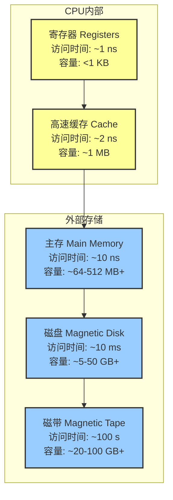

1006
1013
好的，我们开始吧。这是一份为你精心准备的《操作系统：内存管理》学习指南。无论你是初次接触这个概念，还是希望巩固基础，这份材料都会像一位耐心、专业的老师一样，带你一步步深入理解内存管理的奥秘。让我们一起，用清晰的思路和生动的例子，攻克这个操作系统的核心主题。

### 学习路线图 (Learning Roadmap)

亲爱的同学，你好！不必紧张，内存管理虽然听起来很“底层”，但它的核心思想非常直观。我们将分三步走，轻松掌握它：

1.  **第一站：为什么需要内存管理？ (约15分钟)**
    *   我们将从计算机的“记忆”——内存（Memory）本身谈起，理解它在计算机体系结构中的核心地位。
    *   通过存储器金字塔，你会明白为什么“又快又大又便宜”的内存只是一个美好的理想，以及操作系统为何必须在速度、容量和成本之间做出权衡。

2.  **第二站：地址是如何从“逻辑”到“现实”的？ (约25分钟)**
    *   这是本章的核心难点，但别担心！我们会探讨程序眼中的“逻辑地址”和内存条上的“物理地址”有何不同。
    *   我们将揭示操作系统和硬件如何联手施展“魔法”（地址重定位），确保每个程序都能在内存中安家落户，互不干扰。

3.  **第三站：如何“切蛋糕”——分配内存的策略 (约20分钟)**
    *   当多个程序需要同时运行时，操作系统该如何为它们分配内存？我们会学习最基础的连续内存分配方法。
    *   我们将对比几种经典的分配算法（如首次适应、最佳适应等），分析它们的优缺点，看看操作系统是如何做“管家”的。

让我们带着好奇心，开始这段探索之旅吧！

---

### 核心知识点讲解 (Point-by-Point Explanation)

我们将把每个核心概念都封装在一张知识卡片里，方便你学习和回顾。

#### 知识卡片1：内存与存储体系 (Memory and Storage Hierarchy)

*   **它解决了什么问题 (Intuitive)** `[S03][S04][S05]`
    *   计算机需要一个地方来存放正在运行的程序和它们需要处理的数据。这个地方就是**内存**。但我们既想要它快得能跟上CPU的脚步，又想要它大得能装下所有程序，还想它便宜。这三者不可兼得，于是操作系统需要聪明地管理不同速度、不同大小、不同价格的存储设备。

*   **前置知识 (Prerequisites)**
    *   了解计算机由CPU、内存、输入/输出设备组成（冯·诺依曼体系结构 `[S04]`）。

*   **类比与直觉 (Analogy / Intuition)**
    *   想象一下你的书桌。桌面上放着你正在读的书（**内存/主存**），你一伸手就能够到，非常快。你的书架上放着很多书（**磁盘**），容量很大，但找起来、拿起来就慢多了。而你脑子里正在思考的一两个公式或单词，就像是CPU里的**寄存器**或**高速缓存(Cache)**，几乎是瞬间就能获取。操作系统就是帮你管理“桌面空间”和“从书架取书”这个过程的智能助手。

*   **官方/正式说法 (Rigorous)** `[S06][S07]`
    *   **内存（Memory）**，也称主存（Main Memory）或物理内存，是CPU能直接通过地址访问的存储设备，通常由DRAM（动态随机存取存储器）芯片构成。它的特点是易失性（断电后数据丢失）和随机访问。`[S03]`
    *   **存储体系结构（Memory Hierarchy）** 是一种分层结构，根据访问速度、容量和每比特成本，将存储设备组织成一个金字塔。从上到下，访问速度变慢，容量变大，成本变低。`[S07]`

*   **关键图示 (Inline Visual)**


`[Fig·S07-1]`
**图解**: 存储器金字塔 `[S07]`。越靠近顶端的CPU，存储设备的速度越快，但容量越小、价格越昂贵。内存管理的核心目标就是：**如何利用少量高速存储，为用户提供近似于无限大且快速的内存体验？**

*   **常见误区 (Common Pitfalls)**
    *   **误区**: “内存”和“外存（硬盘）”是一回事。
    *   **纠正**: 它们是完全不同的。CPU不能直接运行硬盘里的程序，必须先把程序加载到内存中才能执行。内存是“工作台”，硬盘是“仓库”。

*   **一句话总结 (One-Sentence Takeaway)**
    *   操作系统通过管理一个由快到慢、由小到大的存储设备金字塔，来平衡计算的速度、容量和成本需求。

*   **自查三问 (Self-Check)**
    1.  **判断题**: 程序的指令可以被CPU直接在磁盘上执行，无需加载到内存。(错误)
    2.  **选择题**: 在存储器层次结构中，哪一层设备的访问速度最快？ (A) 主存 (B) 磁盘 (C) 寄存器 (D) Cache (答案: C)
    3.  **开放题**: 为什么计算机不全部使用和寄存器一样快的存储器来做主存呢？(因为成本太高，且技术上难以实现大规模集成。)

---

#### 知识卡片2：早期的内存管理方式 (单道与固定分区)

*   **它解决了什么问题 (Intuitive)** `[S09][S10]`
    *   在计算机发展的早期，系统非常简单，需要一种最直接的方式把程序放进内存里运行。

*   **前置知识 (Prerequisites)**
    *   理解什么是程序和进程。

*   **类比与直觉 (Analogy / Intuition)**
    *   **单道程序 (Uniprogramming)**: 想象一个只有一个灶台的厨房。你必须做完一道菜（一个程序运行结束），把锅碗瓢盆都收拾干净，才能开始做下一道菜。效率很低，因为在“切菜”（I/O操作）的时候，“灶台”（CPU）就完全闲置了。`[S09]`
    *   **多道程序 - 固定分区 (Fixed Partition Multiprogramming)**: 为了提高效率，你把厨房分成了几个固定的区域，每个区域有一个灶台。现在可以同时做几道菜了。但问题是，如果来了一道需要很大空间的“烤全羊”，而你的区域都很小，就做不了。或者，一道“拍黄瓜”只需要很小的地方，却占用了一个大区域，造成浪费。`[S10]`

*   **官方/正式说法 (Rigorous)**
    *   **单道程序模型 (Uniprogramming Model)** `[S09]`
        *   **描述**: 内存中同时只存在一个用户程序。操作系统将一个程序完整加载到内存，为其提供服务，直到该程序退出，才加载下一个。
        *   **分析**: 这种模型非常简单（Simple, but naive）。操作系统和应用程序共享同一个地址空间，硬件要求低。但其效率极低（low performance），因为当程序进行I/O操作时，CPU会处于空闲等待状态，造成巨大浪费。
        *   **优点**: 易于管理，软硬件支持要求少。
        *   **缺点**: 内存浪费严重，程序与数据共享性差，系统安全性差。
    *   **多道程序固定分区模型 (Fixed Partition Multiprogramming)** `[S10]`
        *   **描述**: 将内存预先划分成若干个大小固定的**分区（Partition）**。当一个程序需要运行时，系统会寻找一个大小足够容纳它的空闲分区，并将其加载进去。
        *   **分析**: 这是多道程序设计的基础（Basement of multiprogramming）。它允许多个程序同时存在于内存中，当一个程序等待I/O时，CPU可以切换到另一个程序执行，显著提高了CPU利用率。`[S11]` 然而，它也带来了严重的性能问题，主要是**内部碎片**（分配给程序的分区大于程序实际所需，多出来的部分无法被利用）。

*   **关键图示 (Inline Visual)**

    ```
    +-----------------+        +-----------------+
    |   操作系统 (OS)   |        |   操作系统 (OS)   |
    +-----------------+        +-----------------+
    |                 |        |   分区 1 (空闲)   |
    |   用户程序      |        +-----------------+
    |                 |        |   分区 2 (程序A)  |
    +-----------------+        +-----------------+
    |                 |        |   分区 3 (空闲)   |
    +-----------------+        +-----------------+
    
    (a) 单道程序模型          (b) 固定分区模型
    ```
    `[Fig·S09-1]`
    **图解**: (a) 单道模型中，内存除了OS区域，全部被一个用户程序占用。 (b) 固定分区模型中，内存被预先切割成块，程序装入合适的块中。

*   **常见误区 (Common Pitfalls)**
    *   **误区**: 多道程序就是并行执行。
    *   **纠正**: 在单核CPU上，多道程序是**并发concurrent**执行，不是**并行（parallel）**。CPU在极短的时间内快速切换，看起来像在同时运行，但任意时刻只有一个程序在真正执行。

*   **一句话总结 (One-Sentence Takeaway)**
    *   从一次只运行一个程序的“单道”模式，发展到将内存预先分块以同时容纳多个程序的“固定分区”模式，是操作系统提高系统利用率的第一次重要尝试。

*   **自查三问 (Self-Check)**
    1.  **判断题**: 在固定分区内存管理中，一个分区即使只装了一个很小的程序，该分区的剩余空间也可以被其他程序使用。(错误，剩余部分是内部碎片，无法使用)
    2.  **选择题**: 相比单道程序，多道程序最主要的优势是？ (A) 程序编写更简单 (B) 提高了CPU和内存的利用率 (C) 系统更安全 (D) 对硬件要求更低 (答案: B) `[S11]`
    3.  **开放题**: 固定分区管理会产生哪种类型的内存碎片？它为什么会产生？(内部碎片。因为分区大小是固定的，而程序大小是可变的，当程序小于其所在分区大小时，分区内多余的空间就被浪费了。)
		- **固定分区管理 → 内部碎片**（分区太大，程序太小）
		- **可变分区管理 → 外部碎片**（内存不断分配与释放后，剩余的空闲区零散分布，无法整合成足够大的连续空间）
---

#### 知识卡片3：逻辑地址 vs. 物理地址 与 地址重定位

*   **它解决了什么问题 (Intuitive)** `[S12][S14][S15]`
    *   在多道程序环境下，一个程序可能被加载到内存的任何位置。比如，程序A这次可能在地址1000开始的地方，下次可能就在地址5000。但程序员在写代码时，并不知道程序未来会被放在哪。那么，程序内部的地址（比如函数跳转、变量访问）该如何正确工作呢？`[S12]`

*   **前置知识 (Prerequisites)**
    *   了解程序经过编译、链接、加载的基本过程。
    *   了解CPU如何通过地址访问内存。`[S08]`

*   **类比与直觉 (Analogy / Intuition)**
    *   你写了一封信，信里提到“去我书房第二排书架第三个格子拿那本书”。这是**逻辑地址**——一个相对的、在你“书房”这个小世界里有意义的地址。
    *   当这封信被送到你朋友家，他需要把这个指令翻译成他家的具体位置，比如“去二楼朝南的那个房间，靠窗的那个高书架的第二层...” 这就是**物理地址**——一个在整个“房子”这个大世界里唯一的、绝对的地址。
    *   **地址重定位**就是这个翻译过程。操作系统告诉CPU：“嘿，‘我的书房’现在被安置在了‘二楼朝南的房间’”，CPU就能正确地进行地址转换了。

*   **官方/正式说法 (Rigorous)**
    *   **逻辑地址 (Logical Address)**: 由CPU生成，也称为虚拟地址。它是程序视角下的地址，通常从0开始。例如，`jmp 175` 指的是跳转到当前程序内的第175个字节处。`[S14]`
    *   **物理地址 (Physical Address)**: 内存硬件单元（Memory Management Unit, MMU）看到的地址，是加载到内存地址寄存器的最终地址，对应物理内存中的一个具体存储单元。
    *   **地址重定位 (Address Relocation)**: 将逻辑地址映射到物理地址的过程。
        *   **静态重定位**: 在程序**加载时**，由加载器一次性地修改程序中所有与地址相关的指令，将逻辑地址替换为物理地址。`[S14]` 这种方式缺乏灵活性，程序一旦加载进内存就不能再移动。
        *   **动态重定位**: 在程序**运行时**，由硬件辅助完成地址转换。这是现代操作系统采用的方式。`[S15]`

*   **关键图示 (Inline Visual): 硬件辅助的动态重定位** `[S15]`

    ```
         +-------+                                     +----------------------+
         |  CPU  | --    逻辑地址 (e.g., 175) -->      |   地址转换硬件 (MMU)   |
         +-------+                                     +----------------------+
             ^                                               |           |
             |                                             (比较)       (加法)
             |                                               |           |
    +----------------+                            +----------------+     |
    |   界限寄存器   | <--------------------------+   (<= Limit?)        | |
    |  (Limit Reg)   |                                     |         +-----> 物理地址
    |  (e.g., 500)   |                                    yes          |     (e.g., 1000+175 = 1175)
    +----------------+                                     |           |
                                                           |   +-------------+
    +----------------+                                     +---+ 基址寄存器  |
    |   基址寄存器   | <----------------------------------------| (Base Reg)  |
    |  (Base Reg)    |                                         | (e.g., 1000)|
    | (e.g., 1000)   |                                         +-------------+
    +----------------+
    ```
    `[Fig·S15-1]`
    **图解**: 动态地址转换过程 `[S15]`。
    1.  **CPU生成逻辑地址**：比如，要访问地址 `175`。
    2.  **边界检查**：MMU硬件将逻辑地址 `175` 与**界限寄存器，或称长度寄存器**的值 `500` 比较。因为 `175 <= 500`，所以访问是合法的（没有越界）。如果逻辑地址大于界限值，会触发一个“内存异常”。
    3.  **地址计算**：如果检查通过，MMU将逻辑地址 `175` 与**基址寄存器**的值 `1000` 相加。
    4.  **得到物理地址**：`1000 + 175 = 1175`。这个最终的物理地址 `1175` 被送到内存总线，用于访问真实的内存单元。
    *   **基址寄存器 (Base Register)**: 存放程序在内存中的起始物理地址。
    *   **界限寄存器 (Limit/Length Register)**: 存放程序的逻辑地址空间的大小。它的作用是保护内存，防止程序访问不属于自己的内存区域。

*   **常见误区 (Common Pitfalls)**
    *   **误区**: 编译器直接生成物理地址。
    *   **纠正**: 编译器和链接器生成的是逻辑地址。它们不知道，也没必要知道程序未来会在哪个物理位置运行。地址转换是操作系统和硬件在运行时的工作。

*   **一句话总结 (One-Sentence Takeaway)**
    *   操作系统通过使用基址和界限寄存器，在硬件的支持下，于运行时将程序自认为从0开始的“逻辑地址”动态翻译成在内存中的实际“物理地址”。

*   **自查三问 (Self-Check)**
    1.  **判断题**: 在动态重定位方案中，一旦程序被加载到内存，就不能再移动到其他位置了。(错误，动态重定位的优势就在于可以移动程序，只需更新基址寄存器即可。)
    2.  **选择题**: 一个进程的基址寄存器值为20000，界限寄存器值为4000。CPU发出的逻辑地址2500对应的物理地址是？ (A) 4000 (B) 22500 (C) 24000 (D) 访问越界 (答案: B)
    3.  **开放题**: 动态重定位中的“界限寄存器”起到了什么关键作用？(保护作用。它确保了程序所有的内存访问都在其被分配的合法范围内，防止其读取或修改其他程序或操作系统的数据。)

---

#### 知识卡片4：连续内存分配：动态分区

*   **它解决了什么问题 (Intuitive)** `[S16]`
    *   固定分区太死板，会造成空间浪费（内部碎片）。我们能不能更灵活一些，根据程序的大小，“按需分配”一块刚刚好的连续内存给它呢？

*   **前置知识 (Prerequisites)**
    *   理解固定分区和内部碎片的缺点。
    *   了解链表等基本数据结构。

*   **类比与直觉 (Analogy / Intuition)**
    *   想象一个停车场，不再是画好固定大小的车位（固定分区），而是一整块空地（动态分区）。来一辆小轿车，你就给它画一小块地方；来一辆大卡车，你就给它画一大块地方。这样非常灵活，不会有“一个自行车位停了一辆摩托车”造成的浪费。
    *   但是，当车辆陆续离开后，停车场上会留下大大小小的、不连续的空位。这时再来一辆大卡车，可能所有空位加起来总面积是够的，但没有一块连续的空地能容纳它。这就是**外部碎片**。`[S18]`

*   **官方/正式说法 (Rigorous)**
    *   **动态分区分配 (Dynamic Partition Allocation)** `[S16]`
        *   **描述**: 内存不预先划分。当一个进程需要加载时，操作系统从空闲内存中寻找一个足够大的连续区域，并按照进程的实际大小为其分配一个分区。分区的地址是连续的。
        *   **数据结构**: 操作系统需要维护数据结构来跟踪哪些内存区域是已分配的，哪些是空闲的（称为**空闲块**或**空洞(hole)**）。常用的数据结构有：
            *   **位图 (Bitmap)** `[S19]`: 将内存划分为小的分配单元，用一位（0或1）来表示每个单元是空闲还是占用。
            *   **链表 (Linked List)** `[S20]`: 为每个内存块（无论是已分配还是空闲）创建一个节点，记录其起始地址、长度和状态，并将所有块链接起来。

    *   **内存回收与合并 (Deallocation and Coalescing)** `[S21]`
        *   当一个进程结束并释放内存时，操作系统需要回收其占用的分区。如果这个被释放的分区与一个或多个相邻的空闲分区接壤，就应该将它们**合并coalesce**成一个更大的空闲分区，以备将来分配给更大的进程。`[S22]`
        *   `[S21]` 中展示了四种合并情况：
            1.  释放的块`X`上下都是已分配块：`X`自己成为一个新的空闲块。
            2.  `X`的上方是已分配块，下方是空闲块：`X`与下方的空闲块合并。
            3.  `X`的上方是空闲块，下方是已分配块：`X`与上方的空闲块合并。
            4.  `X`的上下都是空闲块：`X`与上、下两个空闲块合并成一个更大的空闲块。

*   **关键图示 (Inline Visual): 位图 vs. 链表** `[S19][S20]`

    ```
    内存物理视图: [ P1 | 空闲 | P2 | P3 |  空闲  ]
                   ^    ^    ^    ^    ^
                   0    5    8    12   18 (起始地址)
    
    (a) 位图表示法 (假设每格=1单位)
    111110001111000000...
    (P1占5个, 空闲3个, P2占4个, P3占6个, ...)
    
    (b) 链表表示法
    +------+-----+------+      +------+-----+------+      +------+-----+------+
    | P, 0, 5 | next |----->| H, 5, 3 | next |----->| P, 8, 4 | next | --> ...
    +------+-----+------+      +------+-----+------+      +------+-----+------+
    (类型, 起始, 长度)           (H代表Hole/空闲)
    ```
    `[Fig·S20-1]`
    **图解**: 同样一块内存布局，可以用(a)位图或(b)链表来管理。位图简单紧凑，但分配大块内存时搜索效率低（要在一长串位图（可能几百万位）里找到**连续100个0**，系统需要**一个个比特地扫描**）。链表更灵活，便于合并，但每个节点有额外开销。

*   **常见误区 (Common Pitfalls)**
    *   **外部碎片 (External Fragmentation)**: 指内存中存在足够多的**非连续**空闲空间来满足一个请求，但由于它们不连续，导致无法分配。这是动态分区的主要缺点。
    *   **内部碎片 (Internal Fragmentation)**: 分配的内存块大于请求的内存大小，块内未被使用的部分。动态分区**基本消除了内部碎片**（除了因对齐等原因产生的极小碎片），但引入了外部碎片。

*   **一句话总结 (One-Sentence Takeaway)**
    *   动态分区按需分配连续内存，虽然消除了内部碎片，但随着进程的创建和销毁，会产生大量不连续的小空闲块，即外部碎片。

*   **自查三问 (Self-Check)**
    1.  **判断题**: 动态分区分配策略从根本上解决了内存碎片问题。(错误，它解决了内部碎片，但引入了外部碎片。)
    2.  **选择题**: 在动态分区管理中，当一个进程结束时，将其内存块与相邻空闲块合并的主要目的是？ (A) 减少系统调用开销 (B) 形成更大的可用空闲块，以满足未来可能的大内存请求 (C) 方便调试 (D) 加快进程创建速度 (答案: B)
    3.  **开放题**: 请简述位图和链表两种管理空闲内存方法各自的优缺点。(位图：优点是简单、空间开销固定；缺点是查找连续大空间时效率低下。链表：优点是查找和合并操作相对高效；缺点是每个节点都有指针开销，可能比位图占用更多空间。)

---

#### 知识卡片5：动态分区分配算法

*   **它解决了什么问题 (Intuitive)** `[S22][S30]`
    *   当内存中存在多个大小不同的空闲块（洞）时，一个新进程请求N字节的内存，我们应该选择哪个空闲块来分配给它呢？不同的选择策略会直接影响未来的内存使用效率和碎片情况。

*   **前置知识 (Prerequisites)**
    *   理解动态分区和外部碎片的形成。

*   **类比与直觉 (Analogy / Intuition)**
    *   假设你有一些不同长度的布料（空闲块），现在需要剪一块2米长的布（内存请求）。
    *   **首次适应 (First-Fit)**: 你从第一卷布料开始看，只要找到一卷长度大于等于2米的，就直接从上面剪，不管这卷布有多长。`[S24][S26]`
    *   **最佳适应 (Best-Fit)**: 你会仔细查看所有布料，找出那卷“最刚好”的，比如一卷2.1米长的。你的目标是让剪完后剩下的边角料最小。`[S23][S27]`
    *   **最差适应 (Worst-Fit)**: 你反而会选择最长的那卷布料，比如一卷10米长的，来剪下2米。你的想法是，剩下的8米仍然是一块很大的、有用的布料。`[S25][S28]`
    *   **下次适应 (Next-Fit)**: 你记得上次是从第三卷布料剪的，所以这次你就从第四卷开始找，而不是每次都从头开始。`[S29]`

*   **官方/正式说法 (Rigorous)**
    *   假设有一个空闲块列表，一个进程请求大小为 `n` 的内存。
    *   **1. 首次适应算法 (First-Fit)** `[S26]`
        *   **策略**: 从空闲分区链表的**开头**开始查找，选择第一个大小足够（`>= n`）的空闲分区进行分配。
        *   **优点**: 算法简单，分配和释放的时间性能较好。倾向于在内存低地址部分留下小碎片，而保留高地址部分的大空闲块。
        *   **缺点**: 低地址部分会不断被切割，产生越来越多的小碎片，导致后续分配时查找时间开销增大。
    *   **2. 最佳适应算法 (Best-Fit)** `[S27]`
        *   **策略**: 遍历整个空闲分区列表，找到大小 `>= n` 且**最小**的那个空闲分区进行分配。通常需要一个按大小排序的空闲链表来优化查找。
        *   **优点**: 每次分配产生的“剩余碎片”（内部碎片几乎为零，但这里指分割后剩下的新空闲块）最小。
        *   **缺点**: 容易产生大量非常小、几乎无法再利用的外部碎片。虽然较大的空闲分区可以被保留，但整体碎片化可能更严重。
    *   **3. 最差适应算法 (Worst-Fit / Bad-Fit)** `[S28]`
        *   **策略**: 遍历整个空闲分区列表，总是选择**最大**的那个空闲分区进行分配。
        *   **优点**: 分割后剩下的空闲块仍然较大，有更高的可能性满足未来的内存请求。减少了产生极小碎片的概率。
        *   **缺点**: 快速消耗掉大的空闲块。如果系统中大进程较多，很快就会没有足够大的连续空间来满足它们。
    *   **4. 下次适应算法 (Next-Fit)** `[S29]`
        *   **策略**: 从**上次分配位置**开始查找，而不是每次都从头开始。查找到链表末尾后会循环回到开头。
        *   **优点**: 分配开销介于首次适应和最佳/最差适应之间。空闲碎片的分布更均匀，而不是集中在低地址处。
        *   **缺点**: 性能不稳定，可能效果很好，也可能很差，取决于当前空洞的分布。可能存在较大空闲块在刚被跳过之后就一直得不到利用的情况。

*   **关键图示 (Inline Visual): 算法选择对比** `[S30]`

| 算法 | 策略 | 优点 | 缺点 |
| :--- | :--- | :--- | :--- |
| **First-Fit** | 找到的第一个足够大的 | 速度快，保留大块在高端 | 低端碎片多，查找时间增加 |
| **Best-Fit** | 找到的最小的足够大的 | 每次剩余碎片最小 | 容易产生大量无用小碎片 |
| **Worst-Fit** | 找到的最大的 | 剩余块大，仍可能有用 | 快速消耗大块内存 |
| **Next-Fit** | 从上次位置找第一个 | 分布均匀，查找快 | 性能不稳定 |

`[Fig·S30-1]`
**表格**: 四种动态分区分配算法对比。

**示例** `[S30]`: 内存中有空闲块 {22K, 18K, 36K}，请求 16K。
*   **First-Fit**: 会选择 **22K** 的块。
*   **Best-Fit**: 会选择 **18K** 的块 (因为 18K 是 >=16K 中最小的)。
*   **Next-Fit**: (假设上次分配在它们之前) 会选择 **22K** 的块。

*   **一句话总结 (One-Sentence Takeaway)**
    *   首次适应追求“快”，最佳适应追求“省”，最差适应追求“大块优先”，下次适应则试图在效率和均匀性之间取得平衡，但没有一种算法能完美解决外部碎片问题。

*   **自查三问 (Self-Check)**
    1.  **判断题**: 最佳适应算法是实际系统中最好的选择，因为它总能最小化内存浪费。(错误，它虽然最小化了单次分配的剩余碎片，但长期来看会制造大量难以利用的极小外部碎片，不一定是最好的。)
    2.  **选择题**: 假设内存空闲块按地址顺序为 10K, 4K, 20K, 18K, 7K。一个 12K 的请求使用首次适应、最佳适应和最差适应算法，分别会选择哪个块？(A) 20K, 18K, 10K (B) 20K, 18K, 20K (C) 10K, 18K, 20K (D) 20K, 20K, 18K (答案: B。首次适应找到20K；最佳适应找到18K；最差适应找到20K。)
    3.  **开放题**: 为什么说下次适应算法(Next-Fit)比首次适应算法(First-Fit)的空闲块分布更均匀？(因为首次适应总是从头开始扫描，导致内存低地址区域的空闲块被反复切割和使用，碎片集中。而下次适应从上次结束的地方开始，扫描会遍及整个内存，使得空闲块的消耗和产生在地址空间上分布得更广泛。)

---

### 总结：“上古时代”的内存管理 `[S13][S31]`

这部分内容是对前面所有知识点的一个高度概括和回顾，非常重要。

*   **时代背景**: 在现代内存管理技术（如分页、分段）出现之前，内存管理的特点是：
    1.  **程序规模限制**: 程序的内存需求必须小于等于物理内存大小。
    2.  **静态内存需求**: 程序在运行前就知道自己需要多少内存，且在运行期间这个需求不会动态变化。（`[S17]` 中的栈区和数据区相向增长是早期为了满足这个上限的一种技巧）。
    3.  **一次性分配**: 内存是在程序启动时一次性分配的，运行期间不再改变。
*   **核心技术演进**:
    1.  **从单道到多道**: 为了提升系统效率，通过**分区Partition**技术允许多个程序同时加载到内存。
    2.  **地址独立性**: 程序开发时无法预知其加载位置，因此需要地址重定位。通过**分段机制**（这里的“段”指逻辑上的一整块程序，用**基址寄存器 + 长度寄存器**实现）支持动态调整加载地址。
    3.  **空闲空间管理**: 为了管理动态分区产生的空闲块，设计了**位图**、**链表**等数据结构。
    4.  **分配策略**: 为了从众多空闲块中选择一个进行分配，发明了**首次、最佳、最差、下次**等多种分配算法，其核心目标是在**减少碎片**和**提高利用率**之间找到平衡。

这些“上古时代”的技术虽然现在看来有种种局限（尤其是外部碎片问题无法根治），但它们奠定了现代内存管理思想的基础，理解它们对于后续学习虚拟内存至关重要。

---

### 一页纸速记手册 (One-Page Cheat Sheet)

**主题：内存管理基础 (连续分配)**

| 概念 | 核心思想 & 解决的问题 | 关键技术/机制 | 优点 | 缺点/引入的问题 |
| :--- | :--- | :--- | :--- | :--- |
| **存储层次** | 平衡速度、容量、成本的矛盾。 | 寄存器 -> Cache -> 主存 -> 磁盘 | 提供了高性能、大容量的抽象 | 数据需要在不同层次间移动 |
| **地址空间** | **逻辑地址**: 程序视角，从0开始。<br>**物理地址**: 内存硬件的真实地址。 | **重定位**: 逻辑地址 -> 物理地址 | 程序与物理位置解耦 | 需要硬件支持(MMU) |
| **动态重定位** | 运行时通过硬件转换地址。 | **基址寄存器**: 起始地址。<br>**界限寄存器**: 长度，用于保护。 | 程序可在内存中移动，保护性好 | 每次访存都需要计算 |
| **单道程序** | 一次只运行一个程序。 | 简单加载 | 简单，硬件要求低 | CPU/内存利用率极低 |
| **固定分区** | 内存预先划分为固定大小的块。 | 多道程序基础 | 提高了资源利用率 | **内部碎片**，分区大小不灵活 |
| **动态分区** | 按需分配连续内存块。 | 空闲块管理（位图/链表） | 无内部碎片，灵活 | **外部碎片**，回收时需合并 |

**动态分区分配算法对比**

*   **First-Fit (首次适应)**:
    *   **策略**: 找第一个够大的。
    *   **特点**: 快，但低地址碎片多。
*   **Best-Fit (最佳适应)**:
    *   **策略**: 找最小的够大的。
    *   **特点**: 节约，但易产生大量无用小碎片。
*   **Worst-Fit (最差适应)**:
    *   **策略**: 找最大的。
    *   **特点**: 保留大块，但消耗也快。
*   **Next-Fit (下次适应)**:
    *   **策略**: 从上次位置继续找。
    *   **特点**: 均衡，但性能不稳定。

**核心公式**
*   **动态重定位**: `物理地址 = 基址寄存器 + 逻辑地址` (需满足 `逻辑地址 <= 界限寄存器`)

**关键问题**
*   **内部碎片**: 分配块 > 请求大小，块内浪费。 (固定分区)
*   **外部碎片**: 总空闲空间够，但都不连续。 (动态分区)
*   **合并 (Coalescing)**: 回收内存时，将相邻空闲块合并成大块，是缓解外部碎片的关键。

---

### 附录：幻灯片内容追溯与补丁

#### 幻灯片覆盖索引 (Slides → Anchors Cross-Reference)

| Slide # | 标题/核心内容 | 覆盖位置 |
| :--- | :--- | :--- |
| S01-S02 | 课程/章节标题 | (元信息) |
| S03-S04 | 什么是内存 (物理/架构) | 知识卡片1 |
| S05 | 为什么要做内存管理 | 知识卡片1 |
| S06 | 程序员期望 vs 系统结构 | 知识卡片1 |
| S07 | Memory Hierarchy | 知识卡片1, `[Fig·S07-1]` |
| S08 | 地址的形成 | 知识卡片3 (前置知识) |
| S09 | 单道程序 | 知识卡片2, `[Fig·S09-1]` |
| S10 | 多道程序 (分区固定) | 知识卡片2 |
| S11 | 多道程序的合理性 (CPU利用率) | 知识卡片2 (分析部分) |
| S12 | 多道程序地址问题 | 知识卡片3 (问题引入) |
| S13 | 前情提要 (综合回顾) | 贯穿全文, 尤其在“上古时代”总结部分 |
| S14 | 逻辑地址与物理地址 (静态重定位) | 知识卡片3 |
| S15 | 硬件辅助的动态重定位 | 知识卡片3, `[Fig·S15-1]` |
| S16 | 动态分区分配 | 知识卡片4 |
| S17 | Memory dynamic growth | “上古时代”总结部分 (提及) |
| S18 | 程序运行后的内存布局 (碎片) | 知识卡片4 (外部碎片直观展示) |
| S19 | 使用位图的存储管理 | 知识卡片4, `[Fig·S20-1]` |
| S20 | 使用链表的存储管理 | 知识卡片4, `[Fig·S20-1]` |
| S21 | 链表管理 - 回收合并 | 知识卡片4 (内存回收与合并部分) |
| S22 | 分区管理分配算法 (概述) | 知识卡片4, 知识卡片5 |
| S23-S25 | 最佳/最先/最差匹配 (图例) | 知识卡片5 (类比与直觉部分) |
| S26-S29 | 分配算法描述 (四种) | 知识卡片5 (官方/正式说法) |
| S30 | 分配示例 | 知识卡片5 (示例), `[Fig·S30-1]` |
| S31 | 内存管理的“上古时代”总结 | “上古时代”的内存管理 (总结部分) |
| S32 | Q&A | (结束页) |

#### 缺失扫描与内容补丁 (Missing Scanner & Patches)

经过仔细核对，所有幻灯片的核心概念、图示和关键术语均已在上述讲解中覆盖。没有发现遗漏的内容。对S13和S31这种总结性的幻灯片，其要点被拆分并融入到各个知识卡片的讲解和最终的总结章节中，以确保系统性的学习体验。例如，S13提到的进程调度相关内容作为背景知识被简要提及，而内存管理的部分则在后续卡片中详细展开。S17的内存动态增长图示，在“上古时代”总结中作为程序内存静态上限的一个实现技巧被提及。所有内容均已整合完毕。
