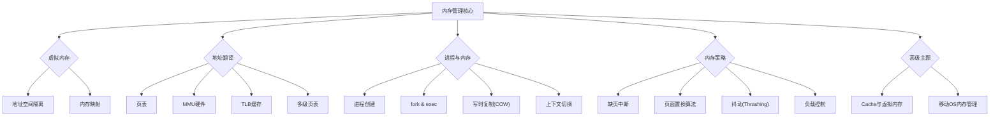
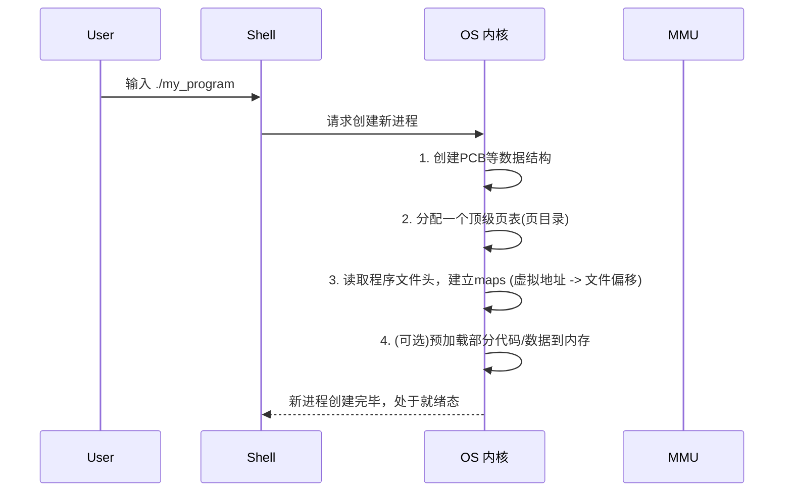
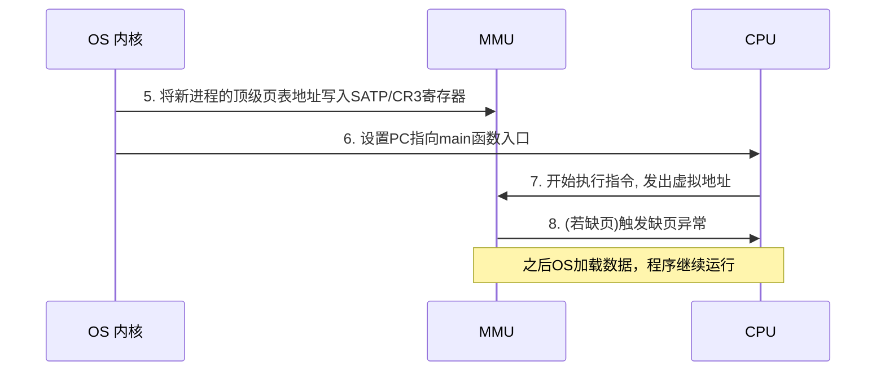

好的，亲爱的同学，你好！

非常荣幸能为你讲解操作系统中最为核心也最有趣的部分——内存管理。这部分内容初看起来可能有些抽象，有很多概念和流程。但别担心，我会像一位耐心的向导，带你一步步探索这个奇妙的世界。我们会从最基本的问题出发，用生动的比喻和清晰的图解，把每一个知识点都掰开揉碎，让你不仅知其然，更知其所以然。

这份学习指南是完全独立的，你不需要对照任何其他材料。它既可以带你从零开始学习，也可以作为你期末复习的得力助手。让我们一起开启这段旅程吧！

---

### **学习路线图**

这部分内容我们将循序渐进，预计花费 60-90 分钟。

1.  **虚拟内存的“魔法”**: 首先理解为什么计算机会有“虚拟内存”这个概念，它为我们解决了什么根本问题。
2.  **解密地址翻译**: 接着，我们会深入硬件层面，看看 CPU、MMU 和页表是如何协同工作，将虚拟地址一步步变成物理地址的。
3.  **进程的一生与内存**: 探究一个程序（进程）从创建、复制（`fork`）、变身（`exec`）到消亡，它的内存空间都经历了怎样的变化。
4.  **当内存告急时**: 学习当物理内存不足时，操作系统如何应对，包括页面置换、系统“抖动”以及最后的“杀手锏”。
5.  **现代操作系统的智慧**: 最后，我们会看一看像安卓和鸿蒙这样的现代移动操作系统，是如何运用更高级的技术来精细化管理内存的。

---

### **核心知识地图**



---

### **一、虚拟内存：CPU眼中的“海市蜃楼”**

我们从一个最根本的问题开始：CPU执行程序时，它操作的地址究竟是“虚拟”的还是“物理”的？`[S03]`

#### **知识卡：虚拟地址空间 (Virtual Address Space)**

*   **它解决了什么问题 (直观)**
    *   **安全隔离**：防止一个程序（比如你正在打的游戏）意外或恶意地修改另一个程序（比如你的聊天软件）或操作系统内核的数据。每个程序都以为自己独占了整个内存。
    *   **简化编程**：程序员在写代码时，不需要关心真实的物理内存有多大、哪个地址是空闲的。他们只需要在一个巨大、连续、整洁的“理想”地址空间里编程。
    *   **提高效率**：允许我们只把程序当前需要用到的部分放进物理内存，暂时不用的可以放在硬盘上，从而能运行比物理内存更大的程序。

*   **前置知识**
    *   知道计算机程序需要加载到内存（RAM）中才能被CPU执行。
    *   了解进程是程序运行的实例。

*   **类比 / 直觉**
    *   想象一下，你住在一个巨大的小区里，小区给你家的门牌号是“幸福路1号”。你的邻居，小区也告诉他，他家的门牌号是“幸福路1号”。你们两个都以为自己住在“幸福路1号”，但实际上，物业（操作系统）手里的总地图上，你家对应的是“A栋101室”，他家对应的是“B栋202室”。
    *   这里的“幸福路1号”就是**虚拟地址**，每个家庭（进程）都有自己的一套。而“A栋101室”就是**物理地址**，是真实的位置。物业的总地图和门禁系统（MMU硬件）负责在你们进出时，把你们脑子里的“幸福路1号”翻译成实际的房间。

*   **正式 / 官方陈述 (严谨)**
    *   虚拟地址空间是操作系统为每个进程创建的一个独立的、连续的逻辑地址范围。CPU生成的地址都是虚拟地址。这些虚拟地址通过内存管理单元（MMU）和页表（Page Table）的机制，被翻译成物理内存中的实际地址。这个翻译过程对应用程序是完全透明的。`[S03]`

*   **核心结论**
    *   **CPU运行的地址空间是虚拟的**。CPU无法直接触及物理内存，它发出的所有内存访问请求都必须经过MMU的翻译。`[S03]`
    *   每个进程都有一个完全属于自己的地址空间。例如，在32位系统上，每个进程都“认为”自己拥有从 `0x00000000` 到 `0xFFFFFFFF` 的4GB内存。`[S05]`

*   **常见陷阱 & 反例**
    *   **误区**：“虚拟内存”就是指硬盘上的交换空间（swap space）。
    *   **纠正**：虚拟内存是一个**地址空间**的概念，一个抽象层。而交换空间只是实现这个抽象层的一种物理手段（用来存放暂时不用的内存页）。

*   **一句话总结**
    *   虚拟地址空间是操作系统给每个进程画的一个“大饼”，让它感觉自己独享内存，而实际吃多少、吃哪块由操作系统和硬件动态决定。

*   **自查 (3个问题)**
    1.  判断题：一个系统中所有进程共享同一个虚拟地址空间。（错误）
    2.  选择题：CPU生成的地址首先由谁处理？ A. 操作系统 B. 应用程序 C. MMU D. 硬盘。（C）
    3.  简答题：为什么说虚拟内存让内存使用更高效？（因为它允许程序的部分加载，只有需要时才从硬盘调入内存，从而能运行比物理内存更大的程序。）

### **二、地址翻译的“秘密武器”：页表与MMU**

既然CPU用的是虚拟地址，那最终数据是如何从真实的物理内存中取出来的呢？这就要靠硬件和操作系统紧密配合了。

#### **知识卡：MMU (内存管理单元)**

*   **它解决了什么问题 (直观)**
    *   它是CPU和物理内存之间的“首席翻译官”，负责把CPU说的“外语”（虚拟地址）实时翻译成物理内存能懂的“母语”（物理地址）。

*   **前置知识**
    *   虚拟地址空间

*   **类比 / 直觉**
    *   继续用小区的比喻。MMU就像是小区的智能门禁系统。你刷卡说“我要回幸福路1號”，门禁系统（MMU）立刻查询它的数据库（页表），查到“幸福路1號”对应“A栋101室”，然后为你打开通往A栋101室的门。这个过程飞快，你几乎感觉不到翻译的存在。`[S03]`

*   **正式 / 官方陈述 (严谨)**
    *   MMU（Memory Management Unit）是一个硬件电路，通常集成在CPU内部。它接收CPU发出的虚拟地址，通过查询由操作系统维护的页表，自动完成虚拟地址到物理地址的转换。如果查询失败（例如，对应的页不在内存中），MMU会触发一个异常（缺页异常），让操作系统介入处理。`[S03]`

*   **内联图示：地址翻译流程** `[Fig·S03-1]`
    *   这是一个简化的流程图，展示了核心部件如何协同工作。

    ```mermaid
    graph LR
        CPU -- "1. 发出虚拟地址 (VA)" --> MMU;
        MMU -- "2. 查询页表" --> 页表(在内存中);
        页表 -- "3. 返回页框号 (PFN)" --> MMU;
        MMU -- "4. 组合成物理地址 (PA)" --> 物理内存;
        物理内存 -- "5. 返回数据" --> CPU;
    ```
    *   **图解**: CPU想访问一个虚拟地址，MMU负责查阅操作系统提供的“地图”（页表），找到对应的物理页框，然后告诉物理内存去哪里取数据。

#### **知识卡：页表 (Page Table)**

*   **它解决了什么问题 (直观)**
    *   它就是那个“地址翻译”过程中用到的“地图”或“数据库”，详细记录了虚拟地址和物理地址的对应关系。

*   **前置知识**
    *   虚拟地址空间, MMU

*   **类比 / 直觉**
    *   页表就是物业（操作系统）手里那本厚厚的登记簿。上面一页一页地写着：张三家的“幸福路1号” -> A栋101，李四家的“幸福路1号” -> B栋202...。当一个进程要运行时，物业会把这个进程对应的登记簿交给门禁系统（MMU）去使用。

*   **正式 / 官方陈述 (严谨)**
    *   页表是一种存储在内存中的数据结构，它建立了进程虚拟页（Virtual Page）到物理页框（Physical Frame）之间的映射。页表中的每一项（Page Table Entry, PTE）对应一个虚拟页，其中包含了该虚拟页对应的物理页框号、以及一些控制位（如：是否存在位、读/写权限位、脏位等）。`[S03]` `[S04]`
    *   **重要**：页表是由操作系统负责创建和维护的，但是由MMU硬件来查询使用。这个分工非常关键！`[S03]`

*   **关键结果**
    *   **每个进程都有自己独立的页表**。`[S05]` 这正是实现进程地址空间隔离的根本原因。因为进程A的页表和进程B的页表内容不同，它们各自的虚拟地址会被映射到不同的物理地址上，从而互不干扰。
    *   **进程切换时，页表也要切换**。当操作系统要从进程A切换到进程B时，它必须告诉MMU：“现在请使用进程B的页表”。这是通过修改一个特殊的CPU寄存器（在x86上是CR3，在RISC-V上是SATP）来完成的，这个寄存器里存放着当前进程顶级页表的物理地址。`[S05]` `[S08]` `[S09]`

*   **内联图示：多级页表 (以RISC-V Sv39为例)** `[Fig·S07-1]`
    *   如果一个页表要映射整个4G空间，它会变得非常巨大。所以现代系统都采用多级页表，像查字典一样，先查偏旁部首，再查具体的字。`[S07]`

    ```
    虚拟地址 (Sv39):
    +----------------+----------------+----------------+------------------+
    | VPN[2] (9 bit) | VPN[1] (9 bit) | VPN[0] (9 bit) | page offset(12b) |
    +----------------+----------------+----------------+------------------+
         |                 |                |                    |
         | (PGD索引)       | (PMD索引)      | (PT索引)           | (页内偏移)
         |                 |                |                    |
         ▼                 ▼                ▼                    ▼
    +-------+         +-------+        +------+          +------------------+
    |  PGD  | ---->   |  PMD  | ---->  |  PT  | ---->    |   物理页框 (PF)  |
    +-------+         +-------+        +------+          +------------------+
                                                             |
    物理地址:                                                |
    +----------------------------------+------------------+
    |      物理页框号 (PPN)             | page offset(12b) |
    +----------------------------------+------------------+
    ```
    *   **图解**: Sv39架构使用三级页表。虚拟地址被切分成几部分，每一部分作为下一级页表的索引，层层递进，最终找到物理页框号（PPN），再与原始的页内偏移组合，形成最终的物理地址。

#### **系统中的“页表们”** `[S06]`

一个运行中的操作系统里，其实有好几种扮演“表”角色的数据结构，我们来梳理一下：

| 表的类型         | 作用                                           | 谁拥有？ | 管理的是什么？ |
| ---------------- | ---------------------------------------------- | -------- | -------------- |
| **进程页表 (page_table)** | 记录本进程的虚拟页到物理页框的映射关系         | 每个进程 | 虚拟地址       |
| **空闲页框列表 (page_free_list)** | 记录哪些物理页框当前是空闲可用的               | 操作系统 | 物理地址       |
| **虚拟内存区域图 (maps/vma)** | 记录虚拟地址空间各区域的属性（如代码、数据），以及当它们不在内存时，在磁盘的哪个位置 | 每个进程 | 虚拟地址       |
`[Table·S06-1]`

> **小结**：CPU、MMU、页表三者构成了虚拟内存的核心硬件机制。CPU只管生成虚拟地址，MMU负责翻译，页表是翻译的依据。而这个依据（页表）本身，是由操作系统来精心管理的。`[S03]`

### **三、进程的“一生”与内存的“变迁”**

现在我们把视角拉高，看看在一个进程从诞生到消亡的整个生命周期中，内存管理模块都做了些什么。

#### **1. 进程的创建** `[S09]`

当你在终端敲下 `./my_program` 并回车时，内存管理模块会经历以下步骤：


`[Fig·S09-1]`

当调度器决定运行这个新进程时：


`[Fig·S09-2]`

#### **2. `fork`：克隆一个进程** `[S10]` `[S11]`

`fork()` 是Unix/Linux中一个非常有趣的系统调用，它会创建一个与父进程几乎一模一样的子进程。

*   **直观感受**: 就像孙悟空拔下一根猴毛，吹一口气，变出一个一模一样的自己。

*   **内存层面发生了什么？**
    1.  **浅拷贝（Shallow Copy）**: `fork` 的早期或简单实现，是完全复制父进程的页表。`[S14]` 这意味着子进程的页表项和父进程的页表项指向**完全相同的物理页框**。父子进程共享物理内存。`[S13]` (幻灯片S13的图示概念上是共享，S14的图示更接近实现：页表结构被复制，但内容指向相同的物理页)。
    2.  **写时复制 (Copy-on-Write, COW)**: 这是现代操作系统普遍采用的优化。`[S15]`
        *   `fork`时，内核并不立即复制物理内存，而是让父子进程共享所有页面，同时将这些页面标记为“只读”。
        *   当父进程或子进程**尝试写入**某个共享页面时，MMU会因为权限问题触发一个异常。
        *   内核捕获此异常，此时才真正复制一份该物理页面，让写入方独享这个新页面，并修改其页表指向新页面，同时将新页面标记为“可写”。
        *   这个机制极大地提高了 `fork` 的效率，因为很多时候子进程创建后会立刻调用 `exec`，如果 `fork` 时就完整复制了全部内存，那就白费功夫了。

*   **内联图示：写时复制 (COW)** `[Fig·S15-1]`

    ```
    1. fork()之后，写操作之前:
       进程A的PTE --\                           /--> 进程B的PTE
                     -----> [ 物理页框 P (只读) ] <-----
       进程A的PTE' --/                           \--> 进程B的PTE'

    2. 进程B尝试写入页框P:
       (1) MMU触发异常 -> 内核介入
       (2) 内核复制页框P -> [ 新的物理页框 P' ]
       (3) 内核修改进程B的页表:
           进程A的PTE -----> [ 物理页框 P (只读) ]
           进程B的PTE -----> [ 物理页框 P' (可写) ]
    ```
    *   **图解**: COW的核心思想是“延迟复制，按需分配”，只有在真正需要修改时才付出复制的代价。

#### **3. `exec`：变身为另一个程序** `[S11]` `[S16]`

子进程通常在`fork`之后会调用`exec`系列函数，来执行一个全新的程序。

*   **直观感受**: 孙悟空变出的小猴子，摇身一变，成了一座庙。它不再是猴子了。

*   **内存层面发生了什么？**
    *   `exec` 会废弃子进程当前所有的内存映射（包括从父进程继承来的）。
    *   内核会读取新的程序文件（例如 `/bin/ls`），根据其文件格式（如ELF），重新建立一套全新的页表映射。
    *   进程的用户空间被完全重置，代码、数据都换成了新程序的。
    *   从此，这个进程就和它原来的“父亲”在内存内容上分道扬镳了。`[S16]`

#### **4. 进程调度与资源回收** `[S18]` `[S19]`

*   **调度时**:
    *   **切换出去的进程（失去CPU）**: 它的状态被保存。如果它的某些内存页被修改过（“脏页”），操作系统可能会在稍后将这些脏页写回磁盘，以便腾出物理内存。`[S19]`
    *   **切换进来的进程（获得CPU）**: 操作系统会将它的顶级页表地址加载到 `SATP`/`CR3` 寄存器，并清空TLB（地址翻译缓存，后面会讲），确保MMU使用的是新进程的地址映射。`[S19]`

*   **回收时**:
    *   当进程退出时，操作系统需要回收它占用的所有资源。
    *   内核会遍历该进程的页表，释放其占用的所有物理页框（把它们加回到 `page_free_list` 中）。
    *   关闭所有打开的文件等。
    *   在Linux中，父进程通过调用 `wait()` 来完成对子进程资源的最终回收，防止其变成“僵尸进程”。`[S18]`

#### **动手实践：一个简单的Shell** `[S10]` `[S18]`

幻灯片右侧的代码实现了一个最基础的命令行解释器，它完美地展示了 `fork` 和 `exec` 的组合用法。

*   **完整可运行代码 (简化并添加注释)**
    ```c
    #include <stdio.h>
    #include <stdlib.h>
    #include <string.h>
    #include <unistd.h>
    #include <sys/wait.h>
    #include <errno.h>

    #define MAX_CMD_LEN 256

    int main() {
        char command[MAX_CMD_LEN];
        int rtn; // 子进程的返回值

        while(1) {
            printf("myshell> ");
            fflush(stdout); // 确保提示符立即显示

            // 1. 读取用户输入的命令
            if (fgets(command, MAX_CMD_LEN, stdin) == NULL) {
                break; // 如果读取失败(如Ctrl+D)，退出循环
            }
            command[strcspn(command, "\n")] = 0; // 移除末尾的换行符

            if (strlen(command) == 0) continue; // 输入为空，则继续循环

            // 2. 创建子进程
            pid_t pid = fork();

            if (pid < 0) {
                perror("fork failed");
                exit(1);
            } else if (pid == 0) {
                // --- 子进程的代码 ---
                // 3. 子进程调用exec来执行新程序
                // 这里使用execlp，它会自动在PATH中搜索命令
                execlp(command, command, NULL);

                // 如果exec函数返回了，说明出错了
                perror(command);
                exit(errno); // 带着错误码退出
            } else {
                // --- 父进程的代码 ---
                // 4. 父进程等待子进程结束
                wait(&rtn);
                printf("child process exited with status %d\n", WEXITSTATUS(rtn));
            }
        }
        printf("\nGoodbye!\n");
        return 0;
    }
    ```

*   **代码解读**
    1.  `while(1)` 循环：模拟shell持续等待用户输入。
    2.  `fork()`: 关键一步。调用后，程序“分裂”成两个，父子进程都会从 `fork()` 的下一行继续执行，但 `fork()` 的返回值不同。父进程得到子进程的ID，子进程得到0。
    3.  `if (pid == 0)`: 这是子进程的逻辑。它调用 `execlp` 来“变身”。如果 `ls` 命令执行成功，`execlp` 就不会返回，这个子进程的内存空间会被 `ls` 程序完全替代。
    4.  `else`: 这是父进程的逻辑。它调用 `wait()`，阻塞自己，直到子进程执行完毕。`wait()`会回收子进程的资源，并获取其退出状态。

### **四、当内存“捉襟见肘”：缺页、抖动与负载控制**

物理内存是有限的，当所有进程需要的内存总和超过了物理内存大小时，会发生什么？

#### **知识卡：缺页异常 (Page Fault)**

*   **它解决了什么问题 (直观)**
    *   它是实现“按需加载”的关键机制。当程序试图访问一个在虚拟地址空间中存在、但尚未加载到物理内存的页面时，缺页异常就发生了。它不是一个“错误”，而是一个通知操作系统“该干活了”的信号。

*   **前置知识**
    *   MMU, 页表

*   **正式 / 官方陈述 (严谨)**
    *   当MMU在翻译地址时，发现PTE（页表项）中的“存在位”（Present bit）为0，或者访问权限不匹配时，会暂停当前指令的执行，并触发一个缺页异常。CPU的控制权会转移到操作系统预设好的缺页异常处理程序。`[S03]` `[S17]`

*   **一个完整的页面访问过程** `[S37]`
    1.  CPU访问某个虚拟地址，首先查 **Cache**，发现未命中（Cache miss）。`[S40]`
    2.  CPU将地址交给MMU，MMU查 **TLB**（一个高速的地址翻译缓存），发现也未命中（TLB miss）。`[S39]`
    3.  MMU开始**遍历页表（Page Walk）**，试图找到对应的PTE。`[S38]`
    4.  MMU发现该页面的PTE不存在，或者存在位为0，于是触发**缺页异常**。`[S37]`
    5.  **操作系统介入**：
        a. 查找`maps`/`vma`，确认这是一个合法的访问，并找到该页在磁盘上的位置。
        b. 从`page_free_list`中申请一个**空白页框**。
        c. 将页面内容从磁盘**调入**到这个空白页框中。
        d. **更新页表**，填写物理页框号，并将存在位置为1。
        e. 让CPU**重新执行**刚才失败的指令。`[S37]`
    6.  这一次，地址翻译可以顺利完成，数据被取回，并可能被放入Cache和TLB中。

#### **当没有空白页框时...** `[S17]`

如果第5b步失败了（`page_free_list`是空的），操作系统就必须“杀富济贫”：

1.  **页面置换 (Page Replacement)**：运行一个页面置换算法（如LRU），选择一个当前在内存中但“最不常用”的页面作为“牺牲品”。
2.  如果牺牲品是“脏”的（被修改过），必须先把它**写回磁盘**（swap out）。
3.  将这个被换出的页框分配给当前缺页的进程。

#### **知识卡：抖动 (Thrashing)**

*   **它是什么 (直观)**
    *   系统陷入了一种恶性循环：内存严重不足，进程频繁地换入换出页面，大部分时间都花在I/O上，而不是真正地执行计算。CPU利用率急剧下降，系统看起来就像“卡死”了。`[S22]`

*   **产生原因** `[S22]`
    *   系统中的并发进程数（MPL, Multiprogramming Level）太多了。`[S21]`
    *   导致分配给每个进程的物理页框太少，连其**工作集**（Working Set，指一个进程在某段时间内需要频繁访问的页面的集合）都装不下。
    *   于是，进程运行几条指令就缺页，换入一页，马上又要用被换出去的另一页，又缺页...

*   **内联图示：CPU利用率与并发进程数的关系** `[Fig·S21-1]`

    ```
         ▲ CPU 利用率
         |
       100%|         / peak \
         |        /        \
         |       /          \
         |      /            \ Thrashing
         |-----/--------------\------------->
         0     N_optimal       N_max      并发进程数(MPL)
    ```
    *   **图解**: `[S21]` `[S20]` 随着并发进程数增加，CPU利用率一开始会上升（因为总有进程在运行而不是等待I/O）。但超过一个最佳点后，内存竞争加剧，缺页率飙升，系统开始“抖动”，CPU大部分时间都在等待磁盘I/O，利用率反而暴跌。

*   **如何应对抖动？** `[S23]`
    *   **负载控制**：操作系统必须监控缺页率或CPU利用率。当发现系统进入抖动区时，需要降低并发进程数。
    *   **挂起或杀死进程**：选择一些低优先级的进程，暂时挂起（将其所有页面换出），甚至直接杀死，以释放内存资源，让剩下的进程能正常运行。

### **五、高级主题：缓存与现代OS内存管理**

#### **1. Cache 与虚拟内存的“爱恨情仇”** `[S40]` `[S41]`

Cache是比主存快得多的存储器，它的存在对性能至关重要。但它和虚拟内存系统结合时，产生了一个设计选择问题：Cache里应该存虚拟地址还是物理地址对应的数据？

| 方案 | 全称 (英文) | 索引方式 | 标签方式 | 优点 | 缺点 |
| :-- | :--- | :--- | :--- | :--- | :--- |
| **VIVT** | Virtually Indexed, Virtually Tagged | 虚拟地址 | 虚拟地址 | 速度最快，无需地址翻译 | 有歧义（不同进程的相同VA）和别名（相同PA有不同VA）问题，上下文切换需刷新Cache |
| **PIPT** | Physically Indexed, Physically Tagged | 物理地址 | 物理地址 | 无歧义和别名问题，最简单 | 速度最慢，每次访问都必须先等MMU/TLB翻译出物理地址 |
| **VIPT** | Virtually Indexed, Physically Tagged | 虚拟地址 | 物理地址 | **业界主流**。速度快（索引和翻译可并行），基本无歧义和别名问题 | 设计稍复杂 |
`[Table·S42-44-1]`

*   **VIPT 工作流程** `[Fig·S44-1]`

    ```mermaid
    graph LR
        subgraph CPU
            VA[虚拟地址]
        end
        subgraph Parallel_Lookup as "并行查找"
            VA -- "用Index部分" --> VIPT_Cache[VIPT Cache]
            VA -- "整个地址" --> TLB
        end
        TLB -- "物理地址(PA)" --> Compare
        VIPT_Cache -- "Cache中的Tag (物理)" --> Compare{比较Tag}
        Compare -- "命中" --> Data_to_CPU[数据 -> CPU]
        Compare -- "未命中" --> Main_Memory[从主存读取]
    ```
    *   **图解**: `[S44]` CPU发出虚拟地址后，其Index部分立即用于在Cache中定位，同时整个地址送去TLB翻译。当Cache行的数据和Tag被读出时，TLB也差不多翻译好了物理地址。最后比较Cache中的物理Tag和TLB翻译出的物理地址的Tag部分，若一致则命中。

#### **2. 移动OS的精细化内存管理** `[S25-S36]`

手机内存有限，且没有传统意义上的高速硬盘，因此Android和HarmonyOS采用了更激进的内存管理策略。

*   **ZRAM**: 与其把不常用的页面换到慢速的闪存，不如在内存里把它**压缩**起来。`[S26]` ZRAM就是一块在RAM中划分出来的、充当压缩交换区的内存。写到ZRAM很快（因为是内存操作），读回来需要解压消耗CPU。这是一种用CPU资源换内存空间的策略。

*   **Low-Memory Killer (LMK)**: 当内存极度紧张时，与其等待系统抖动崩溃，不如主动出击。`[S28]` Android的LMK会根据进程的类型和状态给它们打分（`oom_adj_score`），分数越高的（比如后台应用、缓存应用）越容易被“杀死”以回收内存，从而保护前台应用和系统的流畅性。

*   **HarmonyOS HyperHold**: `[S34-S36]` 这是一个更进一步的智能管理引擎。
    *   **问题**: 传统Linux内核对内存的冷热判断（哪些该回收）是通用的，不了解上层应用的业务逻辑。例如，它可能会回收掉一个你马上就要切回去的应用的页面，导致切换时卡顿。`[S34]`
    *   **解决方案**: HyperHold打通了应用层与内核层，让内核能**感知到应用的生命周期**和业务特性。
    *   **具体技术**:
        *   **业务感知**：知道哪些是关键内存，哪些可以被优先回收。
        *   **自研压缩/交换**：包括多线程压缩、聚合换出到闪存（一次I/O操作更多数据，减少随机读写）等技术，优化性能开销。`[S31]` `[S32]`
        *   **目标**：提升后台应用的“保活”能力，让你在多个应用间切换时感觉更流畅。`[S36]`

---

### **快速复习卡片**

#### **三行核心版**

1.  CPU运行在独立的**虚拟地址空间**，通过**MMU**硬件和操作系统维护的**页表**翻译成物理地址。
2.  `fork`通过**写时复制(COW)**高效创建子进程，`exec`则完全替换进程的内存空间。
3.  内存不足时，系统会通过**缺页处理**、**页面置换**来应对；过度则会导致**抖动**，需要通过杀死进程等方式进行**负载控制**。

#### **十行精华版**

1.  **虚拟内存**为每个进程提供独立、连续的地址空间，实现隔离与简化。
2.  **MMU**是CPU中的硬件，负责自动将虚拟地址翻译为物理地址。
3.  **页表**是OS维护的数据结构，记录虚拟页到物理页框的映射，是MMU翻译的依据。
4.  为解决页表过大问题，采用**多级页表**结构。
5.  **进程创建**时，OS会为其分配页表，并建立初始的内存映射。
6.  `fork`使用**写时复制(COW)**，延迟物理内存复制，提升效率。
7.  **缺页异常**是实现按需加载的正常机制，而非错误。
8.  当物理内存耗尽，OS通过**页面置换算法**选择牺牲页，若并发过高则可能引发**抖动**。
9.  **VIPT Cache**是现代CPU的主流选择，兼顾了速度与地址空间的正确性。
10. **移动OS**（如鸿蒙）通过ZRAM、LMK和业务感知技术（HyperHold）进行更精细的内存管理。

---

### **单页速查表 (Cheat Sheet)**

| 概念 | 核心描述 | 关键机制/技术 | 常见问题 |
| :--- | :--- | :--- | :--- |
| **虚拟地址 (VA)** | CPU生成的、进程独有的逻辑地址。 | 地址空间隔离，从0开始的连续空间。 | 与物理地址的区别？ |
| **物理地址 (PA)** | 内存芯片上的真实地址。 | MMU翻译的目标。 | CPU能直接访问吗？(不能) |
| **MMU** | 硬件翻译单元，VA -> PA。 | 查页表，TLB加速。 | 是软件还是硬件？(硬件) |
| **页表 (Page Table)** | OS维护的VA->PA映射表，存在内存中。 | PTEs, 存在位, 权限位, 多级页表。 | 谁使用？(MMU) 谁维护？(OS) |
| **TLB** | 高速页表缓存，存近期翻译结果。 | TLB命中/失效。 | 上下文切换时要清空。 |
| **fork()** | 创建一个子进程副本。 | 写时复制 (Copy-on-Write)。 | 为何要用COW？(效率) |
| **exec()** | 在当前进程空间加载新程序。 | 销毁旧映射，建立新映射。 | fork后为何常跟exec？ |
| **缺页异常** | 访问的页不在物理内存中的信号。 | OS介入，从磁盘加载页面。 | 是错误吗？(不是，是机制) |
| **抖动 (Thrashing)** | 缺页率极高，系统性能骤降。 | 工作集无法装入内存，频繁换页。 | 如何解决？(降低并发度) |
| **VIPT Cache** | 虚索引, 实标签的缓存方案。 | 并行查Cache和TLB，速度和正确性兼顾。 | 为何是主流方案？ |
| **ZRAM & LMK** | 移动OS内存管理技术。 | 内存压缩(ZRAM), 主动杀进程(LMK)。 | 为何移动OS需要这些？(内存小) |

---

### **内容覆盖与追溯**

#### **幻灯片溯源表**

| 幻灯片(S) | 覆盖位置                                                               |
| :-------- | :--------------------------------------------------------------------- |
| S01-S02   | 引言部分                                                               |
| S03       | 虚拟地址空间卡片，MMU卡片，地址翻译流程图                              |
| S04       | 页表卡片，系统中的“页表们”表格                                         |
| S05       | 虚拟地址空间卡片，页表卡片                                             |
| S06       | 系统中的“页表们”表格                                                   |
| S07       | 多级页表图示                                                           |
| S08       | 页表卡片（进程切换部分）                                               |
| S09       | 进程创建流程图                                                         |
| S10       | 动手实践：一个简单的Shell（代码分析）                                  |
| S11       | `fork`与`exec`的介绍                                                   |
| S12-S15   | `fork`与写时复制(COW)的介绍及图示                                      |
| S16       | `exec`的介绍                                                           |
| S17       | 缺页异常卡片，当没有空白页框时...部分                                  |
| S18       | 进程资源回收，动手实践部分                                             |
| S19       | 进程调度部分                                                           |
| S20-S21   | 抖动卡片，CPU利用率图示                                                |
| S22       | 抖动卡片                                                               |
| S23       | 抖动应对策略                                                           |
| S24       | （思考题）隐含在整个负载控制和LMK的讨论中                               |
| S25       | 移动OS内存管理 - Swapping部分（作为ZRAM的引子）                        |
| S26       | 移动OS内存管理 - ZRAM部分                                              |
| S27-S28   | 移动OS内存管理 - Low-Memory Killer部分                                 |
| S29-S30   | （背景知识）移动OS内存管理，内核追踪与页面共享                         |
| S31-S36   | 移动OS内存管理 - HarmonyOS HyperHold部分                               |
| S37-S39   | 完整的页面访问过程流程，结合了MMU、页表和TLB                           |
| S40-S44   | Cache与虚拟内存部分，VIVT/PIPT/VIPT的表格和图示                        |
| S45       | 结束语                                                                 |

#### **缺失内容扫描与补丁**

经过仔细核对，所有幻灯片中的核心概念、图示和代码都已在上述讲解中覆盖。没有发现遗漏的关键知识点。这份材料是完整且自洽的。

希望这份详尽的指南能帮助你彻底弄懂内存管理的来龙去脉。学习是一个不断探索和提问的过程，如果在阅读中有任何疑问，随时都可以提出来！祝你学习愉快！