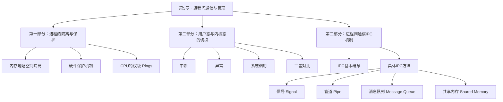

1031

好的，亲爱的同学，你好！


欢迎来到操作系统这门神奇的课程。这一章我们将一起探索“进程间通信与并发控制”，这听起来可能有点复杂，但别担心，我会像一位耐心的向导，带你一步一步揭开它的神秘面紗。我们将从一个有趣的问题开始：在同一台电脑上同时运行的那么多程序（我们称之为“进程”），它们是如何做到互不干扰，又是如何在需要时安全地“交谈”的呢？

这部分内容非常核心，理解了它，你就能明白操作系统是如何像一位“大管家”，有条不紊地管理着计算机中成千上万的活动。让我们一起开始这段奇妙的旅程吧！

---

### **学习路线图**

为了让你有一个清晰的方向，我们这样安排学习：

1.  **第一站：为何需要隔离？（约20分钟）** `[S03-S11]`
    *   我们将理解为什么进程之间必须像住在不同公寓的“邻居”一样，需要墙壁（隔离）来保护各自的隐私和安全。
2.  **第二站：跨越边界的桥梁（约30分钟）** `[S12-S26]`
    *   既然进程被隔离了，那它们想和操作系统这位“大管家”沟通时该怎么办？我们将学习三种神奇的“桥梁”：中断、异常和系统调用。
3.  **第三站：进程间的对话艺术（约40分钟）** `[S27-S56]`
    *   在操作系统的帮助下，进程之间可以安全地交换信息了。我们将学习四种主流的“对话”方式：信号、管道、消息队列和共享内存。
4.  **第四站：动手实践（约15分钟）**
    *   理论结合实践是最好的学习方式！我们会一起分析一段真实的代码，看看“共享内存”这种高效的对话方式是如何实现的。

---

### **核心知识地图**

这门课程的结构就像一棵树，让我们先看看它的主干和分枝：


---

### **第一部分：进程的隔离与安全**

想象一下，你和其他许多人住在一栋公寓楼里。你肯定不希望邻居能随意闯入你的房间，弄乱你的东西，或者偷看你的日记。计算机里的进程也是一样。 `[S03]`

操作系统面临的第一个挑战就是：如何让同时运行的多个进程（比如你正在运行的音乐播放器、浏览器和代码编辑器）互不干扰？如果浏览器崩溃了，总不能让音乐也停下来，对吧？这就是**进程隔离**。

#### **知识卡片：地址空间隔离**

*   **它解决了什么问题（直观）**：
    防止一个程序（进程）意外或恶意地读取或修改另一个程序的数据。就像给每个家庭一套独立的公寓，而不是让所有人住在一个大通铺里。 `[S03]`

*   **前置知识**：
    *   **进程**：一个正在运行的程序的实例。
    *   **内存**：计算机存放数据和指令的地方。

*   **类比/直觉**：
    每个进程都以为自己独占了整个内存。操作系统给了每个进程一张“地图”（虚拟地址空间），这张地图看起来是一块完整且私有的领地。但实际上，操作系统和硬件（比如MMU）会悄悄地把这张地图上的“地点”（虚拟地址）映射到物理内存中一个实际的、可能不连续的“位置”（物理地址）。

*   **正式/官方声明**：
    操作系统为每个进程提供一个独立的、私有的虚拟地址空间。这意味着一个进程产生的地址（逻辑地址/虚拟地址）在自己的空间内是有意义的，但不能直接用来访问其他进程的物理内存。 `[S04, S05]`

*   **实现方式**：

    1.  **早期的段式管理** `[S04]`：
        这是一种比较古老的方法。CPU里有两个特殊的寄存器：**基址寄存器**（段的起始物理地址）和**段长度寄存器**（段的大小）。当进程访问内存时，硬件会自动检查它要访问的逻辑地址是否在 `0` 到 `段长度` 之间。如果越界，就会产生“内存异常”，程序被终止。如果没问题，硬件会把 `逻辑地址 + 基址` 算出的物理地址发给内存。

        ```ascii
        [Fig·S04-1] 段式地址翻译与保护

        CPU                     +------------------+
         |                      |   段长度寄存器   | <--- (例如: 500)
        逻辑地址 (例如: 175)    +------------------+
         |
         +-----> [检查] 是否 <= 500 ? ----(yes)----> [+] ----> 物理地址 (1175)
                                                    ^
                                                    |
                                         +------------------+
                                         |   段基址寄存器   | <--- (例如: 1000)
                                         +------------------+
        ```
        <caption>图 S04-1：硬件通过比较段长度和加上段基址，实现了最基础的内存隔离。</caption>

    2.  **现代的分页管理** `[S06]`：
        现代操作系统普遍使用分页技术。每个进程都有一张或多张**页表**，页表记录了“虚拟页”到“物理页框”的映射关系。操作系统的关键任务是：**确保不会把同一个物理页框同时分配给两个不同进程的页表（除非是用于共享内存）**。这样，即使进程A和进程B都访问地址 `0x1000`，它们的页表会将这个地址映射到完全不同的物理内存位置，从而实现了隔离。

        ```mermaid
        graph TD
            subgraph 进程A
                VA1[虚拟地址空间] --> PT_A[进程A的页表]
            end
            subgraph 进程B
                VA2[虚拟地址空间] --> PT_B[进程B的页表]
            end
            
            PT_A --> PF1[物理页框 1]
            PT_A --> PF3[物理页框 3]
            
            PT_B --> PF2[物理页框 2]
            PT_B --> PF4[物理页框 4]
            
            subgraph 物理内存
                PF1
                PF2
                PF3
                PF4
            end
        ```
        <caption>图 S06-1：不同进程的页表将它们的虚拟地址映射到不同的物理页框，实现隔离。 `[Fig·S06-1]`</caption>

*   **常见陷阱**：
    *   **误解**：虚拟地址空间是真实存在的。
    *   **纠正**：虚拟地址空间只是一个概念模型，一个地址的集合。真正的读写操作都发生在物理内存上，由MMU（内存管理单元）负责翻译。 `[S05]`

*   **一句话总结**：
    操作系统通过为每个进程创建独立的虚拟地址空间，并利用硬件（MMU）进行地址翻译和边界检查，实现了进程间的内存隔离。

*   **自查**：
    1.  （判断题）进程A可以直接修改进程B的内存数据。 (×)
    2.  （选择题）实现进程内存隔离的核心硬件部件是？ (A) CPU (B) MMU (C) 硬盘 (D) 内存条  (B)
    3.  （简答题）请简述分页机制如何实现进程隔离。

#### **知识卡片：CPU特权级 (Protection Rings)**

*   **它解决了什么问题（直观）**：
    不仅要隔离“邻居”（其他进程），还要防止“住户”（用户进程）闯入“物业办公室”（操作系统内核），破坏公共设施。`[S07]` 操作系统保存着所有进程的计费信息、优先级等关键数据，绝不能让普通程序随意修改。

*   **前置知识**：
    *   **操作系统内核（Kernel）**：操作系统的核心部分，负责管理系统资源。
    *   **用户进程（User Process）**：我们日常运行的应用程序。

*   **类比/直觉**：
    想象一个有不同安全等级的区域。最高级是“核心控制室”（内核），只有最高权限的工作人员才能进入。普通访客只能在“公共区域”（用户区）活动。`[S10]` CPU就有一个“状态指示灯”，显示当前代码运行在哪个权限等级。

*   **正式/官方声明**：
    现代CPU架构（如x86）提供了多个权限级别，称为保护环（Protection Rings）。Ring 0是最高权限级，通常为操作系统内核使用。Ring 3是最低权限级，为用户应用程序使用。CPU硬件规定，低权限级别的代码不能执行某些特权指令（如停止整个系统），也不能直接访问高权限级别内存区域。 `[S08, S10]`

*   **关键实现** `[S09]`：
    1.  **CPU当前特权级（CPL）**：CPU的一个内部状态，记录当前正在执行的代码属于哪个Ring。
    2.  **内存页/段的权限位**：在页表项（PTE）或段描述符中，有专门的比特位（如x86 PTE中的 `U/S` 位）标记该内存区域允许哪个级别的代码访问。
    3.  **硬件检查**：当CPU执行一条访存指令时，硬件会自动比较CPL和内存区域的权限位。只有当 `CPL <= 内存权限` 时，访问才被允许，否则会触发硬件异常（通常是段错误），导致程序终止。

    ```ascii
    [Fig·S10-1] x86 保护环模型

          +-----------------+
        /         R         \
      /           i           \
    /             n             \
    |             g             |
    |      0      +-------+     |  <-- 内核 (最高权限)
    |   (Kernel)  |       |     |
    |             | R 1/2 |     |
    \             +-------+     /
      \                       /
        \       Ring 3      /      <-- 应用程序 (最低权限)
          +-----------------+
    ```
    <caption>图 S10-1：x86保护环示意图。Linux/uCore通常只使用Ring 0和Ring 3，实现了内核与用户的严格分离。</caption>

*   **常见陷阱**：
    *   **编程语言的保护是万能的吗？** C++/Java中的 `private`, `protected` 关键字是**编译时**的检查，防止的是程序员的无心之失。但在C/汇编中，可以通过指针操作轻易绕过。`[S07]` 操作系统的保护必须依赖无法绕过的**硬件**机制。

*   **一句话总结**：
    CPU通过硬件实现的特权级（保护环）机制，限制了用户程序的能力，保护了操作系统内核的安全。

*   **自查**：
    1.  （判断题）用户程序（Ring 3）可以执行关机指令。 (×)
    2.  [^1]（选择题）Linux操作系统主要使用哪两个CPU特权级？ (A) Ring 0 & 1 (B) Ring 1 & 2 (C) Ring 0 & 3 (D) Ring 2 & 3 (C)
    3.  （简答题）当一个用户程序试图访问一个仅限内核访问的内存页时，会发生什么？
		1. **触发硬件异常：** CPU的内存管理单元 (MMU) 在检查页表时，会发现当前的用户模式 (User Mode / Ring 3) 权限不足以访问标记为“内核专用” (Supervisor-only) 的内存页。MMU 会立即**阻止**该访问，并触发一个**同步异常 (Exception)**，这通常是一个**页错误 (Page Fault)** 或 **保护错误 (Protection Fault)**。
		2. **陷入内核模式：** CPU 立即**陷入 (Trap)**，将控制权从用户程序转移给操作系统**内核**（进入 Kernel Mode / Ring 0）。
		3. **内核处理并终止程序：** 内核的异常处理程序会分析错误原因，识别出这是一个来自用户程序的非法内存访问（越权访问）。由于这种错误是不可恢复的，内核会**强制终止 (Terminate)** 这个出错的用户程序。
> 		**对用户而言：** 这种现象通常表现为程序崩溃，并报告 **"Segmentation fault" (段错误)** 或 "Access violation" (访问冲突)。
---

### **第二部分：跨越边界的桥梁**

好了，现在我们知道用户进程（Ring 3）和内核（Ring 0）被严格分开了。但用户进程总是需要请求操作系统服务的，比如读文件、创建新进程、联网等，这些操作都必须在内核态（Ring 0）下完成。

那么，一个在Ring 3运行的程序，如何安全、可控地请求Ring 0的服务，并让CPU“切换状态”呢？ `[S11]` 答案是，通过三种由硬件支持的特殊“事件”机制。 `[S12]`

#### **知识卡片：中断、异常、系统调用**

*   **它解决了什么问题（直观）**：
    为处于低权限的“用户”提供一个合法的、受控的途径，去请求“物业”（内核）提供服务，或者在发生意外时向物业“报警”。

*   **前置知识**：
    *   CPU特权级（Ring 0, Ring 3）
    *   PC寄存器（程序计数器，指向下一条要执行的指令）

*   **类比/直觉**：
    *   **中断 (Interrupt)**：像是你家的“门铃”。外部设备（如键盘、网卡）有事找CPU时，就按一下门铃。CPU会停下手头的工作，去看看是谁（处理中断）。这个过程是**异步**的，你不知道门铃何时会响。
    *   **异常 (Exception)**：像是你在家做饭时，“不小心把锅烧糊了”。这是由你正在执行的指令自身引起的内部、意外事件（如除以零、访问非法内存）。这个过程是**同步**的，因为总是在执行到某条出错指令时发生。
    *   **系统调用 (System Call)**：像是你去“物业前台按服务铃”。这是你的程序**主动、有意地**请求内核服务。这个过程也是**同步**的。

*   **正式/官方声明**：
    中断、异常和系统调用是三种将CPU控制权从用户态转移到内核态的核心机制。它们都会打断当前程序的执行流程，CPU根据事件类型，查询一个由操作系统预设好的“地址簿”——**中断向量表（或中断描述符表 IDT）**，找到对应的处理程序（Handler）的地址，然后跳转过去执行。最关键的是，**这个跳转过程由硬件自动完成，并会自动将CPU的特权级从Ring 3提升到Ring 0**。 `[S12, S14]`

*   **三者对比** `[S15, S25]`

| 特性      | 中断 (Hardware Interrupt) | 异常 (Exception)           | 系统调用 (System Call)                |
| :------ | :---------------------- | :----------------------- | :-------------------------------- |
| **源头**  | **外部**：硬件设备（键盘、磁盘、时钟）   | **内部、被动**：执行指令时出错（除零、缺页） | **内部、主动**：应用程序主动请求服务              |
| **同步性** | **异步**：与当前指令无关，随时可能发生   | **同步**：由当前执行的指令引发        | **同步**：由当前执行的指令（如`int`/`ecall`）引发 |
| **处理后** | 返回到被打断的程序，对程序**透明**     | 可能**杀死**程序，或**重新执行**出错指令 | **等待**服务完成，然后返回到下一条指令             |

    `[Fig·S25-1]`

*   **系统调用的实现** `[S17-S21]`：
    操作系统提供了几百个系统调用（如`read`, `write`, `fork`）`[S16]`。如果每个都对应一个中断号，那太浪费了。所以，现代系统通常用一个“总机”式的中断/异常来处理所有系统调用。

    1.  **用户程序**：想调用`read()`？它不会直接执行`read`的内核代码。实际上，C库函数`read()`会把一个代表`read`的**系统调用号**（例如，在x86上是6）`[S17]` 放入指定的寄存器（如`eax`）。
    2.  **触发陷阱**：然后，程序执行一条特殊指令，如 `int 0x80` (x86) 或 `ecall` (RISC-V) `[S17, S19]`。这条指令会产生一个“陷阱”（Trap），这是一种软件触发的异常/中断。
    3.  **内核处理**：CPU权限提升到Ring 0，跳转到内核的通用陷阱处理函数 `[S18, S20]`。
    4.  **分发**：内核的陷阱处理函数检查寄存器（如前面的`eax`），看到系统调用号是6，就在一个叫**系统调用表**的数组里查找第6项，找到真正实现`sys_read()`的内核函数并调用它。
    5.  **返回**：`sys_read()`执行完毕，把返回值放入寄存器，然后内核执行一条特殊指令（如`iret`或`sret`）返回用户态。返回时，CPU权限自动降回Ring 3。

    ```mermaid
    sequenceDiagram
        participant App as 应用程序 (Ring 3)
        participant LibC as C标准库
        participant Kernel as 操作系统内核 (Ring 0)
        participant HW as 硬件 (CPU)

        App->>LibC: 调用 printf("hello")
        LibC->>LibC: 内部调用 write()
        LibC->>App: 1. 将`write`的系统调用号(如5)放入 eax <br/> 2. 将参数放入其他寄存器/栈
        App->>HW: 3. 执行 `int 0x80` 指令
        HW->>HW: 4. **提权至Ring 0**, 保存现场
        HW->>Kernel: 5. 跳转到中断向量表指定的处理函数
        Kernel->>Kernel: 6. 检查 eax, 发现是 5
        Kernel->>Kernel: 7. 查询系统调用表, 调用 sys_write()
        Kernel->>HW: (sys_write 执行 I/O 操作...)
        Kernel->>HW: 8. 执行 `iret` 指令
        HW->>HW: 9. **降权至Ring 3**, 恢复现场
        HW->>App: 10. 返回到 `int 0x80` 的下一条指令
        App->>LibC: 继续执行...
    ```
    <caption>图 S23-1：一次`printf`背后发生的系统调用流程示意图。 `[Fig·S23-1]`</caption>

*   **API与系统调用的关系** `[S22]`：
    我们平时编程很少直接写汇编去触发系统调用。我们用的是`printf`, `fopen`这样的**API (应用程序编程接口)**。这些API函数（通常在C库里）为我们封装了复杂的系统调用细节，使得编程更简单、更具可移植性（如POSIX标准API）。

*   **一句话总结**：
    系统调用是应用程序请求内核服务的**唯一**、**受控**的入口，它通过一个类似软件中断的“陷阱”机制，实现了从用户态到内核态的安全切换。

*   **自查**：
    1.  （判断题）按一下键盘会触发一个系统调用。 (×，是中断)
    2.  （选择题）应用程序通过什么方式来区分它想调用哪个系统调用？ (A) 函数名 (B) 系统调用号 (C) 中断向量号 (D) 内存地址 (B)
    3.  （简答题）为什么系统调用必须通过内核，而不能让用户程序自己实现读硬盘之类的操作？（提示：权限和资源管理）

---

### **第三部分：进程间的对话艺术 (IPC)**

我们已经为进程建立了坚固的“隔离墙”，也开了一扇受控的“大门”（系统调用）与外界沟通。现在，是时候让这些独立的进程互相“对话”了。`[S27]`

**进程间通信（Inter-Process Communication, IPC）** 就是操作系统提供的一套机制，允许进程之间交换数据和同步操作。`[S32]`

#### **IPC 的基本模型**

`[S30, S31]`
*   **直接通信** `[S33]`：通信双方必须明确知道对方的身份（比如进程ID）。就像打电话，你必须知道对方的电话号码。
*   **间接通信** `[S34]`：通过一个中间媒介（如“信箱”）来通信。你把信投进信箱，对方再从信箱取。双方甚至不需要同时存在。操作系统里的**消息队列**就是这样一个“信箱”。

`[S36-S39]`
*   **阻塞 (同步) vs 非阻塞 (异步)**：
    *   **阻塞**：打电话时，对方没接，你得一直**等着**。`send`操作发出后，要等到对方`receive`了才返回；`receive`操作要**等到**有消息才返回。
    *   **非阻塞**：发短信，发完你就可以干别的了，不用管对方看不看。`send`和`receive`操作都会立即返回，不管操作是否真的完成。

#### **知识卡片：信号 (Signal)**

*   **它解决了什么问题（直观）**：
    一种简单的“拍肩膀”式的通知机制，用来告诉另一个进程发生了某个事件。 `[S42]`

*   **类比/直觉**：
    就像裁判出示红牌/黄牌。它不包含复杂信息，只是一种简单的通知（“你犯规了”、“暂停”）。

*   **正式/官方声明**：
    信号是Unix系统中使用的一种异步通知机制。内核或其他进程可以向一个目标进程发送一个信号（如`SIGKILL`表示杀死，`SIGSTOP`表示暂停）。目标进程收到信号后，可以有三种反应：
    1.  **捕获 (Catch)**：执行一个预先注册好的自定义函数（信号处理函数）。
    2.  **忽略 (Ignore)**：什么都不做（某些关键信号如`SIGKILL`不能被忽略）。
    3.  **默认动作**：执行操作系统指定的默认操作，通常是终止进程。

*   **实现流程** `[S43]`
    1.  **注册**：进程通过`signal()`或`sigaction()`系统调用，告诉内核：“如果我收到XX信号，请执行我的YY函数”。
    2.  **发送**：内核或别的进程因为某个事件（如用户按下Ctrl-C，产生`SIGINT`信号）决定向该进程发送信号。这通常只是在进程的PCB（进程控制块）里做一个标记。
    3.  **分发**：[^2]在下次该进程从内核态返回用户态前的一瞬间，内核会检查它的PCB里有没有待处理的信号。如果有，内核会强制修改进程的返回地址，让它返回到之前注册的信号处理函数去执行，执行完再返回到原来被打断的地方。

*   **代码示例解析** `[S44-S46]`
    代码里 `signal(SIGINT, sigproc);` 就是在注册：当收到 `SIGINT` (Ctrl-C) 信号时，请执行 `sigproc` 函数。`for(;;);` 是一个死循环，但当用户按下Ctrl-C时，内核会中断这个循环，去执行`sigproc`，打印信息后再回来继续死循环。

*   **优点**：简单，开销小。
*   **缺点**：能传递的信息量极少，只有一个信号编号，不适合传输复杂数据。

*   **一句话总结**：
    信号是一种轻量级的、用于异步通知的IPC机制。

*   **自查**：
    1.  （判断题）信号可以用来传输一个大文件。 (×)
    2.  （选择题）当一个进程正在执行一个无限循环时，它能否响应一个信号？ (A) 能 (B) 不能 (A)
    3.  （简答题）`SIGKILL`信号有什么特殊之处？

#### **知识卡片：管道 (Pipe)**

*   **它解决了什么问题（直观）**：
    将一个命令的输出，直接“用管子接上”，作为另一个命令的输入。`[S47]`

*   **类比/直觉**：
    就像现实世界中的水管，一端进水，另一端出水。它有方向，容量有限。

*   **正式/官方声明**：
    管道是内核中的一块缓冲区，行为像一个内存文件。它有两个文件描述符，一个用于读，一个用于写。写入管道的数据遵循“先进先出”（FIFO）原则被读取。管道通常用于有亲缘关系（父子）的进程间通信。

*   **关键系统调用** `[S48]`：
    *   `pipe(fd_array)`: 创建一个管道，返回两个文件描述符，`fd_array[0]`是读端，`fd_array[1]`是写端。
    *   `read(fd, ...)`: 从管道读数据。
    *   `write(fd, ...)`: 向管道写数据。

*   **典型应用：`ls | more`** `[S49]`
    1.  Shell进程首先调用 `pipe()` 创建一个管道。
    2.  Shell `fork()` 出一个子进程来执行 `ls`。在这个子进程中，它关闭标准输出（`stdout`，文件描述符1），然后把管道的写端 `fd[1]` 复制到文件描述符1的位置。这样，`ls` 所有打印到“屏幕”的内容，实际上都写进了管道。
    3.  Shell 再 `fork()` 出另一个子进程来执行 `more`。在这个子进程中，它关闭标准输入（`stdin`，文件描述符0），然后把管道的读端 `fd[0]` 复制到文件描述符0的位置。这样，`more` 从“键盘”读取的内容，实际上都是从管道里读出来的。

    ```mermaid
    graph TD
        subgraph shell
            A[ls] -- stdout --> P_Write(管道写端)
            P_Read(管道读端) -- stdin --> B[more]
        end
        P_Write --> KernelBuffer[内核缓冲区] --> P_Read
    ```
    <caption>图 S49-1：`ls | more` 的管道工作原理。 `[Fig·S49-1]`</caption>

*   **优点**：简单易用，符合Unix“一切皆文件”的哲学。
*   **缺点**：
    *   半双工，数据只能单向流动。
    *   只能在有亲缘关系的进程间使用（匿名管道）。
    *   生命周期随进程。

*   **一句话总结**：
    管道是一种基于文件描述符的、单向的、常用于父子进程间的通信机制。

*   **自查**：
    1.  （判断题）管道可以用于网络上两台不同机器的进程通信。 (×)
    2.  （选择题）`pipe()`系统调用创建了几个文件描述符？ (A) 1 (B) 2 (C) 3 (D) 4 (B)
    3.  [^3]（简答题）为什么管道常用于父子进程间？（提示：文件描述符继承）

#### **知识卡片：消息队列 (Message Queue)**

*   **它解决了什么问题（直观）**：
    提供一个公共的“留言板”，任何知道这个留言板位置的进程都可以给它发消息或从中取消息。`[S50]`

*   **类比/直觉**：
    就是一个系统级的链表或队列。它有一个全局唯一的名字（标识符）。进程A可以往队列尾部添加一个“消息结构体”，进程B可以从队列头部取走一个。

*   **正式/官方声明**：
    消息队列是存放在内核中的一个消息链表。它允许一个或多个进程向它写入或读取消息。每个消息队列由一个标识符（key或QID）来唯一标识。与管道不同，它独立于发送和接收进程，即使进程退出了，消息队列及其内容依然存在，直到被显式删除。

*   **关键系统调用** `[S51]`：
    *   `msgget()`: 创建或获取一个消息队列的ID。
    *   `msgsnd()`: 发送一条消息到队列。
    *   `msgrcv()`: 从队列接收一条消息。
    *   `msgctl()`: 控制消息队列（如删除）。

*   **优点**：
    *   支持多对多通信。
    *   独立于进程生命周期。
    *   是真正的“消息”导向，而管道是字节流。

*   **缺点**：
    *   通信不及时，需要轮询。
    *   每个消息有大小限制，整个队列也有总大小限制。

*   **一句话总结**：
    消息队列是一个内核维护的、带标识符的、允许多个进程收发结构化消息的链表。

*   **自查**：
    1.  （判断题）如果发送消息的进程退出了，它发送到消息队列里的消息会立刻消失。 (×)
    2.  （选择题）哪个IPC机制更适合在无亲缘关系的进程间进行通信？ (A) 匿名管道 (B) 消息队列 (B)
    3.  [^4]（简答题）消息队列和管道在数据格式上有什么主要区别？

#### **知识卡片：共享内存 (Shared Memory)**

*   **它解决了什么问题（直观）**：
    在两个进程的地址空间里，都划出一块“公共区域”，这块区域实际上是同一块物理内存。这样，一个进程往里写东西，另一个进程立刻就能看到，无需任何数据拷贝。 `[S52]`

*   **类比/直觉**：
    就像两个办公室共用一个白板。A在上面写字，B马上就能看见。这是最快的沟通方式。

*   **正式/官方声明**：
    共享内存是将同一段物理内存，通过修改页表，同时映射到多个进程的虚拟地址空间中。这使得多个进程可以像访问自己的私有内存一样，直接读写这块共享区域，无需内核介入。它是所有IPC方法中最快的一种。

*   **实现原理** `[S53]`
    操作系统接受一个创建共享内存的请求后，会分配一块物理内存。然后，任何想要访问这块内存的进程，都可以请求将它“挂载”（attach）到自己的虚拟地址空间。操作系统会修改这个进程的页表，建立一个从某段虚拟地址到这块物理内存的映射。

    ```ascii
    [Fig·S53-1] 共享内存实现原理

    进程 A 虚拟地址空间          进程 B 虚拟地址空间
    +---------------+             +---------------+
    | ...           |             | ...           |
    | [虚拟地址 M]  | ---+      +--- | [虚拟地址 N]  |
    | ...           |    |      |    | ...           |
    +---------------+    |      |    +---------------+
          |              |      |          |
      进程A页表          |      |      进程B页表
          |              |      |          |
          v              v      v          v
    +-----------------------------------------------+
    |           同一块物理内存 (共享段)              |
    +-----------------------------------------------+
    ```
    <caption>图 S53-1：不同进程的页表项都指向了同一块物理内存，实现了内存共享。</caption>

*   **关键系统调用** `[S54]`：
    *   `shmget()`: 创建或获取一个共享内存段的ID。
    *   `shmat()`: 将共享内存段附加（映射）到当前进程的地址空间。
    *   `shmdt()`: 将共享内存段从当前进程分离。
    *   `shmctl()`: 控制共享内存段（如删除）。

*   **优点**：
    *   **极快**。数据交换无需在用户态和内核态之间来回复制。

*   **缺点**：
    *   **不提供同步机制**。如果两个进程同时写共享内存，会产生数据竞争和混乱。必须使用其他工具（如**信号量、互斥锁**）来协调访问，这增加了编程的复杂性。 `[S52]`

*   **一句话总结**：
    共享内存是通过映射同一物理内存到多个进程空间来实现的最快IPC，但需要程序员自己处理同步问题。

*   **自查**：
    1.  （判断题）使用共享内存通信时，每次读写数据都需要一次系统调用。 (×)
    2.  （选择题）哪种IPC机制的速度最快？ (A) 管道 (B) 信号 (C) 消息队列 (D) 共享内存 (D)
    3.  （简答题）使用共享内存时，为什么必须关注“同步”问题？

---

### **动手实践：共享内存代码解析**

`[S55]` 这张幻灯片给出了一个使用共享内存的C代码片段。让我们把它变成两个可以独立编译运行的程序：一个写入者（`writer.c`）和一个读取者（`reader.c`），这样更能体现IPC的本质。

**1. 完整可运行代码**

首先，我们需要一个共享的头文件 `shared.h` 来定义共享结构。

```c
// shared.h
#ifndef SHARED_H
#define SHARED_H

#define SHARED_KEY 1234 // 共享内存的key

struct shared_use_st {
    int written_by_you; // 作为一个简单的同步标志
    char some_text[256];
};

#endif
```

**写入者: `writer.c`** (向共享内存写入数据)

```c
// writer.c (共享内存的写入进程)

#include <stdio.h>     // 标准输入输出库 (printf, perror, fgets, stdin)
#include <stdlib.h>    // 标准库 (exit, EXIT_FAILURE)
#include <string.h>    // 字符串操作库 (strncpy, strncmp)
#include <sys/shm.h>   // 共享内存函数库 (shmget, shmat, shmdt)
#include <unistd.h>    // POSIX 标准库 (sleep)
#include "shared.h"    // 包含共享结构体定义和 KEY

int main() {
    int shmid;                  // 共享内存标识符 (Shared Memory ID)
    void *shared_memory = NULL; // 指向共享内存的通用指针 (初始为 NULL)
    
    // `shared_stuff` 是一个指向我们定义的共享结构体的指针。
    // 我们将通过它来结构化地访问共享内存区域。
    struct shared_use_st *shared_stuff;

    // --- 步骤 1: 创建或获取共享内存 ---
    
    // shmget(key, size, flags)
    // (key_t)SHARED_KEY: 共享内存的键，来自 shared.h。内核通过这个唯一的键来识别共享内存段。
    // sizeof(struct shared_use_st): 申请的共享内存大小，正好是我们的结构体大小。
    // 0666: 共享内存的访问权限 (类似文件权限，所有人可读写)。
    // IPC_CREAT: 如果键对应的共享内存不存在，则创建它；如果存在，则直接打开。
    shmid = shmget((key_t)SHARED_KEY, sizeof(struct shared_use_st), 0666 | IPC_CREAT);
    
    // 检查 shmget 是否失败。如果 shmid == -1，表示出错。
    if (shmid == -1) {
        perror("shmget failed"); // perror 会打印错误信息，如 "Permission denied"
        exit(EXIT_FAILURE);     // 退出程序
    }

    // --- 步骤 2: 映射共享内存到本进程的地址空间 ---

    // shmat(shmid, addr, flags)
    // shmid: 要映射的共享内存标识符。
    // NULL (addr): 让内核自动选择一个合适的地址来映射。
    // 0 (flags): 默认标志 (例如，非只读)。
    // 返回值是映射到本进程地址空间中的起始地址 (void*)。
    shared_memory = shmat(shmid, NULL, 0);
    
    // 检查 shmat 是否失败。失败时返回 (void*)-1。
    if (shared_memory == (void *)-1) {
        perror("shmat failed");
        exit(EXIT_FAILURE);
    }
    
    printf("Writer attached shared memory at %p\n", shared_memory);

    // --- 步骤 3: 使用共享内存 ---

    // 将内核返回的通用 void* 指针强制转换为我们定义的结构体指针
    // 这样我们就可以像访问本地结构体一样访问共享内存
    shared_stuff = (struct shared_use_st *)shared_memory;
    
    // 初始化同步标志。
    // `written_by_you` 是一个简单的同步机制 (类似一个锁或信号量)：
    // 0: 表示读者(reader)已经读取完毕，写入者(writer)可以写入新数据。
    // 1: 表示写入者(writer)已经写入了新数据，读者(reader)可以读取。
    // 初始设为 0，允许 writer 马上开始第一次写入。
    shared_stuff->written_by_you = 0; 

    char buffer[BUFSIZ]; // BUFSIZ 是 <stdio.h> 中定义的一个缓冲区大小 (通常 > 256)

    // 进入主循环，不断读取用户输入并写入共享内存
    while (1) {
        
        // --- 同步检查：等待读者读取 ---
        // 这是一个“忙等待” (Busy-Waiting) 或“轮询” (Polling)
        // 只要 `written_by_you` 标志为 1，就表示读者还没有读取上次写入的数据。
        // 写入者必须在此循环等待。
        while (shared_stuff->written_by_you == 1) {
            printf("Writer waiting for reader...\n");
            // sleep(1) 至关重要：
            // 1. 避免 CPU 空转，浪费资源。
            // 2. 释放 CPU，让操作系统有机会调度其他进程 (尤其是读者进程) 来运行。
            sleep(1); 
        }

        // --- 写入新数据 ---
        
        // 轮到写入者了 (written_by_you == 0)
        printf("Enter some text: ");
        // 从标准输入 (stdin) 读取一行数据到 buffer 中
        // fgets 比 gets 安全，因为它限制了最大读取长度 (BUFSIZ)
        fgets(buffer, BUFSIZ, stdin); 

        // 将 buffer 中的数据复制到共享内存的 some_text 字段
        // strncpy 比 strcpy 安全，它限制了最大复制长度，防止缓冲区溢出
        strncpy(shared_stuff->some_text, buffer, sizeof(shared_stuff->some_text));
        
        // 设置标志为 1，通知读者：“嘿，新数据准备好了，你可以来读了！”
        shared_stuff->written_by_you = 1; 

        // 检查退出条件
        // 如果用户输入的前三个字符是 "end"，则跳出循环
        if (strncmp(buffer, "end", 3) == 0) {
            break;
        }
    }

    // --- 步骤 4: 分离共享内存 ---

    // shmdt(addr)
    // 解除本进程地址空间与共享内存的映射关系。
    // 注意：这只是“分离”，并不会删除共享内存段本身。
    // 删除共享内存段需要使用 shmctl(shmid, IPC_RMID, NULL)，通常由 reader 或一个专门的清理程序来做。
    if (shmdt(shared_memory) == -1) {
        perror("shmdt failed");
        exit(EXIT_FAILURE);
    }
    
    printf("Writer detached.\n");
    return 0;
}
```

**读取者: `reader.c`** (从共享内存读取数据)

```c
// reader.c (共享内存的读取进程)

#include <stdio.h>     // 标准输入输出库 (printf, perror)
#include <stdlib.h>    // 标准库 (exit, EXIT_FAILURE)
#include <string.h>    // 字符串操作库 (strncmp)
#include <sys/shm.h>   // 共享内存函数库 (shmget, shmat, shmdt, shmctl)
#include <unistd.h>    // POSIX 标准库 (sleep)
#include "shared.h"    // 包含共享结构体定义和 KEY

int main() {
    int shmid;                  // 共享内存标识符 (Shared Memory ID)
    void *shared_memory = NULL; // 指向共享内存的通用指针
    
    // `shared_stuff` 指针，用于结构化地访问共享内存
    struct shared_use_st *shared_stuff;

    // --- 步骤 1: 获取已存在的共享内存 ---
    
    // shmget(key, size, flags)
    // (key_t)SHARED_KEY: 共享内存的键，必须与 writer.c 中的 KEY 相同。
    // sizeof(struct shared_use_st): 共享内存的大小，必须与创建时的大小一致。
    // 0666: 访问权限。
    // 注意：这里没有 `IPC_CREAT` 标志。
    // 这意味着如果 KEY 对应的共享内存不存在，shmget 会失败。
    // 这正是我们想要的，因为 reader 应该在 writer 创建了内存之后再运行。
    shmid = shmget((key_t)SHARED_KEY, sizeof(struct shared_use_st), 0666);
    
    // 检查 shmget 是否失败
    if (shmid == -1) {
        perror("shmget failed"); // 常见错误："No such file or directory" (如果 writer 未运行)
        exit(EXIT_FAILURE);
    }

    // --- 步骤 2: 映射共享内存到本进程的地址空间 ---

    // shmat(shmid, addr, flags)
    // 将内核中的共享内存段附加(attach)到本进程的虚拟地址空间。
    // 返回值是映射到本进程空间中的起始地址。
    shared_memory = shmat(shmid, NULL, 0);
    if (shared_memory == (void *)-1) {
        perror("shmat failed");
        exit(EXIT_FAILURE);
    }
    
    printf("Reader attached shared memory at %p\n", shared_memory);

    // 将 void* 指针转换为结构体指针，以便访问
    shared_stuff = (struct shared_use_st *)shared_memory;

    // --- 步骤 3: 循环读取共享内存 ---

    // 进入主循环，不断检查共享内存中的标志位
    while (1) {
        
        // --- 同步检查：等待写入者写入 ---
        // `written_by_you` 是同步标志：
        // 1: 表示 writer 已经写入了新数据，reader 可以读取。
        // 0: 表示 reader 已经读取完毕，writer 可以写入。
        
        // 检查是否有新数据
        if (shared_stuff->written_by_you == 1) {
            
            // --- 读取数据 ---
            // 直接从共享内存结构体中读取数据并打印
            // 注意：writer 写入时包含了换行符，所以这里用 %s 打印会自动换行
            printf("Reader read: %s", shared_stuff->some_text);
            
            // --- 标记已读 ---
            // 关键的同步步骤：
            // 将标志位设回 0，通知 writer：“嘿，我已经读完了，你可以写下一条数据了。”
            shared_stuff->written_by_you = 0;
            
            // 检查退出条件
            // 如果读取到的内容是 "end"，则跳出循环
            if (strncmp(shared_stuff->some_text, "end", 3) == 0) {
                break;
            }
        } else {
            // --- 忙等待优化 ---
            // 如果 `written_by_you` 仍为 0，表示 writer 还没写入新数据。
            // 此时 reader 不应空转 (不停地检查 if)，这会浪费 CPU。
            // sleep(1) 让 reader 进程休眠 1 秒，把 CPU 让给其他进程 (尤其是 writer)。
            sleep(1);
        }
    }

    // --- 步骤 4: 分离共享内存 ---

    // shmdt(addr)
    // 解除本进程与共享内存的映射关系。
    if (shmdt(shared_memory) == -1) {
        perror("shmdt failed");
        exit(EXIT_FAILURE);
    }

    // --- 步骤 5: (可选但推荐) 删除共享内存 ---

    // 共享内存段在创建后会一直存在于内核中，即使所有进程都与之分离。
    // 它必须被显式删除，否则会造成资源泄漏。
    // shmctl(shmid, cmd, buf) 是一个共享内存的控制函数。
    // cmd = IPC_RMID: 表示立即删除这个共享内存段。
    // 注意：即使有其他进程仍附加着此内存，系统也会标记它为“待删除”。
    // 当最后一个附加的进程与之分离(shmdt)后，内核会自动清理它。
    // 通常，由 reader 或一个专门的清理程序来执行此操作。
    if (shmctl(shmid, IPC_RMID, 0) == -1) {
        perror("shmctl(IPC_RMID) failed");
        exit(EXIT_FAILURE);
    }

    printf("Reader detached and removed shared memory.\n");
    return 0;
}
```

**如何编译和运行：**

1.  `gcc -o writer writer.c`
2.  `gcc -o reader reader.c`
3.  打开一个终端，运行 `./writer`
4.  打开另一个终端，运行 `./reader`
5.  在 `writer` 终端输入文字并回车，你将看到 `reader` 终端会把它打印出来。

**2. 关键代码解读**

*   `shmget((key_t)1234, ..., 0666 | IPC_CREAT)`:
    *   `key_t`: 一个魔术数字，像一个“接头暗号”，让不同进程能找到同一个共享内存段。
    *   `sizeof(...)`: 指定共享内存的大小。
    *   `IPC_CREAT`: 如果这个共享内存不存在，就创建它。写入者通常会用这个标志。
*   `shmat(shmid, NULL, 0)`:
    *   `shmid`: `shmget`返回的ID。
    *   `NULL`, `0`: 让内核自动选择一个合适的虚拟地址来映射。
    *   返回值就是这段共享内存在当前进程里的起始虚拟地址。
*   `shared_stuff->written_by_you = ...`:
    *   这就是一个非常简单的**同步**机制！通过这个标志位，读写双方轮流操作共享内存，避免了冲突。在真实项目中，我们会用更可靠的信号量或互斥锁。
*   `shmdt(shared_memory)`:
    *   断开映射，此后该进程不能再访问这块内存了。
*   `shmctl(shmid, IPC_RMID, 0)`:
    *   彻底删除内核中的共享内存段。这非常重要！如果不删除，它会一直留在系统中，直到系统重启。通常由最后一个使用它的进程负责清理。`[S56]`

---

### **常见陷阱与比较**

*   **资源释放问题** `[S56]`：
    *   像管道、信号这种与进程生命周期紧密相关的资源，在进程退出时通常会被内核自动回收。
    *   但像**消息队列**和**共享内存**，它们是**系统级**的资源，独立于进程。如果创建他们的进程退出了，而没有显式删除它们（用`msgctl`或`shmctl`），它们会**一直存在于内核中**，造成资源泄漏。这就像你在公园租了一个储物柜，用完没退租，它就一直被你占着。

*   **四种IPC方法横向比较**

| 特性         | 信号 (Signal)              | 管道 (Pipe)          | 消息队列 (Message Queue)   | 共享内存 (Shared Memory)      |
| :----------- | :------------------------- | :------------------- | :----------------------- | :---------------------------- |
| **数据量**   | 极小 (仅一个编号)          | 较大 (字节流)        | 中等 (结构化消息)        | 极大 (整块内存)               |
| **速度**     | 快                         | 慢 (2次拷贝)         | 慢 (2次拷贝)             | **最快** (0次拷贝)            |
| **通信关系** | 任意                       | 父子/亲缘            | 任意                     | 任意                          |
| **同步**     | 无                         | 阻塞读写提供隐式同步 | 无                       | **必须程序员自己实现**        |
| **复杂度**   | 简单                       | 简单                 | 较复杂                   | 复杂 (因同步问题)             |

    `[Fig·S41-1]`

---

### **快速复习卡片**

**三句话极简版**

1.  为保证安全，操作系统用硬件（MMU、特权级）将进程互相隔离，并把内核保护起来。
2.  用户程序通过“系统调用”（一种软件中断）来请求内核服务，这是穿过隔离墙的唯一合法通道。
3.  进程间通信(IPC)有多种方式，共享内存最快但需要手动同步，而管道、消息队列等方式由内核管理，更简单但有性能开销。

**十句话紧凑版**

1.  多进程环境下的首要问题是**安全**，通过**地址空间隔离**防止进程互相干扰。`[S04-S06]`
2.  硬件通过**基址/界限寄存器**或**页表**机制，确保进程的内存访问不越界。`[S04, S06]`
3.  CPU的**特权级**（Ring 0/3）将系统分为**内核态**和**用户态**，保护OS不被应用程序破坏。`[S10]`
4.  用户态到内核态的切换由硬件控制，主要通过**中断**（外部设备）、**异常**（代码错误）和**系统调用**（主动请求）三种方式。`[S12]`
5.  **系统调用**是应用程序获取OS服务的编程接口，通过`int 0x80`或`ecall`等指令触发。`[S17, S19]`
6.  **信号**(Signal)是一种轻量级异步通知机制，用于传递简单事件。`[S42]`
7.  **管道**(Pipe)是基于文件描述符的单向字节流，常用于重定向父子进程的输入输出。`[S47]`
8.  **消息队列**(Message Queue)是内核维护的、允许多进程收发消息的公共队列。`[S50]`
9.  **共享内存**(Shared Memory)通过映射同一物理内存到多进程空间，实现最快的IPC。`[S52]`
10. 共享内存本身不提供同步，必须配合**信号量**等机制使用，且IPC资源（特别是消息队列和共享内存）需要**显式释放**。`[S54, S56]`

---
### **一页纸速查表**

| 概念                       | 核心思想                            | 关键点/系统调用                                       | 优点/缺点                                               |
| :----------------------- | :------------------------------ | :--------------------------------------------- | :-------------------------------------------------- |
| **进程隔离**                 | 每个进程拥有独立的虚拟地址空间。                | MMU, 页表, 段表, U/S权限位                            | **(+)** 安全、稳定 <br> **(-)** 进程间通信变复杂                 |
| **CPU特权级**               | 硬件区分内核(Ring 0)和用户(Ring 3)的执行权限。 | CPL寄存器, 特权指令                                   | **(+)** 保护内核，防止恶意或错误的用户代码破坏系统                       |
| **中断 (Interrupt)**       | 外部硬件设备的异步请求。                    | 硬件触发, 异步, 对程序透明                                | **(+)** 实现了并发处理I/O                                  |
| **异常 (Exception)**       | 当前指令执行失败时的同步事件。                 | 除零, 缺页中断, 非法指令, 同步                             | **(+)** 让OS能处理程序错误和实现虚拟内存等高级功能                      |
| **系统调用 (System Call)**   | 用户程序请求内核服务的主动、同步机制。             | `int 0x80`, `syscall`, `ecall`, 系统调用号, 系统调用表   | **(+)** 提供了受控、统一的内核服务入口                             |
| **信号 (Signal)**          | 简单的异步通知。                        | `signal()`, `kill()`, `SIGKILL`, `SIGINT`      | **(+)** 开销小，适合事件通知 <br> **(-)** 信息量少                |
| **管道 (Pipe)**            | 内核缓冲区的单向字节流。                    | `pipe()`, `read()`, `write()`, 文件描述符继承         | **(+)** 简单，符合Unix哲学 <br> **(-)** 半双工，仅限亲缘进程         |
| **消息队列 (Message Queue)** | 内核维护的公共消息链表。                    | `msgget()`, `msgsnd()`, `msgrcv()`, `msgctl()` | **(+)** 任意进程通信，解耦 <br> **(-)** 两次数据拷贝，有大小限制         |
| **共享内存 (Shared Memory)** | 多进程映射同一块物理内存。                   | `shmget()`, `shmat()`, `shmdt()`, `shmctl()`   | **(+)** **最快**，无数据拷贝 <br> **(-)** 需要**外部同步机制**，编程复杂 |

[^1]: 您好，(C) 选项是正确的。
	
	这是一个关于 x86 架构（被 Intel 和 AMD 广泛使用）下操作系统如何利用 CPU 保护环（Privilege Rings）的经典问题。
	
	### 为什么是 Ring 0 和 Ring 3？
	
	CPU 的保护环（Rings）是一种安全机制，用于隔离和保护不同级别的软件。Ring 0 是最高特权级（权限最大），Ring 3 是最低特权级（权限最小）。
	
	Linux（以及 Windows、macOS 等现代主流操作系统）在 x86 架构上主要采用了**两级模型**：
	
	1. **Ring 0：内核模式 (Kernel Mode)**
	    
	    - 这是最高权限级别。
	        
	    - **Linux 内核**（操作系统的核心）运行在 Ring 0。
	        
	    - 这包括了内存管理、进程调度、设备驱动程序以及处理系统调用的代码。
	        
	    - 运行在 Ring 0 的代码可以执行所有 CPU 指令，并能访问所有硬件和内存地址。
	        
	2. **Ring 3：用户模式 (User Mode)**
	    
	    - 这是最低权限级别。
	        
	    - **所有的用户应用程序**都运行在 Ring 3。
	        
	    - 这包括您的 shell、网页浏览器、文本编辑器、游戏以及您自己编写的任何程序。
	        
	    - 运行在 Ring 3 的代码受到严格限制。它不能直接访问硬件（如网卡、磁盘），也不能访问内核或其他进程的内存。
	        
	    - 当应用程序需要执行特权操作时（例如读取文件或发送网络数据包），它必须通过 **系统调用 (System Call)** 向 Ring 0 的内核“请求”服务。
	        
	
	### 为什么不用 Ring 1 和 Ring 2？
	
	虽然 x86 架构提供了四个环（Ring 0, 1, 2, 3），但 Linux（和 Windows）**实际上并未使用 Ring 1 和 Ring 2**。
	
	主要原因有两个：
	
	1. **简洁性：** "内核" vs "用户" 这种两级模型已经被证明足够健壮、安全且易于管理。
	    
	2. **可移植性：** 许多其他的 CPU 架构（如 ARM、RISC-V）本身就没有四个特权级，它们通常也只提供两种或三种模式（例如 RISC-V 中的 U-Mode, S-Mode, M-Mode）。Linux 为了保持其在不同平台间的可移植性，其核心设计就依赖于这种"用户/内核"的二元分离，而不是 x86 特有的四个环。
	    
	
	因此，Linux 只使用了 x86 提供的最高特权（Ring 0）和最低特权（Ring 3）。
	
	操作系统内核不是S模式吗？
	
	您的观察非常敏锐！您没有记错，但您是将 **两种不同 CPU 架构** 的特权级模型搞混了。
	
	简单来说：
	
	1. 您上一题问的 **Ring 0 / Ring 3** 是 **x86 架构** (Intel/AMD) 的概念。
	    
	2. 您现在提到的 **S 级 (S-Mode)** 是 **RISC-V 架构** 的概念。
	    
	
	它们虽然目标相似（保护系统），但在设计上有所不同。
	
	---
	
	### 1. x86 架构 (如 Intel/AMD)
	
	- **模型：** 保护环 (Protection Rings)
	    
	- **级别：** Ring 0, 1, 2, 3
	    
	- **Linux 如何使用：**
	    
	    - **Ring 0 (内核模式):** 拥有**最高权限**。Linux 内核运行在这里。它可以执行所有指令，**并能直接访问所有硬件**。
	        
	    - **Ring 3 (用户模式):** 拥有**最低权限**。用户应用程序运行在这里。
	        
	
	在 x86 上，"内核" (Ring 0) 就是"上帝"，它拥有至高无上的权力，可以直接管理硬件。
	
	### 2. RISC-V 架构
	
	- **模型：** 特权模式 (Privilege Modes)
	    
	- **级别：**
	    
	    - **M-Mode** (Machine Mode, 机器模式)
	        
	    - **S-Mode** (Supervisor Mode, 监管者模式)
	        
	    - **U-Mode** (User Mode, 用户模式)
	        
	- **Linux 如何使用：**
	    
	    - **U-Mode：** 对应 x86 的 **Ring 3**。运行用户应用程序。
	        
	    - **S-Mode：** 对应 x86 的 **Ring 0**。运行 **Linux 内核**。
	        
	    - **M-Mode：** **权限高于 S-Mode**。这是 RISC-V 中真正的"上帝"。它通常只运行一小段代码（称为 **SBI**，或引导加载程序），负责最底层的硬件初始化。
	        
	
	### 解答您的困惑：
	
	您的问题是：“S级...不应该不能直接访问硬件吗？”
	
	**回答：S 级 (内核) _可以_ 直接访问硬件，但有一个前提。**
	
	在 RISC-V 中，M-Mode 才是权限最高的。系统启动时，首先进入 M-Mode。
	
	M-Mode 的**主要职责之一**就是进行初始设置，然后把系统的大部分控制权（包括对硬件的访问权）**“委托” (Delegate)** 给 S-Mode。
	
	> 这就像 M-Mode 是董事长，它拥有公司的所有权。
	> 
	> S-Mode (内核) 是 CEO。
	> 
	> 董事长 (M-Mode) 上任后，签署一系列文件（设置 `medeleg`, `mideleg` 等 CSR），授权 CEO (S-Mode) 去管理公司的日常运营（访问内存、I/O 设备等）。
	> 
	> 一旦授权完成，CEO (S-Mode) 确实就可以“直接”去管理这些硬件资源了，而不需要事事都请示董事长 (M-Mode)。
	
	**总结对比：**
	
	|**架构**|**用户程序 (最低权限)**|**操作系统内核**|**最高权限 (及硬件访问)**|
	|---|---|---|---|
	|**x86**|**Ring 3**|**Ring 0**|**Ring 0** (内核自己就是最高权限)|
	|**RISC-V**|**U-Mode**|**S-Mode**|**M-Mode** (M-Mode 授权 S-Mode 去访问硬件)|
	
	所以，您的两个记忆点都是正确的，只是它们分别属于两个不同的体系结构：
	
	- 在 x86 上，内核在 **Ring 0**，它是最高权限，能访问硬件。
	    
	- 在 RISC-V 上，内核在 **S-Mode**，它**不是**最高权限（M-Mode 才是），但 M-Mode 会授权它去访问绝大部分硬件。

[^2]: 这是一个非常深刻的问题，触及了操作系统设计的核心——**特权级隔离**与**状态转换**。
	
	你提供的描述非常准确。选择在“内核态返回用户态的一瞬间”来检查和分发信号，是操作系统综合考虑**安全性、效率和实现复杂度**后得出的最优解。
	
	原因可以归纳为以下几点：
	
	### 1. 核心原因：安全与特权级隔离
	
	这是最重要的一点。
	
	- **信号处理函数是“用户态代码”**：无论是你通过 `sigaction()` 注册的自定义函数，还是系统提供的默认动作，它们最终都属于用户进程的逻辑，必须在**用户态**（User Mode）下运行。
	    
	- **内核态是“特权态”**：内核（Kernel Mode）运行着操作系统的核心代码，拥有最高权限，可以直接访问所有硬件和内存。
	    
	- **严格隔离**：操作系统必须保证**任何用户态代码都不能在内核态运行**。如果允许用户代码（信号处理函数）在内核态执行，那么一个有缺陷或恶意的信号处理函数就能轻易访问到内核数据、修改其他进程的内存，甚至让整个系统崩溃。
	    
	
	因此，内核在“收到”信号时（仅仅是在PCB上做个标记），并不能立即执行它，因为它当前正处于内核态。它必须等待一个合适的时机，**安全地退回到用户态**，才能把执行权交给用户态的信号处理函数。
	
	### 2. 理想时机：“内核态的出口”
	
	既然必须在用户态执行，那么什么时候是“交棒”的最好时机呢？
	
	进程从用户态切换到内核态，主要途径有三种：
	
	1. **系统调用（System Call）**：进程主动请求内核服务（如 `read`, `write`）。
	    
	2. **中端（Interrupt）**：外部硬件事件（如键盘输入、磁盘IO完成）。
	    
	3. **异常（Exception）**：进程执行出错（如除零、缺页中断）。
	    
	
	无论哪种情况，内核处理完这些事务后，**“返回用户态”是它唯一的、必然的归宿**。
	
	这个“返回的瞬间”是一个完美的“检查点”：
	
	- **内核任务已完成**：此时，内核已经完成了它本次进入内核态的本职工作（比如 `read` 数据已经读完，中断已经处理完毕）。内核自身处于一个“干净”和“安全”的状态。
	    
	- **即将交还控制权**：内核正准备把CPU的控制权交还给用户进程。
	    
	- **控制流的“咽喉”**：这是内核在返回用户空间之前，**最后一次**有机会检查进程状态并“动手脚”的地方。
	    
	
	### 3. 高效的实现方式（“控制流劫持”）
	
	正如你所说，内核在这一刻会“修改进程的返回地址”。这个操作本身就解释了为什么是这个时机：
	
	1. **准备返回**：内核在处理完系统调用或中断后，会从内核栈中恢复进程的上下文（CPU寄存器、程序计数器PC等），准备 `iret` (Interrupt Return) 或 `sysret` (System Call Return) 返回用户态。
	    
	2. **检查信号**：在执行 `iret`/`sysret` 之前，内核会检查PCB中的信号标记。
	    
	3. **“偷梁换柱”**：如果发现有信号需要“捕获”，内核会**“篡改”**它正准备恢复的上下文：
	    
	    - 它**强制修改程序计数器（PC）**，使其指向你注册的**信号处理函数**的地址。
	        
	    - 它还会在进程的**用户态堆栈**上构建一个新的栈帧，保存当前被中断的上下文（即“原来准备返回的地方”），以便信号处理函数执行完毕后能正确返回。
	        
	
	这个“篡改”动作，必须在内核态（高权限）下完成，且必须在即将返回用户态（目标是用户地址）的这一刻执行。
	
	---
	
	### 总结：一个比喻
	
	你可以把这个过程想象成一个员工（**进程**）和他的经理（**内核**）：
	
	1. **系统调用**：员工走进经理办公室（**进入内核态**），要求经理审批一份文件（**执行系统调用**）。
	    
	2. **信号发送**：在员工汇报期间，经理的秘书在员工的工位上（**PCB**）贴了一张便条（**标记信号**），通知他去开个紧急会议（**执行信号处理函数**）。
	    
	3. **内核态执行**：经理（内核）不能在自己审批文件（内核态关键操作）的中途让员工离开，这会打乱经理的工作。
	    
	4. **返回的瞬间**：当经理审批完毕，员工正要走出办公室门（**即将返回用户态**）的那一刻。
	    
	5. **分发信号**：经理叫住他：“你先别回自己工位（原定返回地址），先去A会议室（信号处理函数地址）开会。开完会（处理完信号）再回工位（原始地址）。”
	    
	
	这个“办公室门口”就是内核态返回用户态的“一瞬间”，这是经理（内核）安全、高效地重定向员工（进程）工作流的唯一时机。
	
	---
	
	我能帮你更深入地了解特定信号（如 `SIGKILL` 和 `SIGSTOP` 为什么不能被捕获）吗？

[^3]: 简单来说，核心原因是**文件描述符继承**机制。
	
	1. 当父进程调用 `pipe()` 创建一个匿名管道时，它会获得两个文件描述符：一个用于读取（`fd[0]`），一个用于写入（`fd[1]`）。
	    
	2. 当父进程调用 `fork()` 创建子进程时，子进程会**继承父进程所有打开的文件描述符的副本**。
	    
	3. 这意味着，此时父子进程都拥有指向**同一个内核管道**的读写描述符。
	    
	4. 之后，它们各自关闭不需要的一端（例如，父进程关闭读，子进程关闭写），就可以建立一个单向的数据流。
	    
	
	这种机制使得匿名管道成为父子进程（或有亲缘关系的进程）之间进行通信最简单、最高效的方式之一，因为它们无需通过文件系统或其他命名方式来“找到”对方。

[^4]: 主要区别在于：
	
	1. **管道 (Pipe)**：传输的是**字节流 (Byte Stream)**。
	    
	    - 数据是连续的、无格式的，没有“消息边界”的概念。
	        
	    - 写入 100 字节，读取方可以一次读 10 字节，再读 90 字节。
	        
	2. **消息队列 (Message Queue)**：传输的是**消息 (Message)**。
	    
	    - 数据被组织成一个个独立的、有边界的数据单元（即消息）。
	        
	    - 系统会**保留消息的边界**。写入一个 100 字节的消息，读取方必须一次性完整地读走这 100 字节。
