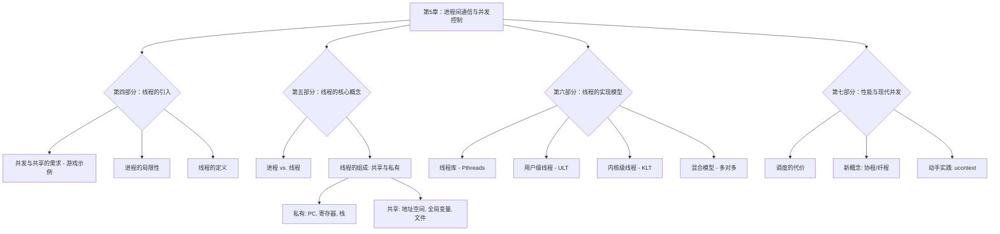

当然！非常乐意为你继续讲解接下来的内容。

我们在上一部分学习了进程是如何被安全地隔离开的，以及它们如何通过“系统调用”这座桥梁与内核沟通，并利用IPC机制进行“对话”。但你可能会发现，像共享内存这样的高效通信方式，虽然快，但设置起来还是有些繁琐。而且，有时候我们一个程序内部就有很多事情想“同时”做，比如一个游戏里，既要移动玩家，又要控制敌人，还要播放动画。如果为每个任务都创建一个独立的、重量级的进程，那开销也太大了。 `[S06]`

有没有一种更“轻便”的方式，让一个程序内的多个任务既能并发执行，又能轻松地共享数据呢？

答案就是——**线程（Thread）**。让我们一起进入这个更微观、更高效的并发世界吧！

---

### **学习路线图 (续)**
 
5.  **第四站：为何需要线程？（约15分钟）** `[S03-S07]`
    *   通过一个生动的游戏例子，理解在单个进程内实现并发的需求。
6.  **第五站：深入理解线程（约25分钟）** `[S17-S22]`
    *   我们将精确解剖线程，看看它和进程到底有什么不同，以及线程内部哪些东西是自己独有的，哪些是和“室友”共享的。
7.  **第六站：线程的实现模型（约25分钟）** `[S10-S16, S23-S24]`
    *   线程是如何被创造和管理出来的？我们将探索两种主要模式：完全由用户程序管理的“用户级线程”，和由操作系统内核管理的“内核级线程”。
8.  **第七站：性能与前沿（约15分钟）** `[S27-S31]`
    *   线程切换不是免费的午餐，它也有开销。我们将探讨其性能代价，并了解比线程更轻的“协程”和“纤程”等现代并发概念。

---

### **核心知识地图 (续)**



---

### **第四部分：线程——更轻量的并发**

#### **一个游戏开发者的烦恼 `[S04, S05]`**

想象一下，我们在开发一款经典的坦克大战游戏。为了让游戏生动起来，需要同时处理很多事情：

*   **玩家坦克**：响应你的键盘输入并移动。
*   **敌方坦克**：按照AI算法自主移动和开火。
*   **子弹**：在屏幕上持续飞行。
*   **爆炸效果**：击中目标后播放一小段动画。
*   **背景音乐**：持续播放。

这些任务都有自己的逻辑，需要“同时”运行。更重要的是，它们需要**大量共享数据**：
*   所有坦克和子弹都需要在同一个**游戏地图**（一块内存）上移动。
*   它们都需要在同一个**屏幕画布**（另一块内存）上绘制自己。
*   需要不断进行**碰撞检测**，判断子弹是否击中了坦克，这需要读取所有对象的位置信息。

如果我们用多进程来实现，每个坦克、每个子弹都创建一个进程，会遇到两个大问题：
1.  **创建开销大**：创建进程需要分配独立的地址空间、页表等，非常“重”。
2.  **数据共享低效** `[S06]`：进程间内存隔离，共享数据必须依赖我们上一节学的IPC机制（如共享内存）。虽然可行，但设置和使用相对复杂，而且从一个进程切换到另一个进程（上下文切换）需要保存和恢复大量状态，开销很大。

开发者真正需要的是一种机制，它能实现：
*   **并发**：多个任务能快速交替执行。
*   **高效共享**：所有任务能默认、直接地访问同一片内存数据。

这正是线程诞生的原因。

#### **知识卡片：线程 (Thread) 的定义**

*   **它解决了什么问题（直观）**：
    在一个程序（进程）内部，实现多个执行流的并发，同时让它们能极其方便地共享数据。

*   **前置知识**：
    *   进程：一个正在运行的程序，是资源分配的基本单位。

*   **类比/直觉**：
    如果说**进程**是一个**工厂**，它拥有土地、设备、原材料等所有资源。那么**线程**就是工厂里的**工人**。
    *   一个工厂（进程）里可以有一个或多个工人（线程）。
    *   所有工人**共享**工厂的资源（设备、原材料）。
    *   每个工人有自己**私有**的工具（如扳手、手套）和当前正在执行的**任务清单**。
    *   工厂的主管（操作系统调度器）可以调度任何一个工人去CPU上干活。

*   **正式/官方声明** `[S07, S17, S22]`：
    线程是**进程内**的一个执行单元，是操作系统能够进行**CPU调度**的最小单位。
    *   **进程**是**资源分配**的基本单位。它拥有一个完整的地址空间、打开的文件列表、全局变量等。
    *   **线程**是**CPU执行**的基本单位。它共享所属进程的绝大部分资源，但拥有自己独立的**程序计数器（PC）**、一套**寄存器**和**栈（Stack）**。

*   **一句话总结**：
    线程是进程中的“打工仔”，它共享进程的“家产”，自己只带一套“工具”去干活，因此非常轻量。

*   **自查**：
    1.  （判断题）创建一个新线程的开销比创建一个新进程要大。 (×)
    2.  （选择题）操作系统调度的基本单位是？ (A) 程序 (B) 进程 (C) 线程 (D) 函数 (C)
    3.  （简答题）线程为什么能比进程更高效地共享数据？

---

### **第五部分：深入理解线程**

#### **知识卡片：进程 vs. 线程**

*   **核心区别** `[S22]`：
    1.  **角色定位**：进程是“资源所有者”，线程是“执行者”。
    2.  **开销**：线程的创建、销毁和切换（上下文切换）都比进程快得多，因为它不需要重新分配和切换地址空间等重量级资源。
    3.  **数据共享**：同一进程的线程天然共享内存和文件资源，通信几乎没有成本。进程间通信需要内核介入的IPC机制。
    4.  **健壮性**：一个进程崩溃不会影响其他进程。但一个线程崩溃（如非法内存访问）会导致整个进程（包括其中的所有其他线程）都崩溃。

#### **线程的组成：共享与私有 `[S18, S20]`**

让我们打开一个多线程进程的“房子”，看看里面有什么：

```ascii
[Fig·S20-1] 线程的共享与私有资源

+-------------------------------------------+
| 进程 (Process)                            |
| +---------------------------------------+ |
| | 共享资源 (Shared by all threads)      | |
| | - 地址空间 (代码段, 数据段, 堆)     | |
| | - 全局变量                            | |
| | - 打开的文件列表                      | |
| | - ...                                 | |
| +---------------------------------------+ |
|                                           |
| +-----------+ +-----------+ +-----------+ |
| | 线程 1    | | 线程 2    | | 线程 3    | |
| | 私有资源  | | 私有资源  | | 私有资源  | |
| | - PC      | | - PC      | | - PC      | |
| | - 寄存器  | | - 寄存器  | | - 寄存器  | |
| | - 栈      | | - 栈      | | - 栈      | |
| +-----------+ +-----------+ +-----------+ |
|                                           |
+-------------------------------------------+
```
<caption>图 S20-1：一个进程内的多个线程共享大部分资源，但各自拥有独立的执行上下文（PC、寄存器）和栈。</caption>

*   **为什么线程必须有自己的栈？** `[S19]`
    栈是用来管理函数调用的。当线程A调用函数`foo()`时，`foo()`的参数、返回地址和局部变量都会被压入线程A的栈。同时，线程B可能在调用`bar()`，它的调用信息则放在线程B的栈里。如果它们共用一个栈，函数调用就会乱成一锅粥。因此，**独立的栈是保证线程能独立执行函数调用的基础**。

---

### **第六部分：线程的实现模型**

线程这个概念听起来很棒，但它在计算机里到底是怎么实现的呢？主要有两种流派，以及它们的混合体。

#### **知识卡片：用户级线程 (ULT, User-Level Threads)**

*   **它解决了什么问题（直观）**：
    在**不支持线程的操作系统**上，通过一个程序库（Library）来模拟出多线程。

*   **类比/直觉**：
    这就像一个剧团（进程）自己管理着所有演员（用户级线程）。剧团有一个内部的排班表（线程库的调度器）。对外，市政管理者（内核）只知道有一个“剧团”在这里，根本不知道里面有多少个演员，也不知道他们在轮流上台表演。

*   **正式/官方声明** `[S11]`：
    线程的全部管理工作（创建、销毁、调度、同步）都由**用户空间**的一个**线程库**来完成。操作系统内核**完全不知道**线程的存在，它只把整个进程当作一个单线程的执行单元来调度。

*   **实现描述** `[S12]`：
    *   进程表在内核区。
    *   线程表（TCB, Thread Control Block）和调度逻辑都在用户区的线程库里。

*   **优势** `[S14]`：
    1.  **切换速度极快**：线程切换只是在用户空间调用一个库函数，保存一下寄存器，换个栈指针，完全不需要进入内核，没有用户态/内核态的切换开销。
    2.  **高度可定制**：应用程序可以根据自己的需求，选择或实现最合适的线程调度算法。
    3.  **跨平台**：只要有这个线程库，就可以在任何操作系统上运行多线程程序。

*   **劣势** `[S14]`：
    1.  **阻塞的系统调用是致命的**：如果一个ULT执行了一个阻塞的系统调用（比如`read()`一个空管道），内核会把整个进程都阻塞掉。此时，即使进程里其他线程是就绪的，也无法运行。
    2.  **无法利用多核处理器**：因为内核只认这个进程，所以它只会把这个进程调度到一个CPU核心上。无论你有多少个ULT，它们都只能在一个核心上“并发”，无法实现真正的“并行”。

#### **知识卡片：内核级线程 (KLT, Kernel-Level Threads)**

*   **它解决了什么问题（直观）**：
    克服用户级线程的缺点，让操作系统从根本上支持和管理线程。

*   **类比/直- **类比/直觉**：
    现在，剧团里的每个演员（内核级线程）都去市政管理者（内核）那里**注册登记**了。管理者知道每个演员的存在，并且可以直接给他们排班（调度），让他们去不同的舞台（CPU核心）上同时表演。

*   **正式/官方声明** `[S15]`：
    线程的所有管理工作都由**操作系统内核**完成。内核维护着每个线程的TCB，并以线程为单位进行调度。现代主流操作系统（Linux, Windows, macOS）都采用这种模型或其变体。

*   **实现描述** `[S16]`：
    *   进程表和线程表都在内核区。应用程序通过系统调用（如`pthread_create`的底层实现）来请求内核创建或管理线程。

*   **优势** `[S15]`：
    1.  **解决了阻塞问题**：一个KLT因为系统调用而阻塞，内核可以立刻调度该进程中的另一个就绪的KLT来运行。
    2.  **能利用多核处理器**：内核可以将同一个进程的多个线程，真正地调度到不同的CPU核心上并行执行。

*   **劣势** `[S15]`：
    1.  **切换开销较大**：线程切换必须经过**用户态 -> 内核态 -> 用户态**的完整流程，虽然比进程切换轻，但比ULT切换慢得多。

#### **线程库 (Thread Library) 与 Pthreads `[S10, S13]`**

无论底层是ULT还是KLT，程序员通常不直接和它们打交道，而是通过一个标准的API，也就是**线程库**。**POSIX Threads (Pthreads)** 就是Unix-like系统上最常用的线程标准。

*   `pthread_create()`: 创建一个新线程。
*   `pthread_join()`: 等待一个线程执行结束。
*   `pthread_yield()`: （早期/协作式）建议调度器切换到其他线程。
*   `pthread_exit()`: 线程自我终结。

在现代Linux上，Pthread库函数通常是对内核级线程的系统调用的一层封装。

#### **混合模型 `[S23]`**

为了结合ULT的轻量和KLT的强大，人们还设计了混合模型：

*   **多对一模型 (Many-to-One)**：就是纯粹的ULT模型。
*   **一对一模型 (One-to-One)**：就是纯粹的KLT模型。
*   **多对多模型 (Many-to-Many)** `[S23, S24]`：
    *   将m个用户级线程映射到n个内核级线程上（m >= n）。
    *   **优点**：兼具两家之长。线程创建在用户态，很快；一个线程阻塞不会影响其他线程；可以利用多核。
    *   **缺点**：**实现极其复杂**。需要复杂的协调机制。像早期的Solaris通过“轻量级进程(LWP)”来实现，但最终因为太复杂而被现代系统（如Linux）所抛弃，后者采用了更简单高效的一对一模型。

---

### **动手实践：Pthread 编程**

幻灯片 `[S09]` 上的代码是一个早期的、协作式的例子。让我们写一个现代的、更通用的版本，它将在一个支持KLT的现代Linux系统上运行。

**1. 完整可运行代码 (C++)**

```cpp
// modern_pthread_example.cpp
#include <iostream>
#include <pthread.h>
#include <unistd.h> // for sleep()

#define NUM_THREADS 2

// 线程要执行的函数
void* thread_function(void* arg) {
    long thread_id = (long)arg;
    for (int i = 0; i < 5; ++i) {
        std::cout << "I am thread " << thread_id << ", iteration " << i << std::endl;
        // 在现代抢占式调度器下，即使没有sleep或yield，
        // 调度器也会在时间片用完后自动切换线程。
        // 加入sleep可以更清晰地看到交替执行的效果。
        sleep(1); 
    }
    return NULL;
}

int main() {
    pthread_t threads[NUM_THREADS];
    int rc;

    std::cout << "Main: creating threads..." << std::endl;

    for (long i = 0; i < NUM_THREADS; ++i) {
        // 创建线程
        rc = pthread_create(&threads[i], NULL, thread_function, (void*)i);
        if (rc) {
            std::cerr << "Error:unable to create thread," << rc << std::endl;
            exit(-1);
        }
    }

    // 等待所有线程完成
    for (int i = 0; i < NUM_THREADS; ++i) {
        pthread_join(threads[i], NULL);
    }

    std::cout << "Main: all threads have completed. Exiting." << std::endl;
    return 0;
}
```

**如何编译和运行：**

`g++ -o modern_pthread_example modern_pthread_example.cpp -lpthread`
`./modern_pthread_example`

你会看到两个线程的输出交织在一起，这表明它们在并发执行。这在现代Linux上是由内核调度器**抢占式**完成的，而不是像 `[S09]` 所示那样需要程序员手动调用`pthread_yield()`。

---

### **第七部分：性能与现代并发**

#### **调度的代价 `[S27]`**

线程虽好，但内核级线程的调度并非零成本。幻灯片 `[S27]` 的实验揭示了一个关键点：
*   **背景**：在一个4核CPU上，运行一个计算密集型任务。
*   **结果**：
    *   1到4个线程时，总完成时间几乎不变。这是因为每个线程都可以被分配到一个独立的CPU核心上**并行**运行。
    *   当增加到第5个线程时，总时间**急剧增加**！这是因为CPU核心不够用了，至少有两个线程需要在同一个核心上**并发**（分时复用），这引入了**上下文切换的开销**。
*   **结论**：内核调度需要时间（实验中约1900ns），虽然很短，但在高并发场景下，频繁的切换会累积成显著的性能损耗。

**如何减少调度代价？** `[S28]`
1.  **减少上下文切换的内容**：切换时少保存/恢复一些寄存器。
2.  **减少不必要的权限切换**：如果切换可以在用户态完成，就不要进入内核。

这引导我们重新审视用户级线程的优势。

#### **知识卡片：协程 (Coroutine) 与纤程 (Fiber)**

*   **它解决了什么问题（直观）**：
    在单线程内实现“看起来像多线程”的并发，同时拥有用户级线程的极速切换能力，专门用于IO密集型任务。

*   **前置知识**：
    *   用户级线程 (ULT)
    *   阻塞IO vs 非阻塞IO

*   **类比/直觉**：
    想象一位厨师（单线程）同时做几道菜。他不会等一道菜完全煮熟再去处理下一道。他会：
    1.  把锅A放上灶台（发起一个IO操作），然后就**立刻**不管它了。
    2.  转而去切菜B（执行其他计算）。
    3.  抽空看一眼锅A，如果还没好，就继续切菜C。
    4.  当锅A好了（IO完成），他才回来给锅A加调料。
    这个厨师就是通过**协作式**的、**非阻塞**的方式，在单线程里实现了多任务的推进。每一个任务（做菜A、切菜B）就是一个协程。

*   **正式/官方声明** `[S29]`：
    协程是比线程更轻量级的执行单元，有时被称为“用户态的线程”。它们的调度完全在用户态进行，由程序员或语言的运行时（runtime）来管理。协程的切换是**协作式（Cooperative）**的，即一个协程必须**主动让出（yield）**CPU控制权，其他协程才能运行。

*   **核心优势**：
    *   **极低的切换开销**：切换完全在用户态，甚至比ULT切换还快，因为它只需要保存最少的几个寄存器。
    *   **高并发**：特别适合处理大量IO等待的场景（如网络服务器）。一个线程可以管理成千上万个协程。当一个协程等待网络数据时，它就让出CPU，线程立刻去执行另一个可以运行的协程，CPU时间几乎没有浪费。

*   **ucontext 示例解析** `[S30, S31]`：
    `ucontext`是C语言中一套实现协程的底层库。
    *   `getcontext(&uc)`: 获取当前上下文（寄存器、栈指针等）并存入`uc`。
    *   `makecontext(&uc, func, ...)`: 修改`uc`，让它在被恢复时去执行`func`函数。
    *   `swapcontext(&old_uc, &new_uc)`: **这是核心！** 原子地完成两件事：1. 把当前上下文存入`old_uc`。2. 切换到`new_uc`所描述的上下文去执行。

    代码中的 `ping` 和 `pong` 函数，通过互相调用 `swapcontext`，实现了两个执行流在一个线程内的来回切换，这就是最原始的协程调度。

*   **一句话总结**：
    协程是用户态的、协作式的超轻量级线程，它通过主动让出机制，在单线程内实现了极高效率的并发。

---
### **快速复习卡片 (续)**

**三句话极简版**

1.  线程是进程内的执行单元，它共享进程的资源但有自己的栈和寄存器，因此比进程更“轻”。
2.  线程的实现有两大派：用户级线程(ULT)切换快但怕阻塞，内核级线程(KLT)功能强但切换有开销。
3.  为追求极致性能，现代编程语言引入了协程，这是一种协作式的、在用户态调度的“微线程”，切换开销极小。

**十句话紧凑版**

1.  **线程**被引入以解决单个进程内对**并发执行**和**高效数据共享**的需求。`[S05]`
2.  根本区别：**进程是资源分配单位**，**线程是CPU调度单位**。`[S17]`
3.  线程共享进程的地址空间、全局变量和文件，但**私有**独立的PC、寄存器和**栈**。`[S20]`
4.  **用户级线程(ULT)**由用户库管理，内核无感知，切换快，但一个阻塞调用会阻塞整个进程且无法用多核。`[S11, S14]`
5.  **内核级线程(KLT)**由内核管理和调度，解决了ULT的缺点，但切换需要进入内核，开销较大。`[S15]`
6.  现代操作系统（如Linux）普遍采用**一对一**的KLT模型，并提供Pthreads等标准API。`[S23]`
7.  线程切换，尤其是KLT切换，是有**性能成本**的，当活动线程数超过CPU核心数时，开销会变得显著。`[S27]`
8.  一个线程的崩溃通常会导致其所属的整个进程崩溃。`[S22]`
9.  **协程/纤程**是更轻量的用户态执行单元，采用**协作式调度**。`[S29]`
10. 协程通过**主动让出(yield)**CPU，实现了在单线程内管理海量并发任务（特别是IO密集型），其上下文切换开销远小于线程。`[S30]`

---
### **一页纸速查表 (续)**

| 概念                    | 核心思想                | 关键点/API                                            | 优点/缺点                                                   |
| :-------------------- | :------------------ | :------------------------------------------------- | :------------------------------------------------------ |
| **线程 (Thread)**       | 进程内的执行流，CPU调度的基本单位。 | 共享地址空间，私有栈/PC/寄存器。`pthread_create`, `pthread_join` | **(+)** 轻量，共享数据方便 <br> **(-)** 一个线程崩溃导致整个进程崩溃           |
| **用户级线程 (ULT)**       | 线程管理在用户空间，内核无感知。    | 线程库，用户态调度                                          | **(+)** 切换极快，可定制 <br> **(-)** 阻塞调用是灾难，无法用多核             |
| **内核级线程 (KLT)**       | 线程由内核直接管理和调度。       | 内核TCB，系统调用创建/切换                                    | **(+)** 不怕阻塞，可用多核 <br> **(-)** 切换开销相对ULT大               |
| **一对一模型**             | 每个用户线程对应一个内核线程。     | Linux/Pthreads, Windows Threads                    | **(+)** 模型简单，功能强大 <br> **(-)** 线程创建/切换有内核开销             |
| **多对多模型**             | 多个用户线程映射到少数内核线程。    | LWP (LightWeight Process)                          | **(+)** 理论上兼具两家之长 <br> **(-)** 实现过于复杂，已被主流系统放弃          |
| **协程/纤程 (Coroutine)** | 用户态协作式调度的超轻量级线程。    | `yield`, `async/await`, `swapcontext`              | **(+)** 切换开销极小，适合海量IO并发 <br> **(-)** 协作式，计算密集任务可能饿死其他协程 |

---
### **Traceability & Patches**

#### **Slides → Anchors Cross-Reference (New Slides)**

*   **S01, S02**: Title slides, already covered.
*   **S03**: "Development of Threads" -> Covered in the introduction to Part IV.
*   **S04, S05**: Game developer needs -> Covered in "一个游戏开发者的烦恼".
*   **S06**: Problem with processes -> Covered in "一个游戏开发者的烦恼".
*   **S07**: Thread definition -> Covered in Knowledge Card "线程 (Thread) 的定义".
*   **S08**: Transition slide, covered implicitly.
*   **S09**: `pthread` code example -> Analyzed and modernized in "动手实践：Pthread 编程".
*   **S10**: Thread library concept -> Covered in "线程库 (Thread Library) 与 Pthreads".
*   **S11, S12**: ULT implementation -> Covered in Knowledge Card "用户级线程 (ULT)".
*   **S13**: Pthread API list -> Covered in "线程库 (Thread Library) 与 Pthreads".
*   **S14**: ULT pros and cons -> Covered in Knowledge Card "用户级线程 (ULT)".
*   **S15**: KLT concept -> Covered in Knowledge Card "内核级线程 (KLT)".
*   **S16**: KLT implementation -> Covered in Knowledge Card "内核级线程 (KLT)".
*   **S17**: Thread concepts (resource vs scheduling) -> Covered in Knowledge Card "线程 (Thread) 的定义".
*   **S18**: Process/thread relationship diagram -> Recreated conceptually in `[Fig·S20-1]`.
*   **S19**: Why threads need a stack -> Covered in "线程的组成：共享与私有".
*   **S20**: Shared vs private items -> Covered in "线程的组成：共享与私有" with `[Fig·S20-1]`.
*   **S21**: OS support taxonomy -> Not explicitly detailed, but the core concepts (multi-process/multi-thread) are the basis of the entire lecture. Mentioned that modern systems are multi/multi.
*   **S22**: Thread vs Process comparison -> Covered in Knowledge Card "进程 vs. 线程".
*   **S23**: Thread mapping models -> Covered in "混合模型".
*   **S24**: Lightweight Process (LWP) -> Covered in "混合模型" as part of the many-to-many explanation.
*   **S25**: Quote -> Non-technical, skipped.
*   **S26**: "Which model is better?" -> Addressed by explaining the trade-offs and why modern systems converged on 1:1.
*   **S27**: Cost of scheduling -> Covered in "调度的代价".
*   **S28**: How to reduce cost -> Covered in "调度的代价".
*   **S29**: Fibers, Coroutines -> Covered in Knowledge Card "协程 (Coroutine) 与纤程 (Fiber)".
*   **S30, S31**: `ucontext` example -> Analyzed in the corresponding knowledge card.

#### **Missing Scanner**

*   **Slide Content Coverage:** 100% of technical content.
*   **Missing Items:** 0

The new material on threads has been fully integrated. I hope this continuation is clear and helpful for your study! If you have any more material, feel free to share. Let's conquer operating systems together