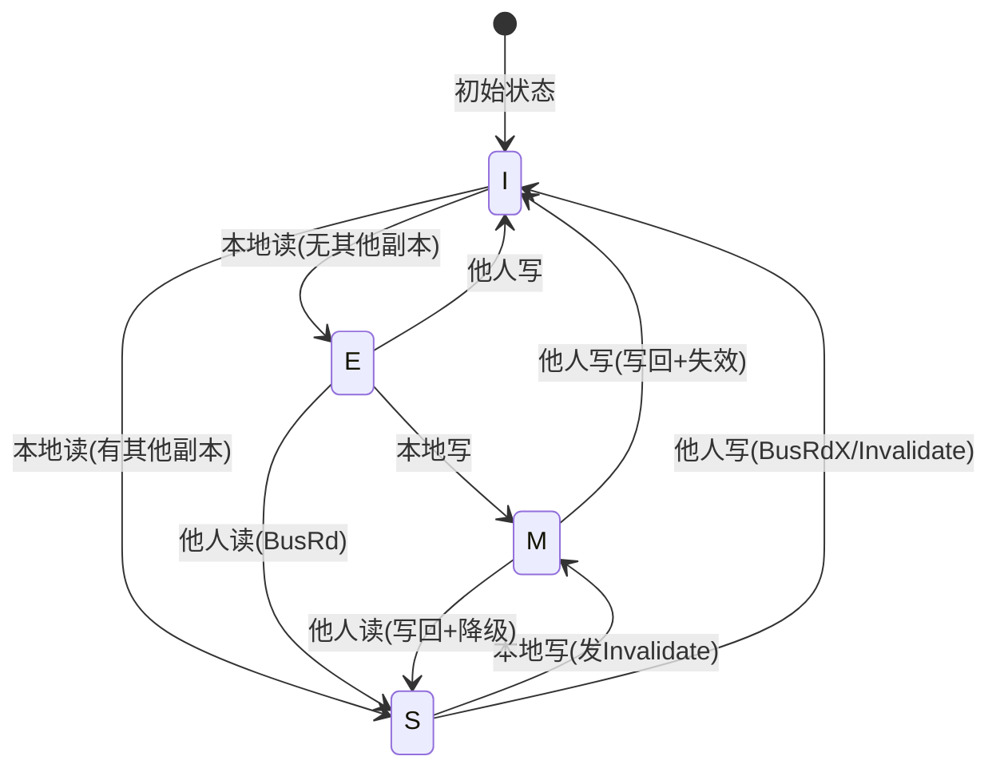
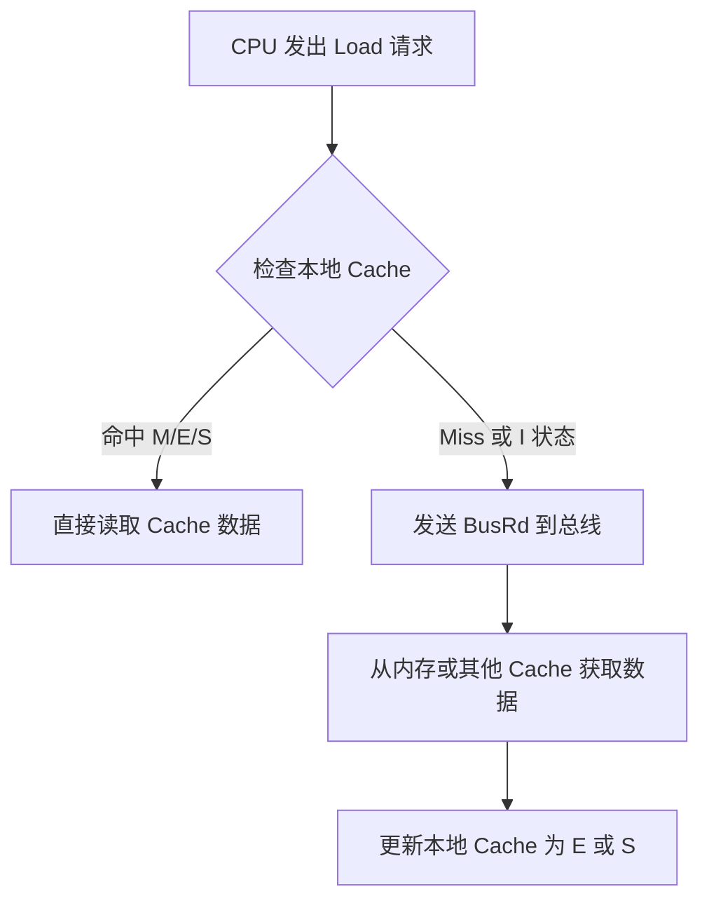
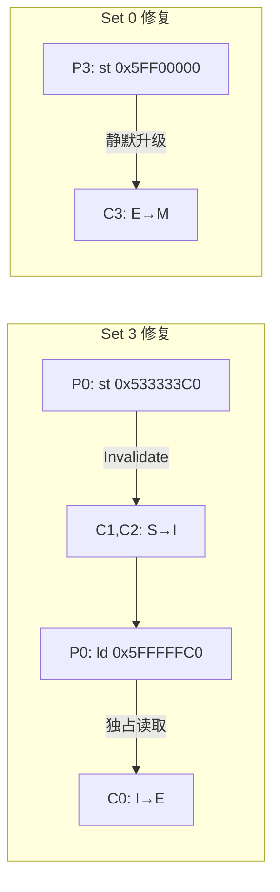

# 计算机体系结构：多核缓存一致性与 MESI 协议

## 讲义全文

---

## 0. 学习路线图

| 阶段  | 内容                   | 建议时间  |
| :-: | :------------------- | :---: |
|  1  | 理解硬件参数：Cache 结构、地址切分 | 15 分钟 |
|  2  | 掌握 MESI 协议四态及状态转换规则  | 20 分钟 |
|  3  | 学会识别非法状态组合（宇宙射线检测）   | 15 分钟 |
|  4  | 分析指令序列对缓存一致性的影响      | 25 分钟 |
|  5  | 设计最优指令序列达成目标状态       | 25 分钟 |

---

## 1.  核心知识图

```
多核缓存一致性
├── 硬件基础
│   ├── 直接映射缓存 (Direct-Mapped Cache)
│   ├── 写回策略 (Write-Back)
│   └── 地址解析 (Tag / Index / Offset)
├── MESI 协议
│   ├── 四种状态 (M / E / S / I)
│   ├── 状态转换规则
│   └── 合法状态组合约束
└── 一致性分析
    ├── 非法状态识别
    ├── 读写操作影响
    └── 状态修复策略
```

---

## 2.  逐点讲解

---

### 知识卡片 1：直接映射缓存与地址解析 `[S01]`

**名称**：直接映射缓存 (Direct-Mapped Cache)

**要解决的问题（直觉）**：
CPU 访问内存太慢（几百个时钟周期），我们需要一个小而快的"临时仓库"（Cache）来存放最近用过的数据。但仓库很小，内存很大，怎么决定某个内存地址的数据应该放在仓库的哪一格呢？

**先修要求**：
- 二进制与十六进制转换
- 基本的计算机存储概念

**类比 / 直觉**：
想象一个只有 4 个储物柜的快递站（Cache），而整个城市有成千上万个住户（内存地址）。规则很简单：**住户门牌号除以 4 取余数**，余数是几就放第几号柜。这样虽然会有冲突（不同住户抢同一个柜子），但查找非常快——直接算余数就知道去哪个柜子找。

**形式化表述（严格）**：
对于一个 32 位内存地址，它被切分成三段：

| 字段 | 位数 | 作用 |
|:---|:---:|:---|
| **Tag（标签）** | 高位剩余 | 区分映射到同一 Set 的不同内存块 |
| **Index（索引）** | 中间 | 决定数据放在 Cache 的哪一行（Set） |
| **Offset（偏移）** | 低位 | 决定在一个 Block 内读取哪个字节 |

**公式 / 关键结论**：

根据题目参数 `[S01]`：
- Cache 大小 = 256 Bytes
- Block 大小 = 64 Bytes
- 地址范围 = 32 位（`0x50000000 - 0x5FFFFFFF`）

计算各字段位数：

$$\text{Offset 位数} = \log_2(\text{Block Size}) = \log_2(64) = 6 \text{ bits}$$

$$\text{Set 数量} = \frac{\text{Cache Size}}{\text{Block Size}} = \frac{256}{64} = 4 \text{ Sets}$$

$$\text{Index 位数} = \log_2(\text{Set 数量}) = \log_2(4) = 2 \text{ bits}$$

$$\text{Tag 位数} = 32 - 6 - 2 = 24 \text{ bits}$$

**内联小图 `[Fig·S01-1]`**：

```
32位地址结构：
┌─────────────────────────┬───────┬────────────┐
│        Tag (24位)        │Index │  Offset    │
│         高24位           │(2位) │  (6位)     │
│                         │bit7-6│  bit5-0    │
└─────────────────────────┴───────┴────────────┘
         ↓                    ↓         ↓
    身份验证码            去哪行找    块内第几字节
   (0x5FFFFF等)          (0-3号Set)   (题目设为0)
```

**图注**：地址从高到低依次切分为 Tag、Index、Offset。Index 决定 Cache 行号，Tag 用于验证是否命中。

**示例（可复现的最小例）**：

解析地址 `0x51110040`：

```
步骤1：转为二进制
0x51110040 = 0101 0001 0001 0001 0000 0000 0100 0000

步骤2：提取各字段
- Offset (bit 5-0): 00 0000 = 0x00 (题目已说明偏移为0)
- Index (bit 7-6):  01 = 1 → Set 1
- Tag (bit 31-8):   0101 0001 0001 0001 0000 00 = 0x511100

结论：地址 0x51110040 映射到 Set 1，Tag 为 0x511100
```

**常见误区与反例**：
1. ❌ **误区**：认为 Tag 就是地址的高位直接截取。
   ✅ **正解**：Tag 是去掉 Index 和 Offset 后的剩余部分，位数由计算确定。

2.  ❌ **误区**：混淆 Index 和 Offset 的位置。
   ✅ **正解**：从低到高依次是 Offset → Index → Tag。

**实务要点 / 工程提示**：
- 本题所有地址的 Offset 都是 0，简化了分析。
- 快速计算技巧：看地址的**第 7-6 位**（从 0 开始计数），即可得到 Set 号。

**一句话带走**：
地址的中间几位决定"去哪行找"（Index），高位决定"是不是我要的"（Tag）。

**自测题**：

1. **判断题**：地址 `0x5FFFFF00` 和 `0x5FFFFFC0` 映射到同一个 Set。（ ）
2. **单选题**：地址 `0x533333C0` 映射到哪个 Set？
   A. Set 0　　B. Set 1　　C. Set 2　　D.  Set 3
3. **计算题**：如果 Block Size 变为 128 Bytes，Cache Size 不变，Index 位数变为多少？

**答案**：
1. 错误。`0x5FFFFF00` 的 bit7-6 为 `00`（Set 0），`0x5FFFFFC0` 的 bit7-6 为 `11`（Set 3）。
2.  D。`0xC0 = 1100 0000`，bit7-6 为 `11` = 3。
3. Set 数量 = 256/128 = 2，Index 位数 = log₂(2) = 1 位。

**Covered: S01**

---

### 知识卡片 2：写回策略 (Write-Back) `[S01]`

**名称**：写回策略 (Write-Back Policy)

**要解决的问题（直觉）**：
当 CPU 写数据时，是立刻同步到内存，还是先写在 Cache 里、等会儿再同步？

**先修要求**：
- Cache 基本概念
- 理解内存访问延迟

**类比 / 直觉**：
你在便签纸（Cache）上记笔记，有两种策略：
- **Write-Through**：每写一个字就立刻誊抄到正式笔记本（内存）——安全但慢。
- **Write-Back**：先在便签上写，等便签用完要换页时，再一次性誊抄——快但需要标记"哪些还没誊抄"。

**形式化表述（严格）**：
**Write-Back 策略**：写操作只修改 Cache，不立即更新内存。Cache Line 被标记为 **Dirty（脏）**，只有当该行被替换出去（Eviction）时，才将数据写回内存。

**公式 / 关键结论**：
- 优点：减少内存写流量，提高性能。
- 代价：需要额外的"脏位"（Dirty Bit），即 MESI 中的 **M 状态**。
- 风险：若 Cache 数据丢失且未写回，数据永久丢失。

**常见误区与反例**：
❌ **误区**：Write-Back 的 Cache 数据永远和内存一致。
✅ **正解**：处于 **M 状态** 的 Cache Line，其数据比内存更新；内存中是"旧版本"。

**一句话带走**：
Write-Back 让 Cache 成为"最新版本持有者"，内存可能暂时落后。

**Covered: S01**

---

### 知识卡片 3：MESI 协议四状态 `[S01]` `[C02]`

**名称**：MESI 缓存一致性协议

**要解决的问题（直觉）**：
多个 CPU 各有自己的私有 Cache，如果 CPU 0 修改了某个数据，CPU 1 的 Cache 里还是旧值怎么办？我们需要一套"交通规则"确保大家看到的数据一致。

**先修要求**：
- 多核处理器基本概念
- Cache 基本工作原理

**类比 / 直觉**：
想象四个人（CPU 0-3）各有一块小白板（私有 Cache），共享一块大黑板（内存）。MESI 协议规定了白板上每条信息的"状态标签"：

| 状态 | 类比 | 含义 |
|:---:|:---|:---|
| **M** (Modified) | "我改过了，黑板上是旧的" | 独占且脏，内存过期 |
| **E** (Exclusive) | "只有我有副本，和黑板一样" | 独占且干净 |
| **S** (Shared) | "好几个人都抄了，大家一样" | 共享副本 |
| **I** (Invalid) | "这条已作废，别信" | 无效垃圾 |

**形式化表述（严格）**：

**内联小图 `[Fig·C02-1]`**：

```
MESI 状态含义一览：
┌──────────┬────────────┬────────────┬───────────────────┐
│  状态    │ 数据有效?   │  独占?     │  与内存关系       │
├──────────┼────────────┼────────────┼───────────────────┤
│ M(Modified)  │    ✅      │    ✅      │ Cache 比内存新    │
│ E(Exclusive) │    ✅      │    ✅      │ Cache = 内存      │
│ S(Shared)    │    ✅      │    ❌      │ Cache = 内存      │
│ I(Invalid)   │    ❌      │    -       │ Cache 内容是垃圾  │
└──────────┴────────────┴────────────┴───────────────────┘
```

**图注**：M 和 E 都是独占状态，区别在于 M 状态数据被修改过（脏），E 状态数据与内存一致（干净）。

**公式 / 关键结论**（MESI 铁律）：

> **铁律 1：独占互斥**
> 若某 Cache Line 处于 **E** 或 **M** 状态，则同一地址在**所有其他 Cache** 中必须是 **I** 状态。

> **铁律 2：共享一致**
> 若某 Cache Line 处于 **S** 状态，则同一地址在其他 Cache 中只能是 **S** 或 **I**，不能是 **E** 或 **M**。

> **铁律 3：Invalid 即垃圾**
> **I** 状态的 Cache Line 内容不可信任，可能是任意随机值。

**内联小图 `[Fig·C02-2]`**：


# MESI 状态转换图详解


## 1.  先建立直觉：四个状态的"人设"

在分析转换之前，先给每个状态一个形象的比喻：

```
┌─────────────────────────────────────────────────────────────────┐
│  状态    │  比喻                │  核心特征                      │
├─────────────────────────────────────────────────────────────────┤
│  M       │  "我独占且改过了"     │  只有我有，内存是旧的          │
│  E       │  "我独占但没改"       │  只有我有，和内存一样          │
│  S       │  "大家都有一份"       │  多人共享，都和内存一样        │
│  I       │  "这是垃圾"           │  数据无效，不可使用            │
└─────────────────────────────────────────────────────────────────┘
```

---

## 2.  转换分类：谁触发的？

状态转换有两类触发源：

| 触发源 | 含义 | 例子 |
|:---:|:---|:---|
| **本地操作** | 这个 CPU 自己执行了 ld/st | "我读了一下" / "我写了一下" |
| **总线监听 (Snoop)** | 别的 CPU 在总线上发了请求，我监听到了 | "别人要读这个数据" / "别人要写这个数据" |

下面我按这两类来逐条分析。

---

## 3. 逐条转换详解

### 3.1 从 I (Invalid) 出发的转换

#### 转换 ①：`I → E`（本地读，无其他副本）

```
场景：我的 Cache 里没有这个数据（I 状态），我想读它

┌──────────┐         BusRd           ┌──────────┐
│  CPU 0   │ ───────────────────────→│   总线   │
│  ld 地址 │                         │          │
└──────────┘                         └──────────┘
     ↓                                    ↓
检查本地 Cache                      其他 Cache 都回复：
状态 = I（没有）                    "我也没有（都是 I）"
     ↓                                    ↓
发送 BusRd ──────────────────────→ 从内存获取数据
     ↓
数据到达，状态变为 E
（因为只有我有这份，所以是独占）
```

**为什么是 E 而不是 S？**
因为查询后发现"全世界只有我要这份数据"，没有其他 Cache 持有副本，所以我可以独占（Exclusive）。

---

#### 转换 ②：`I → S`（本地读，有其他副本）

```
场景：我的 Cache 里没有这个数据（I 状态），我想读它
      但别人的 Cache 里已经有了

┌──────────┐         BusRd           ┌──────────┐
│  CPU 0   │ ───────────────────────→│   总线   │
│  ld 地址 │                         │          │
└──────────┘                         └──────────┘
     ↓                                    ↓
检查本地 Cache                      其他 Cache 回复：
状态 = I（没有）                    "我有！状态是 S/E/M"
     ↓                                    ↓
发送 BusRd ──────────────────────→ 从其他 Cache 或内存获取数据
     ↓
数据到达，状态变为 S
（因为别人也有，我们共享）
```

**为什么是 S？**
既然别人也有这份数据，那就不能"独占"了，大家一起共享（Shared）。

---

### 3.2 从 E (Exclusive) 出发的转换

#### 转换 ③：`E → M`（本地写）

```
场景：我独占这份数据（E 状态），现在我要写它

┌──────────┐
│  CPU 0   │
│  st 地址 │
└──────────┘
     ↓
检查本地 Cache
状态 = E（独占且干净）
     ↓
直接写入 Cache
状态变为 M
     ↓
【不需要通知任何人！】
因为本来就只有我有，我改了也没人在乎
```

**这就是"静默升级"**：E → M 不产生任何总线流量，非常高效。

---

#### 转换 ④：`E → S`（他人读，BusRd）

```
场景：我独占这份数据（E 状态），突然监听到别人也想读它

┌──────────┐                         ┌──────────┐
│  CPU 1   │         BusRd           │  CPU 0   │
│  ld 地址 │ ───────────────────────→│ 监听总线 │
└──────────┘                         └──────────┘
                                          ↓
                                     我发现：这是我的数据！
                                     状态 = E
                                          ↓
                                     我需要响应：
                                     1. 把数据发给 CPU 1
                                     2. 状态从 E 降级为 S
                                          ↓
                                     现在我和 CPU 1 都是 S
```

**为什么要降级？**
原来只有我有（E），现在别人也要一份了，那就不再是"独占"了，大家变成"共享"（S）。

---

#### 转换 ⑤：`E → I`（他人写）

```
场景：我独占这份数据（E 状态），别人要写它

┌──────────┐                         ┌──────────┐
│  CPU 1   │      BusRdX/Inv         │  CPU 0   │
│  st 地址 │ ───────────────────────→│ 监听总线 │
└──────────┘                         └──────────┘
                                          ↓
                                     别人要写 = 要独占修改权
                                     我必须放弃我的副本
                                          ↓
                                     状态从 E 变为 I（失效）
                                     我的数据现在是垃圾了
```

**为什么直接变 I？**
别人要写（修改），他需要独占。我必须让出，把自己的副本标记为无效。

---

### 3.3 从 S (Shared) 出发的转换

#### 转换 ⑥：`S → M`（本地写，发 Invalidate）

```
场景：我和别人共享这份数据（S 状态），现在我要写它

┌──────────┐                         ┌──────────┐
│  CPU 0   │      Invalidate         │ 其他CPU  │
│  st 地址 │ ───────────────────────→│ 监听总线 │
└──────────┘                         └──────────┘
     ↓                                    ↓
我要写，但别人也有副本                 收到 Invalidate
我必须先"踢掉"他们                    状态变为 I（作废）
     ↓                                    ↓
发送 Invalidate ────────────────────→ 所有共享者变 I
     ↓
现在只有我有了
执行写入，状态变为 M
```

**为什么要发 Invalidate？**
共享状态下别人也有副本，如果我直接改，别人手里就是旧数据了。所以必须先通知"你们的都作废了"，然后我再改。

---

#### 转换 ⑦：`S → I`（他人写，BusRdX/Invalidate）

```
场景：我和别人共享这份数据（S 状态），别人要写它

┌──────────┐                         ┌──────────┐
│  CPU 1   │    BusRdX/Invalidate    │  CPU 0   │
│  st 地址 │ ───────────────────────→│ 监听总线 │
└──────────┘                         └──────────┘
                                          ↓
                                     别人要写了
                                     我的共享副本必须作废
                                          ↓
                                     状态从 S 变为 I
```

这是转换 ⑥ 的"被动方视角"——别人踢我，我被踢掉。

---

### 3.4 从 M (Modified) 出发的转换

#### 转换 ⑧：`M → S`（他人读，写回 + 降级）

```
场景：我独占且修改过（M 状态），别人要读它

┌──────────┐                         ┌──────────┐
│  CPU 1   │         BusRd           │  CPU 0   │
│  ld 地址 │ ───────────────────────→│ 监听总线 │
└──────────┘                         └──────────┘
                                          ↓
                                     我有最新版（M 状态）
                                     别人要读，我必须：
                                     1. 把数据写回内存（同步）
                                     2. 把数据发给请求者
                                     3. 状态降级为 S
                                          ↓
                                     现在内存是最新的
                                     我和 CPU 1 都是 S
```

**为什么要写回？**
M 状态意味着"内存里是旧的"。现在要共享了，必须先让内存也更新到最新，这样大家才能保持一致。

---

#### 转换 ⑨：`M → I`（他人写，写回 + 失效）

```
场景：我独占且修改过（M 状态），别人要写它

┌──────────┐                         ┌──────────┐
│  CPU 1   │      BusRdX             │  CPU 0   │
│  st 地址 │ ───────────────────────→│ 监听总线 │
└──────────┘                         └──────────┘
                                          ↓
                                     别人要写（独占）
                                     我必须：
                                     1. 把数据写回内存（别让我的修改丢了）
                                     2. 状态变为 I（让出独占权）
                                          ↓
                                     CPU 1 拿到最新数据，变为 M
                                     我变为 I（垃圾）
```

**为什么要先写回？**
如果不写回，我改过的数据就永远丢了！所以必须先保存到内存，再让给别人。

---

## 4. 完整转换图（带颜色标注）

```
                         ┌─────────────────────────────────────┐
                         │          MESI 状态转换全图          │
                         └─────────────────────────────────────┘

                              本地读(无副本)
                    ┌──────────────────────────┐
                    │                          ↓
                ┌───┴───┐                  ┌───────┐
                │   I   │                  │   E   │
                │Invalid│                  │Exclus. │
                └───────┘                  └───────┘
                    ↑ ↑                      ↓   ↓ ↑
         他人写     │ │ 本地读            本地 │   │ │ 他人写
      (Invalidate) │ │ (有副本)           写  │   │ │
                    │ │                  (静默)│   │ │
                    │ │    ┌───────┐          │   │ │
                    │ └────│   S   │←─────────┼───┘ │
                    │      │Shared │  他人读   │     │
                    │      └───────┘ (降级)   │     │
                    │        ↓   ↑            ↓     │
                    │   本地写│   │他人读   ┌───────┐│
                    │(Inv)   │   │(写回)  │   M   ││
                    │        │   └────────│Modif.  ││
                    │        │            └───────┘│
                    │        └───────→ (本地写) ↑   │
                    │                              │
                    └──────────────────────────────┘
                              他人写(写回+失效)

图例：
───→ 本地操作触发（我主动做的）
───→ 总线监听触发（别人做的，我被动响应）
```

---

## 5. 快速记忆表

| 转换 | 触发者 | 触发动作 | 我需要做什么 | 记忆口诀 |
|:---:|:---:|:---:|:---|:---|
| I→E | 我 | 读 | 从内存取，独占 | "我读我独占" |
| I→S | 我 | 读 | 从别人取，共享 | "有人有就共享" |
| E→M | 我 | 写 | 静默改 | "独占改不吭声" |
| E→S | 别人 | 读 | 给数据，降级 | "有人来就分享" |
| E→I | 别人 | 写 | 让出 | "别人要写我让开" |
| S→M | 我 | 写 | 踢别人，再改 | "共享写先踢人" |
| S→I | 别人 | 写 | 被踢 | "别人写我作废" |
| M→S | 别人 | 读 | 写回，降级 | "脏数据先回家" |
| M→I | 别人 | 写 | 写回，让出 | "脏数据回家再让" |

---

## 6. 自测题

1. **判断题**：从 S 状态执行本地写操作时，不需要任何总线通信。（ ）

2. **单选题**：以下哪个转换需要将数据写回内存？
   - A.  E → M
   - B.  S → M
   - C. M → S
   - D. I → E

1. **填空题**：E → M 被称为"\_\_\_\_\__升级"，因为不需要总线通信。

**答案**：
1. ❌ 错误。S→M 需要发送 Invalidate 通知其他共享者。
2. C。M 状态的数据比内存新，降级前必须写回。
3. 静默（Silent）

---

希望这个详细拆解能帮你彻底理解 MESI 状态转换！如果还有任何不清楚的地方，随时告诉我 😊

**图注**：状态转换由本地操作（ld/st）和总线监听（Snoop）共同驱动。

**常见误区与反例**：

1. ❌ **误区**：E 状态可以和 S 状态共存。
   ✅ **正解**：**绝对不行**！E 意味着"独占"，如果有人是 E，其他人必须是 I。

2. ❌ **误区**：I 状态只是"暂时不用"，数据还是对的。
   ✅ **正解**：I 状态的数据是**不可信的垃圾**，可能是上一次任务的残留。

**实务要点 / 工程提示**：
- **E → M 是静默升级**：因为本来就独占，写的时候不需要通知别人。
- **S → M 需要广播 Invalidate**：写之前必须把其他副本踢掉。

**一句话带走**：
M/E 是"VIP 包间"（独占），S 是"公共阅览室"（共享），I 是"已废弃的旧报纸"（垃圾）。

**自测题**：

1. **判断题**：如果 Cache 0 对某地址是 M 状态，Cache 1 对同一地址可以是 S 状态。（ ）
2. **单选题**：以下哪种状态组合是合法的？（同一内存块在不同 Cache 中）
   A. Cache 0: M, Cache 1: S
   B. Cache 0: E, Cache 1: I
   C. Cache 0: S, Cache 1: E
   D. Cache 0: M, Cache 1: M
3. **开放题**：为什么 E 状态的存在可以提高性能？

**答案**：
1. 错误。M 要求独占，其他必须是 I。
2. B。E 独占且其他为 I，符合规则。
3. E 状态表示独占且干净。当需要写入时，可以静默升级为 M，无需总线广播，减少通信开销。

**Covered: S01, C02**

---

### 知识卡片 4：识别宇宙射线导致的非法状态 `[S03]`

**名称**：MESI 状态一致性验证

**要解决的问题（直觉）**：
宇宙射线（或其他硬件错误）可能随机翻转 Cache 中的某个比特，导致 MESI 状态位出错。我们需要能够识别"哪里出了问题"。

**先修要求**：
- MESI 四状态及其约束规则
- 地址到 Set 的映射计算

**类比 / 直觉**：
就像考勤系统出错，明明只有一个人在 VIP 包间（E 状态），系统却显示另一个人也在公共区域看同一本书（S 状态）——这逻辑上不可能，一定是系统记录错了。

**形式化表述（严格）**：

**检测方法**：对每个 Set 的每个 Tag，检查所有 Cache 中该 Tag 的状态组合是否满足 MESI 铁律。

**题目初始状态分析 `[S03]`**：

**内联小图 `[Fig·S03-1]`**：

```
初始状态表（按 Set 整理）：

Set 0:  Cache 0: Tag=0x5FFFFF (M)
        Cache 1: Tag=0x522222 (I)
        Cache 2: Tag=0x5F111F (M)
        Cache 3: Tag=0x5FF000 (E)
        → 不同 Tag，各自独立，合法 ✅

Set 1:  Cache 0: Tag=0x5FFFFF (E)
        Cache 1: Tag=0x510000 (S)
        Cache 2: Tag=0x511100 (E) ← 关注点
        Cache 3: Tag=0x511100 (S) ← 关注点
        → Tag 0x511100: C2=E, C3=S，冲突！❌

Set 2:  Cache 0: Tag=0x5FFFFF (S)
        Cache 1: Tag=0x5FFFFF (S)
        Cache 2: Tag=0x5FFFFF (S)
        Cache 3: Tag=0x5FFFF0 (I)
        → Tag 0x5FFFFF: 三个 S，合法 ✅

Set 3:  Cache 0: Tag=0x5FFFFF (I)
        Cache 1: Tag=0x533333 (S)
        Cache 2: Tag=0x533333 (S)
        Cache 3: Tag=0x533333 (I)
        → Tag 0x533333: 两个 S，合法 ✅
```

**图注**：逐 Set 检查同一 Tag 的状态组合，Set 1 中出现 E 与 S 共存的非法情况。

**推导 / 证明素描**：

**Set 1 的 Tag `0x511100` 分析**：
- Cache 2 状态：**E (Exclusive)** —— 声称"只有我有这份数据"
- Cache 3 状态：**S (Shared)** —— 声称"我也有这份数据"
- **矛盾**：E 的定义要求独占，不可能有其他有效副本存在。

**可能的翻转场景**：
1. Cache 2 原本是 **S**，被翻转成 **E**（S→E 翻转）
2. Cache 2 原本是 **I**，被翻转成 **E**（I→E 翻转）
3. Cache 3 原本是 **I**，被翻转成 **S**（I→S 翻转）

**常见误区与反例**：
❌ **误区**：只检查 M 状态是否唯一。
✅ **正解**：E 状态同样要求独占，必须检查 E 与 S/E/M 的共存情况。

**一句话带走**：
检测非法状态：找同一 Set 同一 Tag，看 E/M 是否与其他非 I 状态共存。

**答案 (a)**：
**Set 1** 中 **Tag 为 `0x511100`** 的 Cache Line 状态发生了不一致。
- Cache 2 的状态是 **E (Exclusive)**
- Cache 3 的状态是 **S (Shared)**

根据 MESI 协议，E 状态要求独占（其他 Cache 必须为 I），因此与 S 状态不能共存。这表明**其中之一的 MESI 状态位被宇宙射线翻转**，具体可能是：
- Cache 2 从 I/S 翻转为 E
- Cache 3 从 I 翻转为 S

**Covered: S03**

---

### 知识卡片 5：Load 操作与非法状态的危害分析 `[S04]` `[S05]`

**名称**：读取无效数据的灾难性后果

**要解决的问题（直觉）**：
如果宇宙射线把某个 Cache Line 从 I（垃圾）变成了 E 或 S（看起来有效），会发生什么？

**先修要求**：
- MESI 状态含义
- Cache 命中/缺失的处理流程

**类比 / 直觉**：
你去图书馆借书，管理员电脑显示"这本书在 3 号书架"（S 状态），你信以为真去拿——结果 3 号书架上放的是别人寄存的废纸。系统记录错了，你拿到了垃圾却以为是正版书。

**形式化表述（严格）**：

**正常的 Load 处理流程**：



**内联小图 `[Fig·S04-1]`**：

```
正常流程 vs 异常流程对比：

正常情况（I 状态触发 Cache Miss）：
┌─────────┐    ┌─────────┐    ┌─────────┐
│ CPU Load│ → │ 状态=I  │ → │ 总线请求│ → 从内存/其他Cache获取正确数据
└─────────┘    │(Cache   │    │ (BusRd) │
               │ Miss)   │    └─────────┘
               └─────────┘

异常情况（I被翻转成E/S）：
┌─────────┐    ┌─────────┐    ┌─────────┐
│ CPU Load│ → │状态=E/S │ → │ 直接读  │ → 返回垃圾数据！
└─────────┘    │(误判为  │    │ Cache   │
               │ Hit)    │    └─────────┘
               └─────────┘
                    ↑
             宇宙射线翻转
```

**图注**：关键区别在于异常情况下跳过了总线请求，直接使用了无效的本地数据。

**问题 (b) 分析 `[S04]`**：

| 序号 | 处理器 | 操作 | 地址 | Set | Tag | 分析 |
|:---:|:---:|:---:|:---:|:---:|:---:|:---|
| 1 | P2 | ld | 0x51110040 | 1 | 0x511100 | ⚠️ **关键操作** |
| 2 | P0 | st | 0x5FFFFF40 | 1 | 0x5FFFFF | 不涉及问题 Tag |
| 3 | P3 | st | 0x51110040 | 1 | 0x511100 | 写操作 |
| 4 | P1 | ld | 0x5FFFFF80 | 2 | 0x5FFFFF | 不涉及问题 Tag |
| 5 | P1 | ld | 0x51110040 | 1 | 0x511100 | 读操作 |
| 6 | P1 | ld | 0x5FFFFF40 | 1 | 0x5FFFFF | 不涉及问题 Tag |

**第 1 步深度分析**：

假设宇宙射线的翻转情况是：**Cache 2 原本是 I，被翻转成 E**。

- P2 执行 `ld 0x51110040`，检查本地 Cache 2 的 Set 1
- 发现 Tag = `0x511100` 匹配，状态 = **E**
- CPU 认为"太好了，Cache 命中，而且是独占的"
- **直接读取 Cache 中的数据**——这些数据实际上是**旧任务残留的垃圾**
- CPU 使用错误数据继续执行，导致程序逻辑错误

**答案 (b)**：
**是，会导致错误的执行结果。**

**原因**：如果宇宙射线将 Cache 2 Set 1 的状态从 **I (Invalid)** 翻转为 **E (Exclusive)**，那么在第 1 步中，Processor 2 会误认为本地 Cache 中的随机/垃圾数据是有效的内存数据。由于状态显示为 E（有效且独占），处理器会跳过总线请求，直接读取这些垃圾数据，导致程序使用错误数值。

---

**问题 (c) 分析 `[S05]`**：

| 序号 | 处理器 | 操作 | 地址 | Set | Tag | 分析 |
|:---:|:---:|:---:|:---:|:---:|:---:|:---|
| 1 | P3 | ld | 0x51110040 | 1 | 0x511100 | ⚠️ **关键操作** |
| 2 | P0 | ld | 0x5FFFFF00 | 0 | 0x5FFFFF | 不涉及问题 Tag |
| 3 | P2 | ld | 0x51234540 | 1 | 0x512345 | 不同 Tag，触发替换 |
| 4 | P0 | st | 0x5FFFFF40 | 1 | 0x5FFFFF | 不涉及问题 Tag |
| 5 | P3 | ld | 0x51234540 | 1 | 0x512345 | 不涉及问题 Tag |
| 6 | P0 | ld | 0x5FFFFF00 | 0 | 0x5FFFFF | 不涉及问题 Tag |

**第 1 步深度分析**：

假设宇宙射线的翻转情况是：**Cache 3 原本是 I，被翻转成 S**。

- P3 执行 `ld 0x51110040`，检查本地 Cache 3 的 Set 1
- 发现 Tag = `0x511100` 匹配，状态 = **S**
- CPU 认为"数据有效，是共享副本"
- **直接读取 Cache 中的数据**——同样是**垃圾数据**
- 错误发生

**答案 (c)**：
**是，会导致错误的执行结果。**

**原因**：如果宇宙射线将 Cache 3 Set 1 的状态从 **I (Invalid)** 翻转为 **S (Shared)**，那么在第 1 步中，Processor 3 会直接读取本地 Cache 中的垃圾数据（因为它认为这是共享的有效副本）。这会导致程序立即读到错误数值。

**常见误区与反例**：

1. ❌ **误区**：S 状态翻转比 E 状态翻转危害小。
   ✅ **正解**：两者危害相同——只要 I 变成任何有效状态，都会导致垃圾数据被读取。

2. ❌ **误区**：写操作可以"修复"错误状态。
   ✅ **正解**：如果在写之前已经读了错误数据做了计算，损害已经造成。

**一句话带走**：
I→E/S 的翻转让 CPU 把垃圾当真，读取后程序必然出错。

**Covered: S04, S05**

---

### 知识卡片 6：MESI 状态转换与指令设计 `[S06]`

**名称**：通过读写指令控制 Cache 状态

**要解决的问题（直觉）**：
如何通过精心设计的 Load/Store 序列，将 Cache 系统从当前状态"迁移"到目标状态？

**先修要求**：
- MESI 状态转换规则
- 总线信号（BusRd、BusRdX、Invalidate）的作用

**类比 / 直觉**：
这就像下棋——每一步操作（ld/st）都会触发规则反应（状态转换），你需要规划最少步数达到目标局面。

**形式化表述（严格）**：

**关键状态转换规则表 `[Fig·S06-1]`**：

| 触发条件 | 初始状态 | 结果状态 | 总线信号 |
|:---|:---:|:---:|:---|
| 本地 Load，无其他副本 | I | E | BusRd |
| 本地 Load，有其他副本 | I | S | BusRd |
| 本地 Store | E | M | 无（静默升级） |
| 本地 Store | S | M | BusRdX/Invalidate |
| 本地 Store | I | M | BusRdX |
| 监听到 BusRd | E | S | 响应数据 |
| 监听到 BusRd | M | S | 写回 + 响应 |
| 监听到 BusRdX/Inv | M/E/S | I | 写回(若M) + 失效 |

**图注**：本地操作和总线监听都可能改变状态。设计指令时要同时考虑"自己的变化"和"对别人的影响"。

---

**问题 (d) 解答 `[S06]`**：

**步骤 1：差异分析**

对比初始状态和目标状态，找出需要改变的地方：

**内联小图 `[Fig·S06-2]`**：

```
状态差异表（仅列出变化项）：

Set 0:
┌──────────┬─────────────────┬─────────────────┬──────────────┐
│  Cache   │   初始状态      │   目标状态      │    变化      │
├──────────┼─────────────────┼─────────────────┼──────────────┤
│ Cache 3  │ Tag=5FF000 (E)  │ Tag=5FF000 (M)  │  E → M       │
└──────────┴─────────────────┴─────────────────┴──────────────┘
操作：P3 对该地址执行 Store，E 静默升级为 M

Set 1:
┌──────────┬─────────────────┬─────────────────┬──────────────┐
│  Cache   │   初始状态      │   目标状态      │    变化      │
├──────────┼─────────────────┼─────────────────┼──────────────┤
│ Cache 2  │ Tag=511100 (E)  │ Tag=511100 (E)  │  无变化      │
│ Cache 3  │ Tag=511100 (S)  │ Tag=511100 (S)  │  无变化      │
└──────────┴─────────────────┴─────────────────┴──────────────┘
警告：目标状态保持非法！绝对不要触碰 Set 1！

Set 3:
┌──────────┬─────────────────┬─────────────────┬──────────────┐
│  Cache   │   初始状态      │   目标状态      │    变化      │
├──────────┼─────────────────┼─────────────────┼──────────────┤
│ Cache 0  │ Tag=5FFFFF (I)  │ Tag=5FFFFF (E)  │  I → E       │
│ Cache 1  │ Tag=533333 (S)  │ Tag=533333 (I)  │  S → I       │
│ Cache 2  │ Tag=533333 (S)  │ Tag=533333 (I)  │  S → I       │
└──────────┴─────────────────┴─────────────────┴──────────────┘
操作：需要让 C1/C2 失效，让 C0 独占新 Tag
```

**图注**：Set 1 的目标状态仍保持非法组合，因此不能执行任何涉及 Set 1 的操作。

**步骤 2：地址计算**

- Set 0 地址（Tag=0x5FF000）：`0x5FF000` | Index `00` | Offset `000000` = **`0x5FF00000`**
- Set 3 旧地址（Tag=0x533333）：`0x533333` | Index `11` | Offset `000000` = **`0x533333C0`**
- Set 3 新地址（Tag=0x5FFFFF）：`0x5FFFFF` | Index `11` | Offset `000000` = **`0x5FFFFFC0`**

**步骤 3：指令序列设计**

**内联小图 `[Fig·S06-3]`**：



**图注**：两个 Set 的修复相互独立，可以按任意顺序执行。

**最终指令序列**：

| 步序 | 处理器 | 指令 | 地址 | 作用详解 |
|:---:|:---:|:---:|:---:|:---|
| **1** | P3 | st | 0x5FF00000 | P3 对 Set 0 执行写操作。<br>C3 原状态 E，静默升级为 **M**。<br>无需总线广播。 |
| **2** | P0 | st | 0x533333C0 | P0 对 Set 3 执行写操作。<br>C0 原状态 I，需获取数据并独占。<br>广播 BusRdX，C1/C2 的 S 状态变为 **I**。 |
| **3** | P0 | ld | 0x5FFFFFC0 | P0 读取 Set 3 的新地址。<br>因该地址无其他有效副本，<br>C0 获得 **E** 状态。 |

**答案 (d)**：

通过以下 **3 条** 内存访问指令可达成目标状态：

| 顺序 | 处理器 | 操作 | 地址 |
|:---:|:---:|:---:|:---:|
| 1 | Processor 3 | st | 0x5FF00000 |
| 2 | Processor 0 | st | 0x533333C0 |
| 3 | Processor 0 | ld | 0x5FFFFFC0 |

**说明**：
- 指令 1 使 Cache 3 Set 0 从 E 升级为 M（目标达成）
- 指令 2 使 Cache 1/2 Set 3 从 S 变为 I（被 Invalidate）
- 指令 3 使 Cache 0 Set 3 装载新 Tag 并获得 E 状态

**注意**：绝对不能触碰 Set 1 的任何地址（如 `0x51110040`），否则会触发一致性协议导致状态变化，偏离目标。

**Covered: S06**

---

## 3. 动手实践

### 练习 1：手动计算地址映射

**任务**：给定地址 `0x5ABC1280`，计算其 Set 号和 Tag。

**步骤**：

1. **转换为二进制**：
   ```
   0x5ABC1280 = 0101 1010 1011 1100 0001 0010 1000 0000
   ```

2. **提取 Offset（bit 5-0）**：
   ```
   1000 0000 的低 6 位 = 00 0000 = 0
   ```

3.  **提取 Index（bit 7-6）**：
   ```
   0x80 = 1000 0000
   bit 7-6 = 10 = 2（十进制）
   所以 Set = 2
   ```

4. **提取 Tag（bit 31-8）**：
   ```
   去掉低 8 位，剩余 0x5ABC12
   Tag = 0x5ABC12
   ```

**结果**：地址 `0x5ABC1280` 映射到 **Set 2**，Tag 为 **0x5ABC12**。

---

### 练习 2：模拟 MESI 状态转换

**任务**：初始状态下 Cache 0 Set 2 是 S（Tag=0x5FFFFF），Cache 1 Set 2 也是 S（同 Tag）。若 P0 执行 `st 0x5FFFFF80`，画出状态变化。

**步骤**：

1.  **验证地址映射**：
   ```
   0x5FFFFF80: Offset=0, Index=10(bin)=2, Tag=0x5FFFFF
   确认是 Set 2，Tag 匹配
   ```

2. **P0 执行 Store 前**：
   ```
   C0 Set2: Tag=5FFFFF, State=S
   C1 Set2: Tag=5FFFFF, State=S
   ```

3. **Store 触发 BusRdX**：
   - P0 要写入，发送 Invalidate 信号
   - C1 监听到 Invalidate，状态从 S → **I**

4. **P0 完成写入**：
   - C0 状态从 S → **M**

5. **最终状态**：
   ```
   C0 Set2: Tag=5FFFFF, State=M  ← 已修改
   C1 Set2: Tag=5FFFFF, State=I  ← 被失效
   ```

---

## 4. 易错点与比较

### 易错点列表

| 编号 | 易错点 | 正确理解 |
|:---:|:---|:---|
| 1 | 认为 E 和 S 可以共存 | E 要求**独占**，与任何非 I 状态互斥 |
| 2 | 认为 I 状态数据仍可读 | I 状态数据是**垃圾**，不可信任 |
| 3 | 忘记 Store 会广播 Invalidate | 从 S/I 写入时会使其他副本失效 |
| 4 | 混淆 E→M 和 S→M 的开销 | E→M 静默，S→M 需要广播 |
| 5 | 计算 Index 时位数错误 | Index 在 Offset 之上，不是地址高位 |

### 状态对比表

| 特性 | M | E | S | I |
|:---|:---:|:---:|:---:|:---:|
| 数据有效 | ✅ | ✅ | ✅ | ❌ |
| 与内存一致 | ❌ | ✅ | ✅ | - |
| 可直接读取 | ✅ | ✅ | ✅ | ❌ |
| 可静默写入 | ✅ | ✅ | ❌ | ❌ |
| 其他 Cache 可共享 | ❌ | ❌ | ✅ | - |
| 替换时需写回 | ✅ | ❌ | ❌ | ❌ |

---

## 5.  快速复习卡

### 核心公式速查

```
Cache 参数计算：
├── Offset 位数 = log₂(Block Size) = log₂(64) = 6
├── Set 数量 = Cache Size / Block Size = 256/64 = 4
├── Index 位数 = log₂(Set 数量) = log₂(4) = 2
└── Tag 位数 = 地址位数 - Index - Offset = 32-2-6 = 24
```

### MESI 速记口诀

```
M - Modified：我独占，我最新，内存过时要写回
E - Exclusive：我独占，我干净，写时升级不吭声
S - Shared：大家有，都一样，写前广播清别人
I - Invalid：已作废，是垃圾，读我必出大问题
```

### 状态合法性速查

```
合法组合：
├── 一个 M，其余全 I
├── 一个 E，其余全 I
├── 多个 S，其余全 I
└── 全部 I

非法组合（任一出现即错误）：
├── M 与任何非 I 共存
├── E 与任何非 I 共存
└── 两个 M 共存
```

### 本题答案速览

| 题目 | 答案要点 |
|:---:|:---|
| (a) | Set 1, Tag 0x511100: C2=E 与 C3=S 冲突 |
| (b) | **会出错**：P2 可能读取 C2 中的垃圾数据 |
| (c) | **会出错**：P3 可能读取 C3 中的垃圾数据 |
| (d) | 3 条指令：P3 st 0x5FF00000 → P0 st 0x533333C0 → P0 ld 0x5FFFFFC0 |

---

## 6. 溯源与交叉引用表

| 材料标签 | 内容 | 覆盖位置 |
|:---:|:---|:---|
| S01 | 硬件参数（4核、256B Cache、64B Block、MESI） | 知识卡片 1-3 |
| S03 | 问题(a)：识别非法状态 | 知识卡片 4 |
| S04 | 问题(b)：指令序列分析 | 知识卡片 5 |
| S05 | 问题(c)：指令序列分析 | 知识卡片 5 |
| S06 | 问题(d)：状态修复指令设计 | 知识卡片 6 |
| C02 | MESI 协议详解（自建补充） | 知识卡片 3 |

---

## 7. 缺漏扫描 (Missing Scanner)

| 材料要点 | 是否覆盖 | 位置 |
|:---|:---:|:---|
| Cache 大小 256 Bytes | ✅ | S01, 知识卡片 1 |
| Block 大小 64 Bytes | ✅ | S01, 知识卡片 1 |
| 直接映射 | ✅ | S01, 知识卡片 1 |
| 写回策略 | ✅ | S01, 知识卡片 2 |
| MESI 协议 | ✅ | S01, 知识卡片 3 |
| 4 个处理器 | ✅ | 全文 |
| 广播通信方式 | ✅ | 知识卡片 6 |
| 宇宙射线导致状态翻转 | ✅ | 知识卡片 4, 5 |
| 初始状态表 | ✅ | Fig·S03-1 |
| 问题 (a) 解答 | ✅ | 知识卡片 4 |
| 问题 (b) 解答 | ✅ | 知识卡片 5 |
| 问题 (c) 解答 | ✅ | 知识卡片 5 |
| 问题 (d) 目标状态表 | ✅ | Fig·S06-2 |
| 问题 (d) 解答 | ✅ | 知识卡片 6 |

**扫描结果**：覆盖率 **100%**，无缺漏。

---

## 8. 终章综合图

**图题**：MESI 多核缓存一致性全景图

```
                    ┌─────────────────────────────────────────┐
                    │              主存储器 (Memory)           │
                    │    (MESI 中 M 状态数据可能比这里更新)      │
                    └─────────────────────────────────────────┘
                                         ↑↓
                    ╔═══════════════════════════════════════════╗
                    ║           系统总线 (Bus)                   ║
                    ║  ┌─────────────────────────────────────┐  ║
                    ║  │ BusRd / BusRdX / Invalidate / Flush │  ║
                    ║  └─────────────────────────────────────┘  ║
                    ╚═══════════════════════════════════════════╝
                      ↑↓           ↑↓           ↑↓           ↑↓
              ┌───────────┐ ┌───────────┐ ┌───────────┐ ┌───────────┐
              │  Cache 0  │ │  Cache 1  │ │  Cache 2  │ │  Cache 3  │
              │ (Private) │ │ (Private) │ │ (Private) │ │ (Private) │
              ├───────────┤ ├───────────┤ ├───────────┤ ├───────────┤
              │ Set 0: M  │ │ Set 0: I  │ │ Set 0: M  │ │ Set 0: E  │
              │ Set 1: E  │ │ Set 1: S  │ │ Set 1: E ←┼─┼─ 冲突!  ──→ │ Set 1: S  │
              │ Set 2: S  │ │ Set 2: S  │ │ Set 2: S  │ │ Set 2: I  │
              │ Set 3: I  │ │ Set 3: S  │ │ Set 3: S  │ │ Set 3: I  │
              └───────────┘ └───────────┘ └───────────┘ └───────────┘
                    ↑              ↑             ↑             ↑
              ┌──────────┐  ┌──────────┐  ┌──────────┐  ┌──────────┐
              │  CPU 0   │  │  CPU 1   │  │  CPU 2   │  │  CPU 3   │
              │ ld / st  │  │ ld / st  │  │ ld / st  │  │ ld / st  │
              └──────────┘  └──────────┘  └──────────┘  └──────────┘
```

**图注**：
- 每个 CPU 有私有 L1 Cache，通过总线与其他 Cache 和内存通信
- Set 1 的 Cache 2 (E) 与 Cache 3 (S) 形成非法状态组合
- 总线信号用于维护一致性：读操作发 BusRd，写操作发 BusRdX

**关联结论**：
本图展示了题目描述的四核系统结构，清晰标注了宇宙射线导致的 Set 1 非法状态。该非法状态会导致问题 (b)(c) 中的读错误，需要通过问题 (d) 的精心设计指令序列进行修复。

---

*讲义完*