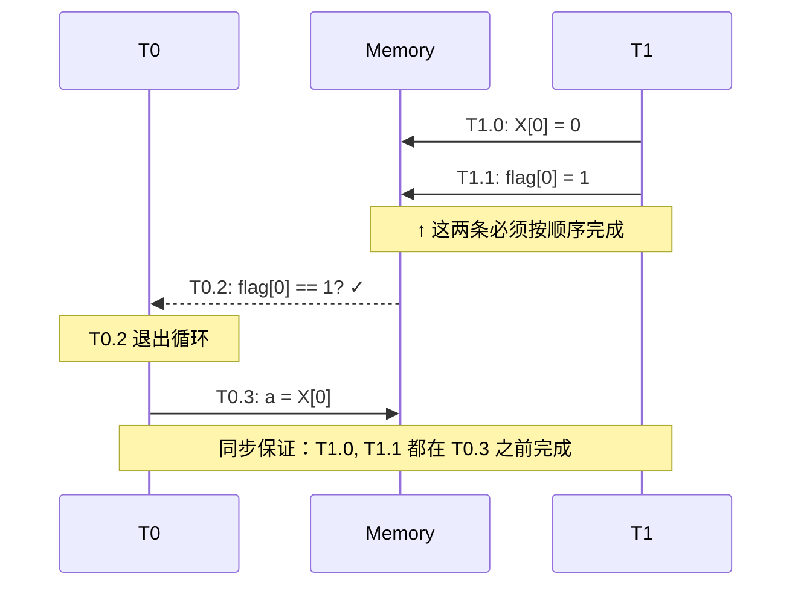
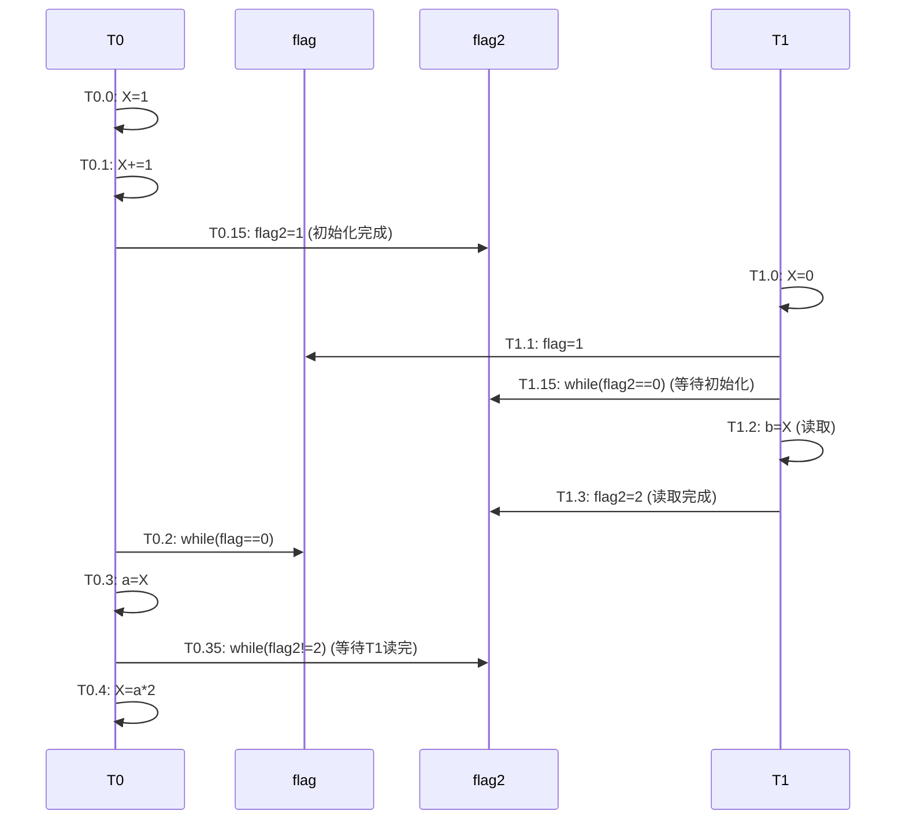

# 多核处理器中的内存一致性与线程同步讲义

---

## 1. 学习路线图 [C01]

> **适用人群**：对并发编程、多核处理器内存一致性模型零基础或初步了解的学习者。

1. **理解顺序一致性（Sequential Consistency）的定义与行为**（约 15 分钟）
2. **掌握多线程指令交织（Interleaving）的分析方法**（约 20 分钟）
3. **识别竞态条件（Race Condition）与同步机制**（约 15 分钟）
4. **学会用同步原语（如 flag 变量）实现线程间协调**（约 20 分钟）
5. **完成典型题目的分析与解答**（约 30 分钟）

---

## 2. 核心知识图 [C02]

```
多线程程序执行
    │
    ├── 内存一致性模型
    │       └── 顺序一致性（SC）：所有线程看到相同的全局执行顺序
    │
    ├── 指令交织
    │       └── 多线程指令可任意交错执行，但须遵守各自线程内顺序
    │
    ├── 竞态条件
    │       └── 多个线程同时访问共享变量且至少一个是写操作
    │
    └── 同步机制
            └── 使用 flag 变量实现等待/通知
```
`[Fig·C02-1]` *图注：本讲义的知识主线依赖关系，从上到下依次学习。*

---

## 3. 逐点讲解 [S01-S04]
---
### 知识卡片 1：顺序一致性（Sequential Consistency, SC）

| 字段              | 内容                                                                                                       |
| --------------- | -------------------------------------------------------------------------------------------------------- |
| **名称**          | 顺序一致性（Sequential Consistency）                                                                            |
| **要解决的问题（直觉）**  | 在多核处理器上，多个线程同时读写共享内存，程序员如何预测最终结果？                                                                        |
| **先修要求**        | 了解多线程基本概念、共享变量                                                                                           |
| **类比 / 直觉**     | 想象多个人轮流在一块黑板上写字和读字。虽然轮流的顺序可能不同，但**每个人写字的先后顺序**必须保持不变，而且**所有人看到的黑板内容变化历史**是一致的。                           |
| **形式化表述（严格）**   | 顺序一致性要求：程序的执行结果等价于某种**全局串行顺序**，该顺序满足两个条件：<br>① 每个线程内的指令按程序顺序执行；<br>② 所有线程的指令交织成一个单一序列，所有处理器看到相同的内存操作顺序。  |
| **公式 / 关键结论**   | 无显式公式。核心结论：**线程内顺序不变，线程间可任意交织**。                                                                         |
| **示例**          | 见本题：T0 的指令 T0.0 → T0.1 → T0.2 → T0.3 → T0.4 必须按此顺序执行；T1 的 T1.0 → T1.1 → T1.2 也必须按此顺序执行。但两个线程之间的指令可以任意交织。 |
| **常见误区与反例**     | ❌ 误区："顺序一致性意味着线程轮流执行"——错！线程间可以任意交织，只是每个线程内部顺序固定。                                                         |
| **与相近概念对比**     | 见下方比较表格                                                                                                  |
| **实务要点 / 工程提示** | 现代处理器默认**不一定**提供顺序一致性（如 x86 是 TSO，ARM 是弱一致性），需要显式使用内存屏障。                                                 |
| **一句话带走**       | 顺序一致性 = 线程内顺序固定 + 全局存在某个合法的交织顺序。                                                                         |

**内联小图：顺序一致性示意** `[Fig·S01-1]`

```
┌────────────────────────────────────────────────────────────┐
│                  全局执行时间线（SC 模型）                    │
├────────────────────────────────────────────────────────────┤
│                                                            │
│  T0:  ───[T0.0]───[T0.1]───────────[T0.2]───[T0.3]───[T0.4]│
│                         ↘                                  │
│  T1:  ──────────[T1.0]───[T1.1]───[T1.2]──────────────────│
│                              ↓                             │
│            (T1.1 设置 flag=1 后，T0.2 才能退出等待)          │
└────────────────────────────────────────────────────────────┘
```
*图注：两个线程的指令在时间线上交织执行，但各自内部顺序不变。虚线箭头表示同步依赖。*

**一致性模型对比表** `[Fig·S01-2]`

| 模型 | 线程内顺序 | 线程间顺序 | 典型硬件 |
|------|------------|------------|----------|
| 顺序一致性（SC） | 严格保持 | 全局一致 | 较少（理论模型） |
| 全存储顺序（TSO） | 严格保持 | 写可被延迟可见 | x86/x64 |
| 弱一致性 | 可乱序 | 需显式屏障 | ARM, RISC-V |

*图注：SC 是最强的一致性模型，对程序员最友好，但硬件实现代价高。*

**自测题（3 题）**：

1. **判断题**：在顺序一致性模型下，T0 的 T0.1 可能在 T0.0 之前执行。（ ）
   - **答案**：❌ 错。顺序一致性要求线程内指令按程序顺序执行。

2. **单选题**：顺序一致性的核心约束是？
   - A.  所有指令必须严格串行执行
   - B. 每个线程内顺序固定，线程间可任意交织
   - C. 读操作总是返回最新写入的值
   - **答案**：B

3. **开放题**：为什么现代 CPU 很少直接实现顺序一致性？
   - **答案**：顺序一致性限制了硬件优化空间（如写缓冲区、指令重排），会降低性能。

> Covered: S01

---

### 知识卡片 2：指令交织（Interleaving）与竞态条件

| 字段              | 内容                                                                   |
| --------------- | -------------------------------------------------------------------- |
| **名称**          | 指令交织（Interleaving）与竞态条件（Race Condition）                              |
| **要解决的问题（直觉）**  | 当两个线程同时操作同一变量时，最终结果是什么？                                              |
| **先修要求**        | 理解顺序一致性                                                              |
| **类比 / 直觉**     | 两个人同时往同一个存钱罐里放钱和取钱，如果没有锁，最终余额取决于操作的先后顺序。                             |
| **形式化表述（严格）**   | **竞态条件**：多个线程并发访问共享变量，且**至少一个是写操作**，且访问之间**没有同步保护**。此时最终值取决于具体的交织顺序。 |
| **公式 / 关键结论**   | 若线程 A 写 X，线程 B 也写 X，无同步时：<br>最终 X = A 最后写的值 **或** B 最后写的值（取决于谁后执行）。  |
| **示例**          | 本题中 T0.0 写 `X=1`，T1.0 写 `X=0`，存在竞态，最终 X 可能是 0 或其他值。                  |
| **内联小图（若触发）**   | 见下方                                                                  |
| **常见误区与反例**     | ❌ 误区："两个写操作的结果一定是后写的值"——在 SC 下正确，但在弱一致性模型下不一定。                       |
| **与相近概念对比**     | 竞态条件 vs 数据竞争：数据竞争是竞态条件的子集，专指无同步的冲突访问。                                |
| **实务要点 / 工程提示** | 使用锁、原子操作或内存屏障来避免竞态条件。                                                |
| **一句话带走**       | 竞态 = 多线程 + 共享变量 + 无同步 → 结果不确定。                                       |

**内联小图：指令交织的三种情况** `[Fig·S02-1]`

```
场景：T0 执行 [T0.0: X=1] [T0.1: X+=1]
      T1 执行 [T1.0: X=0]

情况 1：T1. 0 最先执行
┌─────────────────────────────────────┐
│ T1.0(X=0) → T0.0(X=1) → T0.1(X=2)  │
│ 结果：X = 2                         │
└─────────────────────────────────────┘

情况 2：T1.0 插在 T0.0 和 T0.1 之间
┌─────────────────────────────────────┐
│ T0.0(X=1) → T1.0(X=0) → T0.1(X=1)  │
│ 结果：X = 1                         │
│ （注意：T0.1 是 X += 1，读取当前X=0，加1得1）│
└─────────────────────────────────────┘

情况 3：T1.0 最后执行
┌─────────────────────────────────────┐
│ T0.0(X=1) → T0.1(X=2) → T1.0(X=0)  │
│ 结果：X = 0                         │
└─────────────────────────────────────┘
```
*图注：同样的代码，不同的交织顺序导致截然不同的结果。这就是竞态条件的本质。*

**自测题（3 题）**：

1. **判断题**：只要有多个线程访问同一变量，就一定存在竞态条件。（ ）
   - **答案**：❌ 错。如果所有访问都是读操作，或者有适当的同步保护，则不存在竞态。

2. **单选题**：以下哪种情况**不会**产生竞态条件？
   - A. 线程 A 写 X，线程 B 读 X，无同步
   - B. 线程 A 读 X，线程 B 读 X，无同步
   - C. 线程 A 写 X，线程 B 写 X，无同步
   - **答案**：B（两个读操作不冲突）

3. **开放题**：`X += 1` 这条语句为什么容易产生竞态？
   - **答案**：因为它实际上是三步操作（读 X → 计算 X+1 → 写回 X），在这三步之间其他线程可能修改 X。

> Covered:  S02

---

### 知识卡片 3：同步机制——Flag 变量与忙等待

| 字段              | 内容                                                                                                    |
| --------------- | ----------------------------------------------------------------------------------------------------- |
| **名称**          | 同步机制（Synchronization）——Flag 变量与忙等待（Busy-Wait）                                                         |
| **要解决的问题（直觉）**  | 如何让一个线程"等待"另一个线程完成某个操作后再继续？                                                                           |
| **先修要求**        | 理解竞态条件                                                                                                |
| **类比 / 直觉**     | 就像接力赛跑：选手 A 必须看到选手 B 伸出接力棒（flag=1），才能接棒继续跑。                                                           |
| **形式化表述（严格）**   | 使用共享变量 `flag` 作为信号：<br>- 线程 B 完成某操作后设置 `flag = 1`<br>- 线程 A 循环检查 `while(flag == 0);`，直到 flag 变为 1 才继续 |
| **公式 / 关键结论**   | **同步建立的 happens-before 关系**：<br>`flag = 1`（线程 B）**happens-before** `flag == 1` 检测通过（线程 A）             |
| **示例**          | 本题中：`T1.1:  flag[0] = 1` 与 `T0.2: while(flag[0] == 0);` 形成同步。                                         |
| **内联小图（若触发）**   | 见下方                                                                                                   |
| **常见误区与反例**     | ❌ 误区："flag 同步后，T1 的所有指令都在 T0.2 之前完成"——错！只有 flag=1 之前的指令才保证在 T0.2 之前。                                  |
| **与相近概念对比**     | 忙等待 vs 阻塞等待：忙等待持续占用 CPU，阻塞等待会让出 CPU。                                                                  |
| **实务要点 / 工程提示** | 忙等待在短期等待场景下高效，但长期等待会浪费 CPU 资源。生产环境多用条件变量、信号量等。                                                        |
| **一句话带走**       | Flag 同步的核心：**设置 flag 之前的操作，对检测到 flag 的线程可见**。                                                         |

**内联小图：Flag 同步的 happens-before 关系** `[Fig·S03-1]`


*图注：虚线表示同步依赖。T0.2 检测到 flag=1 时，可以确信 T1.0 和 T1.1 都已完成。*

（由于 Mermaid 可能无法渲染，下面给出等效的 ASCII 版本）

```
Thread T0                    Thread T1
    │                            │
    │                      T1.0: X[0] = 0
    │                            │
    │                      T1.1: flag[0] = 1
    │                            │
    │  ←──── 同步点 ────────────→│
    │                            │
T0.2: while(flag[0]==0); ───────→│ (检测到 flag=1，退出循环)
    │                            │
T0.3: a = X[0]                   │
    │                            │
    ▼                            ▼

happens-before 关系：
T1.0 → T1.1 → T0.2 → T0.3
（箭头表示"发生在... 之前"）
```
`[Fig·S03-2]` *图注：ASCII 版本的同步时序图，展示 happens-before 关系链。*

**自测题（3 题）**：

1. **判断题**：在本题中，T0.2 退出循环后，可以确定 T1.2 已经执行完毕。（ ）
   - **答案**：❌ 错。T1.2 在 T1.1 之后，而 T0.2 只等待 T1.1 完成，不保证 T1.2 的状态。

2. **单选题**：Flag 同步能保证什么？
   - A. 两个线程完全串行执行
   - B. 设置 flag 之前的操作对检测方可见
   - C. 检测 flag 之后的操作不会与设置方并发
   - **答案**：B

3. **开放题**：如果把 T1.1 和 T1.0 交换顺序，会发生什么问题？
   - **答案**：T0 可能在 T1.0 执行之前就通过了 flag 检查，导致同步失效，a 可能读不到 T1.0 写入的值。

> Covered: S03

---

### 知识卡片 4：本题代码详解与变量分析

| 字段              | 内容                                                                          |
| --------------- | --------------------------------------------------------------------------- |
| **名称**          | 本题代码结构与变量存储分析                                                               |
| **要解决的问题（直觉）**  | 理解本题代码的执行模型，为后续分析做准备                                                        |
| **先修要求**        | 掌握前三个知识卡片                                                                   |
| **类比 / 直觉**     | 把内存想象成公共黑板（所有人可见），寄存器想象成私人笔记本（只有自己可见）。                                      |
| **形式化表述（严格）**   | - `X[0]` 和 `flag[0]`：存储在**共享内存**中，所有核可见<br>- `a` 和 `b`：存储在**寄存器**中，属于各自线程私有 |
| **公式 / 关键结论**   | 初始值：`X[0] = 0`，`flag[0] = 0`<br>每行代码 = 一条原子指令（题目假设）                         |
| **示例**          | 见完整代码表格                                                                     |
| **常见误区与反例**     | ❌ 误区："`X += 1` 是一条指令所以是原子的"——本题假设如此，但实际硬件中可能不是。                             |
| **实务要点 / 工程提示** | 实际编程中，复合操作（如 `+=`）通常不是原子的，需要用原子变量或锁保护。                                      |
| **一句话带走**       | 本题的关键假设：每行代码是一条原子指令，处理器采用顺序一致性。                                             |

**完整代码表格（带标注）** `[Fig·S04-1]`

| Thread T0                      | 说明          | Thread T1             | 说明       |
| ------------------------------ | ----------- | --------------------- | -------- |
| T0.0: `X[0] = 1`               | 将 X 设为 1    | T1.0: `X[0] = 0`      | 将 X 设为 0 |
| T0.1: `X[0] += 1`              | X 自增（读-改-写） | ==T1.1: flag[0] = 1== | 设置同步标志   |
| ==T0.2: while(flag[0] == 0);== | 等待 T1 信号    | T1.2: `b = X[0]`      | 读取 X 到 b |
| T0.3: `a = X[0]`               | 读取 X 到 a    |                       |          |
| T0.4: `X[0] = a * 2`           | X 翻倍        |                       |          |

*图注：变量 a、b 在寄存器中，X、flag 在共享内存中。黄色高亮（T0.2 和 T1.1）构成同步对。*

**变量依赖关系图** `[Fig·S04-2]`

```
                     ┌─────────────┐
                     │   flag[0]   │
                     │ (同步变量)  │
                     └──────┬──────┘
                            │
          T1.1 写入 ────────┼──────── T0.2 等待
                            │
    ┌───────────────────────┼───────────────────────┐
    │                       │                       │
    ▼                       ▼                       ▼
┌───────┐             ┌───────────┐           ┌───────┐
│ T1.0  │             │   X[0]    │           │ T0.0  │
│ X = 0 │ ───────────→│ (共享变量)│←───────── │ X = 1 │
└───────┘             └─────┬─────┘           └───────┘
                            │                     │
                ┌───────────┼───────────┐         │
                ↓           ↓           ↓         ↓
            ┌─────┐     ┌─────┐     ┌─────────────────┐
            │  b  │     │  a  │     │ T0.1:  X += 1    │
            │(T1) │     │(T0) │     │ T0.4: X = a * 2 │
            └─────┘     └─────┘     └─────────────────┘
```
*图注：多条写操作竞争 X[0]，读操作 a 和 b 可能看到不同的中间值。*

**自测题（3 题）**：

1. **判断题**：变量 a 和 b 存储在共享内存中，所以两个线程都可以访问。（ ）
   - **答案**：❌ 错。题目明确说 a 和 b 存储在寄存器中，是各自线程私有的。

2. **单选题**：根据同步逻辑，下列哪个 happens-before 关系是**确定成立**的？
   - A. T1.0 → T0.0
   - B. T1.0 → T0.3
   - C.  T1.2 → T0.3
   - **答案**：B（由 T1.0 → T1.1 → T0.2 → T0.3 传递得到）

3. **开放题**：如果 flag 也存储在寄存器中，同步还能工作吗？
   - **答案**：不能。寄存器是线程私有的，T0 无法看到 T1 写入的 flag 值，会陷入无限循环。

> Covered: S04

---

## 4. 动手实践——逐题解析 [S05-S08]

> **教学目标**：带领你一步步分析每个问题，掌握多线程程序分析的系统方法。

---

### 问题 1：变量 a 的最终值可能是多少？ [S05]

#### 第一步：识别同步关系

首先，我们需要找出代码中的**同步点**。

```
T1.1: flag[0] = 1    ←─── 写入同步标志
          │
          │ happens-before
          ▼
T0.2: while(flag[0] == 0);  ←─── 等待同步标志
```

**关键结论**：当 T0.2 退出循环时，我们可以确定：
- T1.1 已经执行完毕
- 由于顺序一致性，T1.0（在 T1.1 之前）也已经执行完毕

因此：**T1.0 必然在 T0.3 之前发生**。

#### 第二步：分析 T1.0 与 T0 前两条指令的竞态

虽然 T1.0 一定在 T0.3 之前，但 T1.0 与 T0.0、T0.1 之间**没有同步约束**，存在竞态。

让我们枚举所有可能的交织顺序：

**交织顺序枚举表** `[Fig·S05-1]`

| 序号 | 执行顺序 | X 的变化过程 | T0. 3 读到的 a 值 |
|------|----------|--------------|-----------------|
| 1 | T1.0 → T0.0 → T0.1 → ...  → T0.3 | 0 → 1 → 2 | **a = 2** |
| 2 | T0.0 → T1.0 → T0.1 → ... → T0.3 | 1 → 0 → 1 | **a = 1** |
| 3 | T0.0 → T0.1 → T1.0 → ...  → T0.3 | 1 → 2 → 0 | **a = 0** |

*图注：三种典型交织顺序，对应三种不同的 a 值。*

#### 第三步：验证每种情况

**情况 1：T1.0 最先执行（a = 2）**

```
时间线：T1.0(X=0) → T0.0(X=1) → T0.1(X=2) → T1.1(flag=1) → T0.2通过 → T0.3(a=2)
```

- T1.0 先把 X 设为 0
- 然后 T0.0 把 X 改为 1
- T0.1 把 X 加 1，变成 2
- 最后 T0.3 读到 a = 2 ✓

**情况 2：T1.0 插在 T0.0 和 T0.1 之间（a = 1）**

```
时间线：T0.0(X=1) → T1.0(X=0) → T0.1(X=1) → T1.1(flag=1) → T0.2通过 → T0.3(a=1)
```

- T0.0 先把 X 设为 1
- T1.0 把 X 改为 0
- T0.1 执行 `X += 1`，读取当前 X=0，加 1 后写回 X=1
- 最后 T0.3 读到 a = 1 ✓

**情况 3：T1.0 最后执行（a = 0）**

```
时间线：T0.0(X=1) → T0.1(X=2) → T1.0(X=0) → T1.1(flag=1) → T0.2通过 → T0.3(a=0)
```

- T0.0 把 X 设为 1
- T0.1 把 X 加 1，变成 2
- T1.0 把 X 改为 0（覆盖了 T0 的结果）
- 最后 T0.3 读到 a = 0 ✓

#### 第四步：得出结论

> **答案：a 的最终值可能是 0、1 或 2。**
>
> **原因**：T1.0 与 T0.0、T0.1 之间存在竞态，不同的交织顺序导致不同的结果。

---

### 问题 2：变量 X[0] 的最终值可能是多少？ [S06]

#### 第一步：确定最后一次写 X 的指令

让我们列出所有对 X 的写操作：

| 指令 | 操作 | 线程 |
|------|------|------|
| T0.0 | X = 1 | T0 |
| T0.1 | X += 1 | T0 |
| T1.0 | X = 0 | T1 |
| T0.4 | X = a * 2 | T0 |

**关键观察**：T0.4 是 T0 的最后一条指令。我们需要确定 T0.4 与 T1.0 的执行顺序。

#### 第二步：分析执行顺序约束

根据问题 1 的分析，我们知道：
- T1.0 → T1.1（T1 内部顺序）
- T1.1 → T0.2（同步约束）
- T0.2 → T0.3 → T0.4（T0 内部顺序）

传递可得：**T1.0 → T0.4**

因此，**T0.4 一定是对 X 的最后一次写入**！

**执行顺序约束图** `[Fig·S06-1]`

```
T1.0 (X=0)
    │
    │ T1内部顺序
    ▼
T1.1 (flag=1) ─────────────────────────────────┐
                                               │ 同步
                                               ▼
                               T0.2 (等待 flag)
                                               │
                                               │ T0内部顺序
                                               ▼
                               T0.3 (a = X)
                                               │
                                               ▼
                               T0.4 (X = a*2)  ← 最后一次写 X
```
*图注：由于同步约束，T0.4 必然在 T1.0 之后，是最后一次写 X 的指令。*

#### 第三步：计算 X 的最终值

由于 T0.4 执行 `X = a * 2`，而 a 的可能值是 0、1、2：

| a 的值 | X = a * 2 |
|--------|-----------|
| 0 | **0** |
| 1 | **2** |
| 2 | **4** |

#### 第四步：得出结论

> **答案：X[0] 的最终值可能是 0、2 或 4。**
>
> **原因**：T0.4 是最后一次写 X 的指令，X 的最终值 = a * 2，而 a ∈ {0, 1, 2}。

---

### 问题 3：变量 b 的最终值可能是多少？ [S07]

#### 第一步：分析 T1.2 的执行时机

T1.2 (`b = X[0]`) 在 T1.1 之后执行（T1 内部顺序），但与 T0 的大部分指令**没有同步约束**。

**关键问题**：T1.2 可能在 T0. 4 之前或之后执行？

答案是：**都有可能！**

#### 第二步：枚举 T1.2 的两类执行时机

**类别 A：T1.2 在 T0.4 之前执行**

此时 b 读取的是"翻倍前"的 X 值。根据问题 1 的分析，翻倍前 X 的可能值是 0、1、2。

**类别 B：T1.2 在 T0.4 之后执行**

此时 b 读取的是"翻倍后"的 X 值，即 X 的最终值 0、2、4。

**T1.2 执行时机分析图** `[Fig·S07-1]`

```
时间轴 ────────────────────────────────────────────────────►

T0:   [T0.0] [T0.1] ─────────── [T0.2] [T0.3] [T0.4]
       │     │                   │              │
       └──┬──┘                   │              │
          │                      │              │
     X∈{0,1,2}                   │         X∈{0,2,4}
   (竞态结果)                   │           (最终值)
                                │
T1:  [T1.0] [T1.1] ───────── [T1.2] ─── 可能在此区间任意位置
                                │
                    ┌───────────┴───────────┐
                    ▼                       ▼
              若在 T0.4 前:            若在 T0.4 后: 
               b∈{0,1,2}                b∈{0,2,4}
```
*图注：T1.2 可能在翻倍操作前后执行，读取到不同的 X 值。*

#### 第三步：取并集

b 的所有可能值 = {0, 1, 2} ∪ {0, 2, 4} = **{0, 1, 2, 4}**

#### 第四步：得出结论

> **答案：b 的最终值可能是 0、1、2 或 4。**
>
> **原因**：T1.2 与 T0 的写操作存在竞态，可能读到翻倍前的值（0、1、2）或翻倍后的值（0、2、4）。

---

### 问题 4：如何让 a 和 b 相等？ [S08]

#### 第一步：分析问题

当前程序中，a 和 b 读取 X 的时机不同步：
- a 在翻倍前读取（T0.3）
- b 在不确定时机读取（T1.2）

要让 a = b，需要确保**两者读取的是同一个 X 值**。

#### 第二步：设计同步策略

我们需要保证两点：
1. **b 读取时，T0 的初始化计算（T0.0、T0.1）已完成**——避免 b 读到中间值
2. **b 读取时，T0 的翻倍操作（T0.4）还未执行**——避免 b 读到翻倍后的值

这需要**双向握手**（two-way handshake）：

```
T0 完成初始化 ──通知──► T1 读取 b ──通知──► T0 开始翻倍
```

**双向握手时序图** `[Fig·S08-1]`



（ASCII 版本）

```
Thread T0                              Thread T1
    │                                      │
T0.0: X = 1                          T1.0: X = 0
    │                                      │
T0.1: X += 1                         T1.1: flag = 1
    │                                      │
T0.15: flag2 = 1 ─────────────────────────→│ (告知：初始化完成)
    │                                      │
    │                              T1.15: while(flag2 == 0);
    │                                      │  (等待初始化完成)
    │                                      ▼
    │                              T1.2: b = X  ← 读取
    │                                      │
    │←─────────────────────────── T1.3: flag2 = 2 (告知：已读完)
    │
T0.2: while(flag == 0);
    │
T0.3: a = X  ← 读取 (此时 X 与 b 读到的相同)
    │
T0.35: while(flag2 != 2);  (等待 T1 读完)
    │
T0.4: X = a * 2  (翻倍)
    │
    ▼
```
`[Fig·S08-2]` *图注：双向握手确保 a 和 b 读取相同的 X 值，且翻倍操作在两者读取之后。*

#### 第三步：写出修改后的代码

**修改后的代码表格** `[Fig·S08-3]`

| Thread T0 | Thread T1 |
|-----------|-----------|
| T0.0: `X[0] = 1;` | T1.0: `X[0] = 0;` |
| T0.1: `X[0] += 1;` | T1.1: `flag[0] = 1;` |
| **T0.15: `flag2[0] = 1;`** *(新增：告知初始化完成)* | **T1.15: `while(flag2[0] == 0);`** *(新增：等待初始化)* |
| T0.2: `while(flag[0] == 0);` | T1.2: `b = X[0];` |
| T0.3: `a = X[0];` | **T1.3: `flag2[0] = 2;`** *(新增：告知已读完)* |
| **T0.35: `while(flag2[0] != 2);`** *(新增：等待T1读完)* | |
| T0.4: `X[0] = a * 2;` | |

*图注：新增的指令用粗体标注。flag2 初始化为 0。*

#### 第四步：验证同步逻辑

让我们验证修改后的程序确实能让 a = b：

1. **T0.15 设置 flag2=1 后，T1.15 才能通过**
   - 这确保 T0.0、T0.1 在 T1.2 之前完成

2. **T1.15 通过后，执行 T1.2 读取 b**
   - 此时 X 的值是 T0.0、T0.1、T1.0 竞态后的结果（0、1 或 2）

3. **T1.3 设置 flag2=2 后，T0.35 才能通过**
   - 这确保 T1.2 在 T0.4 之前完成

4. **T0.3 和 T0.35 在 T0.4 之前执行**
   - a 读取的 X 值与 b 相同
   - 翻倍操作在两者读取之后

因此，**a 和 b 必然相等**（都是 0、1 或 2 中的某一个）。

> **答案**：引入新变量 `flag2`，通过双向握手实现同步，确保 a 和 b 读取相同的 X 值。

---

## 5. 综合总结图 [C03]

**完整执行时序与同步关系图** `[Fig·C03-1]`

```
╔═══════════════════════════════════════════════════════════════════════════════╗
║                          多线程执行全景图                                       ║
╠═══════════════════════════════════════════════════════════════════════════════╣
║                                                                               ║
║   Thread T0                                      Thread T1                    ║
║   ─────────                                      ─────────                    ║
║       │                                              │                        ║
║   [T0.0] X = 1  ─────────────────┐   ┌───────── [T1.0] X = 0                 ║
║       │                          │   │               │                        ║
║   [T0.1] X += 1 ─────────────────┼───┼───────────────│                        ║
║       │                          │   │               │                        ║
║       │                      ┌───┴───┴───┐           │                        ║
║       │                      │  竞态区    │           │                        ║
║       │                      │ X∈{0,1,2} │           │                        ║
║       │                      └─────┬─────┘           │                        ║
║       │                            │                 │                        ║
║       │                            │           [T1.1] flag = 1                ║
║       │                            │                 │                        ║
║       │      ┌─────────────────────│─────────────────┘                        ║
║       │      │ 同步 1              │                                          ║
║       ▼      ▼                     │                                          ║
║   [T0.2] while(flag==0)            │           [T1.2] b = X ─────┐            ║
║       │                            │                 │           │            ║
║   [T0.3] a = X ─────────────────────                 │       b∈{0,1,2,4}      ║
║       │                                              │           │            ║
║   [T0.4] X = a*2 ────────────────────────────────────│───────────┘            ║
║       │                                              │                        ║
║       │                                              │                        ║
║   X_final ∈ {0, 2, 4}                                                         ║
║                                                                               ║
╠═══════════════════════════════════════════════════════════════════════════════╣
║  图例:  ─── 数据流  ═══ 同步依赖  ┌┐ 竞态/不确定性                              ║
╚═══════════════════════════════════════════════════════════════════════════════╝
```
*图注：此图展示了所有变量的可能取值来源及同步关系，可作为理解本题的"一图总览"。*

**关联结论**：
- **a ∈ {0, 1, 2}**：由竞态区直接决定
- **X_final ∈ {0, 2, 4}**：由 a * 2 决定
- **b ∈ {0, 1, 2, 4}**：是竞态区值与 X_final 的并集

---

## 6. 易错点与比较 [C04]

### 常见误区汇总

| 误区编号 | 错误想法 | 正确理解 |
|----------|----------|----------|
| 1 | "顺序一致性 = 线程轮流执行" | SC 允许任意交织，只保证线程内顺序 |
| 2 | "同步后 T1 所有指令都完成了" | 只保证 flag=1 之前的指令完成 |
| 3 | "X+=1 是原子操作" | 仅本题假设如此，实际可能不是 |
| 4 | "T1.2 一定在 T0.4 之前" | 两者无同步约束，可能在之前或之后 |
| 5 | "a 和 b 读的是同一个 X 值" | 原程序中两者读取时机不同步 |

### 易混淆概念对比

| 概念 | 定义 | 区别点 |
|------|------|--------|
| 顺序一致性（SC） | 全局存在合法交织顺序 | 最强保证，硬件代价高 |
| 全存储顺序（TSO） | 写可延迟可见 | 比 SC 弱，x86 默认 |
| 竞态条件 | 多线程无同步访问共享变量 | 可能导致结果不确定 |
| 数据竞争 | 竞态条件的正式术语 | C++/Java 标准中使用 |
| happens-before | 事件间的先后保证 | 同步的核心语义 |

---

## 7. 快速复习卡 [C05]

### 核心概念速记

```
┌─────────────────────────────────────────────────────────────┐
│  顺序一致性 = 线程内顺序固定 + 线程间可任意交织               │
├─────────────────────────────────────────────────────────────┤
│  竞态条件 = 多线程 + 共享变量 + 无同步 → 结果不确定           │
├─────────────────────────────────────────────────────────────┤
│  Flag 同步：设置 flag 之前的操作对检测方可见                  │
├─────────────────────────────────────────────────────────────┤
│  双向握手：两个方向的 flag 实现完全同步                       │
└─────────────────────────────────────────────────────────────┘
```

### 本题答案速记

| 变量 | 可能取值 | 关键原因 |
|------|----------|----------|
| **a** | 0, 1, 2 | T1.0 与 T0.0/T0.1 竞态 |
| **X** | 0, 2, 4 | X = a * 2，a ∈ {0,1,2} |
| **b** | 0, 1, 2, 4 | 可能读翻倍前或翻倍后的值 |

### 同步修改要点

1. **新增 flag2 变量**（初始化为 0）
2. **T0.15**:  `flag2 = 1`（T0 初始化完成）
3. **T1.15**:  `while(flag2 == 0)`（T1 等待初始化）
4. **T1.3**: `flag2 = 2`（T1 读取完成）
5. **T0.35**: `while(flag2 != 2)`（T0 等待 T1 读完）

---

## 溯源与补丁

### 材料要点 → 正文锚点 交叉引用表

| 材料编号 | 要点内容 | 正文位置 |
|----------|----------|----------|
| S01 | 顺序一致性协议 | 知识卡片 1 |
| S02 | 变量存储位置（内存/寄存器） | 知识卡片 4 |
| S03 | T0/T1 代码与同步逻辑 | 知识卡片 3, 4 |
| S04 | 初始值为 0 | 知识卡片 4 |
| S05 | 问题 1：a 的取值 | 动手实践 问题 1 |
| S06 | 问题 2：X 的取值 | 动手实践 问题 2 |
| S07 | 问题 3：b 的取值 | 动手实践 问题 3 |
| S08 | 问题 4：同步修改 | 动手实践 问题 4 |

### 缺漏扫描

经逐项比对，**所有材料要点均已覆盖**，无缺漏。

---

**恭喜你完成本讲义的学习！** 🎉

希望通过这份讲义，你已经掌握了：
- 顺序一致性模型的核心概念
- 多线程指令交织的分析方法
- 竞态条件的识别与解决
- 使用 flag 变量实现线程同步的技巧

如有任何疑问，欢迎继续探讨！