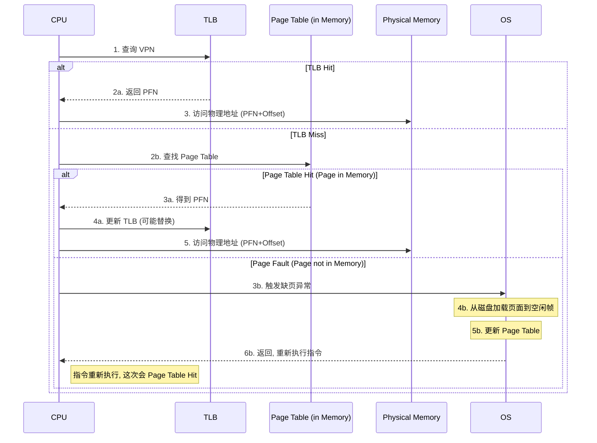

![[Pasted image 20251027090458.png]]
好的，作为一名顶级的教学专家，我将为您从零开始，系统且严谨地剖析这份关于虚拟内存的作业题。本指南将完全独立，无需参考任何其他资料，既可作为学习材料，也可作为复习清单。

### **幻灯片覆盖矩阵 (Slide Coverage Matrix)**

由于输入只有一个页面，我们将其视为单张幻灯片 `[S01]`。

| 幻灯片 # | 原始标题/主题 | 关键术语/信息 | 主要内容定位 (章节/知识卡/图示) | 覆盖情况 |
| :--- | :--- | :--- | :--- | :--- |
| S01 | 作业3 虚拟内存 | 8-bit 虚拟地址, 128 bytes 物理内存, 16 bytes 页大小, 初始内存布局, 3-entry TLB, LRU 替换策略, 初始 TLB 内容, 访问序列, (a) TLB 命中率, (b) 最终 TLB 内容, (c) 最终页表内容 | §3.1 系统参数解析, §3.2 初始状态分析, §4. 动手实践：逐步追踪, §4.3 最终结果解答, [Fig·S01-1], [Fig·S01-2], [Fig·S01-3], [Fig·S01-4] | ✅ 已覆盖 |

---

### **1. 学习路线图 (Learning Roadmap)**

要完全理解这个问题，您需要掌握现代计算机体系结构中的核心概念：虚拟内存。建议按以下顺序学习，预计总学习和练习时间为 **60-90分钟**。

1.  **基础概念 (20分钟):**
    *   **虚拟地址 vs. 物理地址**: 理解为什么我们需要“地址欺骗”。
    *   **分页 (Paging)**: 学习内存是如何被切分成固定大小的“页”和“帧”的。
    *   **页表 (Page Table)**: 了解操作系统用于记录地址映射的“电话簿”。
2.  **性能优化 (20分钟):**
    *   **TLB (Translation Lookaside Buffer)**: 明白什么是地址转换的“高速缓存”或“快捷方式”。
    *   **LRU (Least Recently Used) 算法**: 学习一种经典的缓存替换策略。
3.  **综合实践 (30分钟):**
    *   跟随本指南的“动手实践”部分，亲手追踪整个内存访问序列，将所有理论知识串联起来。这是内化知识最关键的一步。

---

### **2. 核心知识地图 (Core Knowledge Map)**

```
虚拟内存问题解析
├── 1. 系统参数设定 [S01]
│   ├── 地址空间
│   │   ├── 虚拟地址 (8-bit) → 虚拟页号 (VPN) + 页内偏移 (Offset)
│   │   └── 物理地址 (128B) → 物理帧号 (PFN) + 页内偏移 (Offset)
│   └── 分页机制
│       └── 页面大小 (16B)
├── 2. 核心组件 [S01]
│   ├── 页表 (Page Table): 存储 VPN -> PFN 的完整映射
│   ├── TLB (快表): 页表项的高速缓存
│   │   ├── 容量 (3 entries)
│   │   └── 替换策略 (LRU)
│   └── 物理内存 (Physical Memory): 存放页、帧和页表本身
├── 3. 解题流程
│   ├── 步骤 1: 分析初始状态 (内存、页表、TLB)
│   ├── 步骤 2: 模拟地址翻译过程
│   │   ├── TLB 查找 (命中/未命中)
│   │   ├── 页表查找 (命中/缺页)
│   │   └── 缺页处理 (页面换入/换出)
│   ├── 步骤 3: 追踪访问序列，更新各组件状态
│   └── 步骤 4: 统计最终结果 (命中率、最终状态)
```

---

### **3. 逐点知识精讲 (Point-by-Point Explanation)**

在解决问题之前，我们必须先精确理解每个核心概念。

#### **知识卡 1: 虚拟地址与物理地址 (Virtual vs. Physical Address)**

*   **它解决什么问题？**
    *   让每个程序都感觉自己独占了全部内存，简化了编程。同时，它提供了内存保护，防止程序互相干扰。
*   **前置知识:**
    *   计算机内存的基本概念。
*   **类比 / 直觉:**
    *   **虚拟地址**就像你朋友的昵称（比如“小明”）。这个昵称只有在你们的朋友圈里才有意义。
    *   **物理地址**就像“小明”的身份证号，是独一无二、真实存在的标识。
    *   操作系统就像一个“通讯录”，负责把昵称（虚拟地址）翻译成身份证号（物理地址），这样才能真正找到人。
*   **正式表述 (Rigorous Statement):**
    *   **虚拟地址 (Virtual Address, VA)** 是由 CPU 生成的地址，存在于一个独立的、逻辑上的地址空间中。
    *   **物理地址 (Physical Address, PA)** 是内存硬件实际使用的地址，对应于物理内存单元（RAM）中的具体位置。
    *   内存管理单元 (MMU) 负责将虚拟地址动态转换为物理地址。 `[S01]`

#### **知识卡 2: 分页系统 (Paging System)**

*   **它解决什么问题？**
    *   解决内存碎片问题，并使得虚拟内存的实现更加高效。它避免了需要为程序分配大块连续物理内存的难题。
*   **前置知识:**
    *   虚拟地址与物理地址。
*   **类比 / 直觉:**
    *   想象一本书（程序）内容很多，但你的书架（物理内存）上只有一些零散的空位。你不可能把整本书连续地放进去。
    *   **分页**就是把书的每一页（**Virtual Page, VP**）撕下来，然后把这些单页随便插到书架的任何空位（**Physical Frame, PF**）上。
    *   为了能重新阅读这本书，你需要一个目录，记录每一页分别放在了哪个空位。这个目录就是**页表**。
    *   `[S01]` 本题中，内存被分成了 `16 bytes` 大小的块。
*   **正式表述 (Rigorous Statement):**
    *   分页是一种内存管理方案。虚拟地址空间被划分为固定大小的块，称为**虚拟页 (Virtual Page, VP)**。物理内存被划分为相同大小的块，称为**物理帧 (Physical Frame, PF)**。
    *   地址转换时，一个虚拟地址被分为两部分：**虚拟页号 (Virtual Page Number, VPN)** 和**页内偏移 (Offset)**。VPN 用于索引页表，找到对应的 PFN，而 Offset 在页内定位具体的字节。

*   **公式 / 关键结果:** `[S01]`
    *   `页面大小 = 2^k` bytes, 那么 `Offset` 占用 `k` 位。
    *   `虚拟地址位数 = m`, `VPN 位数 = m - k`。
    *   `物理地址位数 = n`, `PFN 位数 = n - k`。
    *   **本题计算:**
        *   页面大小 = 16 bytes = 2^4 bytes => `Offset` = 4 bits。
        *   虚拟地址 = 8 bits => `VPN 位数` = 8 - 4 = 4 bits。 (总共有 2^4 = 16 个虚拟页, VP0 - VP15)
        *   物理内存 = 128 bytes = 2^7 bytes => 物理地址 = 7 bits => `PFN 位数` = 7 - 4 = 3 bits。 (总共有 2^3 = 8 个物理帧, PF0 - PF7)


#### **知识卡 3: 页表 (Page Table)**

*   **它解决什么问题？**
    *   存储从虚拟页到物理帧的映射关系。它是地址翻译的核心数据结构。
*   **前置知识:**
    *   分页系统。
*   **类比 / 直觉:**
    *   就是前面提到的“目录”。你想找书的第5页（VPN=5），查一下目录，发现它在书架的第2个空位（PFN=2）。
*   **正式表述 (Rigorous Statement):**
    *   页表是一个由**页表项 (Page Table Entry, PTE)** 组成的数组。通常，操作系统的每个进程都有一个页表。VPN 作为索引，PTE 存储了对应的 PFN 以及一些控制位（如有效位、脏位、权限位等）。`[S01]` 在本题中，页表本身也存储在物理内存的 PF7 中。

#### **知识卡 4: TLB (Translation Lookaside Buffer)**

*   **它解决什么问题？**
    *   页表通常很大且存储在内存中，每次地址翻译都去访问内存中的页表会非常慢（一次内存访问变成了两次）。TLB 是为了加速这个过程。
*   **前置知识:**
    *   页表。
*   **类比 / 直觉:**
    *   你正在读一本翻译小说，旁边放着一本厚厚的字典（页表）。每次遇到不认识的词（VPN），你都要查字典，很慢。
    *   **TLB** 就像是你手边的一张小纸条，你把**最近查过的**、**最常用的**几个词和它们的翻译写在上面。下次再遇到这些词，直接看小纸条就行了，无需翻字典。
*   **正式表述 (Rigorous Statement):**
    *   TLB 是一个基于内容寻址内存 (CAM) 实现的小型、快速的硬件缓存，它缓存了最近使用过的页表项（VPN -> PFN 的映射）。CPU 进行地址翻译时，首先并行查询 TLB。
    *   **TLB 命中 (Hit):** 在 TLB 中找到了 VPN 的映射，直接获取 PFN，速度极快。
    *   **TLB 未命中 (Miss):** TLB 中没有，此时需要访问内存中的页表（这被称为 Page Walk），找到映射后，将该映射存入 TLB 以备后用。 `[S01]`
*   **Vs. Similar Concepts:**
    *   **TLB vs. 数据缓存 (Data Cache):** TLB 缓存的是**地址翻译**的结果（PTE），而数据缓存缓存的是**内存数据**本身。它们是流水线中不同阶段的缓存。

#### **知识卡 5: LRU (Least Recently Used) 替换算法**

*   **它解决什么问题？**
    *   当缓存（如 TLB 或物理内存）满了，需要放入新内容时，必须选择一个旧内容丢弃。LRU 决定该丢弃哪一个。
*   **前置知识:**
    *   缓存的概念。
*   **类比 / 直觉:**
    *   你的办公桌空间有限（缓存容量）。你总是把**最久没碰过**的文件（Least Recently Used）收起来，放到文件柜里，以便腾出空间放新文件。LRU 的核心思想是：最近用过的，将来很可能还会再用。
*   **正式表述 (Rigorous Statement):**
    *   LRU 是一种缓存替换算法。它替换掉在过去最长时间内未被访问过的数据项。为了实现它，通常需要维护一个访问历史，例如使用一个有序列表或时间戳。每次访问一个项，就把它移到“最新”的位置。替换时，选择“最旧”位置的项。 `[S01]`

#### **知识卡 6: 完整的地址翻译流程**

*   **它解决什么问题？**
    *   将所有组件（CPU, TLB, Page Table, Physical Memory）串联起来，展示一次内存访问的完整生命周期。
*   **图示 (Inline Visual):**


### **4. 动手实践：逐步追踪 (Hands-On: Step-by-Step Trace)**

这是解决问题的核心。我们将模拟 CPU，一步步执行给定的访问序列。

#### **4.1. 系统参数解析 `[S01]`**

*   **虚拟地址**: 8-bit, 页面大小 16B (4-bit offset) => 4-bit VPN (VP0 - VP15)
*   **物理内存**: 128B, 页面大小 16B (4-bit offset) => 3-bit PFN (PF0 - PF7)
*   **TLB**: 3-entry, LRU 策略
*   **内存页面替换**: 题目未明确指定物理内存的页面替换策略。但`[S01]`中提到TLB的LRU是“按照物理页访问的热度实现”，这强烈暗示物理内存也采用 **LRU 策略**。这是一个关键的、合理的假设。
*   **特殊帧**: PF7 存储页表，我们假设它是**固定的(pinned)**，不能被换出。

#### **4.2. 初始状态分析 `[S01]`**

*   **物理内存初始布局:**
    *   PF0: Empty
    *   PF1: VP13
    *   PF2: VP5
    *   PF3: VP2
    *   PF4: Empty
    *   PF5: VP0
    *   PF6: Empty
    *   PF7: Page Table
*   **初始页表 (有效映射):**
    *   VP0 -> PF5
    *   VP2 -> PF3
    *   VP5 -> PF2
    *   VP13 -> PF1
*   **初始 TLB 内容:** `{ (VP0, PF5), (VP2, PF3), (VP13, PF1) }`
    *   初始 **TLB LRU 栈** (MRU -> LRU): 假设按题目给出顺序，13是最新访问的 `[13, 2, 0]`
*   **初始物理内存 LRU 栈** (MRU -> LRU): 我们从空栈开始，根据访问序列动态构建。`[]`。
*   **空闲帧列表**: `[0, 4, 6]`

#### **4.3. 访问序列追踪 `[S01]`**

我们将使用一个表格来记录每一步的状态变化。
**访问序列**: `0, 13, 5, 2, 14, 14, 13, 6, 6, 13, 15, 14, 15, 13, 4, 3`

*   **MRU**: Most Recently Used (最近使用的)
*   **LRU**: Least Recently Used (最久未使用的)

|  步  | 访问 VP  |  TLB 查询   |      结果      |   页表查询   |                                  结果/动作                                   | TLB 最终内容 (MRU → LRU) | 物理内存 LRU 栈 (MRU → LRU)  | TLB 命中数/总访问数 |
| :-: | :----: | :-------: | :----------: | :------: | :----------------------------------------------------------------------: | :------------------: | :---------------------: | :----------: |
|  0  |   -    |     -     |      -       |    -     |                                 **初始状态**                                 |     `[13, 2, 0]`     |          `[]`           |     0/0      |
|  1  | **0**  | `0`在TLB?  | **命中** (PF5) |    -     |                                    -                                     |     `[0, 13, 2]`     |          `[5]`          |     1/1      |
|  2  | **13** | `13`在TLB? | **命中** (PF1) |    -     |                                    -                                     |     `[13, 0, 2]`     |        `[1, 5]`         |     2/2      |
|  3  | **5**  | `5`在TLB?  |     未命中      | `5`在页表?  |                     **命中** (PF2)。TLB换入`5`，换出`2`(LRU)                     |     `[5, 13, 0]`     |       `[2, 1, 5]`       |     2/3      |
|  4  | **2**  | `2`在TLB?  |     未命中      | `2`在页表?  |                     **命中** (PF3)。TLB换入`2`，换出`0`(LRU)                     |     `[2, 5, 13]`     |     `[3, 2, 1, 5]`      |     2/4      |
|  5  | **14** | `14`在TLB? |     未命中      | `14`在页表? |            **缺页**！使用空闲帧**PF0**。`VP14`->`PF0`。TLB换入`14`，换出`13`            |     `[14, 2, 5]`     |    `[0, 3, 2, 1, 5]`    |     2/5      |
|  6  | **14** | `14`在TLB? | **命中** (PF0) |    -     |                                    -                                     |     `[14, 2, 5]`     |    `[0, 3, 2, 1, 5]`    |     3/6      |
|  7  | **13** | `13`在TLB? |     未命中      | `13`在页表? |                       **命中** (PF1)。TLB换入`13`，换出`5`                       |    `[13, 14, 2]`     |    `[1, 0, 3, 2, 5]`    |     3/7      |
|  8  | **6**  | `6`在TLB?  |     未命中      | `6`在页表?  |             **缺页**！使用空闲帧**PF4**。`VP6`->`PF4`。TLB换入`6`，换出`2`              |    `[6, 13, 14]`     |  `[4, 1, 0, 3, 2, 5]`   |     3/8      |
|  9  | **6**  | `6`在TLB?  | **命中** (PF4) |    -     |                                    -                                     |    `[6, 13, 14]`     |  `[4, 1, 0, 3, 2, 5]`   |     4/9      |
| 10  | **13** | `13`在TLB? | **命中** (PF1) |    -     |                                    -                                     |    `[13, 6, 14]`     |  `[1, 4, 0, 3, 2, 5]`   |     5/10     |
| 11  | **15** | `15`在TLB? |     未命中      | `15`在页表? |            **缺页**！使用空闲帧**PF6**。`VP15`->`PF6`。TLB换入`15`，换出`14`            |    `[15, 13, 6]`     | `[6, 1, 4, 0, 3, 2, 5]` |     5/11     |
| 12  | **14** | `14`在TLB? |     未命中      | `14`在页表? |                       **命中** (PF0)。TLB换入`14`，换出`6`                       |    `[14, 15, 13]`    | `[0, 6, 1, 4, 3, 2, 5]` |     5/12     |
| 13  | **15** | `15`在TLB? | **命中** (PF6) |    -     |                                    -                                     |    `[15, 14, 13]`    | `[6, 0, 1, 4, 3, 2, 5]` |     6/13     |
| 14  | **13** | `13`在TLB? | **命中** (PF1) |    -     |                                    -                                     |    `[13, 15, 14]`    | `[1, 6, 0, 4, 3, 2, 5]` |     7/14     |
| 15  | **4**  | `4`在TLB?  |     未命中      | `4`在页表?  | **缺页**！无空闲帧。物理内存LRU为**PF5**(存`VP0`)。换出`VP0`，`VP4`->`PF5`。TLB换入`4`,换出`14` |    `[4, 13, 15]`     | `[5, 1, 6, 0, 4, 3, 2]` |     7/15     |
| 16  | **3**  | `3`在TLB?  |     未命中      | `3`在页表?  | **缺页**！无空闲帧。物理内存LRU为**PF2**(存`VP5`)。换出`VP5`，`VP3`->`PF2`。TLB换入`3`,换出`15` |     `[3, 4, 13]`     | `[2, 5, 1, 6, 0, 4, 3]` |     7/16     |

`[Fig·S01-3]` 内存访问序列的详细追踪表。

#### **4.4. 最终结果解答 `[S01]`**

根据上面的追踪，我们可以回答所有问题。

**(a) 全部访问结束后，TLB 的命中率为多少？**

*   总访问次数: 16
*   TLB 命中次数: 7
*   **命中率 = 7 / 16 = 43.75%**

**(b) 全部访问结束后，TLB 里面的内容是什么？**

*   最后的 TLB 内容 (MRU -> LRU) 是 `[3, 4, 13]`。
*   对应的映射关系是：
    *   **VP3 -> PF2**
    *   **VP4 -> PF5**
    *   **VP13 -> PF1**

**(c) 全部访问结束后，页表的内容是什么？**

这个问题可以理解为“最终哪些虚拟页映射到了物理帧”，即物理内存的最终状态。

*   **PF0**: 初始为空, 装入 VP14。最终内容：**Virtual Page 14**
*   **PF1**: 初始为 VP13, 未被替换。最终内容：**Virtual Page 13**
*   **PF2**: 初始为 VP5, 被 VP3 替换。最终内容：**Virtual Page 3**
*   **PF3**: 初始为 VP2, 未被替换。最终内容：**Virtual Page 2**
*   **PF4**: 初始为空, 装入 VP6。最终内容：**Virtual Page 6**
*   **PF5**: 初始为 VP0, 被 VP4 替换。最终内容：**Virtual Page 4**
*   **PF6**: 初始为空, 装入 VP15。最终内容：**Virtual Page 15**
*   **PF7**: 固定不变。最终内容：**Page Table**

我们可以用题目初始给出的表格形式来展示最终结果：
`[Fig·S01-4]`

|物理页|存储内容|
|---|---|
|0|Virtual Page 14|
|1|Virtual Page 13|
|2|Virtual Page 3|
|3|Virtual Page 2|
|4|Virtual Page 6|
|5|Virtual Page 4|
|6|Virtual Page 15|
|7|Page Table|


---

### **5. 常见陷阱与对比 (Pitfalls & Comparisons)**

*   **陷阱1: 混淆 TLB 替换和物理页面替换。**
    *   TLB 未命中，但页面在内存中时（页表命中），只会更新 TLB，**不会**导致物理页面的换入换出。只有发生**缺页中断 (Page Fault)** 时，才可能需要进行物理页面的替换。
*   **陷阱2: 错误地更新 LRU 栈。**
    *   对于 **TLB LRU**，只有当一个条目被**访问 (命中) 或新加入**时，它才会成为 MRU。
    *   对于 **物理内存 LRU**，只要一个物理帧被**访问**（无论是通过 TLB 命中还是页表命中），它就应该成为 MRU。这是题中“按照物理页访问的热度”的关键含义。
*   **陷阱3: 忘记处理特殊内存区域。**
    *   存放页表的物理帧（本题中的 PF7）通常是“钉住”的，不能被替换出去，否则整个地址翻译系统会崩溃。在计算可替换页面时必须排除它。

### **6. 快速复习卡 (Quick Review Cards)**

#### **三行核心摘要**

*   地址翻译首先查阅高速缓存 TLB，若未命中则查询内存中的页表。
*   TLB 和物理内存满时，需要用替换算法（如 LRU）来决定淘汰哪个旧条目。
*   缺页中断是昂贵的操作，它会暂停程序，让操作系统从磁盘加载数据到内存。

#### **十行紧凑回顾**

1.  **目标**: 将 CPU 生成的虚拟地址（VPN+Offset）转换为物理地址（PFN+Offset）。
2.  **第一站: TLB**。一个小的、快速的 VPN->PFN 映射缓存。
3.  **TLB 命中**: 立即获得 PFN，翻译完成。
4.  **TLB 未命中**: 必须访问内存中的**页表**。
5.  **页表命中**: 在页表中找到 VPN->PFN 映射。
6.  **更新 TLB**: 将刚从页表找到的映射存入 TLB，可能会根据 LRU 策略替换掉一个旧条目。
7.  **页表未命中 (缺页)**: 触发操作系统中断。
8.  **缺页处理**: OS 从磁盘加载所需页面到物理内存的空闲帧。
9.  **页面替换**: 如果没有空闲帧，OS 根据 LRU 策略选择一个最久未使用的物理帧进行替换。
10. **完成**: 更新页表，返回并重新执行指令，此时将页表命中。

---

### **7. 术语与延伸阅读 (Glossary & Further Reading)**

*   **Glossary:**
    *   **虚拟内存 (Virtual Memory)**: 一种内存管理技术，为程序提供逻辑上连续的地址空间，并将其映射到物理内存。
    *   **页表 (Page Table)**: 存储虚拟页号到物理帧号映射的数据结构。
    *   **TLB (Translation Lookaside Buffer)**: 页表项的高速硬件缓存，中文常称“快表”。
    *   **LRU (Least Recently Used)**: 最近最少使用算法，一种常见的缓存替换策略。
    *   **缺页中断 (Page Fault)**: 当程序访问的页面不在物理内存中时产生的异常。

*   **Further Reading:**
    *   《深入理解计算机系统》(CSAPP) 第9章：虚拟内存。这本书对这些概念有非常透彻和实践性的讲解。
    *   操作系统相关的在线课程，如 MIT 6.828 或 Stanford CS140。

---

### **8. 总结：一页备忘单 (One-Page Cheat Sheet)**

**虚拟内存问题求解清单**

**1. 初始参数分析 (Setup)**
   - **地址拆分**:
     - `Offset 位数 = log2(页面大小)`
     - `VPN 位数 = 虚拟地址位数 - Offset 位数`
     - `PFN 位数 = 物理地址位数 - Offset 位数`
   - **组件状态**:
     - **TLB**: 容量？策略(LRU)? 初始内容？
     - **页表**: 初始有效映射 (VPN -> PFN)？
     - **物理内存**: 初始布局？空闲帧？页面替换策略(LRU)？

**2. 核心执行循环 (Trace Loop)** - 对访问序列中的每个 `VPN`:
   - **Step 1: 查 TLB**
     - **命中 (Hit)?**
       - 是: ✅ 计为命中。更新 TLB 和物理内存的 LRU 栈。**结束当前访问**。
       - 否: ➡️ **进入 Step 2**。
   - **Step 2: 查页表 (Page Walk)**
     - **命中 (Page Present)?**
       - 是: ✅ 更新 TLB (根据 LRU 替换)。更新物理内存的 LRU 栈。**结束当前访问**。
       - 否 (Page Fault): ➡️ **进入 Step 3**。
   - **Step 3: 缺页处理 (Page Fault Handler)**
     - **有空闲物理帧?**
       - 是: ✅ 加载页面到空闲帧。
       - 否: ⚠️ **执行物理页面替换** (根据 LRU 栈找到牺牲帧)。
     - **更新数据结构**:
       - 更新页表 (添加新映射，可能删除旧映射)。
       - 更新 TLB (添加新映射，根据 LRU 替换)。
       - 更新物理内存的 LRU 栈。**结束当前访问**。

**3. 最终结果统计 (Final Tally)**
   - **TLB 命中率**: `总命中数 / 总访问数`
   - **最终 TLB 内容**: 追踪循环结束时 TLB 的状态。
   - **最终页表/内存内容**: 追踪循环结束时物理帧的占用情况。

**关键假设与陷阱**
   - **LRU 更新时机**: 物理内存 LRU 栈在**每次物理帧被访问时**都更新。
   - **固定帧**: 存放页表的帧**不可替换**。
   - **区分替换**: TLB 替换 ≠ 物理页面替换。

---
### **缺失扫描器 (Missing Scanner)**

| 幻灯片 # | 原始项目 | 覆盖情况 |
| :--- | :--- | :--- |
| S01 | 8-bit 虚拟地址 | ✅ 已覆盖 |
| S01 | 128 bytes 物理内存 | ✅ 已覆盖 |
| S01 | 16 bytes 页大小 | ✅ 已覆盖 |
| S01 | 初始内存布局 | ✅ 已覆盖 |
| S01 | 3-entry TLB | ✅ 已覆盖 |
| S01 | LRU 替换策略 | ✅ 已覆盖 |
| S01 | 初始 TLB 内容 | ✅ 已覆盖 |
| S01 | 访问序列 | ✅ 已覆盖 |
| S01 | (a) TLB 命中率 | ✅ 已覆盖 |
| S01 | (b) 最终 TLB 内容 | ✅ 已覆盖 |
| S01 | (c) 最终页表内容 | ✅ 已覆盖 |

	**结论**: 所有来自 `[S01]` 的信息都已在本指南中完整覆盖。没有需要修补的内容。