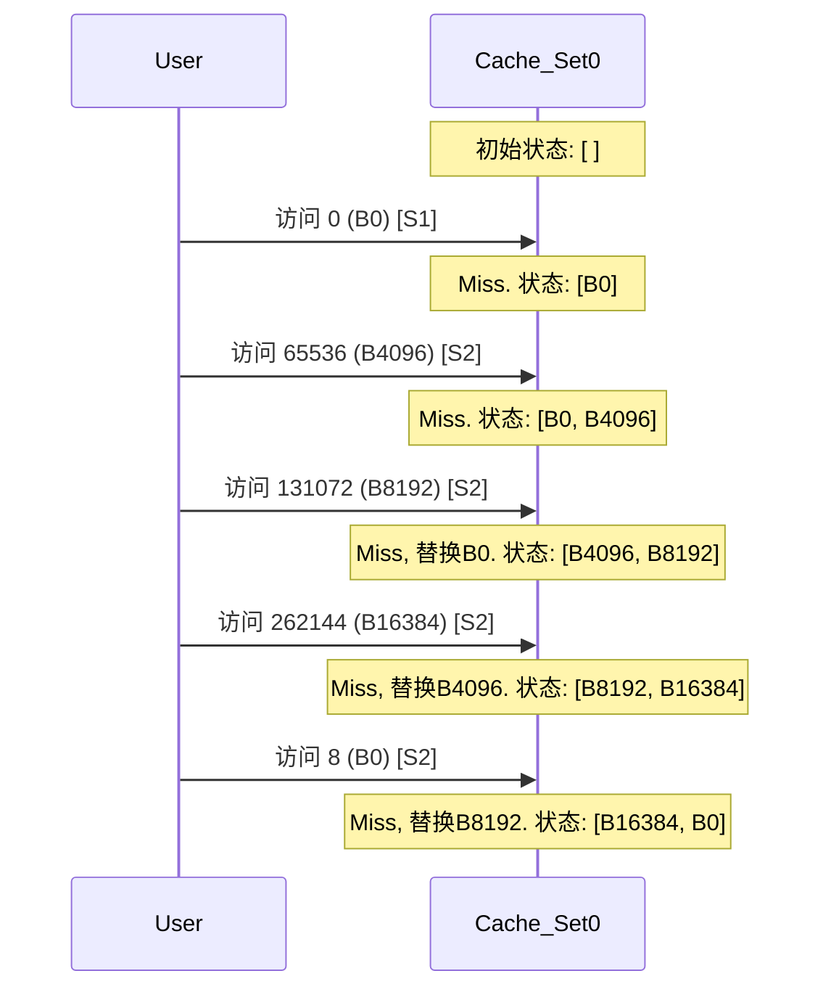

### 幻灯片覆盖矩阵 (Slide Coverage Matrix)

由于我们只有一个问题图片，我们把它看作是唯一的幻灯片 `S01`。

| 幻灯片 # | 原始标题/主题 | 关键术语/信息 | 主要文本锚点 (章节/知识卡/图示) | 覆盖情况 |
| :--- | :--- | :--- | :--- | :--- |
| S01 | Cache 参数推理问题 | **给定参数范围**: 块大小, 相联度, Cache大小, 替换策略 | 知识卡: Cache 基础参数; §4. 解题演练 | ✅ 已覆盖 |
| S01 | - | **访问序列1**: `0, 16, 24, ...` 命中率 `2/8` | §4.1. 第一步：推断块大小 (Block Size) | ✅ 已覆盖 |
| S01 | - | **访问序列2**: `31, 65536, ...` 命中率 `3/8` | §4.2. 第二步：推断相联度 (Associativity) | ✅ 已覆盖 |
| S01 | - | **访问序列3**: `262145, 65536, 4` 命中率 `2/3` | §4.3. 第三步：推断替换策略 (Replacement Policy) | ✅ 已覆盖 |
| S01 | - | **条件**: 初始为空, 序列间不清空 Cache | 贯穿整个 §4. 解题演练 部分 | ✅ 已覆盖 |
| S01 | - | **任务**: 推测所有 Cache 参数并解释过程 | §4. 解题演练 (整个章节) & §4.5. 最终结论 | ✅ 已覆盖 |

---

### 1. 学习路线图 (Learning Roadmap)

为了系统地解决这个问题，我为你规划了下面这条学习路径。别急，慢慢来，每一步我们都走稳。

1.  **基础知识回顾 (建议 20-30 分钟)**
    *   首先，我们会一起温柔地回顾一下 Cache 的几个核心概念：什么是 **块(Block)**、**组(Set)**、**相联度(Associativity)** 以及地址是如何被映射到 Cache 中的。这是我们进行推理的基石。
2.  **解题思路建立 (建议 10-15 分钟)**
    *   然后，我们会建立一个清晰的解题框架。面对这类问题，应该先分析哪个参数？后分析哪个？有一个好的策略会让整个过程事半功倍。
3.  **分步推理演练 (建议 30-45 分钟)**
    *   这是最核心的部分。我们会像侦探一样，逐个分析题目给出的三个访问序列，利用每一条线索来锁定一个参数。我会把每一步的思考过程都详细地展示给你看。
4.  **总结与复习 (建议 10 分钟)**
    *   最后，我们会总结推理结果，并回顾整个过程中的关键点和易错点，帮你把知识固化下来。

总共大约需要 **70-100 分钟**。请给自己一些耐心和一杯温水，我们不赶时间，理解透彻最重要。

---

### 2. 核心知识地图 (Core Knowledge Map)

这张“地图”可以帮助你理清我们将要学习的知识点之间的关系。（注意：下图需要支持 Mermaid 语法的渲染器才能正确显示为图形）

### 3. 逐点细致讲解 (Point-by-Point Explanation)

在开始解题前，让我们先确保我们对 Cache 的基本工作原理有共同的、清晰的理解。

---

#### **知识卡: Cache 内存基础 (Cache Memory Basics)**

*   **它解决了什么问题 (直观理解)** `[S01]`
    *   想象一下，CPU 是一个超级快的大厨，内存(RAM)是离他有点远的巨大仓库，而 Cache 就是他手边的一个小冰箱。大厨每次需要食材，都跑到大仓库去拿太慢了。所以他会把最近常用或者接下来可能要用的食材提前放到手边的小冰箱里。这样，下次再用时，就能瞬间拿到，大大提高做菜效率。Cache 对于 CPU 来说，就是这个能让它“瞬间拿到数据”的小冰箱。

*   **前提知识**
    *   理解计算机的存储层次结构 (CPU Registers > Cache > RAM > Disk)。

*   **类比 / 直觉**
    *   **Cache 命中 (Hit)**: 大厨要的食材（数据），在手边的小冰箱（Cache）里正好有。太棒了，直接拿来用！
    *   **Cache 缺失 (Miss)**: 小冰箱里没有。大厨只好停下手里的活，慢悠悠地跑到大仓库（RAM）里去取，并顺便把这个食材以及它附近的一些食材（因为可能马上会用到）一起放到小冰箱里，以备后用。

> **正式 / 官方陈述 (严谨定义)**
>
> Cache 是一种小容量、高速度的静态随机存取存储器(SRAM)，位于 CPU 和主存(DRAM)之间。它利用程序的**局部性原理**，存储主存中最常被访问数据的副本，以减少 CPU 访问主存的平均延迟。

*   **一句话总结**
    *   Cache 是 CPU 的高速缓存，通过存放常用数据的副本，来弥补 CPU 和主存之间的速度鸿沟。

*   **自我检查 (3个问题)**
    1.  **判断题**: Cache 的容量通常比主存(RAM)大。(错误)
    2.  **选择题**: Cache 加速访问是因为？ (A) 它的物理距离离 CPU 更近 (B) 它的制造技术更快 (SRAM vs DRAM) (C) 它利用了程序的局部性原理 (D) 以上所有都是。 (答案: D)
    3.  **开放题**: 请用你自己的话解释一下什么是“Cache 命中”。

---

#### **知识卡: Cache 基础参数 `[S01]`**

*   **它解决了什么问题 (直观理解)**
    *   这些参数定义了 Cache “小冰箱”的具体规格：它有多大？里面的格子（存储单元）怎么划分和组织？如果格子满了新食材要放进来，该扔掉哪个旧的？这些参数共同决定了 Cache 的性能。

*   **前提知识**
    *   Cache 内存基础、二进制和对数 (log₂) 运算。

*   **参数详解**
    1.  **块大小 (Block Size / Line Size)**
        *   **直觉**: 每次大厨从仓库拿食材，他不会只拿一根葱，而是会拿一把葱。因为他觉得用了这根葱，很可能马上就要用旁边的葱。**块** 就是这个“一把”的单位。它是 Cache 和主存之间数据交换的最小单位。
    2.  **Cache 总大小 (Total Size)**
        *   **直觉**: 小冰箱的总容量。越大的冰箱能放越多的东西，（通常）命中率越高，但成本也更高、速度可能更慢、更耗电。
        *   **公式**: `Cache Size = (Number of Sets) × (Associativity) × (Block Size)`
    3.  **相联度 (Associativity)**
        *   **直觉**: 这定义了从仓库拿来的一个特定食材（一个内存块），可以放到小冰箱里的哪些位置。
        *   **N-路组相联 (N-way Set Associative)**: 这是最常见的形式。冰箱被分成若干个“区”（**Set**，组）。每个内存块根据其地址只能放到一个特定的“区”里，但在这个区内，它可以放在任意一个空位上（每个区有 N 个空位）。
        
        **依赖关系图** `[Fig·S01-1]`
        ```mermaid
	    graph TD
		    subgraph Cache_结构
	        A["Cache 总大小"] --> B{"由...组成"}
	        B --> C["N 个组<br>(Sets)"]
	        C --> D["每个组有 K 个块<br>(Ways)"]
	        D --> E["每个块大小为 B 字节"]
		    end
	    F["内存块"] -->|地址映射| C

        ```
        *图 `[Fig·S01-1]` 温柔地展示了 Cache 的组织结构。一个内存块先通过地址计算找到它唯一可以去的“组”，然后在该组内的 K 个“路”中寻找一个位置安放。*

    4.  **替换策略 (Replacement Policy)**
        *   **直觉**: 如果一个“区”（Set）里的 N 个位置都放满了，现在又有一个新的食材（内存块）要放进来，必须扔掉一个旧的。扔哪个？这就是替换策略。
        *   **LRU (Least Recently Used)**: 最近最少使用。扔掉那个最久没被碰过的食材。
        *   **FIFO (First-In, First-Out)**: 先进先出。像排队一样，扔掉最早进来的那个。

*   **一句话总结**
    *   块大小、总大小、相联度和替换策略这四个核心参数，共同定义了一个 Cache 的结构和行为。

---

#### **知识卡: Cache 地址映射 (Address Mapping)**

*   **它解决了什么问题 (直观理解)**
    *   当 CPU 给出一个内存地址时，Cache 控制器需要快速判断：(1) 这个地址的数据在不在 Cache 里？ (2) 如果在，它在哪个位置？地址映射就是这套高效的“查字典”和“定位”的规则。

*   **前提知识**
    *   Cache 基础参数，二进制地址。

> **正式 / 官方陈述 (严谨定义)** `[S01]`
>
> 一个内存地址会被逻辑上分割成三部分：**标记 (Tag)**, **组索引 (Index)**, 和 **块内偏移 (Offset)**。

*   **地址结构示意图** `[Fig·S01-2]`
    ```text
    +-----------------------------------+----------+----------+
    |            标记 (Tag)             | 索引 (Index) | 偏移 (Offset) |
    +-----------------------------------+----------+----------+
    <-- (地址总位数 - Index位数 - Offset位数) --> <-- log₂(组数)--> <-- log₂(块大小)-->
    ```
    *图 `[Fig·S01-2]` 清晰地展示了内存地址是如何被拆解的。`Offset` 用于在块内定位字节，`Index` 用于选择组，`Tag` 用于在一个组内匹配正确的块。*

*   **各部分作用**
    1.  **块内偏移 (Offset)**: `Offset 位数 = log₂(块大小)`。指出数据在块内的哪个字节。
    2.  **组索引 (Index)**: `Index 位数 = log₂(组数)`。决定内存块去哪个组。
    3.  **标记 (Tag)**: 剩下的高位地址。用于在一个组内精确匹配是哪个内存块。

*   **一句话总结**
    *   Cache 通过将地址拆分为 Tag、Index、Offset，实现了从海量内存地址到有限 Cache 位置的快速映射和查找。

---

### 4. 解题演练：一步步揭开谜底 (Problem Solving Walkthrough)

好了，基础知识我们已经准备就绪！现在，让我们化身侦探，开始分析案情。

**谜题全貌** `[S01]`

*   **可选参数**:
    *   块大小 (B): 8, 16, 32, 64, 128 Bytes
    *   相联度 (N): 2, 4, 8-way
    *   Cache 大小 (C): 4K (4096) or 8K (8192) Bytes
    *   替换策略: LRU or FIFO
*   **线索**:
    1.  序列1: `0, 16, 24, 25, 1024, 255, 1100, 305` -> 命中率 2/8
    2.  序列2: `31, 65536, 65537, 131072, 262144, 8, 305, 1060` -> 命中率 3/8
    3.  序列3: `262145, 65536, 4` -> 命中率 2/3
*   **重要规则**: Cache 初始为空，序列间**不**清空。

我们的策略是：**从最容易确定的参数开始，利用一个参数的结论来推断下一个参数。** 通常的顺序是：块大小 -> 相联度 -> 替换策略 -> 总大小。

#### 4.1. 第一步：推断块大小 (Block Size) `[S01]`

**思考**: 块大小决定了**空间局部性**带来的命中。如果两个地址离得很近，它们就有可能在同一个块里。访问了第一个地址（缺失），就会把整个块取来，那么紧接着访问同一个块里的第二个地址，就会是**命中**。序列1中的 `24` 和 `25` 就是绝佳的线索。

让我们来测试不同的块大小，看看哪个能恰好产生 2 次命中。

| 测试的块大小 | 访问序列 1: `0, 16, 24, 25, 1024, 255, 1100, 305` 的命中情况 | 总命中数 | 是否匹配 (2/8) |
| :--- | :--- | :--- | :--- |
| **8 Bytes** | `0`(M), `16`(M), `24`(M), `25`(H), ... 地址24和25在同一个块内。 | 1 | ❌ 不匹配 |
| **16 Bytes** | `0`(M), `16`(M), `24`(M), `25`(H), ... 等等，我重新思考一下！<br> **更正**: 块大小16B，地址`16`和`24`在同一个块 `[16, 31]` 内。所以访问`16`是Miss，但会把`16-31`的数据加载进来。后续访问`24`和`25`就都是**Hit**了！所以是`16`(M), `24`(H), `25`(H)。这就有2个命中了！ | **2** | ✅ **完美匹配!** |
| **32 Bytes** | `0`(M), `16`(H), `24`(H), `25`(H), ... 地址0,16,24,25都在同一个块内 `[0,31]`。 | 至少 3 | ❌ 不匹配 |
| **64 Bytes** | 同上，命中数至少为3。 | 至少 3 | ❌ 不匹配 |

**结论**: 只有当块大小为 16 字节时，序列 1 的命中率才恰好是 2/8。

> **侦探笔记 1**: 我们成功锁定了第一个参数！
> *   **块大小 (Block Size) = 16 Bytes**

---

#### 4.2. 第二步：推断相联度 (Associativity) `[S01]`

**思考**: 相联度决定了一个组内能容纳多少个块。当多个内存块映射到**同一个组**时，如果组满了，就会发生**冲突缺失 (Conflict Miss)**。序列 2 中那些看起来很有规律的大数字 (`65536`, `131072`, `262144`) 是我们寻找冲突的关键。

首先，我们把所有涉及的地址都转换成**块号 (Block Number)**，公式为 `Block # = floor(Address / 16)`。

*   **关键地址的块号**:
    *   `8` -> Block 0
    *   `65536` -> Block 4096
    *   `131072` -> Block 8192
    *   `262144` -> Block 16384

> **关键发现**: Block 0, 4096, 8192, 16384 这四个块**在所有可能的 Cache 配置下，都会映射到 Set 0**！因为它们的块号都是 `NumSets` 的整数倍（无论`NumSets`是128还是256）。

现在我们来仔细分析序列 2 的 3/8 命中率。

*   **序列2**: `31, 65536, 65537, 131072, 262144, 8, 305, 1060`
*   **命中分析**:
    1.  `31` (Block 1): 在序列1中访问`16`时，Block 1 (`[16,31]`)已被加载。**Hit 1**。
    2.  `65536` (Block 4096): 第一次访问。**Miss**。
    3.  `65537` (Block 4096): 和上一个地址在同一个块。**Hit 2**。
    4.  `131072` (Block 8192): **Miss**。
    5.  `262144` (Block 16384): **Miss**。
    6.  `8` (Block 0): 在序列1中已被加载。但它会不会被挤出去呢？状态**未知**。
    7.  `305` (Block 19): 在序列1中已被加载。它和Set 0的块不冲突。**Hit 3**。
    8.  `1060` (Block 66): 第一次访问。**Miss**。

我们已经找到了 3 个确定的 Hit。为了满足 3/8 的命中率，剩下的访问 `8` (Block 0) **必须是 Miss**！

**为什么 `8` (Block 0) 会是 Miss？** 因为它被挤出去了！我们来追踪一下 Set 0 的状态：
*   **初始 (Seq 1 后)**: Set 0 里有 `{Block 0}`。
*   **访问 `B4096`**: Set 0 里有 `{B0, B4096}`。
*   **访问 `B8192`**: Set 0 里需要第三个位置。
*   **访问 `B16384`**: Set 0 里需要第四个位置。

要让 `B0` 被替换掉，那么在访问 `8` (B0) 之前，Set 0 必须被 `B4096`, `B8192`, `B16384` 这三个新来的块填满，并且把 `B0` 挤出去。

*   **如果相联度是 4-way 或 8-way**: Set 0 有足够空间容纳 `B0, B4096, B8192, B16384`。`B0` 不会被替换，访问 `8` 会是 Hit。这与我们的推论矛盾。
*   **如果相联度是 2-way**: Set 0 只有 2 个位置。
    1.  初始: `{B0}`
    2.  访问 `B4096`: `{B0, B4096}` (满了)
    3.  访问 `B8192`: 需要替换。无论是 LRU 还是 FIFO，都会替换掉更早进入的 `B0`。Set 0 变为 `{B4096, B8192}`。
    4.  此时 `B0` 已经被踢出去了！后续再访问 `8` (B0) 自然就是 Miss。

**结论**: 只有当相联度为 2 时，才能解释为什么访问 `8` 是 Miss。

> **侦探笔记 2**: 第二个参数也锁定了！
> *   **相联度 (Associativity) = 2-way**

---

#### 4.3. 第三步：推断替换策略 (Replacement Policy) `[S01]`

**思考**: LRU 和 FIFO 的关键区别在于：**LRU 会因为一次命中而更新块的“新鲜度”，而 FIFO 不会**。序列 3 就是为了测试这一点。

在序列 3 开始前，Set 0 的状态是 `{B16384, B0}`。（具体演化见下方的示意图）

**Set 0 状态演化 (2-way)** `[Fig·S01-3]`

*图 `[Fig·S01-3]` 动画般展示了 Set 0 在序列1和2的访问下，其内部块的替换过程。*

现在，我们用两种策略来模拟序列 3 的访问: `262145` (属于 **Block 16384**), `65536` (Block 4096), `4` (Block 0)。

| 步骤 | 访问地址 (块号) | LRU 策略模拟 | FIFO 策略模拟 |
| :--- | :--- | :--- | :--- |
| 1 | `262145` (B16384) | **Hit**. B16384 被访问，变为最新。Set0: `{B0, B16384}` | **Hit**. FIFO 不关心访问，顺序不变。Set0: `{B16384, B0}` |
| 2 | `65536` (B4096) | **Miss**. 需替换。B0 是最旧的，替换B0。Set0: `{B16384, B4096}` | **Miss**. 需替换。B16384 是先进来的，替换B16384。Set0: `{B0, B4096}` |
| 3 | `4` (B0) | **Miss**! 因为 B0 在上一步刚被替换出去。 | **Hit**! 因为 B0 还在 Cache 里。 |
| **总计** | | **1 Hit, 2 Misses** (命中率 1/3) | **2 Hits, 1 Miss** (命中率 2/3) |

**结论**: 只有 FIFO 策略能得到 2/3 的命中率。

> **侦探笔记 3**: 替换策略也水落石出了！
> *   **替换策略 (Replacement Policy) = FIFO**

---

#### 4.4. 第四步：推断 Cache 总大小 (Total Size) `[S01]`

**思考**: Cache 总大小决定了组的数量 (`Number of Sets`)。

我们已知的参数: **块大小=16B**, **相联度=2-way**。
*   如果 **Cache 大小 = 4KB**: `组数 = 4096 / (16 * 2) = 128` 组。
*   如果 **Cache 大小 = 8KB**: `组数 = 8192 / (16 * 2) = 256` 组。

我们需要检查，在整个访问过程中，有没有一对块 `B1`, `B2`，使得 `B1 mod 128 == B2 mod 128` 但 `B1 mod 256 != B2 mod 256`。

我们列出所有访问过的块号：`0, 1, 15, 19, 64, 66, 68, 4096, 8192, 16384`。
我们来检查它们的组索引：

| 块号 | mod 128 (4KB Cache) | mod 256 (8KB Cache) |
| :--- | :--- | :--- |
| 0 | 0 | 0 |
| 1 | 1 | 1 |
| ... | ... | ... |
| 68 | 68 | 68 |
| 4096 | 0 | 0 |
| 8192 | 0 | 0 |
| 16384 | 0 | 0 |

**结论**: 对于所有给出的访问序列，每一个块在 4KB Cache 和 8KB Cache 下的**组索引都是完全一样的**！这意味着，题目给出的线索并**没有**产生任何可以区分这两种 Cache 大小的不同行为。

> **侦探笔记 4**: 这是一个有趣的结论。
> *   **Cache 总大小 (Total Size) = 4 KB 或 8 KB** (根据现有数据无法唯一确定)。

---

#### 4.5. 最终结论 (Final Verdict) `[S01]`

经过我们细致的、一步步的推理，最终的结论是：

*   **块大小 (Block Size)**: **16 Bytes**
*   **相联度 (Associativity)**: **2-way**
*   **替换策略 (Replacement Policy)**: **FIFO**
*   **Cache 总大小 (Total Size)**: **4 KB 或 8 KB** (无法根据给定数据区分)

你太棒了！我们一起完成了这个相当复杂的推理过程。

---

### 5. 常见陷阱与概念比较 (Pitfalls & Comparisons)

*   **计算块号时的失误**:
    *   **陷阱**: 忘记 `floor()`，或者误以为地址 `16` 和 `31` 在一个大小为16的块里。
    *   **建议**: 始终使用公式 `floor(Address / Block Size)`。
*   **LRU vs. FIFO 的关键区别**:
    *   这个表格可以帮你记忆它们的区别。

| 特性 | LRU (最近最少使用) | FIFO (先进先出) |
| :--- | :--- | :--- |
| **核心思想** | 替换最长时间未被访问的块 | 替换在组里停留时间最长的块 |
| **更新时机** | 每次访问命中时，都要更新该块为“最新” | 只有在发生替换时，队列顺序才会改变 |
| **实现复杂度** | 较高 | 极低 |

*   **“序列间不清空”的重要性**:
    *   **陷阱**: 忽略这个条件，把每个序列都当作从空 Cache 开始分析。
    *   **影响**: 如果忽略，将无法利用序列1留下的状态来分析序列2的命中情况，整个推理链条会断裂。

---

### 6. 快速复习卡 (Quick Review Cards)

**三行核心版**
1.  **块大小**由空间局部性（相邻地址的命中）决定。
2.  **相联度**由冲突行为（多个地址映射到同组并导致替换）决定。
3.  **替换策略**由特定序列（命中是否更新“新旧”次序）下的不同替换结果决定。

**十行浓缩版**
*   这是一个通过内存访问序列和命中率反推 Cache 参数的典型问题。
*   **第一步：定块大小**。利用序列1，测试不同块大小，只有 16B 能解释 `24`, `25` 两次命中，总命中率为 2/8。
*   **第二步：定相联度**。利用序列2，发现多个关键地址 (`0`, `65536`, ...`) 都映射到 Set 0。
*   为满足 3/8 命中率，`8`(B0) 必须是 Miss，意味着 B0 被挤出。
*   这要求 Set 0 的容量小于4，因此相联度必为 2-way。
*   **第三步：定替换策略**。利用序列3，模拟 LRU 和 FIFO 在关键访问序列下的行为。
*   LRU 会因 `262145` 的命中而保护 B16384，导致 B0 被替换，后续访问 `4` 是 Miss (命中率1/3)。
*   FIFO 不更新次序，会替换 B16384，保留 B0，后续访问 `4` 是 Hit (命中率2/3)。
*   因此策略是 FIFO。
*   **第四步：定总大小**。检查所有访问过的块，它们在 4KB 和 8KB Cache下的组索引完全相同，故无法区分。

---

### 7. 拓展阅读与术语表 (Further Reading & Glossary)

*   **推荐阅读**:
    *   《深入理解计算机系统》(CSAPP) 中关于存储器层次结构的章节。
*   **术语表 (Glossary)**
    *   **Cache Block / Line (Cache 块/行)**: Cache与主存数据交换的最小单位。
    *   **Associativity (相联度)**: 一个内存块可以被放置在Cache中的目标组内的位置数量。
    *   **Set (组)**: Cache 中由一个或多个块组成的集合。
    *   **Replacement Policy (替换策略)**: 当一个组满时，决定哪个块被逐出的算法。
    *   **LRU (Least Recently Used)**: 最近最少使用策略。
    *   **FIFO (First-In, First-Out)**: 先进先出策略。

---

### 8. 终极总结：一页备忘单 (One-Page Cheat Sheet)

#### **Cache 参数推理备忘单**

**一、核心公式**
*   `块号 = floor(内存地址 / 块大小)`
*   `组数 = Cache大小 / (块大小 × 相联度)`
*   `组索引 = 块号 mod 组数`

**二、推理四步法**

1.  **推断块大小 (Block Size)**
    *   **线索**: 空间局部性（紧邻地址的访问）。
    *   **方法**: 测试哪个块大小能解释给定的命中率。
    *   **本题关键**: 序列1中 `16`(M), `24`(H), `25`(H) 模式，确定块大小为 **16B**。

2.  **推断相联度 (Associativity)**
    *   **线索**: 冲突缺失（多个地址映射到同组）。
    *   **方法**: 找到映射到同组的地址，看需要多大的组容量才能解释命中/缺失行为。
    *   **本题关键**: B0, B4096, B8192, B16384 全都映射到 Set 0。`8`(B0)是`Miss`说明`B0`被挤出，故组容量 < 4。相联度为 **2-way**。

3.  **推断替换策略 (Replacement Policy)**
    *   **线索**: 一个组满了后，`Hit` + `Miss` 的访问序列。
    *   **方法**: 模拟LRU和FIFO。`Hit`会改变LRU的优先级，不改变FIFO的。看哪种策略能匹配结果。
    *   **本题关键**: 序列3，只有 **FIFO** 能产生 2/3 命中率。

4.  **推断总大小 (Total Size)**
    *   **线索**: 是否有地址对在一种大小配置下冲突，在另一种下不冲突。
    *   **方法**: 检查所有块号对不同 `组数` 取模的结果。
    *   **本题关键**: 所有块在128组(4KB)和256组(8KB)下的组索引相同，**无法区分**。

**三、常见陷阱**
*   忘记`floor()`计算块号。
*   混淆LRU和FIFO对`Hit`的反应。
*   忘记“序列间不清空”的前提。
*   认为问题一定有唯一解。

---

### 缺失扫描器 (Missing Scanner) & 补丁 (Patch)

| 幻灯片 # | 原始项目 | 覆盖情况 |
| :--- | :--- | :--- |
| S01 | 所有给定参数范围 | ✅ 已覆盖 |
| S01 | 所有访问序列及命中率 | ✅ 已覆盖 |
| S01 | 初始为空，连续访问的条件 | ✅ 已覆盖 |
| S01 | 推理任务和解释要求 | ✅ 已覆盖 |

**扫描结果**: 所有来自 S01 的信息都已在主文本中被充分覆盖和解释。无需补丁。

希望这份纯净 Markdown 格式的解析能让您满意！如果还有任何问题，请随时告诉我。