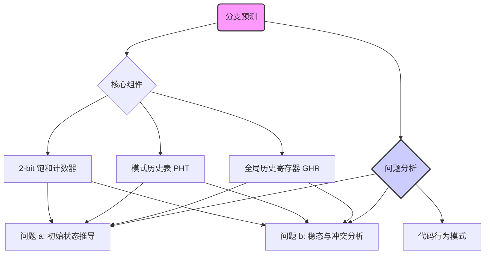
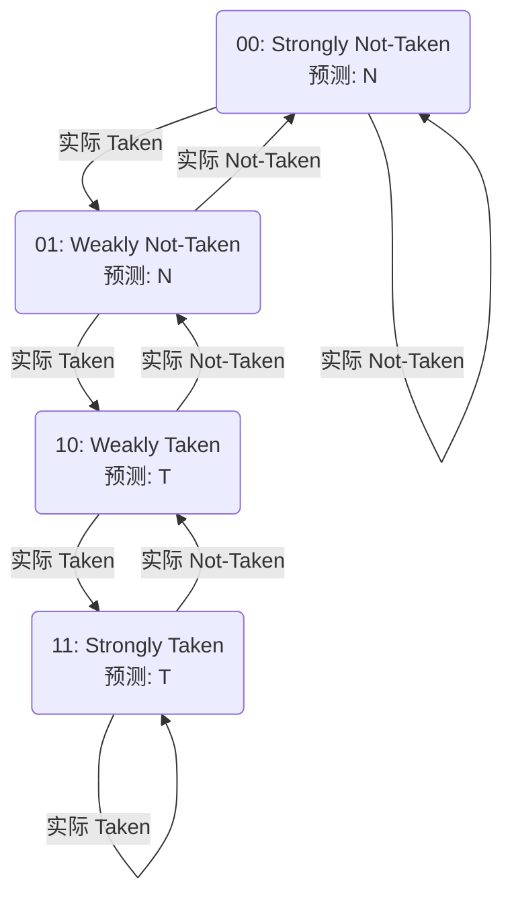

好的，亲爱的同学，你好！

看到这个关于分支预测的作业，你可能会觉得有点抽象和复杂。别担心，这完全正常！分支预测是计算机体系结构中一个非常精妙又重要的概念。我会像一位耐心的向导，一步一步带你走过这片知识的森林，让你不仅能轻松解开这道题，更能真正理解它背后的深刻智慧。

让我们一起，用一种轻松、系统的方式来探索这个有趣的问题吧！

### 幻灯片覆盖矩阵 (Slide Coverage Matrix)

这张作业图片就像我们今天唯一的“幻灯片”。下面是我们如何将它的所有信息点，都妥善地安排在我们的学习之旅中。

| 幻灯片 # | 原始主题/标题   | 关键术语/要点                                                     | 主文本锚点 (章节/知识卡/图示)                        | 覆盖状态  |
| :---- | :-------- | :---------------------------------------------------------- | :--------------------------------------- | :---- |
| S01   | 作业 5 分支预测 | **处理器设定**: 2-bit GHR (初始为 00), PHT, 2-bit 饱和计数器 (00-11 的含义) | 知识卡: GHR, PHT, 2-bit 饱和计数器 `[Fig·S01-1]` | ✅ 已覆盖 |
| S01   | 作业 5 分支预测 | **代码分析**: `for` 循环 (B1), `if` 语句 (B2)                       | 核心概念解析: 代码中的分支行为分析, `[Fig·S01-2]`        | ✅ 已覆盖 |
| S01   | 作业 5 分支预测 | **问题 (a)**: 前 5 次循环所有预测全错的可能性及 PHT 初始值                      | 动手环节: 问题 (a) 详解, `[Fig·S01-3]`           | ✅ 已覆盖 |
| S01   | 作业 5 分支预测 | **问题 (b)**: 稳定状态下能否达到 100% 准确率，对 PHT 初始值有无要求                | 动手环节: 问题 (b) 详解, `[Fig·S01-4]`           | ✅ 已覆盖 |

---

### 1. 学习路线图 (Learning Roadmap)

别急着一头扎进题目里，我们先规划一下路线，这样学习会更高效、更愉快。

1.  **基础概念热身 (建议 15-20 分钟)**: 我们首先会把题目中提到的几个核心部件——`GHR`、`PHT` 和 `2-bit 饱和计数器`——彻底搞明白。这是我们解题的“装备”。
2.  **代码行为分析 (建议 5-10 分钟)**: 接着，我们会像侦探一样，仔细分析那段 C++ 代码，弄清楚两个分支 (B1 和 B2) 的行为模式。
3.  **动手解谜 (建议 25-35 分钟)**: 最后，装备齐全、案情明了，我们就可以开始解决问题 (a) 和 (b) 了。我会用非常详细的表格，带你一步步追踪处理器的“思考”过程。

整个过程大约需要 45-60 分钟。请放松心情，准备一杯你喜欢的热茶或咖啡，我们马上开始。

---

### 2. 核心知识地图 (Core Knowledge Map)

为了让你对我们将要学习的内容有个整体印象，这里有一张知识地图：



这张图清晰地展示了，理解 GHR、PHT 和计数器这三个基础组件，是我们解决两个具体问题的基石。

---

### 3. 核心概念逐点解析 (Point-by-Point Explanation)

在解题之前，我们必须先认识一下我们的“工具”。

---

#### **知识卡: 为什么需要分支预测？**

*   **它解决了什么问题 (直观)**: 现代处理器像一条高速运转的流水线，每个环节都在处理不同的指令。当遇到一个 `if` 这样的“岔路口”时，流水线不知道该把哪条路的指令放进来。如果猜错了，就得把已经放进来的指令全部扔掉，再重新加载正确路径的指令，这会浪费大量时间，就像高速公路上走错了出口，需要绕一大圈才能回来。分支预测就是处理器的“导航系统”，它会猜一条最可能正确的路，让流水线一直跑下去。
*   **前提知识**: 处理器流水线的基本概念。
*   **一句话总结**: 分支预测是为了不让 `if` 等条件分支语句“堵塞”处理器的高速流水线而进行的一种智能猜测。

---

#### **知识卡: 全局历史寄存器 (Global History Register, GHR) `[S01]`**

*   **它解决了什么问题 (直观)**: 有时候，一个分支是否会发生，与它“之前”发生过的其他分支结果有关。GHR 就是一本“小账本”，专门记录最近几次分支的实际结果（是“跳转了”还是“没跳转”）。
*   **前提知识**: 无，这是一个基础定义。
*   **类比/直觉**: 想象你在玩“石头剪刀布”。如果你发现对手总是喜欢在出了“石头”之后出“布”，你就会记住这个“石头”的历史，然后预测他下一次会出“布”。GHR 就是帮你记住“对手最近出了什么”的那个短期记忆。
*   **官方/正式说明**: GHR 是一个移位寄存器，用于记录全局（所有分支共享）最近 N 次分支的执行结果。如果分支发生（Taken），一个 `1` 被移入；如果分支未发生（Not Taken），一个 `0` 被移入。
*   **关键参数 (本题中)**:
    *   **大小**: 2-bits。这意味着它只记录最近 **2** 次分支的结果。
    *   **初始值**: `00`。表示系统启动时，假设最近两次分支都是 "Not Taken"。
*   **一句话总结**: GHR 是一个记录最近几次分支历史结果（T/N）的“短期记忆”寄存器。

---

#### **知识卡: 模式历史表 (Pattern History Table, PHT) `[S01]`**

*   **它解决了什么问题 (直观)**: 光有历史记录 (GHR) 还不够，我们还需要一个“策略本”，告诉我们根据某个特定的历史模式（比如“先 T 后 N”），下一步该怎么猜。PHT 就是这个策略本。
*   **前提知识**: 全局历史寄存器 (GHR)。
*   **类比/直觉**: 接续“石头剪刀布”的例子。你的大脑里有个策略：
    *   如果对手的历史是“石头 -> 布”，那么我下次就出“剪刀”。
    *   如果对手的历史是“剪刀 -> 剪刀”，那么我下次就出“石头”。
    PHT 就存储了这些 “如果历史是 XXX，那么我预测 YYY” 的策略。
*   **官方/正式说明**: PHT 是一个由多个条目（Entry）组成的表。每个条目都包含一个预测器状态（在本题中是饱和计数器）。GHR 的当前值被用作索引，来查找 PHT 中对应的条目，从而得到本次的预测。
*   **关键参数 (本题中)**:
    *   **索引**: 2-bit 的 GHR，所以 GHR 的可能值有 `00`, `01`, `10`, `11` 四种。
    *   **条目**: PHT 因此有 4 个条目，分别对应 GHR 的四种模式。`[S01]` 的表格中也列出了这四个条目：NN, NT, TN, TT (这里 N 代表 0, T 代表 1)。

```text
       GHR 的值       
      (历史模式)
          │
          ▼
      ┌─────────┐
 ┌───>│ PHT[00] │  (对应 NN 模式的计数器)
 │    ├─────────┤
 ├───>│ PHT[01] │  (对应 NT 模式的计数器)
 │    ├─────────┤
 └───>│ PHT[10] │  (对应 TN 模式的计数器)
      ├─────────┤
      │ PHT[11] │  (对应 TT 模式的计数器)
      └─────────┘
          │
          ▼
      取出对应的计数器，
      用它的状态来做预测
```
**[Fig·S01-1]** 这张示意图温柔地展示了 GHR 如何像一把钥匙一样，打开 PHT 中对应的“抽屉”（条目），来获取预测策略。

---

#### **知识卡: 2-bit 饱和计数器 (2-bit Saturating Counter) `[S01]`**

*   **它解决了什么问题 (直观)**: 这是 PHT 每个条目里的“大脑”。它不仅仅是做一次性预测，而是会根据预测的对错来“学习”和“调整”。它比简单的开关更有“惯性”或“信念”，不会因为一次偶然的错误就彻底改变看法。
*   **前提知识**: 模式历史表 (PHT)。
*   **类比/直觉**: 想象你对某支球队的看法。
    *   `11` (Strongly Taken): “我铁信这队会赢！” (预测赢)
    *   `10` (Weakly Taken): “我感觉这队会赢。” (预测赢)
    *   `01` (Weakly Not Taken): “我感觉这队会输。” (预测输)
    *   `00` (Strongly Not Taken): “我铁信这队会输！” (预测输)
    如果它真的赢了，你的信心会增加（向 `11` 移动）。如果它输了，你的信心会减弱（向 `00` 移动）。“饱和”的意思是，一旦你到了“铁信” (`11` 或 `00`) 的状态，就算再赢/输一次，你的看法也不会更强了，已经到顶了。
*   **官方/正式说明 `[S01]`**:
    *   这是一个 4 状态的状态机。
    *   **预测规则**: 看最高位 (MSB)。如果 MSB 是 `1` (状态 `10`, `11`)，则预测 **Taken**。如果 MSB 是 `0` (状态 `00`, `01`)，则预测 **Not Taken**。
    *   **更新规则**:
        *   如果分支 **实际发生 (Taken)**，计数器 **加 1** (除非已经是 `11`)。
        *   如果分支 **实际未发生 (Not Taken)**，计数器 **减 1** (除非已经是 `00`)。


**[Fig·S01-2]** 2-bit 饱和计数器的状态转换图。它清晰地展示了计数器如何根据分支的实际结果，在四个状态之间“摇摆”，调整自己的“信念”。

---

### 4. 动手环节：一步步解开谜题 (Hands-On: Solving the Puzzle)

好了，基础知识我们已经掌握。现在，让我们来解决 `[S01]` 中的两个问题。

#### **第一步：分析代码中的分支行为**

首先，我们必须弄清楚 B1 和 B2 两个分支到底在做什么。

*   **分支 B1 (`for` 循环)**: `for (int i = 0; i < 1000000; i++)`
    *   这个分支检查 `i` 是否小于 1,000,000。
    *   对于 `i = 0, 1, ..., 999998`，条件都成立，所以分支 **总是 Taken (T)**。
    *   只有在最后一次，`i = 999999` 时，下一次检查 `i++` 后 `i` 变成 1,000,000，条件不成立，分支 **Not Taken (N)**，循环退出。
    *   **结论**: B1 在绝绝绝大多数情况下都是 **Taken**。

*   **分支 B2 (`if` 语句)**: `if (i % 3 == 0)`
    *   这个分支检查 `i` 是否能被 3 整除。
    *   当 `i = 0, 3, 6, ...` 时，条件成立，分支 **Taken (T)**。
    *   当 `i = 1, 2, 4, 5, ...` 时，条件不成立，分支 **Not Taken (N)**。
    *   **结论**: B2 的行为模式是一个清晰的重复序列：**T, N, N, T, N, N, ...**

#### **分支执行序列**

在循环中，分支是交替执行的：先是 B1，如果 B1 是 Taken，那么就执行 B2。因为 B1 在前 1,000,000 次几乎总是 Taken，所以实际的分支执行顺序是：B1, B2, B1, B2, B1, B2, ...

| 循环 `i` | 分支 | 实际结果 (Actual) | 备注 |
| :--- | :--- | :--- | :--- |
| 0 | B1 | **T** (Taken) | `0 < 1000000` |
| | B2 | **T** (Taken) | `0 % 3 == 0` |
| 1 | B1 | **T** (Taken) | `1 < 1000000` |
| | B2 | **N** (Not Taken) | `1 % 3 != 0` |
| 2 | B1 | **T** (Taken) | `2 < 1000000` |
| | B2 | **N** (Not Taken) | `2 % 3 != 0` |
| 3 | B1 | **T** (Taken) | `3 < 1000000` |
| | B2 | **T** (Taken) | `3 % 3 == 0` |
| 4 | B1 | **T** (Taken) | `4 < 1000000` |
| | B2 | **N** (Not Taken) | `4 % 3 != 0` |

**[Fig·S01-3]** 这是前 5 次循环 (`i=0` 到 `i=4`) 中，共 10 个分支事件的真实结果。这是我们解决问题 (a) 的“真相记录”。

---

#### **问题 (a) 详解：前 5 次循环所有预测都出错可能吗？ `[S01]`**

答案是 **可能** 的。要实现这一点，我们需要为 PHT 的 4 个条目设置特定的初始值。下面我们来当一次侦探，通过追踪处理器的状态来反推出这些初始值。

我们的目标是让下表中“预测结果”这一列，**每一步都和“实际结果”相反**。

**初始状态**: GHR = `00`

**追踪表:**
(PHT 条目的值用 `SN(00)`, `WN(01)`, `WT(10)`, `ST(11)` 表示)

| # | `i` | 分支 | **GHR (预测前)** | **PHT 索引** | **实际结果 (A)** | **要求预测 (P)** | **对 PHT[索引] 初始值的要求** | **GHR (更新后)** |
|:-:|:-:|:--:|:---:|:---:|:---:|:---:|:--- |:---:|
| 1 | 0 | B1 | `00` | NN | **T** | **N** | `PHT[NN]` 必须是 `SN` 或 `WN` | `01` |
| 2 | 0 | B2 | `01` | NT | **T** | **N** | `PHT[NT]` 必须是 `SN` 或 `WN` | `11` |
| 3 | 1 | B1 | `11` | TT | **T** | **N** | `PHT[TT]` 必须是 `SN` 或 `WN` | `11` |
| 4 | 1 | B2 | `11` | TT | **N** | **T** | PHT[TT] 在此刻的状态必须是 `WT` 或 `ST` **(见注1)** | `10` |
| 5 | 2 | B1 | `10` | TN | **T** | **N** | `PHT[TN]` 必须是 `SN` 或 `WN` | `01` |
| 6 | 2 | B2 | `01` | NT | **N** | **T** | PHT[NT] 在此刻的状态必须是 `WT` 或 `ST` **(见注2)** | `10` |
| 7 | 3 | B1 | `10` | TN | **T** | **N** | PHT[TN] 在此刻的状态必须是 `SN` 或 `WN` **(见注3)** | `01` |
| 8 | 3 | B2 | `01` | NT | **T** | **N** | PHT[NT] 在此刻的状态必须是 `SN` 或 `WN` **(见注4)** | `11` |
| 9 | 4 | B1 | `11` | TT | **T** | **N** | PHT[TT] 在此刻的状态必须是 `SN` 或 `WN` **(见注5)** | `11` |
| 10| 4 | B2 | `11` | TT | **N** | **T** | PHT[TT] 在此刻的状态必须是 `WT` 或 `ST` **(见注6)** | `10` |

**[Fig·S01-4]** 这是解决问题 (a) 的核心追踪表。它记录了每一步的状态变化和对 PHT 初始值的约束。

**关键节点的详细分析 (非常重要！)**

*   **注1 (事件 4)**: 在事件 3 中，我们要求 `PHT[TT]` 初始为 `SN/WN`。它遇到了一个 `T` 结果，所以它的状态会向 `T` 更新。
    *   如果初始是 `SN(00)`，更新后变 `WN(01)`。此刻预测仍是 `N`，**不满足**“预测 T”的要求。
    *   如果初始是 `WN(01)`，更新后变 `WT(10)`。此刻预测是 `T`，**满足**“预测 T”的要求！
    *   所以，**PHT[TT] 的初始值必须是 `WN(01)`**。

*   **注2 (事件 6)**: 类似于注1。在事件 2 中，`PHT[NT]` (初始 `SN/WN`) 遇到 `T`，状态更新。
    *   如果初始是 `SN(00)` -> `WN(01)` (预测 N，不满足)。
    *   如果初始是 `WN(01)` -> `WT(10)` (预测 T，满足)。
    *   所以，**PHT[NT] 的初始值必须是 `WN(01)`**。

*   **注3 (事件 7)**: `PHT[TN]` 在事件 5 时遇到 `T`。
    *   如果初始是 `SN(00)` -> `WN(01)`。此刻预测 N，满足。
    *   如果初始是 `WN(01)` -> `WT(10)`。此刻预测 T，不满足。
    *   所以，**PHT[TN] 的初始值必须是 `SN(00)`**。

*   **注4 (事件 8)**: `PHT[NT]` 在事件 6 时遇到 `N`，从 `WT(10)` 更新回 `WN(01)`。此刻预测 N，满足。这个条件自动满足，无需额外约束。

*   **注5 (事件 9)**: `PHT[TT]` 在事件 4 时遇到 `N`，从 `WT(10)` 更新回 `WN(01)`。此刻预测 N，满足。这个条件也自动满足。

*   **注6 (事件 10)**: `PHT[TT]` 在事件 9 时遇到 `T`，从 `WN(01)` 更新回 `WT(10)`。此刻预测 T，满足。这个条件也自动满足。

**最终结论 (a):**

结合以上所有约束，为了让前 5 次循环（10 个分支）的预测全部错误，PHT 各条目的初始值必须为：

| PHT Entry (模式) | Value (初始值) |
| :--- | :--- |
| TT (11) | **WN (01)** |
| TN (10) | **SN (00)** |
| NT (01) | **WN (01)** |
| NN (00) | `SN(00)` 或 `WN(01)` **(没有被后续步骤约束，两者皆可)** |

使用题目要求的 `N` 和 `T` 表示法 (N: `00`/`01`, T: `10`/`11`)，PHT 的初始值可能为：
*   **TT**: N
*   **TN**: N
*   **NT**: N
*   **NN**: N

所以，只要所有 PHT 条目初始都设置为 Not Taken (Strongly or Weakly)，并且满足我们推导出的更精确的 `WN` 和 `SN` 的组合，就可以实现全部预测错误。

---

#### **问题 (b) 详解：稳态下能否达到 100% 准确率？ `[S01]`**

答案是：**不可以达到 100% 准确率**。

**为什么呢？** 让我们进入“稳态”看一看。稳态是指经过很多次循环后，GHR 和 PHT 的状态达到一种动态平衡或循环。

1.  **分析稳态下的分支模式**:
    *   B1 永远是 **T** (除了最后一次)。
    *   B2 是 **T, N, N** 的循环。
    *   所以，整个系统的分支 **结果序列** 是 `T(B1), T(B2), T(B1), N(B2), T(B1), N(B2)` ... 无限循环。
    *   我们把这个结果序列简写为: `T, T, T, N, T, N, T, T, T, N, T, N, ...`

2.  **寻找冲突 (Aliasing)**:
    我们来看看，有没有可能同一个“历史模式”（同一个 GHR 值）后面，却跟着不同的“未来”（不同的分支结果）？如果有，预测器就会“精神分裂”，不知道该怎么猜了。

    让我们追踪一下 GHR 的状态：
    (假设 GHR 初始是 `00`，我们让系统跑几步)
    *   `GHR=00`, 结果 T -> `GHR=01`
    *   `GHR=01`, 结果 T -> `GHR=11`
    *   `GHR=11`, 结果 T -> `GHR=11`
    *   `GHR=11`, 结果 N -> `GHR=10`
    *   `GHR=10`, 结果 T -> `GHR=01`  **<-- 第一次看到 GHR 变成 01**
    *   `GHR=01`, 结果 N -> `GHR=10`  **<-- 第二次看到 GHR 变成 01**

    我们发现了关键问题！请看下表：

| 当前循环 `i` | 最近两次结果 | GHR (预测前) | 当前分支 | 实际结果 |
|:---:|:---:|:---:|:---:|:---:|
| `i % 3 == 2` | `...T, T` | `11` | B1 | **T** |
| | `...T, T` | `11` | B2 | **N** |
| `i % 3 == 0` | `...T, N` | `10` | B1 | **T** |
| | `...N, T` | `01` | B2 | **T** |
| `i % 3 == 1` | `...T, T` | `11` | B1 | **T** |
| | `...T, T` | `11` | B2 | **N** |
| `i % 3 == 2` | `...T, N` | `10` | B1 | **T** |
| | `...N, T` | `01` | B2 | **N** |

**[Fig·S01-5]** 稳态下的 GHR 与分支结果关系表，揭示了冲突的根源。

**冲突点分析**:
*   当 `i-1` 是 `2, 5, 8, ...` 时，最近两次分支结果是 `T(B1), N(B2)`。此时 GHR 变为 `10`。
*   当 `i` 是 `0, 3, 6, ...` 时，最近两次分支结果是 `T(B1), T(B2)`。此时 GHR 变为 `11`。
*   当 `i` 是 `1, 4, 7, ...` 时，最近两次分支结果是 `T(B1), N(B2)`。此时 GHR 变为 `10`。

让我们重新聚焦于 `GHR = 01` (历史是 `NT`) 的情况。
- **情况1**: 在 `i=3` 之后，B1 发生 (T)，GHR 变成 `01` (因为之前的历史是`10`, `T` 移入)。接下来要预测 B2 (`i=4`时)，实际结果是 **N**。
- **情况2**: 在 `i=2` 之后，B1 发生 (T)，GHR 变成 `01` (因为之前的历史是 `10`, `T` 移入)。接下来要预测 B2 (`i=3`时)，实际结果是 **T**。

预测器陷入了两难境地：
当它看到历史 `GHR=01` (模式 `NT`) 时，它应该预测 B2 为 **T** 还是 **N** 呢？
*   如果 PHT 的计数器最终稳定在 `WT/ST` (预测 T)，那么在情况 1 中它就会预测错误。
*   如果 PHT 的计数器最终稳定在 `WN/SN` (预测 N)，那么在情况 2 中它就会预测错误。

这种现象叫做 **别名 (Aliasing)** 或 **冲突 (Interference)**。因为 2-bit 的 GHR 不够长，无法区分这两种导致了不同 B2 结果的、更深层的历史模式。因此，PHT 对应的计数器会不停地在 Taken 和 Not Taken 之间摇摆，导致对 B2 的预测必然会周期性地出错。

**结论 (b):**
*   该分支预测器的准确率 **无法达到 100%**。
*   原因是 **GHR 的长度不足**，产生了别名现象，使得 PHT 的同一个条目（`PHT[01]`）需要对两种不同的后续行为做出预测，导致必然出错。
*   因此，**对 PHT 的初始值没有任何特殊要求**。无论初始值是什么，经过足够多的循环后，系统都会进入这种存在冲突的稳态，准确率无法达到 100%。

---

### 5. 常见陷阱与比较 (Pitfalls & Comparisons)

*   **陷阱1：更新顺序**
    *   一个常见的误区是搞错 GHR 和 PHT 的更新时机。
    *   **正确顺序**: 1. 使用当前 GHR 查 PHT 做预测 -> 2. 执行分支，得到实际结果 -> 3. 用实际结果更新 PHT 计数器 -> 4. 用实际结果更新 GHR。 GHR 的更新是为了 **下一次** 预测做准备。

*   **陷阱2：把所有分支看成一样**
    *   这个预测器是全局的，B1 和 B2 共享同一个 GHR。B1 的结果会影响 B2 的预测，B2 的结果也会影响下一次 B1 的预测。必须把它们看作一个交织在一起的序列。

*   **与简单预测器比较**
    *   如果这是一个简单的、没有 GHR 的 **Bimodal 预测器** (每个分支有自己的计数器，但没有历史模式)，它会对 B2 预测得更差。因为它会看到 B2 的结果是 `T, N, N` 循环，它的计数器会不停摇摆，可能三次中会错两次。
    *   我们这个 **Correlating Predictor (相关预测器)** 已经更聪明了，它试图利用历史模式来区分，只是因为历史记录得太短 (2-bits) 而失败了。如果 GHR 是 3-bits，也许就能解决这个冲突，达到更高的准确率！

---

### 6. 快速复习卡 (Quick Review Cards)

#### **三句话极简版**

1.  这是一个利用最近 2 次分支结果 (GHR) 来从 4 个计数器 (PHT) 中选一个进行预测的系统。
2.  通过仔细追踪前 10 次分支的状态，可以反推出能让预测全错的 PHT 初始值，关键是 `WN(01)` 状态的巧妙运用。
3.  系统在稳态下无法达到 100% 准确率，因为 2-bit GHR 太短，导致同一个历史模式 `GHR=01` 对应了两种不同的 B2 结果，产生了无法解决的预测冲突。

#### **十句话浓缩版**

1.  分支预测通过猜测 `if` 等语句的走向，避免处理器流水线停顿。
2.  本题的预测器使用 2-bit GHR (全局历史) 作为索引，来查找 PHT (模式历史表)。
3.  PHT 中有 4 个条目，每个都是一个 2-bit 饱和计数器。
4.  计数器的最高位决定预测 (0=N, 1=T)，并根据实际结果更新。
5.  代码中 B1 分支几乎总是 T，B2 分支按 `T, N, N` 模式循环。
6.  **问题 (a)**: 可以让前 5 轮预测全错。通过精细的状态追踪，可以确定 PHT 条目必须初始为特定的 `WN` 或 `SN` 状态，才能在需要时做出错误的 `T` 或 `N` 预测。
7.  **问题 (b)**: 无法达到 100% 准确率。
8.  原因是稳态下，分支结果序列 (`T, T, T, N, T, N...`) 会导致 GHR 状态 `01` (历史 `NT`) 有时后面跟着 B2 的 `T` 结果，有时跟着 `N` 结果。
9.  这种一个 GHR 模式对应多种结果的现象叫“别名/冲突”，使 PHT 的对应条目无法做出持续正确的预测。
10. 因为冲突是结构性的，所以无论 PHT 初始值如何，最终都无法达到 100% 准确率。

---

### 7. 术语表与推荐阅读 (Glossary & Further Reading)

*   **分支预测 (Branch Prediction)**: 处理器预测条件跳转方向的技术。
*   **全局历史寄存器 (GHR - Global History Register)**: 记录最近 N 次全局分支结果的寄存器。
*   **模式历史表 (PHT - Pattern History Table)**: 存储不同历史模式对应预测状态的表。
*   **饱和计数器 (Saturating Counter)**: 一种有上下限的计数器，达到限值后不再增减。
*   **别名/冲突 (Aliasing/Interference)**: 在分支预测中，不同的分支或不同的代码路径，错误地使用了 PHT 中的同一个预测器条目，导致互相干扰。

如果你对这个主题产生了浓厚的兴趣，推荐阅读计算机体系结构的经典教材：
*   《计算机体系结构：量化研究方法》 (Computer Architecture: A Quantitative Approach) by Hennessy & Patterson - 这是该领域的“圣经”，其中有关于分支预测的精彩章节。

---

### 8. 总结：一页纸备忘录 (One-Page Cheat Sheet)

#### **分支预测核心要素 (本题)**

*   **输入**: GHR (2-bit 全局历史)
*   **决策核心**: PHT (4-entry, GHR-indexed)
*   **决策单元**: 2-bit 饱和计数器
    *   **状态**: `00`(SN), `01`(WN), `10`(WT), `11`(ST)
    *   **预测**: MSB=0 -> Predict N; MSB=1 -> Predict T
    *   **更新**: 实际 T -> +1 (max 11); 实际 N -> -1 (min 00)
    *   **状态机图**: `SN <-> WN <-> WT <-> ST`

#### **代码行为模式**

*   **B1 (`for`)**: T, T, T, T, ... (几乎总是 T)
*   **B2 (`if`)**: T, N, N, T, N, N, ... (周期性)
*   **执行序列**: B1, B2, B1, B2, ...

#### **问题求解清单**

*   **问题 (a) - 全错初始值**:
    1.  列出前 10 个分支的实际结果 (T/N)。
    2.  从 `GHR=00` 开始，一步步追踪。
    3.  在每一步，根据“预测必须错”的原则，倒推出对 PHT 条目 **当前** 状态的要求。
    4.  结合PHT条目的 **更新历史**，推导出它在 **循环开始前** 的初始值。
    5.  关键在于利用 `WN(01)` 更新到 `WT(10)` 来实现从“预测 N”到“预测 T”的翻转。

*   **问题 (b) - 100% 可能性**:
    1.  写出稳态下的分支 **结果** 序列 (`T, T, T, N, T, N...`)。
    2.  追踪 GHR 的状态变化，寻找 **同一个 GHR 值** 在序列中反复出现的情况。
    3.  检查在这些 GHR 值出现时，**下一次** 的分支结果是否 **总是相同**。
    4.  如果发现同一个 GHR 值后面跟着 **不同** 的分支结果，即存在 **冲突 (Aliasing)**。
    5.  **结论**: 存在冲突 -> PHT 同一条目被污染 -> 无法 100% 准确。

#### **核心启示**

*   分支预测的性能瓶颈常常在于 **历史信息的不足**，导致无法区分相似但结果不同的代码路径，产生 **别名冲突**。更长的 GHR 或更复杂的预测器结构是解决之道。

希望这份详尽的指南能帮助你彻底理解这个题目。如果你还有任何困惑，随时都可以再问我！学习是一个不断探索的过程，每一步都算数。加油！

---

### 最终检查：缺失扫描器 (Missing Scanner)

现在，我将对照原始图片，检查是否有任何遗漏的信息。

1.  `2-bits Global History Register (GHR)`: ✅ 已在知识卡中详细解释。
2.  `GHR 初始值为 00`: ✅ 已在 GHR 知识卡和问题 (a) 的求解中明确使用。
3.  `Pattern History Table Entry (PHTE)`: ✅ 已在 PHT 知识卡中解释。
4.  `2-bits 饱和计数器含义 (00-11)`: ✅ 已在饱和计数器知识卡中用状态机图详细解释。
5.  `代码片段 (for, if)`: ✅ 已深入分析其分支行为模式。
6.  `两个分支 B1 和 B2`: ✅ 已明确标识并分析。
7.  `问题 (a) 的完整要求`: ✅ 已完整回答，并给出了推导过程和最终的 PHT 初始值。
8.  `问题 (b) 的完整要求`: ✅ 已完整回答，解释了为何不能达到 100% 并讨论了对初始值的要求。
9.  `Table 1: PHT`: ✅ 在问题 (a) 的结论中填充了该表。

**扫描结果**: 所有在 `[S01]` 中出现的关键信息点都已在主文本中得到完整、系统的覆盖。没有需要修补的内容。