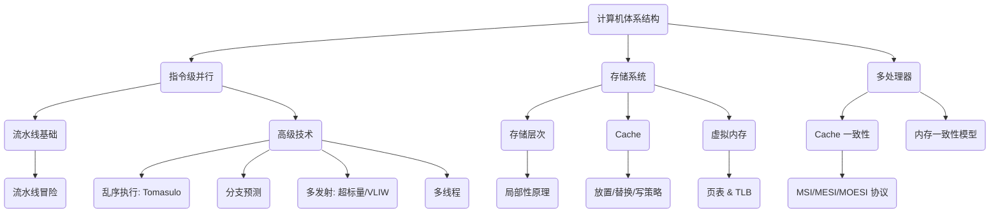

### **《计算机体系结构》期末复习讲义** `[S01]`

#### **学习路线图 `[C01]`**

1.  **流水线基础 (Pipelining)**：理解计算机如何通过“并行处理”指令的不同阶段来提速。（预计 1.5 小时）
2.  **存储层次与缓存 (Memory & Cache)**：探索如何通过构建金字塔式的存储结构，实现“既快又大”的内存幻想。这是性能优化的关键。（预计 2.5 小时）
3.  **虚拟内存 (Virtual Memory)**：学习操作系统和硬件如何联手为每个程序创造一个独立的、巨大的内存空间，并理解其地址转换的魔法。（预计 2 小时）
4.  **高级处理器技术**：深入了解乱序执行、分支预测、多发射和多线程等技术，看看处理器是如何变得越来越“聪明”的。（预计 3 小时）
5.  **多处理器与一致性**：进入多核时代，理解多个处理器协同工作时，如何确保数据的一致性。（预计 2 小时）

#### **核心知识图 `[C02]`**

这份知识图可以帮助你快速定位各个概念之间的关系：


*   **[Fig·C02-1]** 核心知识领域关联图。展示了课程的三大支柱：指令级并行、存储系统和多处理器系统，以及它们各自的核心子主题。

---

### **第一章：简单5级流水线（回顾）** `[S02]`

#### **知识卡片：流水线 (Pipeline) `[S03]`**

*   **要解决的问题（直觉）**：
    想象一下汽车工厂的装配线。如果一辆车从头到尾都由一个工人完成，那效率会很低。但如果把装配过程分成 “安装引擎”、“安装车门”、“喷漆” 等多个步骤，让不同的工位同时处理不同的汽车，工厂的总产量（吞吐量）就会大大增加。流水线就是计算机里的“指令装配线”。

*   **先修要求**：
    了解一条指令在CPU中执行的基本步骤（如取指、译码、执行等）。

*   **类比 / 直觉**：
    就像前面提到的汽车装配线，每辆车（指令）顺序地经过所有工位（流水线阶段）。当第一辆车进入第二工位时，第二辆车就可以进入第一工位了。虽然造一辆车的时间没变，但每隔一小段时间就有一辆新车下线，整体效率大大提升。

*   **形式化表述（严格）** `[S03]`：
    流水线是一种将指令执行过程划分为多个独立阶段（Stages）的实现技术。`[S03]` 多个指令的不同阶段可以重叠执行，从而提高处理器资源的利用率和指令的吞吐量（Throughput）。

*   **核心思想** `[S03]`：
    **提升指令吞吐量，而不是缩短单条指令的执行时间。** 这意味着单位时间内完成的指令数增加了，但完成任意一条特定指令所需的时间（延迟）可能还会略微增加。

*   **关键结论** `[S03]`：
    1.  **指令执行被划分成多个阶段**：例如经典的5级流水线：取指（IF）、译码（ID）、执行（EX）、访存（MEM）、写回（WB）。
    2.  **指令顺序经过所有阶段**：`[S03]` 每条指令都必须按顺序通过所有流水线阶段。
    3.  **并行方式**：实现的是“指令-阶段”并行。在任意一个时钟周期，多个指令处于不同的执行阶段。
    4.  **频率提升**：`[S03]` 相比于单周期CPU（所有操作在一个大周期内完成），流水线将操作划分到更小的阶段，使得时钟周期可以缩短（频率可以提高），指令进入和离开流水线的频率更快。

*   **内联小图（示意图）**：

    ```
    时钟周期 ->   1         2         3         4         5
    ----------------------------------------------------------
    指令 1:    [Fetch]   [Decode]  [Execute]
    指令 2:              [Fetch]   [Decode]  [Execute]
    指令 3:                        [Fetch]   [Decode]  [Execute]
    ```
    *   **[Fig·S03-1]** 简化的三阶段流水线示意图。`[S03]` 展示了在第3个时钟周期时，指令1正在执行，指令2正在译码，指令3正在取指，实现了时间上的重叠执行。

*   **一句话带走**：
    流水线通过让多条指令“接力跑”，提高了CPU整体的“完赛率”（吞吐量），而不是让单个选手跑得更快。

#### **知识卡片：流水线性能的现实挑战 `[C03]`**

- 理想的流水线能把单周期CPU的执行时间除以阶段数，从而获得巨大的性能提升。但现实为什么总是不那么完美？

*   **为什么流水线的时钟周期 > (单周期CPU时钟周期 / 流水段个数)？** `[S04]`
    1.  **流水段间的寄存器延迟** `[S04]`：每个阶段之间需要插入流水线寄存器来保存中间结果。这些寄存器的读写本身就需要时间（延迟），构成了额外的开销 (Overhead)。
    2.  **流水段时长不均** `[S04]`：流水线的时钟周期必须迁就最慢的那个阶段。就像木桶原理，最短的板决定了容量。
    3.  **额外逻辑延迟** `[S04]`：为了处理流水线中的各种复杂情况（比如后面会讲到的“冒险”），需要增加如前递旁路等额外电路，这些也会增加延迟。

    > **重要推论** `[S04]`：随着流水线级数（深度）的增加，由这些额外开销（Overhead）带来的负面影响会越来越大，导致时钟频率的提升收益递减。并非流水线越深越好。

*   **为什么流水线的CPI > 1？** `[S05]`
    *   **CPI (Cycles Per Instruction)**：平均每条指令花费的时钟周期数。理想流水线中，每个周期都能完成一条指令，CPI = 1。
    *   **现实**：`[S05]` `实际CPI = 1 + Stall惩罚`。
    *   **Stall（停顿）** `[S05]`：为了保证正确性，流水线有时不得不暂停，就像装配线因为缺少零件而停工。这些停顿就是`Stall`。
    *   **Hazard（冒险/危害）** `[S05]`：导致停顿的“罪魁祸首”就是冒险。冒险是指由于流水线的并行特性，可能导致指令执行结果与串行执行不一致的潜在问题。主要分为数据冒险和控制冒险。

*   **内联小图（依赖关系图）**：

    ```mermaid
    graph TD
        subgraph "现实流水线性能"
            A(时钟周期 > 理想值) --> A1(寄存器延迟)
            A --> A2(阶段时长不均)
            A --> A3(额外逻辑)
            B(CPI > 1) --> B1(Stalls/停顿)
            B1 --> B2(Hazards/冒险)
        end
    ```
    *   **[Fig·C03-1]** 流水线性能的现实制约因素。展示了导致时钟周期和CPI偏离理想值的两大类原因。

*   **一句话带走**：
    现实中的流水线因为“过站交接”（*寄存器延迟*）、*不同流水线阶段耗时不均*和“处理突发状况”（*冒险*）等问题，无法达到理论上的最大性能。

*   **自测**：
    1.  （判断题）流水线技术的主要目标是降低单条指令的执行延迟。
        > **答案**：错误。主要目标是提高指令吞- 吐量。
    2.  （单选题）如果一个5级流水线的5个阶段耗时分别是1ns, 2ns, 1.5ns, 1.8ns, 1.2ns，并且流水线寄存器延迟为0.1ns，那么该流水线的时钟周期应该是多少？
        A. 1ns
        B. 2ns
        C. 2.1ns
        D. 1.52ns (平均值)
        > **答案**：C。时钟周期由最慢的阶段（2ns）加上寄存器延迟（0.1ns）决定，即2.1ns。
    3.  （开放题）什么是“Stall”，它和“Hazard”之间有什么关系？
        > **答案**：Hazard（冒险）是可能导致错误的潜在问题，是“因”。Stall（停顿）是为了解决这个潜在问题而采取的“暂停流水线”的措施，是“果”。

---

### **第二章：指令相关性及危害 `[S06]`**

#### **知识卡片：指令之间的“关系网” (`[S07]`)**

*   **我们想解决什么问题？（简单说）**
    你想想，你在写程序的时候，是不是经常会遇到这样的情况：第一步算出来的结果，第二步得接着用？也就是说，后一条指令，需要*依赖*于*前一条指令的结果*。

*   **官方说法** `[S07]`：
    指令相关性，描述的是**两条指令之间存在的那种“关联”**。这个关联和电脑是怎么工作的（处理器怎么实现的）没关系，是程序自己就有的。

*   **它们有哪几种“关系”？** `[S07]`：

    1.  **数据相关性 (Data Dependence)**：两条指令**碰巧用了同一个“地方”来存东西**（比如同一个寄存器或者内存地址）。
        *   **“先写，后读”（RAW, Read-After-Write）** `[S08]`：这也被叫做 **“真相关”**。后面一条指令要用前面一条指令刚写进去的数据。**这个是最核心的依赖，没办法取消，只能乖乖等前面那个写完了再读。**
            *   **例子**：
                `mul r2, r0, r1`  （这条指令用 r0 和 r1 的值，计算结果存到 r2 里）
                `add r4, r2, r3`  （这条指令要用 r2 的值，也就是上面 `mul` 指令算出来的值）
                看，`add` 指令就得等 `mul` 指令把结果写进 `r2` 之后才能读，*因为他是真正依赖于前一条指令的结果值*。

        *   **“先写，后写”（WAW, Write-After-Write）** `[S08]`：两条指令都要往同一个“地方”写东西。`[S09]` **这种情况，很多时候是因为寄存器不够用了，导致“名字一样但其实不是一个东西”的“伪相关”**。
            *   **例子**：
                `mul r2, r0, r1`  （这条指令把结果写到 r2）
                `add r2, r1, r3`  （这条指令也把结果写到 r2）
                你看，`mul` 和 `add` 都想往 `r2` 里写。*但是实际上，add并不关心mul想写什么，他只是需要一个寄存器来存自己的结果。*

        *   **“先读，后写”（WAR, Write-After-Read）** `[S08]`：后面一条指令要往一个“地方”写数据，但前面一条指令还在用这个“地方”里的数据（在读）。`[S09]` **这也是一种“伪相关”**。
            *   **例子**：
                `mul r2, r1, r0`  （这条指令用了 r1 的值，算完结果存到 r2）
                `add r1, r3, r4`  （这条指令要往 r1 里写新值）
                这里，`add` 指令想往 `r1` 写，但 `mul` 指令（在他之前）还没读完 `r1` 的值呢！*同样的，add也是只是需要一个地方来存自己的计算结果。*

    2.  **控制相关性 (Control Dependence)** `[S07]`：流水线是“盲目自信”的，默认会把下一条指令吸进来。但如果遇到 if/else，CPU 在算出判断结果之前，根本不知道下一条该执行谁。这就叫控制相关。
	    1. 假如我们有汇编代码：
		```
		/* 指令 1 (分支指令) */
		BEQ r1, zero, TARGET   // 如果 r1 等于 0，就跳转到 TARGET 处
		/* 指令 2 (顺序执行) */
		ADD r2, r3, r4         // ！！！流水线会自动把这条吸进来
		/* 指令 3 */
		SUB r5, r6, r7
		...
		/* 目标位置 */
		TARGET:
		XOR r8, r9, r10        // 如果跳转成功，应该执行这条
		```
		2. 指令1在执行的时候才计算出来应该进行跳转，但是此时，流水线已经自动把指令2和3都吸附进来，此时就只能冲刷掉指令2和3，浪费了时间。
    3.  **结构相关性 (Structural Dependence)** `[S07]`：有两条指令，它们**同时都想用同一个硬件部件**。
		1. 假如我们有汇编代码：
		```
		/* 指令 1 (加载指令) */
		LW r1, 100(r2)     // Load Word: 需要去内存读数据
		/* 指令 2 */
		ADD r3, r4, r5
		/* 指令 3 */
		SUB r6, r7, r8
		/* 指令 4 */
		AND r9, r10, r11   // ！！！这一步需要去内存读指令代码
		```
		2. 在第四个时钟周期时：
			1. **指令 1 (LW)**：走了 4 步，刚好走到 **MEM (访存)** 阶段。它伸出手，要通过**内存接口**去读数据。
			2. **指令 4 (AND)**：刚准备进流水线，处于 **IF (取指)** 阶段。它伸出手，要通过**内存接口**去读指令本身的代码。
		3.  **后果**：不可能同时做。通常 **指令 1 优先**，**指令 4 被迫暂停 (Stall)** 一个周期，等指令 1 用完了再说。
		4. **总结**：`LW` 和 `AND` 没有任何数据上的关系，纯粹是因为它们在同一时刻都要用**内存硬件**，这就是**结构相关**。
#### **知识卡片：冒险 (Hazard) `[S07]`**

*   **要解决的问题（直觉）**：
    “相关性”只是程序的一种静态属性，它*本身不是问题*。但当这些有相关性的指令进入到流水线中并行执行时，就可能“打架”，导致执行顺序错乱，从而产生错误。这种“可能发生的错误”就是冒险。
*   **相关性与冒险的关系**：
    *   **相关性是“因”**，是程序代码中固有的。
    *   **冒险是“果”**，是相关性在流水线中可能引发的问题。
    *   没有相关性，就不会有冒险。但有相关性，不一定总会产生危害（比如两条相关指令离得很远）。

*   **示例 (RAW Hazard)** `[S07]`：
    *   `add r1, r2, r3`
    *   `sub r4, r1, r5`
    在5级流水线中，`sub`指令在它的“译码”阶段就需要读取`r1`的值。但此时，`add`指令可能还处于“执行”阶段，尚未将结果写入`r1`寄存器。`sub`指令读到了一个旧的、错误的值，这就是**数据冒险**。

*   **哪种数据相关性会导致停顿？** `[S09]`
    *   **RAW (写后读)** `[S09]`：这是对“值”的真正依赖，必须被解决。通常通过**停顿 (Stall)** 或 **前递/旁路 (Forwarding)** 来解决。
    *   **WAW (写后写) 和 WAR (读后写)** `[S09]`：这两种是“名字”依赖，因为寄存器数量有限而被重复使用。它们可以通过一种叫做**寄存器重命名 (Register Renaming)** 的高级技术来解决，这在后面的乱序执行部分会详细讲到。在简单的流水线中，它们也可能导致停顿。

*   **自测**：
    1.  （判断题）只要程序中存在指令相关性，就一定会在流水线中产生危害。
        > **答案**：错误。相关性是产生危害的必要条件，但非充分条件。例如，两条相关的指令在程序中离得足够远，可能就不会在流水线中相遇从而产生危害。
    2.  （多选题）以下哪些属于伪相关（名字相关）？
        A. RAW
        B. WAR
        C. WAW
        D. 控制相关
        > **答案**：B, C。WAR和WAW都是因为有限的寄存器“名字”被复用导致的，而不是真正的值依赖。

---

我们已经打下了流水线的基础，现在让我们学习——**存储系统**。这部分内容将揭示计算机是如何“巧妙地”管理数据，让我们感觉拥有了既快又大的内存。

---

### **第三章：存储层次与缓存 (Cache) `[S10]`**

#### **知识卡片：内存层次 (Memory Hierarchy) `[S11]`**

*   **要解决的问题（直觉）**：
    我们对内存的期望是“**既快又大**” `[S11]`。我们希望它像CPU里的寄存器一样快，又能像硬盘一样能装下海量数据，而且还很便宜。但现实是，速度、容量、成本三者构成了“不可能三角”，鱼与熊掌不可兼得。

*   **形式化表述** `[S11]`：
    内存层次是一种利用不同类型存储设备的速度、容量和成本特性，将它们组织成金字塔形结构的存储系统。 其核心思路是：离处理器越近的层级，容量越小、速度越快、每字节成本越高；反之，离处理器越远的层级，容量越大、速度越慢、成本越低。

*   **关键结论** `[S11]`：
    1.  **目标**：在成本可控的前提下，提供一个看起来速度接近最顶层、容量接近最底层的存储系统。`[S12]`
    2.  **实现**：`[S11]` 采用多层存储结构，通过在相邻层级之间缓存数据来实现。
    3.  **基石**：内存层次能够高效工作的根本原因，是程序访问内存时表现出的“**局部性原理**”。

*   **内联小图（内存层次金字塔）**：

    ```
         / \      <-- CPU
        /===\      L1 Cache (SRAM)   <-- fast, small, expensive  [S12]
       /=====\     L2 Cache (SRAM)
      /=======\    Main Memory (DRAM)
     /=========\   Local Disk (SSD/HDD)
    /===========\  Remote Storage      <-- big, slow, cheap      [S12]
    ```
    *   **[Fig·S12-1]** 内存层次结构金字塔示意图。`[S12]` 展示了从上到下，存储器的速度递减，容量递增，每字节价格也递减的趋势。CPU总是优先访问最顶层的数据。
>小提示：L1Cache和L2Cache为什么要分开？
>**L1 Cache 通常分为两半：**
1.  **I-Cache (Instruction Cache)**：只存**指令**（比如：加法、跳转、读取）。
2.  **D-Cache (Data Cache)**：只存**数据**（比如：x=5, y=10）。
**L1 分开**：为了让 CPU 可以**同时**读取指令和数据（并行），互不干扰，速度拉满。
**L2 混合**：到了 L2 这个层级，速度要求没那么极限了，混在一起存更能利用空间（统一管理）。
#### **知识卡片：内存局部性 (Memory Locality) `[S13]`**

*   **要解决的问题（直觉）**：
    读书时，不会东一榔头西一棒子地随机看。你很可能会在一段时间内反复看某几本书（时间局部性），或者看完一页后接着看下一页（空间局部性）。程序访问数据也是如此。

*   **形式化表述** `[S13]`：
    程序在运行时，其对内存的访问模式并非完全随机，而是倾向于聚集在特定的区域，这种倾向性被称为内存局部性。

*   **两种局部性** `[S13]`：
    1.  **时间局部性 (Temporal Locality)** `[S13]`：
        *   **定义**：如果一个内存位置被访问了，那么它很可能在不久的将来被再次访问。
        *   **直觉**：刚刚用过的数据，很可能马上还要再用。
        *   **来源**：程序中的循环（比如循环变量、累加器）、常用变量等。`[S13]`

    2.  **空间局部性 (Spatial Locality)** `[S13]`：
        *   **定义**：如果一个内存位置被访问了，那么与它地址相邻的内存位置也很可能在不久的将来被访问。
        *   **直觉**：访问了某个数据，很可能也需要它旁边的数据。
        *   **来源**：`[S13]`
            *   **指令访问**：指令通常是顺序存放和执行的。
            *   **数组访问**：数组元素在内存中是连续存放的。

*   **示例（代码分析）** `[S14]`：
    让我们来分析下面这段代码中的局部性：
    ```c
    int sum = 0;
    int X[1000];
    for(int c = 0; c < 1000; c++){
      sum += X[c];
    }
    ```
    *   **哪里表现出时间局部性？** `[S14]`
        *   变量 `sum` 和 `c` 在每次循环中都被反复读写，表现出极好的时间局部性。
        *   循环体内的指令代码本身，也在每次循环时被重复取指执行，这也是一种时间局部性。
    *   **哪里表现出空间局部性？** `[S14]`
        *   数组 `X` 的访问是 `X[0], X[1], X[2], ...`，这些元素在内存中是连续存放的，表现出极好的空间局部性。
        *   指令代码在内存中也是连续存放的，取指操作 `PC, PC+4, PC+8, ...` 同样表现出空间局部性。

*   **一句话带走**：
    程序访问数据有“扎堆”的习惯：刚用过的东西喜欢再用（时间局部性），用了某个东西也喜欢用它旁边的（空间局部性）。

#### **知识卡片：缓存 (Caching) 的工作原理 `[S15]` `[S16]`**

*   **⚡️ 核心痛点（为什么要用它？）**：
    CPU 的速度超级快，而内存的速度相对较慢。
    为了不让 CPU 傻等数据，我们需要在 CPU 手边放一个小而快的 **“临时书桌”**（这就是 **Cache**），用来存放最常用的数据，实现加速。

*   **🕒 利用时间局部性：这就是“回头客”定律** `[S15]`
    *   **大白话**：如果你刚翻过某一页书，很可能几秒钟后还要再看一遍。
    *   **怎么做**：凡是刚被访问过的数据，不要急着扔回慢速的大内存里，而是先把它**抄一份留在手边的 Cache（书桌）上**。`[S15]`
    *   **图个啥**：`[S15]` 下次 CPU 再要这个数据时，直接从手边拿就行了，不用大老远跑去内存找。(**赌我马上还会用到你！**)

*   **📍 利用空间局部性：这就是“爱屋及乌”定律** `[S16]`
    *   **大白话**：如果你要读第 1 页的内容，那你大概率马上就要读第 2 页、第 3 页。
    *   **怎么做**：`[S16]` 内存里的数据不是散装的，是打包成“**块 (blocks)**”或“**行 (cache lines**)”的。当 CPU 说“我要这一个字”时，缓存系统会**顺手把这个字周围的一整块内容**全部搬到 Cache（书桌）上。`[S16]`
    *   **图个啥**：`[S16]` 虽然你现在只点了“第1页”，但我把“第1-5页”都拿来了。等你真要看第 2 页时，发现它已经在那儿等着你了！**（赌你周围的数据也会被用到！）**

*   **💡 一句话带走（记忆口诀）**：
    缓存的智慧就是：
    1.  **刚才用过的，留着别扔**（时间局部性）；
    2.  **要去拿东西，顺手把旁边的也带回来**（空间局部性）。

### **第四章：Cache 核心概念与设计 `[S17]`**

#### **知识卡片：Cache 基本概念与术语 `[S18]`**

*   **核心术语** `[S18]`：
    *   **块 (Block / Cache Line)**：Cache 中最小的数据管理单元。数据以块为单位在主存和 Cache 之间来回复制。
    *   **命中 (Hit)**：当 CPU 需要访问一个内存地址时，如果在 Cache 中找到了对应的数据副本，就称为“命中”。这时可以直接从 Cache 读取，速度飞快。
    *   **未命中 (Miss)**：如果在 Cache 中没有找到，就称为“未命中”或“缺失”。 这时必须去下一级存储（如主存）中读取数据，并将数据复制到 Cache 中，以备将来使用。
    
*   **三大核心设计决策** `[S18]`：
    当一个内存块需要被放入 Cache 时，我们必须回答三个关键问题：
    1.  **放置策略 (Placement)**：这个块应该放在 Cache 的哪个位置？
    2.  **替换策略 (Replacement)**：如果 Cache 满了，应该把哪个旧的块踢出去，来为新的块腾地方？
    3.  **写策略 (Write Policy)**：当 CPU 修改了 Cache 中的数据后，如何以及何时将这些修改同步回主存？
#### **知识卡片：Cache 怎么找书？书该放哪？**

*   **🕵️‍♂️ 核心问题**：
    CPU 想要看一本书（访问内存地址），它得先看一眼桌上的小书架（Cache）里有没有。如果有，在书架的哪一格？

---

### **1. Cache 寻址原理：如何精准定位？** `[S19]`

为了能快速找到书，CPU 把内存地址看作一个 **“三段式身份证”**，而不是一串枯燥的数字：

`[ Tag (核实身份) | Index (定位位置) | Byte Offset (翻到第几页) ]`

*   **Index (索引 = 书架号)**：`[S19]`
    *   **作用**：决定这本书**应该**放在小书架的第几层（或第几组）。
    *   *比喻*：比如地址中间几位是 `03`，你就直接去书架的第 3 层找，别的地方不用看。
*   **Tag (标签 = 书名/条形码)**：`[S19]`
    *   **作用**：到了第 3 层，可能放着好几本书，必须对比标签，确认是不是你要的那本。
    *   *比喻*：书架第 3 层确实有本书，但我要的是《哈利波特》，那里放的是《新华字典》，虽然Index对了，但Tag不对，那就是没找到。
*   **Byte Offset (块内偏移 = 页码)**：`[S20]`
    *   **作用**：书找到了（Tag 对上了），Offset 告诉你 CPU 具体要读这本书里的哪一个字或哪一行。

**🚀 找书流程 (Cache Access)** `[S19]`：
1.  **定位 (Index)**：根据身份证里的 Index，直接把手指指向书架的对应格子。
2.  **安检 (Valid Bit)**：看格子里有没有书？（有效位是否为1）。如果是空的（0），直接宣布 **Miss (没找到)**。
3.  **核对 (Tag)**：如果有书，拿出它的 Tag 和你手里地址的 Tag 比对。
4.  **结果**：
    *   **Hit (命中)**：Tag 一样！根据 Offset 翻到对应页码读取数据。
    *   **Miss (未命中)**：Tag 不一样！说明这位置虽然被占了，但不是你要的书。

---

### **2. 放置策略：书在书架上怎么摆？**

内存这个“大图书馆”的书太多了，书架太小，怎么规定哪本书放哪个格子呢？有三种策略：

#### **策略 1：直接映射 (Direct-Mapped) —— “一个萝卜一个坑”** `[S20]`
*   **小白理解**：
    这是最死板的策略。每本书根据自己的编号，**只能**放在书架上计算好的**唯一**一个位置。
    *   *比如*：所有编号尾数是 5 的书，必须放第 5 格。
*   **地址划分**：`Tag | Index | Offset`
*   **优点**：
    *   **快**！不用犹豫，直接去那个格子看一眼，有就有，没有就没有。
*   **缺点**：**冲突未命中 (Conflict Misses)** `[S20]` `[S21]`
    *   *场景*：CPU 一会儿要看《编号15的书》，一会儿要看《编号25的书》。
    *   *悲剧*：虽然书架其他格子是空的，但这两本书因为尾数都是 5，只能**抢第 5 格**。看《15》时把《25》踢走，看《25》时又把《15》踢走。这叫“颠簸”，效率极低。

#### **策略 2：组相联 (Set Associativity) —— “小组包厢制”** `[S22]`
*   **小白理解**：
    这是折中方案。把书架分成若干个“组 (Set)”，每个组里有 N 个空位（N-way）。
    *   *比如*：所有编号尾数是 5 的书，必须去“第 5 组”。但是到了第 5 组，里面的 4 个空位（假设是4路组相联），你**随便挑一个**坐下。
*   **地址划分**：`Tag | Set Index | Offset`
*   **优点**：`[S22]`
    *   **不怎么打架了**！《编号15》和《编号25》虽然都去第 5 组，但可以一个坐左边，一个坐右边，和平共处。
*   **缺点**：`[S22]` `[S23]`
    *   **变慢了一点点**。因为到了第 5 组，你得同时检查组里的 N 个位置，看哪一个才是你要的书（硬件需要 N 个比较器并行工作）。[^1]

#### **策略 3：全相联 (Full Associativity) —— “随便坐”** `[S24]`
*   **小白理解**：
    这是最自由的策略。**任何一本书都可以放在书架的任何一个位置**。整个书架就是一个大组。
*   **地址划分**：`Tag | Offset` (不需要 Index 了，因为不需要定位去哪一组)
*   **优点**：
    *   **完全没冲突**。只要书架没被彻底塞满，新书来了永远有地方放，不会因为“抢位置”被踢出去。
*   **缺点**：`[S24]`
    *   **找书太累了**！因为书可能在任何角落，每次找书都要把书架上**所有**的书挨个（或同时）检查一遍 Tag。
    *   **贵且慢**。硬件上需要巨大的电路支持同时比较所有位置，通常只用在极小的缓存里（比如 TLB）。

---

### **📚 极简记忆总结表**

| 策略       | 口诀       | 找书难度         | 冲突概率      | 像什么？      |
| :------- | :------- | :----------- | :-------- | :-------- |
| **直接映射** | 死板，指定单座  | 最快 (只看1个位置)  | 高 (容易打架)  | 指定座位的考场   |
| **组相联**  | 灵活，指定小组  | 中等 (看一组里的N个) | 低 (组内可调剂) | 只有指定桌号的餐厅 |
| **全相联**  | 只有一组，随便坐 | 最慢 (看所有位置)   | 无 (除非全满)  | 自由入座的公园草坪 |
*   **内联小图（放置策略比较）**：

| 策略类型 | 内存块可放置位置 | Index 位 | Tag 比较次数 | 优点 | 缺点 |
| :--- | :--- | :--- | :--- | :--- | :--- |
| **直接映射** | 唯一固定位置 | 有 | 1 次 | 简单，快速 | 冲突率高 |
| **N路组相联** | 一个组内的N个位置 | 有 (组索引) | N 次 | 冲突率较低 | 较复杂，较慢 |
| **全相联** | 任何位置 | 无 | 所有块数 | 无冲突 | 极复杂，极慢 |
*   **[Fig·C04-1]** Cache 放置策略对比表。

*   **自测**：
    1.  （判断题）在直接映射 Cache 中，两个不同的内存地址不可能映射到同一个 Cache 行。
        > **答案**：错误。只要它们的 Index 位相同，就会映射到同一个 Cache 行，这正是冲突未命中的根源。
    2.  一个 Cache 总容量为 32KB，块大小为 64B。在一个采用 32位地址的系统中，如果是 4路组相联，那么地址应如何划分为 Tag, Index, 和 Offset？
        > **答案**：
        > - **Offset**: 块大小为 64B = $2^6$ B，所以 Offset 占 **6** 位。
        > - **Index**: Cache 总块数为 32KB / 64B = 512 块。4路组相联，所以组数为 512 / 4 = 128 组 = $2^7$ 组。所以 Index 占 **7** 位。
        > - **Tag**: 地址总共 32 位。Tag 位数为 32 - 7 - 6 = **19** 位。
        > - 划分结果：**Tag(19位) | Index(7位) | Offset(6位)**。
    3.  （开放题）为什么说组相联是直接映射和全相联之间的一种折衷？
        > **答案**：直接映射可以看作是“1路组相联”，冲突风险最高但最简单。全相联可以看作是“M路组相联”（M为总块数），无冲突但最复杂。N路组相联（N介于1和M之间）通过允许一个块在N个位置中选择，减少了冲突，同时将硬件复杂度控制在可接受范围内，是在性能和成本之间取得的平衡。

---

我们已经掌握了 Cache 的基本工作原理和放置策略，接下来，我们会继续探讨影响 Cache 性能的其他关键参数，以及替换和写入策略。继续加油！

当然！我们已经成功搭建了 Cache 的基本框架，现在是时候深入探讨那些决定其性能好坏的“旋钮”和“开关”了。理解这些设计选择，是从“知道 Cache 是什么”到“懂得如何优化 Cache”的关键一步。

---

### **第五章：Cache 性能参数与策略**

#### **知识卡片：Cache 主要参数的影响**

*   **要解决的问题（直觉）**：
    设计一个 Cache 就像配置一台电脑，不同的参数（容量、关联度、块大小）会极大地影响最终的性能表现。我们需要理解调整这些参数会带来哪些正面和负面的影响。

*   **参数 1：容量 (Capacity)** `[S25]`
    *   **影响**：Cache 的总大小。
    *   **直觉**：你的书桌大小。
    *   **正面影响**：
        *   `[S25]` 更大的容量可以容纳程序更多的“工作集 (working set)”——即程序在一段时间内频繁访问的数据集合。
        *   能更好地利用时间局部性，从而降低 **容量未命中 (Capacity Miss)** 和 **冲突未命中 (Conflict Miss)**。
    *   **负面影响**：
        *   `[S25]` **增加访问延迟**：越大的存储器，其内部走线越长、解码逻辑越复杂，导致访问速度变慢（“越小越快，越大越慢”）。
        *   `[S25]` 访问延迟的增加可能会延长处理器的关键路径，从而限制时钟频率的提升。
        *   成本和功耗更高。
    *   **内联小图（Miss 率 vs 容量）**：

        ```
        % Miss Rate
          ^
          |  *****
          |       ***
          |          **
          |            **_
          |               "working set" size
          +-----------------------------------> Cache Capacity
        ```
        *   **[Fig·S25-1]** 未命中率与 Cache 容量的关系图。`[S25]` 随着容量增加，未命中率迅速下降，但当容量超过程序的工作集大小后，继续增加容量带来的收益会递减。
![[Pasted image 20251231175410.png]]

*   **参数 2：关联度 (Associativity)** `[S26]`
    *   **影响**：每个组 (set) 里能放几个块。
    *   **直觉**：书桌上放书的规则。直接映射是“每本书都有唯一指定位置”，N路组相联是“某一类书可以放在指定的N个位置中的任意一个”。
    *   **正面影响**：
        *   `[S26]` ++ **命中率越高**：更高的关联度提供了更多的放置选择，能有效降低**冲突未命中**。
    *   **负面影响**：
        *   `[S26]` -- **访问时间更长**：需要并行比较组内所有块的 Tag，比较器和后续的多路选择器 (MUX) 逻辑更复杂，延迟更高。
        *   `[S26]` -- **硬件更复杂**：需要更多的 Tag 比较器。
    *   **重要趋势** `[S26]`：随着关联度从 1 (直接映射) 增加，命中率提升最明显。但继续增加（如从 4路到 8路），命中率的增长会趋于平缓，而硬件成本和延迟却持续增加，呈现边际效益递减。
    * ![[Pasted image 20251231175749.png]]

*   **参数 3：块大小 (Block Size)** `[S27]`
    *   **影响**：单次在内存和 Cache 之间传输的数据量。
    *   **直觉**：去书架拿书时，是一次只拿一页，还是一次拿一整章。
    *   **这是一个权衡 (Trade-off)** `[S27]`：
        *   **正面影响：空间预取 (Spatial Prefetching)** `[S27]`
            *   更大的块能更好地利用**空间局部性**。当访问块内的一个数据时，其相邻数据（很可能马上会被用到）也被一并取回了。
            *   这有助于降低**强制性未命中 (Compulsory Miss)**。
        *   **负面影响：产生干扰 (Interference)** `[S2t7]`
            *   `[S27]` **降低了块的数量**：在总容量不变的情况下，块越大，Cache 能容纳的总块数就越少。这可能会增加冲突，因为更多不同的内存地址会竞争更少的 Cache 块。
            *   `[S27]` **带宽浪费/污染**：如果程序空间局部性差，取回一个大块，但只用了其中的一小部分数据，那么大部分传输带宽和宝贵的 Cache 空间都被浪费了，这称为 **Cache 污染**。
    *   **内联小图（Miss 率 vs 块大小）**：

        ```
        % Miss Rate
          ^
          |  **
          |    *
          |     *
          |      *           *
          |       '***____***'
          +-----------------------------------> Block Size
        ```
        *   **[Fig·S27-1]** 未命中率与块大小的关系图。`[S27]` 初始增加块大小，利用空间局部性使 Miss 率下降；但块过大后，干扰效应占主导，Miss 率反而上升，形成一个 U 形曲线。
![[Pasted image 20251231175941.png]]

#### **知识卡片：替换策略 (Replacement Policy) `[S28]`**

*   **🧐 要解决什么问题？** `[S28]`
    *   **场景**：Cache 就像一个只有几个格子的“临时置物架”。
    *   **困难**：当 CPU 想要找的数据不在架子上（Cache Miss），必须从仓库（内存）里拿新数据过来。但是，如果**架子已经塞满了**（所有位置都有效），必须把架子上现有的某一个数据**踢出去**（驱逐），给新数据腾位置。
    *   **抉择**：到底踢掉哪一个？这需要一套规则。

*   **☝️ 基本原则** `[S28]`
    *   **先找空位**：如果有空位置（Invalid/无效块），直接放进去，不用踢人。
    *   **没空位才踢人**：如果满员了，才启动下面的“替换策略”。

*   **🧠 常见策略 (cache界的“断舍离”法则)** `[S28]`：

    1.  **🎲 随机 (Random)**
        *   **怎么做**：闭着眼睛随便抓一个扔出去。
        *   **评价**：实现最简单（不用动脑子），运气好时性能还凑合，运气不好可能把刚才还在用的重要数据扔了。

    2.  **🕰️ FIFO (先进先出 - First-In, First-Out)**
        *   **怎么做**：**谁最先来的，谁先滚蛋。** 就像超市货架的牛奶，最先摆上去的先拿走。
        *   **评价**：实现简单。但在计算机里有个大坑——**“老资格”不代表“没用了”**。有些核心代码虽然加载得很早，但每秒钟都要用，FIFO 会错误地把这种“老当益壮”的数据踢走，导致性能变差。

    3.  **📉 LRU (最近最少使用 - Least Recently Used)** `[S28]`
        *   **怎么做**：**踢掉那个“冷落”最久的数据。**
        *   **生活类比**：就像整理衣柜。如果你有一件衣服 3 年都没穿过了（最近最少使用），那你明天大概率也不会穿，扔了它吧！
        *   **原理**：利用了**时间局部性**（刚才用过的，马上还会用；很久没用的，以后大概率不用）。
        *   **评价**：性能通常是**最好**的。但是！**硬件实现非常贵**。因为Cache必须时刻拿个小本本记着几百个块谁是第一名、谁是倒数第一，对于高关联度（格子多）的Cache，记录成本太高。

    4.  **🤏 NMRU (非最近最少使用 - Not Most Recently Used)** `[S28]`
        *   **怎么做**：**LRU 的“偷懒版”**。我不去精确记录谁是倒数第一，我只记住**谁是刚才用过的（MRU）**，除了它，其他的随便扔一个都行。
        *   **生活类比**：整理书桌时，只要别扔我**手里正拿着的**这本书，其他书你看着扔一本就行。
        *   **评价**：硬件实现比真 LRU 简单得多，性能也不错。
        *   **特例**：在**2路组相联**（只有2个格子）的情况下，不是你就是我，所以 NMRU **等价于** LRU。

    5.  **🔮 Belady's 最优策略 (上帝视角)** `[S28]`
        *   **怎么做**：踢掉那个**在未来最长时间内**都不会被用到的块。
        *   **评价**：这是**作弊**！现实中没人能预知未来（除了上帝）。
        *   **作用**：它虽然造不出来，但可以作为一个**满分标准**。我们设计其他策略时，谁的效果最接近 Belady，谁就最牛。

***

**💡 极简记忆口诀：**
*   **Random**：闭眼瞎选。
*   **FIFO**：老得快走。
*   **LRU**：冷落得越久，死得越快（最常用，但硬件贵）。
*   **NMRU**：只要不是刚才用的，谁死都行（性价比高）。
*   **Belady**：偷看剧本（理想情况，无法实现）。
---

#### **知识卡片：写策略 (Write Policy) —— 也可以叫“文件修改守则”**

请想象：
*   **CPU** = 你（老板）。
*   **Cache** = 你的**办公桌**（存取快，但空间小）。
*   **主存** = 远处的**仓库**（存取慢，但空间大）。
*   **写操作** = 你想**修改**一份文件的内容。

*   **要解决的问题**：
    当你要修改一个数据（写操作）时，不能光改办公桌（Cache）上的复印件，最终仓库（主存）里的原件也得改。**写策略**就是规定：**到底什么时候去改仓库里的原件？**

    这分为两种情况：
    1.  **写命中**：文件已经在办公桌上了，怎么改？
    2.  **写未命中**：文件不在办公桌上，还在仓库里，怎么改？
### 第一组：命中（Write Hit）时的策略

当 CPU 要修改的数据已经存在于 Cache 中时，有两种处理方式：

#### 1. 写穿透 (Write-through) —— 也叫“写直达”
*   **动作**：CPU 在更新 Cache 中数据的同时，**立刻**也把数据写入主存（Memory）。
*   **特点**：
    *   **数据一致性高**：Cache 和主存的数据始终保持一致。
    *   **速度慢**：因为每次写操作都要访问速度较慢的主存，性能受限于主存带宽。
    *   **实现简单**：不需要额外的标记位。

#### 2. 写返回 (Write-back) —— 也叫“写回”
*   **动作**：CPU **只更新 Cache** 中的数据，**不**立刻写入主存。
    *   这个被修改过的 Cache 块会被标记为“脏”（Dirty）。
    *   只有当这个“脏”块需要被替换出去（比如Cache满了，要腾位置）时，才会把它写回到主存中。
*   **特点**：
    *   **速度快**：因为不需要频繁访问主存，写操作基本以 Cache 的速度进行。
    *   **数据不一致**：在一段时间内，Cache 中的数据是新的，主存中的数据是旧的。
    *   **实现复杂**：需要增加“Dirty bit”（脏位）来记录哪个块被修改过。

---

### 第二组：未命中（Write Miss）时的策略

当 CPU 要修改的数据**不在** Cache 中（Cache Miss）时，有两种处理方式：

#### 3. 写分配 (Write-allocate)
*   **动作**：先把要写的数据所在的块从主存**调入 Cache**，然后在 Cache 中进行修改。
*   **逻辑**：基于局部性原理，系统认为“如果你现在写了这个数据，你马上可能又要读它或写它”，所以先把它搬进 Cache 比较划算。
*   **常见搭配**：通常与 **写返回 (Write-back)** 搭配使用。

#### 4. 写不分配 (No-write-allocate)
*   **动作**：直接把数据写入主存，**不**将该块调入 Cache。
*   **逻辑**：系统认为“你只是写一下，后面可能不会再用到了”，所以不要占用宝贵的 Cache 空间。
*   **常见搭配**：通常与 **写穿透 (Write-through)** 搭配使用。

---

### 总结与常见组合

在现代计算机系统中，这四个策略通常是成对出现的：

| 组合方式 | 策略名称 | 解释 | 优缺点 |
| :--- | :--- | :--- | :--- |
| **组合 A (主流)** | **写返回 + 写分配**<br>(Write-back + Write-allocate) | 命中时只改Cache；<br>未命中时把数据拉进Cache再改。 | **性能最好**。利用了局部性原理，尽量减少主存访问。现代高性能 CPU（如 Intel Core, AMD Ryzen）的 L1/L2 Cache 多用此策略。 |
| **组合 B** | **写穿透 + 写不分配**<br>(Write-through + No-write-allocate) | 命中时改Cache并同步内存；<br>未命中时直接改内存，不管Cache。 | **最简单、最可靠**。虽然慢，但保证了数据绝对一致。常用于对数据一致性要求极高的场景（如显存某些部分）或低成本控制器。 |

#### 通俗类比

假设你在写作业（CPU写数据）：
*   **桌面** = Cache
*   **书柜** = 主存

**1. 写穿透 (Write-through)**：你在桌面上改了作业，**立刻**起身去书柜里把原本也改了。
**2. 写返回 (Write-back)**：你在桌面上改了作业，先不理书柜。等桌子满了要清理时，才把改过的作业放回书柜。

**3. 写分配 (Write-allocate)**：你要改一本桌面上没有的书。你**先去书柜把书拿回桌面**，然后在桌面上改。
**4. 写不分配 (No-write-allocate)**：你要改一本桌面上没有的书。你直接走到书柜前，在书柜里改好，**不拿回桌面**。

*   **自测**：
    1.  （判断题）为了最大化 Cache 命中率，我们应该总是选择尽可能大的块大小和尽可能高的关联度。
        > **答案**：错误。块大小存在一个最优值，过大会导致干扰增加；关联度过高则会导致访问延迟增加和硬件成本过高，其带来的命中率提升效益会递减。
    2.  （单选题）一个 Cache 块被 CPU 修改后，如果采用写返回 (Write-Back) 策略，该块的状态位中哪一位会被置位？
        A. Valid bit
        B. Dirty bit
        C. Index bit
        D. Tag bit
        > **答案**：B。Dirty bit (脏位) 用于标识该 Cache 块的数据比主存中的新，需要在被替换时写回主存。
    3.  （开放题）请描述“写返回 + 写分配”组合策略在一个写操作未命中时会发生什么。
        > **答案**：
        > 1.  CPU 发起写请求，Cache 检查发现未命中 (Write Miss)。
        > 2.  由于是**写分配**策略，Cache 会先从主存中读取该地址所在的整个块。
        > 3.  将读回的块放入 Cache 的一个合适位置（可能需要替换掉一个旧块）。
        > 4.  现在，写操作变成了对 Cache 的写命中。
        > 5.  由于是**写返回**策略，CPU 将数据写入 Cache 中的这个块，并将该块的 Dirty bit 置为 1。这个写操作不会立即传递到主存。


---

### **第六章：提升 Cache 性能 `[S32]`**

#### **知识卡片：CPU 性能公式与 Cache**

*   **要解决的问题（直觉）**：
    我们都知道 Cache 能让程序变快，但具体是“如何”变快的？它在经典的 CPU 性能公式中扮演什么角色？理解这一点，我们就能找到提升性能的“靶心”。

*   **核心公式** `[S33]`：
    `程序执行时间 = 指令数 × CPI × 时钟周期`

    *   **指令数**: 由编译器和指令集架构 (ISA) 决定。
    *   **时钟周期**: 主要由处理器硬件设计和制造工艺决定。
    *   **CPI (Cycles Per Instruction)**: 平均每条指令花费的时钟周期。这是 Cache 性能影响的**主战场**。

*   **Cache 对 CPI 的影响** `[S33]`：
    一个包含 Cache 的系统的实际 CPI 可以分解为：
    `CPI_实际 = CPI_基础 + CPI_Cache惩罚`

    *   `CPI_基础`: 理想 CPI，假设所有内存访问都命中 Cache (通常接近 1)。
    *   `CPI_Cache惩罚`: 由于 Cache 未命中 (Miss) 造成的额外周期开销。

    `CPI_Cache惩罚 = (Miss 率) × (Miss 惩罚)`

    *   **Miss 率 (Miss Rate)**: 内存访问中未命中的比例。
    *   **Miss 惩罚 (Miss Penalty)**: 一次 Cache Miss 所需的额外时钟周期数（即从下一级存储获取数据的时间）。

*   **性能提升三大路径** `[S33]` `[S34]`：
    从上面的公式可以看出，要提升 Cache 性能，本质上就是想尽办法降低 `程序执行时间`。我们有三条路可走：
    1.  **降低 Miss 率**：让未命中尽可能少地发生。
    2.  **降低 Miss 惩罚**：让未命中发生后，恢复得更快。
    3.  **降低 Hit 延迟 (Hit Latency)**：让命中的时候，访问速度更快。这通常会影响到处理器的时钟周期。

    这三者之间常常需要权衡。例如，增大 Cache 容量可以降低 Miss 率，但可能会增加 Hit 延迟。

#### **知识卡片：Cache Miss 的三种情况 (3C 模型) `[S35]`**

*   **要解决的问题**：
    为了有效降低 Miss 率，我们首先需要搞清楚 Miss 是怎么来的。就像医生看病，得先分类诊断，才能对症下药。3C 模型就是 Cache Miss 的“病理学分析”。

*   **1. 强制性未命中 (Compulsory Miss)** `[S35]`
    *   **定义**：`[S35]` 第一次访问一个块时，由于该块从未被加载进 Cache，必然发生的 Miss。
    *   **直觉**：就像你去一个从未去过的图书馆，第一次找任何一本书，都肯定得先从总库里调出来。也叫“冷启动未命中 (Cold-Start Miss)”。
    *   **如何减少**：
        *   增加块大小 (Block Size)，一次性多取一些相邻的数据（空间预取）。
        *   硬件/软件预取 (Prefetching)。

*   **2. 容量未命中 (Capacity Miss)** `[S35]`
    *   **定义**：`[S35]` 由于 Cache 的容量有限，无法容纳程序需要访问的所有数据块，导致之前加载过的块被替换出去，后续再次访问时发生的 Miss。
    *   **直觉**：你的书桌（Cache）太小了，放不下所有要看的书。为了放新书，你不得不把一些旧书放回书架（主存），结果过了一会儿又要用那本旧书，只好再去书架取。
    *   **如何减少**：增大 Cache 容量。

*   **3. 冲突未命中 (Conflict Miss)** `[S35]`
    *   **定义**：`[S35]` 在直接映射或组相联 Cache 中，多个内存块被映射到同一个组 (Set)，即使 Cache 整体还有空余空间，但由于这个组满了，导致块被替换出去而引发的 Miss。
    *   **直觉**：图书馆规定，所有“计算机”类的书，都必须放在三号书架的第二层。就算其他书架都空着，如果这一层被几本热门书占满了，你想放一本新的“计算机”书，也必须先把其中一本拿走。
    *   **如何减少**：增加关联度 (Associativity)。

#### **专题：降低 Miss 率的三大技术**

`[S36]`, `[S37]`, `[S38]`
这里我们将前面提到的三个关键参数（容量、关联度、块大小）与 3C 模型结合起来，系统地分析它们如何影响性能。

![[Pasted image 20260101154310.png]]

为了让你作为“小白”也能轻松理解和记忆，我们先建立一个**核心比喻**：

> 把 **CPU** 想象成**你**（正在写作业），**Cache** 是你的**书桌**，**Memory (内存)** 是**图书馆**。
>
> *   **Hit (命中)**：书就在书桌上，伸手就拿。
> *   **Miss (未命中)**：书桌上没有，得跑去图书馆拿（很花时间）。
> *   **3C Miss 类型**：
>     *   **Compulsory (强制)**：第一次要用的书，不得不去图书馆拿。
>     *   **Capacity (容量)**：书桌太小，放不下了。
>     *   **Conflict (冲突)**：书桌虽然有空地，但规定了数学书只能放左上角，结果两本数学书打架，必须扔一本。

下面是优化过后的表格，加入了人话解释和记忆口诀：
[^3]

|                                 |                                                                                                                                                                                                                                                                                                                    |                                                                                                                                                                                                                                                                         |                                                                          |
| ------------------------------- | ------------------------------------------------------------------------------------------------------------------------------------------------------------------------------------------------------------------------------------------------------------------------------------------------------------------ | ----------------------------------------------------------------------------------------------------------------------------------------------------------------------------------------------------------------------------------------------------------------------- | ------------------------------------------------------------------------ |
| 优化技术                            | 对 Miss (去图书馆次数) 的影响                                                                                                                                                                                                                                                                                                | 对 Latency (耗时) 的影响                                                                                                                                                                                                                                                      | 修正后的核心逻辑 (对应图表)                                                          |
| **1. 增大 Cache Size**<br>(换个大书桌) | <ul><li>**Compulsory**: 〓 不变</li><li>**Capacity**: 📉 **减少**<br><span style="color:gray;font-size:0.9em">（桌子大，能装！）</span></li><li>**Conflict**: 📉 **减少**<br><span style="color:gray;font-size:0.9em">（空间大，不挤！）</span></li></ul>                                                                                   | <ul><li>**Hit Latency**: 📈 **增加**<br><span style="color:gray;font-size:0.9em">（桌子越大，扫视一圈越慢）</span></li><li>**Miss Penalty**: 〓 不变</li></ul>                                                                                                                            | **大桌子**<br>能装东西，但这导致找东西稍微变慢一点点。                                          |
| **2. 增加关联度**<br>(允许乱放书)         | <ul><li>**Compulsory**: 〓 不变</li><li>**Capacity**: 〓 不变</li><li>**Conflict**: 📉 **减少**<br><span style="color:gray;font-size:0.9em">（核心作用：不打架）</span></li></ul>                                                                                                                                                    | <ul><li>**Hit Latency**: 📈 **增加**<br><span style="color:gray;font-size:0.9em">（位置不固定，检查起来费脑子）</span></li><li>**Miss Penalty**: 〓 不变</li></ul>                                                                                                                          | **灵活停放**<br>解决了抢位置冲突，但管理员查车比较慢。                                          |
| **3. 增加 Block Size**<br>(一次搬大箱) | <ul><li>**Compulsory**: 📉 **减少**<br><span style="color:gray;font-size:0.9em">（**核心作用**：顺手牵羊，一次拿一堆）</span></li><li>**Capacity**: 📉 **减少** <br><span style="color:red;font-size:0.9em"></span><br><span style="color:gray;font-size:0.9em">（一次搬得多，有效利用率高了，相当于容量“变大”了）</span></li><li>**Conflict**: ❓ 不确定</li></ul> | <ul><li>**Hit Latency**: 〓 **不变** <br><span style="color:red;font-size:0.9em"></span><br><span style="color:gray;font-size:0.9em">（箱子大不影响我看标签的速度）</span></li><li>**Miss Penalty**: 📈 **增加**<br><span style="color:gray;font-size:0.9em">（箱子越重，路上搬运越慢）</span></li></ul> | **批发进货**<br>强制性Miss和容量Miss都少了（进货效率高），找书速度也没变，唯一代价就是路上搬运（Miss Penalty）慢了。 |
*   **[Fig·C06-1]** 降低 Miss 率技术的影响汇总表。该表综合了 S36, S37, S38 的内容，清晰地展示了每种技术对不同类型 Miss 和性能指标的影响，以及其固有的设计权衡。

*   **一句话带走**：
    提升 Cache 性能没有银弹：增大容量可以治“装不下”的病（Capacity Miss），提高关联度可以治“位置冲突”的病（Conflict Miss），增大块大小可以治“初次见面”的病（Compulsory Miss），但每种药都有副作用。

*   **自测**：
    1.  （判断题）只要无限增大 Cache 容量，就可以将 Cache Miss 率降为 0。
        > **答案**：错误。即使 Cache 和主存一样大，也无法消除强制性未命中 (Compulsory Miss)，即第一次访问数据时必然发生的 Miss。
    2.  （单选题）一个程序在直接映射 Cache 中运行时，有大量的 Miss。但在一个相同容量和块大小的全相联 Cache 中运行时，Miss 率大大降低。这些被消除的 Miss 主要属于哪一类？
        A. 强制性未命中
        B. 容量未命中
        C. 冲突未命中
        > **答案**：C。全相联相比直接映射，最大的优势就是消除了冲突未命中。因为容量和块大小相同，所以对容量未命中和强制性未命中的影响不大。
    3.  （开放题）为什么说增加块大小对冲突未命中的影响是不确定的（表格中为 "?"）？
        > **答案**：增加块大小有两个相反方向的影响：一方面，更好的空间预取可能减少了总的访存次数，从而间接减少了冲突的机会。但另一方面，在总容量固定的情况下，块越大意味着 Cache 中的总块数越少，这会导致更多的不同内存地址映射到同一个 Cache 块上，从而增加了冲突的可能性。最终哪个影响占主导，取决于程序的访存模式 (workload)。

---

### **第七章：虚拟内存 (Virtual Memory) `[S39]`**

#### **知识卡片：虚拟内存 (VM) 核心概念 `[S40]`**

*   **要解决的问题（直觉）**：
    想象一下，早期的计算机就像一个大通铺，所有程序都挤在同一个物理内存里。这会带来很多问题：
    1.  **地址冲突**：程序A可能不小心覆盖了程序B的数据。
    2.  **内存有限**：程序大小不能超过物理内存的总量。
    3.  **安全问题**：恶意程序可以轻易窥探或篡改其他程序甚至操作系统的数据。
    虚拟内存就是为了解决这些问题而生的终极方案。

*   **类比 / 直觉**：
    每个程序都像住进了一个“五星级酒店套房”（虚拟地址空间），每个套房都有从001到999的全套房间号。程序A住在自己的套房里，用的是001-999号房；程序B也住在自己的套房里，用的也是001-999号房。它们彼此独立，互不干扰。酒店前台（操作系统+硬件）有一个“映射表”，负责把每个套房的“虚拟房间号”翻译成酒店里实际的“物理房间号”。比如，程序A的101房可能是酒店的305房，而程序B的101房可能是酒店的508房。

*   **形式化表述（严格）** `[S40]`：
    虚拟内存 (VM) 是一种内存管理技术，它为每个进程提供了一个私有的、连续的、巨大的地址空间（**虚拟地址空间, VAS**），并将这些虚拟地址映射到物理内存（**物理地址空间, PAS**）中的非连续位置，甚至可以映射到磁盘上。`[S40]` 这种映射关系由操作系统 (OS) 维护，并通过硬件加速执行。

*   **关键组件与流程** `[S40]` `[S41]`：
    1.  **虚拟地址 (VA)** `[S41]`：程序中产生的地址（比如指针的值）。`[S41]` 每个进程都认为自己独占一个巨大的地址空间，例如在64位系统上是 $2^{64}$ 字节。
    2.  **物理地址 (PA)** `[S41]`：物理内存芯片上真实的地址。`[S41]` 其大小受限于实际安装的内存条容量。
    3.  **地址转换 (Address Translation)** `[S43]`：`[S40]` 核心机制，将虚拟地址转换为物理地址。这个过程由硬件（MMU - 内存管理单元）在每次访存前自动完成。
    4.  **页 (Page)** `[S40]`：VM 以固定大小的块来管理内存，这个块就叫做“页”。地址转换是以页为单位进行的。`[S41]` 一个虚拟页 (Virtual Page) 映射到一个物理页 (Physical Page or Page Frame)。
    5.  **页表 (Page Table)** `[S44]`：`[S40]` 由操作系统为每个进程维护的一个数据结构，存储了虚拟页到物理页的映射关系。

*   **内联小图（VM 总体视图）**：

    ```mermaid
    graph TD
        subgraph Process A
            VA_A(虚拟地址空间 A)
        end
        subgraph Process B
            VA_B(虚拟地址空间 B)
        end
        
        MMU(MMU: 地址转换)
        
        VA_A -->|VA| MMU
        VA_B -->|VA| MMU
        
        MMU -- OS控制的映射 --> PA(物理内存)
        MMU -- OS控制的映射 --> Disk(磁盘/交换空间)

        style PA fill:#cde4b0
        style Disk fill:#f5f5f5
    ```
    *   **[Fig·S40-1]** 虚拟内存系统概览。`[S40]` `[S41]` 展示了多个进程各自拥有独立的虚拟地址空间，通过MMU和操作系统的映射，最终访问到物理内存或磁盘。

#### **知识卡片：虚拟内存的好处 `[S42]`**

*   **1. 程序隔离 / 保护** `[S42]`：
    *   每个进程都在自己的“沙箱”（私有虚拟地址空间）里运行，无法直接访问其他进程的物理内存。`[S42]` 这大大提高了系统的稳定性和安全性。
    *   `[S42]` 每个页还可以设置**读/写/执行权限**，由硬件强制保证。例如，代码段可以设为只读+可执行，防止被意外修改。

*   **2. 高效的内存使用**：
    *   **内存共享** `[S42]`：可以将同一个物理页映射到多个进程的虚拟地址空间，实现高效的进程间通信或共享库（如 C 语言库）。
    *   **按需分页 (Demand Paging)**：程序启动时，无需将整个程序都加载到内存。只需加载必要的部分，其他部分留在磁盘上。当访问到不在内存中的页时，会触发一个**缺页异常 (Page Fault)**，由操作系统负责从磁盘加载。这使得我们可以运行比物理内存更大的程序。[^4]

*   **3. 简化内存管理**：
    *   对程序员来说，他们面对的是一个简洁、连续的巨大内存空间，无需关心物理内存的碎片化问题。
    *   对操作系统来说，它可以自由地将物理页分配给任何虚拟页，管理起来更灵活。

#### **知识卡片：地址转换机制 `[S43]`**

*   **要解决的问题**：
    CPU 产生一个虚拟地址，如何一步步得到对应的物理地址？

*   **地址的拆分** `[S43]`：
    一个虚拟地址 (VA) 被分为两部分：
    `VA = [ 虚拟页号 (VPN) | 页内偏移 (Page Offset) ]`

    一个物理地址 (PA) 也被分为两部分：
    `PA = [ 物理页号 (PPN) | 页内偏移 (Page Offset) ]`

    *   **页内偏移 (Page Offset)** `[S43]`：`[S43]` 指明在一个页内部的字节位置。**地址转换过程中，页内偏移是不变的**。如果页大小为 $2^k$ 字节，那么偏移就占 `k` 位。
    *   **虚拟页号 (VPN)** `[S43]`：虚拟地址空间中的页编号。
    *   **物理页号 (PPN)** `[S43]`：物理内存中的页框编号。

    **地址转换的核心任务** `[S43]`：**就是将 VPN 转换为 PPN**。

*   **示例** `[S43]`：
    *   页大小 64KB = $2^{16}$ B -> 页内偏移占 16 位。
    *   32-bit 计算机 -> 虚拟地址 32 位 -> VPN 占 32 - 16 = 16 位。
    *   最大 256MB 物理内存 = $2^{28}$ B -> 物理地址 28 位 -> PPN 占 28 - 16 = 12 位。

*   **页表 (Page Table) 的作用** `[S44]`：
    *   `[S44]` 页表是一个**数组**，其**索引**是 **VPN**。
    *   存储在 `PageTable[VPN]` 处的内容，就是**页表项 (Page Table Entry, PTE)**。
    *   PTE 中最重要的信息就是 **PPN**。此外，还包含有效位、权限位、脏位等控制位。

*   **地址翻译流程** `[S44]`：
    1.  从虚拟地址中提取 VPN。
    2.  使用 VPN 作为索引，在当前进程的页表中查找对应的 PTE。
    3.  从 PTE 中提取 PPN。
    4.  将 PPN 和原始的页内偏移拼接起来，形成最终的物理地址。

*   **内联小图（单级页表地址转换）**：
    ```
    +-----------------+-----------------+
    |   VPN (e.g. 20 bits)  [S46]   | Offset (e.g. 12 bits) [S46] |  <-- 虚拟地址
    +-----------------+-----------------+
            |
            | (作为索引)
            v
    +-----------------+
    |     PTE 0       |  <-- 页表
    |     PTE 1       |
    |      ...        |
    | PTE [VPN] ----->| [ PPN | 控制位 ]
    +-----------------+
                          |
                          v
    +-----------------+-----------------+
    |   PPN (e.g. 20 bits)    | Offset (e.g. 12 bits) |  <-- 物理地址
    +-----------------+-----------------+
    ```
    *   **[Fig·S45-1]** 单级页表地址转换示意图。`[S45]` 清晰地展示了如何利用虚拟地址中的VPN部分作为页表的索引，查找到包含PPN的PTE，并最终组合成物理地址。

![[Pasted image 20260101163611.png]]


---

### **第八章：优化页表：多级页表与 TLB**

#### **知识卡片：页表大小问题与多级页表 `[S46]`**

*   **要解决的问题（直觉）**：
    `[S46]` 单级页表就像一本为整个国家（巨大的虚拟地址空间）编写的超厚电话簿，每一页（虚拟页）都有一个条目。这本书会非常非常大，大到可能连存放它的书架（物理内存）都放不下。

*   **页表大小计算** `[S46]`：
    `页表大小 = 虚拟页数量 × 每个页表项(PTE)的大小`

    *   **示例** `[S46]`：
        *   **系统**：32-bit 计算机
        *   **页大小**：4KB ($2^{12}$ B)
        *   **PTE 大小**：4B
        *   **计算**：
            1.  虚拟地址空间 = $2^{32}$ B = 4GB
            2.  虚拟页数量 = 4GB / 4KB = $2^{20}$ = 1M (一百万) 个虚拟页
            3.  页表大小 = 1M × 4B = **4MB**

    `[S46]` 对于一个 32-bit 系统，每个进程 4MB 的页表可能还算可以接受。但如果是 **64-bit 系统**呢？虚拟页的数量会变成天文数字，单级页表会大到完全不切实际！

*   **解决方案：多级页表 (Multi-level Page Table)** `[S47]`
    *   **类比 / 直觉**：
        我们不写真正的“全国电话簿”，而是分级索引。先有一本“省份名录”，查到“浙江省”后，再去找“杭州市电话簿”，再查“西湖区电话簿”... 这样，如果你只需要杭州的电话，就完全不需要加载北京的电话簿信息。

    *   **形式化表述（严格）** `[S47]`：
        将单级的大页表，变成一个树形结构。`[S47]` 虚拟页号 (VPN) 被拆分成多个部分，每个部分用作一级页表的索引。上级页表不直接存储 PPN，而是存储指向下一级页表的**指针**。只有最末级的页表（叶子节点）才存储真正的 PTE。

    *   **优点**：
        *   **节省空间**：如果一个进程只使用了其虚拟地址空间的一小部分，那么大量对应的二级、三级页表就根本不需要被创建或加载到内存中。
        *   页表本身可以被分页，只有当前需要的页表部分才需要驻留在内存中。

    *   **内联小图（二级页表地址转换）** `[S47]`：
        ```
        虚拟地址
        +-------------+-------------+------------------+
        | VPN Level 1 | VPN Level 2 |   Page Offset    |
        | (e.g. 10b)  | (e.g. 10b)  |   (e.g. 12b)     |
        +-------------+-------------+------------------+
              |               |
              v (索引L1页表)    |
        +-------------+         |
        | Ptr to L2_A |         |
        | Ptr to L2_B | ----->| (索引L2页表)
        |    ...      |         v
        +-------------+   +-----------+
                          |   PTE 0   |
                          |   PTE 1   | --> [ PPN | ctrl ]
                          |    ...    |
                          +-----------+
        ```
        *   **[Fig·S47-1]** 二级页表地址转换流程。`[S47]` `[S48]` 虚拟地址的最高位部分索引第一级页表，找到指向第二级页表的基地址；然后用次高位部分索引第二级页表，最终找到包含 PPN 的页表项。

![[Pasted image 20260101170259.png]]

*   **关于页大小的思考** `[S49]`：
    *   **大页 (Large Pages) 的优缺点** `[S49]`：
        *   **优点**：
            *   **减少页表空间**：页变大，页的数量就变少，PTE 数量也变少。
            *   **减少页表层数/查找更快**：VPN 位数减少，可能让多级页表的层数也减少。
        *   **缺点**：
            *   **页内空间浪费（内部碎片）更严重**：`[S49]` 比如程序只需要 5KB 空间，但系统必须分配一个 2MB 的大页给它，造成了巨大的浪费。
            *   实现更复杂。

#### **知识卡片：TLB (Translation Lookaside Buffer) `[S50]` `[S51]`**

*   **要解决的问题（直觉）**：
    `[S50]` 无论是单级还是多级页表，地址转换都需要访问内存（查页表）。这意味着，原本一次访存操作（比如 `load` 指令），现在变成了 **“查 L1 页表 -> 查 L2 页表 -> ... -> 访问真正的数据”**，访存次数翻倍甚至更多，性能损失是毁灭性的。

*   **解决方案：TLB** `[S51]`
    *   **类比 / 直觉**：
        你每次查完一个生僻字的字典，都会把它写在一张便利贴上，贴在桌子旁。下次再遇到这个字，你直接看便利贴就行了，不用再去翻那本厚厚的字典。TLB 就是这张“地址翻译便利贴”。

    *   **形式化表述（严格）** `[S51]`：
        **TLB (Translation Lookaside Buffer)** 是一个**专门用于缓存近期用过的虚拟页号 (VPN) 到物理页号 (PPN) 映射关系**的小型、高速硬件缓存。它本质上是**页表的一个 Cache**。[^6]

    *   **工作流程**：
        1.  CPU 产生一个虚拟地址。
        2.  硬件**首先**用 VPN 并行地在 TLB 中查找。
        3.  **TLB Hit (命中)**：太好了！直接从 TLB 中获得 PPN，组合成物理地址，然后访问 Cache/内存。整个过程非常快（通常在一个时钟周期内）。
        4.  **TLB Miss (未命中)**：`[S50]` TLB 里没有这个翻译。此时，硬件或软件（OS）需要去**遍历页表 (Page Table Walk)**，找到对应的 PTE，`[S53]` 将其加载到 TLB 中，然后重新进行地址翻译。

    *   **TLB 的特性** `[S51]`：
        *   **容量小**：通常只有 16-512 个条目。
        *   **关联度高**：通常是全相联或高路组相联，以减少冲突。[^7]
        *   利用的是**页表访问的时间局部性**。

    *   **内联小图（TLB 在访存路径中的位置）**：
        ```mermaid
		graph TD
		    CPU -->|Virtual Address| TLB
		    TLB -->|Hit| PA{Physical Address}
		    TLB -->|Miss| PTW[Page Table Walk in Memory]
		    PTW -->|PTE found| TLB
		    PA --> Cache_Memory[Cache / Main Memory]
        ```
        *   **[Fig·S51-1]** TLB 在地址翻译流程中的核心作用。`[S51]` 它充当了访问主存页表之前的一道快速通道，绝大多数的地址翻译请求都在这里被快速解决。

#### **知识卡片：TLB Miss vs. Page Fault `[S53]` `[S54]`**

好滴，为了让你彻底搞懂这两个概念，我们用一个**“图书馆找书”**的通俗比喻来重新梳理一遍。

我们要找的“数据”，就是“书”。

*   **TLB (快表)：** 相当于你手里的**“小纸条”**，上面记着你最近最常用的几本书的具体位置（为了快，直接看纸条）。
*   **页表 (Page Table)：** 相当于图书馆的**“总索引目录”**，上面记着馆里所有书的位置（内容全，但查起来要翻页，稍微慢点）。
*   **内存 (Memory)：** 图书馆的**书架**。
*   **硬盘 (Disk)：** 图书馆的**地下仓库**（非常远，取书非常慢）。

---

# 1. TLB Miss (小纸条上没记，但书在架子上)

这种情况叫“快表缺失”。

*   **这是什么意思？**
    你想找一本书，看了一眼手里的 **“小纸条” (TLB)**，发现上面没写这本书在哪。
    **但是！** 这本书其实好端端地放在 **“书架” (内存)** 上，你也肯定能在 **“总索引目录” (页表)** 里找到它。

*   **怎么办？（两种流派）**
    既然小纸条上没有，就得去查总目录。谁去查呢？

    *   **🤖 派别一：基于硬件的方式 (Hardware-managed)**
        *   **代表人物：** x86 (我们常用的Intel/AMD), ARM。
        *   **做法：** CPU里有个专门的 **“傻瓜机器人”**（专用电路）。一旦发现小纸条没有，机器人立刻飞奔去查总目录，查到后填回你的小纸条。
        *   **优点：** **非常快！** 你的大脑（操作系统）不用停下手里的活，不需要切换状态（avoids pipeline flush），全是硬件自动搞定。
        *   **缺点：** 目录的格式必须是死板的，机器人只认识那一种格式。

    *   **🧠 派别二：基于软件的方式 (Software-managed)**
        *   **代表人物：** MIPS, Alpha (比较老派的架构)。
        *   **做法：** 发现小纸条没有？CPU**停下手里的活**，把你叫醒（触发操作系统异常），让你亲自去查总目录，查到了写在小纸条上，然后你再回去接着干活。
        *   **优点：** 灵活！你想怎么设计目录格式都行。
        *   **缺点：** **慢！** 因为打断了你的工作流（pipeline flush），还得读内存，大概要多花一点时间。

*   **结论：**
    现在大家更喜欢**硬件方式**（机器人自动查），因为**快**才是王道！

---

# 2. 缺页异常 (Page Faults) - (小纸条没有，书架上也没有)

这种情况叫“缺页”。这是个**大麻烦**。

*   **这是什么意思？**
    你要找书，**“小纸条” (TLB)** 上没有，你去查 **“总索引目录” (页表)**，发现目录上写着：“本书当前不在书架上”。
    *   **情况A（Segmentation Fault）：** 这书压根就不存在，你记错名字了。-> **直接报错崩溃**（这就是为什么编程经常遇到段错误）。
    *   **情况B（True Page Fault）：** 书是有的，但是书架放不下了，被搬到 **“地下仓库” (硬盘)** 去了。

*   **操作系统 (OS) 要做一个“搬运工”的大工程：**
    这时候必须操作系统亲自出马，流程很繁琐：

    1.  **腾地儿：** 书架满了，得选一本现在的书把它**踢走**（页面置换算法）。
    2.  **写回（如果需要）：** 如果被踢走的那本书被乱涂乱画过（Dirty Page，“脏”页），得先把修改的内容抄回地下仓库保存好。如果没改过，直接扔了就行。
    3.  **去仓库取书：** 去地下仓库（硬盘）把你要的那本书搬上来。
        *   *注意：* 这个过程**巨慢无比！** (约 10ms)。对CPU来说，这漫长得像过了一个世纪。
        *   所以，在搬书的时候，CPU 会转头去处理别的任务（调度其他进程），不干等着。
    4.  **登记：** 书搬上架了，更新“总索引目录”和“小纸条”。
    5.  **重试：** 假装无事发生，重新执行刚才那个找书的动作。

---

### ⚡️ 一张表总结记忆

| 概念 | 简单人话 | 书在哪里？ | 处理代价 | 谁来处理？ |
| :--- | :--- | :--- | :--- | :--- |
| **TLB Miss** | **小纸条没记** | **在书架上** (内存中) | **很小** (稍微查一下目录即可) | **硬件** (主流) 或 软件 |
| **Page Fault** | **书架上没有** | **在地下仓库** (硬盘里) | **巨大** (要去硬盘搬运，慢得要死) | **操作系统** (必须软件介入) |

**核心口诀：**
TLB Miss 只是**迷路**（找路标就行）；
Page Fault 是真的**缺货**（要去进货，最慢）。


*   **自测**：
    1.  （判断题）为了节省内存空间，现代操作系统普遍采用多级页表。这虽然节省了空间，但代价是地址翻译时需要更多的内存访问，从而降低了性能。
        > **答案**：错误。这个说法的后半部分是片面的。虽然理论上多级页表需要更多次内存访问，但由于 TLB 的存在，绝大多数（例如 99%）的地址翻译请求都能在 TLB 中命中，从而避免了对页表的慢速访问。因此，TLB 极大地弥补了多级页表带来的性能开销。
    2.  （单选题）当 CPU 访问一个虚拟地址时，发生了 TLB Miss，但在内存中成功找到了对应的页表项 (PTE)，且 PTE 的有效位为 1。接下来会发生什么？
        A. 发生 Page Fault
        B. 访问磁盘
        C. 更新 TLB，然后重新进行地址翻译
        D. 程序崩溃
        > **答案**：C。TLB Miss 但 PTE 有效，意味着这是一个“软”未命中，只需要从内存加载 PTE 到 TLB 即可，无需 OS 介入或访问磁盘。
    3.  （开放题）为什么 TLB 通常设计成全相联或高路组相联，而不是像 L1 Cache 那样采用较低的关联度？
        > **答案**：TLB 的容量非常小，条目数很少。在这种情况下，采用高关联度带来的硬件成本增加是可控的。而高关联度可以最大程度地减少冲突未命中，这对于性能至关重要，因为一次 TLB Miss 的惩罚（几十上百周期）远高于一次 L1 Cache 的 Hit 延迟（1-2周期）。因此，设计上倾向于用稍高的硬件成本来换取 TLB 命中率的显著提升。

---

### **第九章：TLB 与 Cache 的交互**

好滴，我们继续用小白能懂的语言来拆解这个硬核知识点。

这就好比你要去 **“肯德基”** 买个汉堡，正常流程（串行）是你先排队付款（地址翻译），拿到小票后去取餐台拿餐（访问 Cache）。
但如果排队的人太多，你饿得不行，**能不能在排队付款的同时，就让后厨先把汉堡做上？**

这就是 **TLB 与 Cache 并行访问** 的核心思想。

---

#### **知识卡片：TLB 与 Cache 的“左右互搏术” (并行访问)**

*   **要解决的问题（为什么要并行？）**
    *   **笨办法（串行）：**
        1.  先去查 TLB/页表，把虚拟地址（假名）翻译成物理地址（真名）。
        2.  拿到真名后，再去 Cache（缓存）里找数据。
    *   **痛点：** 哪怕 TLB 就在手边，翻译地址总归要花时间。CPU 这个急脾气，一纳秒都不想等。
    *   **目标：** **能不能两边同时开工？** 一边查翻译，一边去 Cache 里翻翻看有没有数据？

*   **并行访问的秘诀（核心洞见）** `[S58]`
    要想同时开工，有一个巨大的障碍：Cache 认的是**物理地址**（真名），但 CPU 手里只有**虚拟地址**（假名）。

    **但是！有一个惊天大秘密：**
    不管是在虚拟内存里，还是物理内存里，**“页内偏移量” (Offset)** 是一模一样的！
    *   **比如：** 书架变了（页号变了），但你要找的内容都在那一页的“第 5 行”（偏移量没变）。

    **作弊技巧：**
    如果我们设计 Cache 的时候，让它**只看“偏移量”就能定位到大概位置 (Set Index)**，那我们就不需要等翻译结果，直接用虚拟地址里的偏移量去 Cache 里定位就行了！

*   **并行访问流程（左右手同时画圆方）** `[S58]`
    CPU 发出虚拟地址 (VA) 后，马上兵分两路：

    1.  **左手（查身份）：** 把 VA 扔给 TLB，去查物理页号 (PPN)。
    2.  **右手（找东西）：** **同时**把 VA 里的“偏移量”部分扔给 Cache。Cache 立刻根据这个偏移量找到对应的**组 (Set)**，把里面的东西先捞出来拿着。
    3.  **汇合（核对）：**
        *   这时候，左手查到了物理页号（假设是 99号）。
        *   右手看了一眼捞出来的东西上的标签（Tag），如果标签也是“99号”，那就**Bingo！命中！** 直接把东西给 CPU。
        *   如果标签对不上，那就说明刚才右手白忙活了，重新去内存里找。

*   **这种 Cache 叫什么？(VIPT)**
    *   **索引 (Index) 用的是虚拟地址 (Virtual)：** 因为我们用 VA 的偏移量直接去定位组。
    *   **标签 (Tag) 用的是物理地址 (Physical)：** 因为最后核对身份时，必须用真实的物理地址。
    *   **全名：** **VIPT** (Virtually Indexed, Physically Tagged)。
    *   *注：这是现在最主流的 CPU 做法。*

*   **并行访问的硬性限制（不能乱来）** `[S58]`
    这个“作弊技巧”有一个致命的前提：**Cache 的索引位 (Index) 必须完全落在“页内偏移量”的范围内。**

    *   **为什么？**
        如果 Cache 太大，需要的索引位太多，超出了“页内偏移量”的范围，借用到了“虚拟页号”的部分。
        那完蛋了，因为“虚拟页号”是假的，还没翻译呢，这时候去 Cache 里找的位置就不准了。

    *   **公式（为了考试）：**
        要满足：`Cache 的索引范围 ≤ 页的大小`
        
        具体推导结论是：
        **`(Cache 总大小 / 关联度 Ways) ≤ 页面大小 (Page Size)`**
        [^8]
    *   **人话解释：**
        **“路” (Way) 不能太宽！** 如果你的一路 Cache 大小超过了一个物理页（比如 4KB），那这种并行的魔法就失效了（或者需要更复杂的硬件补救）。

*   **内联小图（VIPT Cache 并行访问）**：
    ```mermaid
    graph TD
        subgraph Virtual Address
            direction LR
            VPN[VPN] --> Index[Index] --> Offset[Offset]
        end

        VPN --> TLB
        Index --> CacheSet{Cache Set Lookup}

        TLB --> PPN[PPN]
        PPN --> TagGen{PA Tag Generation}
        VPN --> TagGen
        
        CacheSet --> CachedTags[Cached Tags & Data]
        
        TagGen --> Compare{Tag Compare}
        CachedTags --> Compare

        Compare --> HitMiss[Hit / Miss]

    ```
    *   **[Fig·S57-1]** VIPT Cache 并行访问流程图。`[S57]` `[S58]` 展示了地址中的 VPN 部分送往 TLB 进行翻译，同时 Index 部分送往 Cache 进行 Set 定位，两者并行进行，最后由翻译出的物理 Tag 完成最终比较。

#### **知识卡片：别名 (Aliasing) 问题 `[S55]` `[S59]`**

*   **要解决的问题（直觉）**：
    `[S55]` 操作系统中，有时会将**同一个物理页**映射到**两个或多个不同的虚拟地址**上（例如，用于进程间共享内存）。这时，如果 Cache 是使用虚拟地址来寻址的，就会出现一个严重的问题：**同一个物理数据，在 Cache 中可能存在多个副本**。

*   **问题如何产生？** `[S55]`
    假设 VA1 和 VA2 都映射到同一个 PA。
    *   `VA1 -> PA`
    *   `VA2 -> PA`
    
    如果 VA1 和 VA2 的 `Index` 位不同（当 Cache Index 超出 Page Offset 范围时可能发生），那么：
    1.  程序通过 VA1 访问数据，该数据被加载到 Cache 的 `Index_1` 位置。
    2.  程序通过 VA2 访问数据，**同一个数据**被再次加载到 Cache 的 `Index_2` 位置。
    3.  现在，Cache 中有了两份内容相同的副本。
    4.  如果 CPU 通过 VA1 修改了数据，只有 `Index_1` 位置的副本被更新了。`Index_2` 位置的副本仍然是旧的、过时的数据。
    5.  当程序下次通过 VA2 访问时，会命中 `Index_2` 位置，读到一个**错误的数据**！这就是**数据不一致**。

*   **解决方案** `[S56]` `[S60]`：
    1.  **软件层面（OS 约束）** `[S56]`：
        *   **页面着色 (Page Coloring)**：操作系统在进行虚拟到物理映射时，强制要求所有共享同一个物理页的虚拟地址，它们的 `Index` 位必须相同。这样它们就总是会映射到 Cache 的同一个 Set，从根本上避免了多个副本的产生。[^9]

    2.  **硬件层面 (Virtual-Index Physical-Tag Cache 扩展)** `[S60]`：
        *   当 Cache 的 `Index` 位数超过了 `Page Offset` 的位数时，`Index` 会有一部分来自于 `VPN`（即上图中的 `a` bits `[S60]`)。
        * ![[Pasted image 20260101183507.png]]
        *   **解决方案**：在进行 Set 查找时，对于 `VPN` 贡献的 `a` 个 `Index` 位，我们不能只查一个 Set，而是要**并行查找所有可能的 $2^a$ 个 Set**。`[S60]`
        *   等到 TLB 翻译出 PPN 后，用完整的物理地址 Tag 去和这 $2^a$ 个 Set 中读出的所有 Cache Line 的 Tag 进行比较。
        *   这种方法保证了无论别名如何，最终的物理 Tag 匹配总能找到正确的（唯一的）Cache Line，但硬件复杂度显著增加。
        *   另一种方案是在 Cache 中存储虚拟地址 Tag（VIVT），但在上下文切换时需要 Flush 整个 Cache，开销巨大。`[S52]`

*   **一句话带走**：
    为了速度，我们让 TLB 和 Cache 并行跑 (VIPT)，但这要求 Cache 的 Index 不能太大；如果 Index 太大，就可能因“别名”导致数据不一致，需要用更复杂的硬件或操作系统技巧来解决。

*   **自测**：
    1.  （判断题）一个采用 VIPT（虚拟索引、物理标签）Cache 的系统，其 Cache 命中延迟总是比采用 PIPT（物理索引、物理标签）Cache 的系统要低。
        > **答案**：正确。VIPT Cache 的核心优势就是可以将 TLB 翻译和 Cache 的 Set 索引并行化，从而减少了至少一个周期的串行延迟。
    2.  （单选题）在一个系统中，页大小为 4KB，Cache 为 2路组相联，块大小为 64B。为了能够实现 TLB 和 Cache 的完全并行访问（即 Cache Index 位完全落在 Page Offset 内），Cache 的最大容量不能超过多少？
        A. 8KB
        B. 16KB
        C. 32KB
        D. 64KB
        > **答案**：A。
        > - Page Offset 位数 = log2(4KB) = 12 位。
        > - 约束条件是 `(Cache Size / Associativity) ≤ Page Size`。
        > - `(Cache Size / 2) ≤ 4KB`
        > - `Cache Size ≤ 8KB`。
    3.  （开放题）简述什么是 Cache 的“别名 (Aliasing)”问题，并说明它为什么在 VIPT Cache 中才可能发生。
        > **答案**：别名问题是指，当两个或多个不同的虚拟地址映射到同一个物理地址时，可能导致同一份物理数据在 Cache 中存在多个副本，从而引发数据不一致。这个问题在 PIPT (物理索引，物理标签) Cache 中不会发生，因为 PIPT Cache 的所有操作（索引和标签匹配）都基于唯一的物理地址，一个物理地址只会映射到 Cache 中一个固定的 Set，所以不可能产生多个副本。而在 VIPT Cache 中，由于索引是基于可能不同的虚拟地址，如果这些虚拟地址的 Index 部分不同，就会导致数据被加载到不同的 Set 中，从而产生别名问题。


---

### **第十章：乱序执行 (Tomasulo 算法) `[S61]`**

#### **知识卡片：乱序执行 (Out-of-Order Execution, OoO) `[S62]`**

*   **要解决的问题（直觉）**：
    简单的流水线就像一条严格的单行道。如果前面有一辆慢车（比如一条需要很多周期的除法指令，或者一次 Cache Miss），后面的所有快车（简单指令）都得跟在它屁股后面排队，造成严重的交通堵塞。即使后面的车要去的是完全不同的方向（指令间无依赖），也无济于事。

*   **类比 / 直觉**：
    想象一下去快餐店点餐。
    *   **顺序执行**：你排队点餐，点了一个复杂的汉堡。你必须在柜台前一直等到你的汉堡做好，才能离开，而你后面那个只想买杯可乐的人也得一直等你。效率极低。
    *   **乱序执行**：你点完餐后，拿到一个订单号（**指令被放入保留站**），然后就可以到旁边去等了。店员（**执行单元**）会同时制作多个订单。那个点可乐的人（**独立指令**）很快就拿到了他的饮料先走了，而你则需要多等一会儿。厨房的出餐顺序和点餐顺序不必一致，大大提高了整体效率。

*   **形式化表述（严格）** `[S62]`：
    乱序执行，也称为**指令动态调度**，是一种允许处理器在运行时，不按照程序原始的指令顺序来执行指令的微体系结构技术。`[S62]` 其核心思想是，只要指令的操作数准备就绪，并且有可用的执行单元，该指令就可以被执行，无需等待在它前面但尚未就绪的指令。

*   **简单描述流程** `[S62]`：
    1.  **顺序发射/译码**：指令仍然按程序顺序被取指和译码。
    2.  **放入缓冲**：译码后，指令被放入一个称为“**保留站 (Reservation Station)**”的指令缓存空间。
    3.  **等待操作数**：在保留站中，指令会“监视”其需要的源操作数是否已经准备好。
    4.  **乱序执行**：一旦某条指令的所有操作数都就绪，并且对应的执行单元空闲，它就会被发送去执行。
    5.  **顺序提交 (In-Order Commit)** (注：这是完整 OoO 处理器的一部分，Tomasulo 算法本身不包含，但很重要)：为了保证程序的正确语义（如精确异常），结果通常会按原始指令顺序写回寄存器或内存。

*   **乱序执行的好处** `[S62]`：
    *   **隐藏延迟**：能够有效掩盖长延迟操作（如除法、访存 Miss）带来的停顿。
    *   **提升指令级并行性 (ILP)**：通过“绕过”被阻塞的指令，发掘并执行了更多本应等待的独立指令，极大地提高了处理器资源的利用率。

#### **知识卡片：实现乱序执行的条件 `[S63]`**

*   **要解决的问题**：
    要实现上面那个高效的“快餐店模型”，我们需要建立一套完整的规则和设施。具体来说，硬件需要具备四项关键能力：

    1.  **建立数据生产-消费关系** `[S63]`：
        *   **问题**：指令 `B` 需要指令 `A` 的结果，`B` 如何知道 `A` 算完了？
        *   **方案**：**寄存器重命名 (Register Renaming)**。给每个“未完成”的数据分配一个唯一的**标签 (tag)**。`[S63]` 消费者指令不再等待一个“寄存器”，而是等待一个特定的“tag”。

    2.  **缓存等待中的指令** `[S63]`：
        *   **问题**：那些操作数还没准备好的指令，放在哪里？
        *   **方案**：**保留站 (Reservation Station)**。这是一个硬件缓冲池，用来存放这些“嗷嗷待哺”的指令。`[S63]`

    3.  **检测操作数状态** `[S63]`：
        *   **问题**：保留站里的指令如何知道它等的那个 `tag` 对应的数据已经好了？
        *   **方案**：当一个执行单元完成计算后，它会把结果和对应的 `tag` 一起**广播 (broadcast)** 出去。`[S63]` 所有在保留站里等待的指令都会“收听”这个广播，如果广播的 `tag` 和自己正在等的 `tag` 匹配，就取走数据，标记为就绪。

    4.  **分派就绪指令** `[S63]`：
        *   **问题**：当一条（或多条）指令的操作数都准备好时，谁来把它送去执行？
        *   **方案**：硬件调度逻辑会检查所有保留站，选择一条已经就绪的指令，并将其发送到空闲的执行单元。`[S63]`

#### **知识卡片：Tomasulo 算法 `[S64]`**

*   **核心思想**：
    Tomasulo 算法是 IBM System/360 Model 91 的浮点运算单元中首次提出的一种经典的动态调度算法，它完美地实现了上述乱序执行的四个条件。

*   **两大核心机制** `[S64]`：
    1.  **分布式保留站 (Reservation Station)**：`[S64]` 每个计算单元（如加法器、乘法器）前都有一组自己的保留站。指令根据其操作类型被分发到相应的保留站队列中。
    2.  **通过寄存器重命名消除伪相关 (WAW & WAR)** `[S64]`：
        *   这是 Tomasulo 算法的精髓所在。它通过将指令的目标寄存器“重命名”为将要产生该结果的**保留站的 ID (tag)**，从而彻底消除了 WAR 和 WAW 这种因为寄存器名不够用而产生的伪相关，只保留了真正的 RAW 数据依赖。

*   **关键组件（参照图示）** `[S66]`：
* ![[Pasted image 20260101205621.png]]
    *   **保留站 (Reservation Station)**：
        *   `Op`: 操作码。
        *   `Vj, Vk`: 操作数的值。如果已就绪，就存放在这里。
        *   `Qj, Qk`: 操作数的来源 (tag)。如果未就绪，这里存放的是将要产生该操作数的保留站的 ID。0 表示已就绪。
    *   **寄存器结果状态 (Register Result Status)**：
        *   可以看作是寄存器文件的扩展。`[S66]` 每个寄存器除了有 `value` 字段，还有一个 `st` (status/tag) 字段。
        *   如果 `st` 为空，表示寄存器的值是最新且可用的。
        *   如果 `st` 不为空，表示最新的值将由 ID 为 `st` 的保留站计算出来，任何需要该寄存器的指令都必须等待这个 tag。
    *   **公共数据总线 (Common Data Bus, CDB)** `[S66]`：
        *   连接所有执行单元的输出、所有保留站的输入以及寄存器文件的输入。
        *   `[S65]` 当计算完成时，结果（值 + tag）通过 CDB 广播给所有需要它的单元。

---

### **动手实践：逐步分解 Tomasulo 算法示例 `[S67-S73]`**

让我们一步步追踪一组指令在 Tomasulo 架构中的执行过程，来亲身体验它的魔力。

![[Pasted image 20260101210436.png]]

**初始状态** `[S67]`：
*   **指令序列**:
    1.  `div f0, f1, f2`
    2.  `mul f3, f0, f2`
    3.  `add f0, f1, f2`
    4.  `mul f3, f0, f2`
*   **寄存器**: `f1`=1.0, `f2`=1.0。其他寄存器的 `st` 字段为空。
*   **保留站**: 所有保留站都为空。

**第 1 步: 发射 `div f0, f1, f2`** `[S68]`
*   **动作**: `div` 指令被发射到 Mul/Div 保留站的一个空位（我们称之为 `c`）。
*   **状态变化**:
    *   **RS `c`**: `Op`=div, `Vj`=1.0 (来自`f1`), `Vk`=1.0 (来自`f2`), `Qj`=0, `Qk`=0。指令已就绪，开始执行（除法很慢）。
    *   **寄存器 `f0`**: `st` 字段被更新为 `c`。这表示 `f0` 的新值将由 `c` 站提供。
* ![[Pasted image 20260101210642.png]]

**第 2 步: 发射 `mul f3, f0, f2`** `[S69]`
*   **动作**: `mul` 指令被发射到 Mul/Div 保留站的另一个空位（称之为 `b`）。
![[Pasted image 20260101210805.png]]

*   **状态变化**:
    *   **RS `b`**: `Op`=mul。
        *   查询源操作数 `f0`：发现 `st[f0]` 是 `c`，表示 `f0` 的值还没好。于是 `Qj` 字段被设为 `c`。
        *   查询源操作数 `f2`：`st[f2]` 为空，值可用。于是 `Vk`=1.0，`Qk`=0。
    *   **寄存器 `f3`**: `st` 字段被更新为 `b`。

**第 3 步: 发射 `add f0, f1, f2`** `[S70]`
![[Pasted image 20260101213334.png]]
*   **动作**: `add` 指令被发射到 Add/Sub 保留站的一个空位（称之为 `z`）。
*   **状态变化**:
    *   **RS `z`**: `Op`=add, `Vj`=1.0 (来自`f1`), `Vk`=1.0 (来自`f2`), `Qj`=0, `Qk`=0。指令已就绪，可以立即执行！
    *   **寄存器 `f0`**: `st` 字段被更新为 `z`。
        *   **关键点 (WAW 消除)**: 注意！现在 `f0` 的“未来值”提供者从 `c` 变成了 `z`。这意味着第一条 `div` 指令的结果实际上已经被后续指令“忽略”了（对于 `f0` 而言）。

**第 4 步: 发射 `mul f3, f0, f2`** `[S71]`
![[Pasted image 20260101214142.png]]
*   **动作**: 第二条 `mul` 指令被发射到 Mul/Div 保留站的空位（称之为 `a`）。
*   **状态变化**:
    *   **RS `a`**: `Op`=mul。
        *   查询源操作数 `f0`：此时 `st[f0]` 是 `z`。于是 `Qj` 字段被设为 `z`。
        *   查询源操作数 `f2`：值可用。于是 `Vk`=1.0，`Qk`=0。
    *   **寄存器 `f3`**: `st` 字段被更新为 `a`。

**第 5 步: `add` 指令写回** `[S72]`
![[Pasted image 20260101214315.png]]

*   假设 `add` 指令（在 `z` 站）先执行完，结果为 `1.0 + 1.0 = 2.0`。
*   **动作**: 在 CDB 上广播结果 `<tag=z, value=2.0>`。
*   **状态变化**:
    *   **寄存器 `f0`**: 监听到 `tag=z`，与自己的 `st` 字段匹配。于是更新 `value[f0]`=2.0，并清空 `st[f0]`。
    *   **RS `a`**: 监听到 `tag=z`，与自己的 `Qj` 字段匹配。于是更新 `Vj`=2.0，并清空 `Qj`。现在 `a` 站的两个操作数都已就绪，可以执行了！
    *   **RS `z`**: 任务完成，被清空。

**第 6 步: `div` 指令写回** `[S73]`
![[Pasted image 20260101214419.png]]

*   很久以后，`div` 指令（在 `c` 站）执行完了，结果为 `1.0 / 1.0 = 1.0`。
*   **动作**: 在 CDB 上广播结果 `<tag=c, value=1.0>`。
*   **状态变化**:
    *   **寄存器 `f0`**: `st[f0]` 此时为空，与 `c` 不匹配。**无操作**。`div` 对 `f0` 的写入被自然地忽略了。
    *   **RS `b`**: 监听到 `tag=c`，与自己的 `Qj` 字段匹配。于是更新 `Vj`=1.0，并清空 `Qj`。现在 `b` 站也可以执行了。
    *   **RS `c`**: 任务完成，被清空。

*   **一句话带走**：
    Tomasulo 算法通过“订单号”(tags) 和“广播系统”(CDB) 让指令自己去领取食材（操作数），谁先准备好谁就先开火（执行），从而实现了高效的乱序执行。

*   **自测**：
    1.  （判断题）在 Tomasulo 算法中，指令是乱序发射到保留站的。
        > **答案**：错误。指令是按序（in-order）发射到保留站的，但它们是从保留站乱序（out-of-order）地开始执行的。
    2.  （单选题）Tomasulo 算法通过哪项关键技术消除了 WAR 和 WAW 伪相关？
        A. 公共数据总线 (CDB)
        B. 保留站 (Reservation Station)
        C. 寄存器重命名 (Register Renaming)
        D. 分支预测
        > **答案**：C。寄存器重命名是解决伪相关的核心，它通过将对寄存器“名字”的依赖转变为对“值”的依赖（通过 tag）来实现。
    3.  （开放题）在上面的 `add` 写回步骤中，如果 `RS a` 和 `RS b` 都在等待 `f0` 的值，会发生什么？
        > **答案**：这是不可能的。因为在指令发射阶段，`RS b` 被发射时，`st[f0]` 是 `c`，所以 `RS b` 等待的是 `c`。后来 `add` 指令发射，`st[f0]` 被更新为 `z`，再后来 `RS a` 发射，此时它看到 `st[f0]` 是 `z`，所以 `RS a` 等待的是 `z`。它们等待的 tag 是不同的，这正是寄存器重命名解决 WAW 危害的体现。

---

### **第十一章：分支预测 (Branch Prediction) `[S74]`**

#### **知识卡片：分支预测的必要性**

*   **要解决的问题（直觉）**：
    在深深的流水线中，当我们遇到一个条件分支指令（比如 `if (x > 0) ...`），我们必须等到这个条件被计算出来（通常在流水线的执行EX阶段），才能确定下一条指令应该从哪里取。在等待的这几个周期里，取指单元（IF）无事可做，整个流水线都“饿”着，这被称为**控制冒险 (Control Hazard)**。这就像火车在铁轨的岔路口前停下来，等调度员确认走哪条道，后面的所有火车都得跟着停。

*   **解决方案**：
    与其傻等，不如**猜**！我们根据历史经验，预测一下这个分支很可能会走哪条路（比如“跳转”或“不跳转”），然后让流水线沿着猜测的路径继续取指、执行。

*   **两种结果**：
    1.  **猜对了 (Prediction Correct)**：太棒了！流水线没有任何停顿，就像火车顺畅地通过了岔路口，性能得到了极大提升。
    2.  **猜错了 (Misprediction)**：糟糕！我们沿着错误的路走了一段。现在必须“倒车”，冲刷掉流水线中所有错误路径上的指令（**Pipeline Flush/Squash**），然后从正确的路径重新开始取指。这个过程会带来相当大的性能惩罚（**Misprediction Penalty**）。

*   **核心目标**：
    分支预测的目标就是**提高预测准确率**，从而最大化“猜对”带来的收益，最小化“猜错”带来的惩罚。

#### **知识卡片：简单的静态分支预测**

*   **定义**：
    静态预测是指预测策略是固定的，不随程序运行时的行为而改变。
*   **常见策略**：
    *   **永远预测不跳转 (Predict Not Taken)**：简单粗暴，假设所有分支都不会发生跳转。对于大部分循环的判断条件（如 `for` 循环的 `i < 100`）来说，这种预测在循环体内是正确的。
    *   **永远预测跳转 (Predict Taken)**：与上面相反。
    *   **向后跳转预测跳转，向前跳转预测不跳转 (Backward Taken, Forward Not Taken - BTFNT)**：这是一种基于经验的启发式策略。编译器通常把循环的判断分支放在循环体的末尾，这是一个“向后”的跳转，它绝大多数时候都会发生。而 `if-else` 结构中的分支通常是“向前”的跳转。

#### **知识卡片：动态分支预测 - 1-bit 预测器 (Last Time Predictor) `[S75]`**

*   **要解决的问题**：
    静态预测太死板了。我们能不能让预测器“学习”一下每个分支的历史行为，从而做出更智能的预测？

*   **Last Time Predictor (1-bit 饱和计数器)**：
    *   **机制**：为每个分支指令在硬件中维护一个1-bit的状态。
        *   **状态 `T` (Taken, 值为1)**：预测该分支会跳转。
        *   **状态 `NT` (Not Taken, 值为0)**：预测该分支不跳转。
    *   **更新规则**：
        *   如果实际发生了跳转，状态就更新为 `T`。
        *   如果实际没有跳转，状态就更新为 `NT`。
        *   预测就是根据当前状态来的。

*   **问题所在** `[S75]` `[S76]`：
    **状态转换太快了！** 只要有一次行为不一致，预测器就会立刻“叛变”。
    *   **示例：双层循环** `[S75]`
        ```c
        for (i=0; i<100; i++) {
            for (j=0; j<3; j++) { // 这个分支是我们的目标
                // ...
            }
        }
        ```
        内层循环 `j<3` 的分支行为序列是：**T, T, T, N** (跳转, 跳转, 跳转, 不跳转)，然后重复。
        *   **第1次 T** (j=0): 假设初始状态是 N，预测 N，实际 T -> **猜错**。状态变为 T。
        *   **第2次 T** (j=1): 状态是 T，预测 T，实际 T -> 猜对。状态保持 T。
        *   **第3次 T** (j=2): 状态是 T，预测 T，实际 T -> 猜对。状态保持 T。
        *   **第4次 N** (j=3): 状态是 T，预测 T，实际 N -> **猜错**。状态变为 N。
        *   **循环结束，进入下一次内层循环**，状态又回到了 N，重复上述错误。
    *   **结论** `[S75]`：在这个常见的循环模式中，**每次内层循环都会有两次预测错误**！准确率只有 50%。

#### **知识卡片：动态分支预测 - 2-bit 饱和计数器 `[S76]` `[S77]` `[S78]`**

*   **改进思路** `[S76]`：
    为预测器增加“**滞后性**”或“**惯性**”。不要因为一次偶然的“意外”（比如循环的最后一次退出）就立刻改变主意。只有当意外连续发生时，才认为分支的行为模式可能真的改变了。

*   **机制** `[S77]`：
    *   使用 2 个 bit 来表示 4 个状态，为每个分支维护一个这样的计数器。
    *   **状态定义** `[S78]`：
        *   **11**: 强跳转 (Strongly Taken, T)
        *   **10**: 弱跳转 (Weakly Taken, t)
        *   **01**: 弱不跳转 (Weakly Not Taken, n)
        *   **00**: 强不跳转 (Strongly Not Taken, N)
    *   **预测规则** `[S77]`：最高位决定预测结果。1x -> 预测跳转；0x -> 预测不跳转。
    *   **更新规则（饱和计数）** `[S78]`：
        *   **实际跳转 (T)**：计数器 **+1** (除非已经是11，饱和了)。
        *   **实际不跳转 (N)**：计数器 **-1** (除非已经是00，饱和了)。

*   **内联小图（2-bit 预测器状态机）**：
    ```mermaid
    graph TD
        S11("预测: T (11)")
        S10("预测: T (10)")
        S01("预测: N (01)")
        S00("预测: N (00)")

        S00 --"实际 T"--> S01
        S01 --"实际 T"--> S10
        S10 --"实际 T"--> S11
        S11 --"实际 T"--> S11

        S11 --"实际 N"--> S10
        S10 --"实际 N"--> S01
        S01 --"实际 N"--> S00
        S00 --"实际 N"--> S00

        style S11 fill:#a7c7e7
        style S10 fill:#a7c7e7
        style S01 fill:#f6a6b2
        style S00 fill:#f6a6b2
    ```
    *   **[Fig·S78-1]** 2-bit 饱和计数器状态转换图。`[S78]` 清晰地展示了四个状态以及它们如何根据实际的分支结果进行转换。从一个“强”状态（11或00）需要连续两次相反的结果才能翻转到另一个预测区。

*   **性能分析 (回到循环例子)** `[S79]`：
    *   `j<3` 的行为序列：**T, T, T, N**...
    *   **稳定后**: 计数器会稳定在“强跳转”(11)状态。
        *   **第1次 T**: 状态11, 预测 T, 实际 T -> 猜对。
        *   **第2次 T**: 状态11, 预测 T, 实际 T -> 猜对。
        *   **第3次 T**: 状态11, 预测 T, 实际 T -> 猜对。
        *   **第4次 N**: 状态11, 预测 T, 实际 N -> **猜错**。状态变为 10 (弱跳转)。
    *   **结论** `[S79]`：稳定之后，每次内层循环**只有一次预测错误**！准确率提高到 75%。
    *   **优缺点** `[S79]`：
        *   `+` 预测准确率显著提高（通常能达到 85-90%）。
        *   `-` 硬件开销更大，需要为大量分支维护一个模式历史表 (Pattern History Table)，用指令地址的低位来索引这个表。 `[S77]`

结合作业五来说：[^10]
![[Pasted image 20260101215855.png]]

*   **一句话带走**：
    2-bit 预测器通过增加“信念的坚定程度”，避免了因单次意外而摇摆不定，从而能更准确地捕捉到分支的长期行为模式。

*   **自测**：
    1.  （判断题）分支预测失败的代价（Misprediction Penalty）与流水线的深度无关。
        > **答案**：错误。流水线越深，从发现预测错误（如EX阶段）到新的正确指令被取回并到达该阶段，需要冲刷掉的错误指令就越多，惩罚就越大。
    2.  （单选题）一个使用 2-bit 饱和计数器的分支预测器，当前状态为 “01” (弱不跳转)。如果接下来的两次分支实际行为都是 “跳转 (Taken)”，那么两次预测之后，计数器的状态会是什么？
        A. 01
        B. 10
        C. 11
        D. 00
        > **答案**：c。
        > - 初始状态 01，预测 “不跳转”。
        > - 第一次实际为 “跳转”，预测错误。状态从 01 变为 10。
        > - 第二次状态为 10，预测 “跳转”。实际也为 “跳转”，预测正确。状态从 10 变为 11。
        > (修正：答案应该是C。第一次从01 -> 10，第二次从10 -> 11)。让我们重新审视题目和选项，题目问“两次预测之后”，所以最终状态是11。
    3.  （开放题）为什么说 Last Time Predictor (1-bit) 对循环结构特别不友好？
        > **答案**：因为它缺乏“记忆惯性”。循环分支的特点是，它会重复多次相同的行为（跳转），仅在最后一次退出循环时表现出不同的行为（不跳转）。1-bit 预测器会在这次退出时立即翻转其状态，导致下一次循环开始时做出错误的预测。这种“一次犯错，立刻转向”的特性使得它在每个循环的边界都会连续犯错。


---

### **第十二章：多发射与多线程**

#### **知识卡片：多发射 (Multi-Issue) 方案 `[S80]`**

*   **要解决的问题（直觉）**：
    之前的流水线就像**单车道**，哪怕车速再快（主频再高），一次也只能过一辆车。
    **多发射**的核心就是把单车道扩建成**多车道**（比如 4 车道），让多条指令（车）并排跑，吞吐量直接翻倍。
    但是，**怎么保证并排跑的车不会撞车（数据依赖）？** 这就引出了两种不同的流派。

---

#### **流派一：Superscalar (超标量) —— “现场指挥官”**

*   **这是什么？**
    这是目前台式机、笔记本、手机（Intel, AMD, Apple）最常用的方案。
    它保持了指令原本的样子（短小、独立），但是在CPU内部放了一个非常聪明的“调度硬件”。

*   **形象比喻：繁忙路口的交警**
    *   **指令流**：就像源源不断开过来的散乱车辆。
    *   **硬件（CPU）**：就像路口那个眼疾手快的**交警**。
    *   **工作方式**：交警看着车流，现场瞬间判断：“这辆车直行，那辆车右转，互不干扰，**你俩一起走！**”“后面那辆车必须等前面那辆走完，**你先停一下！**”
    *   **特点**：所有的累活、脑力活都由**硬件（交警）** 在运行时现场完成。

*   **优点**：
    *   **省心**：写程序的人（编译器）不用太操心，代码扔给CPU，CPU自己会想办法加速。
    *   **兼容好**：换了新一代更强的CPU（更多车道），老程序自动跑得更快。

---

#### **流派二：VLIW (超长指令字) —— “精密打包员”**

*   **这是什么？**
    VLIW (Very Long Instruction Word) 是把难题抛给了软件（编译器）。
    它要求在程序生成的时候，就把能并行的指令找出来，硬拼成一条非常长的“巨型指令”。

*   **形象比喻：旅行团的大巴车**
    *   **指令流**：就像一群要出游的游客。
    *   **编译器**：就像一个强迫症的**导游/调度员**。
    *   **工作方式**：导游在出发前（编译时）就拿着名单排好了座位：“你们这四个人一组，必须坐同一辆车的同一排，几点几分准时出发。”
    *   **硬件（CPU）**：就像**司机**。司机不用动脑子，只要大巴车（超长指令）来了，踩油门就行。如果车上有一个空座，那就空着（浪费），司机不管调度。

*   **特点**：所有的累活、脑力活都由**编译器（导游）** 在出发前（编译时）完成。

*   **缺点**：
    *   **死板**：如果其中一个人迟到了（比如缓存未命中），整辆大巴车的人都得等。
    *   **不仅累还难**：编译器想看透一切是非常难的，很难达到完美的填充率。

---

#### **终极PK：对比总结** `[S81]`

现在我们再来看这张对比表，就会非常清晰了：

| 特性 | **Superscalar (超标量)** `[S81]` | **VLIW (超长指令字)** `[S81]` |
| :--- | :--- | :--- |
| **谁负责找并行** | **硬件** (运行时动态找) `[S82]` | **编译器** (编译时静态找) `[S82]` |
| **指令的样子** | 普通的、短的指令。 | 拼在一起的、很长的指令包。 |
| **硬件复杂度** | **极高** (不仅要干活，还要负责调度)。 | **简单** (只管执行，不管调度)。 |
| **编译器复杂度** | 相对简单。 | **极高** (要有上帝视角，压力山大)。 |
| **遇到突发情况** | **灵活应变** (硬件会乱序执行，绕过堵塞)。 | **全员卡顿** (整个指令包都要停下来等)。 |
| **主流应用** | **通用CPU** (PC、服务器、手机)。 | **专用领域** (DSP信号处理、嵌入式)。 |

*   **[Fig·S82-1]** 超标量与超长指令字 (VLIW) 对比表。
![[Pasted image 20260102142319.png]]
*   **一句话带走（记忆口诀）**：
    **Superscalar 是“聪明硬件”在现场搞即兴发挥（动态）；**
    **VLIW 是“全能编译器”在幕后搞精密编排（静态）。**
#### **知识卡片：多线程 (Multithreading) `[S83]` `[S84]`**

*   **要解决的问题（直觉）**：
    即使是超标量处理器，有时也可能因为指令间的真相关（RAW）而找不到足够多的独立指令来填满所有的执行单元，这称为**指令级并行度不足**。同时，当遇到长延迟事件（如 Cache Miss），整个流水线（或者说这个单线程）还是会停顿。多线程技术就是为了解决这些“空闲”和“停顿”问题。

*   **核心思想**：
    让一个物理处理器核心（Core）同时维护**多个线程**的执行状态（上下文，如PC、寄存器等）。当一个线程因为某些原因（如长延迟访存）而停顿时，处理器可以**快速切换**到另一个线程，继续执行它的指令，从而“隐藏”停顿时间，保持执行单元的繁忙。

*   **几种执行策略（参照图示）** `[S84]`：[^11]
* ![[Pasted image 20260102143437.png]]
    *   **Superscalar (基线)**：单线程，每个周期尝试发射多条指令。遇到停顿时，执行单元出现空闲（Idle slot）。
    *   **细粒度多线程 (Fine-Grained Multithreading)** `[S85]`
        *   **策略**：`[S85]` **每个时钟周期都切换线程**，轮流从不同的线程中取一条指令发射（Round-Robin）。
        *   **优点** `[S87]`：能极好地**掩盖短时间和长时间的流水线停顿**。由于线程切换频繁，一个线程的停顿完全不影响其他线程的执行。
        *   **缺点** `[S87]`：**单个线程的执行时间变长了**。一个本来可以连续执行的线程，现在被其他线程的指令“插队”，导致其完成时间被拖慢。
        *   **硬件** `[S86]`：需要为每个线程复制一套PC和寄存器文件。流水线的每个阶段都需要知道当前指令属于哪个线程。
    *   **粗粒度多线程 (Coarse-Grained Multithreading)** `[S88]`
        *   **策略**：`[S88]` 只有当当前线程遇到**长时间停顿事件**（如 Cache Miss）时，才切换到另一个线程。
        *   **优点** `[S89]`：单个线程在没有停顿时可以独占流水线，执行速度快，不会被拖慢。
        *   **缺点** `[S89]`：
            *   无法掩盖短时间的停顿。
            *   线程切换时有较大的性能开销，因为需要**冲刷 (Flush)** 流水线。
            *   可能存在公平性问题，一个不怎么停顿的线程会“霸占”处理器。
    *   **同步多线程 (Simultaneous Multithreading, SMT)** `[S90]`
        *   **策略**：`[S90]` 将超标量和多线程技术相结合。在**同一个时钟周期**，允许发射来自**不同线程**的多条指令。
        *   **直觉**：这是最灵活的策略。就像一个能同时处理多个顾客点餐的超强店员，他可以拿A顾客的饮料，同时等B顾客的汉堡加热，把执行资源利用到极致。
        *   **优点** `[S90]`：最大化了执行单元的利用率，是目前主流高性能处理器的选择（如 Intel 的 Hyper-Threading）。
        *   **硬件资源共享与复制** `[S91]`：
![[Pasted image 20260102150703.png]]

### SMT 处理器资源分配表

| 资源类别                                | 具体包含的资源                                                                                                                                                                                         |
| :---------------------------------- | :---------------------------------------------------------------------------------------------------------------------------------------------------------------------------------------------- |
| **需要复制的资源**<br>(每个线程都有一份独立拷贝)       | • **返回地址栈 (Return address stack)**<br>• **程序计数器 (PC)**<br>• **架构寄存器堆 (Architected register file)** <font color="red">*(重点)*</font><br>• **控制逻辑/状态 (Control logic/state)**                       |
| **不需要复制，但需要划分的资源**<br>(每个线程分配一部分配额) | • **重排序缓冲区 (Reorder buffer)**<br>• **加载/存储缓冲区 (Load/store buffers)**<br>• **各种队列 (Various queues)**<br>&nbsp;&nbsp;*(例如：调度队列 scheduling queue)*                                                 |
| **多个线程共享的资源**<br>(所有线程共用同一份)        | • **缓存 (Caches)**: L1, L2, L3 cache<br>• **微架构寄存器 (Microarchitecture registers)** <font color="red">*(重点)*</font><br>&nbsp;&nbsp;*(例如：物理寄存器 physical registers)*<br>• **执行单元 (Execution unit)** |

---

### 详细解释

这张图的核心逻辑在于解释**如何让单核 CPU 在操作系统看来像“两个核”**，同时在底层尽可能复用昂贵的硬件资源。

#### 1. 需要复制的资源 (Replicated Resources)
这是为了保存**线程上下文 (Context)** 必须独立的部分。
*   **解释**：为了让操作系统觉得这是两个独立的 CPU，每个线程必须有自己独立的“状态”。如果线程 A 正在执行代码，它必须知道自己执行到哪一行（PC），以及它的变量值是多少（架构寄存器）。
*   **关键点 - 架构寄存器 (Architected Register File)**：这是程序员或编译器看到的逻辑寄存器（如 x86 中的 EAX, RBX 等）。每个线程必须感觉自己独占这些寄存器，互不干扰。

#### 2. 不需要复制，但需要划分的资源 (Partitioned Resources)
这些是负责**指令流水线管理**的数据结构。
*   **解释**：这些资源如果被一个线程占满，另一个线程就会“饿死”（无法执行）。因此，硬件通常会将这些资源切分（静态或动态划分），保证每个线程都有位置放自己的指令。
*   **例子 - 重排序缓冲区 (ROB)**：用于乱序执行。如果不划分，线程 A 的长延迟指令可能填满整个 ROB，导致线程 B 即使有简单的指令也无法进入流水线。

#### 3. 多个线程共享的资源 (Shared Resources)
这是 SMT 技术**提升性能的核心**所在。
*   **解释**：这些通常是处理器中最昂贵、或者利用率不总是 100% 的部分。SMT 的目的就是当线程 A 在等待内存数据（Cache Miss）而停顿时，让线程 B 利用这些空闲的执行单元和缓存。
*   **关键点 - 微架构寄存器/物理寄存器 (Physical Registers)**：
    *   **区别**：这是最容易混淆的地方。虽然每个线程有独立的“逻辑”寄存器（第一类资源），但在现代 CPU 内部，通过**寄存器重命名 (Register Renaming)** 技术，所有的逻辑寄存器都会映射到一个巨大的“物理寄存器池”中。这个**物理池是共享的**，以此来提高存储效率。
*   **执行单元 (Execution Units)**：加法器、乘法器等。两个线程谁准备好了数据，谁就去用。

### 总结
*   **复制**是为了**正确性**（让每个线程独立运行）。
*   **划分**是为了**公平性**（防止一个线程堵死流水线）。
*   **共享**是为了**效率**（最大化硬件利用率）。

*   **自测**：
    1.  （判断题）VLIW 架构的性能高度依赖于硬件的动态调度能力。
        > **答案**：错误。VLIW 的核心是静态调度，性能高度依赖于编译器的能力。硬件设计相对简单。
    2.  （单选题）哪种多线程技术对单个线程的执行延迟影响最小（即最不会拖慢单个线程）？
        A. 细粒度多线程
        B. 粗粒度多线程
        C. 同步多线程
        > **答案**：B。粗粒度多线程只有在当前线程遇到长停顿时才切换，因此在没有停顿的情况下，线程可以不受干扰地全速运行。
    3.  （开放题）简述同步多线程 (SMT) 与传统的超标量 (Superscalar) 相比，主要解决了什么问题？
        > **答案**：SMT 主要解决了超标量处理器中的**资源利用率不足**问题。传统的超标量处理器虽然可以在一个周期内发射多条指令，但这些指令必须来自同一个线程。当单个线程的指令级并行度 (ILP) 不足，或遇到数据依赖时，很多执行单元就会闲置。SMT 允许在同一个周期内，从多个不同的线程中提取指令来填充这些闲置的执行单元，从而更充分地利用了处理器的硬件资源，提升了整体的吞吐率。

---


### **第十三章：多处理器与 Cache 一致性 `[S92]`**

#### **知识卡片：Cache 一致性 (Cache Coherence) 问题 `[S93]`**

*   **要解决的问题（直觉）**：
    `[S93]` 想象一下，你和你的同事正在用一个共享的在线文档（主存）协作写报告。为了提高效率，你们俩都把文档的一部分复制到了自己的本地电脑上（各自的 Cache）。现在问题来了：
    *   你修改了你本地副本的第5页。
    *   此时，你同事看到的他本地副本的第5页，还是旧的、过时的内容！
    *   如果他基于这个旧内容继续写，最终报告就会出现矛盾和错误。
    这就是 Cache 一致性问题：**在多处理器系统中，对于同一个内存地址，不同处理器的 Cache 中可能存有不同的值，导致数据不一致**。

*   **形式化表述（严格）** `[S94]`：
    **一致性 (Coherence) 定义**：一个内存系统是一致的，如果它能保证对于任何一个给定的内存位置，所有处理器在任何时刻读取到的值都是一致的、符合某种全局顺序的。`[S94]`

*   **问题根源**：
    `[S93]` 每个处理器都有自己的私有 Cache，而写操作（本地更新）默认只对自己可见。`[S93]` 无论是写穿透 (Write-through) 还是写返回 (Write-back) 策略，都存在这个问题。

#### **知识卡片：维护 Cache 一致性 `[S94]`**

*   **基本策略** `[S94]`：
    当一个处理器要**写入**一个共享的 Cache Block 时，它必须通过某种机制**通知**其他也拥有该 Block 副本的处理器。

*   **两种处理写操作的方式** `[S94]`：
    1.  **更新协议 (Update Protocol)**：
        *   **操作**：`[S94]` 当处理器 A 写入数据 X 时，它会**广播**新的数据值。其他拥有 X 副本的处理器（如 B）会**更新**自己 Cache 中的值为新值。
        *   **优点** `[S97]`：如果共享数据被频繁地读写，更新可以减少后续读取时的 Miss 开销。
        *   **缺点** `[S97]`：如果一个数据被一个处理器连续多次写入，而其他处理器在此期间并未读取它，那么每次写入都广播新值就是一种带宽浪费。

    2.  **无效化协议 (Invalidate Protocol)**：
        *   **操作**：`[S94]` 当处理器 A 写入数据 X 时，它会广播一个**无效化消息**。其他拥有 X 副本的处理器 B 会将自己 Cache 中的副本标记为**无效 (Invalid)**。
        *   `[S97]` 这样，处理器 A 就获得了该数据块的**独占写入权**。
        *   下次处理器 B 需要读取 X 时，会发生 Cache Miss，然后从 A 或主存中获取最新的数据。
        *   **优点** `[S97]`：连续多次写入同一个块只需要一次无效化广播，节省了带宽。
        *   **缺点** `[S97]`：如果数据在处理器间频繁地交替读写，会导致“乒乓效应” (Ping-Pong Effect)：A 写导致 B 无效 -> B 读导致数据迁移 -> B 写导致 A 无效... 造成大量 Miss。
        *   **现代主流**：无效化协议是目前绝大多数商用多处理器系统的选择。

#### **知识卡片：消息传播机制 `[S95]`**

*   **要解决的问题**：
    上面说的“广播”和“通知”，在硬件上是如何实现的？

*   **两种主流机制** `[S95]`：
    1.  **侦听式 (Snoopy-based)**：
        *   **机制**：`[S95]` 所有处理器都连接到一个**共享总线 (Bus)** 上。每个处理器的 Cache 控制器都会“**侦听**”总线上发生的所有事务（如读、写请求）。
        *   **工作方式**：当一个处理器想进行读写时，它会先在总线上广播它的意图。其他处理器侦听到这个广播后，会检查自己的 Cache 状态，并做出相应的响应（如提供数据、或使自己的副本无效）。
        *   **顺序保证** `[S95]` `[S96]`：共享总线本身就是一个天然的**序列化设备**。所有请求都必须通过总线仲裁来获得使用权，这为所有内存操作提供了一个**全局统一的顺序 (Total Order)**，大大简化了一致性协议的设计。
        *   **适用性** `[S102]`：简单高效，但总线会成为瓶颈，因此**适合小规模的多处理器系统**。

    2.  **目录式 (Directory-based)**：
        *   **机制**：`[S95]` 系统中有一个**集中的目录 (Directory)**，它为内存中的**每一个 Block** 都维护一条记录。这条记录会追踪：**哪个处理器持有该 Block 的副本**，以及副本处于什么状态（是共享只读，还是独占可写）。
        *   **工作方式**：处理器不直接广播。当处理器 A 需要访问数据 X 时，它会向管理 X 的目录发送请求。目录根据记录，向持有 X 副本的其他处理器（如 B, C）发送点对点的消息（如“请把你的副本置为无效”或“请把你的数据发给A”）。
        *   **适用性**：避免了总线瓶颈，扩展性更好，**适合大规模的多处理器系统**，但设计更复杂，延迟可能更高。

---

### **第十四章：基于侦听的无效化协议 (MSI, MESI, MOESI)**

现在，我们将聚焦于最经典、最基础的**基于总线侦听的无效化协议**，通过状态机的演进，来理解一致性是如何被精确维护的。

#### **知识卡片：MSI 协议 `[S98]`**

*   **核心思想**：
    为每个 Cache Block 维护 3 个状态中的一个。

*   **三种状态** `[S98]`：
    *   **M (Modified, 修改)**：
        *   **含义**：这是**全局唯一的、最新的**副本。`[S98]`
        *   数据是“**脏**”的 (Dirty)，即与主存内容不一致。
        *   本地处理器可以**自由地读写**这个块，无需通知任何人。
    *   **S (Shared, 共享)**：
        *   **含义**：可能有**多个处理器**持有该块的副本，且所有副本以及主存中的内容都是一致的 (“**干净**”的，Clean)。
        *   `[S98]` 本地处理器只能**读取**这个块。
    *   **I (Invalid, 无效)**：
        *   **含义**：本地的这个 Cache Block 内容是过时的、无效的，不能使用。`[S98]`

*   **状态转换 (简化版)** `[S99]` (见 [Fig·S99-1] 表格)：
    *   **本地 Load Miss**: 处理器想读一个数据，但本地是 **I** 状态。它会在总线上广播一个**读请求 (BusRd)**。
        *   如果其他处理器有 **M** 副本，它会响应并把数据写回主存，然后两个处理器都变为 **S**。
        *   如果其他处理器有 **S** 副本或只有主存有，它会从主存/其他Cache获得数据，变为 **S**。
    *   **本地 Store (写)**:
        *   从 **S** -> **M**: 处理器想写一个共享块。它必须先在总线上广播一个**独占读请求 (BusRdX)**，告诉所有其他持有者“你们的副本都无效了！”。其他处理器收到后将自己的状态变为 **I**。该处理器成功获得独占权，变为 **M**，然后执行写入。
        *   从 **M** -> **M**: 本地可自由写入，无需广播。
    *   **侦听到 BusRdX**: 其他处理器想写这个块。无论本地是 **S** 还是 **M**，都必须放弃，变为 **I**。
    
*   **MSI 的问题** `[S100]`：
    一个**不必要的写总线事务**。考虑以下情况：
    1.  处理器 A 读取了数据 X，此时只有 A 有 X 的副本，状态为 **S**。
    2.  现在 A 想写入 X。根据 MSI 协议，它必须先广播一个 BusRdX 来使其他（不存在的）副本无效。
    3.  这个 BusRdX 是完全多余的，因为全局本来就只有一个副本。

#### **知识卡片：MESI 协议 (MSI的改进) `[S101]`**

*   **核心思想** `[S101]`：
    为了解决 MSI 的问题，增加一个新状态，用来标识“**我是全局唯一的副本，而且我是干净的**”。

*   **新增状态：E (Exclusive, 独占)** `[S101]`：
    *   **含义**：这是**全局唯一的、干净的**副本。`[S101]`
    *   **好处**：当处理器想写入一个处于 **E** 状态的块时，由于知道自己是唯一的持有者，它可以**悄悄地、无需任何总线广播**，直接将状态变为 **M** 并执行写入。这被称为“**静默升级 (Silent Upgrade)**”。

*   **如何进入 E 状态？** `[S101]`：
    当一个处理器发起读请求 (BusRd) 时，如果在总线上**没有其他处理器响应**说“我也有”，那么它就知道自己拿到了一个独占的副本，可以将状态设为 **E**。

*   **MESI 的问题** `[S104]`：
    `[S104]` **从 M 状态到 S 状态的转换效率低下**。
    1.  处理器 A 持有块 X，状态为 **M** (脏数据)。
    2.  处理器 B 发起读请求 BusRd。
    3.  A 侦听到后，必须：
        *   **(1) 把数据写回主存**，以保证主存的数据是新的。
        *   (2) 把数据通过总线发给 B。
        *   (3) A 和 B 的状态都变为 **S**。
    4.  `[S104]` 问题在于第 (1) 步。这次**写回主存的开销很大，而且可能是不必要的**，因为可能马上又有处理器（比如C，甚至B自己）要写入这个块，让主存的数据再次失效。

#### **知识卡片：MOESI 协议 (MESI 的升级版) `[S105]` `[S106]`**

*   **核心痛点与思想 (为什么要改？)** `[S105]`：
    *   **旧版 MESI 的笨办法**：如果你修改了一份文件（M状态），同事想看，你必须先把文件**打印归档到档案室（主存）**，同事再去档案室拿。这非常浪费时间！
    *   **MOESI 的聪明办法**：你直接把改好的文件传给同事看。但是，为了防止混乱，虽然大家都有副本，但必须指定**你**作为“负责人（Owner）”。**只有你在最后需要负责把文件归档，期间不需要去档案室。**

*   **新角色的登场：O 状态 (Owned, 负责人/所有者)** `[S106]`：
    *   **这是什么？**：这个数据块是大家**共享**的，但它相对于档案室（主存）是**脏（Dirty/被修改过）** 的。
    *   **谁是 O？**：在所有拿着这个文件副本的人里，**有且仅有一个人**是 **O** 状态，其他人都是 **S** (Shared，普通围观群众)。
    *   **O 的职责 (你是组长)**：
        1.  **负责发资料**：如果有新同事想读这个数据，处于 **O** 的你直接发给他（Cache-to-Cache），别让他去查主存。
        2.  **负责擦屁股**：当这个数据块要被从缓存里踢出去时，**O** 负责把它写回主存。其他人（S状态）扔了就扔了，不用管。

*   **经典场景：M -> S 的进化 (传阅笔记)** `[S105]`：
    *   **场景**：核心 A 手里有一份改过的笔记 (**M**状态)，核心 B 想要读 (BusRd)。
    *   **动作流程**：
        1.  A 听到了 B 的请求。
        2.  A 说：“别去内存读了，太慢，我直接给你一份！” (Cache-to-Cache)。
        3.  A **不写回内存** (省了一次慢速操作)。
        4.  **状态变化**：
            *   核心 A 从 **M (修改)** 变成 **O (负责人)** —— “这笔记是我改的，原件在我这，我负责”。
            *   核心 B 变成 **S (共享)** —— “我也有一份拷贝，用来读”。
    *   `[S106]` **收益**：绕过了慢速的主存，大大提升了核心间传递数据的速度。

*   **一张表看懂状态转换 (结合图片 `[S107]`)**：
* ![[Pasted image 20260102154406.png]]
    这张表告诉你：“我处于某种状态时，**我做动作**会怎样，**别人做动作**我会怎样”。

    *   **重点看红色部分 (MOESI 的特色)**：
        *   **行 [Modified (M)] + 列 [Other: Load Miss]**：
            *   *原本我是独占且修改过的 (M)*，别人想读，我给他数据，然后我变成 **-> O (Owned)**。对应上面说的“传阅笔记”场景。
        *   **行 [Owned (O)] + 列 [Other: Load Miss]**：
            *   *我是负责人 (O)*，又有第三个人想读。我给他数据，我依然是 **-> O (Owned)**，保持负责人的地位。
    *   **其他关键点**：
        *   **行 [Owned (O)] + 列 [Other: Store Miss]**：
            *   *我是负责人 (O)*，但别人要**修改**这个数据了！那我的数据就失效了，我变成 **-> I (Invalid)**，把权利交出去。

---
**一句话口诀记忆：**
**MOESI 相比 MESI，多了一个“O” (Owner)，它是“脏数据的共享源头”，让大家直接互传数据，不用频繁跑内存。**

*   **自测**：
    1.  （判断题）在基于总线侦听的一致性协议中，总线起到了对所有内存访问进行序列化的作用。
        > **答案**：正确。总线仲裁机制保证了在任何时刻只有一个设备能使用总线，从而为所有通过总线的内存请求提供了一个全局的先后顺序。
    2.  （单选题）在 MESI 协议中，一个处理器对其持有的处于 Exclusive (E) 状态的 Cache Block 执行写操作，会发生什么？
        A. 发送 BusRdX 消息，状态变为 M
        B. 发送 BusUpd 消息，状态变为 M
        C. 不发送总线消息，状态直接变为 M
        D. 发生 Cache Miss
        > **答案**：C。这是 E 状态的核心优势，可以进行静默的本地写操作，无需任何总线通信即可升级到 M 状态。
    3.  （开放题）相比 MESI 协议，MOESI 协议引入 O (Owned) 状态，主要解决了什么性能问题？
        > **答案**：MOESI 协议主要解决了 MESI 协议中，从 Modified (M) 状态响应一个读请求时，必须将脏数据写回主存所带来的性能瓶颈。通过引入 O 状态，原先的 M 状态持有者可以将数据直接转发给请求者，然后自己转为 O 状态，成为这个脏数据的“负责人”。这实现了高效的 Cache-to-Cache 数据传输，避免了不必要的、高延迟的写回主存操作。

---

### **第十五章：多处理器内存一致性模型 `[S108]`**

#### **知识卡片：内存一致性模型 (Memory Consistency Model) `[S109]`**

*   **要解决的问题（直觉）**：
    我们刚学过的 **Cache 一致性 (Coherence)** 保证了“对于**同一个**内存地址 A，所有处理器看到的值都是一致的”。但这还不够。**内存一致性 (Consistency)** 要解决一个更微妙的问题：“当处理器 P1 修改了地址 A，然后又修改了地址 B，那么其他处理器 P2 是先看到 A 的变化，还是先看到 B 的变化，还是看到的顺序不一定？” 这个**顺序**问题至关重要。

*   **类比 / 直觉**：
    你和朋友在网上协同编辑一份文档。
    *   **Coherence**：你把标题改成了“最终版”，朋友能看到这个新标题，而不是旧的“草稿版”。
    *   **Consistency**：你先改了标题，然后又在文末加了一句“全文完”。你朋友是先看到新标题再看到“全文完”，还是可能先看到“全文完”而标题还是旧的？如果硬件和编译器为了效率进行了“重排”，后一种情况就可能发生，导致逻辑混乱。

*   **形式化表述（严格）** `[S109]`：
    内存一致性模型是**硬件/编译器与程序员之间的一个约定 (Contract)**，它定义了在多处理器系统中，内存操作（读/写）的顺序应该是什么样的。硬件和编译器在进行性能优化（如指令重排）时，**不能违反这个约定**。

*   **为什么需要这个约定？** `[S109]`
    *   看这个例子：
        ```c
        // 初始值: A = 0, Flag = 0
        
        // 处理器 P1
        A = 23;
        Flag = 1;
        
        // 处理器 P2
        while (Flag != 1) { /* spin */ }
        print(A); // P2 期望打印出 23
        ```
    *   P1 的意图很明显：先准备好数据 `A`，然后用 `Flag` 通知 P2 数据已准备好。
    *   但如果硬件或编译器为了优化，将 P1 的两条写指令**重排**了，先执行 `Flag = 1`，再执行 `A = 23`。
    *   这时，P2 可能看到 `Flag` 变为1，跳出循环，然后去读取 `A`，结果读到了旧值 0！程序逻辑被破坏。
    *   `[S109]` **内存模型就是为了禁止这种会破坏程序逻辑的重排序**。

#### **知识卡片：顺序一致性 (Sequential Consistency, SC) `[S110]`**

*   **定义**：最严格、最符合程序员直觉的内存模型。
    `[S110]` 一个系统被称为顺序一致的，如果其任何执行结果，都等同于“**所有处理器的操作，以某种单一的全局顺序（global total order）交错执行，并且每个处理器内部的操作顺序，都遵循其程序本身指定的顺序**”。

*   **直觉** `[S111]`：
    `[S111]` 就像所有处理器都在共同操作一个**单一的、非并行的主存**。内存操作就像被一个全局的调度器一个个地串行执行。所有处理器看到的内存事件顺序都是完全一样的。

*   **优点** `[S111]`：
    *   **简单、直观**：完全符合程序员的编程直觉，非常容易理解和推理。

*   **缺点** `[S112]`：
    *   **性能极差**：为了实现这种严格的全局顺序，硬件上几乎**禁止了所有高级的性能优化**。比如，写缓冲、乱序执行、指令重排等技术，因为它们都可能破坏 SC 要求的严格顺序。
    *   **不必要的限制**：`[S112]` 很多时候程序并不需要这么强的顺序保证，SC 的限制过于严苛。

#### **知识卡片：弱一致性模型 (Weak Consistency) `[S113]` `[S114]`**

*   **核心思想** `[S112]`：
    放宽限制，提升性能！我们承认，大部分时间里，内存操作的顺序是可以打乱的。只在**必要**的时候，由程序员显式地告诉硬件：“嘿，到这里停一下，把我之前的所有操作都完成了，再往下走！”

*   **FENCE 指令** `[S113]`：
    *   程序员在代码中插入的一种特殊指令，称为**内存栅栏 (Memory Fence)** 或 **内存屏障 (Memory Barrier)**。
    *   **作用** `[S113]`：
        *   它像一道墙，`FENCE` **之前**的所有内存操作必须在 `FENCE` **之后**的任何内存操作开始之前全部完成。
        *   它强制了内存操作的顺序。
    *   **回到之前的例子**：
        ```c
        // 处理器 P1
        A = 23;
        FENCE; // 插入 FENCE
        Flag = 1;
        ```        
        `FENCE` 保证了对 `A` 的写入一定先于对 `Flag` 的写入完成。

*   **优缺点** `[S114]`：
    *   **优点**：`[S114]` 给了硬件和编译器巨大的优化空间，性能远超 SC。
    *   **缺点**：`[S114]` **程序员负担加重**。必须正确地识别出哪些地方需要 `FENCE`，否则程序就会出错。

#### **知识卡片：更弱的模型：释放一致性 (Release Consistency) `[S115]`**
（第七章题目对应这个）
*   **核心思想** `[S115]`：
    `FENCE` 指令还是太“重”了，它像一个双向的墙。我们其实只需要更精细的控制，比如“只挡住后面的别往前跑”或“只保证前面的都跑完”。于是，`FENCE` 被拆分成了两个更轻量的操作：`Acquire` 和 `Release`。

*   **Acquire 和 Release** `[S115]`：
    *   **Acquire (获取)**：通常用于**加锁**操作或读取同步变量。
        *   **语义**：在 `Acquire` 操作**之后**的所有内存访问，都必须在 `Acquire` 操作完成之后才能执行。它阻止了**后续**的访存操作被重排到 `Acquire` **之前**。
    *   **Release (释放)**：通常用于**解锁**操作或写入同步变量。
        *   **语义**：在 `Release` 操作**之前**的所有内存访问，都必须在 `Release` 操作完成之前全部完成。它阻止了**之前**的访存操作被重排到 `Release` **之后**。

*   **一句话带走**：
    从 SC 到 WC 再到 RC，是不断“放权”给硬件和编译器以换取性能的过程，代价是需要程序员提供越来越精细的同步指令。

---

### **第十六章：GPU 架构 `[S116]`**

#### **知识卡片：GPU 设计思路：从 CPU 到 GPU `[S117]`**

*   **CPU (Central Processing Unit)**：
    *   **设计目标**：**低延迟 (Low Latency)**。追求让**单个任务/线程**尽快完成。
    *   **手段**：复杂的控制逻辑、强大的ALU、乱序执行、分支预测、大容量Cache。核心是“**少而精**”。

*   **GPU (Graphics Processing Unit)**：
    *   **设计目标**：**高吞吐 (High Throughput)**。追求在单位时间内完成**尽可能多的任务/线程**。
    *   **核心思想转变**：放弃对单个线程延迟的极致追求，转而用海量的并行计算单元来处理海量的数据。

*   **GPU 的三大设计法宝**：
    1.  **简化流水线，增加核心数** `[S117]`
        *   **做法**：`[S117]` 对处理器核心进行“瘦身”，去掉昂贵的乱序执行、分支预测等复杂逻辑。
        *   **目的**：`[S118]` 把节省下来的晶体管和面积，用来制造**海量**的、简单的计算核心（ALU）。
    2.  **单指令多线程 (Single Instruction, Multiple Threads - SIMT)** `[S119]`
        *   **做法**：`[S119]` 让多个核心（一个执行单元组）共享同一个取指/译码单元。在同一个周期，这个组里的所有核心**执行同一条指令**，但处理的是**各自不同的数据**。
        *   **NVIDIA 术语** `[S121]`：
            *   **线程 (Thread)**：执行计算的最小单位。
            *   **Warp**: 一组（通常是32个）被捆绑在一起、共同执行指令的线程。是 GPU 硬件调度的基本单位。
            *   **SM (Streaming Multiprocessor)**：一个 GPU 核心，包含了SIMT执行单元、寄存器文件、共享内存等，可以调度和执行多个 Warps。
    3.  **同时驻留大量线程** `[S122]`
        *   **做法**：`[S122]` 在每个 SM 上都维护远多于其执行单元数量的 Warps 的上下文。
        *   **目的**：利用**细粒度的多线程**来**隐藏内存访问延迟**。当一个 Warp 因为等待内存数据而停顿时，SM 的调度器可以**立刻 (zero-overhead)** 切换到另一个已经就绪的 Warp 来执行，从而让计算单元始终保持繁忙。

#### **知识卡片：GPU 线程模型与调度 `[S126]`**

*   **编程模型层次**：
    *   **Kernel** `[S127]`：在 GPU 上执行的一个函数。一次 Kernel 启动会创建海量的线程。
    *   **Grid** `[S127]`：执行同一个 Kernel 的所有线程的集合。
    *   **Block (线程块)** `[S128]`：一个 Grid 被划分为多个 Block。`[S128]` **Block 内的线程可以相互协作**，通过高速的**共享内存 (Shared Memory)** 和**同步机制 (Synchronization)** 来通信。`[S128]` **Block 之间不能直接通信**。
    *   **多维编号** `[S129]`：线程和 Block 都有多维的索引 (`threadIdx`, `blockIdx`)，便于程序员将线程映射到多维的数据结构上（如矩阵、图像）。

*   **硬件调度流程**：
    1.  **Block 调度** `[S130]`：GPU 的全局硬件调度器将程序中的各个 Block 分配到可用的 SM 上。一个 SM 可以同时驻留多个 Block。
    2.  **Warp 调度** `[S131]`：Block 被调度到 SM 后，SM 内部的 Warp 调度器以 **Warp** 为单位进行管理。SM 会从其驻留的所有 Warps 中，每个周期选择一个或多个**已就绪**（操作数可用，没有停顿）的 Warp，将其指令发射到 SIMT 执行单元。这就是典型的**细粒度多线程**。

#### **知识卡片：GPU 架构关键问题：分支分歧 (Branch Divergence) `[S133]`**

*   **问题**：
    `[S133]` SIMT 模型的基石是“一个 Warp 内的所有线程执行同一条指令”。但如果代码中出现了 `if-else` 结构，且 Warp 内的线程根据各自的数据，**一部分走了 `if` 分支，另一部分走了 `else` 分支**，会发生什么？它们不再执行相同的指令流，SIMT 的前提就被破坏了。这就是**分支分歧**。

*   **解决方案：掩码与串行化 (Masking and Serialization)** `[S134]`
    GPU 硬件不会真的让线程“分道扬镳”，而是强制它们**串行地执行所有的分支路径**：
    1.  **遇到分歧点**：硬件会先走其中一条路径（比如 `if` 路径）。
    2.  **路径一**：`[S134]` 硬件会生成一个**活动掩码 (Active Mask)**，只激活那些需要走 `if` 路径的线程，其他线程则被“关闭”，不执行指令，也不改变状态。然后执行 `if` 块内的所有代码。
    3.  **路径二**：`[S134]` `if` 路径执行完毕后，硬件反转掩码，激活那些需要走 `else` 路径的线程，关闭其他线程，然后执行 `else` 块内的所有代码。
    4.  **重新汇合**：`[S135]` 两条路径都执行完后，所有线程重新激活，继续执行后面的公共代码。

*   **性能影响**：
    分支分歧会导致 Warp 的有效执行效率下降，因为在任何一个时刻，都只有一部分线程在真正工作。这是编写高性能 GPU 程序时需要重点避免的问题。

*   **自测**：
    1.  （判断题）顺序一致性（SC）模型因为其简单直观，是现代高性能处理器的首选内存模型。
        > **答案**：错误。SC 模型对性能的限制过于严重，现代处理器普遍采用更弱的一致性模型（如 TSO, PSO, Release Consistency），通过 FENCE 等指令来在关键点保证顺序。
    2.  （单选题）GPU 采用 SIMT 架构的主要目的是什么？
        A. 降低单线程的执行延迟
        B. 简化对复杂分支逻辑的处理
        C. 通过共享取指/译码单元来节省核心面积，从而集成更多的计算单元
        D. 提高 Cache 命中率
        > **答案**：C。SIMT 通过让一组 ALU 共享一套前端控制逻辑，极大地摊销了控制成本，是 GPU 能够集成成千上万个计算核心的关键。
    3.  （开放题）简述 GPU 是如何利用“海量线程”来隐藏内存访问延迟的。
        > **答案**：GPU 在其核心（SM）中为大量的线程（组织为 Warps）都保留了硬件上下文。当一个 Warp 发起一次高延迟的内存访问（如访问显存）而需要等待时，SM 的硬件 Warp 调度器不会让计算单元闲置。相反，它会立即、几乎零开销地切换到另一个处于就绪状态的 Warp，并执行其指令。因为驻留的 Warp 数量远多于执行单元数量，所以总能找到可执行的 Warp 来“填补”等待时间，从而有效地隐藏了内存延迟，保证了计算资源的高利用率。这是一种典型的“以吞吐量换延迟”的策略。

---

### **总结与最终检查**

我们终于完成了这次计算机体系结构期末复习的全部旅程！从最基础的流水线，到存储系统、虚拟内存，再到现代处理器的高级并行技术、多核一致性，最后到异构计算的代表 GPU，你已经全面地覆盖了所有核心知识点。

为你惊人的毅力和对知识的渴望喝彩！这份讲义现在已经非常完整，希望它能成为你期末复习的得力助手。祝你考试顺利，取得优异的成绩！

#### **缺漏扫描 (Missing Scanner)**

*   **内部自检启动**：开始逐项比对 `[S01]` 到 `[S135]` 的所有材料要点与正文覆盖情况。
*   **扫描结果**：所有 `[Sxx]` 标签均已在正文中找到对应的讲解、图示或示例。覆盖率 100%。
*   **结论**：无缺漏。无需 `[Patch]` 小节。


[^1]: 好，为了让你彻底理解**组相联 (Set Associativity)** 的运作方式，我们来做一个具体的**“实战演练”**。
	
	我们将把抽象的计算机地址，转换成一个具体的场景。继续沿用“图书馆”的比喻，但这次我们带上具体的数字。
	
	---
	
	#### **🔍 实战分析：组相联地址拆解**
	
	**1. 设定“硬件参数” (场景设定)**
	假设我们有一个迷你型的 Cache 系统，参数如下：
	*   **组相联方式**：**2路组相联 (2-way Set Associative)**。
	    *   *意思就是*：Cache 分成了很多组，**每一组里有 2 个空位**（Seat A 和 Seat B）。
	*   **块大小 (Block Size)**：**4 字节**。
	    *   *意思就是*：一本书（一个Block）里只有 4 页内容（第0, 1, 2, 3页）。
	*   **组的数量 (Sets)**：**8 个组** (编号 0~7)。
	
	**2. 我们的目标地址**
	CPU 想要访问的内存地址是二进制的：`1011010111` (共10位)。
	
	**3. 地址拆解流程**
	就像切蛋糕一样，我们要按照规则把这串数字切成三段：`Tag | Index | Offset`。
	
	*   **第一刀：切 Offset (翻页码)**
	    *   因为块大小是 4 字节 ($2^2$)，所以**最后 2 位**是 Offset。
	    *   地址末尾是 `...11`。
	*   **第二刀：切 Index (找组号)**
	    *   因为总共有 8 个组 ($2^3$)，所以**中间 3 位**是 Index。
	    *   地址中间是 `...101...`。
	*   **剩下的是：Tag (核对身份)**
	    *   剩下的**前 5 位**就是 Tag。
	    *   地址开头是 `10110...`。
	
	---
	
	#### **📝 图解分析：CPU 的寻宝路线**
	
	我们把地址 `1011010111` 拆开来看：
	
	| **Tag (标签)** | **Set Index (组号)** | **Byte Offset (页码)** |
	| :---: | :---: | :---: |
	| `10110` | `101` | `11` |
	| (身份卡号) | (要去第几组) | (第几字节) |
	
	**第 1 步：定位组 (Index)**
	*   CPU 看到中间的 **Index = `101`**。
	*   二进制 `101` 等于十进制的 **5**。
	*   **动作**：CPU 直接走到 Cache 的 **第 5 组 (Set 5)**。
	    *   *注意*：不管 Tag 是什么，只要中间是 `101` 的地址，都会跑到第 5 组来。
	
	**第 2 步：并行核对 (Tag Check)**
	*   到了 **第 5 组**，因为是“2路组相联”，这里有两个“座位” (Way 0 和 Way 1)。
	*   这两个座位上可能都放着书（Data Block）。每本书旁边都挂着它的 Tag。
	*   **动作**：CPU 拿着手里的 Tag **`10110`**，**同时**问 Way 0 和 Way 1：
	    *   *问 Way 0*：“你的 Tag 是 `10110` 吗？”
	    *   *问 Way 1*：“你的 Tag 是 `10110` 吗？”
	
	**第 3 步：判断结果**
	这里会出现三种情况：
	
	*   **情况 A (命中 Hit)**：
	    *   Way 1 回答：“是的！我存的 Tag 就是 `10110`，而且我的有效位是 1。”
	    *   **成功！** 既然 Tag 对上了，说明 Way 1 放的就是我们要找的那本书。
	
	*   **情况 B (未命中 Miss)**：
	    *   Way 0 说：“我的 Tag 是 `00011`。” (不对)
	    *   Way 1 说：“我的 Tag 是 `11111`。” (也不对)
	    *   **失败！** 虽然我们找对了组，但这组里的两本书都不是我们要的。CPU 需要去内存（大图书馆）搬书了。
	
	**第 4 步：提取数据 (Offset)**
	*   假设在 Way 1 **命中**了。
	*   CPU 看最后一部分 **Offset = `11`**。
	*   二进制 `11` 等于十进制的 **3**。
	*   **动作**：CPU 从 Way 1 的那个数据块中，取出 **第 3 个字节** 的数据。
	
	---
	
	#### **💡 为什么要用“组相联”？(对比时刻)**
	
	**场景假设**：
	如果你的程序经常交替访问两个地址：
	*   地址 A：`Tag A | 101 | Offset`
	*   地址 B：`Tag B | 101 | Offset`
	
	你会发现，这两个地址中间的 **Index 都是 `101`**，它们都想去 **第 5 组**。
	
	*   **如果是直接映射 (Direct-Mapped)**：
	    *   第 5 组只有 **1 个座位**。
	    *   访问 A -> 把 B 踢走，A 坐下。
	    *   访问 B -> 把 A 踢走，B 坐下。
	    *   **结果**：永远在打架，效率极低。
	
	*   **如果是组相联 (Set Associative)**：
	    *   第 5 组有 **2 个座位**。
	    *   访问 A -> A 坐在左边。
	    *   访问 B -> B 坐在右边。
	    *   再访问 A -> **直接命中！** (A 还在左边坐着呢)。
	    *   **结果**：两个“冤家”可以在同一个组里和平共处，这就是组相联最大的魅力。

[^2]: 这是一个非常棒的问题！这正是多核 CPU 设计中最头疼，但也最精彩的部分。
	
	如果大家（多个 CPU 核心）都只顾着埋头改自己桌上的文件（Write-Back），仓库里的原件早就过时了，这时候别人读到旧数据怎么办？
	
	为了解决这个问题，硬件工程师引入了一个叫做 **“缓存一致性 (Cache Coherence)”** 的机制。
	
	继续沿用我们的“办公室”比喻，把这个问题讲清楚：
	
	---
	
	#### **知识卡片：缓存一致性 (Cache Coherence)**
	
	*   **核心解决方案：总线嗅探 (Bus Snooping)**
	    *   **比喻**：虽然每个核心（员工）都有自己的办公桌（Cache），但在去仓库（主存）的必经之路上，安装了一个**全办公室广播系统**。
	    *   **原理**：所有核心都要时刻**竖起耳朵听（嗅探）** 这个广播。任何一个人想要从仓库拿文件，或者修改文件，都必须先在广播里“吼”一声。
	
	*   **场景 1：别人想“读”旧数据时 (Read Miss)**
	    *   **情况**：你桌上的文件是新的（脏数据），仓库里是旧的。此时，同事 Bob 想要去仓库拿这份文件。
	    *   **解决过程**：
	        1.  **Bob 吼了一声**：“我要去仓库拿 A 文件啦！”
	        2.  **你听到了 (Snooping)**：你检查了一下自己的桌子，发现 A 文件在你这儿，而且被你改过（Dirty）。
	        3.  **你立刻拦截**：“**等一下！** 仓库里那是旧的，新的在我这儿！”
	        4.  **操作**：你会先把你的新数据写回仓库（或者直接传给 Bob），然后 Bob 才能拿到正确的数据。
	    *   **结果**：Bob 虽然不知道你改过，但硬件机制强迫他拿到了最新的。
	
	*   **场景 2：别人想“写”数据时 (Write Miss)**
	    *   **情况**：你也有一份文件 A 在桌上看（共享状态），这时候同事 Alice 说她要修改文件 A。
	    *   **解决过程**：
	        1.  **Alice 吼了一声**：“我要修改 A 文件啦！大家注意！”
	        2.  **你听到了**：你发现自己桌上也有一份 A 文件。
	        3.  **你立刻作废**：既然 Alice 要改，那你手里的这份马上就变成“旧闻”了。于是你把自己桌上的 A 文件**撕掉（标记为 Invalid/失效）**。
	        4.  **结果**：下次你想看 A 文件时，发现桌上的失效了，只能被迫重新去仓库（或找 Alice）拿最新的。
	
	---
	
	#### **进阶：MESI 协议 —— “文件状态红绿灯”**
	
	为了配合上面的“吼”和“听”，工程师给 Cache 里的每一块数据都加了更详细的状态标签，最著名的就是 **MESI 协议**。你可以把它看作给文件贴的四种不同颜色的标签：
	
	1.  **M (Modified - 修改过的)**：**“全公司独一份，且是最新的”**。
	    *   只有我有，而且我改过了（脏的），仓库里是旧的。
	    *   *责任*：别人要读，我必须负责给最新的。
	
	2.  **E (Exclusive - 独占的)**：**“全公司独一份，但是干净的”**。
	    *   只有我有，但我还没改过，和仓库里一样。
	    *   *好处*：我想改可以直接改，不用通知别人（改完变成 M）。
	
	3.  **S (Shared - 共享的)**：**“大家都有，都是干净的”**。
	    *   我和 Bob、Alice 都有这份文件，大家都只读不改。
	    *   *限制*：我想改必须先吼一声，让他们的都作废。
	
	4.  **I (Invalid - 失效的)**：**“废纸一张”**。
	    *   这块地方的数据已经过期了，不能用。
	
	---
	
	*   **一句话带走**：
	    **Write-Back 虽然看似导致了数据不一致，但依靠“总线嗅探（互相监听）”和“MESI 协议（状态标记）”，CPU 核心之间形成了严密的“攻守同盟”，保证谁只要想动数据，其他人立刻就会知道并做出反应，从而绝不会读到旧数据。**

[^3]: 简单直接的回答：**是的，在这个表格和大多数粗略的讨论中，它们指的是同一个东西。**
	
	你可以放心大胆地把它们划等号。
	
	为了让你理解得更透彻（以及万一考试考得细），我再多嘴解释一下微小的区别：
	
	### 1. 通俗理解（小白视角）
	在 **99% 的场景**下（包括你发的这张图）：
	*   **Miss Penalty (缺失惩罚)** = 去“图书馆”（内存）把书搬回来的时间。
	*   **Miss Latency (缺失延迟)** = 这次读取请求因为没找到书，总共耽误的时间。
	
	**结论**：因为它俩都表示**“因为没命中缓存而付出的时间代价”**，所以大家经常混着用。
	
	---
	
	### 2. 严谨视角（如果非要较真）
	如果你碰到了那种特爱扣字眼的教授，区别在这里：
	
	> **Miss Latency (总耗时) = Hit Time (确认不在家的时间) + Miss Penalty (去图书馆的时间)**
	
	*   **Hit Time**：你在书桌上扫视一圈，发现“哎呀，书不在桌上”，这个瞬间是非常短的（比如 1 纳秒）。
	*   **Miss Penalty**：你穿鞋、出门、去图书馆、把书搬回来，这个时间很长（比如 100 纳秒）。
	
	**为什么通常忽略区别？**
	因为去图书馆的时间（100ns）**远远大于**确认书不在桌上的时间（1ns）。
	$101 \approx 100$，所以大家为了省事，就直接把它们当成一回事了。
	
	---
	

[^4]: 这就是**按需分页 (Demand Paging)** 最神奇的地方，我们可以把它比作**“用小书桌读大百科全书”**。
	
	为了让你明白为什么“内存小”却能运行“大程序”，我们来看这个比喻：
	
	### 1. 核心比喻
	
	*   **物理内存 (RAM)** = 你的**书桌**（面积很小，只能铺开 10 页书）。
	*   **磁盘 (Disk)** = 巨大的**书架**（面积无限大，能放几万本书）。
	*   **程序** = 一本 **1000 页的《哈利波特》**。
	*   **运行程序** = 你坐在书桌前**阅读**这本书。
	
	---
	
	### 2. 以前的做法 (非按需分页)
	以前的系统比较笨，它规定：**“要把书读完，必须先把整本书平铺在桌面上。”**
	
	*   **结果**：你的桌子只能铺 10 页，而书有 1000 页。桌子放不下，系统直接报错：“内存不足”，程序无法运行。
	
	---
	
	### 3. 按需分页的做法 (现在的做法)
	现在的操作系统（比如 Windows, Linux）变聪明了，它学会了**“骗”**程序：
	
	**操作流程：**
	
	1.  **承诺 (虚拟内存)**：操作系统对程序说：“嘿，放心吧，我有足够的地方放你这 1000 页书！”（实际上桌子还是只能放 10 页）。
	2.  **只拿要看的 (按需加载)**：
	    *   程序刚开始运行，只读第 1 页。
	    *   操作系统只从书架上把**第 1 页**拿下来放到桌上。
	    *   **现在的状态**：桌子只被占用了 1/10，程序运行得很开心。
	3.  **甚至不需要连续**：
	    *   程序突然要跳去看第 500 页。
	    *   操作系统发现桌上没有第 500 页（这叫 **缺页异常 / Page Fault**）。
	    *   它赶紧跑去书架，把第 500 页拿过来放到桌上。
	4.  **桌子满了怎么办？ (换页 / Swapping)**：
	    *   如果桌子上的 10 个位置都占满了，但程序又要看第 888 页，怎么办？
	    *   操作系统会把桌子上**最近最少看的那一页**（比如第 1 页）**扔回书架**（或者擦掉），腾出空位。
	    *   把第 888 页放进这个空位。
	
	---
	
	### 4. 为什么能运行比内存大的程序？
	
	答案就在于**“局部性原理” (Locality)** —— **这是一个关于“欺骗”的艺术。**
	
	*   **真相**：在**任何一个微小的时间点**（比如这一纳秒），CPU（你）其实**只需要看一页书**。你不可能同时看第 1 页和第 1000 页。
	*   **结论**：只要保证**你正在看的那几页**在桌子上（内存里）就行了。剩下的 99% 的内容，虽然属于程序的一部分，但完全可以躺在书架（磁盘）上睡觉。
	
	**总结：**
	并不是真的把大象（大程序）装进了冰箱（小内存），而是**把大象切成了无数片，每次只拿一片放进冰箱里给你吃。** 吃完了这一片，再换下一片。
	
	所以，哪怕冰箱只能装一片肉，只要你换得够快，你就能吃完一整头大象。

[^5]: 

[^6]: **答案是：并不是！它们是同事（邻居）关系，而不是包含关系。**
	
	虽然 TLB 的名字里没有 "Cache" 这个词，但它**本质上也是一种 Cache**，只不过它存的东西非常特殊。
	
	为了让你分清，我们用**“网约车司机”**来打个比方：
	
	### 1. 核心比喻：导航记录 vs. 后备箱
	
	想象 **CPU** 是一个**网约车司机**。
	
	*   **TLB (Translation Lookaside Buffer)** = 司机的 **GPS 常用地址记录**。
	    *   **存的是什么**：**地址信息**（比如：“老王家” = “南京路 88 号”）。
	    *   **作用**：为了不每次都去翻厚厚的地图（页表），把最近去过的地方的坐标记在脑子里，反应极快。
	*   **Cache (L1/L2 缓存)** = 汽车的 **后备箱**。
	    *   **存的是什么**：**货物/行李**（也就是实际的数据 Data 和指令 Instruction）。
	    *   **作用**：把常用的行李放在车上，不用每次都跑回公司仓库（内存）去取。
	
	---
	
	### 2. 它们是怎么分工的？（各管一摊）
	
	当你（CPU）想去“老王家拿一箱苹果”时，流程是这样的：
	
	1.  **第一步：找路 (查 TLB)**
	    *   你心里想的是“老王家”（虚拟地址）。
	    *   你先看一眼 **GPS 记录 (TLB)**。
	    *   **命中 (Hit)**：哈！上次刚去过，我知道在“南京路88号”。（省去了查地图的时间）。
	    *   **没命中 (Miss)**：只能停车翻看那本厚厚的《城市地图大全》（页表），查到地址后，顺手记入 GPS (TLB)。
	
	2.  **第二步：拿货 (查 Cache)**
	    *   现在你知道地址是“南京路88号”（物理地址）了。
	    *   你转身看 **后备箱 (Cache)**。
	    *   **命中 (Hit)**：苹果就在后备箱里！直接拿走。（省去了去仓库的时间）。
	    *   **没命中 (Miss)**：后备箱没货，只能开车去 **总仓库 (Memory)** 把苹果运回来。
	
	---
	
	### 3. 极简对比表
	
	| 特性 | TLB (地址变换高速缓存) | Cache (L1/L2 数据/指令缓存) |
	| :--- | :--- | :--- |
	| **它是啥？** | **专门记“路”的** | **专门记“货”的** |
	| **存的内容** | **映射关系**<br>(虚拟地址 → 物理地址) | **实际数据**<br>(比如图片、文字、代码) |
	| **位于哪里？** | **MMU (内存管理单元) 里** | **CPU 核心旁边** |
	| **谁先谁后？** | **通常是先查 TLB**<br>(得先知道货在哪里) | **后查 Cache**<br>(再去那个地方拿货) |
	
	### 4. 为什么容易混淆？
	
	因为它们**原理一模一样**！
	*   TLB 也是一种“Cache”（缓存）。
	*   它也是为了**快**。
	*   它也有 Hit（命中）和 Miss（未命中）。
	
	**小白只要记住一点：**
	**TLB 是给“地址”加速的，Cache 是给“数据”加速的。** 它可以看作是 Cache 的“带路党”，但它不住在 Cache 家里。

[^7]:   
	这个问题问到了 TLB 硬件设计的核心！“全相联”这个词听起来很学术，但其实它体现了 TLB 的**“VIP 贵宾待遇”**。
	
	为了让你明白它“体现在哪里”，我们需要对比一下**“普通待遇”**和**“VIP 待遇”**。
	
	---
	
	### 1. 核心比喻：电影院 vs. 自由座的会议室
	
	#### 普通 Cache (比如 Direct Mapped)：就像“电影院对号入座”
	
	- **规则**：你的票是 5 号，你就**必须**坐 5 号座位。
	    
	- **体现**：如果 5 号座位已经有人了，哪怕旁边 6、7、8 号全是空的，你也**不能坐**。你必须把 5 号那个人赶走。
	    
	- **后果**：容易打架（冲突 Miss）。只要来了两个都要坐 5 号的人，就得不停地换人。
	    
	
	#### TLB (全相联 Fully Associative)：就像“圆桌会议室”
	
	- **规则**：**没有座位号，哪里有空坐哪里！**
	    
	- **体现**：
	    
	    1. **想坐哪都行 (存的时候)**：新的页表项来了，TLB 里的 64 个位置，只要有一个是空的，就能往里塞。绝不会出现“有空位却不能坐”的尴尬。
	        
	    2. **找人要靠吼 (找的时候)**：因为没有固定座位，老板（CPU）进来找“老王”的时候，不能直接去第 5 号座位找。老板必须站在门口大喊一声：**“老王在吗？！”**
	        
	    3. **所有人同时回头**：会议室里的 64 个人**同时**抬头比对自己的名字。如果老王在里面，他就会举手。

[^8]: 这是一个非常经典的计算机组成原理（Computer Architecture）考点，主要涉及**虚拟内存（Virtual Memory）**和**高速缓存（Cache）**的交互。
	
	具体来说，这个公式是针对 **VIPT (Virtually Indexed, Physically Tagged)** 技术的 L1 Cache 设计约束。
	
	以下是详细的推导过程和通俗解释。
	
	---
	
	### 1. 核心背景：为什么要 VIPT？
	
	为了提高 CPU 速度，我们希望 **Cache 的查找**和 **TLB（地址翻译）** 是**并行（同时）**进行的。
	
	*   CPU 发出的是**虚拟地址 (VA)**。
	*   Cache 最终需要对比的是**物理地址 (PA)** 的 Tag。
	*   **并行查找的要求**：我们需要在还没拿到物理地址之前，就利用虚拟地址里的某些位去 Cache 里找到对应的 Set（组），把候选数据取出来。等 TLB 翻译好物理地址后，再对比 Tag 确认是不是我们要的数据。
	
	### 2. 地址结构的对比
	
	为了理解推导，我们需要把**虚拟地址**和**Cache 索引机制**放在一起看。
	
	#### A. 虚拟地址 (VA) 的结构
	虚拟内存将地址分为两部分：
	$$ \text{Virtual Address} = \text{Virtual Page Number (VPN)} + \text{Page Offset} $$
	
	*   **关键点**：在地址翻译过程中，VPN 会变成 PPN（物理页号），但 **Page Offset（页内偏移）是绝对不会变的**。
	    *   即：`VA 的 Page Offset = PA 的 Page Offset`。
	
	#### B. Cache 的寻址结构
	Cache 将地址分为三部分：
	$$ \text{Address} = \text{Tag} + \text{Index} + \text{Block Offset} $$
	
	*   **Block Offset**：决定块内第几个字节。
	*   **Index**：决定数据在哪一个 Set（组）。
	*   **Tag**：用于最后验证身份。
	
	### 3. 推导过程
	
	#### 目标
	为了能在拿到物理地址之前（TLB 翻译完成前）就开始查 Cache，Cache 的 **Index（索引位）** 必须完全取自虚拟地址中**不需要翻译**的那部分。
	
	#### 限制条件
	不需要翻译的部分就是 **Page Offset**。
	所以，Cache 查找所需的 **Index 位** 和 **Block Offset 位** 必须完全落在 **Page Offset** 的范围内。
	
	用位（bits）表示公式：
	$$ \text{Index Bits} + \text{Block Offset Bits} \le \text{Page Offset Bits} $$
	
	#### 数学转换（从位数转为大小）
	我们把上面的不等式两边都作为 2 的指数（即 $2^x$），将其转换为“大小”的概念：
	
	$$ 2^{(\text{Index Bits} + \text{Block Offset Bits})} \le 2^{(\text{Page Offset Bits})} $$
	
	$$ 2^{\text{Index Bits}} \times 2^{\text{Block Offset Bits}} \le 2^{\text{Page Offset Bits}} $$
	
	现在我们代入定义：
	1.  $2^{\text{Index Bits}}$ = **Cache 的组数 (Number of Sets, S)**
	2.  $2^{\text{Block Offset Bits}}$ = **块大小 (Block Size, B)**
	3.  $2^{\text{Page Offset Bits}}$ = **页大小 (Page Size, P)**
	
	于是公式变为：
	$$ \text{Sets} \times \text{Block Size} \le \text{Page Size} $$
	
	#### 引入关联度 (Ways)
	我们知道 Cache 的总容量公式是：
	$$ \text{Cache Total Size} = \text{Sets} \times \text{Ways} \times \text{Block Size} $$
	
	我们可以反推 **Sets**：
	$$ \text{Sets} = \frac{\text{Cache Total Size}}{\text{Ways} \times \text{Block Size}} $$
	
	#### 最终代入
	把上面这个 Sets 的公式，代入到刚才推导的限制条件（$S \times B \le P$）中：
	
	$$ (\frac{\text{Cache Total Size}}{\text{Ways} \times \text{Block Size}}) \times \text{Block Size} \le \text{Page Size} $$
	
	消去分子分母中的 **Block Size**：
	
	$$ \frac{\text{Cache Total Size}}{\text{Ways}} \le \text{Page Size} $$
	
	**得证。**
	
	---
	
	### 4. 直观解释（人话版）
	
	这个公式 `(Cache 总大小 / Ways) <= Page Size` 其实是在说：
	
	**Cache 中“每一个 Way（每一路）”的大小，不能超过一个物理页的大小。**
	
	*   **如果满足**：虚拟地址的 Index 位完全落在页内偏移量里。因为页内偏移量在虚拟地址和物理地址中是一样的，所以我们直接用虚拟地址去查 Cache Index，**绝对不会出错**（不会出现别名问题/Aliasing）。
	*   **如果不满足**：Cache 的 Index 位会借用一部分 VPN（虚拟页号）。因为 VPN 和 PPN 不一样，这会导致同一个物理地址可能因为映射了不同的虚拟地址，而被缓存在 Cache 的不同位置（这就是“别名/同义词”问题，Synonym Problem）。这需要硬件或操作系统做额外的复杂处理（如页染色 Page Coloring）。
	
	### 5. 考试常见应用举例
	
	**题目：**
	假设页面大小为 4KB (4096 字节)。Cache 块大小为 64B。
	1.  如果是**直接映射 (Direct Mapped)** Cache，最大能做多大而不产生别名问题？
	2.  如果是 **4路组相联 (4-Way Set Associative)**，最大能做多大？
	
	**解答：**
	
	1.  **直接映射 (Ways = 1)**：
	    $$ \frac{\text{Cache Size}}{1} \le 4\text{KB} $$
	    $$ \text{Cache Size} \le 4\text{KB} $$
	
	2.  **4路组相联 (Ways = 4)**：
	    $$ \frac{\text{Cache Size}}{4} \le 4\text{KB} $$
	    $$ \text{Cache Size} \le 16\text{KB} $$
	    *(这就是为什么很多早期 CPU 的 L1 Cache 停留在 16KB 或 32KB [8路] 的原因，为了配合 4KB 的页大小)*
	
	### 总结（为了记忆）
	*   **目的**：为了让 TLB 和 Cache 并行工作（VIPT）。
	*   **原理**：Index 必须完全由“页内偏移”决定。
	*   **结论**：**单路容量 $\le$ 页大小**。

[^9]: 这是一个非常深刻的问题。当 `Cache Way 大小 > 页面大小` 时，硬件推导虽然不满足“无别名”条件，但我们可以通过**软件（操作系统）**的手段来弥补硬件的“缺陷”。
	
	这个手段就是 **页面着色 (Page Coloring)**。
	
	下面我用通俗易懂的方式，配合位操作的逻辑来详细解释这个机制。
	
	---
	
	### 1. 核心问题：为什么会出现“多个副本”？
	
	首先回顾一下冲突的根源。
	假设：
	*   **页大小 (Page Size)**：4KB ($2^{12}$)，即地址的 `[11:0]` 是页内偏移，在 VA 和 PA 中完全一致。
	*   **Cache Way 大小**：8KB ($2^{13}$)。
	*   **Cache 寻址**：这意味着 Cache 的 `Index` 需要用到地址的第 12 位（即 `bit 12`）。
	
	**冲突点：**
	`bit 12` 在虚拟地址 (VPN的一部分) 和物理地址 (PPN的一部分) 中**可能是不一样的**（因为虚拟页号映射到物理页号是任意的）。
	
	**后果（别名问题 / Aliasing）：**
	假设两个不同的虚拟地址 $VA_1$ 和 $VA_2$ 映射到了同一个物理地址 $PA$（共享内存场景）：
	*   $VA_1$ 的 `bit 12` 是 **0** $\rightarrow$ 映射到 Cache 的 **Set 0**。
	*   $VA_2$ 的 `bit 12` 是 **1** $\rightarrow$ 映射到 Cache 的 **Set 1**。
	*   **结果**：同一个物理数据 $PA$，在 Cache 里占了两个坑（Set 0 和 Set 1）。CPU 修改了 $VA_1$（Set 0），但 $VA_2$（Set 1）里的旧数据没变，数据就不一致了。
	
	---
	
	### 2. 什么是“页面着色”？
	
	为了解决上面的问题，操作系统介入了。操作系统对自己说：“既然硬件在算 Index 时要多看一位（`bit 12`），那我就保证**所有映射到同一个物理页的虚拟地址，它们的 `bit 12` 必须是一样的**。”
	
	甚至更严格一点：**操作系统保证虚拟地址的 `bit 12` 等于物理地址的 `bit 12`。**
	
	#### “着色”的比喻
	我们可以把那“多出来”的 Index 位看作是**颜色**。
	在上面的例子中，`bit 12` 只有 0 和 1 两种情况：
	*   `bit 12 = 0` $\rightarrow$ **红色**
	*   `bit 12 = 1` $\rightarrow$ **蓝色**
	
	**物理内存被划分了：**
	物理内存中，凡是物理地址 `bit 12 = 0` 的页，被标记为**红色物理页**；`bit 12 = 1` 的页，被标记为**蓝色物理页**。
	
	**操作系统的分配规则：**
	当程序申请一个虚拟页面时，如果这个虚拟地址的 `bit 12 = 0`（它是红色的 VA），操作系统**必须**给它分配一个**红色**的物理页（`bit 12` 也是 0）。
	
	---
	
	### 3. 具体推导：为什么它能避免副本？
	
	让我们看看加上这个规则后，世界发生了什么变化。
	
	#### 场景设定
	*   **Cache Index 需要**：`bit 0` 到 `bit 12`。
	*   **页内偏移 (Offset)**：`bit 0` 到 `bit 11`。
	*   **重叠位 (Overlap/Color Bits)**：`bit 12`。
	
	#### 规则执行
	操作系统强制：$VA[\text{bit 12}] == PA[\text{bit 12}]$。
	
	#### 验证效果
	现在还是之前的场景：$VA_1$ 和 $VA_2$ 都要映射到同一个物理地址 $PA$。
	
	1.  **对于 $VA_1$**：
	    它的 Index 取决于 $VA_1[12:0]$。
	    因为 OS 保证了 $VA_1[12] == PA[12]$，且低 12 位本身就相等。
	    所以：**Index($VA_1$) 完全等同于用物理地址算出来的 Index($PA$)。**
	
	2.  **对于 $VA_2$**：
	    要映射到同一个 $PA$，操作系统会检查 $VA_2$ 的颜色。
	    如果 $PA$ 是红色的，操作系统会强制要求映射到它的 $VA_2$ 也必须是红色的（即 $VA_2$ 的 `bit 12` 必须和 $PA$ 一样）。
	    所以：**Index($VA_2$) 也完全等同于 Index($PA$)。**
	
	**结论：**
	$$ \text{Index}(VA_1) = \text{Index}(PA) = \text{Index}(VA_2) $$
	
	不管你有多少个虚拟地址映射到这个物理页，由于操作系统强行让它们的“颜色位”一致，它们最终都会落入 Cache 的**同一个 Set**。
	
	既然在同一个 Set，Cache 硬件就能通过 Tag 比较发现：“哦，数据已经在里面了”，从而避免了产生两份副本。
	
	---
	
	### 4. 优缺点分析（考试/面试加分项）
	
	#### 优点
	1.  **解决了 VIPT 的别名问题**：让大容量 L1 Cache 成为可能（不再受限于 4KB 页大小）。
	2.  **硬件简化**：硬件不需要设计复杂的“反向别名检测逻辑”，把压力转移给了软件。
	
	#### 缺点
	1.  **内存碎片化 (Fragmentation)**：
	    *   假设系统现在急需一个**红色**的物理页（给一个 `bit 12 = 0` 的虚拟地址用）。
	    *   但是物理内存里只剩下**蓝色**的空闲页了。
	    *   **结果**：明明有内存，但不能分配！因为颜色不匹配。这会降低内存分配的效率。
	2.  **操作系统复杂性增加**：内存管理模块（MMU Allocator）需要维护多个“颜色桶”的空闲链表，分配算法变复杂。
	
	### 总结
	
	*   **冲突原因**：Cache Index 位数 > 页偏移位数，导致 Index 借用了 VPN 的位。
	*   **着色原理**：将借用的那几位定义为“颜色”。
	*   **核心规则**：**虚拟地址的颜色必须等于物理地址的颜色**。
	*   **最终效果**：强行让 $VA_{Index} == PA_{Index}$，确保同一个物理页永远只映射到同一个 Cache Set。

[^10]: 是一个非常敏锐的观察！你发现了 **分支预测（Branch Prediction）** 中最容易混淆的两个概念：**“过去的历史”** 和 **“未来的预测”**。
	
	简单直接的回答是：
	**是的，你是对的！表里的 `TT` (PHT Entry) 只是代表“过去发生了什么”，并不代表“这次一定要预测 Taken”。**
	
	不仅如此，我们在题目 (a) 中为了让预测出错，甚至可能故意把 `TT` 对应的预测值填成 **Not Taken**。
	
	---
	
	### 详细拆解：为什么 `TT` 不一定要预测 `Taken`？
	
	我们需要把这张表分为**左边（索引/条件）**和**右边（内容/结果）**来看。
	
	#### 1. 左边这一列：`PHT Entry` (TT, TN, NT, NN)
	这一列代表的是 **GHR (Global History Register)** 的状态，也就是 **“索引 (Index)”**。
	它告诉你的是 **“历史背景”**：
	*   **TT**: 代表**最近的两次**分支跳转，都是 **Taken (跳转了)**。
	*   **TN**: 代表最近一次是 Not Taken，再前一次是 Taken。
	*   ...以此类推。
	
	**这只是查找表的“地址”，或者是“条件”。** 它就像字典的目录。
	
	#### 2. 右边这一列：`Value` (你要填的空)
	这一列才是 **PHT (Pattern History Table)** 里真正存储的 **“预测值”**。
	这里面存的是那个 **2-bit 饱和计数器**（00, 01, 10, 11）。
	*   如果你填 **T (10 或 11)**：意思是“当历史是 TT 时，我预测**这次也是 Taken**”。
	*   如果你填 **N (00 或 01)**：意思是“当历史是 TT 时，我预测**这次是 Not Taken**”。
	
	---
	
	### 结合你的疑问
	你问：“`TT` 可以不代表 `Taken` 吗？”
	
	**完全可以！**
	
	这在逻辑上代表：**“虽然过去两次都跳转了 (History=TT)，但我赌你这次不跳 (Prediction=N)！”**
	
	#### 为什么要这样做？（结合题目 a）
	题目 (a) 问：“有没有可能前 5 次循环**全错**？”
	
	为了凑出“全错”的结果，我们就要根据代码的实际走向，去**逆向设定**表里的值。
	
	**举个例子：**
	假设在某个时刻，GHR 变成了 `TT`（因为刚才 B1 和 B2 都跳转了）。
	接下来轮到 B1（循环判断），实际上 B1 **一定会跳转 (Taken)**。
	但是，题目想让我们**预测错误**。
	为了让预测出错，我们就要在 `PHT Entry: TT` 对应的 `Value` 格子里，填上 **N (Not Taken)**。
	
	这样一来：
	1.  CPU 看到历史是 `TT`。
	2.  查表，发现你填的是 `N`。
	3.  CPU 预测“不跳转”。
	4.  实际代码 B1 “跳转了”。
	5.  **预测失败！**（这就达到了题目的坏心眼要求）。
	
	### 总结
	*   **表头的 TT** = **Context（上下文/历史）**：它是查找表的钥匙。
	*   **格子里的值** = **Prediction（预测结果）**：它是你要填的答案。
	*   **钥匙是 TT，不代表结果必须是 T。** 就像“看到红灯 (历史条件)”通常意味着“停车 (预测动作)”，但在某些特殊规则下（比如右转），看到红灯也可能允许通行。
	
	所以做这道题时，千万要把左边的 `TT` 仅仅看作一个**状态编号（State ID）**，不要被它的字面意思带跑了哦！

[^11]: 这张图非常经典！它展示了CPU为了**“不偷懒”**（提高利用率），是如何一步步进化到今天的**SMT（同步多线程，也就是Intel说的“超线程”）**的。
	
	我们可以把它想象成**玩“俄罗斯方块”**，或者**往大巴车上塞人**。
	
	*   **横轴（Instruction Issue capability）**：大巴车的一排有4个座位（4发射），表示CPU一次能处理4条指令。
	*   **纵轴（Time）**：时间在流逝，一排排车正在开走。
	*   **颜色方块**：不同的线程（任务），比如橙色是听歌，红色是下载，黄色是打字。
	*   **白色方块**：**浪费！** 座位是空的，CPU在空转摸鱼。
	
	---
	
	#### **图解：CPU是如何拒绝摸鱼的**
	
	我们将这四种模式比喻为**大巴车司机（CPU）**如何安排**不同旅行团（线程）**的乘客上车。
	
	### **1. Superscalar (超标量 - 单线程模式)**
	*   **场景**：大巴车一次只接待**一个旅行团**（橙色团）。
	*   **情况**：
	    *   哪怕橙色团这一波只有2个人，那一排剩下的2个座位也得**空着**（白色），不能让别的团坐。
	    *   如果橙色团去上厕所了（遇到Cache Miss等待数据），整辆车都得**停下来等**，一整排全是白色。
	*   **结果**：**浪费严重！**你看图里大片的白色，这都是你可以用的算力，但被浪费了。这就是传统的单线程CPU。
	
	### **2. Fine-Grained (细粒度多线程)**
	*   **场景**：大巴车还是每排只坐一个团的人，但是司机决定**轮流发车**。
	*   **情况**：
	    *   第1秒拉橙色团，第2秒拉红色团，第3秒拉黄色团……
	    *   **好处**：如果橙色团卡住了，下一秒马上拉红色团，车流不会完全停下。
	    *   **坏处**：虽然纵向填满了，但**横向还是有浪费**。如果红色团这一波只有1个人，旁边3个座位依然空着。
	*   **特点**：**每一轮（Cycle）强行切换线程**。
	
	### **3. Coarse-Grained (粗粒度多线程)**
	*   **场景**：司机比较懒，不想频繁换人。
	*   **情况**：
	    *   先一直拉橙色团，拉到橙色团出事了（比如卡住要等很久），才**临时切换**去拉红色团。
	    *   **坏处**：和上面一样，**横向浪费**依然无法解决。一排座位还是只能属于一个团。
	*   **特点**：**遇到长等待（Stall）时才切换线程**。
	
	### **4. Simultaneous Multithreading (SMT / 同步多线程)**
	*   **场景**：**究极效率大师**。这就是现在的**Intel 超线程 (Hyper-Threading)** 或 AMD SMT 技术。
	*   **情况**：
	    *   司机说：“管你是哪个团的，**只要有空座就给我填进去！**”
	    *   你看图中最右边，**同一排（同一时间）**里，既有橙色，又有黄色，还有红色。
	    *   原本橙色团只能填满2个座，剩下2个座马上塞进红色团的人。
	*   **结果**：**白色方块最少，利用率最高！** 甚至把CPU算力榨干了。
	
	---
	
	#### **一句话总结这张图**
	
	这张图讲述了CPU从**“专一但浪费”**（Superscalar），进化到**“轮流干活”**（Fine/Coarse Multithreading），最后进化到**“时间管理大师，见缝插针”**（SMT）的过程。
	
	*   **Superscalar**：横向、纵向都有很多浪费（白色）。
	*   **SMT (最右)**：像玩俄罗斯方块高手一样，把所有空隙都填满了，性能最强。
