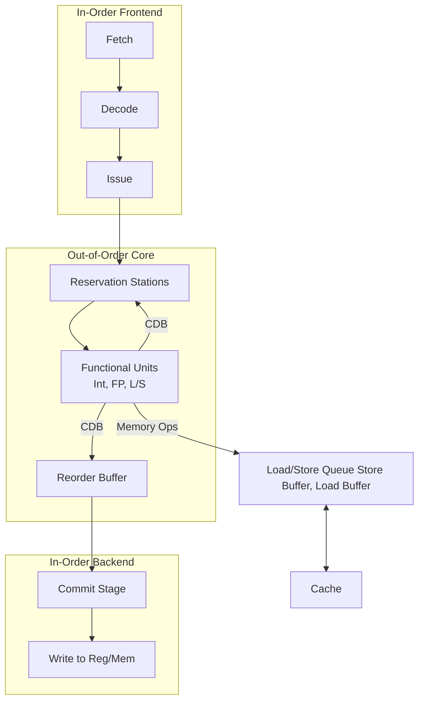

---
### **学习路线图 (Learning Roadmap)**

欢迎来到复杂流水线的世界！这部分内容是理解现代高性能处理器核心思想的关键。我们将分四步走：

1.  **问题的起源**：首先，我们会看看为什么简单的流水线不够用，当遇到执行时间不同的指令时，会产生哪些新问题。
2.  **初次尝试 - 记分板**：接着，我们将学习一种早期的解决方案——记分板（Scoreboard），看看它是如何管理和调度这些复杂指令的。
3.  **终极进化 - Tomasulo 算法**：然后，我们将深入学习现代乱序执行的核心——Tomasulo 算法。你将了解到寄存器重命名、保留站和公共数据总线这些神奇的技术是如何协同工作的。
4.  **善后工作 - 精确异常与访存**：最后，我们会探讨在如此“混乱”的执行顺序下，如何保证程序出错时能准确恢复（精确异常），以及如何处理同样复杂的内存读写操作。

预计学习时间：**90-120分钟**。准备好了吗？我们出发！

---

### **核心知识地图 (Core Knowledge Map)**

这份指南的结构就像一棵知识树，帮助你理清思路 `[S02]`：

*   **计算机体系结构**
    *   **单处理器 (指令级并行)**
        *   ~~简单流水线~~ (前序知识)
        *   **复杂流水线 (本章核心)**
            *   **1. 多周期操作 (问题的提出)**
                *   结构冲突
                *   数据相关性问题 (WAW, out-of-order completion)
            *   **2. 记分板 (Scoreboard - 有序发射)**
                *   解决 RAW, WAW 冲突
                *   局限性：顺序发射导致性能瓶颈
            *   **3. 乱序执行 (Out-of-Order Execution)**
                *   动机：克服记分板的瓶颈
                *   **寄存器重命名**：消除伪相关 (WAR, WAW)
                *   **Tomasulo 算法**：实现乱序执行的核心
                *   **精确异常**：通过 **Reorder Buffer (ROB)** 实现顺序提交
            *   **4. 访存操作的挑战**
                *   内存相关性
                *   Load Bypassing & Forwarding

---

## **第一部分：为什么我们需要复杂流水线？**

在学习简单流水线时，我们做了一个美好的假设：所有指令的执行时间都一样，通常是一个时钟周期。但现实世界要复杂得多。

### **知识卡：多周期操作 (Multi-Cycle Operations)**

*   **它解决了什么问题？** `[S04]`
    现实中，不同指令的执行复杂度天差地别。一个简单的整数加法可能一个周期就搞定，但一个浮点数除法或者访问内存可能需要几十甚至上百个周期。如果流水线必须等待最慢的指令，那么处理器的速度就会被严重拖累。复杂流水线的设计就是为了让这些“快慢不一”的指令能够高效地协同工作。

*   **前置知识**:
    *   基础的五级流水线 (IF, ID, EX, MEM, WB)。
    *   数据相关性 (RAW, WAR, WAW) 和流水线冲突（Hazard）。

*   **直觉比喻**:
    想象一个快餐店的流水线：做汉堡（1分钟）、炸薯条（3分钟）、打可乐（0.5分钟）。如果严格要求所有顾客必须按顺序等炸薯条的3分钟走完才能轮到下一个人点单，那效率就太低了。一个更聪明的经理会让后面的顾客先去打可乐，或者如果有多台可乐机，就让多个顾客同时打可乐。这就是复杂流水线想要实现的效果——**不让慢操作阻塞整个流水线**。

*   **正式定义** `[S04]`
    复杂流水线是一种允许不同指令拥有不同执行延迟（latency）和吞吐率（throughput）的处理器设计。它通常包含多个功能单元（Functional Units, FUs），例如专门的整数ALU、浮点加法器、浮点乘法器等，这些单元可以并行工作。

    *   **多周期操作 (Multi-cycle Operation)**：指执行阶段（EX）需要多个时钟周期的指令，如浮点运算、乘除法。
    *   **延迟不确定操作 (Variable-latency Operation)**：指执行延迟不固定的指令，最典型的就是内存访问（`load`/`store`），因为是否在缓存（Cache）中命中会导致执行时间巨大差异。
    *   **多个功能单元 (Multiple Functional Units)**：为了提高并行度，处理器会配备多个相同的计算单元，比如两个浮点加法器。

*   **核心架构** `[S05]`
    与简单的五级流水线不同，复杂流水线的执行（EX）阶段被拆分和扩展了。取指（IF）和译码（ID）阶段之后，不再是单一的EX，而是一个**发射**（Issue）阶段，它负责将指令分发到对应的功能单元。

    ```ascii
    [ IF ] -> [ ID ] -> [ Issue ] --+--> [ ALU ] --------> [ Mem ] --+--> [ WB ]
                                   |                                |
                                   +--> [ Fadd ] -------------------+
                                   |                                |
                                   +--> [ Fmul ] -------------------+
                                   |                                |
                                   +--> [ Fdiv ] -------------------+
    ```
    *图解：复杂流水线结构。指令在Issue阶段被分发到不同的并行功能单元，最终结果都汇总到写回（WB）阶段。* `[Fig·S05-1]`

*   **一个具体的例子：流水化的乘法器** `[S06]`
    就连一个多周期的操作单元（比如乘法器），其内部也可以是流水化的。例如，一个需要4个周期的乘法运算，可以被设计成一个4级的流水线。

    ```mermaid
    sequenceDiagram
        participant P0 as 乘法阶段0
        participant P1 as 乘法阶段1
        participant P2 as 乘法阶段2
        participant P3 as 乘法阶段3
        participant W as 写回
        Note over P0, W: 乘法器内部的4级流水线
        P0 ->> P1: 周期1
        P1 ->> P2: 周期2
        P2 ->> P3: 周期3
        P3 ->> W: 周期4
    ```
    *图解：一个需要4个周期的乘法器本身也可以被流水化。这意味着虽然一条乘法指令需要4个周期才能完成，但该乘法器可以每个周期都接收一条新的乘法指令。* `[Fig·S06-1]`

### **新出现的问题** `[S07]`

引入了多周期和并行功能单元后，我们立刻会遇到两个比简单流水线更棘手的问题：

1.  **结构冲突 (Structural Hazards)**：多条指令（特别是执行时间不同的）可能在同一时刻需要使用同一个硬件资源。最典型的例子就是**写回（WB）阶段**。如果一条整数加法指令在第5个周期想写回结果，而一条乘法指令在第7个周期也想写回结果，但寄存器堆（Register File）通常只有一个写端口，它们就会发生冲突。`[S08]`

| Cycle | 1 | 2 | 3 | 4 | 5 | 6 | 7 |
| :--- | :-: | :-: | :-: | :-: | :-: | :-: | :-: |
| `mul $4,...` | F | D | P0 | P1 | P2 | P3 | **W** |
| `addi $6,...` | | F | D | X | **W** | | |
| `add $5,...` | | | F | D | X | M | **W** |

*表解：结构冲突示例。`addi`在周期5写回，`add`在周期7写回，而`mul`也在周期7写回。`add`和`mul`指令在周期7争用同一个写回端口，导致结构冲突。* `[Fig·S08-1]`

**解决方案？** 最简单粗暴的方法就是**停顿（Stall）**。让后面的指令等着。比如，让`add`指令在译码（D）阶段多等一个周期。 `[S08]`

| Cycle | 1 | 2 | 3 | 4 | 5 | 6 | 7 | 8 |
| :--- | :-: | :-: | :-: | :-: | :-: | :-: | :-: | :-: |
| `mul $4,...` | F | D | P0 | P1 | P2 | P3 | W | |
| `addi $6,...` | | F | D | X | M | W | | |
| `add $5,...` | | | F | **d*** | D | X | M | **W** |

*表解：通过停顿解决结构冲突。`add`指令被插入了一个停顿周期（d*），将其写回操作推迟到周期8，从而避免了与`mul`指令的冲突*。 `[Fig·S08-2]`

**硬件实现** `[S09]`：[^1]可以通过增加控制逻辑来检测这种冲突。例如，当一条非乘法指令在译码阶段，并且它的目标寄存器有效，同时流水线P1阶段有一条乘法指令（也即将要写回），就触发停顿。

2.  **数据相关性问题 (Data Hazards)**：由于指令不再按顺序完成，数据相关性变得更加复杂。`[S10]`
    *   **RAW (Read After Write - 真相关)**：依然存在。后一条指令需要前一条指令的计算结果。
    *   **WAW (Write After Write - 输出相关)**：变得非常普遍！一条短指令可能在一条长指令之后发射，但却先于它完成并写回。
        ```
        I1: mul $4, $3, $5   // 长指令，写$4
        I2: addi $4, $1, 1  // 短指令，也写$4
        ```
        在下面的时序图中，`addi`在周期6就写回了，而`mul`在周期7才写回。如果`addi`先写，`mul`后写，那么最终`$4`寄存器里存的是`mul`的结果，这违背了程序的原始逻辑顺序。

| Cycle | 1 | 2 | 3 | 4 | 5 | 6 | 7 |
| :--- | :-: | :-: | :-: | :-: | :-: | :-: | :-: |
| `mul $4,...` | F | D | P0 | P1 | P2 | P3 | **W** |
| `addi $4,...`| | F | D | X | M | **W** | |
        *表解：WAW冲突。`addi`指令比`mul`指令先完成写回，但程序顺序上它在`mul`之后，`mul`的结果覆盖了本应是最终结果的`addi`的结果。这是一种错误的乱序写回。* `[Fig·S10-1]`

**解决方案？** 同样，可以通过**停顿**来解决。例如，让`addi`指令停顿两个周期，确保它的写回操作在`mul`指令之后。`[S11]` 但不停地停顿会严重影响性能。我们需要更聪明的办法。

---

## **第二部分：记分板 (Scoreboard) - 一次有序的尝试**

为了解决上述问题，特别是为了在允许多周期操作的同时，还能系统地处理各种冲突，CDC 6600 计算机引入了一种经典技术——**记分板（Scoreboard）**。`[S13]`

### **知识卡：记分板 (Scoreboard)**

*   **它解决了什么问题？**
    记分板是一个**集中式**的控制逻辑，它动态地跟踪每条指令的执行状态和资源的使用情况。它的核心目标是：在保证程序逻辑正确（即正确处理数据相关性）的前提下，尽可能地让指令执行下去，而不是无脑地停顿。

*   **前置知识**:
    *   多周期操作引发的结构冲突和数据冲突 (WAW)。

*   **直觉比喻**:
    想象一个机场的控制塔。塔台（记分板）里有一个大屏幕，上面显示着每条跑道（功能单元）是否被占用，以及每架飞机（指令）的状态（是刚起飞？在空中？还是准备降落？）。塔台管制员根据这些信息来决定是否批准下一架飞机起飞。他必须确保跑道是空闲的，并且不会与其他飞机发生航线冲突（数据相关）。

*   **核心思想：有序发射 (In-order Issue)** `[S14]`
    记分板的一个关键特点是，指令的**发射**（Issue）阶段是**按顺序**（In-order）的。也就是说，指令严格按照它们在程序中的顺序进入发射阶段。但是，它们的**执行和完成**可以是**乱序的（Out-of-order）**。

*   **发射的四个条件** `[S14]`
    一条指令只有在同时满足以下四个条件时，才能从ID阶段成功发射（Issue）到功能单元：
    1.  **功能单元空闲**：指令所需要的功能单元（如乘法器）当前没有正在处理其他指令。（解决**结构冲突**）
    2.  **操作数准备好 (无RAW)**：指令需要读取的所有源寄存器的值都已经计算好，没有被任何更早的、尚未完成的指令作为目标寄存器。（解决 **RAW 冲突**）
    3.  **目标寄存器安全 (无WAW)**：没有其他更早发射的指令，与当前指令使用相同的目标寄存器。（解决 **WAW 冲突**）
        *   记分板通过这个规则来保证：即使执行和完成是乱序的，写回的顺序也必须与发射顺序一致，从而避免WAW。
    4.  **写回阶段无结构冲突**：为了简化设计，记分板通常会检查发射该指令是否会在未来导致写回冲突。

*   **硬件实现** `[S15]`
    为了跟踪状态，记分板需要一些额外的硬件：
    1.  **功能单元状态表 (FU Status)**：每个功能单元（FU）都有一个条目，记录它是否`Busy`（繁忙），正在执行什么操作（Op），目标寄存器（Fi），源寄存器（Fj, Fk）等信息。
    2.  **寄存器结果状态表 (Register Result Status)**：每个寄存器都有一个条目，记录哪个功能单元将会把结果写入这个寄存器。如果为空，说明该寄存器的值是有效的。

| 功能单元 (FU) | Busy | Op | Fi | Fj | Fk | ... |
| :---------- | :--- | :-- | :- | :- | :- | :-- |
| Integer | Yes | ADD | R1 | R2 | R3 | ... |
| Mult1 | No | | | | | ... |
    
*表解：功能单元状态表，跟踪每个FU的工作状态。* `[Fig·S15-1]`

| 寄存器 | F0 | F1 | F2 | ... | F31 |
| :--- | :-- | :--- | :--- | :--- | :--- |
| 写入单元 (FU) | | Mult1| Add1 | ... | |

*表解：寄存器结果状态表，跟踪哪个FU将为哪个寄存器产生结果。*

### **记分板工作流程示例** `[S16-S26]`

让我们通过一个经典的例子，一步步看记分板是如何工作的。

**指令序列**:
*   `I1: DIVD f6, f6, f4` (浮点除法，耗时较长)
*   `I2: LD f2, 45(r3)` (加载数据)
*   `I3: MULTD f0, f2, f4` (浮点乘法)
*   `I4: DIVD f8, f6, f2` (浮点除法)
*   `I5: SUBD f10, f0, f6` (浮点减法)
*   `I6: ADDD f6, f8, f2` (浮点加法)

**状态演变**: 为了清晰，我们用一个大表格来跟踪每个时间点（t0, t1, ...）的状态。
*   **功能单元** 列显示了哪个单元被哪条指令占用。
*   **WB** 列显示了哪个寄存器正在被写回。
*   **写回标记位(WP)为1的寄存器** 列（等价于我们的寄存器结果状态表）显示了哪些寄存器正在等待结果。

| 时间  | Int(1) | Add(1)  | Mult(3) | Div(4) |   WB    | WP=1的寄存器 | 说明                                                                                                      |
| :-- | :----: | :-----: | :-----: | :----: | :-----: | :------- | :------------------------------------------------------------------------------------------------------ |
| t0  |        |         |         | I1(f6) |         | f6       | **I1发射**。Div单元空闲，f6,f4操作数可用。WP[f6]被标记。                                                                  |
| t1  | I2(f2) |         |         | I1(f6) |         | f6, f2   | **I2发射**。Int单元空闲，r3可用。WP[f2]被标记。                                                                        |
| t2  |        |         |         | I1(f6) | I2(f2)  | f6       | **I2写回**。Int单元完成，结果f2通过总线写回。WP[f2]清除。I3等待f2， stall。                                                     |
| t3  |        |         | I3(f0)  | I1(f6) |         | f6, f0   | **I3发射**。f2已可用，Mult单元空闲。WP[f0]被标记。I4等待Div单元，stall。                                                      |
| t4  |        |         | I3(f0)  |        | I1(f6)  | f0       | **I1写回**。Div单元完成，结果f6写回。WP[f6]清除。**I4发射**。Div单元刚空闲，f6可用，但f2不可用(I2刚写回)，**这里存在一个周期延迟**，假设t5才能用。I4继续stall。 |
| t5  |        |         | I3(f0)  | I4(f8) |         | f0, f8   | **I4发射**。Div单元空闲，f6,f2都可用。WP[f8]标记。I5等待I3的结果f0，stall。                                                   |
| t6  |        |         |         | I4(f8) | I3(f0)  | f8       | **I3写回**。Mult单元完成，结果f0写回。WP[f0]清除。                                                                      |
| t7  |        | I5(f10) |         | I4(f8) |         | f8, f10  | **I5发射**。Add单元空闲，f0可用，f6可用。WP[f10]标记。                                                                   |
| t8  |        |         |         | I4(f8) | I5(f10) | f8       | **I5写回**。Add单元完成，结果f10写回。WP[f10]清除。I6等待I4的结果f8，stall。                                                   |
| t9  |        |         |         |        | I4(f8)  |          | **I4写回**。Div单元完成，结果f8写回。WP[f8]清除。                                                                       |

*表解：记分板执行流程的逐步跟踪。指令按顺序尝试发射，但会因为资源或数据依赖而停顿。* `[Fig·S16-1]`

### **记分板的缺点** `[S29]`

记分板虽然实现了动态调度，但它的**有序发射**（In-order Issue）机制是一个巨大的性能瓶颈。

*   **WAR Hazard 不可能出现**: [^2]因为操作数是在发射时才读取的，而发射是按序的。当一条指令`j`要读寄存器`Rx`时，所有在它之前的指令`i`（可能写`Rx`）都已经发射了，所以`j`读到的一定是正确的值。
*   **WAW 和 RAW 是主要障碍**: 记分板的核心工作就是通过停顿来避免这两种冲突。

**核心局限性：指令“探头”问题 (Head-of-Line Blocking)** `[S31]`
想象一下在超市排队结账，你只买了一瓶水，但你前面那位顾客的购物车堆得像山一样高，而且他还在和收银员聊天。虽然旁边有空闲的收银台，但因为你必须排队，所以你只能干等着。

这就是记分板的问题。在上面的例子中，`I3 (MULTD f0, f2, f4)` 因为等待 `I2` 产生的 `f2` 而停顿。此时，即使后面的 `I4 (DIVD f8, f6, f2)` 它的操作数 `f6` 和 `f2` 也都准备好了，并且 `Div` 单元空闲，但由于 `I3` 没有发射，`I4` 也**不能发射**。这就是**顺序发射**的局限性。

---

## **第三部分：乱序执行 (Out-of-Order Execution) - 打破常规**

为了解决记分板的“探头”问题，我们需要一个更大胆的革新：**乱序发射（Out-of-Order Issue）**。

### **知识卡：乱序发射 (Out-of-Order Issue)**

*   **它解决了什么问题？** `[S32]`
    乱序发射允许处理器跳过当前因数据依赖而停顿的指令，去执行后面那些已经准备好的、不相关的指令。这极大地提高了功能单元的利用率和处理器的整体性能。

*   **直觉比喻**:
    回到超市结账的例子。一个聪明的超市经理会开设一个“快速通道”。你（一条独立的、准备好的指令）就不再需要排在那个购物车大户（一条停顿的指令）后面，可以直接去快速通道结账。

*   **实现思路** `[S33]`
    1.  **指令缓存/窗口 (Instruction Window/Buffer)**：在译码和执行之间增加一个“等候区”。所有译码完的指令都进入这个等候区。
    2.  **动态检查**：硬件每个周期都会扫描整个等候区，找出所有操作数都已准备好的指令。
    3.  **发射就绪指令**：从所有准备好的指令中，选择一条或多条，发射到空闲的功能单元去执行。

    这个“等候区”是实现乱序执行的关键。

### **新问题：WAR 和 WAW 幽灵重现** `[S37]`

一旦我们允许乱序发射，之前被顺序发射机制巧妙规避的 **WAR** 和 **WAW** 冲突又回来了，而且变得更加棘手。

这两种冲突都源于**寄存器名称复用**，而不是真正的数据依赖，因此它们统称为**伪相关（False Dependencies）**。
- **WAR (Write-After-Read) 读后写冒险**
    - **例子**:
        代码段
        
        ```
        i: ADDD F10, F6, F4  ; 指令 i: (读 F4)
        j: SUBD F4, F2, F8   ; 指令 j: (写 F4)
        ```
        
    - **问题在于**: 指令 `i` 必须在指令 `j` 覆盖 `F4` 之前，读取 `F4` 的“旧值”。如果 `j`（写者）因为乱序执行，在 `i`（读者）读取之前就先执行完毕并写入了 `F4`，那么 `i` 就会错误地读到本不该它读的“新值”。
        
- **WAW (Write-After-Write) 写后写冒险**
    
    - **例子**:
        
        代码段
        
        ```
        i: LD F4, 0(R1)      ; 指令 i: (写 F4, 假设是一个慢速的 Load 操作)
        j: DIVD F4, F2, F8   ; 指令 j: (也写 F4, 假设是一个快速的除法)
        ```
        
    - **问题在于**: 程序的原始逻辑要求 `F4` 的**最终**值应该来自更晚的指令 `j` (DIVD)。但如果 `j`（快指令）先执行完毕，然后慢吞吞的 `i`（慢指令）才执行完毕并写入，那么 `F4` 中来自 `j` 的正确结果就会被 `i` 写入的“过时”结果所覆盖。
        
- **对中间指令的影响**
    
    - 在 WAW 的例子中，如果指令 `i` 和 `j` 之间还有一条指令 `k` (例如 `ADDD F12, F4, F6`)，那么 `k` 必须读到 `i` (LD) 写入的结果。
        
    - 如果 `j` 提前执行了，`k` 就有可能错误地读到 `j` 的结果。这再次破坏了程序的正确逻辑。

### **知识卡：寄存器重命名 (Register Renaming)**

*   **它解决了什么问题？** `[S38]`
    寄存器重命名是解决 WAR 和 WAW 伪相关的“银弹”。它的核心思想是：程序中使用的寄存器名（如`F2`, `F4`）只是一个逻辑名字，硬件在内部为每次写入操作动态分配一个全新的、唯一的物理寄存器。

*   **直觉比喻**:
    你和你的同事都叫“张伟”。在公司里，为了区分，大家可能会叫你“做开发的张伟”，叫他“做市场的张伟”。“张伟”是逻辑名，而“做开发的/市场的张伟”是物理名。这样，发给“做开发的张伟”的邮件就不会错误地送到“做市场的张伟”那里。

*   **正式定义** `[S38]`
    寄存器重命名是一种硬件技术，它通过维护一个逻辑寄存器到物理寄存器的映射表，来消除伪相关。当一条指令要写入一个逻辑寄存器时，硬件会从一个空闲物理寄存器池中分配一个新的物理寄存器给它，并更新映射表。之后所有需要读取该逻辑寄存器的指令，都会被引导去读取这个新的物理寄存器。

    ```
    原始指令:
    1: ADD R1, R2, R3   (写 R1)
    2: SUB R3, R1, R4   (读 R1, 写 R3)
    3: MUL R1, R5, R6   (写 R1, 产生WAW)
    4: DIV R7, R1, R8   (读 R1)
    
    重命名后:
    1: ADD P1, P2, P3   (R1 -> P1)
    2: SUB P4, P1, P5   (读 P1, R3 -> P4)
    3: MUL P6, P7, P8   (R1 -> P6, WAW消除)
    4. DIV R9, P6, P10  (读 P6)
    ```
    *图解：重命名消除了指令1和3对`R1`的WAW冲突。指令4现在明确知道它应该读由指令3产生的结果（P6），而不是指令1的结果。* `[Fig·S38-1]`

*   **效果** `[S41]`
    通过重命名，`F4` 被重命名为 `F4'`，指令5对`F4`的写入操作就不会影响到指令2对`F4`的写入，它们实际上在操作两个不同的物理存储单元。这样一来，指令5和指令2之间的伪相关就被打破了，它们可以完全独立地乱序执行。

### **知识卡：Tomasulo 算法**

Tomasulo 算法是第一个将寄存器重命名和乱序执行思想完美结合的实用算法，由 Robert Tomasulo 在 IBM 360/91 浮点单元中设计。`[S43, S46]`

*   **它解决了什么问题？**
    它提供了一个**分布式**的、可扩展的方案，来实现高效的乱序执行，同时通过**隐式的寄存器重命名**来消除 WAR 和 WAW 冲突。

*   **核心思想** `[S47]`
    1.  **保留站 (Reservation Stations, RS)**: 每个功能单元不再直接接收指令，而是配有自己的“等候区”，即保留站。保留站负责缓存指令以及等待操作数。`[S44]`
    2.  **用保留站ID进行重命名**: 当一条指令被发射到保留站时，它的目标寄存器就不再指向一个物理值，而是指向这个保留站的**标签**（Tag）或ID。这就实现了寄存器重命名。
    3.  **公共数据总线 (Common Data Bus, CDB)**: 当任何一个功能单元计算完成时，它不会将结果直接写回寄存器堆，而是连同产生这个结果的保留站标签一起，**广播**到CDB上。
    4.  **监听与唤醒**: 所有正在等待数据的保留站和寄存器堆都在“监听”CDB。一旦监听到自己需要的标签，就立即取走数据。当一个保留站的所有操作数都准备好了，它就可以被送入功能单元执行。`[S45]`

*   **架构图** `[S49]`

    ```ascii
    +-----------+      +-----------------+      +-----------------+
    |  Instruction  |----->| Reservation St. |----->|   Add/Sub Unit  |
    |    Queue      |      |   (e.g., z,y,x) |      +-----------------+
    +-----------+      +-----------------+               ^
         |                     |   ^                       |
         |                     |   |                  +----v----+
         v                     v   |                  |   CDB   |--+
    +-----------+      +-----------+                  +----^----+  |
    | Registers |<-----+ Reservation St. |<----------------+  |
    | (with ST) |      |   (e.g., c,b,a) |                  |  |
    +-----------+      +-----------------+               |  |
                           |                       |  |
                           +-----------------+               |  v
                           |   Mul/Div Unit  |---------------+ Memory
                           +-----------------+
    ```
    *图解：Tomasulo算法架构。指令进入保留站，寄存器状态记录了结果将由哪个保留站（用tag表示）产生。计算结果通过CDB广播给所有等待它的单元。* `[Fig·S49-1]`

*   **保留站字段解释** `[S49]`
    *   `Op`: 操作类型 (e.g., ADD, MUL)。
    *   `Vj`, `Vk`: 源操作数的值。
    *   `Qj`, `Qk`: 如果源操作数还没准备好，这里存放的是将要产生该操作数的保留站的**标签(Tag)**。如果为0，表示操作数在`Vj`/`Vk`中是有效的。
    *   `Busy`: 该保留站是否被占用。

*   **寄存器堆增加的字段** `[S49]`
    *   `ST` (or `Qi`): 状态字段。如果为空或0，表示寄存器的值是有效的。如果不为0，它存放的是将为该寄存器产生新值的保留站的标签。

### **Tomasulo 算法工作流程示例** `[S50-S56]`

让我们用一个例子来感受 Tomasulo 的魔力。假设 Add/Sub 需要2个周期，Mul/Div 需要4个周期。

**指令序列**:
1.  `div f0, f1, f2`
2.  `mul f3, f0, f2`
3.  `add f0, f1, f2`
4.  `mul f3, f0, f2`

**状态演变**: (RS for Mul/Div: a, b, c; RS for Add/Sub: x, y, z)
*   **初始**: 寄存器f0, f1, f2的值都有效。
*   **Cycle 1: `div f0, f1, f2` 发射**
    *   `div` 进入保留站 `c`。
    *   `RS[c]` = {Op:div, Qj:0, Vj:val(f1), Qk:0, Vk:val(f2)}
    *   `Regs[f0].ST` = `c` (f0被重命名为c)
*   **Cycle 2: `mul f3, f0, f2` 发射**
    *   `mul` 进入保留站 `b`。
    *   源操作数 `f0` 正在由 `c` 计算，所以 `Qj` 为 `c`。`f2` 可用。
    *   `RS[b]` = {Op:mul, Qj:c, Vj:-, Qk:0, Vk:val(f2)}
    *   `Regs[f3].ST` = `b`
*   **Cycle 3: `add f0, f1, f2` 发射**
    *   `add` 进入保留站 `z`。
    *   `f1`, `f2` 可用。
    *   `RS[z]` = {Op:add, Qj:0, Vj:val(f1), Qk:0, Vk:val(f2)}
    *   `Regs[f0].ST` = `z` (f0被重命名为z, **WAW冲突解决!**)
*   **Cycle 4: `mul f3, f0, f2` 发射**
    *   `mul` 进入保留站 `a`。
    *   源操作数 `f0` 正在由 `z` 计算，`f2` 可用。
    *   `RS[a]` = {Op:mul, Qj:z, Vj:-, Qk:0, Vk:val(f2)}
    *   `Regs[f3].ST` = `a` (**WAW冲突解决!**)
*   **... 之后 ...**
    *   `add` (在RS `z`) 先算完，将结果和标签 `z` 广播到 CDB。
    *   保留站 `a` 监听到标签 `z`，取走数据，`Qj`变为0，`Vj`填入数据。
    *   寄存器 `f0` 也监听到标签 `z`，取走数据更新自己，`ST`清零。
    *   ... 如此循环 ...

这个过程展示了 Tomasulo 如何通过保留站和CDB，让多条指令并行、乱序地执行，并自动解决所有数据冲突。

### **精确异常的挑战** `[S57-S59]`

Tomasulo 算法非常强大，但它有一个致命弱点：**无法保证精确异常 (Precise Exception)**。

*   **精确异常**：当一条指令 `I` 发生异常时，处理器状态（寄存器、内存）应该看起来像是所有 `I` 之前的指令都已经执行完毕，而所有 `I` 之后的指令都完全没有执行过。这是程序调试和操作系统功能的基石。
*   **非精确异常**：在 Tomasulo 中，`I` 之后的某条指令 `J` 可能已经乱序执行完并写回了结果，此时 `I` 才发生异常。处理器状态已经被“污染”了，无法恢复到异常发生前的精确状态。

### **知识卡：Reorder Buffer (ROB)**

*   **它解决了什么问题？** `[S60]`
    ROB (Reorder Buffer) 的引入就是为了在支持乱序执行的同时，实现精确异常。它的核心思想是：**乱序执行，顺序提交 (Out-of-order execution, in-order commit)**。

*   **直觉比喻**:
    想象一个团队协同写一份重要报告。团队成员（功能单元）可以不按章节顺序，并行地写各自负责的部分（乱序执行）。但是，他们写完后，不是直接发布，而是都交给总编（ROB）。总编会按照报告的原始章节顺序，逐一审核并最终定稿发布（顺序提交）。如果某一章节在审核时发现有严重问题（异常），总编可以直接丢弃该章节以及之后所有章节的草稿，报告前面的内容不受影响。

*   **工作原理** `[S61]`
    1.  **指令进入ROB**: 在发射（Issue）阶段，指令不仅进入保留站，还会按顺序在ROB中占据一个条目。
    2.  **结果写入ROB**: 当功能单元计算完成，结果和标签通过CDB广播。这次，结果不是直接写回寄存器堆，而是写到指令在ROB中对应的条目里。
    3.  **寄存器重命名到ROB ID**: 寄存器状态表不再指向保留站ID，而是指向将为它提供结果的 **ROB条目ID**。
    4.  **顺序提交 (Commit)**: ROB是一个**先进先出(FIFO)**的队列。硬件每个周期检查队头的指令。
        *   如果队头指令已执行完且无异常，就将其结果从ROB中正式写入寄存器堆或内存。这个过程叫**提交(Commit)**。然后该指令出队。
        *   如果队头指令发生异常，处理器就清空整个ROB和所有保留站，恢复到异常指令之前的状态，然后跳转到异常处理程序。所有后续指令的（乱序）执行结果都被抛弃了。
        *   如果队头指令还没执行完，则整个提交阶段停顿。

*   **带ROB的乱序执行流程总结** `[S77]`
    1.  **Issue**: 指令按序进入ROB和保留站。寄存器被重命名为ROB ID。
    2.  **Execute**: 指令在保留站中等待操作数（监听CDB），一旦就绪就乱序执行。
    3.  **Write Back**: 结果通过CDB广播到ROB和等待它的保留站。
    4.  **Commit**: 指令按序从ROB队头提交，将结果永久写入寄存器/内存。

通过这四个阶段的解耦，处理器既享受了乱序执行带来的高性能，又保证了程序状态的有序和精确。

---

## **第四部分：处理复杂的访存操作** `[S78]`

内存访问（Load/Store）是指令中最复杂的一种。它们不仅延迟不确定，还引入了新的依赖关系——**内存地址相关性**。

### **知识卡：内存相关性**

*   **它解决了什么问题？**
    我们需要一种机制来判断两条内存操作指令是否访问了同一个地址，并据此来保证它们的执行顺序，避免读到旧数据或写错数据。

*   **回顾相关性类型** `[S79]`
    RAW, WAR, WAW 不仅存在于寄存器操作，同样存在于内存操作。`[S80]`
    *   `st r1, [r2]` (Write to address in r2)
    *   `ld r4, [r3]` (Read from address in r3)
    如果 `r2` 和 `r3` 的值（即内存地址）相同，这就构成了一个 RAW 真相关。

*   **特殊挑战**:
    与寄存器不同，内存地址是在执行阶段才计算出来的。在发射阶段，处理器**无法确定**两条内存指令是否冲突（内存歧义问题, Memory Disambiguation）。而且，我们不能像重命名寄存器那样“重命名”内存地址。

### **保守与激进的策略**

*   **保守策略** `[S81]`：强制所有`load`和`store`指令按顺序执行。例如，一个`load`必须等待它前面的所有`store`都执行完毕才能执行。这种方法性能极差。

*   **激进策略 (乱序执行)** `[S84]`：允许`load`指令在它前面的`store`指令完成地址计算之前就执行。这需要精巧的硬件支持来保证正确性。

### **知识卡：Load Bypassing & Forwarding**

*   **它解决了什么问题？**
    在乱序执行内存操作时，如何高效地处理`load`和`store`之间的RAW相关性。

*   **核心组件：Store Buffer** `[S83]`
    `Store`指令在计算出地址和准备好数据后，不会立刻写入内存（因为提交是按顺序的），而是先写入一个叫**Store Buffer**的特殊缓存中。

*   **工作原理** `[S85]`
    当一个`load`指令计算出它要访问的地址后，它会做两件事：
    1.  **检查Store Buffer**: 硬件会检查Store Buffer中是否存在地址相同的、更早的`store`指令。
    2.  **决策**:
        *   **Load Forwarding (转发)**: 如果找到了匹配的`store`，并且数据已准备好，那么数据就直接从Store Buffer中**转发**给`load`指令，无需访问内存。这是最高效的情况。
        *   **Load Bypassing (绕过)**: 如果Store Buffer中没有地址匹配的`store`，那么这个`load`指令就可以“绕过”所有待处理的`store`，直接去访问内存/缓存。
        *   **停顿**: 如果找到了匹配的`store`，但它的数据还没准备好，`load`指令就必须停顿等待。

### **更激进的乱序发射** `[S86]`

现代处理器甚至允许`load`指令在它前面的`store`指令**连地址都还没算出来**的时候就去访存（推测执行 Speculative Execution）。

*   **Load Buffer**: 为此，需要一个`Load Buffer`来记录这些已经提前执行的`load`指令的地址。
*   **冲突检测**: 当一个`store`指令最终计算出它的地址后，它必须检查`Load Buffer`，看看是否有任何在它之后、但已经提前执行的`load`访问了相同的地址。
*   **恢复**: 如果检测到冲突，说明提前执行的`load`读到了错误的数据。此时，处理器必须**冲刷（flush）**这条`load`指令以及它之后的所有指令，然后重新执行。这虽然有代价，但在大多数情况下（地址不冲突）能带来巨大的性能提升。

---

### **总结：现代复杂流水线全景** `[S88]`

至此，我们已经构建了一幅现代高性能处理器的核心流水线蓝图：


*图解：现代乱序执行处理器概览。指令按序进入（Frontend），在核心部分乱序执行（OoO Core），最后按序提交（Backend），实现了高性能和程序正确性的统一。* `[Fig·S88-1]`

它是一个**单发射（本课程讨论范围内）、乱序执行、支持多周期指令和缓存**的精密系统。指令的生命周期是：**有序取指 -> 有序译码 -> 有序发射到ROB/RS -> 乱序执行 -> 乱序写回结果到ROB -> 有序提交**。

---

### **快速复习卡 (Quick Review Cards)**

#### **三行核心版**

1.  **复杂流水线**是为了处理执行时间不同的指令，引入了多功能单元和乱序执行。
2.  **Tomasulo 算法**通过保留站和公共数据总线实现乱序执行，并用标签进行隐式寄存器重命名以消除伪相关。
3.  **ROB (Reorder Buffer)** 确保了在乱序执行背景下的顺序提交，从而实现了精确异常。

#### **十行精华版**

1.  **动机**: 简单流水线无法高效处理浮点、访存等多周期指令，导致性能瓶颈。
2.  **初期问题**: 多周期操作引入了新的结构冲突（如写回端口争用）和数据冲突（如因乱序完成导致的WAW）。
3.  **记分板**: 一种集中式控制方案，允许乱序完成但坚持**有序发射**，通过停顿来解决RAW和WAW冲突，但有“探头”性能问题。
4.  **乱序发射**: 核心思想是设置一个指令窗口，跳过停顿的指令，执行后面已就绪的指令，以提高效率。
5.  **伪相关**: 乱序发射使WAR和WAW问题凸显，这些是因寄存器名复用造成的伪相关，而非真正的数据流依赖。
6.  **寄存器重命名**: 解决伪相关的关键技术，为每次写操作分配唯一的物理寄存器。
7.  **Tomasulo算法**: 乱序执行的经典实现。它分布式地将指令放入**保留站**，用**保留站标签**实现重命名，并通过**CDB**广播结果，实现了高效的依赖解析和数据分发。
8.  **精确异常**: 乱序执行会破坏程序状态，使异常处理困难。
9.  **Reorder Buffer (ROB)**: 解决方案。指令执行结果先放入ROB，然后**按序提交**到最终的寄存器/内存。发生异常时，只需清空ROB即可恢复精确状态。
10. **访存乱序**: 通过`Store Buffer`、`Load Bypassing/Forwarding`和推测执行，`load`/`store`指令也能在保证正确性的前提下乱序执行。

---

### **一页备忘单 (One-Page Cheat Sheet)**

| **概念** | **解决的问题** | **核心机制** | **关键点/缺点** |
| :--- | :--- | :--- | :--- |
| **多周期操作** | 指令执行时间不一 | 多个并行、流水化的功能单元 | 导致新的结构冲突和数据冲突 (WAW) |
| **记分板** | 动态调度多周期指令 | 集中式控制、有序发射、乱序完成 | **性能瓶颈**：Head-of-Line Blocking |
| **乱序发射** | 克服记分板的瓶颈 | 指令窗口，发射已就绪的指令 | 重新暴露了WAR和WAW伪相关 |
| **寄存器重命名**| 消除WAR和WAW伪相关 | 逻辑寄存器 -> 物理寄存器映射 | 需要大量物理寄存器 |
| **Tomasulo算法** | 高效的乱序执行 | 保留站(RS)、公共数据总线(CDB) | **分布式**调度；**隐式重命名**(用RS标签)；**非精确异常** |
| **Reorder Buffer**| 实现精确异常 | 乱序执行，**顺序提交** | 结果先写ROB，再按序写回；寄存器重命名到**ROB ID** |
| **访存乱序** | 内存操作的并行化 | Store Buffer, Load Bypassing/Forwarding | 内存地址歧义是核心挑战；可能需要推测和冲刷 |

**核心流程**: **In-Order Issue -> Reservation Station & ROB -> Out-of-Order Execute -> Write to ROB -> In-Order Commit**

---
### **溯源与补丁 (Traceability & Patches)**

#### **幻灯片 -> 章节 交叉引用表**

| Slide(s) | 核心内容 | 覆盖章节/知识卡 | 涉及的图表 |
|:---|:---|:---|:---|
| S01-S04 | 课程标题，大纲，动机 | 路线图, 知识地图, 卡片：多周期操作 | - |
| S05-S06 | 复杂流水线结构，流水化乘法器 | 卡片：多周期操作 | `Fig·S05-1`, `Fig·S06-1` |
| S07-S09 | 多周期操作引发的结构冲突与解决 | 第一部分：新出现的问题 | `Fig·S08-1`, `Fig·S08-2` |
| S10-S12 | 多周期操作引发的数据冲突(WAW)与解决 | 第一部分：新出现的问题 | `Fig·S10-1` |
| S13-S15 | 记分板概念与硬件实现 | 卡片：记分板 | `Fig·S14-1`, `Fig·S15-1` |
| S16-S26 | 记分板工作流程示例 | 第二部分：记分板工作流程示例 | `Fig·S16-1` |
| S27-S29 | 记分板总结与缺点 | 卡片：记分板 (缺点) | - |
| S30-S37 | 顺序发射的局限性，乱序发射动机 | 第三部分：新问题：WAR和WAW... | - |
| S38-S42 | 寄存器重命名 | 卡片：寄存器重命名 | `Fig·S38-1`, `Fig·S41-1` |
| S43-S48 | 乱序执行, Tomasulo算法概念 | 卡片：Tomasulo 算法 | `Fig·S44-1` |
| S49-S56 | Tomasulo算法架构与示例 | 卡片：Tomasulo 算法, 工作流程示例 | `Fig·S49-1` |
| S57-S59 | 精确异常问题 | 第三部分：精确异常的挑战 | - |
| S60-S61 | Reorder Buffer (ROB) 概念 | 卡片：Reorder Buffer (ROB) | `Fig·S60-1` |
| S62-S76 | 带ROB的乱序执行示例 | 第三部分：(包含在ROB卡片中) | `Fig·S62-1` |
| S77 | 带ROB的乱序执行总结 | 卡片：Reorder Buffer (ROB) | - |
| S78-S80 | 内存操作相关性 | 卡片：内存相关性 | - |
| S81-S83 | 访存一般流程 (Load/Store) | 第四部分：保守与激进的策略, Store Buffer | `Fig·S81-1` |
| S84-S85 | Load Bypassing/Forwarding | 卡片：Load Bypassing & Forwarding | - |
| S86-S87 | 访存的乱序发射 | 第四部分：更激进的乱序发射 | - |
| S88 | 截至目前流水线总结 | 总结：现代复杂流水线全景 | `Fig·S88-1` |

#### **缺失扫描器 (Missing Scanner)**

经过仔细核对，所有幻灯片中的核心概念、图表和示例都已在上述指南中得到覆盖和解释。没有发现遗漏的关键知识点。

**扫描结果**: 覆盖率100%。无需补丁。

[^1]: 你提的这一点非常棒，这确实是流水线控制逻辑中最精妙（也最容易混淆）的地方！
	
	你困惑的点很可能在于：**“为什么是在 `add` 指令处于‘译码(D)’阶段时，去检查处于‘P1’阶段的 `mul` 指令？”**
	
	我来帮你拆解一下这个硬件逻辑，这其实是一个“**预判**”机制。
	
	### 核心思想：在“D”阶段预判“未来”的冲突
	
	硬件控制逻辑不能等到冲突真的发生时（第7周期）再去处理，那就太晚了，数据已经被覆盖了。
	
	控制逻辑必须**提前**预测到这个冲突，并及时插入“停顿(Stall)”。
	
	这个“决策点”就被设置在**译码（D）阶段**。
	
	- **为什么是译码（D）阶段？**
	    
	    - 因为译码阶段是CPU的“指挥中心”。在D阶段，CPU刚弄清楚“哦，这是一条`add`指令，它需要读寄存器X和Y，并把结果写回寄存器Z”。
	        
	    - 只有在D阶段，CPU才有足够的信息来判断这条指令**未来**会做什么，以及它**什么时候**会做。
	        
	
	---
	
	### 结合你的例子，我们一步一步看硬件的“思考过程”
	
	我们聚焦于第二个表（`[Fig·S08-2]`），看看硬件是如何做出“停顿”决策的。
	
	#### 场景一：`addi` 指令进入译码 (Cycle 3)
	
	1. **时间**：第3周期。
	    
	2. **主角**：`addi` 指令进入 **D 阶段**。
	    
	3. **硬件控制逻辑（在D阶段）开始工作：**
	    
	    - 它问：“我（`addi`）什么时候会**写回(W)**？”
	        
	    - 它计算自己的路径：D (C3) -> X (C4) -> M (C5) -> **W (C6)**。 （_注意：你的第一个表示例中 `addi` 好像跳过了 M 阶段，我们按 `[Fig·S08-2]` 的路径 X->M->W 来看，如果是 X->W，那就在C5写回，道理一样_）。 假设 `addi` 在 C6 写回。
	        
	    - 它再问：“流水线里有没有其他‘长指令’会**在同一时间（C6）**写回？”
	        
	    - 它检查流水线：`mul` 指令现在在 **P0 阶段** (C3)。
	        
	    - 它计算 `mul` 的路径：P0(C3) -> P1(C4) -> P2(C5) -> P3(C6) -> **W (C7)**。
	        
	    - **结论**：`addi` 在 C6 写回，`mul` 在 C7 写回。两者不冲突。
	        
	    - **决策**：`addi` 指令，放行！
	        
	
	#### 场景二：`add` 指令进入译码 (Cycle 4) —— 冲突预警！
	
	这就是 `[S09]` 描述的精确时刻！
	
	1. **时间**：第4周期。
	    
	2. **主角**：`add` 指令尝试进入 **D 阶段**。
	    
	3. **硬件控制逻辑（在D阶段）开始工作：**
	    
	    - 它问：“我（`add`）什么时候会**写回(W)**？”
	        
	    - 它计算自己的路径：D (C4) -> X (C5) -> M (C6) -> **W (C7)**。
	        
	    - 它再问：“流水线里有没有其他‘长指令’会**在同一时间（C7）**写回？”
	        
	    - 它检查流水线：`mul` 指令现在在 **P1 阶段** (C4)。
	        
	    - 它计算 `mul` 的路径：P1(C4) -> P2(C5) -> P3(C6) -> **W (C7)**。
	        
	    - **结论**：**冲突！** `add` 和 `mul` 都想在 **第7周期** 写回！
	        
	    - **决策**：**停顿(Stall)！**
	        
	
	### “停顿”是如何执行的？
	
	硬件控制逻辑（在D阶段）检测到这个“未来冲突”后，它会立即执行两个操作：
	
	1. **“冻结” `add` 指令**：它阻止 `add` 指令在第4周期结束时进入下一个（X）阶段。`add` 指令在第5周期**被迫重新执行一次 D 阶段**（或者说是在D阶段空转，这就是表中的 `d*`）。
	    
	2. **“注入气泡(Bubble)”**：在 `add` 指令的后面（即X阶段）插入一个“空操作”（NOP），这样流水线后续阶段就不会收到`add`的数据。
	    
	
	**结果就是你看到的 `[Fig·S08-2]`：**
	
	- `add` 指令的 D 阶段被推迟到了第5周期。
	    
	- 它的 X 阶段被推迟到了第6周期。
	    
	- 它的 M 阶段被推迟到了第7周期。
	    
	- 它的 **W 阶段被推迟到了第8周期**。
	    
	
	冲突成功避免！
	
	### 总结
	
	`[S09]` 那段话的“硬件实现”逻辑，可以翻译为：
	
	> **(当硬件位于第4周期时)**
	> 
	> **如果** [控制单元发现，当前**正处于D阶段**的指令是**非乘法指令**（如`add`）]
	> 
	> **并且** [它“抬头”往流水线前面看，发现**正处于P1阶段**的指令是**乘法指令**（如`mul`）]
	> 
	> **那么** [控制单元就“算出来”：`add` 会在3拍后(C7)写回，`mul` 也会在3拍后(C7)写回，必定冲突]
	> 
	> **所以** [控制单元立即**触发停顿**，让`add`指令在D阶段“罚站”一回合（`d*`），把它未来的写回推迟到 C8]。
	
	这样是不是就清晰多啦？

[^2]: 好的，我来帮你把这个概念拆解得更清晰一些。你理解的没错，这确实是记分板的一个特点。
	
	你混淆的地方可能在于“动态调度（乱序执行）”和“有序发射”。我们来一步步拆解：
	
	记分板的核心规则有两个：
	
	1. **有序发射 (In-order Issue)**：这是瓶颈所在。CPU 核心**必须**按照代码的原始顺序（1、2、3...）来“查看”和“分发”指令。它不能跳过指令 2 去先发射指令 3。
	    
	2. **发射时读取操作数 (Read Operands at Issue)**：这是一条**非常严格**的规定。当一条指令被“发射”（Issue）的那一刻，它**必须**立刻去寄存器堆（Register File）把它需要的所有“源操作数”（要读取的值）都拿出来，自己“抱住”这些值。
	    
	
	---
	
	### 为什么 WAR 冒险不可能出现？
	
	我们用一个具体的例子来解释，这个例子里**存在 WAR 依赖**：
	
	代码段
	
	```
	i: ADD R3, R1, R2   ; 指令 i: R3 = R1 + R2  (要 读 R2)
	j: MUL R2, R4, R5   ; 指令 j: R2 = R4 * R5  (要 写 R2)
	```
	
	- **程序顺序**：`i` 在 `j` 之前。
	    
	- **WAR 风险**：如果 `j` (写 R2) 因为某些原因（比如乘法器空闲）先于 `i` (读 R2) 执行完毕，那么 `i` 就会读到 `j` 写入的“新”值，而不是它本该读取的“旧”值。**这就是 WAR 冒险。**
	    
	
	现在，我们看看记分板的“有序发射”和“发射时读取”是如何**联手**阻止这个风险的：
	
	#### 模拟执行时间线：
	
	**第 1 步：CPU 尝试“发射”(Issue) 指令 `i` (ADD)**
	
	- 根据“**有序发射**”规则，CPU 必须先处理 `i`。
	    
	- 根据“**发射时读取操作数**”规则，在“发射” `i` 的**这一瞬间**，CPU 必须立刻去寄存器堆，把 `R1` 的值（比如是 10）和 `R2` 的值（比如是 20）**同时取出来**。
	    
	- `i` 现在“抱住”了这两个值 (10 和 20)。它被发射出去，等待加法器空闲。
	    
	
	**第 2 步：CPU 尝试“发射”(Issue) 指令 `j` (MUL)**
	
	- `i` 已经发射完毕，现在 CPU 按照“**有序发射**”规则，处理 `j`。
	    
	- `j` 也被发射出去（它需要读 R4 和 R5，写 R2）。它去等待乘法器空闲。
	    
	
	**第 3 步：乱序执行 (Out-of-Order Execution)**
	
	- 现在 `i` 和 `j` 都在各自的功能单元前“排队”。
	    
	- **假设发生了最坏情况**：`j` 要用的乘法器先空闲了，而 `i` 要用的加法器还在忙。
	    
	- `j` **先于** `i` 执行完毕。它计算出了 `R4 * R5` 的结果（比如是 99），并把这个 99 **写回了**寄存器 `R2`。
	    
	- **此时，寄存器堆里 `R2` 的值已经变成了 99。**
	    
	
	**第 4 步：指令 `i` 终于开始执行**
	
	- 过了一会儿，加法器空闲了，轮到 `i` (ADD) 执行了。
	    
	- `i` 需要计算 `R1 + R2`。
	    
	- **关键点来了**：`i` 会去哪里取 `R2` 的值？
	    
	- 它**不会**再回寄存器堆（那里现在是 99）。它使用的是它在**第 1 步（发射时）** 就已经“抱住”的那个**旧值 20**！
	    
	- 所以，`i` 正确地计算了 `10 + 20`，得到 30，并写入 `R3`。
	    
	
	---
	
	### 总结
	
	- **有序发射** 保证了“读者”（指令 `i`）一定在“写者”（指令 `j`）**之前**被 CPU 查看和处理。
	    
	- **发射时读取** 保证了“读者”在被处理的那一刻，就**立刻拿走了**它需要的数据副本。
	    
	
	因为 `i` 拿走数据副本的动作，**绝对地**发生在 `j` 被发射（并最终写入新数据）之前，所以 `j` 永远不可能在 `i` 读取之前污染 `R2` 的值。`i` 早早地就把自己需要的东西拿走了，`j` 后面再怎么“乱序”地写 R2，都与 `i` 无关了。
	
	这就是为什么记分板（Scoreboarding）虽然有性能瓶颈，但它在设计上就**天然避免了 WAR 冒险**。
	
	这样解释是不是清晰很多了？
