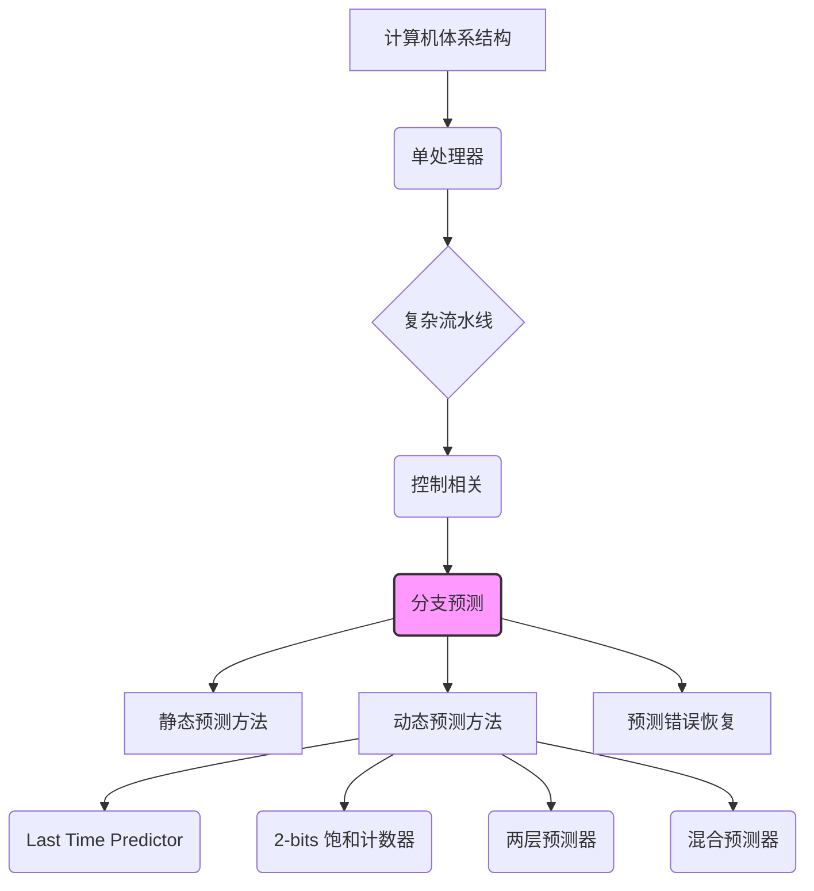
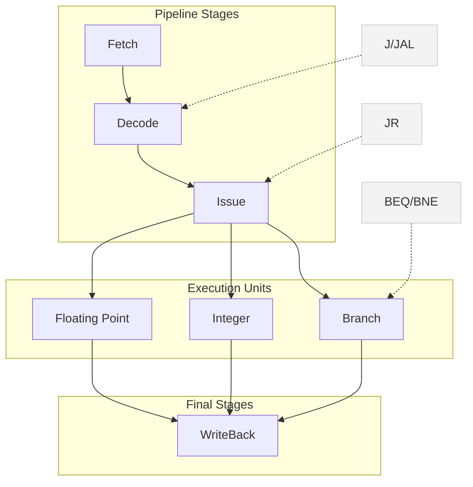
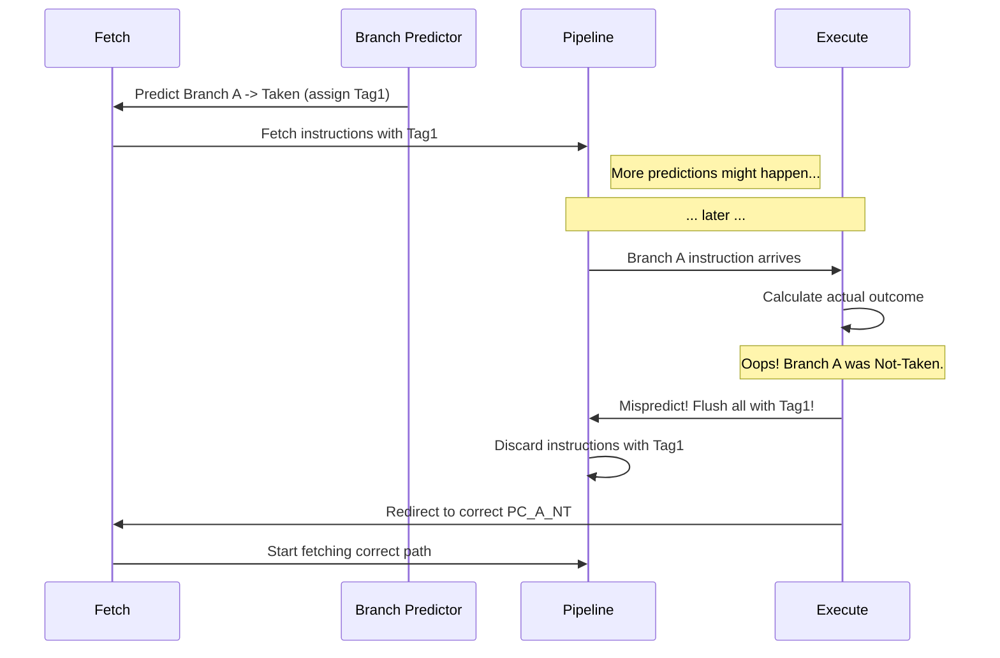
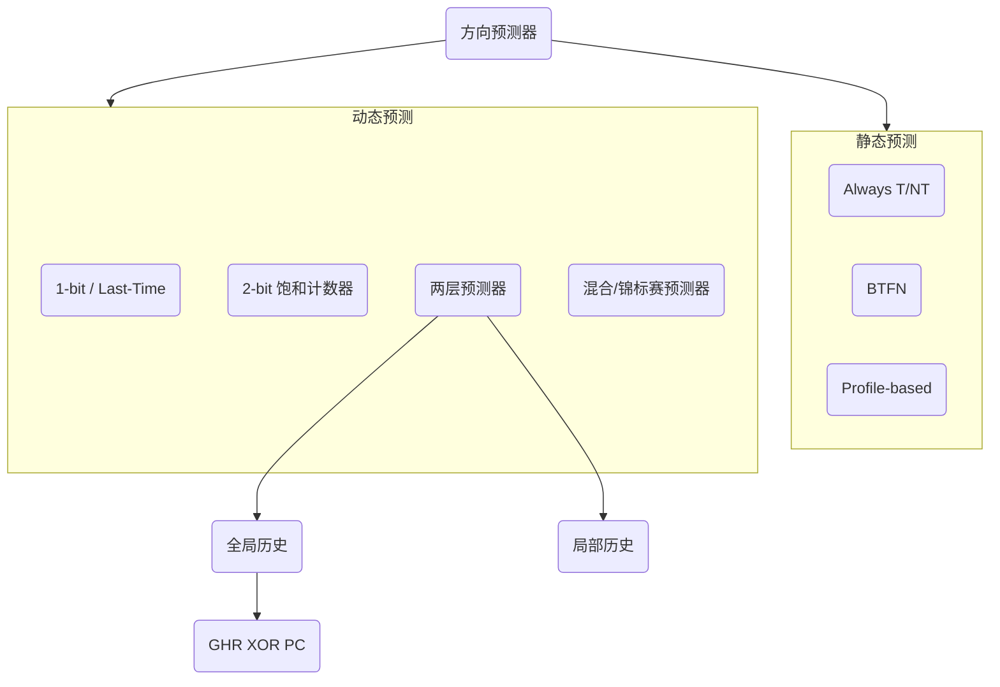

好的，亲爱的同学，你好！

欢迎来到计算机体系结构的精彩世界。今天我们要一起探索一个非常核心且有趣的话题——**分支预测（Branch Prediction）**。

别担心，虽然听起来很专业，但我会用最清晰、最友好的方式，带你一步步揭开它的神秘面纱。这就像是处理器在玩一个“猜心”游戏，猜对了就能跑得飞快，猜错了也没关系，我们有办法补救。这趟学习之旅结束后，你不仅能明白分支预测是什么，还能深刻理解它为什么对现代处理器如此重要。

让我们一起开始吧！

---

### 学习路线图 (Learning Roadmap)

为了更好地掌握今天的知识，我们可以按照下面的路线前进：

1.  **问题的根源：控制相关 (Control Dependency)** - 我们首先要理解，为什么分支指令会给处理器的流水线带来麻烦。（预计15分钟）
2.  **分支预测的核心任务与时机** - 了解分支预测器需要回答哪三个关键问题，以及在流水线的哪个阶段进行预测最高效。（预计20分钟）
3.  **预测策略大观：静态与动态方法** - 我们将系统学习两大类预测方法，从简单的静态规则到聪明的动态自适应策略。（预计45分钟）
4.  **猜错之后：预测错误恢复 (Misprediction Recovery)** - 学习当预测失败时，处理器是如何优雅地纠正错误，并继续前行的。（预计15分钟）
5.  **性能分析与展望** - 通过计算来感受分支预测的威力，并看看这个领域的未来发展方向。（预计10分钟）

---

### 核心知识地图 (Core Knowledge Map)

这张图可以帮助你建立对整个主题的宏观认识。我们今天聚焦于红色虚线框内的部分 `[S02]`。


`[Fig·S02-1]` 课程核心知识点概览，本次重点为分支预测。

---

### 逐点深入讲解 (Point-by-Point Explanation)

现在，让我们进入核心内容。我会将每个知识点打包成一张“知识卡片”，方便你学习和回顾。

#### 1. 控制相关 (Control Dependency)

`[S03]`
<strong>⭐ 知识卡片：控制相关 (Control Dependancy)</strong>

- **它解决了什么问题？** `[S04]`
  处理器在执行指令时，需要知道下一条指令的地址（存放在PC寄存器中）。但有些指令，比如`if-else`、`for`循环等，会改变程序的执行流程，导致下一条指令的地址不确定。这种不确定性就是“控制相关”。

- **前置知识 (Prerequisites)**:
  - **程序计数器 (PC)**: 一个始终指向下一条待取指令地址的寄存器。
  - **指令流水线 (Pipeline)**: 将一条指令的执行过程划分为多个阶段（如取指、译码、执行等），以重叠执行多条指令，提高效率。

- **生活中的类比 (Analogy)**:
  想象你在一个十字路口，导航告诉你：“如果前方不堵车，就直行；如果堵车，就右转。” 在你真正到达路口、看清路况之前，你无法确定下一步该往哪走。你的“下一步路线”就“依赖”于“路况”这个条件。程序中的分支指令就像这个十字路口，处理器在没有计算出分支结果前，也不知道该取哪条指令。

- **官方定义 (Formal Statement)** `[S04]`
  一条指令的执行与否，取决于前面某条（或某些）指令的执行结果，这种依赖关系称为控制相关。
  - **对于非控制流指令**（如加法、乘法）：下一条指令的地址通常就是当前地址加上指令长度（`PC = PC + 4`），计算简单。
  - **对于控制流指令**（如分支、跳转）：下一条指令的地址取决于该指令的计算结果（条件是否成立，跳转目标是哪里），在指令执行完成前是未知的。

- **核心挑战**: `[S04]`
  在高性能的流水线处理器中，我们希望在当前指令还在译码或执行时，就开始取下一条指令。但控制相关使得我们“不知道”下一条指令在哪。我们该怎么办？

- **一个关键问题**: `[S04]`
  我们甚至需要先知道“当前取到的指令是不是一条控制流指令”，才能决定是否需要等待。这个判断本身也需要时间（通常在译码阶段）。

- **一句话总结 (One-Sentence Takeaway)**:
  控制相关是指分支指令导致处理器不确定下一条指令的地址，从而对流畅的指令流水线造成了阻碍。

- **自查小问题 (Self-Check)**:
  1.  **判断题**: 所有指令的下一条指令地址都是 `PC+4`。 (错)
  2.  **选择题**: “控制相关”主要影响了流水线的哪个阶段？ (A) 取指 (B) 译码 (C) 执行 (D) 写回 (答案: A，因为它让取指阶段不知道该取哪儿的指令)
  3.  **开放题**: 简单描述一下为什么 `if (x > 0)` 这样的语句会引起控制相关？


#### 2. 分支指令的流水线处理

`[S05]` `[S06]` `[S07]` `[S08]` `[S09]`

为了解决控制相关，我们首先得知道不同类型的分支指令到底在流水线的哪个环节才能“真相大白”。

<strong>⭐ 知识卡片：分支指令的类型与解析时机</strong>

- **它解决了什么问题？**
  明确不同分支指令的“悬念”是在流水线的哪个阶段被揭晓的。知道得越晚，对流水线的潜在影响（称为“分支惩罚”）就越大。

- **前置知识 (Prerequisites)**:
  - 了解MIPS等RISC指令集中的常见分支类型。
  - 了解一个较复杂的乱序执行（Out-of-Order Execution）流水线结构，包括取指（Fetch）、译码（Decode）、发射（Issue）、执行（Execute）、写回（WriteBack）等阶段。

- **分支类型与解析时机分析**: `[S05]`
  让我们通过一个表格来清晰地对比不同分支指令：

| 类型 (Example) | 含义 | 是否跳转可知时机 | 目标地址可知时机 |
| :--- | :--- | :--- | :--- |
| **条件分支** (beq, bne) | `if (rs == rt) goto offset` | **执行(X)阶段** | **执行(X)阶段** |
| **无条件分支** (j) | `goto target` | **译码(Decode)阶段** | **译码(D)阶段** |
| **函数调用** (jal) | `link = PC+4; goto target` | **译码(Decode)阶段** | **译码(D)阶段** |
| **寄存器跳转** (jr) | `goto $ra` | **译码(Decode)阶段** | **发射(Issue)阶段** |
`[Fig·S05-1]` 不同分支类型的跳转决策与目标地址计算时机

  **解读**:
  *   **最麻烦的是条件分支 (beq/bne)**: 它需要比较两个寄存器的值，这个操作在“执行”阶段才能完成。这意味着在它之前的取指、译码阶段，处理器完全是“蒙着眼”在干活。`[S07]`
  *   **寄存器跳转 (jr)**: 虽然在译码阶段就知道它是个跳转，但目标地址存在寄存器里，需要读了寄存器才知道，这发生在“发射”阶段。`[S08]`
  *   **最简单的是无条件分支和函数调用 (j/jal)**: 目标地址是指令本身的一部分，所以在“译码”阶段就能完全确定。`[S09]`

- **内联图示：分支指令在乱序流水线中的解析路径** `[S06]`


`[Fig·S06-1]` 不同分支指令在流水线中的解析终点示意图。条件分支（BEQ/BNE）需要走到最深的执行单元才能确定结果。

- **为什么这很重要？ (Why it matters?)** `[S10]`
  分支指令非常非常普遍。根据SPEC CPU 2017的测试，在整数运算中约占19%，浮点运算中约占11%。这意味着**平均每5到10条指令就有一条是分支指令**。如果每遇到一次分支都得等它执行完，那流水线大部分时间都在空转，性能会急剧下降。

- **一句话总结 (One-Sentence Takeaway)**:
  条件分支的结果在流水线很深的阶段才能知道，而它又如此频繁，这构成了现代处理器的一个核心性能瓶颈。

- **自查小问题 (Self-Check)**:
  1.  **判断题**: `JAL`指令比`BEQ`指令能更早地确定下一条指令的地址。 (对)
  2.  **选择题**: 哪种分支指令对流水线的潜在阻塞最严重？ (A) `j target` (B) `jal target` (C) `beq $t0, $t1, loop` (D) `jr $ra` (答案: C)
  3.  **开放题**: 为什么`jr $ra`的目标地址比`j target`的目标地址计算得晚？

</details>

#### 3. 如何处理控制相关：分支预测登场

`[S11]` `[S12]` `[S13]` `[S14]`

面对这个难题，我们有几种选择：

1.  **Stall (暂停/阻塞)**: `[S12]` 最笨的办法。流水线停下来，什么都不干，一直等到分支指令执行完毕，确定了下一条指令的地址，再继续取指。`[S13]` 这会导致巨大的性能损失，每条指令都可能需要stall，完全不可行。
2.  **Guess (猜测)**: `[S12]` `[S14]` 这就是**分支预测**。我们不等待，而是猜一个最可能的结果（比如，猜`if`条件为真），然后沿着猜测的路径继续取指、执行。这种“先上车后补票”的方式叫做**推测执行 (Speculative Execution)**。如果猜对了，就赚大了，流水线没有中断。如果猜错了，再把错误路径上的指令全部作废，回到正确路径上。
3.  **Do Something Else (做点别的事)**: `[S12]` `[S14]` 比如在多线程处理器中，当前线程遇到分支阻塞，可以切换到另一个线程去执行。这能掩盖一部分延迟，但不是我们今天的主题。

我们的焦点是第二种方法：**分支预测**。`[S15]` 它 настолько重要，以至于现代处理器都会在流水线的前端加入一个专门的**分支预测单元**。

`[S16]` 正确的预测能带来巨大的收益。例如，如果没有预测，遇到分支可能需要暂停（stall）2个周期。而如果正确预测，流水线可以无缝衔接，节省下这宝贵的2个周期。

但是，如果猜错了呢？
<strong>⭐ 知识卡片：预测错误的代价 (Misprediction Penalty)</strong>

- **它解决了什么问题？**
  理解当我们大胆猜测之后，发现猜错了，需要付出什么样的代价，以及如何进行“善后”。

- **官方定义 (Formal Statement)** `[S17]`
  **分支预测惩罚 (Branch Prediction Penalty)** 是指从发现预测错误到从正确路径重新取指并填充流水线所浪费的时钟周期数。

- **恢复过程 (Recovery Process)**: `[S17]`
  假设我们在`F`（取指）阶段做出了预测，并开始推测执行。直到`X`（执行）阶段，分支指令的真实结果才计算出来。这时，我们发现预测错了。
  1.  **发现错误**: 在`X`阶段，处理器发现预测的PC和计算出的真实PC不一致。
  2.  **冲刷流水线 (Flush the Pipeline)**: 立即废弃所有在错误路径上已经进入流水线的指令（即那些处于`F`, `D`, `Issue`等阶段的指令）。通常是将它们转换成`nop`（无操作）指令。
  3.  **重定向取指 (Redirect Fetch)**: 将PC设置为正确的分支目标地址，让取指单元从正确的地方重新开始工作。

- **内联图示：预测错误与恢复**

  ```
  周期:       1    2    3    4    5    6    7
  ------------------------------------------------
  Branch      F    D    X(Mispredict!)
  Wrong Path1      F    D --> FLUSHED
  Wrong Path2           F --> FLUSHED
  
  Correct Path                 F    D    X ...
  Correct Path+1                    F    D ...
  ```
  `[Fig·S17-1]` 分支预测错误恢复示意图。在第3周期发现错误后，后续两个错误路径上的指令被冲刷，从第4周期才开始取正确路径的指令，造成了几个周期的浪费。

- **为什么恢复是可能的？** `[S17]`
  幸运的是，在分支结果出来（`X`阶段）之前，那些被错误推测执行的指令通常还没有进入到会改变处理器“永久状态”（如写寄存器、写内存）的`WB`（写回）阶段。所以，我们只需要把它们丢掉就行，不会留下“后遗症”。

- **性能影响分析**: `[S18]`
  分支预测的性能可以用一个简化的CPI（Cycles Per Instruction）公式来衡量：
  `CPI = CPI_base + (分支指令频率 × 分支预测错误率 × 分支预测惩罚)`

  例如，假设：
  - 基础CPI为1（理想情况）
  - 20%的指令是分支指令
  - 70%的分支实际会跳转
  - 我们的预测策略是简单的“预测不跳转”，所以错误率是70%
  - 每次预测错误的惩罚是2个周期

  `CPI = 1 + (0.20 * 0.70 * 2) = 1 + 0.28 = 1.28`

  这意味着，仅仅因为分支预测不佳，我们的处理器性能就下降了28%！`[S18]` 这揭示了提高性能的两个方向：
  1.  **降低预测错误的概率** (提高预测准确率)
  2.  **降低预测错误的惩罚** (优化流水线设计，让分支结果更早出来)

- **一句话总结 (One-Sentence Takeaway)**:
  预测错误需要冲刷流水线并从正确路径重新开始，这个过程所浪费的时间就是分支预测惩罚，它是影响性能的关键因素。

- **自查小问题 (Self-Check)**:
  1.  **判断题**: 分支预测错误后，已经执行完的错误指令的结果需要被撤销。 (对，通过冲刷流水线实现)
  2.  **选择题**: 降低分支预测惩罚，最直接的方法是？ (A) 增加时钟频率 (B) 减少流水线深度 (C) 增大缓存 (D) 增加执行单元 (答案: B，流水线越浅，发现错误越早，惩罚越小)
  3.  **开放题**: 为什么说乱序执行处理器的分支预测惩罚通常比简单顺序流水线要高？


#### 4. 分支预测的三大任务与执行时机

`[S19]` `[S20]` `[S21]` `[S24]` `[S26]`

一个完整的分支预测过程，需要回答三个环环相扣的问题：

- **Step #1: 这是一条分支指令吗？ (Is it a branch?)** `[S19]`
- **Step #2: 如果是，它会跳转吗？ (Taken or Not-Taken?)** `[S19]`
- **Step #3: 如果跳转，它会跳到哪里去？ (What is the target address?)** `[S19]`

**预测时机至关重要** `[S20]`
- **选项1：在译码(Decode)阶段预测**。这时指令的`opcode`已经被解析，我们能100%确定它是不是分支（回答了#1），也能算出部分目标地址（回答了#3的一部分）。但问题是，取指阶段已经过去，即使预测正确，也已经浪费（stall）了一个周期。
- **选项2：在取指(Fetch)阶段预测**。这是最理想的情况，可以在取下一条指令前就给出方向，避免任何stall。但挑战在于，在取指阶段，我们手上只有一个PC地址，连指令本身长什么样都不知道！怎么可能知道它是不是分支，会跳去哪？

为了实现Fetch阶段的预测，我们需要一个神奇的硬件：**分支目标缓存 (Branch Target Buffer, BTB)**。

<strong>⭐ 知识卡片：分支目标缓存 (Branch Target Buffer, BTB)</strong>

- **它解决了什么问题？**
  在取指阶段，仅凭PC地址，快速回答分支预测的**问题#1（是不是分支）**和**问题#3（目标地址是啥）**。

- **核心思想 (Analogy)**:
  BTB就像一本“热点路口导航备忘录”。每次你开车经过一个复杂的、需要决策的路口（分支指令），你就在备忘录里记下这个路口的位置（PC地址），以及你上次是怎么走的（目标地址）。下次你快到同一个路口时，不用等导航现场计算，直接翻开备忘录看一眼，大概率就知道该怎么走了。

- **硬件结构与工作流程**:
  BTB是一个小型的、高速的缓存。它用当前取指的PC地址来查询。
  1.  **基础版BTB (回答问题#1)**: `[S22]`
      - **索引**: 使用PC地址的低位进行索引。
      - **内容**: 每个条目只有一个比特位 `is_a_branch`。
      - **工作**: 在取指时，用PC查BTB。如果查到且`is_a_branch`为1，就**预测**这是一条分支指令。
      - **问题 (Aliasing)**: 两个不同的PC地址，可能因为低位相同而映射到BTB的同一个条目，造成“张冠李戴”，这叫**映射冲突**。
      
      ```ascii
      PC: [ Tag... | Index | Offset ]
                 |
                 v
            +-----------+
      BTB:  | 1 bit     |  -> is it a branch?
            | ...       |
            +-----------+
      ```
      `[Fig·S22-1]` 基础BTB结构，使用PC低位索引，只存一个标志位。

  2.  **改进版BTB (解决冲突)**: `[S23]`
      - **改进**: 每个条目增加一个`Tag`字段，存储PC地址的高位。
      - **工作**: 查BTB时，不仅要索引命中，还要比较PC高位和存储的`Tag`是否匹配。只有都匹配，才确认是同一个分支指令的记录。`判断条件: (BTB[PC].is_branch && BTB[PC].tag == PC_tag)`
      - **效果**: 大大降低了冲突，避免把普通指令误判为分支。

  3.  **完整版BTB (回答问题#1和#3)**: `[S25]`
      - **改进**: 每个条目再增加一个`Target PC`字段。
      - **工作**: 当BTB命中（tag匹配）时，我们不仅预测它是一条分支，还直接**预测它的目标地址就是`Target PC`字段里存的地址**。这个`Target PC`是这条指令上一次实际跳转时记录下来的。
      - **更新**: 当一条分支指令实际执行完毕后，如果它发生了跳转，其PC和跳转目标地址就会被写入或更新到BTB中。
      - **基本假设**: 分支指令的目标地址具有时间局部性，即一次跳转的目标地址很可能和上次相同。

      ```ascii
        PC [ ... Tag ... | ... Index ... ]
                             |
                             v
      +-----------------------------------------+
      |  Tag  | is_branch? (1b) | Target PC     |
      +-----------------------------------------+  (BTB Entry)
            ^                         |
            | (match?)                v
      +-----+-----------------> (Predicted Next PC)
      |
      PC_Tag
      ```
      `[Fig·S25-1]` 完整的BTB结构，包含Tag、有效位和目标PC，用于在取指阶段预测分支和其目标地址。

- **一句话总结 (One-Sentence Takeaway)**:
  BTB是一个硬件缓存，它记录了过去遇到的分支指令的地址和跳转目标，使得处理器在取指阶段就能快速预测出“是不是分支”以及“要跳到哪”。

- **自查小问题 (Self-Check)**:
  1.  **判断题**: BTB能100%准确地判断一条指令是否是分支指令。 (错，BTB是预测，且有容量限制和冷启动问题)
  2.  **选择题**: 在BTB中加入Tag字段主要是为了解决什么问题？ (A) 存储目标地址 (B) 提高访问速度 (C) 减少映射冲突 (D) 记录分支历史 (答案: C)
  3.  **开放题**: 如果一条分支指令第一次被执行，BTB能对它做出正确的预测吗？为什么？

</details>

现在，BTB帮我们解决了问题#1和#3。接下来，我们将聚焦于最核心、最复杂的问题#2：**这条分支到底跳还是不跳？ (Taken or Not-Taken?)** `[S26]` 这就是**跳转方向预测器**的主场。

#### 5. 分支方向预测方法

`[S27]` `[S33]`

预测分支方向的方法主要分为两大类：**静态预测**和**动态预测**。

##### 5.1 静态分支预测 (Static Branch Prediction)

`[S28]`

静态预测是在**编译时**就定好的一套简单规则，运行时不再改变。它的优点是实现简单，无需额外硬件。

<strong>⭐ 知识卡片：静态分支预测方法</strong>

- **它解决了什么问题？**
  提供一种简单、低成本的分支方向预测策略。

- **主要方法与对比**: `[S28]` `[S29]` `[S30]`

| 策略名称 | 规则 | 优点 | 缺点 | 准确率 (条件分支) |
| :--- | :--- | :--- | :--- | :--- |
| **Always Not-Taken** | 永远预测不跳转。 | 极度简单，硬件无需做任何事，顺序取指即可。 | 准确率很低，对循环等结构极其不友好。 | ~30-40% |
| **Always Taken** | 永远预测跳转。 | 简单。对循环结尾的分支很有效。 | 仍不够智能。 | ~60-70% |
| **BTFN** (Backward Taken, Forward Not-Taken) | **后向**分支预测为**跳转**，**前向**分支预测为**不跳转**。 | 巧妙的启发式规则。循环的判断通常是后向分支（跳回循环开头），所以大部分时间会跳转。 | 规则过于固定，无法适应程序逻辑。 | 比前两者好 |
| **Profile-based** `[S28]` | 编译器先带样本数据运行一次程序（profile run），统计每个分支的真实跳转情况，然后重新编译，将最可能的结果硬编码为预测。 | 基于真实数据，可以非常准确。 | 繁琐，需要额外的profiling步骤，且样本数据可能无法代表所有真实场景。 | 较高 |
| **Program-based** `[S29]` | 编译器根据代码的静态结构进行分析，发现一些通用规律。例如，检查指针是否为空的分支，通常预测为不为空（不跳转）。 | 无需profiling，更通用。 | 依赖于启发式规则，可能不准。 | 不一 |
| **Programmer-based** `[S30]` | 由程序员在代码中提供提示。例如，使用C/C++中的`likely()`和`unlikely()`宏。 `[S31]` | 程序员最懂代码逻辑，可以提供非常高质量的预测信息。 | 增加了程序员的负担，需要语言和编译器的支持。 | 潜力很高 |

- **静态预测的根本缺陷**: `[S32]`
  所有静态方法的共同问题是**无法适应分支行为的动态变化**。例如，一个分支的行为可能与程序的输入数据密切相关，这是编译时无法预知的。

- **一句话总结 (One-Sentence Takeaway)**:
  静态预测是编译时定死的预测规则，简单但不够灵活，无法应对程序运行时的动态行为。

- **自查小问题 (Self-Check)**:
  1.  **判断题**: BTFN策略认为 `for` 循环的条件判断分支大部分时间应该被预测为跳转。 (对，因为循环是向后跳转)
  2.  **选择题**: `if (likely(x > 0)) { ... }` 属于哪种静态预测？ (A) BTFN (B) Profile-based (C) Programmer-based (答案: C)
  3.  **开放题**: 你能想到一个静态预测会持续失败的例子吗？

</details>

##### 5.2 动态分支预测 (Dynamic Branch Prediction)

`[S34]`

动态预测的核心思想是：**根据分支指令过去的行为来预测它未来的行为**。它在运行时动态学习和调整，因此需要额外的硬件来记录历史信息。

<strong>⭐ 知识卡片：Last Time Predictor (1-bit 预测器)</strong>

- **它解决了什么问题？** `[S35]`
  提供最简单的动态预测：就按上次的来。

- **核心思想 (Analogy)**:
  你有个朋友，昨天他出门带了伞，结果下雨了。今天你猜他会不会带伞，最简单的猜法就是“他昨天带了，今天可能也会带”。

- **硬件实现**: `[S35]`
  在BTB的每个条目里，增加一个1-bit的**历史位**。
  - `0` 代表上次**未跳转 (Not-Taken)**。
  - `1` 代表上次**跳转 (Taken)**。
  **预测**: 本次的预测结果就是这个历史位的值。
  **更新**: 分支执行完毕后，用其实际结果（0或1）更新这个历史位。

- **问题：状态转换太快**: `[S36]`
  考虑一个循环 `for (j=0; j<3; j++)`，其跳转行为是 `T, T, N` (跳转, 跳转, 不跳转)。
  
| 时间 | 真实结果 | 预测前状态 | 预测结果 | 预测是否正确 | 预测后状态 |
| :--: | :--: | :--: | :--: | :--: | :--: |
| 1 | T | N | **N** | 错误 | T |
| 2 | T | T | **T** | 正确 | T |
| 3 | N | T | **T** | 错误 | N |
| 4 | T | N | **N** | 错误 | T |
| ... | ... | ... | ... | ... | ... |
`[Fig·S36-1]` 1-bit预测器在 `TTN` 循环模式下的表现

  观察上表，在一个`TTN`的循环周期里，它错了**两次**！一次是循环结束时（预测T，实际N），一次是下一次循环开始时（预测N，实际T）。问题在于，只要有一次行为不同，它的预测就立刻180度大转弯，不具备“抗干扰”能力。`[S37]`

- **一句话总结 (One-Sentence Takeaway)**:
  1-bit预测器根据上一次的结果进行预测，但因状态变化太快，在循环边界处会连续两次预测失败。

- **自查小问题 (Self-Check)**:
  1.  **判断题**: 1-bit预测器在处理一个一直跳转的分支时，准确率是100%。 (错，第一次执行时可能会错)
  2.  **选择题**: 1-bit预测器的一个主要缺点是？ (A) 硬件太复杂 (B) 对偶发性行为过于敏感 (C) 无法存储目标地址 (答案: B)
  3.  **开放题**: 对于 `T, N, T, N, T, N ...` 这种交替模式，1-bit预测器的准确率是多少？


为了解决1-bit预测器“立场不坚定”的问题，我们引入了“滞后性”。


<strong>⭐ 知识卡片：2-bit 饱和计数器 (2-bit Saturating Counter)</strong>

- **它解决了什么问题？** `[S37]`
  为预测器增加“惯性”或“滞后性”，使其不会因为一次偶然的相反结果就立刻改变预测方向。这对于那些“绝大多数时候都跳转”或“绝大多数时候都不跳转”的分支特别有效。

- **核心思想 (Analogy)**:
  你那位朋友，连续好几天出门都带伞，而且天天下雨。今天突然没下雨。你预测他明天是否带伞时，不会因为这一天的晴天就立刻断定他明天不带伞，你可能会想“他可能只是偶尔一次没用上，但已经养成了带伞的习惯”。你需要看到他连续几天不带伞，才会改变你的预测。

- **硬件实现**: `[S38]`
  在BTB每个条目中使用一个2-bit的计数器，形成4个状态：

  - `11` - **强跳转 (Strongly Taken, ST)**
  - `10` - **弱跳转 (Weakly Taken, WT)**
  - `01` - **弱不跳转 (Weakly Not-Taken, WN)**
  - `00` - **强不跳转 (Strongly Not-Taken, SN)**

  **预测规则**:
  - 如果计数器在高半区 (`11`或`10`)，则**预测跳转 (Taken)**。
  - 如果计数器在低半区 (`01`或`00`)，则**预测不跳转 (Not-Taken)**。

  **更新规则（状态机）**: `[S39]`
  - **如果实际跳转 (Actual Taken)**: 计数器`+1` (除非已经到了`11`，饱和了)。
  - **如果实际未跳转 (Actual Not-Taken)**: 计数器`-1` (除非已经到了`00`，饱和了)。

- **内联图示：2-bit饱和计数器状态机**

  ```mermaid
  stateDiagram-v2
      direction LR
      SN: 00 (Predict N)
      WN: 01 (Predict N)
      WT: 10 (Predict T)
      ST: 11 (Predict T)

      [*] --> WN: Power-on

      SN --> SN: Not-Taken
      SN --> WN: Taken

      WN --> SN: Not-Taken
      WN --> WT: Taken

      WT --> WN: Not-Taken
      WT --> ST: Taken
      
      ST --> WT: Not-Taken
      ST --> ST: Taken
  ```
  `[Fig·S39-1]` 2-bit饱和计数器的状态转换图。只有当状态跨越中间的“预测边界”（从`01`到`10`或从`10`到`01`）时，预测结果才会翻转。

- **性能分析**: `[S40]`
  我们再来看 `for (j=0; j<3; j++)` (行为`TTN`)的例子。
  假设初始状态是`00 (SN)`。

| 时间 | 真实结果 | 预测前状态 | 预测结果 | 预测是否正确 | 预测后状态 |
| :--: | :--: | :--: | :--: | :--: | :--: |
| 1 | T | 00(SN) | N | 错误 | 01(WN) |
| 2 | T | 01(WN) | N | 错误 | 10(WT) |
| 3 | N | 10(WT) | T | 错误 | 01(WN) |
| 4 | T | 01(WN) | N | 错误 | 10(WT) |
| ... | ... | ... | ... | ... | ... |
  
  等等，这样看起来好像更糟了？请注意，在稳定状态下！假设循环已经执行过一次，状态稳定在`10(WT)`或`11(ST)`。我们从`11(ST)`开始：

| 时间 | 真实结果 | 预测前状态 | 预测结果 | 预测是否正确 | 预测后状态 |
| :--: | :--: | :--: | :--: | :--: | :--: |
| 1 | T | 11(ST) | **T** | 正确 | 11(ST) |
| 2 | T | 11(ST) | **T** | 正确 | 11(ST) |
| 3 | N | 11(ST) | **T** | 错误 | 10(WT) |
| 4 | T | 10(WT) | **T** | 正确 | 11(ST) |
| ... | ... | ... | ... | ... | ... |
`[Fig·S40-1]` 2-bit预测器在 `TTN` 循环模式下的稳定表现

  在稳定后，每个`TTN`周期只错**一次**！就是在循环结束的那一次。相比1-bit预测器，错误率减半。这就是“滞后性”带来的好处。
  **优点**: 预测准确率更高（通常在85-90%）。
  **缺点**: 硬件开销更大（2个比特 vs 1个比特）。

- **一句话总结 (One-Sentence Takeaway)**:
  2-bit饱和计数器通过引入“弱”和“强”两种状态，增加了预测的“惯性”，显著提高了在循环等常见模式下的预测准确率。

- **自查小问题 (Self-Check)**:
  1.  **判断题**: 2-bit预测器从“强跳转(11)”状态，需要连续两次“不跳转”的实际结果，才会把预测改为“不跳转”。 (对)
  2.  **选择题**: 2-bit饱和计数器的主要设计思想是？ (A) 记录更长的历史 (B) 增加预测状态的滞后性 (C) 结合全局信息 (答案: B)
  3.  **开放题**: 在什么情况下，1-bit预测器会比2-bit预测器表现更好？（提示：考虑非常快速交替的模式）


到目前为止，我们所有的动态预测器都只关心**一个分支自己**的历史。但是，程序中的分支行为可能更复杂。


<strong>⭐ 知识卡片：两层预测器 (Two-Level Predictor)</strong>

- **它解决了什么问题？** `[S41]` `[S48]`
  `last-time`或`2-bit`预测器都只利用了该分支的**上一次**结果，忽略了更深层次的规律。两层预测器旨在挖掘两种更复杂的关联性：
  1.  **全局相关性 (Global Correlation)**: 一个分支的结果，可能与其他**最近执行过的不同分支**的结果有关。`[S42]` `[S43]`
      - **例子**: `if (x > 0) { ... }; if (x > 0 && y > 0) { ... }`。第二个`if`是否执行，明显与第一个`if`的结果相关。
  2.  **局部相关性 (Local Correlation)**: 一个分支的结果，可能与它**自己过去的一系列历史结果**（形成一种模式）有关。`[S49]`
      - **例子**: 一个行为模式为 `TTNTTN...` 的分支，如果我们记住了`TTN`这个模式，那么在看到`TT`之后，我们就能很有信心地预测下一次是`N`。

- **核心思想 (Analogy)**:
  - **全局历史**: 就像天气预报，不仅看本地昨天的天气，还会参考周边城市（其他分支）的天气模式（比如冷空气过境），来预测本地今天的天气。
  - **局部历史**: 就像分析某支股票自身的历史K线图，发现它总是在“三连阳”之后出现“一阴”，从而根据这个局部模式来预测明天的走势。

- **通用结构**:
  两层预测器都包含两个核心部分：
  1.  **第一层：历史记录器 (History Register)**: 记录最近的分支行为模式。
  2.  **第二层：模式历史表 (Pattern History Table, PHT)**: 一张大表，里面的每一项都是一个2-bit饱和计数器。历史记录器的内容被用作索引，来查询这张表，从而得到最终的预测。

接下来，我们分别看看利用全局和局部历史的预测器是如何实现的。

---

#### 5.2.1 全局历史两层预测器 (Global Two-Level Predictor)

`[S44]` `[S45]`

- **实现**:
  1.  **全局历史寄存器 (Global History Register, GHR)**: `[S44]` 一个N-bit的移位寄存器。每当有任何分支执行完毕，就将其结果（1 for Taken, 0 for Not-Taken）移入GHR。GHR里保存的就是最近N次**所有分支**的执行历史。
  2.  **模式历史表 (Pattern History Table, PHT)**: `[S45]` 一个拥有 `2^N` 项的表，每一项都是一个2-bit饱和计数器。
  3.  **预测流程**: 当需要预测一个分支时，直接使用当前GHR的内容作为索引，在PHT中找到对应的2-bit计数器，根据其状态做出预测。
  4.  **更新流程**: 分支执行完毕后，根据其真实结果更新PHT中对应的计数器，并将该结果移入GHR。

  ```ascii
  Global History Register (GHR)
  [T,N,T,T,...,N] (N bits)
        |
        v
  Pattern History Table (PHT) [2^N entries]
  +-------------------+
  | 2-bit Counter     |
  +-------------------+
  | 2-bit Counter     |  <-- GHR indexes here
  +-------------------+
  | ...               |
  +-------------------+
  ```
  `[Fig·S45-1]` 两层全局预测器结构。GHR记录全局分支历史，并作为索引查询PHT中的2-bit计数器。

- **改进：Gshare Predictor**: `[S46]`
  - **问题**: 不同的分支指令，在遇到相同的全局历史(GHR)时，其自身的跳转倾向可能完全不同。但它们却会使用PHT中的同一个计数器，相互干扰。
  - **思路**: 让索引不仅与全局历史有关，还与**当前分支指令自己**有关。
  - **实现**: 将GHR的内容与当前分支指令的PC地址低位相**异或 (XOR)**，用得到的结果作为PHT的索引。
  - **效果**: `(GHR XOR PC)`，这样，即使GHR相同，不同的PC也会映射到PHT的不同位置，减少了干扰。

---

#### 5.2.2 局部历史两层预测器 (Local Two-Level Predictor)

`[S50]`

- **实现**:
  1.  **局部历史表 (Local History Table, LHT)**: 这不再是单一的寄存器，而是一个**表**，用分支指令的PC来索引。表中的每一项都是一个N-bit的局部历史寄存器(LHR)，**专门记录这一个分支自己**的过去N次历史。
  2.  **模式历史表 (Pattern History Table, PHT)**: 结构和全局预测器一样，也是一张由2-bit计数器组成的表。
  3.  **预测流程**:
      a.  用当前分支的PC地址，在LHT中找到它专属的LHR。
      b.  用这个LHR的内容，作为索引去PHT中查找对应的2-bit计数器，做出预测。
  4.  **更新流程**: 分支执行完毕后，用其真实结果更新PHT中的计数器，并更新LHT中它自己的那个LHR。

  ```ascii
   Branch PC
       |
       v
  Local History Table (LHT)
  +---------------------+
  | Local History Reg 1 |
  +---------------------+
  | Local History Reg 2 |  <-- PC indexes here
  +---------------------+      |
  | ...                 |      |
  +---------------------+      |
                               v
                         [T,T,N,...,T] (N bits)
                               |
                               v
                         Pattern History Table (PHT)
                         +-------------------+
                         | 2-bit Counter     |  <-- LHR indexes here
                         +-------------------+
  ```
  `[Fig·S50-1]` 两层局部预测器结构。PC用于选择该分支专属的局部历史寄存器(LHR)，LHR的内容再作为索引查询PHT。

---

#### 5.2.3 混合预测器 (Hybrid / Tournament Predictor)

`[S51]` `[S52]`

- **动机**:
  - 不同的分支有不同的特点。有的分支与全局历史高度相关（比如`if(a) if(b)`），用全局预测器效果好。有的分支有强烈的自身规律（比如循环），用局部预测器效果好。
  - **结论：没有一种预测器能通吃所有情况。**
- **思路**:
  设计一个**异构混合预测器**。同时运行多个不同的预测器（比如一个全局的，一个局部的），然后再用一个**选择器 (Chooser/Selector)** 来动态判断在当前情况下，哪个预测器的结果更值得信赖。
- **实现 (Tournament Predictor)**: `[S53]`
  1.  **多个预测器**: 例如，一个局部预测器和一个全局预测器，它们并行工作，各自给出一个预测结果。
  2.  **选择预测器 (Choice Predictor)**: 本质上是另一张预测表，通常由PC索引，里面的每一项也是一个2-bit饱和计数器。这个计数器并不直接预测跳转，而是**预测哪个子预测器会更准**。
      - `11/10`: 相信全局预测器
      - `01/00`: 相信局部预测器
  3.  **更新**: 当分支实际结果出来后，我们比较两个子预测器的对错。
      - 如果全局对、局部错，就增加选择计数器的值。
      - 如果全局错、局部对，就减少选择计数器的值。
      - 如果都对或都错，保持不变。
  - **真实案例**: Alpha 21264处理器就使用了著名的锦标赛预测器，结合了局部和全局预测，取得了非常高的准确率。但也付出了巨大的预测错误惩罚（7-11+周期）。`[S53]`

- **一句话总结 (One-Sentence Takeaway)**:
  两层预测器通过分析全局或局部的历史模式来提高准确率，而混合预测器则更进一步，通过动态选择最适合当前分支的预测器来达到优中选优的效果。

- **自查小问题 (Self-Check)**:
  1.  **判断题**: Gshare预测器通过将PC和GHR进行XOR操作，主要是为了利用局部历史信息。(错，是为了区分不同PC下的相同全局历史，减少冲突)
  2.  **选择题**: 一个分支的行为模式是`T,N,T,N...`，另一个分支的行为完全取决于之前一个全局变量的符号。哪种预测器组合最适合这种情况？ (A) 两个局部预测器 (B) 两个全局预测器 (C) 一个局部预测器和一个全局预测器 (答案: C)
  3.  **开放题**: 混合预测器虽然准确率高，但有什么潜在的缺点？


#### 6. 预测错误恢复 (Wrong Prediction Recovery)

`[S54]` `[S55]` `[S56]` `[S57]`

我们之前简单提到了猜错要“冲刷流水线”，在复杂的乱序执行处理器中，这个过程更加精细。
<strong>⭐ 知识卡片：预测错误恢复机制</strong>

- **它解决了什么问题？**
  在支持深度推测执行（可能一个分支还没解析完，又预测了下一个分支）的处理器中，如何精确、高效地取消错误路径上的所有操作，并恢复到正确的执行路径。

- **核心挑战**: `[S55]`
  分支预测可能**嵌套**发生。比如我们预测分支A跳转，然后在这个推测路径上又遇到了分支B，我们又预测了B。这会形成一个推测执行树。如果后来发现A的预测是错的，那么不仅A后面的指令要取消，整个基于B的预测和其后续指令也都要一并取消。

- **实现机制 (基于Tag)**: `[S56]`
  1.  **标记推测指令**: 当处理器预测一个分支时，会分配一个唯一的**标签(tag)**。所有沿着这条推测路径进入流水线的指令，都会被打上这个`tag`。
  2.  **区分不同分支**: 不同的分支预测会产生不同的`tag`。同一个分支路径上的指令，`tag`相同。
  3.  **分支验证**: 当分支指令的真实结果在执行阶段计算出来时，进行**验证**。
  4.  **处理结果**: `[S57]`
      - **如果预测正确**: 所有带有该分支`tag`的指令，它们的`tag`被移除，变为“非推测”状态，最终被允许提交（即永久生效，写回结果）。
      - **如果预测错误**:
          a.  **终止错误分支 (Kill)**: 发出一个全局信号，要求流水线中所有部件（译码器、保留站、ROB等）**清除**所有带有该`tag`（以及在这个错误路径上衍生的后续`tags`）的指令。
          b.  **开始正确分支 (Redirect)**: 使用计算出的正确目标地址，**重定向**取指单元，从新的、正确的路径开始取指令。

- **内联图示：预测错误恢复流程**
  

`[Fig·S57-1]` 分支预测错误恢复的简化流程。

- **一句话总结 (One-Sentence Takeaway)**:
  现代处理器通过给推测执行的指令打上标签，一旦发现预测错误，便可以根据标签精确地“定点清除”所有错误路径上的指令，然后从正确的位置重新开始。

- **自查小问题 (Self-Check)**:
  1.  **判断题**: 在预测错误恢复时，只需要清空取指和译码阶段的指令。(错，需要清空所有推测执行的、还未提交的指令，包括在保留站和ROB中的)
  2.  **选择题**: 分支预测恢复机制的核心是？ (A) 快速计算正确地址 (B) 标记并识别推测指令 (C) 暂停整个处理器 (答案: B)
  3.  **开放题**: 为什么说流水线越深，分支预测错误惩罚越大？


#### 7. 性能分析与未来

`[S58]` `[S59]`

我们已经学习了各种先进的预测技术，它们的表现如何呢？

- **动态预测性能分析**: `[S58]`
  我们重温CPI公式: `CPI = 1 + (分支频率 × 错误率 × 惩罚)`
  假设分支频率20%，惩罚2个周期：
  - **简单预测器** (如2-bit计数器), 准确率75% -> 错误率25%
    `CPI = 1 + (0.2 * 0.25 * 2) = 1 + 0.1 = 1.1`
  - **复杂预测器** (如混合预测器), 准确率95% -> 错误率5%
    `CPI = 1 + (0.2 * 0.05 * 2) = 1 + 0.02 = 1.02`
  
  可以看到，将准确率从75%提升到95%，CPI从1.1降到了1.02，性能提升了`(1.1-1.02)/1.02 ≈ 7.8%`。在处理器设计中，这是非常显著的提升！

- **仍然是个大问题**:
  即便有95%的准确率，分支预测错误仍然是性能瓶颈。因为现代处理器流水线非常深（20级以上），一次错误惩罚可能是10+个周期，这会把`CPI`公式中的惩罚项放大很多。

- **分支预测的未来**: `[S59]`
  - **准确率瓶颈**: 预测准确率已经非常高（95%~98%），再往上提升变得异常困难。
  - **新挑战**:
    - **Power Aware**: 在保证性能的同时，如何降低预测器的功耗。
    - **SMT (Simultaneous Multithreading)**: 多个线程共享一个预测器，如何避免它们互相干扰。
    - **Neural Network**: 使用简单的神经网络（如感知机）来做分支预测，已经被证明在某些场景下效果更好，是当前研究的热点。

---

### 动手实践 (Hands-On Section)

理论讲了很多，让我们用一小段代码来亲手模拟一下1-bit和2-bit预测器在循环场景下的差异，加深理解。

1.  **完整可运行代码 (Python)**

    ```python
    import collections

    # --- Predictor Implementations ---

    class OneBitPredictor:
        def __init__(self):
            # State: 0 for Not-Taken, 1 for Taken. Start with predicting Not-Taken.
            self.state = 0
            
        def predict(self):
            return self.state
            
        def update(self, actual_outcome):
            # actual_outcome: 0 for Not-Taken, 1 for Taken
            self.state = actual_outcome

    class TwoBitPredictor:
        def __init__(self):
            # States: 00 (SN), 01 (WN), 10 (WT), 11 (ST)
            # We'll use integers 0, 1, 2, 3. Start at 0 (SN).
            self.state = 0
            
        def predict(self):
            # Predict Taken if state is 2 or 3 (WT or ST)
            return 1 if self.state >= 2 else 0
            
        def update(self, actual_outcome):
            if actual_outcome == 1: # Taken
                if self.state < 3:
                    self.state += 1
            else: # Not-Taken
                if self.state > 0:
                    self.state -= 1

    # --- Simulation ---

    def simulate(predictor, pattern, iterations):
        """
        Simulates a predictor on a repeating pattern.
        
        Args:
            predictor: An instance of a predictor class.
            pattern: A list of outcomes (e.g., [1, 1, 0] for TTN).
            iterations: Number of times to repeat the pattern.
            
        Returns:
            A dictionary with simulation statistics.
        """
        history = []
        correct_predictions = 0
        total_predictions = 0
        
        for i in range(iterations):
            for outcome in pattern:
                total_predictions += 1
                
                prediction = predictor.predict()
                is_correct = (prediction == outcome)
                if is_correct:
                    correct_predictions += 1
                
                history.append({
                    "cycle": total_predictions,
                    "state_before": predictor.state,
                    "prediction": "T" if prediction == 1 else "N",
                    "outcome": "T" if outcome == 1 else "N",
                    "correct": is_correct,
                })
                
                predictor.update(outcome)
        
        accuracy = (correct_predictions / total_predictions) * 100
        return {"accuracy": accuracy, "history": history, "mispredictions": total_predictions - correct_predictions}

    # --- Main Execution ---

    # Pattern for a loop like for(j=0; j<3; j++), which is Taken, Taken, Not-Taken
    loop_pattern_ttn = [1, 1, 0] # 1 for Taken, 0 for Not-Taken
    num_iterations = 5

    print("--- 1-bit Predictor Simulation ---")
    one_bit_pred = OneBitPredictor()
    one_bit_results = simulate(one_bit_pred, loop_pattern_ttn, num_iterations)
    print(f"Pattern (TTN) repeated {num_iterations} times.")
    print(f"Total Predictions: {num_iterations * len(loop_pattern_ttn)}")
    print(f"Mispredictions: {one_bit_results['mispredictions']}")
    print(f"Accuracy: {one_bit_results['accuracy']:.2f}%")
    # print("\nHistory (last few cycles):")
    # for record in one_bit_results['history'][-6:]:
    #     print(record)

    print("\n" + "="*40 + "\n")

    print("--- 2-bit Predictor Simulation ---")
    two_bit_pred = TwoBitPredictor()
    two_bit_results = simulate(two_bit_pred, loop_pattern_ttn, num_iterations)
    print(f"Pattern (TTN) repeated {num_iterations} times.")
    print(f"Total Predictions: {num_iterations * len(loop_pattern_ttn)}")
    print(f"Mispredictions: {two_bit_results['mispredictions']}")
    print(f"Accuracy: {two_bit_results['accuracy']:.2f}%")
    # print("\nHistory (last few cycles):")
    # for record in two_bit_results['history'][-6:]:
    #     print(record)

    ```

2.  **函数与I/O说明**
    - **输入**:
      - `pattern`: 一个代表分支行为模式的列表，如`[1, 1, 0]`表示`TTN`。
      - `iterations`: 模式重复的次数。
    - **输出**:
      - 打印出总预测次数、错误次数和最终的预测准确率。

3.  **代码解读**
    - `OneBitPredictor`: `self.state`只有0和1两种状态。`update`函数简单地将状态设置为实际结果。
    - `TwoBitPredictor`: `self.state`用0-3的整数表示四种状态。`predict`函数检查状态是否在高半区（>=2）。`update`函数实现饱和的增减，即到了3不会再增，到了0不会再减。
    - `simulate`: 这是我们的模拟器。它遍历指定的模式多次，对于每一步，它都让预测器先`predict`，然后比较对错，最后用`update`更新预测器状态。

4.  **运行结果与分析**

    ```
    --- 1-bit Predictor Simulation ---
    Pattern (TTN) repeated 5 times.
    Total Predictions: 15
    Mispredictions: 10
    Accuracy: 33.33%

    ========================================

    --- 2-bit Predictor Simulation ---
    Pattern (TTN) repeated 5 times.
    Total Predictions: 15
    Mispredictions: 6
    Accuracy: 60.00%
    ```
    
    结果非常清晰地验证了我们在理论部分的分析！
    - **1-bit 预测器**: 在`TTN`模式下，每次循环都会错2次（在N和下一个T处）。所以5次循环错了10次，准确率只有1/3。
    - **2-bit 预测器**: 在短暂的“热身”后，它会进入稳定状态，每个`TTN`循环只错1次（在N处）。所以5次循环（除去热身阶段）错了5次左右，准确率显著提高。
    
    这个小实验让你直观地感受到了“滞后性”带来的威力。

---

### 快速复习卡片 (Quick Review Cards)

**三行核心版**

- 分支指令导致处理器流水线因“不知下一条指令在哪”而中断，这叫控制相关。
- 分支预测通过“猜测”来避免停顿，主要任务是判断“是否分支、是否跳转、跳到哪”。
- 动态预测（如2-bit计数器、两层预测器）比静态预测更准，因为它能根据运行时历史自适应调整。

**十行浓缩版**

1.  **控制相关**: 分支指令使得下一条指令的地址不确定，是流水线性能的主要障碍。
2.  **分支惩罚**: 从发现预测错误到从正确路径恢复执行所浪费的时间。
3.  **三大任务**: 预测器需在取指阶段判断：(1)是不是分支？ (2)是否跳转？ (3)目标地址是？
4.  **BTB (分支目标缓存)**: 一个硬件缓存，根据PC预测(1)和(3)，是实现取指阶段预测的关键。
5.  **静态预测**: 编译时确定的简单规则（如BTFN），无需额外硬件但不够灵活。
6.  **动态预测**: 运行时根据历史信息预测，准确率更高。
7.  **1-bit 预测器**: 按上次结果预测，在循环边界处表现不佳。
8.  **2-bit 饱和计数器**: 引入“强/弱”状态，增加滞后性，显著改善循环预测。
9.  **两层预测器**: 利用全局或局部的历史**模式**进行预测，准确率更高。
10. **错误恢复**: 通过给推测指令打标签，可在预测错误时精确冲刷流水线，并从正确路径恢复。

---

### 一页纸备忘录 (One-Page Cheat Sheet)

#### **分支预测核心概念**

| 概念 | 解释 |
| :--- | :--- |
| **控制相关** | 分支指令导致下一PC不确定，阻碍流水线。 |
| **分支惩罚** | 预测错误导致的周期浪费，`Penalty = 发现错误的阶段 - 预测的阶段`。 |
| **推测执行** | 根据预测结果，提前执行后续指令，猜对则加速，猜错则冲刷。 |
| **BTB** | **B**ranch **T**arget **B**uffer，根据PC查表，在**取指阶段**预测“是否分支”和“目标地址”。 |

#### **分支方向预测器谱系**



#### **关键预测器对比**

| 预测器 | 核心思想 | 优点 | 缺点 |
| :--- | :--- | :--- | :--- |
| **1-bit** | 按上一次结果预测 | 极其简单 | 状态翻转太快，对模式不适应 |
| **2-bit 饱和计数器** | 增加滞后性，连续两次猜错才翻转 | 对“大部分时候都...”的分支友好，准确率高 | 硬件开销翻倍 |
| **两层 (全局)** | 历史模式决定预测 (所有分支共享历史) | 能捕获分支间的关联 | 不同分支间会相互干扰 |
| **两层 (局部)** | 历史模式决定预测 (每个分支有自己的历史) | 能捕获单个分支的复杂模式 | 硬件开销大，冷启动慢 |
| **混合** | 多种预测器+选择器，择优录取 | 准确率最高 | 硬件复杂，延迟可能更高 |

#### **性能公式**

`CPI_eff = CPI_base + Freq_branch × Rate_mispredict × Penalty_mispredict`

- **如何提升性能？**
  1.  **降低 `Rate_mispredict`**: 使用更高级的预测器（2-bit, 两层, 混合）。
  2.  **降低 `Penalty_mispredict`**: 优化流水线，让分支结果更早解析；更快的错误恢复机制。

#### **常见陷阱**
- BTB**不能**100%确定是否是分支，它本身也是一种预测。
- 2-bit计数器**不能**消除循环中的错误，而是将两次错误减少到一次。
- 即使有99%的准确率，在超深流水线下，剩下的1%错误造成的性能损失依然**非常巨大**。

---
希望这份详尽的指南能帮助你彻底理解分支预测的奥秘！这是一个充满智慧和权衡的领域，也是现代高性能处理器设计的基石。如果还有任何疑问，随时都可以提出来！

